## About this

This is meant for players who have installed and successfully ran the game, 
and want to learn more about the mechanics and features to gain an edge
on the battlefield.

If you are looking for an installation guide, check these:

- Official Discord
- Public Forums
- Official Website
- CMP Website

## Playing Online

### Servers

- PlayFH2 (aka Russian Hope)
- CMP Europe
- CMP Asia
- WAW US
- CMP Tournament

### General Etiquette

#### Apologize for Teamkills

Try to avoid killing your teammates. If it happens to you
unintentionally, it is common courtesy to apologize to the person(s) you
killed.

#### Ride Sharing
Wait for your teammates if you are driving an APC, car, truck, or
transport plane. There is a good chance your teammates want a ride too,
and you will have a better shot at surviving if you move together in
force. Sometimes vehicles are very limited, and will not respawn for a
period of time.

#### Dealing with Assholes

**IMPORTANT:** If a player is teamkilling or trolling you, DO NOT do a
revenge teamkill, but report him to the admins with the `!r` command.
Admins are not all-knowing, and if they see you do a revenge teamkill
without knowing about the context, they might ban your ass instead!

### Chat Commands

- `!shownext`: What map will be played next
- `!admins`: Which admins are online?
- `!r PLAYER REASON`: Report a player to the admins, e.g.: \
  `!r noobslayer9000 teamkilling`

## Gameplay

### Get Started: Youtube Tutorials

### Ducking on MG

### Mine detector -> mines, friendly tank health

### Removing Mines

### Can't spawn -> Mash Enter Key

### Kit Limiting System

### Game Modes

#### Push Mode

#### Objective

### Tank Ammo Types

-------------------------------------------------------------------------------------------------------------------------------------------------------------
Icon                                Name                                      Description
--------------------------------    ---------------------------------------   -------------------------------------------------------------------------------
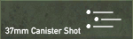           Canister shot                             Giant Shotgun, short ranged, for soft targets

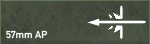            Armor Piercing (regular)                  Anti Tank/Vehicles, lots of Ammo. Useless against infantry

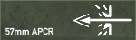          Armor Piercing (special)                  Stronger Anti Tank, limited. Useless against infantry

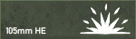       High Explosive                            Explosive, for soft targets, big splash damage

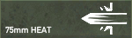          HEAT High Explosive AT (shaped charge)    Strong Antitank, slight splash damage, medium range due to arced trajectory

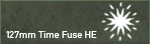      Timed HE (Airburst)                       Airburst Explosion, for Anti-Aircraft 

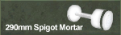       Spigot Mortar HE (huge HE)                Short-ranged, *very* powerful Explosive, giant splash damage, breaches some fortifications

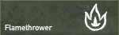      Flamethrower                              Fire, massacres infantry

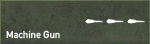        Heavy Machinegun                          Very Heavy MG, can kill Trucks, APCs and some light Tanks

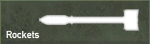           Rockets                                   Antitank rockets, usually launched from Airplane

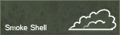        Smoke                                     Big cloud of smoke
-------------------------------------------------------------------------------------------------------------------------------------------------------------

#### (Upcoming) Sector OOB Areas

### Infantry Gameplay

#### Aiming

FH2 uses a fake sway animation (bullets still come out from the center of the screen) so don't aim where the iron sights are. You need to aim at the center of the screen. To fight the fake sway, instead of aiming a target for like 10 seconds just unzoom and zoom back the iron sights will be set back to the center of the screen, then you shoot where they aim. 

#### Shooting

-If you are an infantry soldier and you go prone, you cannot aim correctly for the first few seconds. This is done to avoid dolphin diving. So lay down, wait till your crosshair becomes smaller, then aim and return fire. Additionally, you can also crouch to get off a quick, accurate shot.

#### Parachute

There is no parachute for the normal soldier. All pilot kits have one, and can be found most commonly somewhere near an airfield. The only exceptions to this are airborne maps. If you see a kit in the spawn-screen, with a parachute icon next to it, then it too has a parachute.

To open the chute press 9 twice. You must open the chute high enough to avoid any injuries. If you open it 10m before you hit the ground, you will die.

#### Prone Weapons

Some weapons require that you go prone before using them. These include some light machineguns and both anti-tank and anti-personal mines.

#### Aiming 

You will notice that the recoil of infantry weapons is considerably higher than in normal Battlefield 2. In BF2 your gun has almost no recoil, but the bullets you shoot hit in a large area around the point you are aiming. In Fh2 all bullets hit exactly where you point the gun, but there is considerable recoil that will throw you off target. You can balance out this recoil by moving the mouse in the opposite direction while shooting. The amount and direction of recoil is different depending on caliber and weight of the gun, so it takes some practice to get it right. However, with some experience you will be able to easily get several shots on target.

#### Wounded

If you get wounded you have to use your first aid kit. You will notice a injury when cannot sprint anymore and that you get a grey view. You activate your first aid kit by throwing it on the ground, and standing on it. You will notice a cross symbole on the right side of your screen. It takes a while till you are completly healted. During the time you are wounded your minimap will loose the symbols, and you cannot sprint.

### Tank Gameplay

#### Use

A tank is a valuable asset to any team, and has the most armor of any vehicle on the battlefield. In order to successfully complete an attack, a tanker should move his tank so that he can cover any infantry around him. Additionally, infantry should try to take out any anti-tank positions before it can destroy the tank.

#### Controls

-Aiming in tanks is done by pressing the “x” key.
-Press "Ctrl" and move your mouse to look around when looking outside the cupola of a tank.

#### Ammo Types

TODO Images

Tanks have different types of ammo (see below). To change them use your mouse wheel.
-AP: Standard anti-tank shell. Best used against armored targets, as
  this shell has nearly no explosive power.
-HE: Stands for high-explosive. This shell is best used against
  soft-skin targets such as trucks and jeeps. It is also effective for
  dealing with infantry and the gunners of anti-tank guns.
-HEAT: This shell type is a special anti-tank shell that also explodes
  on contact.
-Special Shells: Most tanks and tank-destroyers in FH2 also have some
  form of special shells. These are usually extremely limited in quantity
  (2-3 per tank), but are even more effective at destroying enemy tanks
  than normal AP shells. Examples include: HVAP, Pz.Gr. 40, APCBC, and
  APDS.
-Smoke: There are two types of smoke in FH2. Most tanks have deck smoke,
  which when fired, will deploy a smoke cloud from the rear of the tank.
  However, most of the US tanks, have smoke shells, which operate like a
  normal tank shell, but will produce a large cloud of smoke upon impact.

### Aircraft Gameplay

#### Basics
-As a pilot, you serve as forward recon for your team. Be sure to announce the location of any enemy movement you see to better help your teammates on the ground.

#### Bring a Parachute
-Remember to pickup a pilot kit before you take-off. If you don't and you need to bail out, you won't have a parachute.

#### Weapon Loadout
-Some aircraft have more than 2 weapons. This could be additional cannons, or even rockets and bombs. To select these, either press the "F" key, or cycle through them using the mouse wheel.

## Install

### Standalone

### Launcher

### CMP Maps

### Tournament -> Join

## Community

### Youtube Channels

## Contribute

### Mapping Series TS4

### FH2 Mapping tutorial 

## About this page

This page's content is not my own creation, but rather a compilation
of existing tutorial, guides and tips written by other people over the
course of many years.

(incomplete) Credits:
- IrishReloaded
- TS4Ever

### UNSORTED

how do i look around in tank
how do I change the target when I'm artillery when there are many?
MAP LOADING SONGS
