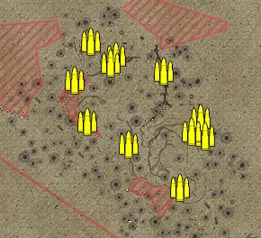
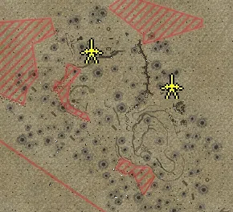
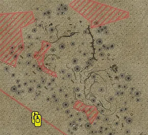

Static Ammo Crate

Static Emplacement

Vehicle

| gpo_subcat   | gpo_cat    | gpo_name   |    pos_x |   pos_y |    pos_z |   flag | is_locked   |   team | instance                                    | gpo_cat_disp       | gpo_subcat_disp   |
|:-------------|:-----------|:-----------|---------:|--------:|---------:|-------:|:------------|-------:|:--------------------------------------------|:-------------------|:------------------|
| ammo_crate   | ammo_crate | ammo_crate | -198.25  |  21.909 |  215.833 |      0 | False       |      0 | ammo_crate_0                                | Static Ammo Crate  | Static Ammo Crate |
| ammo_crate   | ammo_crate | ammo_crate |  120.635 |  22.157 | -319.57  |      0 | False       |      0 | ammo_crate_1                                | Static Ammo Crate  | Static Ammo Crate |
| ammo_crate   | ammo_crate | ammo_crate |  129.764 |  22.808 | -360.998 |      0 | False       |      0 | ammo_crate_2                                | Static Ammo Crate  | Static Ammo Crate |
| ammo_crate   | ammo_crate | ammo_crate |   73.889 |  26.152 | -473.578 |      0 | False       |      0 | ammo_crate_3                                | Static Ammo Crate  | Static Ammo Crate |
| ammo_crate   | ammo_crate | ammo_crate |  -40.114 |  24.431 | -378.606 |      0 | False       |      0 | ammo_crate_4                                | Static Ammo Crate  | Static Ammo Crate |
| ammo_crate   | ammo_crate | ammo_crate | -132.013 |  29.551 | -328.462 |      0 | False       |      0 | ammo_crate_5                                | Static Ammo Crate  | Static Ammo Crate |
| ammo_crate   | ammo_crate | ammo_crate | -160.927 |  24.798 | -236.926 |      0 | False       |      0 | ammo_crate_6                                | Static Ammo Crate  | Static Ammo Crate |
| ammo_crate   | ammo_crate | ammo_crate | -124.952 |  21.984 | -150.714 |      0 | False       |      0 | ammo_crate_7                                | Static Ammo Crate  | Static Ammo Crate |
| ammo_crate   | ammo_crate | ammo_crate |  -67.919 |  21.337 | -182.444 |      0 | False       |      0 | ammo_crate_8                                | Static Ammo Crate  | Static Ammo Crate |
| ammo_crate   | ammo_crate | ammo_crate |   38.555 |  23.705 | -216.635 |      0 | False       |      0 | ammo_crate_9                                | Static Ammo Crate  | Static Ammo Crate |
| ammo_crate   | ammo_crate | ammo_crate |  472.813 |  25.802 |  -10.622 |      0 | False       |      0 | ammo_crate_10                               | Static Ammo Crate  | Static Ammo Crate |
| ammo_crate   | ammo_crate | ammo_crate |  480.421 |  24.65  |   18.078 |      0 | False       |      0 | ammo_crate_11                               | Static Ammo Crate  | Static Ammo Crate |
| ammo_crate   | ammo_crate | ammo_crate |  536.704 |  23.862 |   26.326 |      0 | False       |      0 | ammo_crate_12                               | Static Ammo Crate  | Static Ammo Crate |
| ammo_crate   | ammo_crate | ammo_crate |  800.7   |  24.425 |  569.939 |      0 | False       |      0 | ammo_crate_13                               | Static Ammo Crate  | Static Ammo Crate |
| ammo_crate   | ammo_crate | ammo_crate |  817.626 |  26.088 |  643.231 |      0 | False       |      0 | ammo_crate_14                               | Static Ammo Crate  | Static Ammo Crate |
| ammo_crate   | ammo_crate | ammo_crate |  743.47  |  25.186 |  600.3   |      0 | False       |      0 | ammo_crate_15                               | Static Ammo Crate  | Static Ammo Crate |
| ammo_crate   | ammo_crate | ammo_crate |  480.796 |  29.904 |  570.425 |      0 | False       |      0 | ammo_crate_16                               | Static Ammo Crate  | Static Ammo Crate |
| ammo_crate   | ammo_crate | ammo_crate |  466.642 |  29.315 |  630.458 |      0 | False       |      0 | ammo_crate_17                               | Static Ammo Crate  | Static Ammo Crate |
| ammo_crate   | ammo_crate | ammo_crate |  489.265 |  31.758 |  683.957 |      0 | False       |      0 | ammo_crate_18                               | Static Ammo Crate  | Static Ammo Crate |
| ammo_crate   | ammo_crate | ammo_crate |  313.915 |  32.877 |  558.819 |      0 | False       |      0 | ammo_crate_19                               | Static Ammo Crate  | Static Ammo Crate |
| ammo_crate   | ammo_crate | ammo_crate |  240.553 |  29.002 |  565.954 |      0 | False       |      0 | ammo_crate_20                               | Static Ammo Crate  | Static Ammo Crate |
| ammo_crate   | ammo_crate | ammo_crate |  202.385 |  28.775 |  633.482 |      0 | False       |      0 | ammo_crate_21                               | Static Ammo Crate  | Static Ammo Crate |
| ammo_crate   | ammo_crate | ammo_crate |  160.952 |  24.415 |  498.708 |      0 | False       |      0 | ammo_crate_22                               | Static Ammo Crate  | Static Ammo Crate |
| ammo_crate   | ammo_crate | ammo_crate | -179.73  |  21.339 |  246.45  |      0 | False       |      0 | ammo_crate_23                               | Static Ammo Crate  | Static Ammo Crate |
| ammo_crate   | ammo_crate | ammo_crate |  100.888 |  24.254 | -349.359 |      0 | False       |      0 | ammo_crate_24                               | Static Ammo Crate  | Static Ammo Crate |
| ammo_crate   | ammo_crate | ammo_crate |  -79.218 |  21.544 | -197.274 |      0 | False       |      0 | ammo_crate_25                               | Static Ammo Crate  | Static Ammo Crate |
| ammo_crate   | ammo_crate | ammo_crate | -206.705 |  21.292 |  212.546 |      0 | False       |      0 | ammo_crate_26                               | Static Ammo Crate  | Static Ammo Crate |
| ammo_crate   | ammo_crate | ammo_crate |  811.99  |  25.285 |  628.384 |      0 | False       |      0 | ammo_crate_27                               | Static Ammo Crate  | Static Ammo Crate |
| pak          | static     | 2pdr       |  -99.447 |  21.827 | -184.33  |    203 | False       |      0 | CP_16_Alam_Halfa_7th_Motor_Brigade_2pounder | Static Emplacement | Anti-tank Gun     |
| pak          | static     | 2pdr       |   99.151 |  25.511 | -271.824 |    201 | False       |      0 | CP_16_Alam_Halfa_4th_light_armd_2pdr        | Static Emplacement | Anti-tank Gun     |
| tank         | vehicle    | pziif      | -187.397 |  24.892 | -517.269 |    205 | True        |      0 | CP_16_Alam_Halfa_Panzer_dummy_PanzerII      | Vehicle            | Tank              |
| tank         | vehicle    | pziif      | -178.49  |  24.567 | -529.648 |    205 | True        |      0 | CP_16_Alam_Halfa_Axis_Base_PanzerII         | Vehicle            | Tank              |

