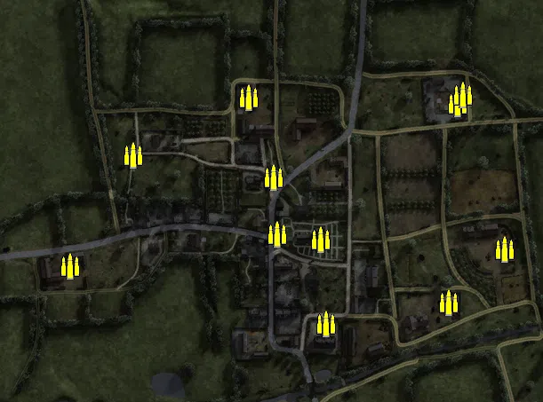
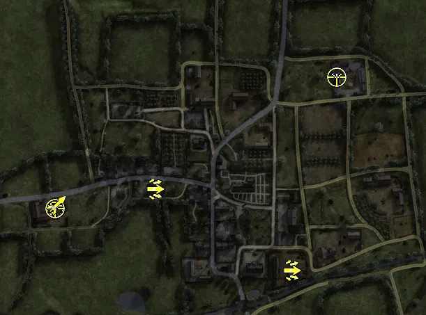
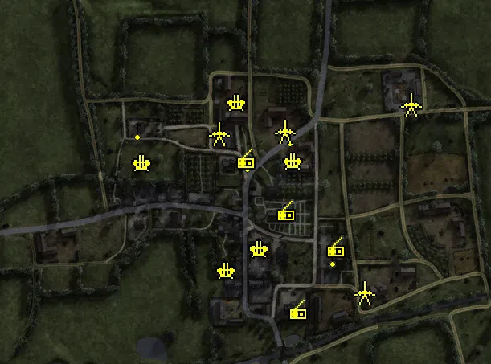
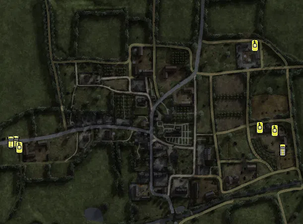

Static Ammo Crate

Pickup Kit

Static Emplacement

Vehicle

| Icon                       | SubCat            | Cat                | Name                         | Instance                               |   Flag |    X Pos |   Y Pos |    Z Pos |
|:---------------------------|:------------------|:-------------------|:-----------------------------|:---------------------------------------|-------:|---------:|--------:|---------:|
|      | Static Ammo Crate | Static Ammo Crate  | ammo_crate                   | ammo_crate_0                           |      0 |   -5.635 |  24.933 |   21.874 |
|      | Static Ammo Crate | Static Ammo Crate  | ammo_crate                   | ammo_crate_1                           |      0 | -239.484 |  25.000 |  -14.346 |
|      | Static Ammo Crate | Static Ammo Crate  | ammo_crate                   | ammo_crate_2                           |      0 | -167.657 |  28.040 |  111.296 |
|      | Static Ammo Crate | Static Ammo Crate  | ammo_crate                   | ammo_crate_3                           |      0 |  -38.197 |  30.201 |  176.382 |
|      | Static Ammo Crate | Static Ammo Crate  | ammo_crate                   | ammo_crate_4                           |      0 |  -10.048 |  27.068 |   86.177 |
|      | Static Ammo Crate | Static Ammo Crate  | ammo_crate                   | ammo_crate_5                           |      0 |  197.327 |  35.185 |  169.203 |
|      | Static Ammo Crate | Static Ammo Crate  | ammo_crate                   | ammo_crate_6                           |      0 |   48.886 |  22.707 |  -79.103 |
|      | Static Ammo Crate | Static Ammo Crate  | ammo_crate                   | ammo_crate_7                           |      0 |   43.496 |  25.695 |   15.690 |
|      | Static Ammo Crate | Static Ammo Crate  | ammo_crate                   | ammo_crate_8                           |      0 |  187.084 |  20.997 |  -54.786 |
|      | Static Ammo Crate | Static Ammo Crate  | ammo_crate                   | ammo_crate_9                           |      0 |  249.973 |  24.170 |    5.033 |
|      | Static Ammo Crate | Static Ammo Crate  | ammo_crate                   | ammo_crate_10                          |      0 |  203.345 |  38.482 |  178.683 |
|  | Deployable Arty   | Pickup Kit         | GW_PickUpMortar              | CP_32_Ancto_OBJ_sector_D_mortar        |    205 |  164.434 |  36.119 |  173.925 |
|   | Assault Kit       | Pickup Kit         | GW_PickUpAssaultG43          | CP_32_Ancto_OBJ_allied_base__0         |    202 |  -95.917 |  25.862 |   14.010 |
|   | Assault Kit       | Pickup Kit         | GW_PickUpAssaultG43          | CP_32_Ancto_OBJ_allied_base_g43        |    201 |  100.024 |  21.639 | -102.609 |
|       | Deployable MG     | Pickup Kit         | BA_PickUpVickers303          | CP_32_Ancto_OBJ_allied_base_0          |    201 | -239.446 |  25.976 |  -15.953 |
|    | Sniper Kit        | Pickup Kit         | BW_PickUpSniperNo4           | CP_32_Ancto_OBJ_allied_base_6          |    201 | -239.492 |  25.261 |  -14.302 |
|    | Sniper Kit        | Pickup Kit         | GW_PickUpSniperK98           | CP_32_Ancto_OBJ_sector_B_sniper        |    203 |  165.497 |  36.106 |  175.151 |
|    | HEAT Thrower      | Pickup Kit         | BW_PickUpAntitankPiat        | CP_32_Ancto_OBJ_allied_base_1          |    201 | -237.028 |  25.774 |   -8.853 |
|      | FIXME UNASSIGNED  | FIXME UNASSIGNED   | Objective_belgian_gate       | CP_32_Ancto_OBJ_sector_A_obj           |    202 | -205.700 |  27.837 |  129.889 |
|      | FIXME UNASSIGNED  | FIXME UNASSIGNED   | Objective_belgian_gate       | CP_32_Ancto_OBJ_sector_A_obj_0         |    202 |  -91.351 |  25.188 |   31.173 |
|      | FIXME UNASSIGNED  | FIXME UNASSIGNED   | Objective_belgian_gate       | CP_32_Ancto_OBJ_sector_A_obj_1         |    202 | -148.636 |  25.116 |   27.756 |
|      | FIXME UNASSIGNED  | FIXME UNASSIGNED   | flak18ns_fr_two              | CP_32_Ancto_OBJ_sector_D_obj           |    205 |  155.846 |  21.090 |  -57.300 |
|      | FIXME UNASSIGNED  | FIXME UNASSIGNED   | flak18ns_fr_two              | CP_32_Ancto_OBJ_sector_D_obj_0         |    205 |  144.614 |  31.448 |  116.996 |
|      | Anti-aircraft Gun | Static Emplacement | flak18ns_fr                  | CP_32_Ancto_OBJ_sector_A_obj_2         |    202 | -141.384 |  28.009 |   82.777 |
|      | Anti-aircraft Gun | Static Emplacement | flak38_france                | CP_32_Ancto_OBJ_sector_B_obj           |    203 |   46.931 |  29.950 |   85.127 |
|      | Anti-aircraft Gun | Static Emplacement | flak38_france                | CP_32_Ancto_OBJ_sector_B_obj_1         |    203 |  -23.465 |  29.153 |  157.696 |
|      | Anti-aircraft Gun | Static Emplacement | flakvierling38_france        | CP_32_Ancto_OBJ_sector_C_obj           |    204 |    5.219 |  24.173 |  -23.738 |
|      | Anti-aircraft Gun | Static Emplacement | flakvierling38_france        | CP_32_Ancto_OBJ_sector_C_obj_1         |    204 |  -35.546 |  23.018 |  -50.942 |
|       | Static MG         | Static Emplacement | mg42_bipod                   | CP_32_Anctoville_1944_axis_eglise_mg42 |    204 |   96.221 |  27.282 |  -33.495 |
|       | Static MG         | Static Emplacement | mg42_bipod                   | CP_32_Ancto_OBJ_sector_A_MG42          |    202 | -146.905 |  31.997 |  124.650 |
|       | Static MG         | Static Emplacement | mg42_bipod                   | CP_32_Ancto_OBJ_sector_B_mg42          |    203 |   37.075 |  41.742 |   23.636 |
|       | Static MG         | Static Emplacement | mg34_bipod                   | CP_32_Ancto_OBJ_sector_B_mg34          |    203 |   43.337 |  29.894 |  117.004 |
|       | Static MG         | Static Emplacement | mg42_bipod                   | CP_32_Ancto_OBJ_sector_B_mg42_0        |    203 |  -10.050 |  28.446 |   85.457 |
|       | Anti-tank Gun     | Static Emplacement | pak40                        | CP_32_Ancto_OBJ_sector_A_pak           |    202 |  -45.674 |  28.024 |  119.640 |
|       | Anti-tank Gun     | Static Emplacement | pak40                        | CP_32_Ancto_OBJ_sector_B_pak           |    203 |   36.356 |  28.978 |  123.061 |
|       | Anti-tank Gun     | Static Emplacement | pak40                        | CP_32_Ancto_OBJ_sector_C_pak           |    204 |  135.201 |  20.935 |  -78.221 |
|       | Anti-tank Gun     | Static Emplacement | pak40                        | CP_32_Ancto_OBJ_sector_D_pak           |    205 |  193.320 |  35.190 |  156.129 |
|     | Radio             | Static Emplacement | hqradio2                     | CP_32_Ancto_OBJ_sector_B_obj_0         |    203 |   37.947 |  35.186 |   21.702 |
|     | Radio             | Static Emplacement | hqradio2                     | CP_32_Ancto_OBJ_sector_B_obj_2         |    203 |  -12.332 |  27.069 |   86.622 |
|     | Radio             | Static Emplacement | hqradio1                     | CP_32_Ancto_OBJ_sector_C_obj2          |    204 |   53.143 |  27.462 | -100.845 |
|     | Radio             | Static Emplacement | hqradio1                     | CP_32_Ancto_OBJ_sector_C_obj_0         |    204 |  100.072 |  23.695 |  -23.314 |
|       | APC               | Vehicle            | m5a1_halftrack               | CP_32_Ancto_OBJ_sector_A_apc           |    202 | -285.902 |  24.905 |    0.184 |
|       | APC               | Vehicle            | universalcarrier_france_bren | CP_32_Ancto_OBJ_allied_base_           |    201 | -295.825 |  24.900 |   -0.738 |
|       | Car               | Vehicle            | opelblitz_fr                 | CP_32_Ancto_OBJ_sector_D_truck         |    205 |  252.378 |  23.195 |  -17.370 |
|      | Tank              | Vehicle            | panthera_late_alt            | CP_32_Ancto_OBJ_sector_D_obj_1         |    205 |  195.591 |  36.053 |  193.935 |
|      | Tank              | Vehicle            | panthera_late_alt            | CP_32_Ancto_OBJ_sector_D_obj_2         |    205 |  205.704 |  23.195 |   27.966 |
|      | Tank              | Vehicle            | churchillmkiv_75mm           | CP_32_Ancto_OBJ_allied_base_Tank       |    201 | -278.936 |  24.995 |  -12.319 |
|      | Tank              | Vehicle            | pzivh_811                    | CP_32_Ancto_OBJ_sector_D_assaultgun    |    205 |  236.482 |  23.195 |   22.354 |

