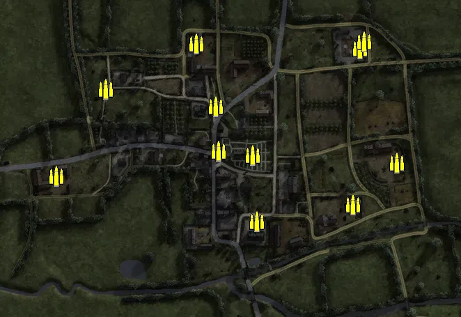
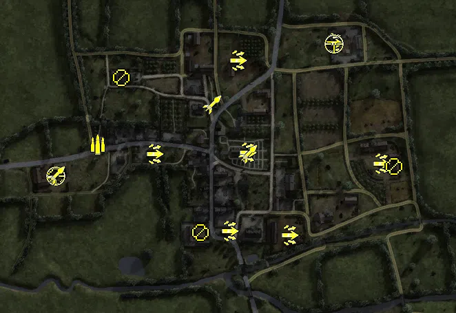
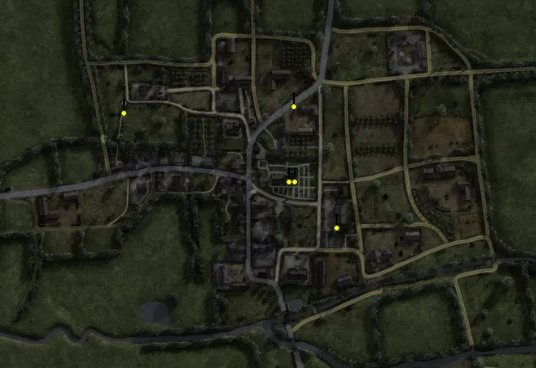
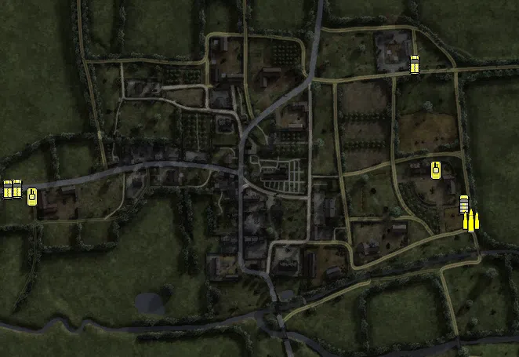

Static Ammo Crate

Pickup Kit

Static Emplacement

Vehicle

| gpo_subcat   | gpo_cat    | gpo_name                     |    pos_x |   pos_y |    pos_z |   flag | is_locked   |   team | instance                                        | gpo_cat_disp       | gpo_subcat_disp   |
|:-------------|:-----------|:-----------------------------|---------:|--------:|---------:|-------:|:------------|-------:|:------------------------------------------------|:-------------------|:------------------|
| ammo_crate   | ammo_crate | ammo_crate                   |   -5.635 |  24.933 |   21.874 |      0 | False       |      0 | ammo_crate_0                                    | Static Ammo Crate  | Static Ammo Crate |
| ammo_crate   | ammo_crate | ammo_crate                   | -239.484 |  25     |  -14.346 |      0 | False       |      0 | ammo_crate_1                                    | Static Ammo Crate  | Static Ammo Crate |
| ammo_crate   | ammo_crate | ammo_crate                   | -167.657 |  28.04  |  111.296 |      0 | False       |      0 | ammo_crate_2                                    | Static Ammo Crate  | Static Ammo Crate |
| ammo_crate   | ammo_crate | ammo_crate                   |  -38.197 |  30.201 |  176.382 |      0 | False       |      0 | ammo_crate_3                                    | Static Ammo Crate  | Static Ammo Crate |
| ammo_crate   | ammo_crate | ammo_crate                   |  -10.048 |  27.068 |   86.177 |      0 | False       |      0 | ammo_crate_4                                    | Static Ammo Crate  | Static Ammo Crate |
| ammo_crate   | ammo_crate | ammo_crate                   |  197.327 |  35.185 |  169.203 |      0 | False       |      0 | ammo_crate_5                                    | Static Ammo Crate  | Static Ammo Crate |
| ammo_crate   | ammo_crate | ammo_crate                   |   48.886 |  22.707 |  -79.103 |      0 | False       |      0 | ammo_crate_6                                    | Static Ammo Crate  | Static Ammo Crate |
| ammo_crate   | ammo_crate | ammo_crate                   |   43.496 |  25.695 |   15.69  |      0 | False       |      0 | ammo_crate_7                                    | Static Ammo Crate  | Static Ammo Crate |
| ammo_crate   | ammo_crate | ammo_crate                   |  187.084 |  20.997 |  -54.786 |      0 | False       |      0 | ammo_crate_8                                    | Static Ammo Crate  | Static Ammo Crate |
| ammo_crate   | ammo_crate | ammo_crate                   |  249.973 |  24.17  |    5.033 |      0 | False       |      0 | ammo_crate_9                                    | Static Ammo Crate  | Static Ammo Crate |
| ammo_crate   | ammo_crate | ammo_crate                   |  203.345 |  38.482 |  178.683 |      0 | False       |      0 | ammo_crate_10                                   | Static Ammo Crate  | Static Ammo Crate |
| ammo         | kit        | BW_PickUpAmmokit             | -178.206 |  25.568 |   29.15  |    104 | False       |      0 | Rue_de_la_Fontaine_UKAmmo                       | Pickup Kit         | Ammo Kit          |
| arty_dep     | kit        | GW_PickUpMortar              |  164.434 |  36.119 |  173.925 |    108 | False       |      0 | CP_64_Anctoville_Les_Ecuries_MORTAR             | Pickup Kit         | Deployable Arty   |
| assault      | kit        | GW_PickUpAssaultStG44        |   13.089 |  23.775 |  -96.962 |    107 | False       |      0 | Mairie_STG44                                    | Pickup Kit         | Assault Kit       |
| assault      | kit        | GW_PickUpAssaultG43          |  -96.102 |  25.862 |   15.492 |    104 | False       |      0 | Rue_de_la_Fontaine_G43                          | Pickup Kit         | Assault Kit       |
| assault      | kit        | GW_PickUpAssaultG43          |   25.125 |  33.899 |  151.181 |    102 | False       |      0 | G43_2                                           | Pickup Kit         | Assault Kit       |
| assault      | kit        | GW_PickUpAssaultG43          |  164.651 |  36.108 |  175.521 |    108 | False       |      0 | G43_3                                           | Pickup Kit         | Assault Kit       |
| assault      | kit        | GW_PickUpAssaultG43          |  232.858 |  23.576 |    1.082 |    101 | False       |      0 | G43_4                                           | Pickup Kit         | Assault Kit       |
| assault      | kit        | GW_PickUpAssaultG43          |   39.385 |  26.295 |   17.051 |    106 | False       |      0 | CP_64_Anctoville_L_Eglise_g43                   | Pickup Kit         | Assault Kit       |
| assault      | kit        | GW_PickUpAssaultG43          |  100.226 |  21.626 | -102.625 |    107 | False       |      0 | CP_64_Anctoville_Mairie_g43                     | Pickup Kit         | Assault Kit       |
| mg           | kit        | BW_PickUpSupportBrenMK1      |  -29.116 |  22.85  |  -99.415 |    107 | False       |      0 | Mairie_Bren                                     | Pickup Kit         | MG Kit            |
| mg           | kit        | GW_PickUpSupportMG42         |  252.029 |  26.985 |   -2.549 |    101 | False       |      0 | les_Fermes_a_l_Est_Mg42                         | Pickup Kit         | MG Kit            |
| mg_dep       | kit        | BA_PickUpVickers303          | -238.08  |  26.001 |  -17.203 |    105 | False       |      0 | Britmain_deployMG                               | Pickup Kit         | Deployable MG     |
| mg_dep       | kit        | BA_PickUpVickers303          | -143.689 |  28.091 |  126.003 |    104 | False       |      0 | Rue_de_la_Fontaine_Bren                         | Pickup Kit         | Deployable MG     |
| sniper       | kit        | GW_PickUpSniperK98           |  165.497 |  36.106 |  175.151 |    108 | False       |      0 | CP_64_Anctoville_Les_Ecuries_SNIPER             | Pickup Kit         | Sniper Kit        |
| sniper       | kit        | BW_PickUpSniperNo4           | -239.355 |  25.978 |  -16.642 |    105 | False       |      0 | BritMain_sniper                                 | Pickup Kit         | Sniper Kit        |
| zooka        | kit        | BW_PickUpAntitankPiat        | -238.971 |  25.972 |  -15.873 |    105 | False       |      0 | BritMain_PIAT                                   | Pickup Kit         | HEAT Thrower      |
| zooka        | kit        | GW_PickUpPanzerfaust30m      |  -12.182 |  27.078 |   86.671 |    106 | False       |      0 | north_faust                                     | Pickup Kit         | HEAT Thrower      |
| zooka        | kit        | GW_PickUpPanzerfaust30m      |   40.455 |  25.101 |   14.912 |    106 | False       |      0 | CP_64_Anctoville_L_Eglise_faust                 | Pickup Kit         | HEAT Thrower      |
| mg_nest      | static     | mg34_bipod                   | -167.25  |  28.878 |  109.317 |    104 | False       |      0 | Rue_de_la_Fontaine_axis_mg34                    | Static Emplacement | Static MG         |
| mg_nest      | static     | mg42_bipod                   |   37.075 |  41.742 |   23.636 |    106 | False       |      0 | CP_64_Anctoville_L_Eglise_mg42                  | Static Emplacement | Static MG         |
| mg_nest      | static     | mg34_bipod                   |   43.351 |  29.892 |  116.988 |    102 | False       |      0 | Secteur_Nord_mg34                               | Static Emplacement | Static MG         |
| mg_nest      | static     | lewis_bipod                  |   43.713 |  41.964 |   23.682 |    106 | False       |      0 | CP_64_Anctoville_L_Eglise_lewis                 | Static Emplacement | Static MG         |
| mg_nest      | static     | mg42_bipod                   |   96.221 |  27.282 |  -33.495 |    101 | False       |      0 | CP_64_Anctoville_les_Fermes_a_l_Est_mg42        | Static Emplacement | Static MG         |
| apc          | vehicle    | universalcarrier_france_bren | -297.754 |  24.9   |   -0.954 |    105 | False       |      2 | CP_64_Anctoville_Quartiers_Britanniques_carrier | Vehicle            | APC               |
| apc          | vehicle    | m5a1_halftrack               | -310.141 |  24.899 |   -2.446 |    105 | False       |      0 | Britanniques_m5a1_spawn                         | Vehicle            | APC               |
| apc          | vehicle    | sdkfz251_d                   |  209.397 |  35.185 |  157.208 |    108 | False       |      0 | CP_64_Anctoville_Les_Ecuries_spawn_hanomag      | Vehicle            | APC               |
| car          | vehicle    | opelblitz_fr                 |  271.999 |  22.502 |  -21.334 |    101 | False       |      0 | German_Counterattackdummy_TRUCK                 | Vehicle            | Car               |
| supply       | vehicle    | opelblitz_fr_ammo            |  281.236 |  22.057 |  -41.525 |    101 | False       |      0 | German_Counterattackdummy_AMMO                  | Vehicle            | Supply Vehicle    |
| tank         | vehicle    | m4a1mid_eu_brit              | -278.859 |  25     |  -12.085 |    105 | True        |      2 | CP_64_Anctoville_Quartiers_Britanniques_tank    | Vehicle            | Tank              |
| tank         | vehicle    | pzivh_811                    |  236.482 |  23.195 |   22.354 |    101 | True        |      0 | CP_64_Anctoville_les_Fermes_a_l_Est_pz          | Vehicle            | Tank              |

