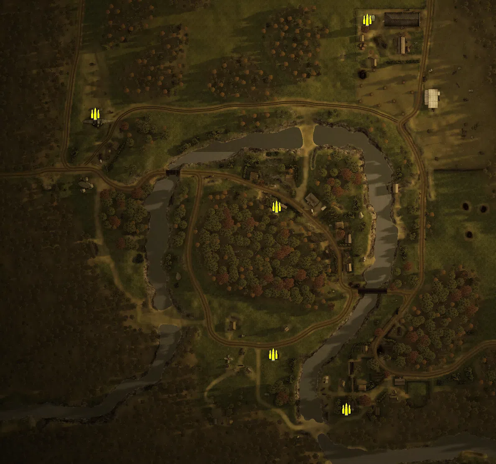
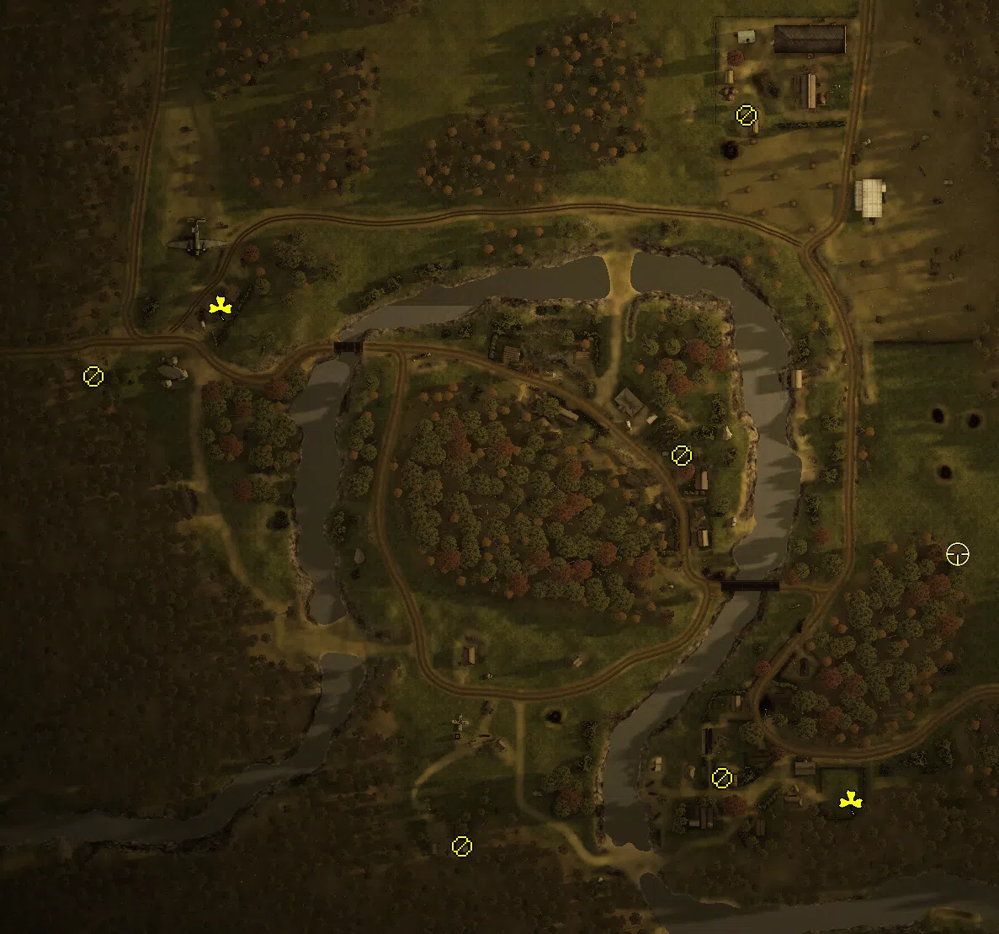
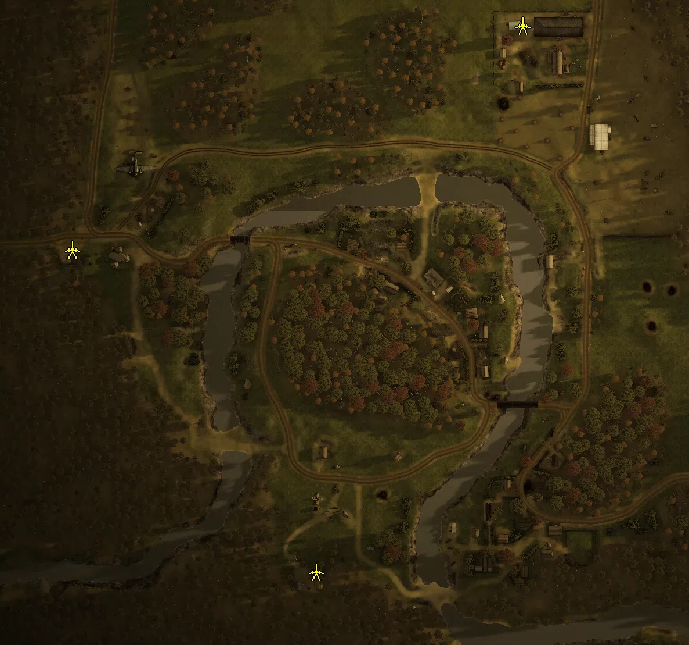

Static Ammo Crate

Pickup Kit

Static Emplacement

Vehicle

| gpo_subcat   | gpo_cat    | gpo_name                   |    pos_x |   pos_y |    pos_z |   flag | is_locked   |   team | instance                                   | gpo_cat_disp       | gpo_subcat_disp   |
|:-------------|:-----------|:---------------------------|---------:|--------:|---------:|-------:|:------------|-------:|:-------------------------------------------|:-------------------|:------------------|
| ammo_crate   | ammo_crate | ammo_crate                 |   14.806 | 152.127 |  158.248 |      0 | False       |      0 | ammo_crate_0                               | Static Ammo Crate  | Static Ammo Crate |
| ammo_crate   | ammo_crate | ammo_crate                 |  -93.47  | 149.25  |  -65.628 |      0 | False       |      0 | ammo_crate_1                               | Static Ammo Crate  | Static Ammo Crate |
| ammo_crate   | ammo_crate | ammo_crate                 |  -97.381 | 148.321 | -241.962 |      0 | False       |      0 | ammo_crate_2                               | Static Ammo Crate  | Static Ammo Crate |
| ammo_crate   | ammo_crate | ammo_crate                 |  -10.024 | 149.857 | -307.566 |      0 | False       |      0 | ammo_crate_3                               | Static Ammo Crate  | Static Ammo Crate |
| ammo_crate   | ammo_crate | ammo_crate                 | -310.471 | 148.892 |   45.666 |      0 | False       |      0 | ammo_crate_4                               | Static Ammo Crate  | Static Ammo Crate |
| ammo_crate   | ammo_crate | ammo_crate                 |  330.683 | 147.98  | -301.76  |      0 | False       |      0 | ammo_crate_5                               | Static Ammo Crate  | Static Ammo Crate |
| ammo_crate   | ammo_crate | ammo_crate                 | -345.073 | 148.429 |  389.721 |      0 | False       |      0 | ammo_crate_6                               | Static Ammo Crate  | Static Ammo Crate |
| at_rifle     | kit        | RE_PickUpAntitankPTRD      |    4.716 | 151.44  | -280.34  |     16 | False       |      0 | CP_32_Arad_EastVillage_DE_RE_AntitankFaust | Pickup Kit         | AT Rifle          |
| at_rifle     | kit        | RE_PickUpAntitankPTRD      | -150.212 | 150.412 | -320.844 |     15 | False       |      0 | CP_32_arad_southfield_DE_RE_AntitankFaust  | Pickup Kit         | AT Rifle          |
| at_rifle     | kit        | RE_PickUpAntitankPTRD      |  -19.264 | 151.13  |  -89.13  |     13 | False       |      0 | CP_32_arad_westvillage_DE_RE_AntitankFaust | Pickup Kit         | AT Rifle          |
| at_rifle     | kit        | RE_PickUpAntitankPTRD      |   19.235 | 150.825 |  113.074 |     14 | False       |      0 | CP_32_arad_northfield_DE_RE_AntitankFaust  | Pickup Kit         | AT Rifle          |
| at_rifle     | kit        | RE_PickUpAntitankPTRD      | -369.168 | 150.682 |  -42.178 |     17 | False       |      0 | CP_32_arad_crashsite_DE_RE_AntitankFaust   | Pickup Kit         | AT Rifle          |
| easteregg    | kit        | GW_PickUpFarmer            |   81.159 | 149.649 | -294.809 |     16 | False       |      0 | CP_32_Arad_EastVillage_DE_RE_Farmer        | Pickup Kit         | Easteregg         |
| easteregg    | kit        | GW_PickUpDrilling          | -293.542 | 149.516 |   -1.622 |     17 | False       |      0 | CP_32_arad_crashsite_DE_RE_Pilot           | Pickup Kit         | Easteregg         |
| sniper       | kit        | RE_PickUpSniper            |  144.471 | 152.592 | -147.42  |     16 | False       |      0 | CP_32_Arad_EastVillage_DE_RE_Sniper        | Pickup Kit         | Sniper Kit        |
| noidea       | noidea     | t34_76_m43_camo            | -153.533 | 149.847 | -295.888 |     15 | True        |      2 | CP_32_arad_southfield_t3476_2              | FIXME UNASSIGNED   | FIXME UNASSIGNED  |
| noidea       | noidea     | t34_76_m43_camo            | -190.064 | 148.303 | -285.964 |     15 | True        |      2 | CP_32_arad_southfield_t3476_4              | FIXME UNASSIGNED   | FIXME UNASSIGNED  |
| pak          | static     | zis3_static                | -362.706 | 150.245 |  -33.161 |     17 | False       |      0 | CP_32_arad_crashsite_zis3_static           | Static Emplacement | Anti-tank Gun     |
| pak          | static     | zis3                       |   25.523 | 149.091 |  159.558 |     14 | False       |      0 | CP_32_arad_northfield_at_gun               | Static Emplacement | Anti-tank Gun     |
| pak          | static     | zis3                       | -152.35  | 149.025 | -310.058 |     15 | False       |      0 | CP_32_arad_southfield_at_gun               | Static Emplacement | Anti-tank Gun     |
| apc          | vehicle    | sdkfz251_d_ard             |   42.796 | 149.099 |  131.289 |     14 | False       |      0 | CP_32_arad_northfield_sdkfz251d_north      | Vehicle            | APC               |
| apc          | vehicle    | universalcarrier_russia_dt |   68.485 | 148.747 | -265.97  |     16 | False       |      0 | CP_32_Arad_EastVillage_transport           | Vehicle            | APC               |
| apc          | vehicle    | universalcarrier_russia_dt | -368.353 | 149.874 |  -21.421 |     17 | False       |      0 | CP_32_arad_crashsite_transport             | Vehicle            | APC               |
| tank         | vehicle    | pzivh                      |   23.168 | 150.04  |  115.729 |     14 | True        |      1 | CP_32_arad_northfield_pivh                 | Vehicle            | Tank              |
| tank         | vehicle    | stug40                     |   30.141 | 149.242 |  154.578 |     14 | True        |      1 | CP_32_arad_northfield_stug                 | Vehicle            | Tank              |
| tank         | vehicle    | t34_76_m43                 | -184.546 | 148.274 | -285.813 |     15 | True        |      2 | CP_32_arad_southfield_t3476_1              | Vehicle            | Tank              |
| tank         | vehicle    | t34_76_m43                 | -147.471 | 149.86  | -296.003 |     15 | True        |      2 | CP_32_arad_southfield_t3476_3              | Vehicle            | Tank              |

