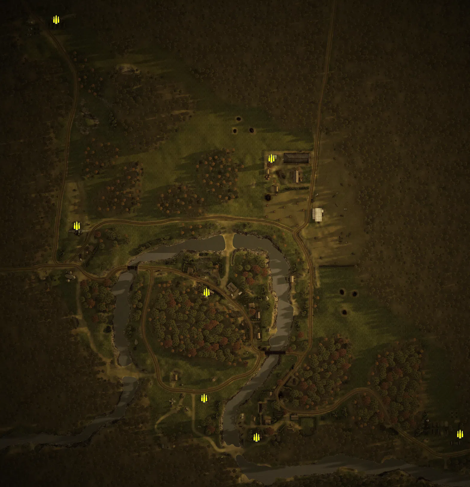
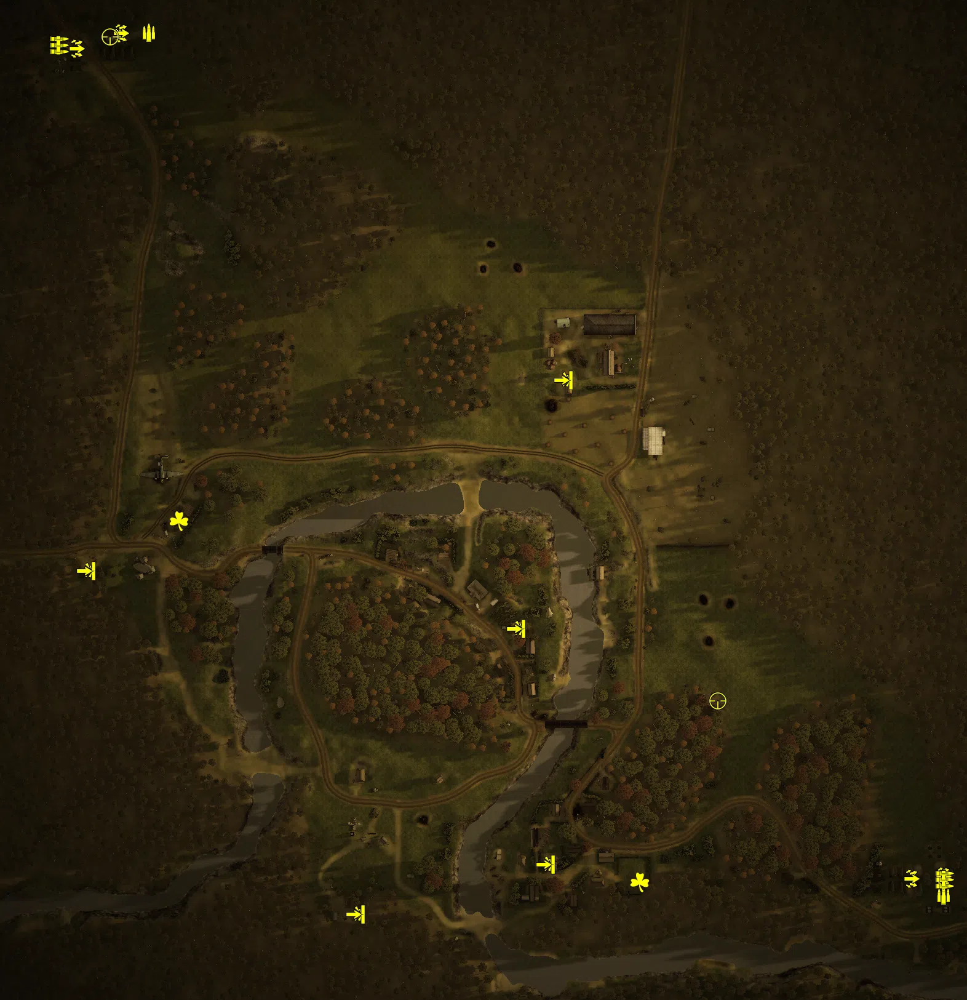
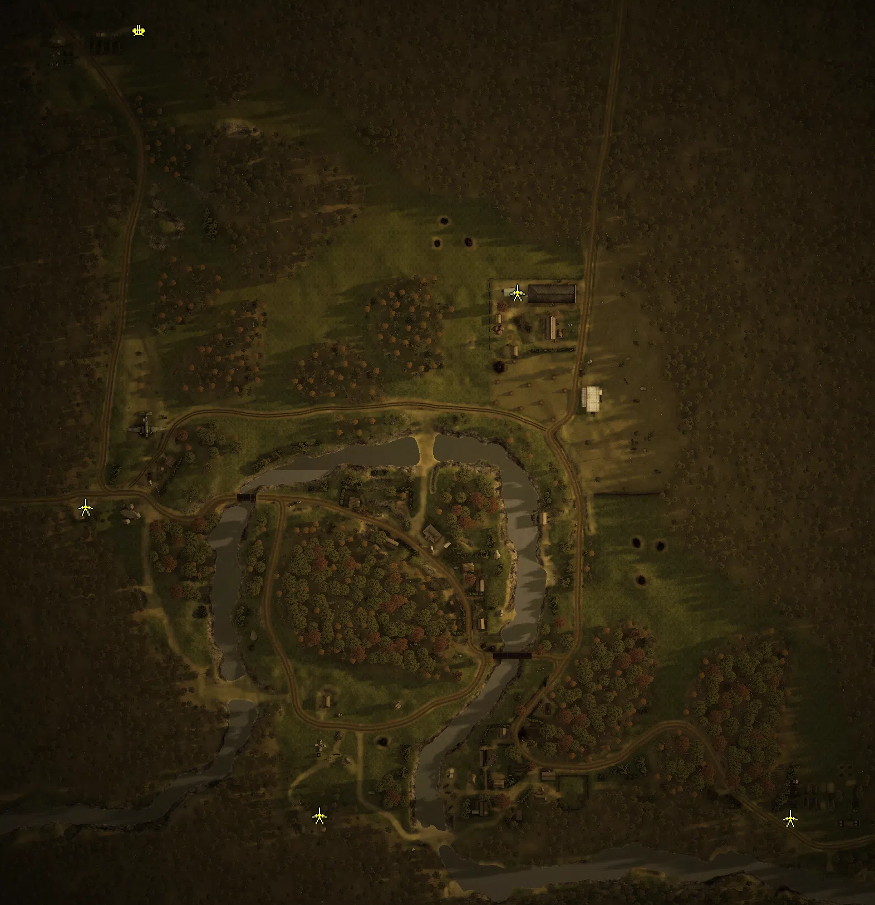
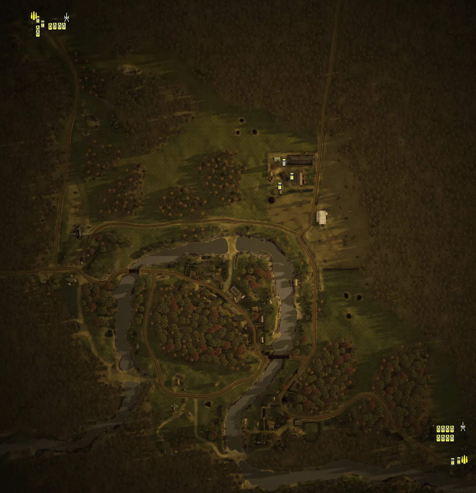

Static Ammo Crate

Pickup Kit

Static Emplacement

Vehicle

| gpo_subcat   | gpo_cat    | gpo_name                   |    pos_x |   pos_y |    pos_z |   flag | is_locked   |   team | instance                                        | gpo_cat_disp       | gpo_subcat_disp   |
|:-------------|:-----------|:---------------------------|---------:|--------:|---------:|-------:|:------------|-------:|:------------------------------------------------|:-------------------|:------------------|
| ammo_crate   | ammo_crate | ammo_crate                 |   14.806 | 152.127 |  158.248 |      0 | False       |      0 | ammo_crate_0                                    | Static Ammo Crate  | Static Ammo Crate |
| ammo_crate   | ammo_crate | ammo_crate                 |  -93.47  | 149.25  |  -65.628 |      0 | False       |      0 | ammo_crate_1                                    | Static Ammo Crate  | Static Ammo Crate |
| ammo_crate   | ammo_crate | ammo_crate                 |  -97.381 | 148.321 | -241.962 |      0 | False       |      0 | ammo_crate_2                                    | Static Ammo Crate  | Static Ammo Crate |
| ammo_crate   | ammo_crate | ammo_crate                 |  -10.024 | 149.857 | -307.566 |      0 | False       |      0 | ammo_crate_3                                    | Static Ammo Crate  | Static Ammo Crate |
| ammo_crate   | ammo_crate | ammo_crate                 | -310.471 | 148.892 |   45.666 |      0 | False       |      0 | ammo_crate_4                                    | Static Ammo Crate  | Static Ammo Crate |
| ammo_crate   | ammo_crate | ammo_crate                 |  330.683 | 147.98  | -301.76  |      0 | False       |      0 | ammo_crate_5                                    | Static Ammo Crate  | Static Ammo Crate |
| ammo_crate   | ammo_crate | ammo_crate                 | -345.073 | 148.429 |  389.721 |      0 | False       |      0 | ammo_crate_6                                    | Static Ammo Crate  | Static Ammo Crate |
| ammo         | kit        | RE_PickUpAmmokit           | -318.155 | 150.165 |  395.393 |      4 | False       |      0 | CP_64_Arad_23rdPanzerDivision_DE_RE_Ammo        | Pickup Kit         | Ammo Kit          |
| ammo         | kit        | RE_PickUpAmmokit           |  328.007 | 148.654 | -305.466 |      6 | False       |      0 | CP_64_Arad_18thTankCorps_DE_RE_Ammo             | Pickup Kit         | Ammo Kit          |
| arty_dep     | kit        | GW_PickUpMortar            | -342.061 | 149.111 |  395.347 |      4 | False       |      0 | CP_64_Arad_23rdPanzerDivision_DE_RE_Mortar      | Pickup Kit         | Deployable Arty   |
| assault      | kit        | RE_PickupAssaultSVT40      | -340.952 | 148.75  |  395.096 |      4 | False       |      0 | CP_64_Arad_23rdPanzerDivision_DE_RE_Assault     | Pickup Kit         | Assault Kit       |
| assault      | kit        | RE_PickupAssaultSVT40      | -377.021 | 149.417 |  382.746 |      4 | False       |      0 | CP_64_Arad_23rdPanzerDivision_DE_RE_Assault_2   | Pickup Kit         | Assault Kit       |
| assault      | kit        | RE_PickupAssaultSVT40      |  301.688 | 149.063 | -292.067 |      6 | False       |      0 | CP_64_Arad_18thTankCorps_DE_RE_Assault_1        | Pickup Kit         | Assault Kit       |
| assault      | kit        | RE_PickupAssaultSVT40      |  327.581 | 148.833 | -289.98  |      6 | False       |      0 | CP_64_Arad_18thTankCorps_DE_RE_Assault_2        | Pickup Kit         | Assault Kit       |
| at_rifle     | kit        | RE_PickUpAntitankPTRD      |    4.716 | 151.44  | -280.34  |      5 | False       |      0 | CP_64_Arad_EastVillage_DE_RE_AntitankFaust      | Pickup Kit         | AT Rifle          |
| at_rifle     | kit        | RE_PickUpAntitankPTRD      | -150.212 | 150.412 | -320.844 |      3 | False       |      0 | CP_64_arad_southfield_DE_RE_AntitankFaust       | Pickup Kit         | AT Rifle          |
| at_rifle     | kit        | RE_PickUpAntitankPTRD      |  -19.264 | 151.13  |  -89.13  |      1 | False       |      0 | CP_64_arad_westvillage_DE_RE_AntitankFaust      | Pickup Kit         | AT Rifle          |
| at_rifle     | kit        | RE_PickUpAntitankPTRD      |   19.235 | 150.825 |  113.074 |      2 | False       |      0 | CP_64_arad_northfield_DE_RE_AntitankFaust       | Pickup Kit         | AT Rifle          |
| at_rifle     | kit        | RE_PickUpAntitankPTRD      | -369.168 | 150.682 |  -42.178 |      7 | False       |      0 | CP_64_arad_crashsite_DE_RE_AntitankFaust        | Pickup Kit         | AT Rifle          |
| easteregg    | kit        | GW_PickUpFarmer            |   81.159 | 149.649 | -294.809 |      5 | False       |      0 | CP_64_Arad_EastVillage_DE_RE_Farmer             | Pickup Kit         | Easteregg         |
| easteregg    | kit        | GW_PickUpDrilling          | -293.542 | 149.516 |   -1.622 |      7 | False       |      0 | CP_64_arad_crashsite_DE_RE_Pilot                | Pickup Kit         | Easteregg         |
| mg           | kit        | RE_PickupMG_DT             | -390.417 | 149.248 |  385.093 |      4 | False       |      0 | CP_64_Arad_23rdPanzerDivision_DE_RE_SupportMG42 | Pickup Kit         | MG Kit            |
| mg           | kit        | RE_PickupMG_DT             |  328.911 | 148.793 | -292.863 |      6 | False       |      0 | CP_64_Arad_18thTankCorps_DE_RE_SupportMG42      | Pickup Kit         | MG Kit            |
| sniper       | kit        | RE_PickUpSniper            | -349.739 | 149.241 |  391.899 |      4 | False       |      0 | CP_64_Arad_23rdPanzerDivision_DE_RE_Sniper      | Pickup Kit         | Sniper Kit        |
| sniper       | kit        | RE_PickUpSniper            |  144.471 | 152.592 | -147.42  |      6 | False       |      0 | CP_64_Arad_18thTankCorps_DE_RE_Sniper           | Pickup Kit         | Sniper Kit        |
| flak         | static     | flak18_fr                  | -314.066 | 149.902 |  394.437 |      4 | False       |      0 | CP_64_Arad_23rdPanzerDivision_flak18            | Static Emplacement | Anti-aircraft Gun |
| pak          | static     | zis3_static                |  270.627 | 148.3   | -312.685 |      6 | False       |      0 | CP_64_Arad_18thTankCorps_zis3                   | Static Emplacement | Anti-tank Gun     |
| pak          | static     | zis3_static                | -362.706 | 150.245 |  -33.161 |      7 | False       |      0 | CP_64_arad_crashsite_zis3_static                | Static Emplacement | Anti-tank Gun     |
| pak          | static     | zis3                       |   25.523 | 149.091 |  159.558 |      2 | False       |      0 | CP_64_arad_northfield_at_gun                    | Static Emplacement | Anti-tank Gun     |
| pak          | static     | zis3                       | -152.35  | 149.026 | -310.058 |      3 | False       |      0 | CP_64_arad_southfield_at_gun                    | Static Emplacement | Anti-tank Gun     |
| apc          | vehicle    | universalcarrier_russia_dt |  308.681 | 148.24  | -338.364 |      6 | False       |      0 | CP_64_Arad_18thTankCorps_universal_carrier_1    | Vehicle            | APC               |
| apc          | vehicle    | universalcarrier_russia_dt |  318.421 | 148.179 | -337.132 |      6 | False       |      0 | CP_64_Arad_18thTankCorps_universal_carrier_2    | Vehicle            | APC               |
| apc          | vehicle    | sdkfz251_d_ard             | -376.736 | 148.38  |  390.149 |      4 | False       |      0 | CP_64_Arad_23rdPanzerDivision_sdkfz251d_1       | Vehicle            | APC               |
| apc          | vehicle    | sdkfz251_d_ard             | -368.736 | 148.441 |  382.525 |      4 | False       |      0 | CP_64_Arad_23rdPanzerDivision_sdkfz251d_2       | Vehicle            | APC               |
| apc          | vehicle    | sdkfz251_d                 |   23.168 | 150.04  |  115.729 |      2 | False       |      0 | CP_64_arad_northfield_universal_carrier_north   | Vehicle            | APC               |
| apc          | vehicle    | sdkfz251_d_ard             |   42.796 | 149.099 |  131.289 |      2 | False       |      0 | CP_64_arad_northfield_sdkfz251d_north           | Vehicle            | APC               |
| arty_sp      | vehicle    | katjusha_bm13              |  325.172 | 148.026 | -280.436 |      6 | True        |      0 | CP_64_Arad_18thTankCorps_BM13                   | Vehicle            | Mobile Arty       |
| arty_sp      | vehicle    | wespe                      | -329.418 | 148.437 |  393.979 |      4 | True        |      0 | CP_64_Arad_23rdPanzerDivision_wespe             | Vehicle            | Mobile Arty       |
| civilian     | vehicle    | redtractor                 |   30.141 | 149.242 |  154.578 |      4 | False       |      0 | CP_64_Arad_23rdPanzerDivision_redtractor        | Vehicle            | Civilian Vehicle  |
| supply       | vehicle    | opelblitz_ard_ammo         | -382.931 | 147.643 |  396.43  |      4 | False       |      0 | CP_64_Arad_23rdPanzerDivision_ammotruck         | Vehicle            | Supply Vehicle    |
| supply       | vehicle    | studebaker_us6_ammo        |  328.033 | 148.443 | -335.169 |      6 | False       |      0 | CP_64_Arad_18thTankCorps_ammotruck              | Vehicle            | Supply Vehicle    |
| tank         | vehicle    | su_152                     |  307.5   | 148.026 | -300     |      6 | True        |      2 | CP_64_Arad_18thTankCorps_su152                  | Vehicle            | Tank              |
| tank         | vehicle    | t34_85_early               |  300     | 148.026 | -285     |      6 | True        |      2 | CP_64_Arad_18thTankCorps_t3485_1                | Vehicle            | Tank              |
| tank         | vehicle    | t34_76_m43                 |  292.5   | 148.026 | -285     |      6 | True        |      2 | CP_64_Arad_18thTankCorps_t3476_1                | Vehicle            | Tank              |
| tank         | vehicle    | t34_76_m43                 |  285     | 147.958 | -285     |      6 | True        |      2 | CP_64_Arad_18thTankCorps_t3476_2                | Vehicle            | Tank              |
| tank         | vehicle    | t34_85_early               |  300     | 148.026 | -300     |      6 | True        |      2 | CP_64_Arad_18thTankCorps_t3485_4                | Vehicle            | Tank              |
| tank         | vehicle    | kv1_s                      |  292.5   | 148.026 | -300     |      6 | True        |      2 | CP_64_Arad_18thTankCorps_kv1s                   | Vehicle            | Tank              |
| tank         | vehicle    | su_76m                     |  285     | 148.026 | -300     |      6 | True        |      2 | CP_64_Arad_18thTankCorps_su76                   | Vehicle            | Tank              |
| tank         | vehicle    | pzivh                      | -340.715 | 148.441 |  379     |      4 | True        |      1 | CP_64_Arad_23rdPanzerDivision_pivh_1            | Vehicle            | Tank              |
| tank         | vehicle    | stug40                     | -348.323 | 148.441 |  378.88  |      4 | True        |      1 | CP_64_Arad_23rdPanzerDivision_stug              | Vehicle            | Tank              |
| tank         | vehicle    | pzivh                      | -355.819 | 148.441 |  378.406 |      4 | True        |      1 | CP_64_Arad_23rdPanzerDivision_pivh_2            | Vehicle            | Tank              |
| tank         | vehicle    | Panther_G_Ard              | -376.496 | 148.441 |  374.321 |      4 | True        |      1 | CP_64_Arad_23rdPanzerDivision_panther_2         | Vehicle            | Tank              |
| tank         | vehicle    | Panther_G_Ard              | -376.496 | 148.441 |  366.821 |      4 | True        |      1 | CP_64_Arad_23rdPanzerDivision_panther_1         | Vehicle            | Tank              |
| tank         | vehicle    | su_152                     |  307.5   | 148.026 | -285     |      6 | True        |      2 | CP_64_Arad_18thTankCorps_su152r                 | Vehicle            | Tank              |
| tank         | vehicle    | tiger_late                 | -333.453 | 148.441 |  379     |      4 | True        |      0 | CP_64_Arad_23rdPanzerDivision_tiger             | Vehicle            | Tank              |

