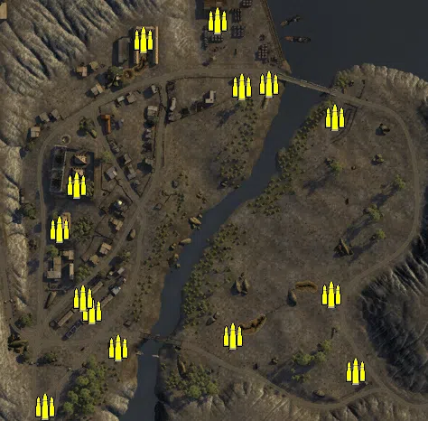
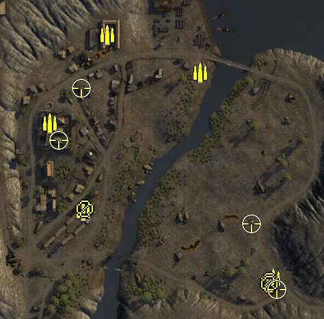
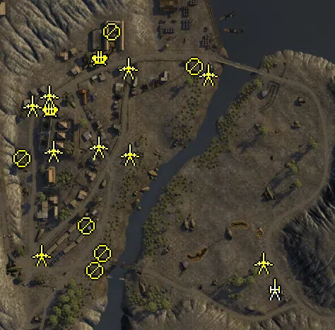
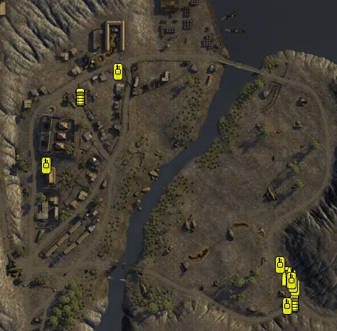

Static Ammo Crate

Pickup Kit

Static Emplacement

Vehicle

| gpo_subcat   | gpo_cat    | gpo_name                |    pos_x |   pos_y |    pos_z |   flag | is_locked   |   team | instance                                         | gpo_cat_disp       | gpo_subcat_disp   |
|:-------------|:-----------|:------------------------|---------:|--------:|---------:|-------:|:------------|-------:|:-------------------------------------------------|:-------------------|:------------------|
| ammo_crate   | ammo_crate | ammo_crate              |  127.415 |  23.299 | -104.781 |      0 | False       |      0 | ammo_crate_0                                     | Static Ammo Crate  | Static Ammo Crate |
| ammo_crate   | ammo_crate | ammo_crate              | -137.736 |  36.193 | -122.637 |      0 | False       |      0 | ammo_crate_1                                     | Static Ammo Crate  | Static Ammo Crate |
| ammo_crate   | ammo_crate | ammo_crate              | -148.274 |  36.262 | -109.26  |      0 | False       |      0 | ammo_crate_2                                     | Static Ammo Crate  | Static Ammo Crate |
| ammo_crate   | ammo_crate | ammo_crate              | -155.326 |  49.648 |   16.131 |      0 | False       |      0 | ammo_crate_3                                     | Static Ammo Crate  | Static Ammo Crate |
| ammo_crate   | ammo_crate | ammo_crate              |  -80.562 |  39.248 |  176.795 |      0 | False       |      0 | ammo_crate_4                                     | Static Ammo Crate  | Static Ammo Crate |
| ammo_crate   | ammo_crate | ammo_crate              |   57.899 |  27.165 |  127.808 |      0 | False       |      0 | ammo_crate_5                                     | Static Ammo Crate  | Static Ammo Crate |
| ammo_crate   | ammo_crate | ammo_crate              |  130.542 |  25.828 |   91.077 |      0 | False       |      0 | ammo_crate_6                                     | Static Ammo Crate  | Static Ammo Crate |
| ammo_crate   | ammo_crate | ammo_crate              |  153.859 |  25.697 | -190.322 |      0 | False       |      0 | ammo_crate_7                                     | Static Ammo Crate  | Static Ammo Crate |
| ammo_crate   | ammo_crate | ammo_crate              | -189.745 |  42.896 | -229.181 |      0 | False       |      0 | ammo_crate_8                                     | Static Ammo Crate  | Static Ammo Crate |
| ammo_crate   | ammo_crate | ammo_crate              | -174.138 |  43.931 |  -33.053 |      0 | False       |      0 | ammo_crate_9                                     | Static Ammo Crate  | Static Ammo Crate |
| ammo_crate   | ammo_crate | ammo_crate              |   28.498 |  31.178 |  124.563 |      0 | False       |      0 | ammo_crate_10                                    | Static Ammo Crate  | Static Ammo Crate |
| ammo_crate   | ammo_crate | ammo_crate              | -109.146 |  33.886 | -163.7   |      0 | False       |      0 | ammo_crate_11                                    | Static Ammo Crate  | Static Ammo Crate |
| ammo_crate   | ammo_crate | ammo_crate              |    1.308 |  27.742 |  198.263 |      0 | False       |      0 | ammo_crate_12                                    | Static Ammo Crate  | Static Ammo Crate |
| ammo_crate   | ammo_crate | ammo_crate              |   18.16  |  24.493 | -150.81  |      0 | False       |      0 | ammo_crate_13                                    | Static Ammo Crate  | Static Ammo Crate |
| ammo         | kit        | BA_PickUpAmmokit        |  159.605 |  25.544 | -186.296 |    105 | False       |      0 | CP_64_bardia_AIF_DE_GB_AmmoCrates                | Pickup Kit         | Ammo Kit          |
| ammo         | kit        | BA_PickUpAmmokit        |   53.463 |  26.698 |  114.863 |    104 | False       |      0 | CP_64_bardia_City_Hospital_DE_GB_AmmoCrates      | Pickup Kit         | Ammo Kit          |
| ammo         | kit        | BA_PickUpAmmokit        |  -82.759 |  38.467 |  169.804 |    104 | False       |      0 | CP_64_bardia_City_Hospital_DE_GB_AmmoCrates_0    | Pickup Kit         | Ammo Kit          |
| ammo         | kit        | BA_PickUpAmmokit        | -166.52  |  48.897 |   41.113 |    102 | False       |      0 | CP_64_bardia_Hospital_DE_GB_AmmoCrates           | Pickup Kit         | Ammo Kit          |
| ammo         | kit        | BA_PickUpAmmokit        | -117.69  |  36.045 |  -86.665 |    101 | False       |      0 | CP_64_bardia_Barracks_DE_GB_AmmoCrates           | Pickup Kit         | Ammo Kit          |
| mg           | kit        | BA_PickUpSupportLewis   |  154.258 |  25.731 | -190.187 |    105 | False       |      0 | CP_64_bardia_AIF_DE_GB_Support2                  | Pickup Kit         | MG Kit            |
| mg           | kit        | BA_PickUpSupportLewis   | -115.726 |  36.078 |  -83.76  |    101 | False       |      0 | CP_64_bardia_Barracks_DE_GB_Support2             | Pickup Kit         | MG Kit            |
| mg_dep       | kit        | BA_PickUpVickers303     |  154.218 |  25.695 | -193.666 |    105 | False       |      0 | CP_64_bardia_AIF_DE_GB_Support                   | Pickup Kit         | Deployable MG     |
| sniper       | kit        | BA_PickUpSniperNo4      |  164.726 |  28.092 | -202.076 |    105 | False       |      0 | CP_64_bardia_AIF_DE_GB_Sniper                    | Pickup Kit         | Sniper Kit        |
| sniper       | kit        | IA_PickUpSniperPattern  | -153.578 |  49.646 |   16.178 |    102 | False       |      0 | CP_64_bardia_Hospital_DE_GB_Sniper               | Pickup Kit         | Sniper Kit        |
| sniper       | kit        | IA_PickUpSniperPattern  | -121.055 |  47.736 |   91.518 |    104 | False       |      0 | CP_64_bardia_Hospital_DE_GB_Sniper_0             | Pickup Kit         | Sniper Kit        |
| sniper       | kit        | BA_PickUpSniperNo4      |  128.116 |  23.296 | -106.269 |    105 | False       |      0 | CP_64_bardia_AIF_DE_GB_Sniper_0                  | Pickup Kit         | Sniper Kit        |
| noidea       | noidea     | commander_smoke_allied  | -247.1   |  82.259 |  221.023 |    102 | True        |      0 | CP_64_bardia_Hospital_DE_GB_CommSmoke            | FIXME UNASSIGNED   | FIXME UNASSIGNED  |
| noidea       | noidea     | commander_mortar_allied | -247.156 |  81.364 |  215.721 |    102 | True        |      0 | CP_64_bardia_Hospital_DE_GB_CommMortar           | FIXME UNASSIGNED   | FIXME UNASSIGNED  |
| noidea       | noidea     | commander_mortar_allied |  511.9   |  26     | -146.396 |    105 | True        |      0 | CP_64_bardia_AIF_DE_GB_CommMortar                | FIXME UNASSIGNED   | FIXME UNASSIGNED  |
| noidea       | noidea     | commander_smoke_allied  |  511.9   |  26     | -162.695 |    105 | True        |      0 | CP_64_bardia_AIF_DE_GB_CommSmoke                 | FIXME UNASSIGNED   | FIXME UNASSIGNED  |
| arty         | static     | 3inchmortar             |  148.151 |  25.308 | -187.465 |    105 | False       |      0 | CP_64_bardia_AIF_DE_GB_LightMortar               | Static Emplacement | Artillery         |
| flak         | static     | flak18ns                | -167.54  |  47.85  |   66.408 |    102 | False       |      0 | CP_64_bardia_Hospital_DE_GB_HeavyArtillery       | Static Emplacement | Anti-aircraft Gun |
| flak         | static     | flak18ns                |  -98.167 |  37.532 |  138.727 |    104 | False       |      0 | CP_64_bardia_City_Hospital_DE_GB_HeavyArtillery  | Static Emplacement | Anti-aircraft Gun |
| mg_nest      | static     | bredam37_bipod          | -118.278 |  37.104 |  -98.199 |    101 | False       |      0 | CP_64_bardia_Barracks_DE_GB_MedMG                | Static Emplacement | Static MG         |
| mg_nest      | static     | bredam37_bipod          |  -95.143 |  33.701 | -136.764 |    101 | False       |      0 | CP_64_bardia_Barracks_DE_GB_MedMG_0              | Static Emplacement | Static MG         |
| mg_nest      | static     | bredam37_bipod          | -105.964 |  34.839 | -160.786 |    101 | False       |      0 | CP_64_bardia_Barracks_DE_GB_MedMG_1              | Static Emplacement | Static MG         |
| mg_nest      | static     | bredam37_bipod          | -209.388 |  43.669 |   -3.415 |    102 | False       |      0 | CP_64_bardia_Hospital_DE_GB_MedMG                | Static Emplacement | Static MG         |
| mg_nest      | static     | bredam37_bipod          |  -81.516 |  39.5   |  176.043 |    104 | False       |      0 | CP_64_bardia_City_Hospital_DE_GB_MedMG           | Static Emplacement | Static MG         |
| mg_nest      | static     | bredam37_bipod          |   34.648 |  32.508 |  126.881 |    103 | False       |      0 | CP_64_bardia_River_outpost_DE_GB_MedMG           | Static Emplacement | Static MG         |
| pak          | static     | cannone_da_47_32_static | -181.594 |  36.267 | -138.686 |    101 | False       |      0 | CP_64_bardia_Barracks_DE_GB_LightArtillery2      | Static Emplacement | Anti-tank Gun     |
| pak          | static     | cannone_da_47_32_static | -165.483 |  49.255 |    8.409 |    102 | False       |      0 | CP_64_bardia_Hospital_DE_GB_StaticArtillery      | Static Emplacement | Anti-tank Gun     |
| pak          | static     | cannone_da_47_32_static | -194.634 |  49.235 |   72.465 |    102 | False       |      0 | CP_64_bardia_Hospital_DE_GB_LightArtillery2      | Static Emplacement | Anti-tank Gun     |
| pak          | static     | cannone_da_47_32_static | -170.814 |  48.104 |   86.407 |    102 | False       |      0 | CP_64_bardia_Hospital_DE_GB_LightArtillery2_0    | Static Emplacement | Anti-tank Gun     |
| pak          | static     | cannone_da_47_32_static | -101.362 |  41.155 |   13.6   |    102 | False       |      0 | CP_64_bardia_Hospital_DE_GB_LightArtillery2_1    | Static Emplacement | Anti-tank Gun     |
| pak          | static     | cannone_da_47_32_static |  -56.746 |  37.645 |    3.295 |    102 | False       |      0 | CP_64_bardia_Hospital_DE_GB_LightArtillery2_2    | Static Emplacement | Anti-tank Gun     |
| pak          | static     | cannone_da_47_32_static |  -59.29  |  38.29  |  125.234 |    102 | False       |      0 | CP_64_bardia_Hospital_DE_GB_StaticArtillery_0    | Static Emplacement | Anti-tank Gun     |
| pak          | static     | cannone_da_47_32_static |   54.347 |  26.921 |  116.351 |    104 | False       |      0 | CP_64_bardia_City_Hospital_DE_GB_LightArtillery2 | Static Emplacement | Anti-tank Gun     |
| pak          | static     | 2pdr                    |  131.694 |  28.649 | -150.398 |    105 | False       |      0 | CP_64_bardia_AIF_DE_GB_LightArtillery2           | Static Emplacement | Anti-tank Gun     |
| radio        | static     | gercommradio            | -112.1   |  36.051 | -103.105 |    101 | False       |      0 | CP_64_bardia_Barracks_DE_GB_CommRadio            | Static Emplacement | Radio             |
| radio        | static     | gercommradio            | -168.377 |  43.236 |  -25.759 |    102 | False       |      0 | CP_64_bardia_Hospital_DE_GB_CommRadio            | Static Emplacement | Radio             |
| radio        | static     | britcommradio           |  154.271 |  25.696 | -192.152 |    105 | False       |      0 | CP_64_bardia_AIF_DE_GB_CommRadio                 | Static Emplacement | Radio             |
| radio        | static     | oldradioallied          | -174.3   |  43.236 |  -21.388 |    105 | False       |      0 | CP_64_bardia_AIF_DE_GB_OldRadio                  | Static Emplacement | Radio             |
| car          | vehicle    | bedfordox               | -126.681 |  44.725 |   84.504 |    102 | False       |      0 | CP_64_bardia_Hospital_DE_GB_Truck1               | Vehicle            | Car               |
| car          | vehicle    | bedfordoyd              |  165.031 |  25.528 | -165.581 |    105 | False       |      0 | CP_64_bardia_AIF_DE_GB_Truck1                    | Vehicle            | Car               |
| car          | vehicle    | bedfordox               |  174.305 |  25.336 | -204.753 |    105 | False       |      0 | CP_64_bardia_AIF_DE_GB_Truck2                    | Vehicle            | Car               |
| supply       | vehicle    | bedfordoyd_ammo         |  166.96  |  25.308 | -169.757 |    105 | False       |      0 | CP_64_bardia_AIF_DE_GB_TruckAmmo                 | Vehicle            | Supply Vehicle    |
| tank         | vehicle    | matildaii               |  163.753 |  24.354 | -209.66  |    105 | True        |      0 | CP_64_bardia_AIF_DE_GB_HeavyTank3                | Vehicle            | Tank              |
| tank         | vehicle    | cruiseriv               |  174.54  |  25.36  | -183.841 |    105 | True        |      0 | CP_64_bardia_AIF_DE_GB_MediumTank4               | Vehicle            | Tank              |
| tank         | vehicle    | cruiseriv               |  171.986 |  25.186 | -178.885 |    105 | True        |      0 | CP_64_bardia_AIF_DE_GB_MediumTank4_0             | Vehicle            | Tank              |
| tank         | vehicle    | markvi                  |  169.879 |  25.243 | -174.439 |    105 | True        |      0 | CP_64_bardia_AIF_DE_GB_LightArmour2              | Vehicle            | Tank              |
| tank         | vehicle    | carrom13_40             | -174.851 |  42.011 |  -12.158 |    102 | True        |      0 | CP_64_bardia_Hospital_DE_GB_ItalianMedTank       | Vehicle            | Tank              |
| tank         | vehicle    | carrom13_40             |  -74.098 |  38.093 |  120.165 |    104 | True        |      0 | CP_64_bardia_City_Hospital_DE_GB_ItalianMedTank  | Vehicle            | Tank              |
| tank         | vehicle    | carrom13_40_au          |  154.345 |  26.718 | -151.573 |    105 | True        |      0 | CP_64_bardia_AIF_DE_GB_ItalianHeavyTank          | Vehicle            | Tank              |

