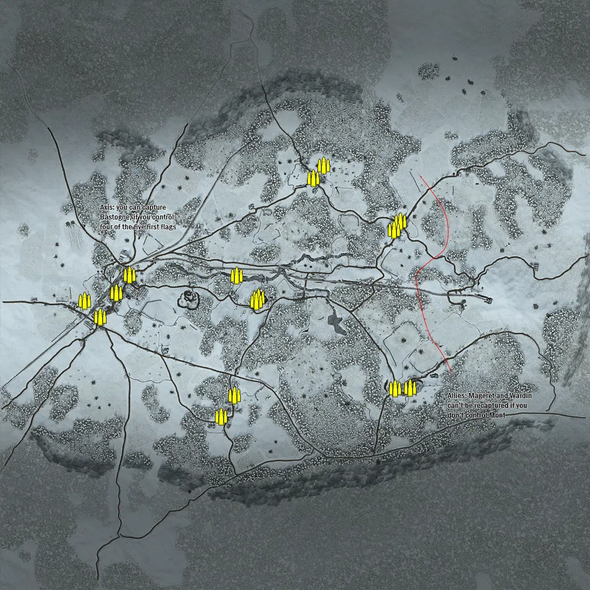
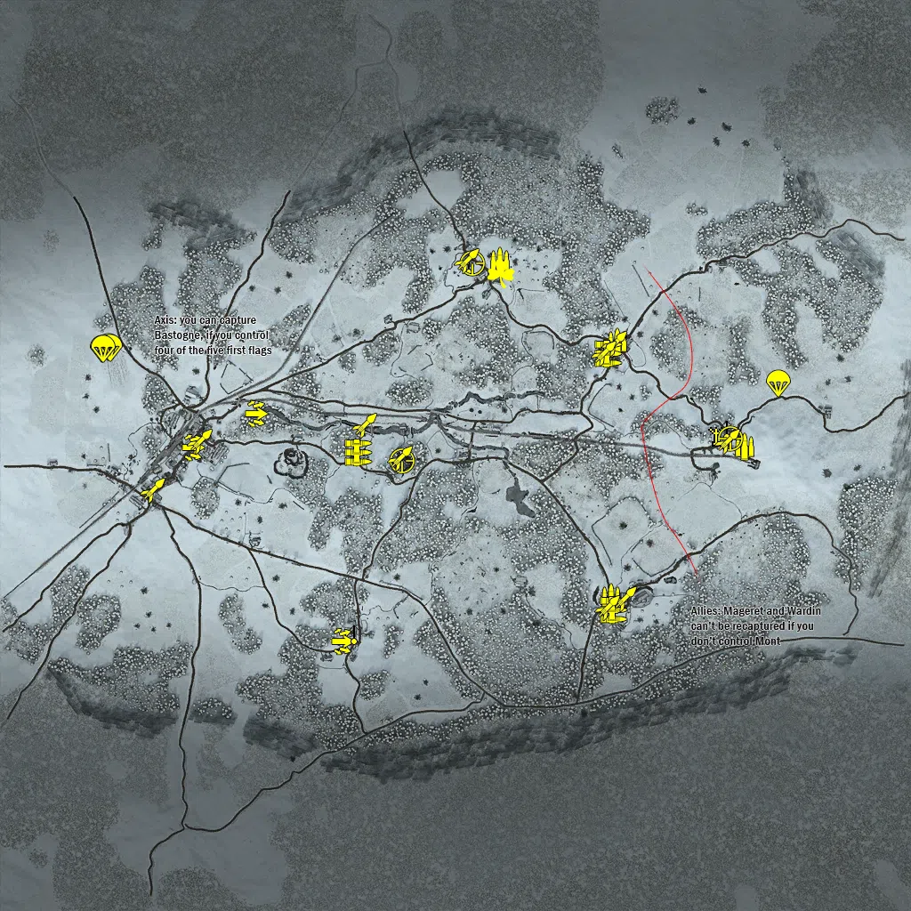
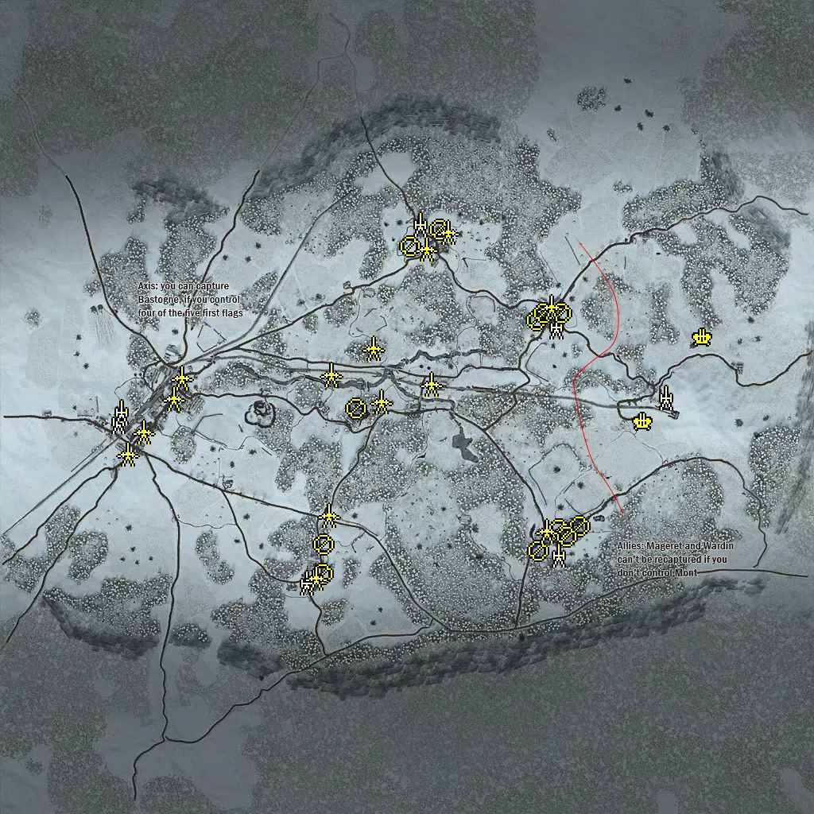
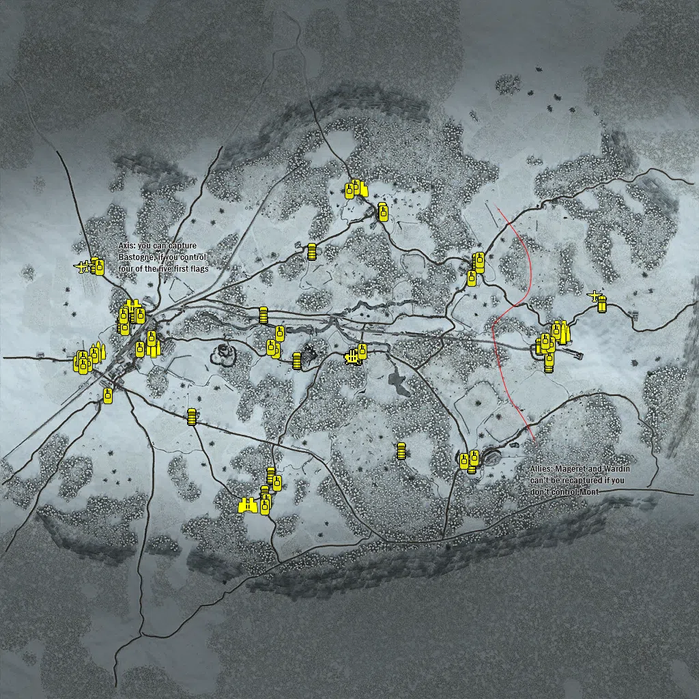

Static Ammo Crate

Pickup Kit

Static Emplacement

Vehicle

| gpo_subcat   | gpo_cat    | gpo_name                   |     pos_x |   pos_y |    pos_z |   flag | is_locked   |   team | instance                                       | gpo_cat_disp       | gpo_subcat_disp   |
|:-------------|:-----------|:---------------------------|----------:|--------:|---------:|-------:|:------------|-------:|:-----------------------------------------------|:-------------------|:------------------|
| ammo_crate   | ammo_crate | ammo_crate                 |   366.535 | 141.868 |  256.835 |      0 | False       |      0 | ammo_crate_0                                   | Static Ammo Crate  | Static Ammo Crate |
| ammo_crate   | ammo_crate | ammo_crate                 |   344.317 | 142.555 |  226.7   |      0 | False       |      0 | ammo_crate_1                                   | Static Ammo Crate  | Static Ammo Crate |
| ammo_crate   | ammo_crate | ammo_crate                 |    63.581 | 143.275 |  405.847 |      0 | False       |      0 | ammo_crate_2                                   | Static Ammo Crate  | Static Ammo Crate |
| ammo_crate   | ammo_crate | ammo_crate                 |   100.016 | 150.512 |  449.995 |      0 | False       |      0 | ammo_crate_3                                   | Static Ammo Crate  | Static Ammo Crate |
| ammo_crate   | ammo_crate | ammo_crate                 |   399.605 | 148.133 | -322.947 |      0 | False       |      0 | ammo_crate_4                                   | Static Ammo Crate  | Static Ammo Crate |
| ammo_crate   | ammo_crate | ammo_crate                 |   347.998 | 145.584 | -324.019 |      0 | False       |      0 | ammo_crate_5                                   | Static Ammo Crate  | Static Ammo Crate |
| ammo_crate   | ammo_crate | ammo_crate                 |  -255.663 | 163.664 | -422.188 |      0 | False       |      0 | ammo_crate_6                                   | Static Ammo Crate  | Static Ammo Crate |
| ammo_crate   | ammo_crate | ammo_crate                 |  -209.499 | 159.02  | -347.668 |      0 | False       |      0 | ammo_crate_7                                   | Static Ammo Crate  | Static Ammo Crate |
| ammo_crate   | ammo_crate | ammo_crate                 |  -126.953 | 139.234 |   -7.128 |      0 | False       |      0 | ammo_crate_8                                   | Static Ammo Crate  | Static Ammo Crate |
| ammo_crate   | ammo_crate | ammo_crate                 |  -202.578 | 127.216 |   68.81  |      0 | False       |      0 | ammo_crate_9                                   | Static Ammo Crate  | Static Ammo Crate |
| ammo_crate   | ammo_crate | ammo_crate                 |  -573.751 | 138.045 |   69.295 |      0 | False       |      0 | ammo_crate_10                                  | Static Ammo Crate  | Static Ammo Crate |
| ammo_crate   | ammo_crate | ammo_crate                 |  -620.006 | 138.941 |    7.838 |      0 | False       |      0 | ammo_crate_11                                  | Static Ammo Crate  | Static Ammo Crate |
| ammo_crate   | ammo_crate | ammo_crate                 |  -729.839 | 146.994 |  -19.068 |      0 | False       |      0 | ammo_crate_12                                  | Static Ammo Crate  | Static Ammo Crate |
| ammo_crate   | ammo_crate | ammo_crate                 |  -133.948 | 137.926 |  -21.115 |      0 | False       |      0 | ammo_crate_13                                  | Static Ammo Crate  | Static Ammo Crate |
| ammo_crate   | ammo_crate | ammo_crate                 |  -676.009 | 139.702 |  -76.627 |      0 | False       |      0 | ammo_crate_14                                  | Static Ammo Crate  | Static Ammo Crate |
| ammo         | kit        | UW_PickUpAmmokit           |   364.882 | 141.761 |  256.224 |    102 | False       |      0 | conq_64_mageret_DE_GB_Ammo                     | Pickup Kit         | Ammo Kit          |
| ammo         | kit        | UW_PickUpAmmokit           |   650.351 | 150.97  |   19.428 |      1 | False       |      0 | conq_64_lehr_DE_US_Ammo                        | Pickup Kit         | Ammo Kit          |
| ammo         | kit        | UW_PickUpAmmokit           |   350.968 | 145.309 | -317.304 |    101 | False       |      0 | conq_64_wardin_DE_US_Ammo                      | Pickup Kit         | Ammo Kit          |
| ammo         | kit        | UW_PickUpAmmokit           |    99.944 | 149.233 |  438.485 |      3 | False       |      0 | conq_64_bizory_DE_US_Ammo                      | Pickup Kit         | Ammo Kit          |
| arty_dep     | kit        | UW_PickUpMortar            |   583.089 | 147.98  |   47.259 |      1 | False       |      0 | conq_64_lehr_DE_US_Mortar                      | Pickup Kit         | Deployable Arty   |
| assault      | kit        | UW_PickUpWinchester        |  -255.7   | 164.652 | -418.768 |      4 | False       |      0 | conq_64_marvie_DE_US_Winchester                | Pickup Kit         | Assault Kit       |
| assault      | kit        | UW_PickUpWinchester        |  -591.133 | 138.455 |   18.741 |    103 | False       |      0 | conq_64_bastogne_trainstation_DE_US_Winchester | Pickup Kit         | Assault Kit       |
| assault      | kit        | UW_PickUpWinchester        |  -450.06  | 132.895 |   93.175 |    103 | False       |      0 | conq_64_bastogne_trainstation_easter           | Pickup Kit         | Assault Kit       |
| easteregg    | kit        | GW_PickUpFarmer            |   102.93  | 141.661 |  408.848 |      1 | False       |      0 | conq_64_lehr_DE_US_Drilling                    | Pickup Kit         | Easteregg         |
| mg           | kit        | UW_PickUpSupportM1918BAR   |  -217.366 | 132.245 |    6.86  |    105 | False       |      0 | conq_64_mont_DE_US_SupportMG42                 | Pickup Kit         | MG Kit            |
| mg           | kit        | UW_PickUpSupportM1918BAR   |   355.566 | 147.749 | -347.485 |    101 | False       |      0 | conq_64_wardin_DE_US_SupportMG42               | Pickup Kit         | MG Kit            |
| mg           | kit        | UW_PickUpSupportM1918BAR   |   343.372 | 142.53  |  227.245 |    102 | False       |      0 | conq_64_mageret_DE_US_SupportMG42              | Pickup Kit         | MG Kit            |
| mg_dep       | kit        | UW_PickUp30Cal             |   609.789 | 144.467 |   62.294 |      1 | False       |      0 | conq_64_lehr_DE_US_DepMG                       | Pickup Kit         | Deployable MG     |
| mg_dep       | kit        | UW_PickUp30Cal             |    29.225 | 151.369 |  431.541 |      3 | False       |      0 | conq_64_bizory_DE_US_DepMG                     | Pickup Kit         | Deployable MG     |
| mg_dep       | kit        | UW_PickUp30Cal             |  -228.697 | 161.761 | -397.508 |      4 | False       |      0 | conq_64_marvie_DE_US_DepMG                     | Pickup Kit         | Deployable MG     |
| parachute    | kit        | UW_PickUpPilotcolt1911     |  -779.455 | 157.431 |  244.965 |    103 | False       |      0 | conq_64_allied_airsupport_6                    | Pickup Kit         | Parachute Kit     |
| parachute    | kit        | UW_PickUpPilotcolt1911     |  -793.818 | 157.531 |  240.552 |    103 | False       |      0 | conq_64_allied_airsupport_8                    | Pickup Kit         | Parachute Kit     |
| parachute    | kit        | UW_PickUpPilotcolt1911     |  -776.322 | 157.424 |  242.915 |    103 | False       |      0 | conq_64_allied_airsupport_0_3                  | Pickup Kit         | Parachute Kit     |
| parachute    | kit        | UW_PickUpPilotcolt1911     |  -792.46  | 157.482 |  239.639 |    103 | False       |      0 | conq_64_allied_airsupport_Medic                | Pickup Kit         | Parachute Kit     |
| parachute    | kit        | UW_PickUpPilotcolt1911     |   725.128 | 115.353 |  161.343 |      1 | False       |      0 | conq_64_lehr_Medic                             | Pickup Kit         | Parachute Kit     |
| sniper       | kit        | UW_PickUpSniperSpringfield |   617.231 | 144.148 |   37.521 |      1 | False       |      0 | conq_64_lehr_DE_US_Sniper                      | Pickup Kit         | Sniper Kit        |
| sniper       | kit        | UW_PickUpSniperSpringfield |    37.895 | 152.248 |  432.129 |      3 | False       |      0 | conq_64_bizory_DE_US_Sniper                    | Pickup Kit         | Sniper Kit        |
| sniper       | kit        | UW_PickUpSniperSpringfield |  -119.598 | 143.546 |  -12.237 |    105 | False       |      0 | conq_64_mont_DE_US_Sniper2                     | Pickup Kit         | Sniper Kit        |
| zooka        | kit        | UW_PickUpBazookaM9         |   611.614 | 144.006 |   31.908 |      1 | False       |      0 | conq_64_lehr_DE_US_Antitank                    | Pickup Kit         | HEAT Thrower      |
| zooka        | kit        | GW_PickUpPanzerfaust100m   |   380.428 | 147.617 | -322.239 |    101 | False       |      0 | conq_64_wardin_DE_US_Antitank                  | Pickup Kit         | HEAT Thrower      |
| zooka        | kit        | GW_PickUpPanzerfaust100m   |   358.492 | 141.527 |  251.489 |    102 | False       |      0 | conq_64_mageret_DE_US_Antitank                 | Pickup Kit         | HEAT Thrower      |
| zooka        | kit        | UW_PickUpBazookaM9         |    26.38  | 151.513 |  437.197 |      3 | False       |      0 | conq_64_bizory_DE_US_Antitank                  | Pickup Kit         | HEAT Thrower      |
| zooka        | kit        | UW_PickUpBazookaM9         |  -124.649 | 139.939 |   -5.368 |    105 | False       |      0 | conq_64_mont_DE_US_Antitank                    | Pickup Kit         | HEAT Thrower      |
| zooka        | kit        | UW_PickUpBazookaM9         |  -574.959 | 139.117 |   31.186 |    103 | False       |      0 | conq_64_bastogne_trainstation_DE_US_Antitank   | Pickup Kit         | HEAT Thrower      |
| zooka        | kit        | UW_PickUpBazookaM9         |  -204.628 | 127.235 |   68.932 |    105 | False       |      0 | conq_64_mont_DE_US_Antitank_0                  | Pickup Kit         | HEAT Thrower      |
| zooka        | kit        | UW_PickUpBazookaM9         |   334.687 | 143.361 |  230.379 |    102 | False       |      0 | conq_64_mageret_DE_US_Antitank_0               | Pickup Kit         | HEAT Thrower      |
| zooka        | kit        | UW_PickUpBazookaM9         |   341.632 | 151.859 | -342.528 |    101 | False       |      0 | conq_64_wardin_DE_US_Antitank_0                | Pickup Kit         | HEAT Thrower      |
| zooka        | kit        | UW_PickUpBazookaM9         |  -679.214 | 140.325 |  -77.721 |    109 | False       |      0 | conq_64_bastogne_outskirts_0_DE_US_Antitank    | Pickup Kit         | HEAT Thrower      |
| noidea       | noidea     | usair_c47_flyover          | -2257.82  | 256.538 | -669.632 |      1 | False       |      0 | conq_64_allied_airsupport_flyover              | FIXME UNASSIGNED   | FIXME UNASSIGNED  |
| noidea       | noidea     | usair_c47_flyover          | -1717.61  | 216.028 |  131.838 |      1 | False       |      0 | conq_64_allied_airsupport_0                    | FIXME UNASSIGNED   | FIXME UNASSIGNED  |
| noidea       | noidea     | usair_c47_flyover          | -1702.26  | 219.484 |   56.93  |      1 | False       |      0 | conq_64_allied_airsupport_1                    | FIXME UNASSIGNED   | FIXME UNASSIGNED  |
| noidea       | noidea     | usair_c47_flyover          | -1675.47  | 223.113 |   94.102 |      1 | False       |      0 | conq_64_allied_airsupport_2                    | FIXME UNASSIGNED   | FIXME UNASSIGNED  |
| noidea       | noidea     | usair_c47_flyover          | -2231.61  | 259.715 | -625.37  |      1 | False       |      0 | conq_64_allied_airsupport_4                    | FIXME UNASSIGNED   | FIXME UNASSIGNED  |
| noidea       | noidea     | usair_c47_flyover          | -2268.76  | 259.428 | -613.694 |      1 | False       |      0 | conq_64_allied_airsupport_5                    | FIXME UNASSIGNED   | FIXME UNASSIGNED  |
| noidea       | noidea     | usair_c47_flyover          | -2002.66  | 300.468 |  316.136 |      1 | False       |      0 | conq_64_allied_airsupport_0_0                  | FIXME UNASSIGNED   | FIXME UNASSIGNED  |
| noidea       | noidea     | usair_c47_flyover          | -1941.71  | 296.173 |  340.583 |      1 | False       |      0 | conq_64_allied_airsupport_0_1                  | FIXME UNASSIGNED   | FIXME UNASSIGNED  |
| noidea       | noidea     | usair_c47_flyover          | -1963.96  | 299.729 |  380.628 |      1 | False       |      0 | conq_64_allied_airsupport_0_2                  | FIXME UNASSIGNED   | FIXME UNASSIGNED  |
| arty         | static     | m2a1_howitzer_105mm_win    |  -728.679 | 145.127 |  -36.663 |    109 | False       |      0 | conq_64_bastogne_trainstation_105mm            | Static Emplacement | Artillery         |
| arty         | static     | m2a1_howitzer_105mm_win    |  -720.507 | 146.541 |  -12.632 |    109 | False       |      0 | conq_64_bastogne_trainstation_105mm_0          | Static Emplacement | Artillery         |
| arty         | static     | 81mm_mortar_m1             |  -254.92  | 163.568 | -442.911 |      4 | False       |      0 | conq_64_marvie_mortar                          | Static Emplacement | Artillery         |
| arty         | static     | 81mm_mortar_m1             |    32.692 | 151.477 |  459.255 |      3 | False       |      0 | conq_64_bizory_81mm                            | Static Emplacement | Artillery         |
| arty         | static     | sgwr34_france              |   373.167 | 143.409 |  202.82  |    102 | False       |      0 | conq_64_lehr_mortar_0                          | Static Emplacement | Artillery         |
| arty         | static     | nebelwerfer_win            |   649.929 | 151.426 |   23.949 |      1 | False       |      0 | conq_64_lehr_werfer                            | Static Emplacement | Artillery         |
| arty         | static     | sgwr34_france              |   379.039 | 147.968 | -371.266 |    101 | False       |      0 | conq_64_wardin_mortar                          | Static Emplacement | Artillery         |
| flak         | static     | flakvierling_win           |   743.645 | 116.649 |  176.284 |      1 | False       |      0 | conq_64_lehr_88                                | Static Emplacement | Anti-aircraft Gun |
| flak         | static     | flakvierling_win           |   593.657 | 136.737 |  -36.604 |      1 | False       |      0 | conq_64_lehr_88_0                              | Static Emplacement | Anti-aircraft Gun |
| mg_nest      | static     | m1919a6_emplaced           |    82.345 | 151.376 |  445.742 |      3 | False       |      0 | conq_64_bizory_30cal_0                         | Static Emplacement | Static MG         |
| mg_nest      | static     | m1919a6_emplaced           |     8.19  | 157.39  |  403.801 |      3 | False       |      0 | conq_64_bizory_30cal                           | Static Emplacement | Static MG         |
| mg_nest      | static     | m1919a6_emplaced           |   382.684 | 148.22  | -308.405 |    101 | False       |      0 | conq_64_wardin_30cal                           | Static Emplacement | Static MG         |
| mg_nest      | static     | m1919a4_emplaced           |   388.422 | 148.884 |  236.215 |    102 | False       |      0 | conq_64_mageret_30cal                          | Static Emplacement | Static MG         |
| mg_nest      | static     | m1919a6_emplaced           |  -212.934 | 159.496 | -420.792 |      4 | False       |      0 | conq_64_marvie_30cal                           | Static Emplacement | Static MG         |
| mg_nest      | static     | 50cal_tripod               |   325.493 | 143.45  |  217.48  |    102 | False       |      0 | conq_64_mageret_m51                            | Static Emplacement | Static MG         |
| mg_nest      | static     | 50cal_tripod               |   329.664 | 140.15  | -361.018 |    101 | False       |      0 | conq_64_wardin_m51                             | Static Emplacement | Static MG         |
| mg_nest      | static     | m1919a4_emplaced           |   434.548 | 147.408 | -299.701 |    101 | False       |      0 | conq_64_wardin_30cal_0                         | Static Emplacement | Static MG         |
| mg_nest      | static     | m1919a6_emplaced           |  -209.181 | 159.57  | -345.828 |      4 | False       |      0 | conq_64_marvie_30cal_0                         | Static Emplacement | Static MG         |
| mg_nest      | static     | mg42_bipod                 |  -128.177 | 143.566 |   -4.16  |    105 | False       |      0 | conq_64_mont_mg42                              | Static Emplacement | Static MG         |
| mg_nest      | static     | mg42_bipod                 |   402.018 | 163.04  | -325.764 |    101 | False       |      0 | conq_64_wardin_mg42                            | Static Emplacement | Static MG         |
| mg_nest      | static     | mg42_bipod                 |   343.953 | 146.645 |  236.874 |    102 | False       |      0 | conq_64_mageret_mg42                           | Static Emplacement | Static MG         |
| pak          | static     | 57mm_m1_atgun_win          |    47.138 | 143.04  |  398.408 |      3 | False       |      0 | conq_64_bizory_57mm                            | Static Emplacement | Anti-tank Gun     |
| pak          | static     | 57mm_m1_atgun_win          |  -230.3   | 161.67  | -430.264 |      4 | False       |      0 | conq_64_marvie_at_m1                           | Static Emplacement | Anti-tank Gun     |
| pak          | static     | 76mm_m5_atgun_static_win   |  -197.955 | 159.835 | -272.85  |      4 | False       |      0 | conq_64_marvie_at_m5                           | Static Emplacement | Anti-tank Gun     |
| pak          | static     | 57mm_m1_atgun_win          |   362.257 | 141.599 |  251.784 |    102 | False       |      0 | conq_64_mageret_at                             | Static Emplacement | Anti-tank Gun     |
| pak          | static     | 57mm_m1_atgun_win          |   349.128 | 145.085 | -312.556 |    101 | False       |      0 | conq_64_wardin_m1                              | Static Emplacement | Anti-tank Gun     |
| pak          | static     | 57mm_m1_atgun_win_static   |   -65.679 | 123.021 |   14.383 |    105 | False       |      0 | conq_64_mont_57mm_0                            | Static Emplacement | Anti-tank Gun     |
| pak          | static     | 76mm_m5_atgun_static_win   |  -191.913 | 129.646 |   82.597 |    105 | False       |      0 | conq_64_mont_76mm                              | Static Emplacement | Anti-tank Gun     |
| pak          | static     | 57mm_m1_atgun_win_static   |   -86.703 | 121.551 |  148.546 |    105 | False       |      0 | conq_64_mont_57mm_1                            | Static Emplacement | Anti-tank Gun     |
| pak          | static     | 76mm_m5_atgun_static_win   |   102.38  | 149.791 |  439.656 |      3 | False       |      0 | conq_64_bizory_76mm                            | Static Emplacement | Anti-tank Gun     |
| pak          | static     | pak40_static_win           |    59.779 | 120.923 |   57.194 |    105 | False       |      0 | conq_64_mont_mortar                            | Static Emplacement | Anti-tank Gun     |
| pak          | static     | 76mm_m5_atgun_static_win   |  -568.75  | 137.709 |   74.459 |    103 | False       |      0 | conq_64_bastogne_trainstation_76mm             | Static Emplacement | Anti-tank Gun     |
| pak          | static     | 76mm_m5_atgun_static_win   |  -663.575 | 142.079 |  -61.327 |    109 | False       |      0 | conq_64_bastogne_trainstation_76mm_0           | Static Emplacement | Anti-tank Gun     |
| pak          | static     | 57mm_m1_atgun_win          |  -587.105 | 138.323 |   22.125 |    103 | False       |      0 | conq_64_bastogne_trainstation_57mm             | Static Emplacement | Anti-tank Gun     |
| pak          | static     | 57mm_m1_atgun_win          |  -703.636 | 137.624 | -117.099 |    109 | False       |      0 | conq_64_bastogne_outskirts_0_57mm              | Static Emplacement | Anti-tank Gun     |
| radio        | static     | britcommradio              |  -126.07  | 139.143 |   -6.429 |    105 | False       |      0 | conq_64_mont_radio                             | Static Emplacement | Radio             |
| radio        | static     | britcommradio              |  -682.01  | 140.888 |   80.316 |    103 | False       |      0 | conq_64_bastogne_trainstation_radio            | Static Emplacement | Radio             |
| apc          | vehicle    | sdkfz251_d_win             |   740.537 | 112.152 |  134.193 |      1 | False       |      0 | conq_64_axis_reinforcements_hanomag            | Vehicle            | APC               |
| apc          | vehicle    | sdkfz251_d_win             |   558.501 | 142.56  |    9.819 |      1 | False       |      0 | conq_64_lehr_hanomag                           | Vehicle            | APC               |
| apc          | vehicle    | sdkfz251_d_win             |   583.721 | 135.812 |  -20.288 |      1 | False       |      0 | conq_64_lehr_hanomag_0                         | Vehicle            | APC               |
| car          | vehicle    | willysmb_us_snow_alt       |  -667.068 | 141.345 |   73.515 |    103 | False       |      0 | conq_64_bastogne_trainstation_jeep             | Vehicle            | Car               |
| car          | vehicle    | gmc_win                    |  -247.036 | 163.965 | -421.695 |      4 | False       |      0 | conq_64_marvie_gmc                             | Vehicle            | Car               |
| car          | vehicle    | gmc_win                    |    95.132 | 140.813 |  407.966 |      3 | False       |      0 | conq_64_bizory_gmc                             | Vehicle            | Car               |
| car          | vehicle    | gmc_win                    |  -252.689 | 130.54  |  102.829 |    105 | False       |      0 | conq_64_mont_gmc                               | Vehicle            | Car               |
| car          | vehicle    | kubelwagen_win             |   624.453 | 143.278 |   39.241 |      1 | False       |      0 | conq_64_lehr_schwagen                          | Vehicle            | Car               |
| car          | vehicle    | willysmb_us_snow           |  -154.008 | 137.215 |  -31.021 |    105 | False       |      0 | conq_64_mont_jeep                              | Vehicle            | Car               |
| car          | vehicle    | gmc_win                    |   371.726 | 142.177 |  257.373 |    102 | False       |      0 | conq_64_mageret_gmc                            | Vehicle            | Car               |
| car          | vehicle    | gmc_win                    |  -230.325 | 161.052 | -367.089 |      4 | False       |      0 | conq_64_marvie_gmc_0                           | Vehicle            | Car               |
| car          | vehicle    | gmc_win                    |   358.956 | 147.559 | -338.487 |    101 | False       |      0 | conq_64_wardin_gmc                             | Vehicle            | Car               |
| car          | vehicle    | gmc_win                    |  -629.38  | 138.981 |  101.524 |    103 | False       |      0 | conq_64_bastogne_trainstation_gmc              | Vehicle            | Car               |
| car          | vehicle    | gmc_win                    |    24.594 | 117.664 |  -19.802 |    105 | False       |      0 | conq_64_mont_gmc_0                             | Vehicle            | Car               |
| car          | vehicle    | gmc_win                    |  -746.217 | 160.888 |  248.865 |    103 | False       |      0 | conq_64_allied_airsupport_gmc                  | Vehicle            | Car               |
| car          | vehicle    | gmc_win                    |   152.366 | 110.139 | -295.922 |    101 | False       |      0 | conq_64_wardin_GMC_0                           | Vehicle            | Car               |
| car          | vehicle    | gmc_win                    |  -110.336 | 132.768 |  288.25  |      3 | False       |      0 | conq_64_bizory_gmc_0                           | Vehicle            | Car               |
| car          | vehicle    | opelblitz_ard_win          |   584.739 | 136.015 |  -41.523 |      1 | False       |      0 | conq_64_lehr_gmc                               | Vehicle            | Car               |
| car          | vehicle    | gmc_win                    |  -461.916 | 153.398 | -195.713 |      4 | False       |      0 | conq_64_marvie_gmc_1                           | Vehicle            | Car               |
| flak_sp      | vehicle    | wirbelwind_win             |    10.875 | 117.703 |  -22.244 |    105 | True        |      0 | conq_64_mont_pz4                               | Vehicle            | Mobile FlaK       |
| plane        | vehicle    | p47_d_rocket               |  -770.304 | 157.613 |  246.666 |    103 | True        |      0 | conq_64_allied_airsupport_alt                  | Vehicle            | Airplane          |
| plane        | vehicle    | pipercub_us                |  -786.27  | 157.374 |  242.054 |    103 | True        |      0 | conq_64_allied_airsupport_piper                | Vehicle            | Airplane          |
| plane        | vehicle    | fw190_alt                  |   717.662 | 115.352 |  158.159 |      1 | True        |      0 | conq_64_lehr_fw190                             | Vehicle            | Airplane          |
| recon        | vehicle    | m8_greyhound_win           |  -298.692 | 160.283 | -455.635 |      4 | True        |      0 | conq_64_marvie_m4a3                            | Vehicle            | Scout Vehicle     |
| recon        | vehicle    | m8_greyhound_winnf         |    26.661 | 150.619 |  470.756 |      3 | True        |      0 | conq_64_bizory_m4a3                            | Vehicle            | Scout Vehicle     |
| recon        | vehicle    | m8_greyhound_win           |  -635.815 | 138.164 |  124.611 |    103 | True        |      0 | conq_64_bastogne_trainstation_m8               | Vehicle            | Scout Vehicle     |
| recon        | vehicle    | puma                       |   617.943 | 143.497 |   62.753 |      1 | True        |      0 | conq_64_lehr_puma                              | Vehicle            | Scout Vehicle     |
| supply       | vehicle    | gmc_win_ammo               |  -574.096 | 138.318 |    6.887 |    103 | False       |      0 | conq_64_4th_armored_0_ammo                     | Vehicle            | Supply Vehicle    |
| supply       | vehicle    | gmc_win_ammo               |  -736.264 | 147.344 |   -6.297 |    109 | False       |      0 | conq_64_4th_armored_0_gmcammo                  | Vehicle            | Supply Vehicle    |
| supply       | vehicle    | opelblitz_ard_win_ammo     |   625.186 | 143.261 |   46.394 |      1 | False       |      0 | conq_64_lehr_gmc_0                             | Vehicle            | Supply Vehicle    |
| tank         | vehicle    | m51_win                    |  -579.673 | 138.541 |   31.839 |    103 | False       |      0 | conq_64_bastogne_trainstation_m51              | Vehicle            | Tank              |
| tank         | vehicle    | m4a3_76_win_alt            |  -618.031 | 138.953 |   99.6   |    103 | True        |      0 | conq_64_bastogne_trainstation_m4a3             | Vehicle            | Tank              |
| tank         | vehicle    | hetzer_win                 |   381.575 | 142.751 |  246.96  |    102 | True        |      0 | conq_64_mageret_m5a1                           | Vehicle            | Tank              |
| tank         | vehicle    | m3a1_win                   |   358.664 | 142.01  |  207.222 |    102 | False       |      0 | conq_64_mageret_m3a1                           | Vehicle            | Tank              |
| tank         | vehicle    | m51_win                    |  -748.039 | 147.019 |  -18.125 |    109 | False       |      0 | conq_64_bastogne_trainstation_m51_0            | Vehicle            | Tank              |
| tank         | vehicle    | m3a1_win                   |  -614.467 | 138.053 |    0.131 |    103 | False       |      0 | conq_64_bastogne_trainstation_m3a1             | Vehicle            | Tank              |
| tank         | vehicle    | m51_win                    |  -211.343 | 159.771 | -391.372 |      4 | False       |      0 | conq_64_marvie_m51                             | Vehicle            | Tank              |
| tank         | vehicle    | m3a1_win                   |  -242.308 | 162.466 | -446.169 |      4 | False       |      0 | conq_64_marvie_m3a1                            | Vehicle            | Tank              |
| tank         | vehicle    | m3a1_win                   |  -215.883 | 132.969 |   -3.572 |    105 | False       |      0 | conq_64_mont_m3a1                              | Vehicle            | Tank              |
| tank         | vehicle    | m3a1_win                   |    18.754 | 149.602 |  476.468 |      3 | False       |      0 | conq_64_bizory_m3a1                            | Vehicle            | Tank              |
| tank         | vehicle    | m51_win                    |    -0.336 | 152.529 |  464.292 |      3 | False       |      0 | conq_64_bizory_m51                             | Vehicle            | Tank              |
| tank         | vehicle    | Panther_G_Win              |   585.67  | 135.755 |  -25.663 |      1 | True        |      0 | conq_64_lehr_panther                           | Vehicle            | Tank              |
| tank         | vehicle    | pzivh_ard_win              |   574.323 | 142.576 |    9.361 |      1 | True        |      0 | conq_64_lehr_pz4                               | Vehicle            | Tank              |
| tank         | vehicle    | Panther_G_Win              |   605.796 | 143.809 |   52.762 |      1 | True        |      0 | conq_64_lehr_panther_0                         | Vehicle            | Tank              |
| tank         | vehicle    | m3a1_win                   |  -766.015 | 143.318 |  -41.918 |    109 | False       |      0 | conq_64_bastogne_trainstation_m3a1_0           | Vehicle            | Tank              |
| tank         | vehicle    | m3a1_win                   |    38.005 | 115.916 |   -6.009 |    105 | False       |      0 | conq_64_mont_hanomag                           | Vehicle            | Tank              |
| tank         | vehicle    | m51_win                    |  -204.105 | 126.544 |   45.97  |    105 | False       |      0 | conq_64_mont_m51                               | Vehicle            | Tank              |
| tank         | vehicle    | m3a1_win                   |   336.492 | 145.353 | -328.555 |    101 | False       |      0 | conq_64_wardin_m3a1                            | Vehicle            | Tank              |
| tank         | vehicle    | pzivh_ard_win              |   365.607 | 145.663 | -317.029 |    101 | True        |      0 | conq_64_wardin_m5a1                            | Vehicle            | Tank              |
| tank         | vehicle    | kingtiger_1944winter       |   589.696 | 143.35  |   13.548 |      1 | True        |      0 | conq_64_axis_reinforcements_kingtiger          | Vehicle            | Tank              |
| tank         | vehicle    | panther_g_win              |   574.645 | 143.451 |   23.39  |      1 | True        |      0 | conq_64_axis_reinforcements_jagdpanzer         | Vehicle            | Tank              |
| tank         | vehicle    | m36_win                    |  -658.764 | 141.605 |   64.237 |    103 | True        |      0 | conq_64_4th_armored_0_jumbo                    | Vehicle            | Tank              |
| tank         | vehicle    | m4a3e2_jumbo75_win         |  -796.886 | 141.499 |  -42.821 |    109 | True        |      0 | conq_64_4th_armored_0_jumbo76                  | Vehicle            | Tank              |
| tank         | vehicle    | m4a3_76_win_alt            |  -659.446 | 142.129 |  103.599 |    103 | True        |      0 | conq_64_4th_armored_0_m4a3                     | Vehicle            | Tank              |
| tank         | vehicle    | hetzer_win                 |  -247.037 | 163.851 | -461.686 |      4 | True        |      0 | conq_64_marvie_pziv                            | Vehicle            | Tank              |
| tank         | vehicle    | pzivh_ard_win              |    99.783 | 140.555 |  398.8   |      3 | True        |      0 | conq_64_bizory_hetzer                          | Vehicle            | Tank              |
| tank         | vehicle    | m18_hellcat_win            |  -661.39  | 142.18  |   97.797 |    103 | True        |      0 | conq_64_4th_armored_0_m18                      | Vehicle            | Tank              |
| tank         | vehicle    | m51_win                    |  -731.06  | 159.389 |  240.597 |    103 | False       |      0 | conq_64_allied_airsupport_m51                  | Vehicle            | Tank              |
| tank         | vehicle    | m4a3_win                   |  -230.207 | 131.595 |    6.757 |    105 | True        |      0 | conq_64_mont_m18                               | Vehicle            | Tank              |
| tank         | vehicle    | m4a3_76_win_alt            |  -785.174 | 143.298 |  -26.861 |    109 | True        |      0 | conq_64_4th_armored_0_chaffee                  | Vehicle            | Tank              |
| tank         | vehicle    | m4a3_win                   |  -780.42  | 143.298 |  -28.965 |    109 | True        |      0 | conq_64_bastogne_trainstation_m4a3_0           | Vehicle            | Tank              |
| tank         | vehicle    | m18_hellcat_win            |  -612.733 | 138.953 |   97.315 |    103 | True        |      0 | conq_64_bastogne_trainstation_m18              | Vehicle            | Tank              |
| tank         | vehicle    | m3a1_win                   |  -708.557 | 136.595 | -135.338 |    109 | False       |      0 | conq_64_bastogne_outskirts_0_m3a1              | Vehicle            | Tank              |
| tank         | vehicle    | M24_Chaffee_win            |  -780.514 | 142.441 |  -49.145 |    109 | True        |      0 | conq_64_bastogne_outskirts_0_chaf              | Vehicle            | Tank              |
| tank         | vehicle    | pzivh_ard_win              |   381.412 | 142.67  |  261.053 |    102 | True        |      0 | conq_64_mageret_pziv                           | Vehicle            | Tank              |

