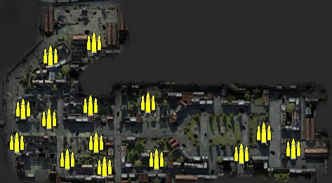
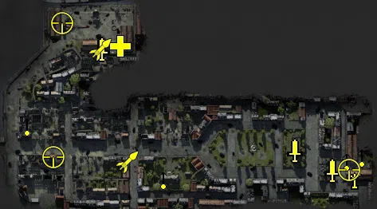
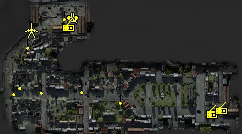
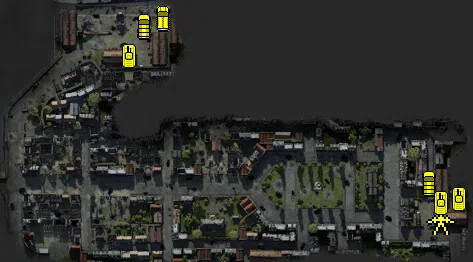

Static Ammo Crate

Pickup Kit

Static Emplacement

Vehicle

| Icon                       | SubCat            | Cat                | Name                         | Instance                   |   Flag |    X Pos |   Y Pos |    Z Pos |
|:---------------------------|:------------------|:-------------------|:-----------------------------|:---------------------------|-------:|---------:|--------:|---------:|
|      | Static Ammo Crate | Static Ammo Crate  | ammo_crate                   | ammo_crate_0               |      0 | -332.616 |  17.048 |  -47.657 |
|      | Static Ammo Crate | Static Ammo Crate  | ammo_crate                   | ammo_crate_1               |      0 | -265.554 |  20.840 |  -82.135 |
|      | Static Ammo Crate | Static Ammo Crate  | ammo_crate                   | ammo_crate_2               |      0 | -191.623 |  25.000 |  -24.811 |
|      | Static Ammo Crate | Static Ammo Crate  | ammo_crate                   | ammo_crate_3               |      0 | -254.123 |  21.219 | -116.796 |
|      | Static Ammo Crate | Static Ammo Crate  | ammo_crate                   | ammo_crate_4               |      0 | -306.641 |  17.132 | -105.757 |
|      | Static Ammo Crate | Static Ammo Crate  | ammo_crate                   | ammo_crate_5               |      0 | -378.686 |  16.959 |  -82.262 |
|      | Static Ammo Crate | Static Ammo Crate  | ammo_crate                   | ammo_crate_6               |      0 | -269.178 |   9.395 |   61.176 |
|      | Static Ammo Crate | Static Ammo Crate  | ammo_crate                   | ammo_crate_7               |      0 | -330.944 |  14.062 |   42.248 |
|      | Static Ammo Crate | Static Ammo Crate  | ammo_crate                   | ammo_crate_8               |      0 |   14.595 |  25.026 |  -90.719 |
|      | Static Ammo Crate | Static Ammo Crate  | ammo_crate                   | ammo_crate_9               |      0 |  -58.840 |  26.152 |  -98.108 |
|      | Static Ammo Crate | Static Ammo Crate  | ammo_crate                   | ammo_crate_10              |      0 | -179.999 |  26.119 | -106.378 |
|      | Static Ammo Crate | Static Ammo Crate  | ammo_crate                   | ammo_crate_11              |      0 | -274.233 |  19.385 |  -29.497 |
|      | Static Ammo Crate | Static Ammo Crate  | ammo_crate                   | ammo_crate_12              |      0 | -369.643 |  13.377 |  -33.791 |
|      | Static Ammo Crate | Static Ammo Crate  | ammo_crate                   | ammo_crate_13              |      0 |  -27.368 |  41.945 |  -68.337 |
|  | Deployable Arty   | Pickup Kit         | UW_PickupMortar              | Industry_mortar            |    101 |   40.940 |  25.751 | -101.816 |
|     | Commando Kit      | Pickup Kit         | GW_PickUpCommandoStG44       | Harbour_stg44              |      1 | -276.281 |  10.166 |   59.832 |
|     | Commando Kit      | Pickup Kit         | UW_PickUpCommandoM3Greasegun | Industry_grease1           |    101 |   14.402 |  26.009 |  -92.231 |
|     | Commando Kit      | Pickup Kit         | UW_PickUpCommandoM3Greasegun | Industry_grease2           |    101 |  -32.576 |  37.124 |  -67.132 |
|     | Commando Kit      | Pickup Kit         | GW_PickUpCommandoStG44       | Harbour_stg442             |      1 | -275.423 |  10.167 |   59.810 |
|     | Medic Kit         | Pickup Kit         | GW_PickUpMedicP08            | Harbour_gwkit              |      1 | -252.465 |   9.974 |   63.656 |
|       | Deployable MG     | Pickup Kit         | UW_PickUpm1917a1             | Industry_pickupmg2         |    101 |   32.272 |  24.962 |  -79.015 |
|       | Deployable MG     | Pickup Kit         | UW_PickUp30Cal               | Industry_pickupmg          |    101 |   50.957 |  26.165 |  -73.926 |
|       | Deployable MG     | Pickup Kit         | UW_PickUpm1917a1             | NavyHQ_PickupMG            |    103 | -197.508 |  26.822 | -102.150 |
|       | Deployable MG     | Pickup Kit         | UW_PickUpm1917a1             | Ruins_PickupMG             |    107 | -369.436 |  13.417 |  -34.591 |
|    | Sniper Kit        | Pickup Kit         | UW_PickUpSniperSpringfield   | Industry_pickupsniper      |    101 |   34.905 |  25.930 |  -91.237 |
|    | Sniper Kit        | Pickup Kit         | GW_PickUpSniperg43_ZF        | Harbour_sniperhafen        |      1 | -325.025 |   9.962 |   93.172 |
|    | Sniper Kit        | Pickup Kit         | GW_PickUpSniperg43_ZF        | Ruins_gewehr43zf           |    107 | -336.197 |  20.091 |  -75.382 |
|    | HEAT Thrower      | Pickup Kit         | GW_PickUpPanzerschreck       | Harbour_schreck            |      1 | -277.428 |  10.306 |   60.132 |
|    | HEAT Thrower      | Pickup Kit         | GW_PickUpPanzerschreck       | Flakposition_Panzerschreck |    105 | -243.447 |  25.310 |  -80.561 |
|      | Anti-aircraft Gun | Static Emplacement | flak18_fr                    | Harbour_88                 |      1 | -259.948 |   9.209 |   86.912 |
|       | Static MG         | Static Emplacement | mg42_bipod                   | Harbour_mg                 |      1 | -277.107 |  10.004 |   92.911 |
|       | Static MG         | Static Emplacement | mg42_bipod                   | Ruins_mg                   |    107 | -364.081 |  14.173 |  -40.612 |
|       | Static MG         | Static Emplacement | mg42_bipod                   | Harbour_mg2                |      1 | -349.099 |  14.080 |   38.325 |
|       | Static MG         | Static Emplacement | mg34_bipod                   | Ruins_mg2                  |    107 | -376.233 |  14.446 |  -53.363 |
|       | Static MG         | Static Emplacement | mg34_bipod                   | NavyHQ_mg                  |    103 | -168.165 |  25.777 |  -69.891 |
|       | Static MG         | Static Emplacement | mg34_bipod                   | Boulangerie_mg             |    106 | -243.397 |  28.179 |  -49.145 |
|       | Static MG         | Static Emplacement | mg34_bipod                   | Ruins_mg3                  |    107 | -322.373 |  15.497 |  -50.373 |
|       | Anti-tank Gun     | Static Emplacement | pak40_static                 | Harbour_pak                |      1 | -341.593 |  13.901 |   62.900 |
|     | Radio             | Static Emplacement | gercommradio                 | Harbour_commander          |      1 | -269.465 |   9.386 |   71.515 |
|     | Radio             | Static Emplacement | gercommradio                 | Industry_commander         |    101 |   10.647 |  25.540 |  -98.186 |
|     | Radio             | Static Emplacement | oldradioallied               | Industry_radio             |    101 |   29.965 |  25.768 |  -91.170 |
|       | APC               | Vehicle            | sdkfz251_d                   | Harbour_schwimm            |      1 | -239.611 |   9.210 |  103.680 |
|       | Car               | Vehicle            | willysmb_us                  | Industry_JEEP              |    101 |   26.247 |  25.000 |  -61.467 |
|       | Car               | Vehicle            | kubelwagen_fr                | Harbour_kuebel             |      1 | -258.729 |   9.207 |   96.281 |
|       | Mobile PaK        | Vehicle            | m4a1_76mm                    | Industry_sherman           |    101 |   37.337 |  25.000 |  -97.224 |
|      | Tank              | Vehicle            | pzivh                        | Harbour_panzer4            |      1 | -273.971 |   9.207 |   65.598 |
|      | Tank              | Vehicle            | m5a1_stuart                  | Industry_Stuart            |    101 |   38.455 |  25.000 |  -80.707 |
|      | Tank              | Vehicle            | m3a1                         | Industry_apc               |    101 |   56.021 |  25.000 |  -77.054 |

