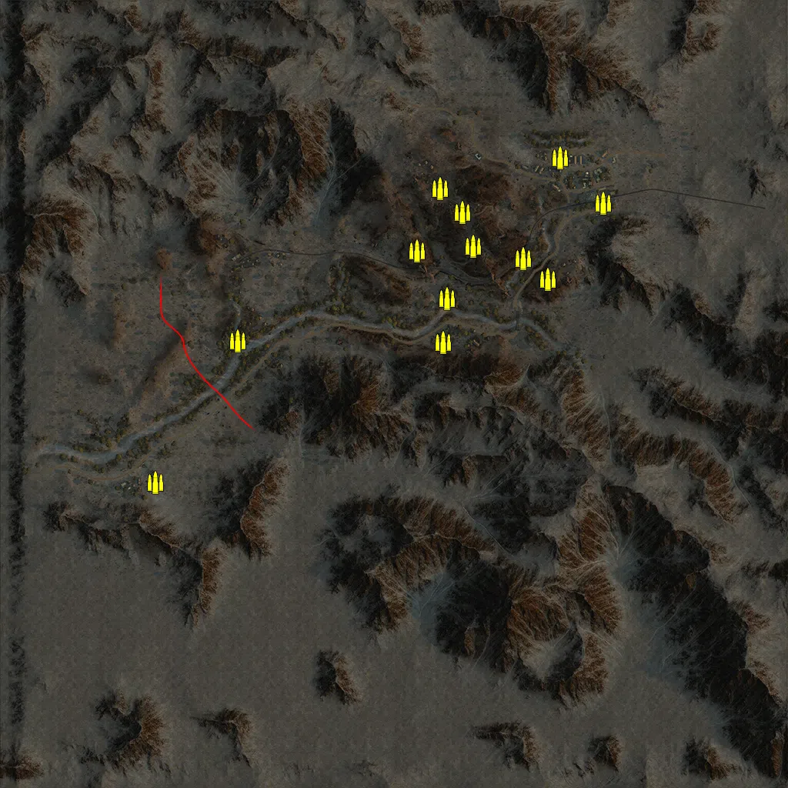
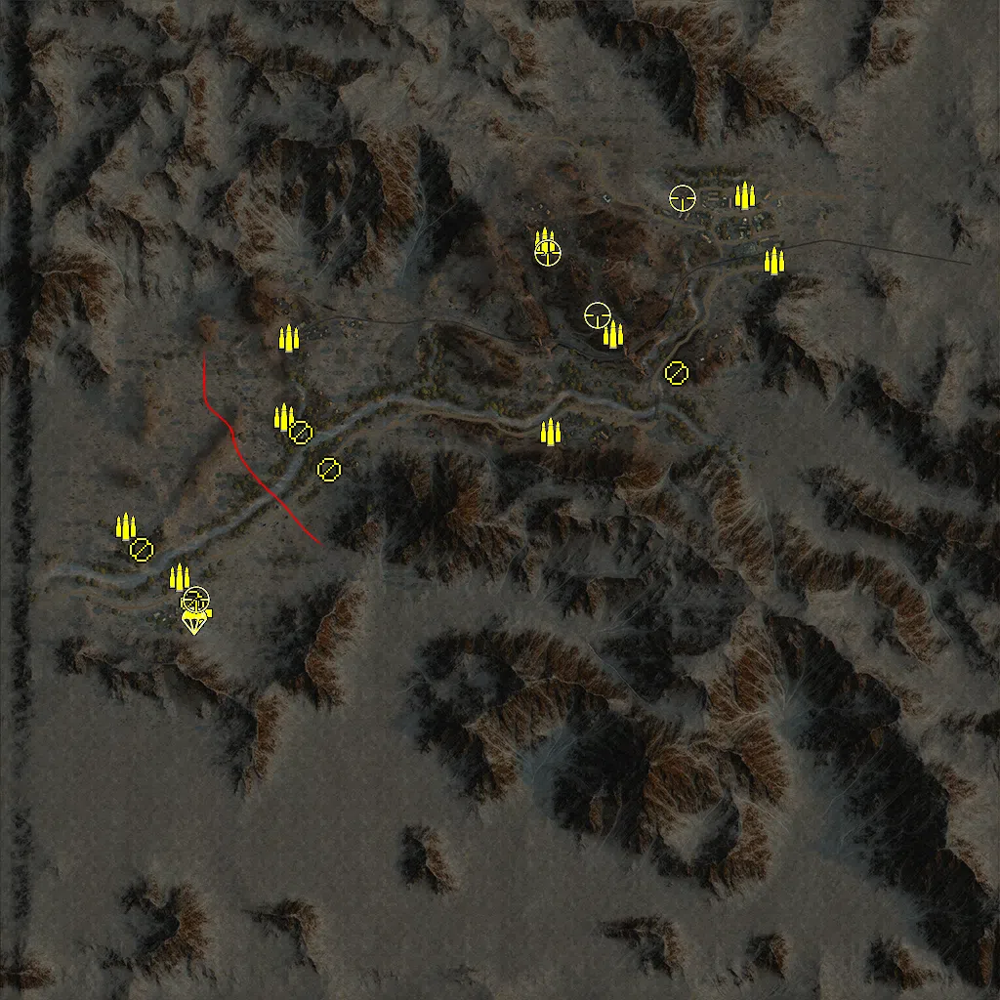
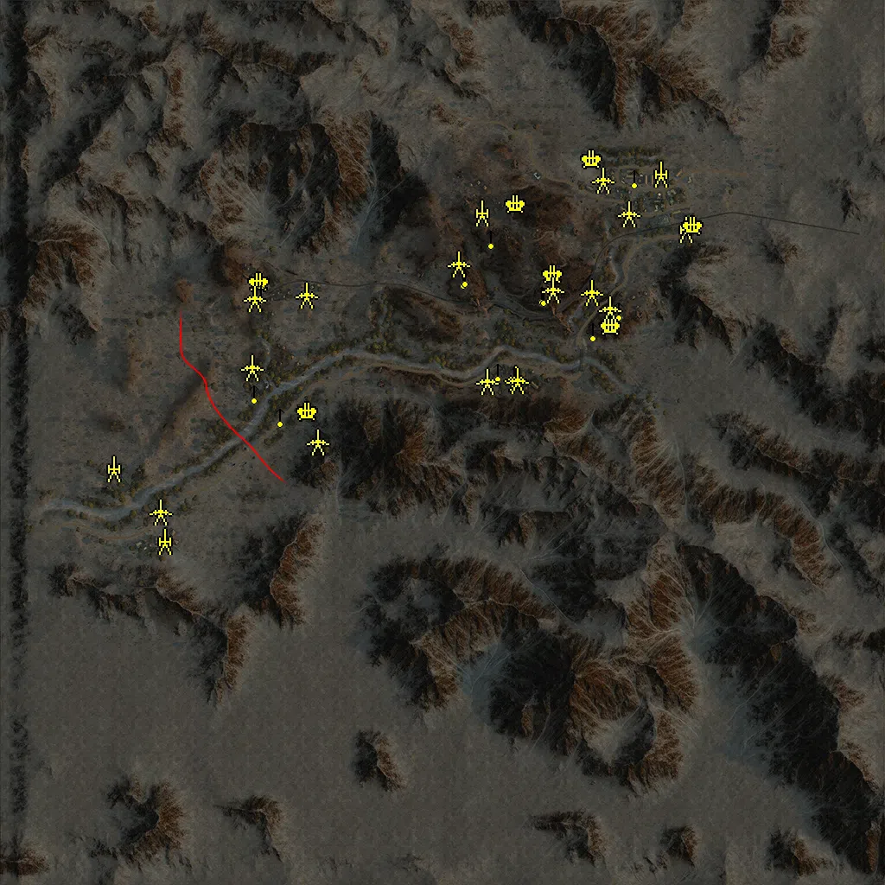
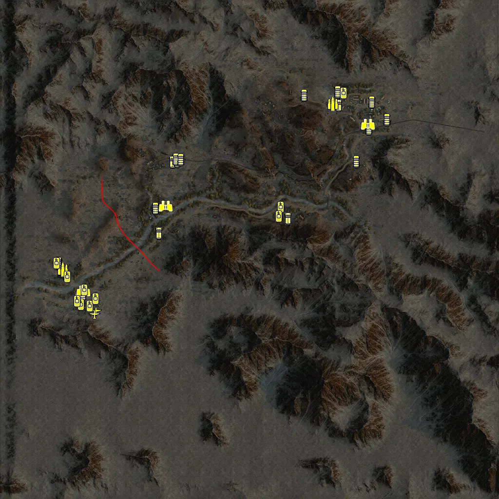

Static Ammo Crate

Pickup Kit

Static Emplacement

Vehicle

| gpo_subcat   | gpo_cat    | gpo_name                 |    pos_x |   pos_y |    pos_z |   flag | is_locked   |   team | instance                                   | gpo_cat_disp       | gpo_subcat_disp   |
|:-------------|:-----------|:-------------------------|---------:|--------:|---------:|-------:|:------------|-------:|:-------------------------------------------|:-------------------|:------------------|
| ammo_crate   | ammo_crate | ammo_crate               |  178.955 |  96.537 |  472.634 |      0 | False       |      0 | ammo_crate_0                               | Static Ammo Crate  | Static Ammo Crate |
| ammo_crate   | ammo_crate | ammo_crate               | -619.463 |  47.443 | -229.74  |      0 | False       |      0 | ammo_crate_1                               | Static Ammo Crate  | Static Ammo Crate |
| ammo_crate   | ammo_crate | ammo_crate               | -406.84  |  49.777 |  137.444 |      0 | False       |      0 | ammo_crate_2                               | Static Ammo Crate  | Static Ammo Crate |
| ammo_crate   | ammo_crate | ammo_crate               |  127.973 |  57.815 |  134.53  |      0 | False       |      0 | ammo_crate_3                               | Static Ammo Crate  | Static Ammo Crate |
| ammo_crate   | ammo_crate | ammo_crate               |  137.985 |  57.027 |  247.974 |      0 | False       |      0 | ammo_crate_4                               | Static Ammo Crate  | Static Ammo Crate |
| ammo_crate   | ammo_crate | ammo_crate               |   60.017 |  87.717 |  372.819 |      0 | False       |      0 | ammo_crate_5                               | Static Ammo Crate  | Static Ammo Crate |
| ammo_crate   | ammo_crate | ammo_crate               |  120.103 |  98.487 |  534.337 |      0 | False       |      0 | ammo_crate_6                               | Static Ammo Crate  | Static Ammo Crate |
| ammo_crate   | ammo_crate | ammo_crate               |  205.447 |  91.127 |  383.386 |      0 | False       |      0 | ammo_crate_7                               | Static Ammo Crate  | Static Ammo Crate |
| ammo_crate   | ammo_crate | ammo_crate               |  335.505 |  74.045 |  351.077 |      0 | False       |      0 | ammo_crate_8                               | Static Ammo Crate  | Static Ammo Crate |
| ammo_crate   | ammo_crate | ammo_crate               |  400.959 |  84.602 |  298.114 |      0 | False       |      0 | ammo_crate_9                               | Static Ammo Crate  | Static Ammo Crate |
| ammo_crate   | ammo_crate | ammo_crate               |  431.629 |  82.895 |  614.607 |      0 | False       |      0 | ammo_crate_10                              | Static Ammo Crate  | Static Ammo Crate |
| ammo_crate   | ammo_crate | ammo_crate               |  543.464 |  82.814 |  496.955 |      0 | False       |      0 | ammo_crate_11                              | Static Ammo Crate  | Static Ammo Crate |
| ammo         | kit        | BA_PickUpAmmokit         | -766.547 |  47.222 |  -53.472 |      2 | False       |      0 | conq_64_british_mainbase_DE_GB_Ammo        | Pickup Kit         | Ammo Kit          |
| ammo         | kit        | BA_PickUpAmmokit         | -655.794 |  47.347 | -158.56  |      2 | False       |      0 | conq_64_british_mainbase_DE_GB_Ammo_0      | Pickup Kit         | Ammo Kit          |
| ammo         | kit        | BA_PickUpAmmokit         | -442.81  |  50.079 |  169.568 |    106 | False       |      0 | conq_64_agordat_DE_GB_Ammo                 | Pickup Kit         | Ammo Kit          |
| ammo         | kit        | BA_PickUpAmmokit         |  104.404 |  56.862 |  140.209 |    104 | False       |      0 | conq_64_ascidera_valley_DE_GB_Ammo         | Pickup Kit         | Ammo Kit          |
| ammo         | kit        | BA_PickUpAmmokit         |  232.582 |  97.07  |  339.252 |      1 | False       |      0 | conq_64_sanchil_DE_GB_Ammo                 | Pickup Kit         | Ammo Kit          |
| ammo         | kit        | BA_PickUpAmmokit         |   91.28  | 100.09  |  530.37  |    102 | False       |      0 | conq_64_sammana_DE_GB_Ammo                 | Pickup Kit         | Ammo Kit          |
| ammo         | kit        | BA_PickUpAmmokit         |  502.644 |  81.309 |  624.484 |    103 | False       |      0 | conq_64_keren_DE_GB_Ammo                   | Pickup Kit         | Ammo Kit          |
| ammo         | kit        | BA_PickUpAmmokit         | -432.681 |  52.769 |  332.053 |    101 | False       |      0 | conq_64_agordat_trainstation_DE_GB_Ammo    | Pickup Kit         | Ammo Kit          |
| ammo         | kit        | BA_PickUpAmmokit         |  562.308 |  82.208 |  490.551 |    107 | False       |      0 | conq_64_trainstation_DE_GB_Ammo            | Pickup Kit         | Ammo Kit          |
| arty_dep     | kit        | BA_PickUpMortar          | -617.867 |  47.45  | -230.451 |      2 | False       |      0 | conq_64_british_mainbase_DE_GB_Mortar      | Pickup Kit         | Deployable Arty   |
| medic        | kit        | BA_PickUpMedicWebley     | -615.483 |  47.435 | -231     |      2 | False       |      0 | conq_64_british_mainbase_DE_GB_Medic       | Pickup Kit         | Medic Kit         |
| mg           | kit        | BA_PickUpSupportLewis    | -734.277 |  47.531 | -101.394 |      2 | False       |      0 | conq_64_british_mainbase_DE_GB_SupportMG42 | Pickup Kit         | MG Kit            |
| mg           | kit        | BA_PickUpSupportLewis    | -407.447 |  49.81  |  138.752 |    106 | False       |      0 | conq_64_agordat_DE_GB_SupportMG42          | Pickup Kit         | MG Kit            |
| mg_dep       | kit        | BA_PickUpVickers303      | -630.223 |  46.893 | -209.266 |      2 | False       |      0 | conq_64_british_mainbase_DE_GB_DepMG       | Pickup Kit         | Deployable MG     |
| mg_dep       | kit        | BA_PickUpVickers303      | -350.025 |  51.56  |   62.044 |    106 | False       |      0 | conq_64_agordat_DE_GB_DepMG                | Pickup Kit         | Deployable MG     |
| mg_dep       | kit        | BA_PickUpVickers303      |  362.628 |  74.783 |  260.739 |    105 | False       |      0 | conq_64_Fort_Dologorodoc_DE_GB_DepMG       | Pickup Kit         | Deployable MG     |
| parachute    | kit        | BA_PickUpPilotWebley     | -625.44  |  46.767 | -247.323 |      2 | False       |      0 | conq_64_british_mainbase_DE_GB_K98zf41     | Pickup Kit         | Parachute Kit     |
| sniper       | kit        | BA_PickUpSniperNo4       | -622.715 |  47.499 | -203.308 |      2 | False       |      0 | conq_64_british_mainbase_DE_GB_Sniper      | Pickup Kit         | Sniper Kit        |
| sniper       | kit        | BA_PickUpSniperNo4       |   98.618 |  98.747 |  505.799 |    102 | False       |      0 | conq_64_sammana_DE_GB_Sniper               | Pickup Kit         | Sniper Kit        |
| sniper       | kit        | BA_PickUpSniperNo4       |  200.144 |  91.076 |  378.246 |      1 | False       |      0 | conq_64_sanchil_Sniper                     | Pickup Kit         | Sniper Kit        |
| sniper       | kit        | BA_PickUpSniperNo4       |  373.328 |  84.117 |  618.416 |    103 | False       |      0 | conq_64_keren_Sniper                       | Pickup Kit         | Sniper Kit        |
| arty         | static     | schneider_1913           |  561.185 |  82.243 |  493.193 |    107 | False       |      0 | conq_64_keren_at                           | Static Emplacement | Artillery         |
| arty         | static     | sgwr34                   |  503.98  |  81.242 |  622.227 |    103 | False       |      0 | conq_64_keren_mortar                       | Static Emplacement | Artillery         |
| arty         | static     | 25pdr                    | -762.596 |  46.755 |  -59.174 |      2 | False       |      0 | conq_64_british_mainbase_howitzer          | Static Emplacement | Artillery         |
| arty         | static     | sgwr34                   |   89.054 | 100.135 |  532.397 |    102 | False       |      0 | conq_64_sammana_mortar                     | Static Emplacement | Artillery         |
| arty         | static     | 3inchmortar              | -643.113 |  45.981 | -227.092 |      2 | False       |      0 | conq_64_british_mainbase_mortar            | Static Emplacement | Artillery         |
| flak         | static     | breda_35_20mm            |  256.169 | 102.879 |  390.492 |      1 | False       |      0 | conq_64_sanchil_aa                         | Static Emplacement | Anti-aircraft Gun |
| flak         | static     | breda_35_20mm            |  579.996 |  82.783 |  501.886 |    107 | False       |      0 | conq_64_keren_aa_0                         | Static Emplacement | Anti-aircraft Gun |
| flak         | static     | breda_35_20mm            |  345.913 |  83.046 |  655.943 |    103 | False       |      0 | conq_64_keren_aa_1                         | Static Emplacement | Anti-aircraft Gun |
| flak         | static     | breda_35_20mm            |  389.054 |  77.226 |  269.026 |    105 | False       |      0 | conq_64_Fort_Dologorodoc_aa                | Static Emplacement | Anti-aircraft Gun |
| flak         | static     | breda_35_20mm            | -312.401 |  51.631 |   72.247 |    106 | False       |      0 | conq_64_agordat_aa                         | Static Emplacement | Anti-aircraft Gun |
| flak         | static     | breda_35_20mm            |  170.747 | 109.743 |  552.533 |    102 | False       |      0 | conq_64_sammana_aa                         | Static Emplacement | Anti-aircraft Gun |
| flak         | static     | breda_35_20mm            | -424.428 |  54.86  |  371.1   |    101 | False       |      0 | conq_64_agordat_trainstation_aa            | Static Emplacement | Anti-aircraft Gun |
| mg_nest      | static     | bredam37_bipod           |  229.344 |  97.734 |  343.385 |      1 | False       |      0 | conq_64_sanchil_mg_0                       | Static Emplacement | Static MG         |
| mg_nest      | static     | bredam37_bipod           |   47.618 |  87.671 |  381.169 |    102 | False       |      0 | conq_64_cameron_ridge_mg_0                 | Static Emplacement | Static MG         |
| mg_nest      | static     | bredam37_bipod           |  112.222 |  94.771 |  473.639 |    102 | False       |      0 | conq_64_sammana_mg                         | Static Emplacement | Static MG         |
| mg_nest      | static     | bredam37_bipod           |  443.713 |  83.715 |  614.173 |    103 | False       |      0 | conq_64_keren_mg                           | Static Emplacement | Static MG         |
| mg_nest      | static     | bredam37_bipod           |  347.113 |  74.958 |  260.358 |    105 | False       |      0 | conq_64_Fort_Dologorodoc_mg_0              | Static Emplacement | Static MG         |
| mg_nest      | static     | vickers303_tripod        |  127.439 |  61.577 |  166.329 |    104 | False       |      0 | conq_64_ascidera_valley_mg                 | Static Emplacement | Static MG         |
| mg_nest      | static     | bredam37_bipod           | -286.506 |  62.944 |   13.496 |    106 | False       |      0 | conq_64_agordat_mg_0                       | Static Emplacement | Static MG         |
| mg_nest      | static     | bredam37_bipod           | -376.318 |  51.187 |   62.063 |    106 | False       |      0 | conq_64_agordat_mg_2                       | Static Emplacement | Static MG         |
| mg_nest      | static     | bredam37_bipod           | -435.735 |  50.576 |  116.3   |    106 | False       |      0 | conq_64_agordat_mg_3                       | Static Emplacement | Static MG         |
| mg_nest      | static     | vickers303_tripod        |   51.254 |  86.366 |  386.962 |    102 | False       |      0 | conq_64_cameron_ridge_mg_1                 | Static Emplacement | Static MG         |
| mg_nest      | static     | lewis_bipod              |  234.607 |  98.48  |  342.227 |      1 | False       |      0 | conq_64_sanchil_mg_1                       | Static Emplacement | Static MG         |
| mg_nest      | static     | lewis_bipod              |  407.252 |  87.058 |  307.713 |    105 | False       |      0 | conq_64_Fort_Dologorodoc_mg_1              | Static Emplacement | Static MG         |
| mg_nest      | static     | bredam37_bipod           | -419.023 |  59.406 |  348.2   |    101 | False       |      0 | conq_64_agordat_trainstation_mg            | Static Emplacement | Static MG         |
| pak          | static     | cannone_da_47_32_static  |  253.559 |  89.482 |  354.595 |      1 | False       |      0 | conq_64_sanchil_at                         | Static Emplacement | Anti-tank Gun     |
| pak          | static     | cannone_da_47_32_static  |   35.756 |  83.034 |  414.579 |    102 | False       |      0 | conq_64_cameron_ridge_at                   | Static Emplacement | Anti-tank Gun     |
| pak          | static     | cannone_da_47_32_static  |  429.162 |  83.455 |  529.125 |    103 | False       |      0 | conq_64_keren_at_0                         | Static Emplacement | Anti-tank Gun     |
| pak          | static     | cannone_da_47_32         |  370.548 |  83.837 |  608.702 |    103 | False       |      0 | conq_64_keren_at_1                         | Static Emplacement | Anti-tank Gun     |
| pak          | static     | cannone_da_47_32_static  |  102.787 |  57.109 |  142.256 |    104 | False       |      0 | conq_64_ascidera_valley_at                 | Static Emplacement | Anti-tank Gun     |
| pak          | static     | cannone_da_47_32_static  |  385.952 |  81.093 |  309.068 |    105 | False       |      0 | conq_64_Fort_Dologorodoc_at                | Static Emplacement | Anti-tank Gun     |
| pak          | static     | 2pdr                     |  168.546 |  59.427 |  148.255 |    104 | False       |      0 | conq_64_ascidera_valley_at_1               | Static Emplacement | Anti-tank Gun     |
| pak          | static     | cannone_da_47_32_static  | -289.666 |  61.169 |    1.358 |    106 | False       |      0 | conq_64_agordat_at                         | Static Emplacement | Anti-tank Gun     |
| pak          | static     | cannone_da_47_32_static  | -441.833 |  50.498 |  173.419 |    106 | False       |      0 | conq_64_agordat_at_3                       | Static Emplacement | Anti-tank Gun     |
| pak          | static     | 2pdr                     | -653.814 |  47.449 | -160.346 |      2 | False       |      0 | conq_64_british_mainbase_at                | Static Emplacement | Anti-tank Gun     |
| pak          | static     | cannone_da_47_32_static  |  344.345 |  72.589 |  347.406 |      1 | False       |      0 | conq_64_sanchil_at_0                       | Static Emplacement | Anti-tank Gun     |
| pak          | static     | cannone_da_47_32         |  172.934 |  59.871 |  143.364 |    104 | False       |      0 | conq_64_ascidera_valley_at_0               | Static Emplacement | Anti-tank Gun     |
| pak          | static     | cannone_da_47_32_static  | -435.26  |  52.886 |  333.747 |    101 | False       |      0 | conq_64_agordat_trainstation_at            | Static Emplacement | Anti-tank Gun     |
| pak          | static     | 2pdr                     | -315.879 |  56.797 |  341.119 |    101 | False       |      0 | conq_64_agordat_trainstation_at_0          | Static Emplacement | Anti-tank Gun     |
| apc          | vehicle    | universalcarrier         |  365.126 |  83.937 |  592.683 |    103 | False       |      0 | conq_64_keren_truck                        | Vehicle            | APC               |
| apc          | vehicle    | universalcarrier         |  157.784 |  59.235 |  128.115 |    104 | False       |      0 | conq_64_ascidera_valley_truck              | Vehicle            | APC               |
| apc          | vehicle    | universalcarrier_bren    | -316.5   |  54.556 |  360.013 |    101 | False       |      0 | conq_64_agordat_fiat                       | Vehicle            | APC               |
| apc          | vehicle    | universalcarrier_vickers | -782.629 |  46.78  |  -57.944 |      2 | False       |      0 | conq_64_british_mainbase_apc               | Vehicle            | APC               |
| apc          | vehicle    | universalcarrier_bren    | -703.139 |  46.143 | -203.252 |      2 | False       |      0 | conq_64_british_mainbase_1_0               | Vehicle            | APC               |
| apc          | vehicle    | universalcarrier_vickers | -371.03  |  50.592 |   67.064 |    106 | False       |      0 | conq_64_agordat_apc                        | Vehicle            | APC               |
| apc          | vehicle    | universalcarrier         | -295.448 |  53.872 |  361.561 |    101 | False       |      0 | conq_64_agordat_apc_0                      | Vehicle            | APC               |
| car          | vehicle    | bedfordoyd               |  501.654 |  81.952 |  605.822 |    103 | False       |      0 | conq_64_keren_truck_1                      | Vehicle            | Car               |
| car          | vehicle    | bedfordoyd_nocanvas      |  564.864 |  81.506 |  534.925 |    107 | False       |      0 | conq_64_keren_truck_2                      | Vehicle            | Car               |
| car          | vehicle    | bedfordox_nocanvas       | -386.777 |  50.252 |  169.173 |    106 | False       |      0 | conq_64_agordat_truck_0                    | Vehicle            | Car               |
| car          | vehicle    | bedfordoyd               | -683.572 |  46.739 | -184.455 |      2 | False       |      0 | conq_64_british_mainbase_2_0               | Vehicle            | Car               |
| car          | vehicle    | bedfordox_nocanvas       | -784.128 |  46.76  |  -53.501 |      2 | False       |      0 | conq_64_british_mainbase_1_2               | Vehicle            | Car               |
| car          | vehicle    | bedfordox_nocanvas       |  224.756 |  86.352 |  633.176 |    102 | False       |      0 | conq_64_sammana_truck                      | Vehicle            | Car               |
| car          | vehicle    | bedfordox_nocanvas       |  438.124 |  79.428 |  361.924 |    105 | False       |      0 | conq_64_Fort_Dologorodoc_truck             | Vehicle            | Car               |
| car          | vehicle    | fiat626_breda            |  362.819 |  83.444 |  647.091 |    103 | False       |      0 | conq_64_keren_truck_3                      | Vehicle            | Car               |
| civilian     | vehicle    | wr360c14_africa          |  489.552 |  83.035 |  495.273 |    107 | False       |      0 | conq_64_keren_train                        | Vehicle            | Civilian Vehicle  |
| civilian     | vehicle    | wr360c14_africa          | -302.017 |  54.684 |  372.351 |    101 | False       |      0 | conq_64_agordat_trainstation_train         | Vehicle            | Civilian Vehicle  |
| civilian     | vehicle    | drg_gw_o_halle1          | -282.862 |  55.041 |  369.48  |    101 | False       |      0 | conq_64_agordat_trainstation_traincart     | Vehicle            | Civilian Vehicle  |
| plane        | vehicle    | hardy                    | -630.894 |  46.317 | -252.787 |      2 | True        |      0 | conq_64_british_mainbase_plane             | Vehicle            | Airplane          |
| plane        | vehicle    | hardy                    | -636.739 |  47.37  | -266.345 |    106 | True        |      0 | conq_64_british_mainbase_plane_0           | Vehicle            | Airplane          |
| recon        | vehicle    | dingo_na                 |  486.666 |  82.787 |  513.411 |    107 | False       |      0 | conq_64_keren_car                          | Vehicle            | Scout Vehicle     |
| recon        | vehicle    | dingo_na                 | -343.094 |  50.999 |  177.847 |    106 | False       |      0 | conq_64_agordat_truck                      | Vehicle            | Scout Vehicle     |
| recon        | vehicle    | dingo_na                 | -681.912 |  46.76  | -169.94  |      2 | False       |      0 | conq_64_british_mainbase_car               | Vehicle            | Scout Vehicle     |
| supply       | vehicle    | bedfordoyd_ammo          |  342.283 |  84.519 |  597.319 |    103 | False       |      0 | conq_64_keren_truck_0                      | Vehicle            | Supply Vehicle    |
| supply       | vehicle    | bedfordoyd_ammo          | -765.039 |  46.76  |  -81.092 |      2 | False       |      0 | conq_64_british_mainbase_truck             | Vehicle            | Supply Vehicle    |
| tank         | vehicle    | carrom11_39              |  386.479 |  83.057 |  642.364 |    103 | True        |      0 | conq_64_keren_tank                         | Vehicle            | Tank              |
| tank         | vehicle    | carrom11_39              |  128.672 |  57.835 |  173.148 |    106 | True        |      0 | conq_64_agordat_tank                       | Vehicle            | Tank              |
| tank         | vehicle    | carrom11_39              |  119.935 |  57.649 |  136.054 |    101 | True        |      0 | conq_64_agordat_tank_0                     | Vehicle            | Tank              |
| tank         | vehicle    | marmonherringtonmk3a     | -677.101 |  46.542 | -165.189 |      2 | True        |      0 | conq_64_british_mainbase_0_16              | Vehicle            | Tank              |
| tank         | vehicle    | cruiseriv                | -691.348 |  47.348 | -226.754 |      2 | True        |      0 | conq_64_british_mainbase_tank              | Vehicle            | Tank              |
| tank         | vehicle    | cruiseriv                | -655.291 |  45.928 | -232.862 |      2 | True        |      0 | conq_64_british_mainbase_0_17              | Vehicle            | Tank              |
| tank         | vehicle    | cruiseriv                | -792     |  46.951 |  -56.086 |      2 | True        |      0 | conq_64_british_mainbase_1_1               | Vehicle            | Tank              |
| tank         | vehicle    | matildaii                | -707.239 |  46.049 | -212.034 |    101 | True        |      0 | conq_64_agordat_tank_1                     | Vehicle            | Tank              |
| tank         | vehicle    | cruiseriv                | -631.167 |  46.76  | -202.952 |      2 | True        |      0 | conq_64_british_mainbase_tank_0            | Vehicle            | Tank              |
| tank         | vehicle    | markvi                   | -747.587 |  46.16  | -111.148 |      2 | True        |      0 | conq_64_british_mainbase_tank_1            | Vehicle            | Tank              |

