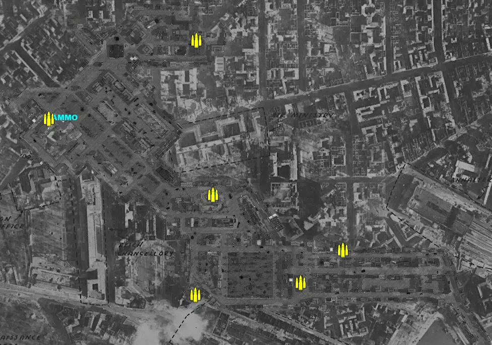
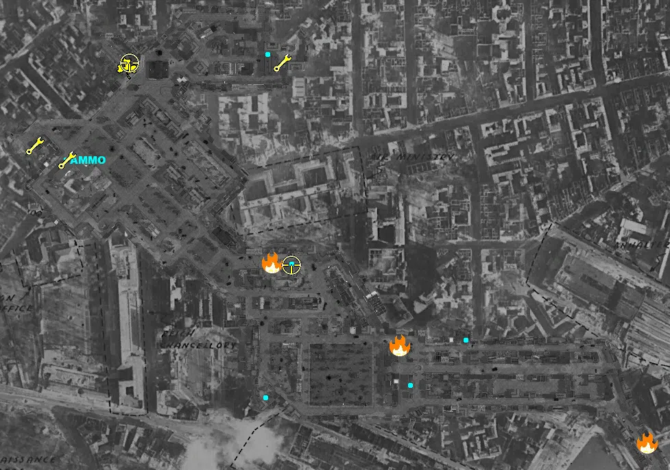
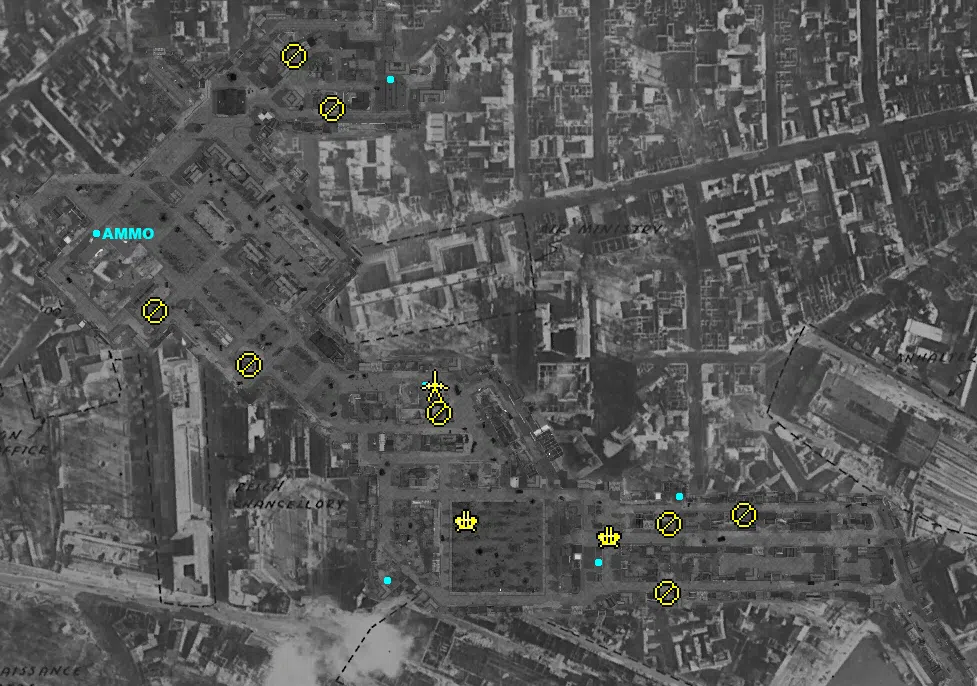
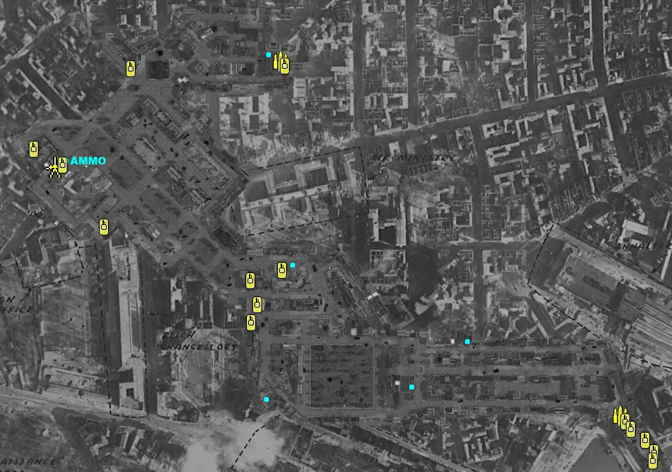

Static Ammo Crate

Pickup Kit

Static Emplacement

Vehicle

| Icon                        | SubCat            | Cat                | Name                             | Instance                  |   Flag |    X Pos |   Y Pos |    Z Pos |
|:----------------------------|:------------------|:-------------------|:---------------------------------|:--------------------------|-------:|---------:|--------:|---------:|
|       | Static Ammo Crate | Static Ammo Crate  | ammo_crate                       | ammo_crate_0              |      0 |  131.148 |  23.634 | -328.537 |
|       | Static Ammo Crate | Static Ammo Crate  | ammo_crate                       | ammo_crate_1              |      0 |  -78.480 |  25.255 | -352.527 |
|       | Static Ammo Crate | Static Ammo Crate  | ammo_crate                       | ammo_crate_2              |      0 |  -43.129 |  25.101 | -154.459 |
|       | Static Ammo Crate | Static Ammo Crate  | ammo_crate                       | ammo_crate_3              |      0 | -369.396 |  25.202 |   -3.316 |
|       | Static Ammo Crate | Static Ammo Crate  | ammo_crate                       | ammo_crate_4              |      0 |  -75.921 |  25.196 |  152.942 |
|       | Static Ammo Crate | Static Ammo Crate  | ammo_crate                       | ammo_crate_5              |      0 |  214.519 |  25.271 | -263.679 |
|  | Easteregg         | Pickup Kit         | GW_PickUpLuftfaust               | Luft                      |      7 | -281.186 |  25.628 |  132.833 |
|   | Engineer Kit      | Pickup Kit         | GW_PickUPTanker_Walther          | tanker1                   |      6 | -368.067 |  25.822 |   -1.464 |
|   | Engineer Kit      | Pickup Kit         | GW_PickUPTanker_Walther          | Tanker2                   |      6 | -415.484 |  27.125 |   19.502 |
|   | Engineer Kit      | Pickup Kit         | GW_PickUPTanker_Walther          | Tanker3                   |    106 |  -54.421 |  25.975 |  140.696 |
|      | Flamethrower Kit  | Pickup Kit         | RE_PickUpFlamethrower            | FLAMER                    |      1 |  478.210 |  25.627 | -413.365 |
|      | Flamethrower Kit  | Pickup Kit         | RE_PickUpFlamethrower            | dddd                      |      5 |  -68.902 |  25.136 | -149.538 |
|      | Flamethrower Kit  | Pickup Kit         | RE_PickUpFlamethrower            | newflame                  |    107 |  117.087 |  25.316 | -270.572 |
|     | Sniper Kit        | Pickup Kit         | GW_PickUpSniperStG44_ZF          | STGSCOPE                  |      7 | -276.565 |  25.901 |  141.167 |
|     | Sniper Kit        | Pickup Kit         | GW_PickUpSniperStG44_ZF          | newstg                    |      5 |  -41.278 |  25.828 | -154.040 |
|       | FIXME UNASSIGNED  | FIXME UNASSIGNED   | GW_PickUpPanzerfaust60m_stg44    | Supply_Dump_schreck       |      4 |  -79.503 |  26.074 | -351.233 |
|       | FIXME UNASSIGNED  | FIXME UNASSIGNED   | GW_PickUpPanzerfaust60m_stg44    | Gschreck1                 |      6 | -367.383 |  25.913 |    1.614 |
|       | FIXME UNASSIGNED  | FIXME UNASSIGNED   | GW_PickupTankhunter_faust_berlin | Gsniper1                  |      6 | -365.803 |  25.911 |    0.543 |
|       | FIXME UNASSIGNED  | FIXME UNASSIGNED   | GW_PickupTankhunter_faust_berlin | Gsmgfaust                 |      4 |  -76.181 |  25.869 | -353.650 |
|       | FIXME UNASSIGNED  | FIXME UNASSIGNED   | GW_PickUpPanzerfaust100m_VS_CMP  | Griflefaust1              |      5 |  -63.579 |  25.118 | -174.667 |
|       | FIXME UNASSIGNED  | FIXME UNASSIGNED   | GW_PickupTankhunter_faust_berlin | Gcarcano1                 |      5 |  -55.162 |  25.818 | -174.812 |
|       | FIXME UNASSIGNED  | FIXME UNASSIGNED   | GW_PickupTankhunter_faust_berlin | Yard_Gsmgfaust2           |      2 |  132.200 |  24.285 | -325.359 |
|       | FIXME UNASSIGNED  | FIXME UNASSIGNED   | GW_PickUpPanzerfaust100m_VS_CMP  | Ruins_Gsniper2            |      3 |  214.506 |  26.093 | -267.376 |
|       | FIXME UNASSIGNED  | FIXME UNASSIGNED   | GW_PickUpPanzerfaust60m_stg44    | Ruins_Gschreck2           |      5 |  -43.180 |  25.812 | -174.504 |
|       | Anti-aircraft Gun | Static Emplacement | flak18ns_fr                      | Yard_88                   |      2 |  144.201 |  25.000 | -303.761 |
|       | Anti-aircraft Gun | Static Emplacement | flak18ns_fr                      | Supply_Dump_ttt           |      4 |    0.575 |  25.035 | -287.912 |
|        | Static MG         | Static Emplacement | mg42_bipod                       | Yard_g                    |      2 |  202.594 |  34.869 | -290.798 |
|        | Static MG         | Static Emplacement | mg42_bipod                       | Ruins_f                   |      3 |  277.548 |  27.296 | -281.906 |
|        | Static MG         | Static Emplacement | mg42_bipod                       | Hospital_mg1              |      5 |  -26.596 |  38.896 | -179.629 |
|        | Static MG         | Static Emplacement | mg42_bipod                       | Boulevard_MG              |    104 | -216.584 |  30.644 | -132.407 |
|        | Static MG         | Static Emplacement | mg42_bipod                       | mghotel                   |      9 | -134.314 |  26.069 |  123.501 |
|        | Static MG         | Static Emplacement | mg42_bipod                       | SCHNEIMG                  |      8 | -171.879 |  30.411 |  176.992 |
|        | Static MG         | Static Emplacement | mg42_bipod                       | MGsquare                  |      6 | -310.612 |  25.996 |  -77.687 |
|        | Static MG         | Static Emplacement | mg42_bipod                       | mgyardnew                 |      2 |  201.246 |  26.992 | -360.262 |
|        | Anti-tank Gun     | Static Emplacement | pak40_static                     | Hospital_dfg              |      5 |  -31.880 |  25.715 | -151.859 |
|        | Mobile PaK        | Vehicle            | sdkfz7_pak40                     | last_flag_south_mobilepak |    104 | -387.247 |  25.000 |   -8.538 |
|       | Supply Vehicle    | Vehicle            | studebaker_us6_ammo              | Supplytruck               |      1 |  435.822 |  25.000 | -371.196 |
|       | Supply Vehicle    | Vehicle            | opelblitz_fr_ammo                | ammo_ger                  |      7 |  -58.052 |  25.000 |  144.122 |
|       | Tank              | Vehicle            | is_2                             | RU_Mainbase_IS2           |      1 |  472.205 |  25.029 | -406.951 |
|       | Tank              | Vehicle            | t34_85_late                      | RU_Mainbase_T34           |      1 |  485.426 |  25.000 | -425.247 |
|       | Tank              | Vehicle            | t34_85_late                      | RU_Mainbase_T342          |      1 |  482.847 |  25.000 | -436.630 |
|       | Tank              | Vehicle            | panthera_late_alt2               | Pantherturm               |      6 | -315.213 |  23.936 |  -96.770 |
|       | Tank              | Vehicle            | kingtiger_1945spring             | tiger2                    |      6 | -416.741 |  26.812 |   16.129 |
|       | Tank              | Vehicle            | tiger_late_222                   | Altona_TIGER1             |      7 | -275.919 |  25.924 |  132.516 |
|       | Tank              | Vehicle            | isu_152_dshk                     | T3475                     |      3 |  443.096 |  25.000 | -379.547 |
|       | Tank              | Vehicle            | t34_85_late                      | t8                        |    104 | -102.284 |  25.126 | -175.485 |
|       | Tank              | Vehicle            | pzivh                            | Panther2                  |      7 |  -51.776 |  25.000 |  137.236 |
|       | Tank              | Vehicle            | t34_85_late                      | t3                        |    104 | -100.564 |  26.826 | -235.658 |
|       | Tank              | Vehicle            | is_2                             | t4                        |    104 |  -56.013 |  26.352 | -159.809 |
|       | Tank              | Vehicle            | isu_152_dshk                     | t7                        |    104 |  -91.826 |  25.000 | -209.715 |
|       | Tank              | Vehicle            | stug40                           | FG1                       |      5 | -375.139 |  25.199 |   -6.791 |
|       | Tank              | Vehicle            | t34_85_late                      | RU_Mainbase_newtank       |      1 |  450.841 |  25.000 | -390.662 |

