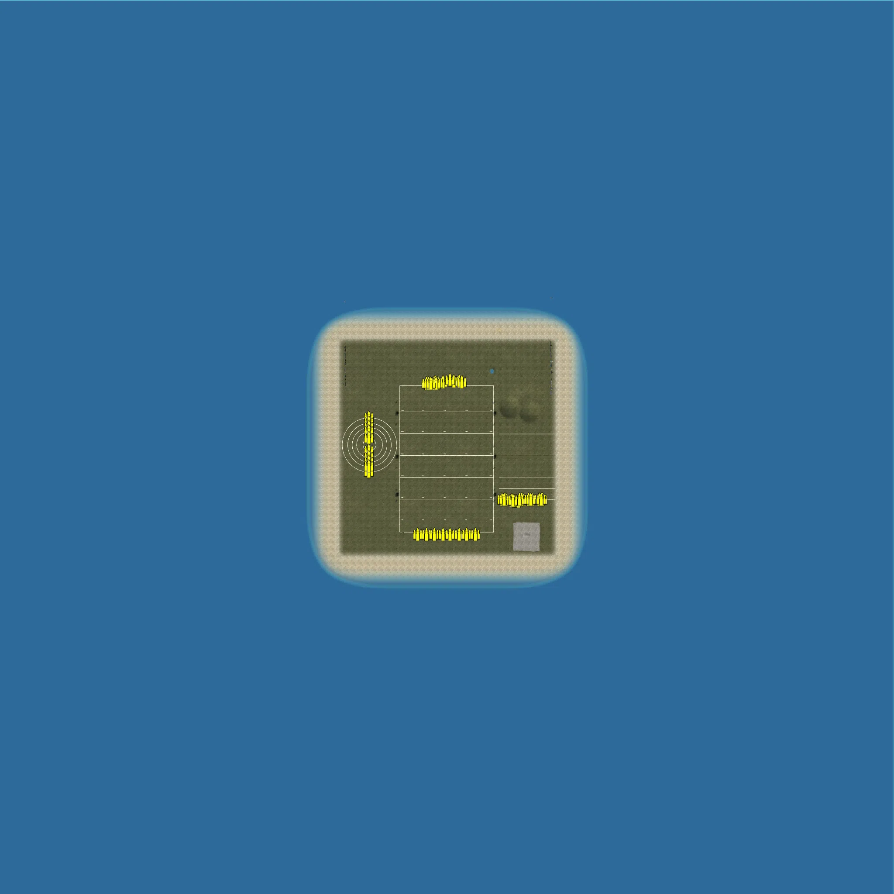
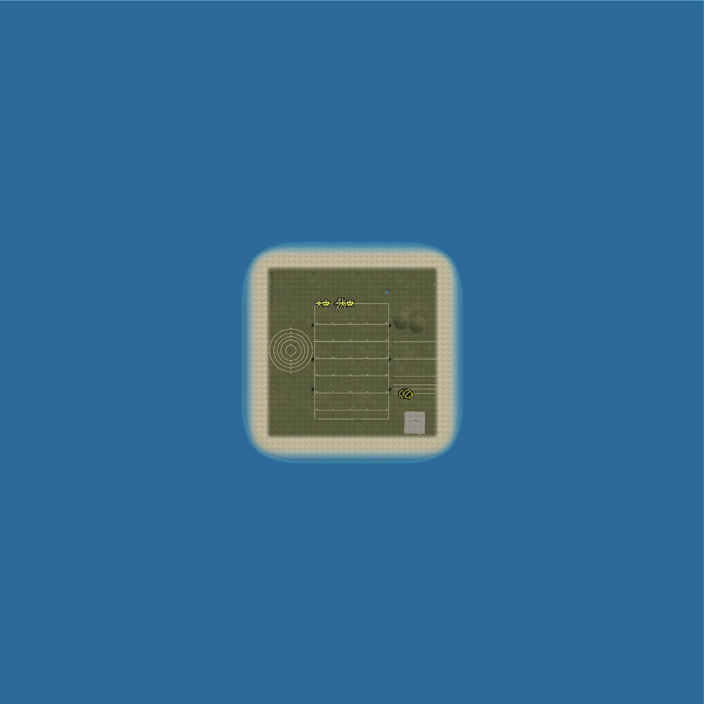
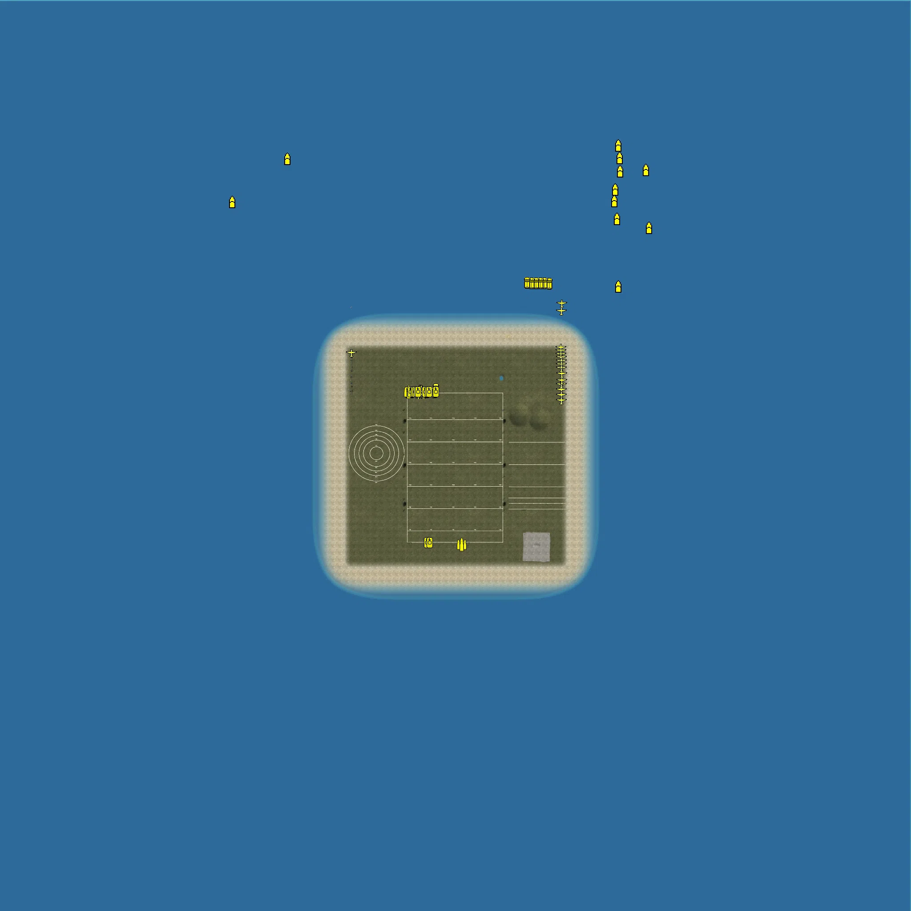

Static Ammo Crate

Pickup Kit

Static Emplacement

Vehicle

| gpo_subcat   | gpo_cat    | gpo_name                        |     pos_x |   pos_y |    pos_z |   flag | is_locked   |   team | instance                                            | gpo_cat_disp       | gpo_subcat_disp   |
|:-------------|:-----------|:--------------------------------|----------:|--------:|---------:|-------:|:------------|-------:|:----------------------------------------------------|:-------------------|:------------------|
| ammo_crate   | ammo_crate | ammo_crate                      |   -93.093 |  24.989 |  292.42  |      0 | False       |      0 | ammo_crate_0                                        | Static Ammo Crate  | Static Ammo Crate |
| ammo_crate   | ammo_crate | ammo_crate                      |   -60.949 |  24.989 |  292.263 |      0 | False       |      0 | ammo_crate_1                                        | Static Ammo Crate  | Static Ammo Crate |
| ammo_crate   | ammo_crate | ammo_crate                      |   -83.335 |  24.989 |  292.894 |      0 | False       |      0 | ammo_crate_2                                        | Static Ammo Crate  | Static Ammo Crate |
| ammo_crate   | ammo_crate | ammo_crate                      |  -358.087 |  24.989 | -112.507 |      0 | False       |      0 | ammo_crate_3                                        | Static Ammo Crate  | Static Ammo Crate |
| ammo_crate   | ammo_crate | ammo_crate                      |   438.661 |  24.989 | -239.555 |      0 | False       |      0 | ammo_crate_4                                        | Static Ammo Crate  | Static Ammo Crate |
| ammo_crate   | ammo_crate | ammo_crate                      |    55.724 |  24.989 |  301.575 |      0 | False       |      0 | ammo_crate_5                                        | Static Ammo Crate  | Static Ammo Crate |
| ammo_crate   | ammo_crate | ammo_crate                      |    31.954 |  24.989 |  302.035 |      0 | False       |      0 | ammo_crate_6                                        | Static Ammo Crate  | Static Ammo Crate |
| ammo_crate   | ammo_crate | ammo_crate                      |    67.947 |  24.989 |  298.947 |      0 | False       |      0 | ammo_crate_7                                        | Static Ammo Crate  | Static Ammo Crate |
| ammo_crate   | ammo_crate | ammo_crate                      |  -134.279 |  24.989 | -400.703 |      0 | False       |      0 | ammo_crate_8                                        | Static Ammo Crate  | Static Ammo Crate |
| ammo_crate   | ammo_crate | ammo_crate                      |   -93.26  |  24.989 | -400.703 |      0 | False       |      0 | ammo_crate_9                                        | Static Ammo Crate  | Static Ammo Crate |
| ammo_crate   | ammo_crate | ammo_crate                      |   -58.509 |  24.989 | -400.703 |      0 | False       |      0 | ammo_crate_10                                       | Static Ammo Crate  | Static Ammo Crate |
| ammo_crate   | ammo_crate | ammo_crate                      |   -17.489 |  24.989 | -400.703 |      0 | False       |      0 | ammo_crate_11                                       | Static Ammo Crate  | Static Ammo Crate |
| ammo_crate   | ammo_crate | ammo_crate                      |    14.124 |  24.989 | -400.703 |      0 | False       |      0 | ammo_crate_12                                       | Static Ammo Crate  | Static Ammo Crate |
| ammo_crate   | ammo_crate | ammo_crate                      |    55.144 |  24.989 | -400.703 |      0 | False       |      0 | ammo_crate_13                                       | Static Ammo Crate  | Static Ammo Crate |
| ammo_crate   | ammo_crate | ammo_crate                      |    89.895 |  24.989 | -400.703 |      0 | False       |      0 | ammo_crate_14                                       | Static Ammo Crate  | Static Ammo Crate |
| ammo_crate   | ammo_crate | ammo_crate                      |   130.914 |  24.989 | -400.703 |      0 | False       |      0 | ammo_crate_15                                       | Static Ammo Crate  | Static Ammo Crate |
| ammo_crate   | ammo_crate | ammo_crate                      |   -17.489 |  24.989 |  298.947 |      0 | False       |      0 | ammo_crate_16                                       | Static Ammo Crate  | Static Ammo Crate |
| ammo_crate   | ammo_crate | ammo_crate                      |  -357.553 |  24.989 |  136.497 |      0 | False       |      0 | ammo_crate_17                                       | Static Ammo Crate  | Static Ammo Crate |
| ammo_crate   | ammo_crate | ammo_crate                      |  -357.553 |  24.989 |  111.839 |      0 | False       |      0 | ammo_crate_18                                       | Static Ammo Crate  | Static Ammo Crate |
| ammo_crate   | ammo_crate | ammo_crate                      |  -357.553 |  24.989 |   91.443 |      0 | False       |      0 | ammo_crate_19                                       | Static Ammo Crate  | Static Ammo Crate |
| ammo_crate   | ammo_crate | ammo_crate                      |  -357.553 |  24.989 |   72.095 |      0 | False       |      0 | ammo_crate_20                                       | Static Ammo Crate  | Static Ammo Crate |
| ammo_crate   | ammo_crate | ammo_crate                      |  -357.553 |  24.989 |   41.723 |      0 | False       |      0 | ammo_crate_21                                       | Static Ammo Crate  | Static Ammo Crate |
| ammo_crate   | ammo_crate | ammo_crate                      |  -358.087 |  24.989 |  -16.82  |      0 | False       |      0 | ammo_crate_22                                       | Static Ammo Crate  | Static Ammo Crate |
| ammo_crate   | ammo_crate | ammo_crate                      |  -358.087 |  24.989 |  -46.853 |      0 | False       |      0 | ammo_crate_23                                       | Static Ammo Crate  | Static Ammo Crate |
| ammo_crate   | ammo_crate | ammo_crate                      |  -358.087 |  24.989 |  -67.436 |      0 | False       |      0 | ammo_crate_24                                       | Static Ammo Crate  | Static Ammo Crate |
| ammo_crate   | ammo_crate | ammo_crate                      |  -358.087 |  24.989 |  -87.658 |      0 | False       |      0 | ammo_crate_25                                       | Static Ammo Crate  | Static Ammo Crate |
| ammo_crate   | ammo_crate | ammo_crate                      |    13.337 |  24.989 |  307.602 |      0 | False       |      0 | ammo_crate_26                                       | Static Ammo Crate  | Static Ammo Crate |
| ammo_crate   | ammo_crate | ammo_crate                      |   421.531 |  24.989 | -239.555 |      0 | False       |      0 | ammo_crate_27                                       | Static Ammo Crate  | Static Ammo Crate |
| ammo_crate   | ammo_crate | ammo_crate                      |   431.167 |  24.989 | -239.555 |      0 | False       |      0 | ammo_crate_28                                       | Static Ammo Crate  | Static Ammo Crate |
| ammo_crate   | ammo_crate | ammo_crate                      |   269.155 |  24.989 | -239.555 |      0 | False       |      0 | ammo_crate_29                                       | Static Ammo Crate  | Static Ammo Crate |
| ammo_crate   | ammo_crate | ammo_crate                      |   252.025 |  24.989 | -239.555 |      0 | False       |      0 | ammo_crate_30                                       | Static Ammo Crate  | Static Ammo Crate |
| ammo_crate   | ammo_crate | ammo_crate                      |   261.661 |  24.989 | -239.555 |      0 | False       |      0 | ammo_crate_31                                       | Static Ammo Crate  | Static Ammo Crate |
| ammo_crate   | ammo_crate | ammo_crate                      |   316.594 |  24.989 | -246.132 |      0 | False       |      0 | ammo_crate_32                                       | Static Ammo Crate  | Static Ammo Crate |
| ammo_crate   | ammo_crate | ammo_crate                      |   294.386 |  25     | -243.619 |      0 | False       |      0 | ammo_crate_33                                       | Static Ammo Crate  | Static Ammo Crate |
| ammo_crate   | ammo_crate | ammo_crate                      |   306.125 |  24.989 | -246.132 |      0 | False       |      0 | ammo_crate_34                                       | Static Ammo Crate  | Static Ammo Crate |
| ammo_crate   | ammo_crate | ammo_crate                      |   348.939 |  24.989 | -239.555 |      0 | False       |      0 | ammo_crate_35                                       | Static Ammo Crate  | Static Ammo Crate |
| ammo_crate   | ammo_crate | ammo_crate                      |   328.18  |  24.989 | -247.288 |      0 | False       |      0 | ammo_crate_36                                       | Static Ammo Crate  | Static Ammo Crate |
| ammo_crate   | ammo_crate | ammo_crate                      |   341.445 |  24.989 | -239.555 |      0 | False       |      0 | ammo_crate_37                                       | Static Ammo Crate  | Static Ammo Crate |
| ammo_crate   | ammo_crate | ammo_crate                      |   390.976 |  24.989 | -239.555 |      0 | False       |      0 | ammo_crate_38                                       | Static Ammo Crate  | Static Ammo Crate |
| ammo_crate   | ammo_crate | ammo_crate                      |   373.846 |  24.989 | -239.555 |      0 | False       |      0 | ammo_crate_39                                       | Static Ammo Crate  | Static Ammo Crate |
| ammo_crate   | ammo_crate | ammo_crate                      |   383.482 |  24.989 | -239.555 |      0 | False       |      0 | ammo_crate_40                                       | Static Ammo Crate  | Static Ammo Crate |
| ammo_crate   | ammo_crate | ammo_crate                      |   -40.26  |  25     |  294.469 |      0 | False       |      0 | ammo_crate_41                                       | Static Ammo Crate  | Static Ammo Crate |
| ammo_crate   | ammo_crate | ammo_crate                      |   -53.94  |  25     |  298.875 |      0 | False       |      0 | ammo_crate_42                                       | Static Ammo Crate  | Static Ammo Crate |
| ammo_crate   | ammo_crate | ammo_crate                      |   -49.392 |  24.989 |  292.066 |      0 | False       |      0 | ammo_crate_43                                       | Static Ammo Crate  | Static Ammo Crate |
| ammo_crate   | ammo_crate | ammo_crate                      |   -73.167 |  24.989 |  291.948 |      0 | False       |      0 | ammo_crate_44                                       | Static Ammo Crate  | Static Ammo Crate |
| ammo_crate   | ammo_crate | ammo_crate                      |   331.809 |  24.989 | -239.555 |      0 | False       |      0 | ammo_crate_45                                       | Static Ammo Crate  | Static Ammo Crate |
| ammo_crate   | ammo_crate | ammo_crate                      |   301.013 |  25     | -243.619 |      0 | False       |      0 | ammo_crate_46                                       | Static Ammo Crate  | Static Ammo Crate |
| ammo         | kit        | JP_PickUpAmmokit                |  -354.126 |  25     |  148.076 |    307 | False       |      0 | CP_32_cmp_range_ataxis_Panzerfaust60                | Pickup Kit         | Ammo Kit          |
| ammo         | kit        | UW_PickUpAmmokit                |   290.036 |  25     | -244.038 |    302 | False       |      0 | CP_32_cmp_range_SmallarmsAllies_Ammo                | Pickup Kit         | Ammo Kit          |
| antitank     | kit        | JP_PickUpHeat                   |  -370.076 |  25     |  148.012 |    307 | False       |      0 | CP_32_cmp_range_ataxis_geballte                     | Pickup Kit         | Tankhunter Kit    |
| antitank     | kit        | JP_PickUpMolotov                |  -373.996 |  25     |  148.007 |    307 | False       |      0 | CP_32_cmp_range_ataxis_atnade                       | Pickup Kit         | Tankhunter Kit    |
| antitank     | kit        | WaW_US_Sapper3_pickup           |   334.133 |  25     | -244.017 |    301 | False       |      0 | CP_32_cmp_range_SmallarmsAxis_ammoGerman            | Pickup Kit         | Tankhunter Kit    |
| antitank     | kit        | JP_PickupTankhunter             |   362.018 |  25     | -244.058 |    301 | False       |      0 | CP_32_cmp_range_SmallarmsAxis_stg44                 | Pickup Kit         | Tankhunter Kit    |
| arty_dep     | kit        | JP_M81PickUpMortar              |  -350.096 |  25     |  148.027 |    307 | False       |      0 | CP_32_cmp_range_ataxis_Panzerfaust30                | Pickup Kit         | Deployable Arty   |
| arty_dep     | kit        | JP_PickUpMortar                 |  -378.084 |  25     |  148.054 |    307 | False       |      0 | CP_32_cmp_range_ataxis_schreck                      | Pickup Kit         | Deployable Arty   |
| arty_dep     | kit        | JP_PickUpMortarAT               |  -382.108 |  25     |  147.969 |    307 | False       |      0 | CP_32_cmp_range_ataxis_kaspanos                     | Pickup Kit         | Deployable Arty   |
| assault      | kit        | WaW_US_Trenchgunner_pickup      |  -361.914 |  25     | -128.024 |    308 | False       |      0 | CP_32_cmp_range_atallies_PTRD                       | Pickup Kit         | Assault Kit       |
| assault      | kit        | WaW_US_CQ2_M2Carbine_pickup     |  -349.932 |  25     | -128.028 |    308 | False       |      0 | CP_32_cmp_range_atallies_atmine                     | Pickup Kit         | Assault Kit       |
| assault      | kit        | JP_PickUpAssault                |  -358.085 |  25     |  148.049 |    307 | False       |      0 | CP_32_cmp_range_ataxis_Panzerfaust100               | Pickup Kit         | Assault Kit       |
| assault      | kit        | WaW_US_Gunner3_pickup           |   282.022 |  25     | -244.048 |    302 | False       |      0 | CP_32_cmp_range_SmallarmsAllies_svt40               | Pickup Kit         | Assault Kit       |
| assault      | kit        | WaW_US_NCO1_GreaseGun_pickup    |   269.994 |  25     | -244.006 |    302 | False       |      0 | CP_32_cmp_range_SmallarmsAllies_PPS42               | Pickup Kit         | Assault Kit       |
| assault      | kit        | WaW_US_NCO1_M1Carbine_pickup    |   266.008 |  25     | -244     |    302 | False       |      0 | CP_32_cmp_range_SmallarmsAllies_PPS43               | Pickup Kit         | Assault Kit       |
| assault      | kit        | WaW_US_NCO1_ThompsonM1A1_pickup |   261.992 |  25     | -243.998 |    302 | False       |      0 | CP_32_cmp_range_SmallarmsAllies_DT                  | Pickup Kit         | Assault Kit       |
| assault      | kit        | WaW_US_NCO2_M2Carbine_pickup    |   256.992 |  25     | -243.998 |    302 | False       |      0 | CP_32_cmp_range_SmallarmsAllies_mortar82            | Pickup Kit         | Assault Kit       |
| assault      | kit        | RE_PickupAssaultAVT40           |   251.992 |  25     | -243.998 |    302 | False       |      0 | CP_32_cmp_range_SmallarmsAllies_avt40               | Pickup Kit         | Assault Kit       |
| assault      | kit        | WaW_US_Ranger_pickup            |   330.176 |  25     | -243.955 |    301 | False       |      0 | CP_32_cmp_range_SmallarmsAxis_ammofinnish           | Pickup Kit         | Assault Kit       |
| assault      | kit        | JP_PickUpShotgun                |   341.986 |  25     | -243.95  |    301 | False       |      0 | CP_32_cmp_range_SmallarmsAxis_K98kZF                | Pickup Kit         | Assault Kit       |
| easteregg    | kit        | JP_PickUpSuicide                |   354.093 |  25     | -243.977 |    301 | False       |      0 | CP_32_cmp_range_SmallarmsAxis_g43                   | Pickup Kit         | Easteregg         |
| engineer     | kit        | JP_PickUpEngineer               |  -362.161 |  25     |  147.941 |    307 | False       |      0 | CP_32_cmp_range_ataxis_Haft                         | Pickup Kit         | Engineer Kit      |
| flame        | kit        | WaW_US_Flamethrower_pickup      |  -357.979 |  25     | -128.011 |    308 | False       |      0 | CP_32_cmp_range_atallies_PTRS                       | Pickup Kit         | Flamethrower Kit  |
| flame        | kit        | JP_PickUpFlamethrower           |  -366.038 |  25     |  148.054 |    307 | False       |      0 | CP_32_cmp_range_ataxis_3kg                          | Pickup Kit         | Flamethrower Kit  |
| mg           | kit        | WaW_US_LMG1_LMG2_pickup         |   278.087 |  25     | -244.007 |    302 | False       |      0 | CP_32_cmp_range_SmallarmsAllies_svt40_scope         | Pickup Kit         | MG Kit            |
| mg           | kit        | WaW_US_LMG2_pickup              |   274.079 |  25     | -244.008 |    302 | False       |      0 | CP_32_cmp_range_SmallarmsAllies_PPsh41_35rd         | Pickup Kit         | MG Kit            |
| mg           | kit        | JP_PickUpSupport                |   358.091 |  25     | -243.928 |    301 | False       |      0 | CP_32_cmp_range_SmallarmsAxis_g43zf                 | Pickup Kit         | MG Kit            |
| parachute    | kit        | JP_PickUpPilot                  |   338.055 |  25     | -243.941 |    301 | False       |      0 | CP_32_cmp_range_SmallarmsAxis_K98ZF41               | Pickup Kit         | Parachute Kit     |
| sniper       | kit        | UW_PickUpSniperSpringfield      |   286.002 |  25     | -244.004 |    302 | False       |      0 | CP_32_cmp_range_SmallarmsAllies_Mosin_Nagant_sniper | Pickup Kit         | Sniper Kit        |
| sniper       | kit        | JP_PickUpSniper                 |   346.094 |  25     | -243.969 |    301 | False       |      0 | CP_32_cmp_range_SmallarmsAxis_SVT40                 | Pickup Kit         | Sniper Kit        |
| sniper       | kit        | JP_PickUpSniper_type99          |   350.023 |  25     | -243.924 |    301 | False       |      0 | CP_32_cmp_range_SmallarmsAxis_g41                   | Pickup Kit         | Sniper Kit        |
| sniper       | kit        | JP_PickUpSniper_type99          |   366.085 |  25     | -244.055 |    301 | False       |      0 | CP_32_cmp_range_SmallarmsAxis_stg44zf               | Pickup Kit         | Sniper Kit        |
| sniper       | kit        | JP_PickUpSniper_type99          |   370.123 |  25     | -244.044 |    301 | False       |      0 | CP_32_cmp_range_SmallarmsAxis_VG45                  | Pickup Kit         | Sniper Kit        |
| sniper       | kit        | JP_PickUpSniper_type99          |   374.074 |  25     | -243.973 |    301 | False       |      0 | CP_32_cmp_range_SmallarmsAxis_VK98                  | Pickup Kit         | Sniper Kit        |
| sniper       | kit        | JP_PickUpSniper_type99          |   378.032 |  25     | -243.996 |    301 | False       |      0 | CP_32_cmp_range_SmallarmsAxis_mp40                  | Pickup Kit         | Sniper Kit        |
| sniper       | kit        | JP_PickUpSniper_type99          |   382.034 |  25     | -244.02  |    301 | False       |      0 | CP_32_cmp_range_SmallarmsAxis_beretta               | Pickup Kit         | Sniper Kit        |
| sniper       | kit        | JP_PickUpSniper_type99          |   386.14  |  25     | -243.997 |    301 | False       |      0 | CP_32_cmp_range_SmallarmsAxis_suomistick            | Pickup Kit         | Sniper Kit        |
| sniper       | kit        | JP_PickUpSniper_type99          |   390.019 |  25     | -243.879 |    301 | False       |      0 | CP_32_cmp_range_SmallarmsAxis_mg34                  | Pickup Kit         | Sniper Kit        |
| sniper       | kit        | JP_PickUpSniper_type99          |   394.178 |  25     | -244.037 |    301 | False       |      0 | CP_32_cmp_range_SmallarmsAxis_mg42                  | Pickup Kit         | Sniper Kit        |
| sniper       | kit        | JP_PickUpSniper_type99          |   398.1   |  25     | -243.965 |    301 | False       |      0 | CP_32_cmp_range_SmallarmsAxis_mg26                  | Pickup Kit         | Sniper Kit        |
| sniper       | kit        | JP_PickUpSniper_type99          |   402.1   |  25     | -243.965 |    301 | False       |      0 | CP_32_cmp_range_SmallarmsAxis_luftfaust             | Pickup Kit         | Sniper Kit        |
| zooka        | kit        | WaW_US_AT2_M18_pickup           |  -366.025 |  25     | -127.972 |    308 | False       |      0 | CP_32_cmp_range_atallies_rpg43                      | Pickup Kit         | HEAT Thrower      |
| zooka        | kit        | WaW_US_AT3_M18_pickup           |  -354.01  |  25     | -128.025 |    308 | False       |      0 | CP_32_cmp_range_atallies_Panzerfaust30              | Pickup Kit         | HEAT Thrower      |
| noidea       | noidea     | dummy_soldier                   |   315.653 |  25.993 | -215.475 |    302 | False       |      0 | CP_32_cmp_range_SmallarmsAllies_dummysoldier        | FIXME UNASSIGNED   | FIXME UNASSIGNED  |
| noidea       | noidea     | dummy_soldier                   |   338.643 |  25.993 | -214.932 |    302 | False       |      0 | CP_32_cmp_range_SmallarmsAllies_0                   | FIXME UNASSIGNED   | FIXME UNASSIGNED  |
| noidea       | noidea     | dummy_soldier                   |   327.564 |  25.993 | -198.449 |    302 | False       |      0 | CP_32_cmp_range_SmallarmsAllies_1_1                 | FIXME UNASSIGNED   | FIXME UNASSIGNED  |
| noidea       | noidea     | dummy_soldier                   |   308.184 |  25.993 | -199.022 |    302 | False       |      0 | CP_32_cmp_range_SmallarmsAllies_2_1                 | FIXME UNASSIGNED   | FIXME UNASSIGNED  |
| noidea       | noidea     | dummy_soldier                   |   355.642 |  25.993 | -200.088 |    302 | False       |      0 | CP_32_cmp_range_SmallarmsAllies_3                   | FIXME UNASSIGNED   | FIXME UNASSIGNED  |
| noidea       | noidea     | dummy_soldier                   |   360.433 |  25.993 | -215.426 |    302 | False       |      0 | CP_32_cmp_range_SmallarmsAllies_4                   | FIXME UNASSIGNED   | FIXME UNASSIGNED  |
| noidea       | noidea     | dummy_soldier                   |   300.29  |  25.993 | -214.804 |    302 | False       |      0 | CP_32_cmp_range_SmallarmsAllies_5                   | FIXME UNASSIGNED   | FIXME UNASSIGNED  |
| noidea       | noidea     | dummy_soldier                   |   286.653 |  25.993 | -214.865 |    302 | False       |      0 | CP_32_cmp_range_SmallarmsAllies_6                   | FIXME UNASSIGNED   | FIXME UNASSIGNED  |
| noidea       | noidea     | dummy_soldier                   |   284.947 |  25.993 | -200.69  |    302 | False       |      0 | CP_32_cmp_range_SmallarmsAllies_7                   | FIXME UNASSIGNED   | FIXME UNASSIGNED  |
| noidea       | noidea     | dummy_soldier                   |   276.366 |  25.993 | -182.132 |    302 | False       |      0 | CP_32_cmp_range_SmallarmsAllies_8                   | FIXME UNASSIGNED   | FIXME UNASSIGNED  |
| noidea       | noidea     | dummy_soldier                   |   304.546 |  25.993 | -181.975 |    302 | False       |      0 | CP_32_cmp_range_SmallarmsAllies_9                   | FIXME UNASSIGNED   | FIXME UNASSIGNED  |
| noidea       | noidea     | dummy_soldier                   |   343.813 |  25.993 | -181.991 |    302 | False       |      0 | CP_32_cmp_range_SmallarmsAllies_10                  | FIXME UNASSIGNED   | FIXME UNASSIGNED  |
| noidea       | noidea     | dummy_soldier                   |   384.181 |  25.993 | -180.927 |    302 | False       |      0 | CP_32_cmp_range_SmallarmsAllies_11                  | FIXME UNASSIGNED   | FIXME UNASSIGNED  |
| noidea       | noidea     | dummy_soldier                   |   391.948 |  25.993 | -132.793 |    302 | False       |      0 | CP_32_cmp_range_SmallarmsAllies_12                  | FIXME UNASSIGNED   | FIXME UNASSIGNED  |
| noidea       | noidea     | dummy_soldier                   |   343.128 |  25.993 | -129.042 |    302 | False       |      0 | CP_32_cmp_range_SmallarmsAllies_13                  | FIXME UNASSIGNED   | FIXME UNASSIGNED  |
| noidea       | noidea     | dummy_soldier                   |   302.853 |  25.993 | -130.485 |    302 | False       |      0 | CP_32_cmp_range_SmallarmsAllies_14                  | FIXME UNASSIGNED   | FIXME UNASSIGNED  |
| noidea       | noidea     | dummy_soldier                   |   262.755 |  25.993 | -129.512 |    302 | False       |      0 | CP_32_cmp_range_SmallarmsAllies_15                  | FIXME UNASSIGNED   | FIXME UNASSIGNED  |
| noidea       | noidea     | dummy_soldier                   |   262.138 |  25.993 |  -32.44  |    302 | False       |      0 | CP_32_cmp_range_SmallarmsAllies_16                  | FIXME UNASSIGNED   | FIXME UNASSIGNED  |
| noidea       | noidea     | dummy_soldier                   |   309.075 |  25.993 |  -31.043 |    302 | False       |      0 | CP_32_cmp_range_SmallarmsAllies_17                  | FIXME UNASSIGNED   | FIXME UNASSIGNED  |
| noidea       | noidea     | dummy_soldier                   |   345.733 |  25.993 |  -29.895 |    302 | False       |      0 | CP_32_cmp_range_SmallarmsAllies_18                  | FIXME UNASSIGNED   | FIXME UNASSIGNED  |
| noidea       | noidea     | dummy_soldier                   |   385.831 |  25.993 |  -31.094 |    302 | False       |      0 | CP_32_cmp_range_SmallarmsAllies_19                  | FIXME UNASSIGNED   | FIXME UNASSIGNED  |
| noidea       | noidea     | dummy_soldier                   |   434.003 |  25.993 |  -32.173 |    302 | False       |      0 | CP_32_cmp_range_SmallarmsAllies_20                  | FIXME UNASSIGNED   | FIXME UNASSIGNED  |
| noidea       | noidea     | dummy_soldier                   |   475.22  |  25.993 |  -25.523 |    302 | False       |      0 | CP_32_cmp_range_SmallarmsAllies_21                  | FIXME UNASSIGNED   | FIXME UNASSIGNED  |
| noidea       | noidea     | dummy_soldier                   |   309.416 |  25.993 |   71.943 |    302 | False       |      0 | CP_32_cmp_range_SmallarmsAllies_23                  | FIXME UNASSIGNED   | FIXME UNASSIGNED  |
| noidea       | noidea     | dummy_soldier                   |   352.258 |  25.993 |   75.013 |    302 | False       |      0 | CP_32_cmp_range_SmallarmsAllies_24                  | FIXME UNASSIGNED   | FIXME UNASSIGNED  |
| noidea       | noidea     | dummy_soldier                   |   389.334 |  25.993 |   71.453 |    302 | False       |      0 | CP_32_cmp_range_SmallarmsAllies_25                  | FIXME UNASSIGNED   | FIXME UNASSIGNED  |
| noidea       | noidea     | dummy_soldier                   |   433.439 |  25.993 |   72.407 |    302 | False       |      0 | CP_32_cmp_range_SmallarmsAllies_26                  | FIXME UNASSIGNED   | FIXME UNASSIGNED  |
| noidea       | noidea     | dummy_soldier                   |   475.682 |  25.993 |   80.609 |    302 | False       |      0 | CP_32_cmp_range_SmallarmsAllies_27                  | FIXME UNASSIGNED   | FIXME UNASSIGNED  |
| noidea       | noidea     | stug40r_fi                      |  -122.604 |  25     | -392.401 |    303 | True        |      0 | CP_32_cmp_range_vehiclesaxis_pantherglate           | FIXME UNASSIGNED   | FIXME UNASSIGNED  |
| noidea       | noidea     | pzi                             |  -110.775 |  25     | -392.539 |    303 | False       |      0 | CP_32_cmp_range_vehiclesaxis_finnt34                | FIXME UNASSIGNED   | FIXME UNASSIGNED  |
| noidea       | noidea     | moebelwagen                     |  -104.299 |  25     | -392.636 |    303 | True        |      0 | CP_32_cmp_range_vehiclesaxis_finnt3485              | FIXME UNASSIGNED   | FIXME UNASSIGNED  |
| noidea       | noidea     | lefh18_fht                      |    14.383 |  25     | -392.19  |    303 | False       |      0 | CP_32_cmp_range_vehiclesaxis_37mmPakMobile          | FIXME UNASSIGNED   | FIXME UNASSIGNED  |
| noidea       | noidea     | flak43                          |    20.061 |  25     | -392.085 |    303 | False       |      0 | CP_32_cmp_range_vehiclesaxis_PAK38Mobile            | FIXME UNASSIGNED   | FIXME UNASSIGNED  |
| noidea       | noidea     | flak37                          |    26.084 |  25     | -392.261 |    303 | False       |      0 | CP_32_cmp_range_vehiclesaxis_flak38                 | FIXME UNASSIGNED   | FIXME UNASSIGNED  |
| noidea       | noidea     | flak38_pan_noarmor              |    31.654 |  25     | -392.187 |    303 | False       |      0 | CP_32_cmp_range_vehiclesaxis_flakvierling           | FIXME UNASSIGNED   | FIXME UNASSIGNED  |
| noidea       | noidea     | ar234                           |  -466.079 |  25     |  372.086 |    306 | True        |      0 | CP_32_cmp_range_planesaxis_fw190                    | FIXME UNASSIGNED   | FIXME UNASSIGNED  |
| noidea       | noidea     | clivewil_he111                  |  -467.337 |  25     |  321.64  |    306 | True        |      0 | CP_32_cmp_range_planesaxis_bf109g2                  | FIXME UNASSIGNED   | FIXME UNASSIGNED  |
| noidea       | noidea     | he219                           |  -466.995 |  25     |  295.957 |    306 | True        |      0 | CP_32_cmp_range_planesaxis_ju87dalt2                | FIXME UNASSIGNED   | FIXME UNASSIGNED  |
| noidea       | noidea     | ju88a                           |  -466.368 |  25     |  272.447 |    306 | True        |      0 | CP_32_cmp_range_planesaxis_ju87g1                   | FIXME UNASSIGNED   | FIXME UNASSIGNED  |
| noidea       | noidea     | clivewil_he111_mg81             |  -467.37  |  25     |  347.706 |    306 | True        |      0 | CP_32_cmp_range_planesaxis_zero2                    | FIXME UNASSIGNED   | FIXME UNASSIGNED  |
| noidea       | noidea     | ar196                           |  -473.28  |  22     |  675.344 |    306 | True        |      0 | CP_32_cmp_range_planesaxis_rufe2                    | FIXME UNASSIGNED   | FIXME UNASSIGNED  |
| noidea       | noidea     | bf110                           |  -466.721 |  25     |  390.51  |    306 | True        |      0 | CP_32_cmp_range_planesaxis_ki                       | FIXME UNASSIGNED   | FIXME UNASSIGNED  |
| noidea       | noidea     | bf110_bombs                     |  -467.096 |  25     |  409.1   |    306 | True        |      0 | CP_32_cmp_range_planesaxis_ki61                     | FIXME UNASSIGNED   | FIXME UNASSIGNED  |
| noidea       | noidea     | bf110_torp                      |  -467.103 |  25     |  427.655 |    306 | True        |      0 | CP_32_cmp_range_planesaxis_ki84                     | FIXME UNASSIGNED   | FIXME UNASSIGNED  |
| noidea       | noidea     | ho-229                          |  -467.167 |  25     |  446.679 |    306 | True        |      0 | CP_32_cmp_range_planesaxis_n1k1                     | FIXME UNASSIGNED   | FIXME UNASSIGNED  |
| noidea       | noidea     | fh1_sboot                       |  -712.072 |  22     |  980.88  |    306 | True        |      0 | CP_32_cmp_range_planesaxis_ship2                    | FIXME UNASSIGNED   | FIXME UNASSIGNED  |
| noidea       | noidea     | fh1_dithmarschen                |  -702.849 |  22     | 1058.63  |    306 | True        |      0 | CP_32_cmp_range_planesaxis_ship3                    | FIXME UNASSIGNED   | FIXME UNASSIGNED  |
| noidea       | noidea     | fh1_bismarck                    |  -717.773 |  22     | 1147.85  |    306 | True        |      0 | CP_32_cmp_range_planesaxis_ship4                    | FIXME UNASSIGNED   | FIXME UNASSIGNED  |
| noidea       | noidea     | fh1_prinz_eugen                 |  -718.385 |  22     | 1265.36  |    306 | True        |      0 | CP_32_cmp_range_planesaxis_ship6                    | FIXME UNASSIGNED   | FIXME UNASSIGNED  |
| noidea       | noidea     | sturmboot_39                    |  -456.804 |  22     |  607.034 |    306 | False       |      0 | CP_32_cmp_range_planesaxis_sampan                   | FIXME UNASSIGNED   | FIXME UNASSIGNED  |
| noidea       | noidea     | me262                           |  -468.059 |  25     |  466.199 |    306 | True        |      0 | CP_32_cmp_range_planesaxis_airplane                 | FIXME UNASSIGNED   | FIXME UNASSIGNED  |
| noidea       | noidea     | flettner                        |  -468.939 |  25     |  481.846 |    306 | True        |      0 | CP_32_cmp_range_planesaxis_heli                     | FIXME UNASSIGNED   | FIXME UNASSIGNED  |
| noidea       | noidea     | fh1_barkasse                    |  -460.267 |  22     |  615.182 |    306 | False       |      0 | CP_32_cmp_range_planesaxis_bkasse                   | FIXME UNASSIGNED   | FIXME UNASSIGNED  |
| noidea       | noidea     | fh1_prince_of_wales             |   723.05  |  22     |  982.701 |    305 | True        |      0 | CP_32_cmp_range_planesallies_gb                     | FIXME UNASSIGNED   | FIXME UNASSIGNED  |
| noidea       | noidea     | fh1_hood                        |   704.128 |  22     |  910.649 |    305 | True        |      0 | CP_32_cmp_range_planesallies_gb2                    | FIXME UNASSIGNED   | FIXME UNASSIGNED  |
| noidea       | noidea     | agassiz_waw                     |   731.903 |  22     |  846.469 |    305 | True        |      0 | CP_32_cmp_range_planesallies_flowecl                | FIXME UNASSIGNED   | FIXME UNASSIGNED  |
| noidea       | noidea     | pa_1                            |   726.354 |  22     |  805.535 |    305 | True        |      0 | CP_32_cmp_range_planesallies_pa1                    | FIXME UNASSIGNED   | FIXME UNASSIGNED  |
| noidea       | noidea     | lancaster_biii                  |   229.118 |  25     |  477.985 |    305 | True        |      0 | CP_32_cmp_range_planesallies_lanc                   | FIXME UNASSIGNED   | FIXME UNASSIGNED  |
| noidea       | noidea     | mosquito                        |   232.506 |  25     |  447.895 |    401 | True        |      0 | CP_32_cmp_firing_range_britplanes_mosq              | FIXME UNASSIGNED   | FIXME UNASSIGNED  |
| noidea       | noidea     | waw_swordfish                   |   237.328 |  25     |  423.685 |    401 | True        |      0 | CP_32_cmp_firing_range_britplanes_sf                | FIXME UNASSIGNED   | FIXME UNASSIGNED  |
| noidea       | noidea     | waw_swordfish_b                 |   238.761 |  25     |  404.402 |    401 | True        |      0 | CP_32_cmp_firing_range_britplanes_sfb               | FIXME UNASSIGNED   | FIXME UNASSIGNED  |
| noidea       | noidea     | wellington                      |   237.258 |  25     |  376.228 |    401 | True        |      0 | CP_32_cmp_firing_range_britplanes_well              | FIXME UNASSIGNED   | FIXME UNASSIGNED  |
| noidea       | noidea     | bedford_bofors                  |   -99.688 |  25     |  286.065 |    304 | False       |      0 | CP_32_cmp_range_ataxis_bedbo                        | FIXME UNASSIGNED   | FIXME UNASSIGNED  |
| noidea       | noidea     | comet                           |  -105.83  |  25     |  286.317 |    304 | True        |      0 | CP_32_cmp_range_ataxis_comet                        | FIXME UNASSIGNED   | FIXME UNASSIGNED  |
| noidea       | noidea     | c47_waw                         |   456.155 |  25     |  507.164 |    305 | True        |      0 | CP_32_cmp_range_planesallies_c47                    | FIXME UNASSIGNED   | FIXME UNASSIGNED  |
| noidea       | noidea     | c47_waw2                        |   461.493 |  25     |  218.272 |    305 | True        |      0 | CP_32_cmp_range_planesallies_2_0                    | FIXME UNASSIGNED   | FIXME UNASSIGNED  |
| noidea       | noidea     | m4a1mid_eu_ca                   |  -112.368 |  25     |  286.369 |    304 | True        |      0 | CP_32_cmp_range_vehiclesallies_m4                   | FIXME UNASSIGNED   | FIXME UNASSIGNED  |
| noidea       | noidea     | m5a1_halftrack_win              |   -31.24  |  25     |  285.599 |    304 | False       |      0 | CP_32_cmp_range_vehiclesallies_m5                   | FIXME UNASSIGNED   | FIXME UNASSIGNED  |
| noidea       | noidea     | mc205                           |  -467.63  |  25     |  249.871 |    306 | True        |      0 | CP_32_cmp_range_planesaxis_mc                       | FIXME UNASSIGNED   | FIXME UNASSIGNED  |
| arty         | static     | 81mm_Mortar_M1                  |   -50.157 |  25     |  285.983 |    304 | False       |      0 | CP_32_cmp_range_vehiclesallies_120mmmortar          | Static Emplacement | Artillery         |
| arty         | static     | m30_122mm                       |   -68.09  |  25     |  286.098 |    304 | False       |      0 | CP_32_cmp_range_vehiclesallies_M33Howitzer          | Static Emplacement | Artillery         |
| flak         | static     | 90mm_aa_at                      |  -149.989 |  25     |  286.006 |    304 | False       |      0 | CP_32_cmp_range_vehiclesallies_katjusha             | Static Emplacement | Anti-aircraft Gun |
| flak         | static     | m1_90mm_aa                      |   -41.07  |  25.386 |  286.15  |    304 | False       |      0 | CP_32_cmp_range_vehiclesallies_bofors               | Static Emplacement | Anti-aircraft Gun |
| flak         | static     | m1_90mm_aa_radar                |    -9.464 |  25.003 |  286.142 |    304 | False       |      0 | CP_32_cmp_range_ataxis_radar                        | Static Emplacement | Anti-aircraft Gun |
| mg_nest      | static     | type92_nambu_bipod              |   295.751 |  25.901 | -242.986 |    302 | False       |      0 | CP_32_cmp_range_SmallarmsAllies_staticdp            | Static Emplacement | Static MG         |
| mg_nest      | static     | type92_nambu_bipod              |   298.004 |  25.87  | -242.954 |    302 | False       |      0 | CP_32_cmp_range_SmallarmsAllies_staticDT            | Static Emplacement | Static MG         |
| mg_nest      | static     | type99_emp_bipod                |   299.838 |  25.834 | -243.03  |    302 | False       |      0 | CP_32_cmp_range_SmallarmsAllies_maximsand           | Static Emplacement | Static MG         |
| mg_nest      | static     | type92_nambu_tripod             |   327.212 |  25     | -243.624 |    302 | False       |      0 | CP_32_cmp_range_SmallarmsAllies_mortar              | Static Emplacement | Static MG         |
| mg_nest      | static     | type92_nambu_tripod             |   331.73  |  25     | -248.781 |    301 | False       |      0 | CP_32_cmp_range_SmallarmsAxis_mortar                | Static Emplacement | Static MG         |
| mg_nest      | static     | type99_emp_bipod                |   312.076 |  25.856 | -243.023 |    301 | False       |      0 | CP_32_cmp_range_SmallarmsAxis_maximfinsand          | Static Emplacement | Static MG         |
| mg_nest      | static     | type99_emp_bipod                |   315.991 |  25.863 | -242.97  |    301 | False       |      0 | CP_32_cmp_range_SmallarmsAxis_staticmg34            | Static Emplacement | Static MG         |
| mg_nest      | static     | type99_emp_bipod                |   317.994 |  25.871 | -243.011 |    301 | False       |      0 | CP_32_cmp_range_SmallarmsAxis_staticmg42            | Static Emplacement | Static MG         |
| mg_nest      | static     | 50cal_watercooled_tripod        |   323.213 |  25     | -244.653 |    301 | False       |      0 | CP_32_cmp_range_SmallarmsAxis_mg34lafette           | Static Emplacement | Static MG         |
| pak          | static     | 5inch_coastal                   |  -194.033 |  25     |  286.006 |    304 | False       |      0 | CP_32_cmp_range_vehiclesallies_t70                  | Static Emplacement | Anti-tank Gun     |
| pak          | static     | 37mm_m3                         |   -82.091 |  25     |  286.001 |    304 | False       |      0 | CP_32_cmp_range_vehiclesallies_57mmZIS2mobile       | Static Emplacement | Anti-tank Gun     |
| pak          | static     | 57mm_M1_ATgun                   |   -76.053 |  25     |  285.983 |    304 | False       |      0 | CP_32_cmp_range_vehiclesallies_zis3mobile           | Static Emplacement | Anti-tank Gun     |
| pak          | static     | 76mm_M5_ATgun                   |   -56.157 |  25     |  285.983 |    304 | False       |      0 | CP_32_cmp_range_vehiclesallies_maximaa              | Static Emplacement | Anti-tank Gun     |
| apc          | vehicle    | M3_Scoutcar                     |  -206.059 |  25     |  285.976 |    304 | False       |      0 | CP_32_cmp_range_vehiclesallies_universalcarrierDT   | Vehicle            | APC               |
| apc          | vehicle    | GMC_M3_75mm                     |  -198.033 |  25     |  286.009 |    304 | True        |      0 | CP_32_cmp_range_vehiclesallies_ba64                 | Vehicle            | APC               |
| apc          | vehicle    | lvt-2                           |   421.854 |  22     |  773.821 |    305 | True        |      0 | CP_32_cmp_range_planesallies_lvt                    | Vehicle            | APC               |
| apc          | vehicle    | lvt-4                           |   400.386 |  22     |  776.805 |    305 | True        |      0 | CP_32_cmp_range_planesallies_lvt2                   | Vehicle            | APC               |
| apc          | vehicle    | lvt-4_flame                     |   381.463 |  22     |  775.781 |    305 | True        |      0 | CP_32_cmp_range_planesallies_lvt3                   | Vehicle            | APC               |
| apc          | vehicle    | lvt-5                           |   361.922 |  22     |  776.587 |    305 | True        |      0 | CP_32_cmp_range_planesallies_lvt5                   | Vehicle            | APC               |
| apc          | vehicle    | lvta-4_flame                    |   341.493 |  22     |  775.958 |    305 | True        |      0 | CP_32_cmp_range_planesallies_lvt6                   | Vehicle            | APC               |
| apc          | vehicle    | lvta-1                          |   321.11  |  22     |  778.273 |    305 | True        |      0 | CP_32_cmp_range_planesallies_lvta1                  | Vehicle            | APC               |
| arty_sp      | vehicle    | m4a3_rocket                     |  -162.116 |  25     |  285.971 |    304 | True        |      0 | CP_32_cmp_range_vehiclesallies_is2                  | Vehicle            | Mobile Arty       |
| arty_sp      | vehicle    | wespe_captured                  |  -156.009 |  25     |  286.04  |    304 | True        |      0 | CP_32_cmp_range_vehiclesallies_su152                | Vehicle            | Mobile Arty       |
| car          | vehicle    | gmc                             |  -214.149 |  25     |  286.064 |    304 | False       |      0 | CP_32_cmp_range_vehiclesallies_studebaker           | Vehicle            | Car               |
| car          | vehicle    | gmc_nocanvas                    |   -88.034 |  25     |  300     |    304 | False       |      0 | CP_32_cmp_range_vehiclesallies_ammoguns             | Vehicle            | Car               |
| car          | vehicle    | WillysMB_us                     |  -129.989 |  25     |  286.006 |    304 | False       |      0 | CP_32_cmp_range_vehiclesallies_ISU152               | Vehicle            | Car               |
| car          | vehicle    | FordGPA                         |   -94.003 |  25     |  286.052 |    304 | False       |      0 | CP_32_cmp_range_vehiclesallies_45mmmobile           | Vehicle            | Car               |
| flak_sp      | vehicle    | M33                             |  -143.989 |  25     |  286.006 |    304 | False       |      0 | CP_32_cmp_range_vehiclesallies_studebakeraa         | Vehicle            | Mobile FlaK       |
| plane        | vehicle    | B25                             |   475.907 |  25     |  296.45  |    305 | True        |      0 | CP_32_cmp_range_planesallies_la5                    | Vehicle            | Airplane          |
| plane        | vehicle    | p-38j                           |   475.926 |  25     |  319.196 |    305 | True        |      0 | CP_32_cmp_range_planesallies_il2bombs               | Vehicle            | Airplane          |
| plane        | vehicle    | b25_torp                        |   475.966 |  25     |  272.01  |    305 | True        |      0 | CP_32_cmp_range_planesallies_plane1                 | Vehicle            | Airplane          |
| plane        | vehicle    | b26                             |   476.461 |  25     |  247.784 |    305 | True        |      0 | CP_32_cmp_range_planesallies_plane2                 | Vehicle            | Airplane          |
| plane        | vehicle    | catfish                         |   477.147 |  25     |  683.999 |    305 | True        |      0 | CP_32_cmp_range_planesallies_plane3                 | Vehicle            | Airplane          |
| plane        | vehicle    | hellcat                         |   477.71  |  25     |  338.611 |    305 | True        |      0 | CP_32_cmp_range_planesallies_plane4                 | Vehicle            | Airplane          |
| plane        | vehicle    | helldiver                       |   477.602 |  25     |  368.285 |    305 | True        |      0 | CP_32_cmp_range_planesallies_helldiver              | Vehicle            | Airplane          |
| plane        | vehicle    | j2f                             |   476.705 |  25     |  650.649 |    305 | True        |      0 | CP_32_cmp_range_planesallies_plane7                 | Vehicle            | Airplane          |
| plane        | vehicle    | sbd-3                           |   475.176 |  25     |  393.694 |    305 | True        |      0 | CP_32_cmp_range_planesallies_sbd                    | Vehicle            | Airplane          |
| plane        | vehicle    | dauntlesssbdtorch               |   475.999 |  25     |  410.852 |    305 | True        |      0 | CP_32_cmp_range_planesallies_dauntless              | Vehicle            | Airplane          |
| plane        | vehicle    | wildcat                         |   475.066 |  25     |  425.979 |    305 | True        |      0 | CP_32_cmp_range_planesallies_wildcat                | Vehicle            | Airplane          |
| plane        | vehicle    | f4u1a_corsair                   |   475.111 |  25     |  441.867 |    305 | True        |      0 | CP_32_cmp_range_planesallies_corsair1               | Vehicle            | Airplane          |
| plane        | vehicle    | f4u1a_corsair_early             |   474.92  |  25     |  456.753 |    305 | True        |      0 | CP_32_cmp_range_planesallies_corsair2               | Vehicle            | Airplane          |
| plane        | vehicle    | f4u1a_corsair_usmc_early        |   474.658 |  25     |  471.542 |    305 | True        |      0 | CP_32_cmp_range_planesallies_corsair                | Vehicle            | Airplane          |
| plane        | vehicle    | f4u1a_corsair_usmc_late         |   474.629 |  25     |  486.142 |    305 | True        |      0 | CP_32_cmp_range_planesallies_corsair4               | Vehicle            | Airplane          |
| plane        | vehicle    | ki84-hei                        |  -467.104 |  25     |  461.393 |    306 | True        |      0 | CP_32_cmp_range_planesaxis__ki43                    | Vehicle            | Airplane          |
| ship         | vehicle    | fh1_enterprise                  |   871.513 |  22     | 1023.23  |    305 | True        |      0 | CP_32_cmp_range_planesallies_ship1                  | Vehicle            | Ship              |
| ship         | vehicle    | fh1_fletcher                    |   719.87  |  22     | 1195.23  |    305 | True        |      0 | CP_32_cmp_range_planesallies_ship2                  | Vehicle            | Ship              |
| ship         | vehicle    | fh1_gato                        |   741.811 |  22     | 1277.18  |    305 | True        |      0 | CP_32_cmp_range_planesallies_ship3                  | Vehicle            | Ship              |
| ship         | vehicle    | fh1_pt_boat                     |   740.187 |  22     | 1337.95  |    305 | True        |      0 | CP_32_cmp_range_planesallies_ship4                  | Vehicle            | Ship              |
| ship         | vehicle    | GleavesClass                    |   733.56  |  22     | 1393.3   |    305 | True        |      0 | CP_32_cmp_range_planesallies_ship5                  | Vehicle            | Ship              |
| ship         | vehicle    | southdakota                     |   727.328 |  22     | 1063.84  |    305 | True        |      0 | CP_32_cmp_range_planesallies_ship6                  | Vehicle            | Ship              |
| ship         | vehicle    | fh1_shokaku                     | -1002.98  |  22     | 1140.72  |    306 | True        |      0 | CP_32_cmp_range_planesaxis_shokaku                  | Vehicle            | Ship              |
| ship         | vehicle    | subviib_waw                     |  -754.729 |  22     | 1334.23  |    306 | True        |      0 | CP_32_cmp_range_planesaxis_subvii                   | Vehicle            | Ship              |
| ship         | vehicle    | fh1_fletcher_lcvp               |   716.052 |  22     | 1143.22  |    305 | True        |      0 | CP_32_cmp_range_planesallies_fletchlc               | Vehicle            | Ship              |
| ship         | vehicle    | landingcraftassault             |   734.967 |  22     |  760.363 |    305 | True        |      0 | CP_32_cmp_range_planesallies_lca                    | Vehicle            | Ship              |
| ship         | vehicle    | landingcraftassault             |   858.874 |  22     | 1284.85  |    305 | True        |      0 | CP_32_cmp_range_planesallies_arkr                   | Vehicle            | Ship              |
| supply       | vehicle    | gmc_ammo                        |  -209.962 |  25     |  286.034 |    304 | False       |      0 | CP_32_cmp_range_vehiclesallies_studebakerammo       | Vehicle            | Supply Vehicle    |
| supply       | vehicle    | type94_ammo                     |    28.07  |  25     | -400     |    303 | False       |      0 | CP_32_cmp_range_vehiclesaxis_ammoguns               | Vehicle            | Supply Vehicle    |
| tank         | vehicle    | m5a1_stuart_recon               |  -202.074 |  25     |  286.104 |    304 | False       |      0 | CP_32_cmp_range_vehiclesallies_M3A1                 | Vehicle            | Tank              |
| tank         | vehicle    | m3a1_stuart_pacific             |  -188.04  |  25     |  286.007 |    304 | True        |      0 | CP_32_cmp_range_vehiclesallies_t3476                | Vehicle            | Tank              |
| tank         | vehicle    | M3A1_Stuart                     |  -182.044 |  25     |  285.991 |    304 | True        |      0 | CP_32_cmp_range_vehiclesallies_t3485                | Vehicle            | Tank              |
| tank         | vehicle    | m4a1_early                      |  -174.061 |  25     |  286.017 |    304 | True        |      0 | CP_32_cmp_range_vehiclesallies_kv1s                 | Vehicle            | Tank              |
| tank         | vehicle    | M4a3                            |  -168.035 |  25     |  286.059 |    304 | True        |      0 | CP_32_cmp_range_vehiclesallies_su76m                | Vehicle            | Tank              |
| tank         | vehicle    | M51                             |  -136.989 |  25     |  286.006 |    304 | False       |      0 | CP_32_cmp_range_vehiclesallies_T34M41               | Vehicle            | Tank              |
| tank         | vehicle    | M24_Chaffee                     |  -123.989 |  25     |  286.006 |    304 | True        |      0 | CP_32_cmp_range_vehiclesallies_ISU152_DSHK          | Vehicle            | Tank              |
| tank         | vehicle    | M3_Lee                          |  -117.989 |  25     |  286.006 |    304 | True        |      0 | CP_32_cmp_range_vehiclesallies_ISU122               | Vehicle            | Tank              |
| tank         | vehicle    | M3Grant                         |   -88.034 |  25     |  286.049 |    304 | True        |      0 | CP_32_cmp_range_vehiclesallies_m1942mobile          | Vehicle            | Tank              |
| tank         | vehicle    | Type95_Hago                     |  -128.58  |  25     | -392.047 |    303 | True        |      0 | CP_32_cmp_range_vehiclesaxis_pantheralate           | Vehicle            | Tank              |
| tank         | vehicle    | Chi_Ha                          |  -116.464 |  25     | -392.013 |    303 | True        |      0 | CP_32_cmp_range_vehiclesaxis_tigerIlate             | Vehicle            | Tank              |

