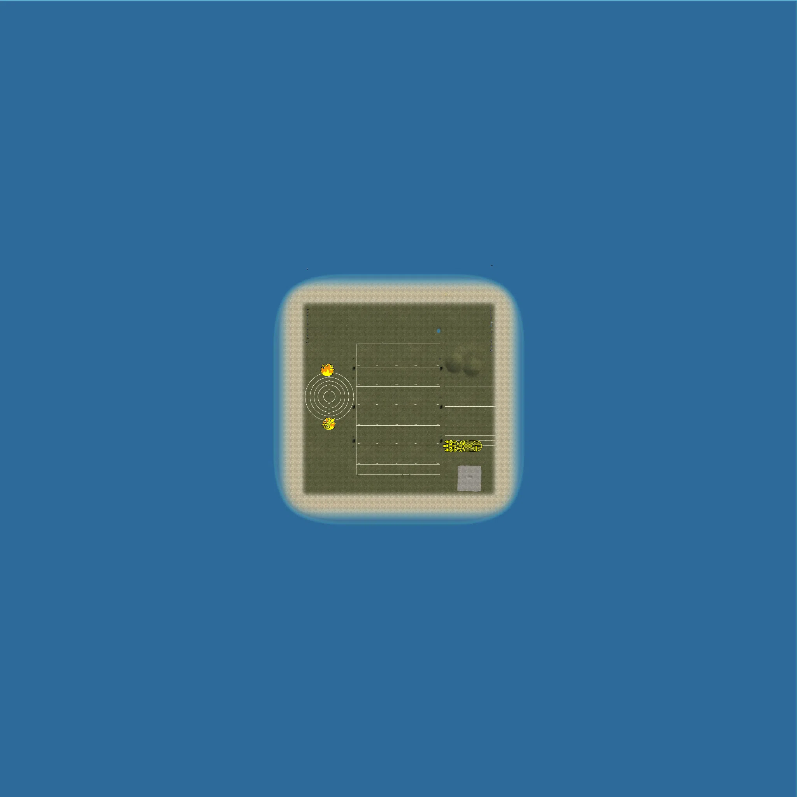
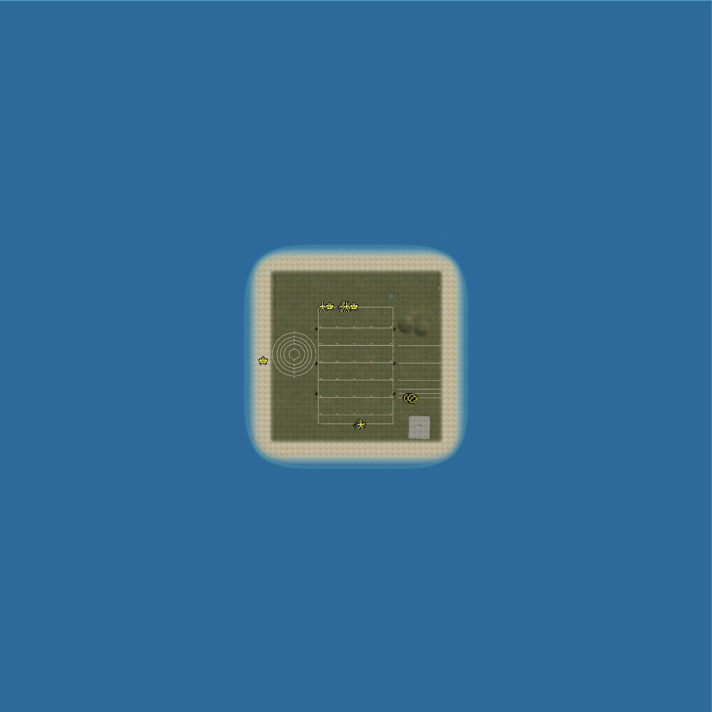
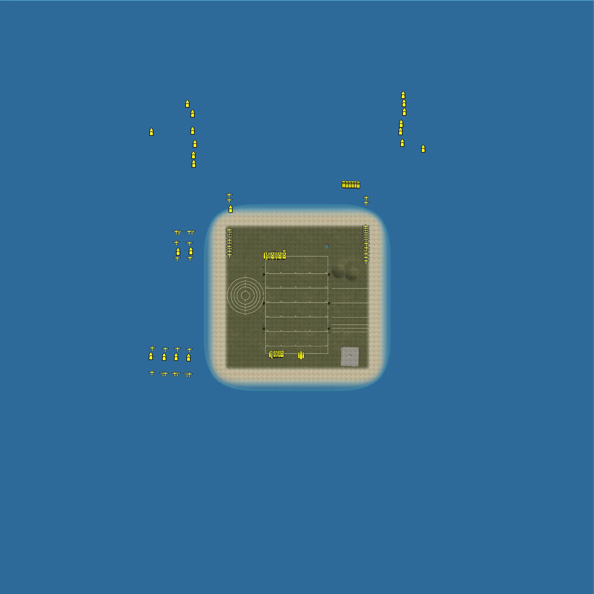

Static Ammo Crate

Pickup Kit

Static Emplacement

Vehicle

| gpo_subcat   | gpo_cat    | gpo_name                        |     pos_x |   pos_y |    pos_z |   flag | is_locked   |   team | instance                                            | gpo_cat_disp       | gpo_subcat_disp   |
|:-------------|:-----------|:--------------------------------|----------:|--------:|---------:|-------:|:------------|-------:|:----------------------------------------------------|:-------------------|:------------------|
| ammo_crate   | ammo_crate | ammo_crate                      |   -93.093 |  24.989 |  292.42  |      0 | False       |      0 | ammo_crate_0                                        | Static Ammo Crate  | Static Ammo Crate |
| ammo_crate   | ammo_crate | ammo_crate                      |   -60.949 |  24.989 |  292.263 |      0 | False       |      0 | ammo_crate_1                                        | Static Ammo Crate  | Static Ammo Crate |
| ammo_crate   | ammo_crate | ammo_crate                      |   -83.335 |  24.989 |  292.894 |      0 | False       |      0 | ammo_crate_2                                        | Static Ammo Crate  | Static Ammo Crate |
| ammo_crate   | ammo_crate | ammo_crate                      |  -358.087 |  24.989 | -112.507 |      0 | False       |      0 | ammo_crate_3                                        | Static Ammo Crate  | Static Ammo Crate |
| ammo_crate   | ammo_crate | ammo_crate                      |   438.661 |  24.989 | -239.555 |      0 | False       |      0 | ammo_crate_4                                        | Static Ammo Crate  | Static Ammo Crate |
| ammo_crate   | ammo_crate | ammo_crate                      |    55.724 |  24.989 |  301.575 |      0 | False       |      0 | ammo_crate_5                                        | Static Ammo Crate  | Static Ammo Crate |
| ammo_crate   | ammo_crate | ammo_crate                      |    31.954 |  24.989 |  302.035 |      0 | False       |      0 | ammo_crate_6                                        | Static Ammo Crate  | Static Ammo Crate |
| ammo_crate   | ammo_crate | ammo_crate                      |    67.947 |  24.989 |  298.947 |      0 | False       |      0 | ammo_crate_7                                        | Static Ammo Crate  | Static Ammo Crate |
| ammo_crate   | ammo_crate | ammo_crate                      |  -134.279 |  24.989 | -400.703 |      0 | False       |      0 | ammo_crate_8                                        | Static Ammo Crate  | Static Ammo Crate |
| ammo_crate   | ammo_crate | ammo_crate                      |   -93.26  |  24.989 | -400.703 |      0 | False       |      0 | ammo_crate_9                                        | Static Ammo Crate  | Static Ammo Crate |
| ammo_crate   | ammo_crate | ammo_crate                      |   -58.509 |  24.989 | -400.703 |      0 | False       |      0 | ammo_crate_10                                       | Static Ammo Crate  | Static Ammo Crate |
| ammo_crate   | ammo_crate | ammo_crate                      |   -17.489 |  24.989 | -400.703 |      0 | False       |      0 | ammo_crate_11                                       | Static Ammo Crate  | Static Ammo Crate |
| ammo_crate   | ammo_crate | ammo_crate                      |    14.124 |  24.989 | -400.703 |      0 | False       |      0 | ammo_crate_12                                       | Static Ammo Crate  | Static Ammo Crate |
| ammo_crate   | ammo_crate | ammo_crate                      |    55.144 |  24.989 | -400.703 |      0 | False       |      0 | ammo_crate_13                                       | Static Ammo Crate  | Static Ammo Crate |
| ammo_crate   | ammo_crate | ammo_crate                      |    89.895 |  24.989 | -400.703 |      0 | False       |      0 | ammo_crate_14                                       | Static Ammo Crate  | Static Ammo Crate |
| ammo_crate   | ammo_crate | ammo_crate                      |   130.914 |  24.989 | -400.703 |      0 | False       |      0 | ammo_crate_15                                       | Static Ammo Crate  | Static Ammo Crate |
| ammo_crate   | ammo_crate | ammo_crate                      |   -17.489 |  24.989 |  298.947 |      0 | False       |      0 | ammo_crate_16                                       | Static Ammo Crate  | Static Ammo Crate |
| ammo_crate   | ammo_crate | ammo_crate                      |  -357.553 |  24.989 |  136.497 |      0 | False       |      0 | ammo_crate_17                                       | Static Ammo Crate  | Static Ammo Crate |
| ammo_crate   | ammo_crate | ammo_crate                      |  -357.553 |  24.989 |  111.839 |      0 | False       |      0 | ammo_crate_18                                       | Static Ammo Crate  | Static Ammo Crate |
| ammo_crate   | ammo_crate | ammo_crate                      |  -357.553 |  24.989 |   91.443 |      0 | False       |      0 | ammo_crate_19                                       | Static Ammo Crate  | Static Ammo Crate |
| ammo_crate   | ammo_crate | ammo_crate                      |  -357.553 |  24.989 |   72.095 |      0 | False       |      0 | ammo_crate_20                                       | Static Ammo Crate  | Static Ammo Crate |
| ammo_crate   | ammo_crate | ammo_crate                      |  -357.553 |  24.989 |   41.723 |      0 | False       |      0 | ammo_crate_21                                       | Static Ammo Crate  | Static Ammo Crate |
| ammo_crate   | ammo_crate | ammo_crate                      |  -358.087 |  24.989 |  -16.82  |      0 | False       |      0 | ammo_crate_22                                       | Static Ammo Crate  | Static Ammo Crate |
| ammo_crate   | ammo_crate | ammo_crate                      |  -358.087 |  24.989 |  -46.853 |      0 | False       |      0 | ammo_crate_23                                       | Static Ammo Crate  | Static Ammo Crate |
| ammo_crate   | ammo_crate | ammo_crate                      |  -358.087 |  24.989 |  -67.436 |      0 | False       |      0 | ammo_crate_24                                       | Static Ammo Crate  | Static Ammo Crate |
| ammo_crate   | ammo_crate | ammo_crate                      |  -358.087 |  24.989 |  -87.658 |      0 | False       |      0 | ammo_crate_25                                       | Static Ammo Crate  | Static Ammo Crate |
| ammo_crate   | ammo_crate | ammo_crate                      |    13.337 |  24.989 |  307.602 |      0 | False       |      0 | ammo_crate_26                                       | Static Ammo Crate  | Static Ammo Crate |
| ammo_crate   | ammo_crate | ammo_crate                      |   421.531 |  24.989 | -239.555 |      0 | False       |      0 | ammo_crate_27                                       | Static Ammo Crate  | Static Ammo Crate |
| ammo_crate   | ammo_crate | ammo_crate                      |   431.167 |  24.989 | -239.555 |      0 | False       |      0 | ammo_crate_28                                       | Static Ammo Crate  | Static Ammo Crate |
| ammo_crate   | ammo_crate | ammo_crate                      |   269.155 |  24.989 | -239.555 |      0 | False       |      0 | ammo_crate_29                                       | Static Ammo Crate  | Static Ammo Crate |
| ammo_crate   | ammo_crate | ammo_crate                      |   252.025 |  24.989 | -239.555 |      0 | False       |      0 | ammo_crate_30                                       | Static Ammo Crate  | Static Ammo Crate |
| ammo_crate   | ammo_crate | ammo_crate                      |   261.661 |  24.989 | -239.555 |      0 | False       |      0 | ammo_crate_31                                       | Static Ammo Crate  | Static Ammo Crate |
| ammo_crate   | ammo_crate | ammo_crate                      |   316.594 |  24.989 | -246.132 |      0 | False       |      0 | ammo_crate_32                                       | Static Ammo Crate  | Static Ammo Crate |
| ammo_crate   | ammo_crate | ammo_crate                      |   294.386 |  25     | -243.619 |      0 | False       |      0 | ammo_crate_33                                       | Static Ammo Crate  | Static Ammo Crate |
| ammo_crate   | ammo_crate | ammo_crate                      |   306.125 |  24.989 | -246.132 |      0 | False       |      0 | ammo_crate_34                                       | Static Ammo Crate  | Static Ammo Crate |
| ammo_crate   | ammo_crate | ammo_crate                      |   348.939 |  24.989 | -239.555 |      0 | False       |      0 | ammo_crate_35                                       | Static Ammo Crate  | Static Ammo Crate |
| ammo_crate   | ammo_crate | ammo_crate                      |   328.18  |  24.989 | -247.288 |      0 | False       |      0 | ammo_crate_36                                       | Static Ammo Crate  | Static Ammo Crate |
| ammo_crate   | ammo_crate | ammo_crate                      |   341.445 |  24.989 | -239.555 |      0 | False       |      0 | ammo_crate_37                                       | Static Ammo Crate  | Static Ammo Crate |
| ammo_crate   | ammo_crate | ammo_crate                      |   390.976 |  24.989 | -239.555 |      0 | False       |      0 | ammo_crate_38                                       | Static Ammo Crate  | Static Ammo Crate |
| ammo_crate   | ammo_crate | ammo_crate                      |   373.846 |  24.989 | -239.555 |      0 | False       |      0 | ammo_crate_39                                       | Static Ammo Crate  | Static Ammo Crate |
| ammo_crate   | ammo_crate | ammo_crate                      |   383.482 |  24.989 | -239.555 |      0 | False       |      0 | ammo_crate_40                                       | Static Ammo Crate  | Static Ammo Crate |
| ammo_crate   | ammo_crate | ammo_crate                      |   -40.26  |  25     |  294.469 |      0 | False       |      0 | ammo_crate_41                                       | Static Ammo Crate  | Static Ammo Crate |
| ammo_crate   | ammo_crate | ammo_crate                      |   -53.94  |  25     |  298.875 |      0 | False       |      0 | ammo_crate_42                                       | Static Ammo Crate  | Static Ammo Crate |
| ammo_crate   | ammo_crate | ammo_crate                      |   -49.392 |  24.989 |  292.066 |      0 | False       |      0 | ammo_crate_43                                       | Static Ammo Crate  | Static Ammo Crate |
| ammo_crate   | ammo_crate | ammo_crate                      |   -73.167 |  24.989 |  291.948 |      0 | False       |      0 | ammo_crate_44                                       | Static Ammo Crate  | Static Ammo Crate |
| ammo_crate   | ammo_crate | ammo_crate                      |   331.809 |  24.989 | -239.555 |      0 | False       |      0 | ammo_crate_45                                       | Static Ammo Crate  | Static Ammo Crate |
| ammo_crate   | ammo_crate | ammo_crate                      |   301.013 |  25     | -243.619 |      0 | False       |      0 | ammo_crate_46                                       | Static Ammo Crate  | Static Ammo Crate |
| ammo         | kit        | JP_PickUpAmmokit                |  -354.126 |  25     |  148.076 |    107 | False       |      0 | CP_64_cmp_range_ataxis_Panzerfaust60                | Pickup Kit         | Ammo Kit          |
| ammo         | kit        | UW_PickUpAmmokit                |   290.036 |  25     | -244.038 |    102 | False       |      0 | CP_64_cmp_range_SmallarmsAllies_Ammo                | Pickup Kit         | Ammo Kit          |
| antitank     | kit        | JP_PickUpHeat                   |  -370.076 |  25     |  148.012 |    107 | False       |      0 | CP_64_cmp_range_ataxis_geballte                     | Pickup Kit         | Tankhunter Kit    |
| antitank     | kit        | JP_PickUpMolotov                |  -373.996 |  25     |  148.007 |    107 | False       |      0 | CP_64_cmp_range_ataxis_atnade                       | Pickup Kit         | Tankhunter Kit    |
| antitank     | kit        | WaW_US_Sapper3_pickup           |   334.133 |  25     | -244.017 |    101 | False       |      0 | CP_64_cmp_range_SmallarmsAxis_ammoGerman            | Pickup Kit         | Tankhunter Kit    |
| antitank     | kit        | JP_PickupTankhunter             |   362.018 |  25     | -244.058 |    101 | False       |      0 | CP_64_cmp_range_SmallarmsAxis_stg44                 | Pickup Kit         | Tankhunter Kit    |
| arty_dep     | kit        | JP_M81PickUpMortar              |  -350.096 |  25     |  148.027 |    107 | False       |      0 | CP_64_cmp_range_ataxis_Panzerfaust30                | Pickup Kit         | Deployable Arty   |
| arty_dep     | kit        | JP_PickUpMortar                 |  -378.084 |  25     |  148.054 |    107 | False       |      0 | CP_64_cmp_range_ataxis_schreck                      | Pickup Kit         | Deployable Arty   |
| arty_dep     | kit        | JP_PickUpMortarAT               |  -382.108 |  25     |  147.969 |    107 | False       |      0 | CP_64_cmp_range_ataxis_kaspanos                     | Pickup Kit         | Deployable Arty   |
| assault      | kit        | WaW_US_Trenchgunner_pickup      |  -361.914 |  25     | -128.024 |    108 | False       |      0 | CP_64_cmp_range_atallies_PTRD                       | Pickup Kit         | Assault Kit       |
| assault      | kit        | WaW_US_CQ2_M2Carbine_pickup     |  -349.932 |  25     | -128.028 |    108 | False       |      0 | CP_64_cmp_range_atallies_atmine                     | Pickup Kit         | Assault Kit       |
| assault      | kit        | JP_PickUpAssault                |  -358.085 |  25     |  148.049 |    107 | False       |      0 | CP_64_cmp_range_ataxis_Panzerfaust100               | Pickup Kit         | Assault Kit       |
| assault      | kit        | WaW_US_Gunner3_pickup           |   282.022 |  25     | -244.048 |    102 | False       |      0 | CP_64_cmp_range_SmallarmsAllies_svt40               | Pickup Kit         | Assault Kit       |
| assault      | kit        | WaW_US_NCO1_GreaseGun_pickup    |   269.994 |  25     | -244.006 |    102 | False       |      0 | CP_64_cmp_range_SmallarmsAllies_PPS42               | Pickup Kit         | Assault Kit       |
| assault      | kit        | WaW_US_NCO1_M1Carbine_pickup    |   266.008 |  25     | -244     |    102 | False       |      0 | CP_64_cmp_range_SmallarmsAllies_PPS43               | Pickup Kit         | Assault Kit       |
| assault      | kit        | WaW_US_NCO1_ThompsonM1A1_pickup |   261.992 |  25     | -243.998 |    102 | False       |      0 | CP_64_cmp_range_SmallarmsAllies_DT                  | Pickup Kit         | Assault Kit       |
| assault      | kit        | WaW_US_NCO2_M2Carbine_pickup    |   256.992 |  25     | -243.998 |    102 | False       |      0 | CP_64_cmp_range_SmallarmsAllies_mortar82            | Pickup Kit         | Assault Kit       |
| assault      | kit        | RE_PickupAssaultAVT40           |   251.992 |  25     | -243.998 |    102 | False       |      0 | CP_64_cmp_range_SmallarmsAllies_avt40               | Pickup Kit         | Assault Kit       |
| assault      | kit        | WaW_US_Ranger_pickup            |   330.176 |  25     | -243.955 |    101 | False       |      0 | CP_64_cmp_range_SmallarmsAxis_ammofinnish           | Pickup Kit         | Assault Kit       |
| assault      | kit        | JP_PickUpShotgun                |   341.986 |  25     | -243.95  |    101 | False       |      0 | CP_64_cmp_range_SmallarmsAxis_K98kZF                | Pickup Kit         | Assault Kit       |
| easteregg    | kit        | JP_PickUpSuicide                |   354.093 |  25     | -243.977 |    101 | False       |      0 | CP_64_cmp_range_SmallarmsAxis_g43                   | Pickup Kit         | Easteregg         |
| engineer     | kit        | JP_PickUpEngineer               |  -362.161 |  25     |  147.941 |    107 | False       |      0 | CP_64_cmp_range_ataxis_Haft                         | Pickup Kit         | Engineer Kit      |
| flame        | kit        | WaW_US_Flamethrower_pickup      |  -357.979 |  25     | -128.011 |    108 | False       |      0 | CP_64_cmp_range_atallies_PTRS                       | Pickup Kit         | Flamethrower Kit  |
| flame        | kit        | JP_PickUpFlamethrower           |  -366.038 |  25     |  148.054 |    107 | False       |      0 | CP_64_cmp_range_ataxis_3kg                          | Pickup Kit         | Flamethrower Kit  |
| mg           | kit        | WaW_US_LMG1_LMG2_pickup         |   278.087 |  25     | -244.007 |    102 | False       |      0 | CP_64_cmp_range_SmallarmsAllies_svt40_scope         | Pickup Kit         | MG Kit            |
| mg           | kit        | WaW_US_LMG2_pickup              |   274.079 |  25     | -244.008 |    102 | False       |      0 | CP_64_cmp_range_SmallarmsAllies_PPsh41_35rd         | Pickup Kit         | MG Kit            |
| mg           | kit        | JP_PickUpSupport                |   358.091 |  25     | -243.928 |    101 | False       |      0 | CP_64_cmp_range_SmallarmsAxis_g43zf                 | Pickup Kit         | MG Kit            |
| parachute    | kit        | JP_PickUpPilot                  |   338.055 |  25     | -243.941 |    101 | False       |      0 | CP_64_cmp_range_SmallarmsAxis_K98ZF41               | Pickup Kit         | Parachute Kit     |
| sniper       | kit        | UW_PickUpSniperSpringfield      |   286.002 |  25     | -244.004 |    102 | False       |      0 | CP_64_cmp_range_SmallarmsAllies_Mosin_Nagant_sniper | Pickup Kit         | Sniper Kit        |
| sniper       | kit        | JP_PickUpSniper                 |   346.094 |  25     | -243.969 |    101 | False       |      0 | CP_64_cmp_range_SmallarmsAxis_SVT40                 | Pickup Kit         | Sniper Kit        |
| sniper       | kit        | JP_PickUpSniper_type99          |   350.023 |  25     | -243.924 |    101 | False       |      0 | CP_64_cmp_range_SmallarmsAxis_g41                   | Pickup Kit         | Sniper Kit        |
| sniper       | kit        | JP_PickUpSniper_type99          |   366.085 |  25     | -244.055 |    101 | False       |      0 | CP_64_cmp_range_SmallarmsAxis_stg44zf               | Pickup Kit         | Sniper Kit        |
| sniper       | kit        | JP_PickUpSniper_type99          |   370.123 |  25     | -244.044 |    101 | False       |      0 | CP_64_cmp_range_SmallarmsAxis_VG45                  | Pickup Kit         | Sniper Kit        |
| sniper       | kit        | JP_PickUpSniper_type99          |   374.074 |  25     | -243.973 |    101 | False       |      0 | CP_64_cmp_range_SmallarmsAxis_VK98                  | Pickup Kit         | Sniper Kit        |
| sniper       | kit        | JP_PickUpSniper_type99          |   378.032 |  25     | -243.996 |    101 | False       |      0 | CP_64_cmp_range_SmallarmsAxis_mp40                  | Pickup Kit         | Sniper Kit        |
| sniper       | kit        | JP_PickUpSniper_type99          |   382.034 |  25     | -244.02  |    101 | False       |      0 | CP_64_cmp_range_SmallarmsAxis_beretta               | Pickup Kit         | Sniper Kit        |
| sniper       | kit        | JP_PickUpSniper_type99          |   386.14  |  25     | -243.997 |    101 | False       |      0 | CP_64_cmp_range_SmallarmsAxis_suomistick            | Pickup Kit         | Sniper Kit        |
| sniper       | kit        | JP_PickUpSniper_type99          |   390.019 |  25     | -243.879 |    101 | False       |      0 | CP_64_cmp_range_SmallarmsAxis_mg34                  | Pickup Kit         | Sniper Kit        |
| sniper       | kit        | JP_PickUpSniper_type99          |   394.178 |  25     | -244.037 |    101 | False       |      0 | CP_64_cmp_range_SmallarmsAxis_mg42                  | Pickup Kit         | Sniper Kit        |
| sniper       | kit        | JP_PickUpSniper_type99          |   398.1   |  25     | -243.965 |    101 | False       |      0 | CP_64_cmp_range_SmallarmsAxis_mg26                  | Pickup Kit         | Sniper Kit        |
| sniper       | kit        | JP_PickUpSniper_type99          |   402.1   |  25     | -243.965 |    101 | False       |      0 | CP_64_cmp_range_SmallarmsAxis_luftfaust             | Pickup Kit         | Sniper Kit        |
| zooka        | kit        | WaW_US_AT2_M18_pickup           |  -366.025 |  25     | -127.972 |    108 | False       |      0 | CP_64_cmp_range_atallies_rpg43                      | Pickup Kit         | HEAT Thrower      |
| zooka        | kit        | WaW_US_AT3_M18_pickup           |  -354.01  |  25     | -128.025 |    108 | False       |      0 | CP_64_cmp_range_atallies_Panzerfaust30              | Pickup Kit         | HEAT Thrower      |
| noidea       | noidea     | dummy_soldier                   |   315.653 |  25.993 | -215.475 |    102 | False       |      0 | CP_64_cmp_range_SmallarmsAllies_dummysoldier        | FIXME UNASSIGNED   | FIXME UNASSIGNED  |
| noidea       | noidea     | dummy_soldier                   |   338.643 |  25.993 | -214.932 |    102 | False       |      0 | CP_64_cmp_range_SmallarmsAllies_0                   | FIXME UNASSIGNED   | FIXME UNASSIGNED  |
| noidea       | noidea     | dummy_soldier                   |   327.564 |  25.993 | -198.449 |    102 | False       |      0 | CP_64_cmp_range_SmallarmsAllies_1_1                 | FIXME UNASSIGNED   | FIXME UNASSIGNED  |
| noidea       | noidea     | dummy_soldier                   |   308.184 |  25.993 | -199.022 |    102 | False       |      0 | CP_64_cmp_range_SmallarmsAllies_2_1                 | FIXME UNASSIGNED   | FIXME UNASSIGNED  |
| noidea       | noidea     | dummy_soldier                   |   355.642 |  25.993 | -200.088 |    102 | False       |      0 | CP_64_cmp_range_SmallarmsAllies_3                   | FIXME UNASSIGNED   | FIXME UNASSIGNED  |
| noidea       | noidea     | dummy_soldier                   |   360.433 |  25.993 | -215.426 |    102 | False       |      0 | CP_64_cmp_range_SmallarmsAllies_4                   | FIXME UNASSIGNED   | FIXME UNASSIGNED  |
| noidea       | noidea     | dummy_soldier                   |   300.29  |  25.993 | -214.804 |    102 | False       |      0 | CP_64_cmp_range_SmallarmsAllies_5                   | FIXME UNASSIGNED   | FIXME UNASSIGNED  |
| noidea       | noidea     | dummy_soldier                   |   286.653 |  25.993 | -214.865 |    102 | False       |      0 | CP_64_cmp_range_SmallarmsAllies_6                   | FIXME UNASSIGNED   | FIXME UNASSIGNED  |
| noidea       | noidea     | dummy_soldier                   |   284.947 |  25.993 | -200.69  |    102 | False       |      0 | CP_64_cmp_range_SmallarmsAllies_7                   | FIXME UNASSIGNED   | FIXME UNASSIGNED  |
| noidea       | noidea     | dummy_soldier                   |   276.366 |  25.993 | -182.132 |    102 | False       |      0 | CP_64_cmp_range_SmallarmsAllies_8                   | FIXME UNASSIGNED   | FIXME UNASSIGNED  |
| noidea       | noidea     | dummy_soldier                   |   304.546 |  25.993 | -181.975 |    102 | False       |      0 | CP_64_cmp_range_SmallarmsAllies_9                   | FIXME UNASSIGNED   | FIXME UNASSIGNED  |
| noidea       | noidea     | dummy_soldier                   |   343.813 |  25.993 | -181.991 |    102 | False       |      0 | CP_64_cmp_range_SmallarmsAllies_10                  | FIXME UNASSIGNED   | FIXME UNASSIGNED  |
| noidea       | noidea     | dummy_soldier                   |   384.181 |  25.993 | -180.927 |    102 | False       |      0 | CP_64_cmp_range_SmallarmsAllies_11                  | FIXME UNASSIGNED   | FIXME UNASSIGNED  |
| noidea       | noidea     | dummy_soldier                   |   391.948 |  25.993 | -132.793 |    102 | False       |      0 | CP_64_cmp_range_SmallarmsAllies_12                  | FIXME UNASSIGNED   | FIXME UNASSIGNED  |
| noidea       | noidea     | dummy_soldier                   |   343.128 |  25.993 | -129.042 |    102 | False       |      0 | CP_64_cmp_range_SmallarmsAllies_13                  | FIXME UNASSIGNED   | FIXME UNASSIGNED  |
| noidea       | noidea     | dummy_soldier                   |   302.853 |  25.993 | -130.485 |    102 | False       |      0 | CP_64_cmp_range_SmallarmsAllies_14                  | FIXME UNASSIGNED   | FIXME UNASSIGNED  |
| noidea       | noidea     | dummy_soldier                   |   262.755 |  25.993 | -129.512 |    102 | False       |      0 | CP_64_cmp_range_SmallarmsAllies_15                  | FIXME UNASSIGNED   | FIXME UNASSIGNED  |
| noidea       | noidea     | dummy_soldier                   |   262.138 |  25.993 |  -32.44  |    102 | False       |      0 | CP_64_cmp_range_SmallarmsAllies_16                  | FIXME UNASSIGNED   | FIXME UNASSIGNED  |
| noidea       | noidea     | dummy_soldier                   |   309.075 |  25.993 |  -31.043 |    102 | False       |      0 | CP_64_cmp_range_SmallarmsAllies_17                  | FIXME UNASSIGNED   | FIXME UNASSIGNED  |
| noidea       | noidea     | dummy_soldier                   |   345.733 |  25.993 |  -29.895 |    102 | False       |      0 | CP_64_cmp_range_SmallarmsAllies_18                  | FIXME UNASSIGNED   | FIXME UNASSIGNED  |
| noidea       | noidea     | dummy_soldier                   |   385.831 |  25.993 |  -31.094 |    102 | False       |      0 | CP_64_cmp_range_SmallarmsAllies_19                  | FIXME UNASSIGNED   | FIXME UNASSIGNED  |
| noidea       | noidea     | dummy_soldier                   |   434.003 |  25.993 |  -32.173 |    102 | False       |      0 | CP_64_cmp_range_SmallarmsAllies_20                  | FIXME UNASSIGNED   | FIXME UNASSIGNED  |
| noidea       | noidea     | dummy_soldier                   |   475.22  |  25.993 |  -25.523 |    102 | False       |      0 | CP_64_cmp_range_SmallarmsAllies_21                  | FIXME UNASSIGNED   | FIXME UNASSIGNED  |
| noidea       | noidea     | dummy_soldier                   |   309.416 |  25.993 |   71.943 |    102 | False       |      0 | CP_64_cmp_range_SmallarmsAllies_23                  | FIXME UNASSIGNED   | FIXME UNASSIGNED  |
| noidea       | noidea     | dummy_soldier                   |   352.258 |  25.993 |   75.013 |    102 | False       |      0 | CP_64_cmp_range_SmallarmsAllies_24                  | FIXME UNASSIGNED   | FIXME UNASSIGNED  |
| noidea       | noidea     | dummy_soldier                   |   389.334 |  25.993 |   71.453 |    102 | False       |      0 | CP_64_cmp_range_SmallarmsAllies_25                  | FIXME UNASSIGNED   | FIXME UNASSIGNED  |
| noidea       | noidea     | dummy_soldier                   |   433.439 |  25.993 |   72.407 |    102 | False       |      0 | CP_64_cmp_range_SmallarmsAllies_26                  | FIXME UNASSIGNED   | FIXME UNASSIGNED  |
| noidea       | noidea     | dummy_soldier                   |   475.682 |  25.993 |   80.609 |    102 | False       |      0 | CP_64_cmp_range_SmallarmsAllies_27                  | FIXME UNASSIGNED   | FIXME UNASSIGNED  |
| noidea       | noidea     | ki84-I-Hei                      | -1018.2   |  35.964 | -523.328 |    108 | True        |      0 | CP_64_cmp_range_atallies_zero3                      | FIXME UNASSIGNED   | FIXME UNASSIGNED  |
| noidea       | noidea     | midway_hangar                   |  -526.812 |  25     |   88.473 |    107 | True        |      0 | CP_64_cmp_range_ataxis_hangar                       | FIXME UNASSIGNED   | FIXME UNASSIGNED  |
| noidea       | noidea     | krupp_silo_dest                 |  -527.435 |  25     |   31.299 |    107 | True        |      0 | CP_64_cmp_range_ataxis_silo                         | FIXME UNASSIGNED   | FIXME UNASSIGNED  |
| noidea       | noidea     | krupp_silo_dest                 |  -527.661 |  25     |   16.103 |    108 | True        |      0 | CP_64_cmp_range_atallies_2                          | FIXME UNASSIGNED   | FIXME UNASSIGNED  |
| noidea       | noidea     | krupp_silo_dest                 |  -511.003 |  25     |   15.401 |    107 | True        |      0 | CP_64_cmp_range_ataxis_3                            | FIXME UNASSIGNED   | FIXME UNASSIGNED  |
| noidea       | noidea     | krupp_silo_dest                 |  -511.479 |  25     |   31.633 |    107 | True        |      0 | CP_64_cmp_range_ataxis_4                            | FIXME UNASSIGNED   | FIXME UNASSIGNED  |
| noidea       | noidea     | krupp_silo_dest                 |  -541.391 |  25     |   30.333 |    107 | True        |      0 | CP_64_cmp_range_ataxis_5                            | FIXME UNASSIGNED   | FIXME UNASSIGNED  |
| noidea       | noidea     | krupp_silo_dest                 |  -541.15  |  25     |   15.905 |    107 | True        |      0 | CP_64_cmp_range_ataxis_6                            | FIXME UNASSIGNED   | FIXME UNASSIGNED  |
| arty         | static     | 81mm_Mortar_M1                  |   -50.157 |  25     |  285.983 |    104 | False       |      0 | CP_64_cmp_range_vehiclesallies_120mmmortar          | Static Emplacement | Artillery         |
| arty         | static     | m30_122mm                       |   -68.09  |  25     |  286.098 |    104 | False       |      0 | CP_64_cmp_range_vehiclesallies_M33Howitzer          | Static Emplacement | Artillery         |
| flak         | static     | 90mm_aa_at                      |  -149.989 |  25     |  286.006 |    104 | False       |      0 | CP_64_cmp_range_vehiclesallies_katjusha             | Static Emplacement | Anti-aircraft Gun |
| flak         | static     | fh1_25mmaa                      |    31.654 |  25     | -392.187 |    103 | False       |      0 | CP_64_cmp_range_vehiclesaxis_flakvierling           | Static Emplacement | Anti-aircraft Gun |
| flak         | static     | m1_90mm_aa                      |   -41.07  |  25.386 |  286.15  |    104 | False       |      0 | CP_64_cmp_range_vehiclesallies_bofors               | Static Emplacement | Anti-aircraft Gun |
| flak         | static     | m1_90mm_aa_radar                |    -9.464 |  25.003 |  286.142 |    104 | False       |      0 | CP_64_cmp_range_ataxis_radar                        | Static Emplacement | Anti-aircraft Gun |
| flak         | static     | m1_90mm_aa_radar                |  -532.72  |  25     |  -25.696 |    108 | True        |      0 | CP_64_cmp_range_atallies_radar                      | Static Emplacement | Anti-aircraft Gun |
| mg_nest      | static     | type92_nambu_bipod              |   295.751 |  25.901 | -242.986 |    102 | False       |      0 | CP_64_cmp_range_SmallarmsAllies_staticdp            | Static Emplacement | Static MG         |
| mg_nest      | static     | type92_nambu_bipod              |   298.004 |  25.87  | -242.954 |    102 | False       |      0 | CP_64_cmp_range_SmallarmsAllies_staticDT            | Static Emplacement | Static MG         |
| mg_nest      | static     | type99_emp_bipod                |   299.838 |  25.834 | -243.03  |    102 | False       |      0 | CP_64_cmp_range_SmallarmsAllies_maximsand           | Static Emplacement | Static MG         |
| mg_nest      | static     | type92_nambu_tripod             |   327.212 |  25     | -243.624 |    102 | False       |      0 | CP_64_cmp_range_SmallarmsAllies_mortar              | Static Emplacement | Static MG         |
| mg_nest      | static     | type92_nambu_tripod             |   331.73  |  25     | -248.781 |    101 | False       |      0 | CP_64_cmp_range_SmallarmsAxis_mortar                | Static Emplacement | Static MG         |
| mg_nest      | static     | type99_emp_bipod                |   312.076 |  25.856 | -243.023 |    101 | False       |      0 | CP_64_cmp_range_SmallarmsAxis_maximfinsand          | Static Emplacement | Static MG         |
| mg_nest      | static     | type99_emp_bipod                |   315.991 |  25.863 | -242.97  |    101 | False       |      0 | CP_64_cmp_range_SmallarmsAxis_staticmg34            | Static Emplacement | Static MG         |
| mg_nest      | static     | type99_emp_bipod                |   317.994 |  25.871 | -243.011 |    101 | False       |      0 | CP_64_cmp_range_SmallarmsAxis_staticmg42            | Static Emplacement | Static MG         |
| mg_nest      | static     | 50cal_watercooled_tripod        |   323.213 |  25     | -244.653 |    101 | False       |      0 | CP_64_cmp_range_SmallarmsAxis_mg34lafette           | Static Emplacement | Static MG         |
| pak          | static     | 5inch_coastal                   |  -194.033 |  25     |  286.006 |    104 | False       |      0 | CP_64_cmp_range_vehiclesallies_t70                  | Static Emplacement | Anti-tank Gun     |
| pak          | static     | 37mm_m3                         |   -82.091 |  25     |  286.001 |    104 | False       |      0 | CP_64_cmp_range_vehiclesallies_57mmZIS2mobile       | Static Emplacement | Anti-tank Gun     |
| pak          | static     | 57mm_M1_ATgun                   |   -76.053 |  25     |  285.983 |    104 | False       |      0 | CP_64_cmp_range_vehiclesallies_zis3mobile           | Static Emplacement | Anti-tank Gun     |
| pak          | static     | 76mm_M5_ATgun                   |   -56.157 |  25     |  285.983 |    104 | False       |      0 | CP_64_cmp_range_vehiclesallies_maximaa              | Static Emplacement | Anti-tank Gun     |
| pak          | static     | type1_atgun                     |     8.059 |  25     | -392.024 |    103 | False       |      0 | CP_64_cmp_range_vehiclesaxis_45mmMobile             | Static Emplacement | Anti-tank Gun     |
| pak          | static     | type1_atgun_static              |    14.053 |  25     | -391.951 |    103 | False       |      0 | CP_64_cmp_range_vehiclesaxis_37mmPakMobile          | Static Emplacement | Anti-tank Gun     |
| pak          | static     | 75mmdp                          |    20.061 |  25     | -392.085 |    103 | False       |      0 | CP_64_cmp_range_vehiclesaxis_PAK38Mobile            | Static Emplacement | Anti-tank Gun     |
| pak          | static     | 75mmDP                          |    25.53  |  25     | -392     |    103 | False       |      0 | CP_64_cmp_range_vehiclesaxis_flak38                 | Static Emplacement | Anti-tank Gun     |
| apc          | vehicle    | M3_Scoutcar                     |  -206.059 |  25     |  285.976 |    104 | False       |      0 | CP_64_cmp_range_vehiclesallies_universalcarrierDT   | Vehicle            | APC               |
| apc          | vehicle    | GMC_M3_75mm                     |  -198.033 |  25     |  286.009 |    104 | True        |      0 | CP_64_cmp_range_vehiclesallies_ba64                 | Vehicle            | APC               |
| apc          | vehicle    | ho-ki                           |  -167.958 |  25     | -393.091 |    103 | False       |      0 | CP_64_cmp_range_vehiclesaxis_opelblitzammo          | Vehicle            | APC               |
| apc          | vehicle    | ho-ki_mg                        |  -163.825 |  25     | -392.979 |    103 | False       |      0 | CP_64_cmp_range_vehiclesaxis_opelblitzflak          | Vehicle            | APC               |
| apc          | vehicle    | lvt-2                           |   421.854 |  22     |  773.821 |    105 | True        |      0 | CP_64_cmp_range_planesallies_lvt                    | Vehicle            | APC               |
| apc          | vehicle    | lvt-4                           |   400.386 |  22     |  776.805 |    105 | True        |      0 | CP_64_cmp_range_planesallies_lvt2                   | Vehicle            | APC               |
| apc          | vehicle    | lvt-4_flame                     |   381.463 |  22     |  775.781 |    105 | True        |      0 | CP_64_cmp_range_planesallies_lvt3                   | Vehicle            | APC               |
| apc          | vehicle    | lvt-5                           |   361.922 |  22     |  776.587 |    105 | True        |      0 | CP_64_cmp_range_planesallies_lvt5                   | Vehicle            | APC               |
| apc          | vehicle    | lvta-4_flame                    |   341.493 |  22     |  775.958 |    105 | True        |      0 | CP_64_cmp_range_planesallies_lvt6                   | Vehicle            | APC               |
| apc          | vehicle    | lvta-1                          |   321.11  |  22     |  778.273 |    105 | True        |      0 | CP_64_cmp_range_planesallies_lvta1                  | Vehicle            | APC               |
| arty_sp      | vehicle    | m4a3_rocket                     |  -162.116 |  25     |  285.971 |    104 | True        |      0 | CP_64_cmp_range_vehiclesallies_is2                  | Vehicle            | Mobile Arty       |
| arty_sp      | vehicle    | wespe_captured                  |  -156.009 |  25     |  286.04  |    104 | True        |      0 | CP_64_cmp_range_vehiclesallies_su152                | Vehicle            | Mobile Arty       |
| car          | vehicle    | gmc                             |  -214.149 |  25     |  286.064 |    104 | False       |      0 | CP_64_cmp_range_vehiclesallies_studebaker           | Vehicle            | Car               |
| car          | vehicle    | gmc_nocanvas                    |   -88.034 |  25     |  300     |    104 | False       |      0 | CP_64_cmp_range_vehiclesallies_ammoguns             | Vehicle            | Car               |
| car          | vehicle    | WillysMB_us                     |  -129.989 |  25     |  286.006 |    104 | False       |      0 | CP_64_cmp_range_vehiclesallies_ISU152               | Vehicle            | Car               |
| car          | vehicle    | FordGPA                         |   -94.003 |  25     |  286.052 |    104 | False       |      0 | CP_64_cmp_range_vehiclesallies_45mmmobile           | Vehicle            | Car               |
| car          | vehicle    | kurogane                        |  -179.878 |  25     | -393.049 |    103 | False       |      0 | CP_64_cmp_range_vehiclesaxis_kuebel                 | Vehicle            | Car               |
| car          | vehicle    | type94                          |  -175.944 |  25     | -393.07  |    103 | False       |      0 | CP_64_cmp_range_vehiclesaxis_krad                   | Vehicle            | Car               |
| car          | vehicle    | kurogane                        |  -140.873 |  25     | -392.005 |    103 | True        |      0 | CP_64_cmp_range_vehiclesaxis_panzerivh              | Vehicle            | Car               |
| car          | vehicle    | kurogane                        |  -110.891 |  25     | -392.117 |    103 | False       |      0 | CP_64_cmp_range_vehiclesaxis_finnt34                | Vehicle            | Car               |
| flak_sp      | vehicle    | M33                             |  -143.989 |  25     |  286.006 |    104 | False       |      0 | CP_64_cmp_range_vehiclesallies_studebakeraa         | Vehicle            | Mobile FlaK       |
| plane        | vehicle    | B25                             |   475.907 |  25     |  296.45  |    105 | True        |      0 | CP_64_cmp_range_planesallies_la5                    | Vehicle            | Airplane          |
| plane        | vehicle    | p-38j                           |   475.926 |  25     |  319.196 |    105 | True        |      0 | CP_64_cmp_range_planesallies_il2bombs               | Vehicle            | Airplane          |
| plane        | vehicle    | kate                            |  -466.822 |  25     |  370.64  |    106 | True        |      0 | CP_64_cmp_range_planesaxis_fw190                    | Vehicle            | Airplane          |
| plane        | vehicle    | a6m_zero                        |  -466.805 |  25     |  331.928 |    106 | True        |      0 | CP_64_cmp_range_planesaxis_bf109g2                  | Vehicle            | Airplane          |
| plane        | vehicle    | aichi_d3a                       |  -466.174 |  25     |  314.175 |    106 | True        |      0 | CP_64_cmp_range_planesaxis_ju87dalt2                | Vehicle            | Airplane          |
| plane        | vehicle    | betty                           |  -465.214 |  25     |  290.545 |    106 | True        |      0 | CP_64_cmp_range_planesaxis_ju87g1                   | Vehicle            | Airplane          |
| plane        | vehicle    | b25_torp                        |   475.966 |  25     |  272.01  |    105 | True        |      0 | CP_64_cmp_range_planesallies_plane1                 | Vehicle            | Airplane          |
| plane        | vehicle    | b26                             |   476.461 |  25     |  247.784 |    105 | True        |      0 | CP_64_cmp_range_planesallies_plane2                 | Vehicle            | Airplane          |
| plane        | vehicle    | catfish                         |   477.147 |  25     |  683.999 |    105 | True        |      0 | CP_64_cmp_range_planesallies_plane3                 | Vehicle            | Airplane          |
| plane        | vehicle    | hellcat                         |   477.71  |  25     |  338.611 |    105 | True        |      0 | CP_64_cmp_range_planesallies_plane4                 | Vehicle            | Airplane          |
| plane        | vehicle    | helldiver                       |   477.602 |  25     |  368.285 |    105 | True        |      0 | CP_64_cmp_range_planesallies_helldiver              | Vehicle            | Airplane          |
| plane        | vehicle    | j2f                             |   476.705 |  25     |  650.649 |    105 | True        |      0 | CP_64_cmp_range_planesallies_plane7                 | Vehicle            | Airplane          |
| plane        | vehicle    | sbd-3                           |   475.176 |  25     |  393.694 |    105 | True        |      0 | CP_64_cmp_range_planesallies_sbd                    | Vehicle            | Airplane          |
| plane        | vehicle    | dauntlesssbdtorch               |   475.999 |  25     |  410.852 |    105 | True        |      0 | CP_64_cmp_range_planesallies_dauntless              | Vehicle            | Airplane          |
| plane        | vehicle    | wildcat                         |   475.066 |  25     |  425.979 |    105 | True        |      0 | CP_64_cmp_range_planesallies_wildcat                | Vehicle            | Airplane          |
| plane        | vehicle    | f4u1a_corsair                   |   475.111 |  25     |  441.867 |    105 | True        |      0 | CP_64_cmp_range_planesallies_corsair1               | Vehicle            | Airplane          |
| plane        | vehicle    | f4u1a_corsair_early             |   474.92  |  25     |  456.753 |    105 | True        |      0 | CP_64_cmp_range_planesallies_corsair2               | Vehicle            | Airplane          |
| plane        | vehicle    | f4u1a_corsair_usmc_early        |   474.658 |  25     |  471.542 |    105 | True        |      0 | CP_64_cmp_range_planesallies_corsair                | Vehicle            | Airplane          |
| plane        | vehicle    | f4u1a_corsair_usmc_late         |   474.629 |  25     |  486.142 |    105 | True        |      0 | CP_64_cmp_range_planesallies_corsair4               | Vehicle            | Airplane          |
| plane        | vehicle    | a6m_zero_early                  |  -467.37  |  25     |  347.706 |    106 | True        |      0 | CP_64_cmp_range_planesaxis_zero2                    | Vehicle            | Airplane          |
| plane        | vehicle    | rufe                            |  -467.247 |  25     |  703.787 |    106 | True        |      0 | CP_64_cmp_range_planesaxis_rufe                     | Vehicle            | Airplane          |
| plane        | vehicle    | rufe_early                      |  -467.423 |  25     |  667.125 |    106 | True        |      0 | CP_64_cmp_range_planesaxis_rufe2                    | Vehicle            | Airplane          |
| plane        | vehicle    | ki27                            |  -466.721 |  25     |  390.51  |    106 | True        |      0 | CP_64_cmp_range_planesaxis_ki                       | Vehicle            | Airplane          |
| plane        | vehicle    | ki61                            |  -466.039 |  25     |  411.159 |    106 | True        |      0 | CP_64_cmp_range_planesaxis_ki61                     | Vehicle            | Airplane          |
| plane        | vehicle    | ki84                            |  -467.005 |  25     |  428.387 |    106 | True        |      0 | CP_64_cmp_range_planesaxis_ki84                     | Vehicle            | Airplane          |
| plane        | vehicle    | n1k1                            |  -466.905 |  25     |  445.357 |    106 | True        |      0 | CP_64_cmp_range_planesaxis_n1k1                     | Vehicle            | Airplane          |
| plane        | vehicle    | ki84-hei                        |  -467.104 |  25     |  461.393 |    106 | True        |      0 | CP_64_cmp_range_planesaxis__ki43                    | Vehicle            | Airplane          |
| plane        | vehicle    | a6m_zero_early                  |  -757.226 |  35.826 | -532.344 |    108 | True        |      0 | CP_64_cmp_range_atallies_air1                       | Vehicle            | Airplane          |
| plane        | vehicle    | kate                            |  -826.688 |  35.984 | -528.461 |    108 | True        |      0 | CP_64_cmp_range_atallies_airb1                      | Vehicle            | Airplane          |
| plane        | vehicle    | aichi_d3a                       |  -823.951 |  35.921 | -355.436 |    108 | True        |      0 | CP_64_cmp_range_atallies_aichi                      | Vehicle            | Airplane          |
| plane        | vehicle    | a6m_zero_early                  |  -841.087 |  35.828 | -528.388 |    108 | True        |      0 | CP_64_cmp_range_atallies_zero2                      | Vehicle            | Airplane          |
| plane        | vehicle    | ki61                            |  -923.532 |  35.83  | -527.317 |    108 | True        |      0 | CP_64_cmp_range_atallies_zero4                      | Vehicle            | Airplane          |
| plane        | vehicle    | kate                            |  -742.431 |  35.914 | -532.12  |    108 | True        |      0 | CP_64_cmp_range_atallies_kate2                      | Vehicle            | Airplane          |
| plane        | vehicle    | kate                            |  -908.829 |  35.9   | -527.613 |    108 | True        |      0 | CP_64_cmp_range_atallies_kate3                      | Vehicle            | Airplane          |
| plane        | vehicle    | betty                           | -1000.12  |  36.257 | -520.334 |    108 | True        |      0 | CP_64_cmp_range_atallies_kate4                      | Vehicle            | Airplane          |
| plane        | vehicle    | aichi_d3a                       |  -907.309 |  35.928 | -357.22  |    108 | True        |      0 | CP_64_cmp_range_atallies_aichi2                     | Vehicle            | Airplane          |
| plane        | vehicle    | aichi_d3a                       |  -998.603 |  35.687 | -351.993 |    108 | True        |      0 | CP_64_cmp_range_atallies_aichi3                     | Vehicle            | Airplane          |
| plane        | vehicle    | aichi_d3a                       |  -741.805 |  35.813 | -362.373 |    108 | True        |      0 | CP_64_cmp_range_atallies_achi4                      | Vehicle            | Airplane          |
| plane        | vehicle    | helldiver                       |  -737.398 |  42.767 |  270.349 |    105 | True        |      0 | CP_64_cmp_range_planesallies_hd2                    | Vehicle            | Airplane          |
| plane        | vehicle    | b26                             |  -723.537 |  43.09  |  450.334 |    105 | True        |      0 | CP_64_cmp_range_planesallies_b26b                   | Vehicle            | Airplane          |
| plane        | vehicle    | f4u1a_corsair_usmc_late         |  -743.352 |  42.906 |  450.977 |    105 | True        |      0 | CP_64_cmp_range_planesallies_cors2                  | Vehicle            | Airplane          |
| plane        | vehicle    | f4u1a_corsair_usmc_early        |  -742.684 |  42.637 |  371.24  |    105 | True        |      0 | CP_64_cmp_range_planesallies_cors3                  | Vehicle            | Airplane          |
| plane        | vehicle    | b26                             |  -813.703 |  43.058 |  448.527 |    106 | True        |      0 | CP_64_cmp_range_planesaxis_b26c                     | Vehicle            | Airplane          |
| plane        | vehicle    | f4u1a_corsair_usmc_late         |  -831.002 |  42.867 |  449.235 |    106 | True        |      0 | CP_64_cmp_range_planesaxis_cors2                    | Vehicle            | Airplane          |
| plane        | vehicle    | f4u1a_corsair_usmc_early        |  -832.441 |  42.839 |  375.678 |    106 | True        |      0 | CP_64_cmp_range_planesaxis_cors4                    | Vehicle            | Airplane          |
| plane        | vehicle    | helldiver                       |  -825.807 |  42.76  |  268.184 |    106 | True        |      0 | CP_64_cmp_range_planesaxis_hd3                      | Vehicle            | Airplane          |
| ship         | vehicle    | fh1_enterprise                  |   871.513 |  22     | 1023.23  |    105 | True        |      0 | CP_64_cmp_range_planesallies_ship1                  | Vehicle            | Ship              |
| ship         | vehicle    | fh1_fletcher                    |   719.87  |  22     | 1195.23  |    105 | True        |      0 | CP_64_cmp_range_planesallies_ship2                  | Vehicle            | Ship              |
| ship         | vehicle    | fh1_gato                        |   741.811 |  22     | 1277.18  |    105 | True        |      0 | CP_64_cmp_range_planesallies_ship3                  | Vehicle            | Ship              |
| ship         | vehicle    | fh1_pt_boat                     |   740.187 |  22     | 1337.95  |    105 | True        |      0 | CP_64_cmp_range_planesallies_ship4                  | Vehicle            | Ship              |
| ship         | vehicle    | GleavesClass                    |   733.56  |  22     | 1393.3   |    105 | True        |      0 | CP_64_cmp_range_planesallies_ship5                  | Vehicle            | Ship              |
| ship         | vehicle    | southdakota                     |   727.328 |  22     | 1063.84  |    105 | True        |      0 | CP_64_cmp_range_planesallies_ship6                  | Vehicle            | Ship              |
| ship         | vehicle    | fh1_daihatsu                    |  -710.138 |  22     |  920.257 |    106 | True        |      0 | CP_64_cmp_range_planesaxis_ship1                    | Vehicle            | Ship              |
| ship         | vehicle    | fh1_hatsuzuki                   |  -712.072 |  22     |  980.88  |    106 | True        |      0 | CP_64_cmp_range_planesaxis_ship2                    | Vehicle            | Ship              |
| ship         | vehicle    | fh1_hatsuzuki_lcvp              |  -702.849 |  22     | 1058.63  |    106 | True        |      0 | CP_64_cmp_range_planesaxis_ship3                    | Vehicle            | Ship              |
| ship         | vehicle    | fh1_yamato                      |  -717.773 |  22     | 1147.85  |    106 | True        |      0 | CP_64_cmp_range_planesaxis_ship4                    | Vehicle            | Ship              |
| ship         | vehicle    | mogami                          |  -718.385 |  22     | 1265.36  |    106 | True        |      0 | CP_64_cmp_range_planesaxis_ship6                    | Vehicle            | Ship              |
| ship         | vehicle    | sampan                          |  -456.804 |  22     |  607.034 |    106 | False       |      0 | CP_64_cmp_range_planesaxis_sampan                   | Vehicle            | Ship              |
| ship         | vehicle    | fh1_shokaku                     | -1002.98  |  22     | 1140.72  |    106 | True        |      0 | CP_64_cmp_range_planesaxis_shokaku                  | Vehicle            | Ship              |
| ship         | vehicle    | subviib_waw                     |  -754.729 |  22     | 1334.23  |    106 | True        |      0 | CP_64_cmp_range_planesaxis_subvii                   | Vehicle            | Ship              |
| ship         | vehicle    | fh1_fletcher_lcvp               |   716.052 |  22     | 1143.22  |    105 | True        |      0 | CP_64_cmp_range_planesallies_fletchlc               | Vehicle            | Ship              |
| ship         | vehicle    | fh1_shokaku_dest                |  -746.579 |  22     | -416.087 |    107 | True        |      0 | CP_64_cmp_range_ataxis_shokdest                     | Vehicle            | Ship              |
| ship         | vehicle    | fh1_shokaku_dest_1              |  -831.112 |  22     | -412.323 |    108 | True        |      0 | CP_64_cmp_range_atallies_shokdest2                  | Vehicle            | Ship              |
| ship         | vehicle    | fh1_shokaku_dest_2              |  -913.065 |  22     | -411.176 |    108 | True        |      0 | CP_64_cmp_range_atallies_shokdest2_0                | Vehicle            | Ship              |
| ship         | vehicle    | fh1_shokaku_dest_3              | -1006.59  |  22     | -406.789 |    108 | True        |      0 | CP_64_cmp_range_atallies_shokdest3                  | Vehicle            | Ship              |
| ship         | vehicle    | fh1_enterprise_dest             |  -729.241 |  22     |  317.061 |    106 | True        |      0 | CP_64_cmp_range_planesaxis_entdest                  | Vehicle            | Ship              |
| ship         | vehicle    | fh1_enterprise_dest_1           |  -818.771 |  22     |  314.845 |    106 | True        |      0 | CP_64_cmp_range_planesaxis_entdest2                 | Vehicle            | Ship              |
| supply       | vehicle    | gmc_ammo                        |  -209.962 |  25     |  286.034 |    104 | False       |      0 | CP_64_cmp_range_vehiclesallies_studebakerammo       | Vehicle            | Supply Vehicle    |
| supply       | vehicle    | type94_ammo                     |  -171.897 |  25     | -393.029 |    103 | False       |      0 | CP_64_cmp_range_vehiclesaxis_opelblitz              | Vehicle            | Supply Vehicle    |
| supply       | vehicle    | type94_ammo                     |    28.07  |  25     | -400     |    103 | False       |      0 | CP_64_cmp_range_vehiclesaxis_ammoguns               | Vehicle            | Supply Vehicle    |
| tank         | vehicle    | m5a1_stuart_recon               |  -202.074 |  25     |  286.104 |    104 | False       |      0 | CP_64_cmp_range_vehiclesallies_M3A1                 | Vehicle            | Tank              |
| tank         | vehicle    | m3a1_stuart_pacific             |  -188.04  |  25     |  286.007 |    104 | True        |      0 | CP_64_cmp_range_vehiclesallies_t3476                | Vehicle            | Tank              |
| tank         | vehicle    | M3A1_Stuart                     |  -182.044 |  25     |  285.991 |    104 | True        |      0 | CP_64_cmp_range_vehiclesallies_t3485                | Vehicle            | Tank              |
| tank         | vehicle    | m4a1_early                      |  -174.061 |  25     |  286.017 |    104 | True        |      0 | CP_64_cmp_range_vehiclesallies_kv1s                 | Vehicle            | Tank              |
| tank         | vehicle    | M4a3                            |  -168.035 |  25     |  286.059 |    104 | True        |      0 | CP_64_cmp_range_vehiclesallies_su76m                | Vehicle            | Tank              |
| tank         | vehicle    | M51                             |  -136.989 |  25     |  286.006 |    104 | False       |      0 | CP_64_cmp_range_vehiclesallies_T34M41               | Vehicle            | Tank              |
| tank         | vehicle    | M24_Chaffee                     |  -123.989 |  25     |  286.006 |    104 | True        |      0 | CP_64_cmp_range_vehiclesallies_ISU152_DSHK          | Vehicle            | Tank              |
| tank         | vehicle    | M3_Lee                          |  -117.989 |  25     |  286.006 |    104 | True        |      0 | CP_64_cmp_range_vehiclesallies_ISU122               | Vehicle            | Tank              |
| tank         | vehicle    | M3Grant                         |   -88.034 |  25     |  286.049 |    104 | True        |      0 | CP_64_cmp_range_vehiclesallies_m1942mobile          | Vehicle            | Tank              |
| tank         | vehicle    | type94_teke                     |  -159.801 |  25     | -393.173 |    103 | True        |      0 | CP_64_cmp_range_vehiclesaxis_hanomaglate            | Vehicle            | Tank              |
| tank         | vehicle    | Type95_Hago                     |  -155.833 |  25     | -392.964 |    103 | True        |      0 | CP_64_cmp_range_vehiclesaxis_stukazufuss            | Vehicle            | Tank              |
| tank         | vehicle    | type97_chiha                    |  -151.872 |  25     | -392.996 |    103 | True        |      0 | CP_64_cmp_range_vehiclesaxis_sfkfz7                 | Vehicle            | Tank              |
| tank         | vehicle    | chi_ha                          |  -147.765 |  25     | -392.909 |    103 | True        |      0 | CP_64_cmp_range_vehiclesaxis_sdkfz7aa               | Vehicle            | Tank              |
| tank         | vehicle    | type94_teke                     |  -135.183 |  25     | -392.06  |    103 | True        |      0 | CP_64_cmp_range_vehiclesaxis_panthera               | Vehicle            | Tank              |
| tank         | vehicle    | Type95_Hago                     |  -128.58  |  25     | -392.047 |    103 | True        |      0 | CP_64_cmp_range_vehiclesaxis_pantheralate           | Vehicle            | Tank              |
| tank         | vehicle    | type97_chiha                    |  -122.656 |  25     | -392.019 |    103 | True        |      0 | CP_64_cmp_range_vehiclesaxis_pantherglate           | Vehicle            | Tank              |
| tank         | vehicle    | Chi_Ha                          |  -116.464 |  25     | -392.013 |    103 | True        |      0 | CP_64_cmp_range_vehiclesaxis_tigerIlate             | Vehicle            | Tank              |
| tank         | vehicle    | type94_teke                     |  -103.891 |  25     | -392.117 |    103 | True        |      0 | CP_64_cmp_range_vehiclesaxis_finnt3485              | Vehicle            | Tank              |

