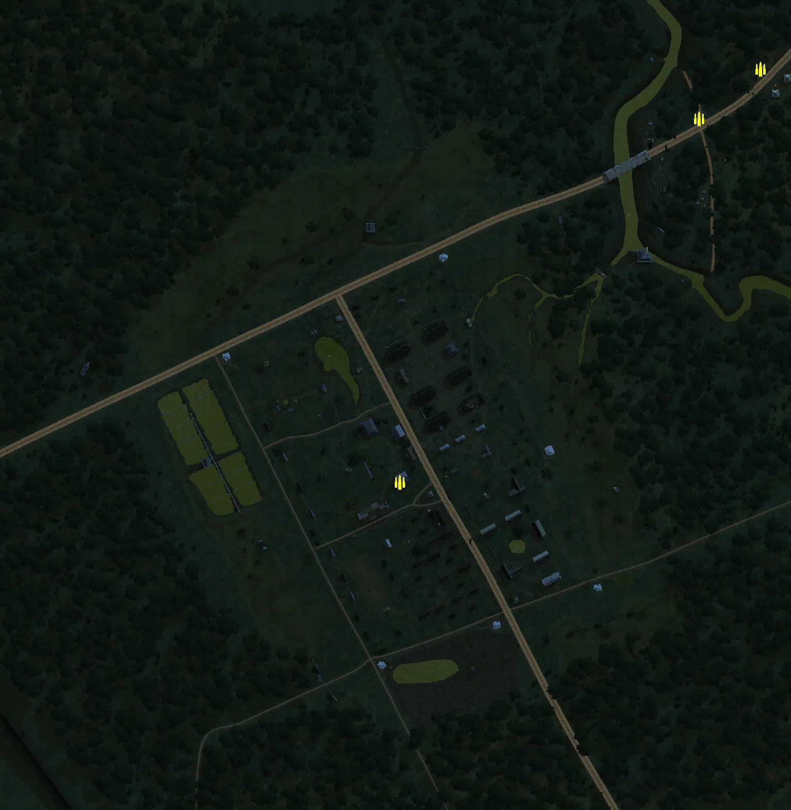
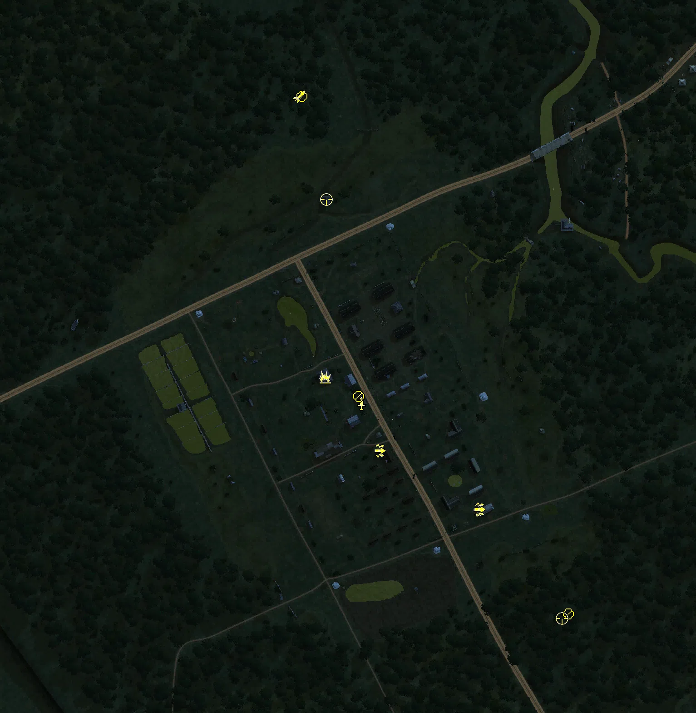
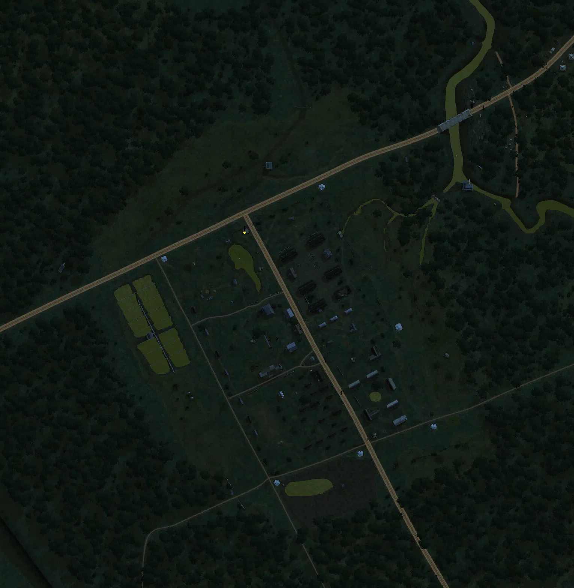
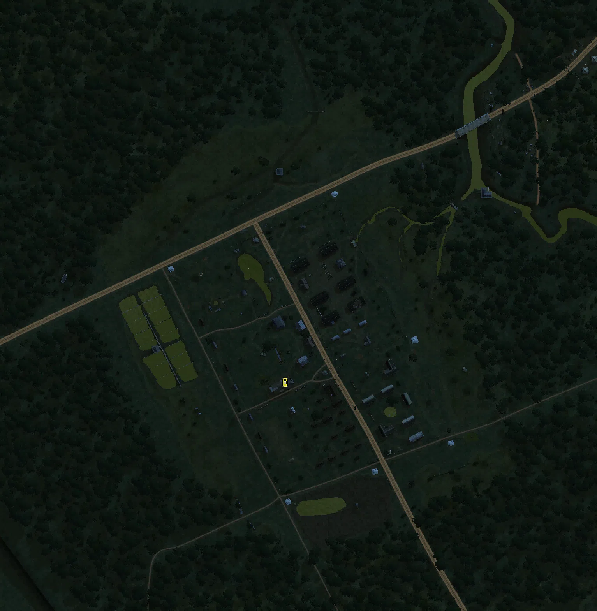

Static Ammo Crate

Pickup Kit

Static Emplacement

Vehicle

| gpo_subcat   | gpo_cat    | gpo_name                     |    pos_x |   pos_y |    pos_z |   flag | is_locked   |   team | instance                    | gpo_cat_disp       | gpo_subcat_disp   |
|:-------------|:-----------|:-----------------------------|---------:|--------:|---------:|-------:|:------------|-------:|:----------------------------|:-------------------|:------------------|
| ammo_crate   | ammo_crate | ammo_crate                   |  -27.282 |  32.736 | -170.861 |      0 | False       |      0 | ammo_crate_0                | Static Ammo Crate  | Static Ammo Crate |
| ammo_crate   | ammo_crate | ammo_crate                   |  262.406 |  19.623 |  180.764 |      0 | False       |      0 | ammo_crate_1                | Static Ammo Crate  | Static Ammo Crate |
| ammo_crate   | ammo_crate | ammo_crate                   |  322.249 |  20.215 |  228.767 |      0 | False       |      0 | ammo_crate_2                | Static Ammo Crate  | Static Ammo Crate |
| antitank     | kit        | UW_PickUpMolotov             |  -56.907 |  27.735 | -118.296 |      1 | False       |      0 | Officers_Quarters_molotov   | Pickup Kit         | Tankhunter Kit    |
| assault      | kit        | UW_PickUpWinchester          |  111.78  |  32.491 | -265.033 |      6 | False       |      0 | Rear_Gate_shotgun           | Pickup Kit         | Assault Kit       |
| assault      | kit        | UW_PickUpAssaultM1Garand     |  113.027 |  32.5   | -264.431 |      6 | False       |      0 | Rear_Gate_sniper            | Pickup Kit         | Assault Kit       |
| assault      | kit        | uw_pickupassaultm1thompson   |    3.208 |  31.124 | -199.968 |      1 | False       |      0 | Officers_Quarters_SMG       | Pickup Kit         | Assault Kit       |
| commando     | kit        | UW_PickUpCommandoM3Greasegun |  -16.9   |  30.978 | -148.027 |      1 | False       |      0 | Officers_Quarters_suicide   | Pickup Kit         | Commando Kit      |
| mg           | kit        | JP_PickUpSupport             |  210.983 |  34.112 | -379.732 |      3 | False       |      0 | JP_Reinforcements_MG        | Pickup Kit         | MG Kit            |
| mg           | kit        | UW_PickUpSupportM1918BAR     |  -19.942 |  31.782 | -139.978 |      1 | False       |      0 | Officers_Quarters_LMGscoped | Pickup Kit         | MG Kit            |
| mg_dep       | kit        | UW_PickUp30Cal               |  -82.481 |  14.516 |  189.794 |      2 | False       |      0 | US_command_deployMG         | Pickup Kit         | Deployable MG     |
| sniper       | kit        | JP_PickUpSniper              |  204.045 |  34.164 | -384.37  |      3 | False       |      0 | JP_Reinforcements_sniper    | Pickup Kit         | Sniper Kit        |
| sniper       | kit        | UW_PickUpSniperSpringfield   |  -55.643 |  21.764 |   76.635 |      2 | False       |      0 | US_command_hut_sniper       | Pickup Kit         | Sniper Kit        |
| zooka        | kit        | UW_PickUpBazookam9           |  -85.284 |  14.506 |  189.44  |      2 | False       |      0 | US_command_bazooka          | Pickup Kit         | HEAT Thrower      |
| noidea       | noidea     | p38_lightning_flyover        | -510.129 |  38.352 |   70.851 |      4 | False       |      0 | Distraction                 | FIXME UNASSIGNED   | FIXME UNASSIGNED  |
| noidea       | noidea     | p38_lightning_flyover        | -186.807 |  50     |  237.668 |      1 | False       |      0 | Distraction_Cabu_Bridge     | FIXME UNASSIGNED   | FIXME UNASSIGNED  |
| mg_nest      | static     | type92_nambu_bipod           |  -88.356 |  21.352 |   -9.634 |      4 | False       |      0 | Main_Gate_Axis_MG           | Static Emplacement | Static MG         |
| tank         | vehicle    | type95_hago                  |  -49.151 |  30.981 | -195.143 |      1 | True        |      0 | Officers_Quarters_tank      | Vehicle            | Tank              |

