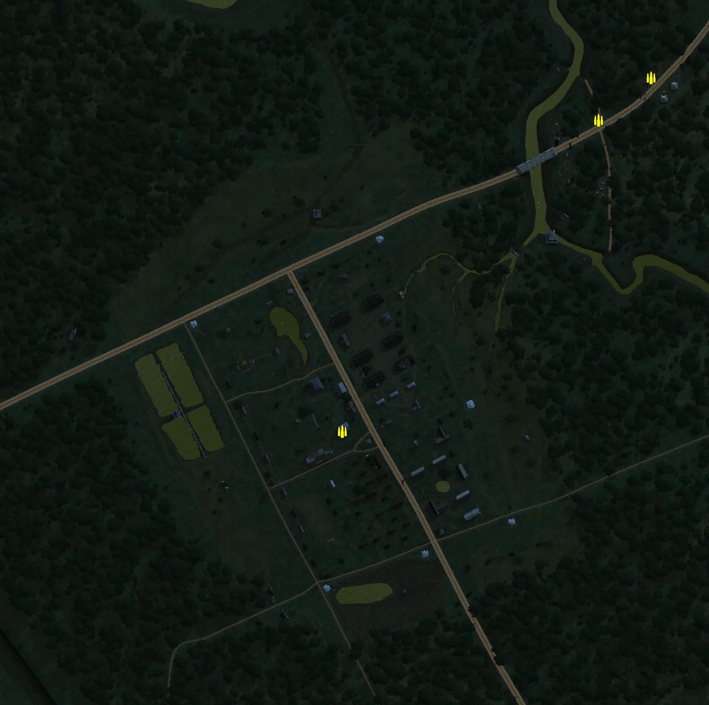
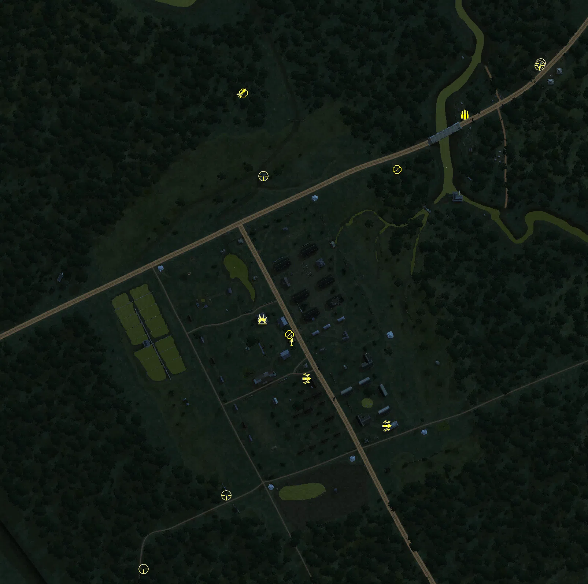
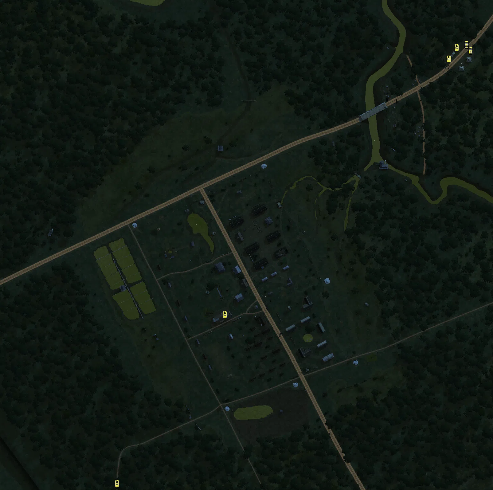

Static Ammo Crate

Pickup Kit

Static Emplacement

Vehicle

| Icon                      | SubCat            | Cat                | Name                         | Instance                      |   Flag |    X Pos |   Y Pos |    Z Pos |
|:--------------------------|:------------------|:-------------------|:-----------------------------|:------------------------------|-------:|---------:|--------:|---------:|
|     | Static Ammo Crate | Static Ammo Crate  | ammo_crate                   | ammo_crate_0                  |      0 |  -27.282 |  32.736 | -170.861 |
|     | Static Ammo Crate | Static Ammo Crate  | ammo_crate                   | ammo_crate_1                  |      0 |  262.406 |  19.623 |  180.764 |
|     | Static Ammo Crate | Static Ammo Crate  | ammo_crate                   | ammo_crate_2                  |      0 |  322.249 |  20.215 |  228.767 |
|     | Ammo Kit          | Pickup Kit         | JP_PickUpAmmokit             | Cabu_Bridge_Engineer          |      7 |  219.373 |  20.801 |  160.462 |
|     | Tankhunter Kit    | Pickup Kit         | UW_PickUpMolotov             | Officers_Quarters_molotov     |      1 |  -56.907 |  27.735 | -118.296 |
|  | Assault Kit       | Pickup Kit         | UW_PickUpWinchester          | Rear_Gate_shotgun             |      6 |  111.780 |  32.491 | -265.033 |
|  | Assault Kit       | Pickup Kit         | UW_PickUpAssaultM1Garand     | Rear_Gate_sniper              |      6 |  113.027 |  32.500 | -264.431 |
|  | Assault Kit       | Pickup Kit         | uw_pickupassaultm1thompson   | Officers_Quarters_SMG         |      1 |    3.208 |  31.124 | -199.968 |
|    | Commando Kit      | Pickup Kit         | UW_PickUpCommandoM3Greasegun | Officers_Quarters_suicide     |      1 |  -16.900 |  30.978 | -148.027 |
|       | MG Kit            | Pickup Kit         | UW_PickUpSupportM1918BAR     | Officers_Quarters_LMGscoped   |      1 |  -19.942 |  31.782 | -139.978 |
|      | Deployable MG     | Pickup Kit         | UW_PickUp30Cal               | US_command_deployMG           |      2 |  -82.481 |  14.516 |  189.794 |
|      | Deployable MG     | Pickup Kit         | UW_PickUpm1917a1             | Cabu_Bridge_deployMG          |      7 |  127.053 |  21.698 |   85.381 |
|   | Sniper Kit        | Pickup Kit         | JP_PickUpSniper_type99       | JP_Reinforcements_MG          |      3 |  323.132 |  21.031 |  230.317 |
|   | Sniper Kit        | Pickup Kit         | JP_PickUpSniper              | JP_Reinforcements_sniper      |      3 |  321.638 |  21.024 |  227.713 |
|   | Sniper Kit        | Pickup Kit         | UW_PickUpSniperSpringfield   | US_command_hut_sniper         |      2 |  -55.643 |  21.764 |   76.635 |
|   | Sniper Kit        | Pickup Kit         | JP_PickUpSniper_type99       | Japanese2_sniper              |     10 | -219.134 |  23.954 | -460.151 |
|   | Sniper Kit        | Pickup Kit         | JP_PickUpSniper              | Japanese2_sniper2             |     10 | -105.959 |  26.977 | -359.612 |
|   | HEAT Thrower      | Pickup Kit         | UW_PickUpBazookam9           | US_command_bazooka            |      2 |  -85.284 |  14.506 |  189.440 |
|     | FIXME UNASSIGNED  | FIXME UNASSIGNED   | p38_lightning_flyover        | Distraction                   |      4 | -510.129 |  38.352 |   70.851 |
|     | FIXME UNASSIGNED  | FIXME UNASSIGNED   | p38_lightning_flyover        | Distraction_Cabu_Bridge       |      7 |  508.380 |  40.570 |  304.206 |
|     | Artillery         | Static Emplacement | sgwr34_france                | Officers_Quarters_Axis_mortar |      1 |  -77.884 |  28.882 | -194.312 |
|     | Artillery         | Static Emplacement | sgwr34_france                | JP_Reinforcements_Axis_mortar |      3 |  300.646 |  20.052 |  224.426 |
|      | Static MG         | Static Emplacement | type92_nambu_bipod           | Main_Gate_Axis_MG             |      4 |  -88.356 |  21.352 |   -9.634 |
|      | Static MG         | Static Emplacement | type99_emp_bipod             | Rear_Gate_lmg                 |      6 |   85.585 |  30.763 | -286.730 |
|      | Static MG         | Static Emplacement | type99_emp_bipod             | Officers_Quarters_lmg         |      1 |  -29.822 |  28.059 | -115.844 |
|      | Static MG         | Static Emplacement | type99_emp_bipod             | Officers_Quarters_lmg2        |      1 |  -80.704 |  30.204 | -194.145 |
|      | Static MG         | Static Emplacement | type99_emp_bipod             | Officers_Quarters_lmg3        |      1 |    4.076 |  31.956 | -181.192 |
|      | Static MG         | Static Emplacement | type99_emp_bipod             | Officers_Quarters_mg_2        |      1 |  -62.416 |  30.059 | -145.469 |
|      | Static MG         | Static Emplacement | type99_emp_bipod             | Officers_Quarters_mg3         |      1 |  -65.394 |  30.091 | -147.066 |
|      | Static MG         | Static Emplacement | type99_emp_bipod             | POW_Barracks_mg               |      5 |  118.328 |  26.966 | -139.622 |
|      | APC               | Vehicle            | ho-ki                        | JP_Reinforcements_car         |      3 |  350.603 |  20.753 |  234.766 |
|      | Car               | Vehicle            | type94                       | JP_Reinforcements_car2        |      3 |  344.288 |  21.378 |  244.276 |
|     | Tank              | Vehicle            | type97_chiha                 | Officers_Quarters_tank        |      1 |  -49.151 |  30.981 | -195.143 |
|     | Tank              | Vehicle            | type97_chiha                 | JP_Reinforcements_tank1       |      3 |  315.625 |  19.930 |  221.168 |
|     | Tank              | Vehicle            | type94_teke                  | JP_Reinforcements_tank2       |      3 |  328.595 |  21.404 |  239.357 |
|     | Tank              | Vehicle            | type94_teke                  | Japanese2_tank                |     10 | -224.630 |  24.169 | -469.991 |

