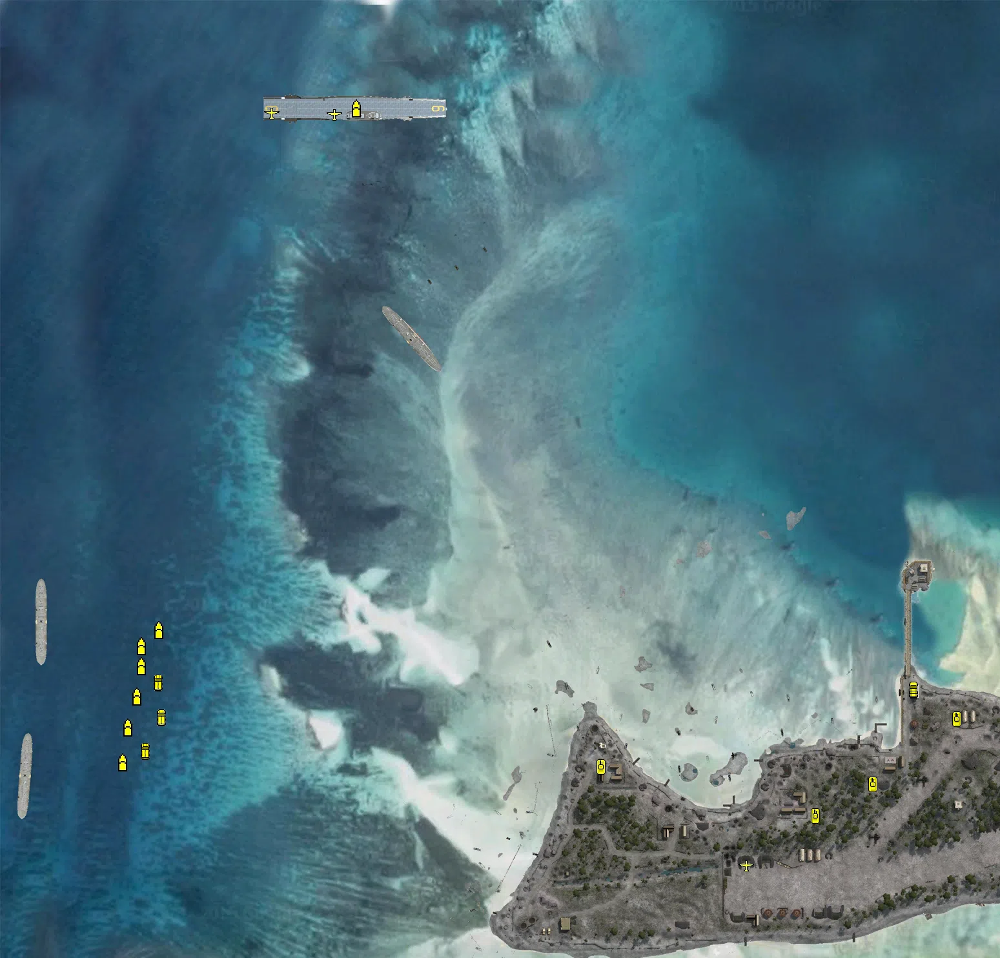

Static Ammo Crate

Pickup Kit

Static Emplacement

Vehicle

| Icon                       | SubCat            | Cat                | Name                        | Instance                                         |   Flag |    X Pos |   Y Pos |    Z Pos |
|:---------------------------|:------------------|:-------------------|:----------------------------|:-------------------------------------------------|-------:|---------:|--------:|---------:|
|      | Static Ammo Crate | Static Ammo Crate  | ammo_crate                  | ammo_crate_0                                     |      0 | -174.084 |  66.562 | -421.865 |
|      | Static Ammo Crate | Static Ammo Crate  | ammo_crate                  | ammo_crate_1                                     |      0 |  722.989 |  66.723 |  -94.622 |
|      | Static Ammo Crate | Static Ammo Crate  | ammo_crate                  | ammo_crate_2                                     |      0 |  525.293 |  66.890 | -155.655 |
|      | Static Ammo Crate | Static Ammo Crate  | ammo_crate                  | ammo_crate_3                                     |      0 |  395.036 |  67.562 |  -55.198 |
|      | Static Ammo Crate | Static Ammo Crate  | ammo_crate                  | ammo_crate_4                                     |      0 |  196.554 |  65.202 | -167.771 |
|      | Static Ammo Crate | Static Ammo Crate  | ammo_crate                  | ammo_crate_5                                     |      0 |   67.075 |  67.650 | -257.440 |
|      | Static Ammo Crate | Static Ammo Crate  | ammo_crate                  | ammo_crate_6                                     |      0 |  -91.177 |  68.601 | -134.849 |
|      | Static Ammo Crate | Static Ammo Crate  | ammo_crate                  | ammo_crate_7                                     |      0 | -143.088 |  67.280 | -399.206 |
|      | Static Ammo Crate | Static Ammo Crate  | ammo_crate                  | ammo_crate_8                                     |      0 |  622.803 |  68.431 | -326.866 |
|      | Static Ammo Crate | Static Ammo Crate  | ammo_crate                  | ammo_crate_9                                     |      0 |  772.694 |  66.119 | -111.898 |
|      | Ammo Kit          | Pickup Kit         | JP_PickUpAmmokit            | CP_32_pmc_tarawa_1943_RedBeach_Repairkit         |    305 |  227.584 |  65.455 | -152.394 |
|      | Ammo Kit          | Pickup Kit         | JP_PickUpAmmokit            | CP_32_pmc_tarawa_1943_CoastalGuns_kit            |    302 | -193.776 |  70.152 | -396.197 |
|      | Ammo Kit          | Pickup Kit         | JP_PickUpAmmokit            | CP_32_pmc_tarawa_1943_GreenBeach_RepairKit       |    301 | -100.820 |  69.657 | -110.238 |
|      | Ammo Kit          | Pickup Kit         | JP_PickUpAmmokit            | CP_32_pmc_tarawa_1943_ThePocket_RepairKit        |    303 |  174.513 |  66.081 | -159.945 |
|      | Ammo Kit          | Pickup Kit         | JP_PickUpAmmokit            | CP_32_pmc_tarawa_1943_ThePocket_0_7              |    303 |  145.138 |  66.263 | -235.317 |
|      | Ammo Kit          | Pickup Kit         | JP_PickUpAmmokit            | CP_32_pmc_tarawa_1943_ThePocket_1_5              |    303 |   62.761 |  65.688 | -232.599 |
|      | Ammo Kit          | Pickup Kit         | JP_PickUpAmmokit            | CP_32_pmc_tarawa_1943_GreenBeach_0_3             |    301 | -127.722 |  66.215 | -169.890 |
|      | Ammo Kit          | Pickup Kit         | JP_PickUpAmmokit            | CP_32_pmc_tarawa_1943_ThePocket_2                |    303 |  104.051 |  66.500 | -388.824 |
|  | Deployable Arty   | Pickup Kit         | JP_PickUpMortar             | CP_32_pmc_tarawa_1943_ThePocket_Japmortar        |    303 |  245.049 |  67.822 | -298.205 |
|  | Deployable Arty   | Pickup Kit         | JP_PickUpMortar             | CP_32_pmc_tarawa_1943_ThePocket_0_6              |    303 |  232.474 |  68.536 | -296.198 |
|   | Assault Kit       | Pickup Kit         | UW_PickUpAssaultM1Thompson  | CP_32_pmc_tarawa_1943_RedBeach_japmg             |    305 |  350.345 |  68.389 | -165.919 |
|   | Assault Kit       | Pickup Kit         | UW_PickUpAssaultM1Thompson  | CP_32_pmc_tarawa_1943_GreenBeach_japsmg          |    301 |  -76.488 |  68.588 | -165.776 |
|   | Assault Kit       | Pickup Kit         | UW_PickUpAssaultM1Thompson  | CP_32_pmc_tarawa_1943_CoastalGuns_japsmg         |    302 | -185.300 |  66.387 | -420.497 |
|  | Engineer Kit      | Pickup Kit         | UW_PickUpEngineerWinchester | CP_32_pmc_tarawa_1943_RedBeach_7                 |    305 |  407.615 |  68.411 | -102.267 |
|  | Engineer Kit      | Pickup Kit         | UW_PickUpEngineerWinchester | CP_32_pmc_tarawa_1943_ThePocket_1_4              |    303 |  195.128 |  68.230 | -231.310 |
|     | Flamethrower Kit  | Pickup Kit         | UW_PickUpFlamethrower       | CP_32_pmc_tarawa_1943_RedBeach_flamethrower      |    305 |  459.008 |  75.366 | -224.787 |
|     | Flamethrower Kit  | Pickup Kit         | UW_PickUpFlamethrower       | CP_32_pmc_tarawa_1943_GreenBeach_24              |    301 | -156.067 |  66.081 | -271.010 |
|     | Flamethrower Kit  | Pickup Kit         | UW_PickUpFlamethrower       | CP_32_pmc_tarawa_1943_ThePocket_25               |    303 |  190.955 |  66.199 | -167.703 |
|     | Flamethrower Kit  | Pickup Kit         | UW_PickUpFlamethrower       | CP_32_pmc_tarawa_1943_GreenBeach_25              |    301 |  -90.548 |  68.707 | -179.308 |
|     | Flamethrower Kit  | Pickup Kit         | UW_PickUpFlamethrower       | CP_32_pmc_tarawa_1943_CoastalGuns_21             |    302 | -146.286 |  71.235 | -404.586 |
|      | Parachute Kit     | Pickup Kit         | UW_PickUpPilotcolt1911      | CP_32_pmc_tarawa_1943_ThePocket_0_5              |    303 |  118.071 |  67.320 | -320.648 |
|      | Parachute Kit     | Pickup Kit         | UW_PickUpPilotcolt1911      | CP_32_pmc_tarawa_1943_ThePocket_1_3              |    303 |  146.487 |  67.420 | -320.884 |
|      | Parachute Kit     | Pickup Kit         | UW_PickUpPilotcolt1911      | CP_32_pmc_tarawa_1943_2ndMarineDivision_pilot    |    304 | -502.480 |  81.916 |  841.109 |
|      | Parachute Kit     | Pickup Kit         | UW_PickUpPilotcolt1911      | CP_32_pmc_tarawa_1943_2ndMarineDivision_1_2      |    304 | -609.565 |  81.916 |  845.809 |
|      | Parachute Kit     | Pickup Kit         | UW_PickUpPilotcolt1911      | CP_32_pmc_tarawa_1943_2ndMarineDivision_2_7      |    304 | -610.730 |  81.916 |  870.205 |
|      | Parachute Kit     | Pickup Kit         | UW_PickUpPilotcolt1911      | CP_32_pmc_tarawa_1943_2ndMarineDivision_3_1      |    304 | -430.365 |  81.916 |  843.466 |
|    | Sniper Kit        | Pickup Kit         | UW_PickUpSniperSpringfield  | CP_32_pmc_tarawa_1943_RedBeach_sniper            |    305 |  459.039 |  81.627 | -220.698 |
|    | Sniper Kit        | Pickup Kit         | UW_PickUpSniperSpringfield  | CP_32_pmc_tarawa_1943_GreenBeach_sniper          |    301 |  -68.007 |  67.766 | -168.286 |
|    | Sniper Kit        | Pickup Kit         | UW_PickUpSniperSpringfield  | CP_32_pmc_tarawa_1943_CoastalGuns_sniper         |    302 | -180.727 |  67.361 | -415.581 |
|    | Sniper Kit        | Pickup Kit         | UW_PickUpSniperSpringfield  | CP_32_pmc_tarawa_1943_ThePocket_sniper           |    303 |  207.172 |  68.446 | -208.836 |
|    | HEAT Thrower      | Pickup Kit         | UA_PickUpBazooka            | CP_32_pmc_tarawa_1943_ThePier_Pierbazooka        |    306 |  409.793 |  73.873 |  144.376 |
|    | HEAT Thrower      | Pickup Kit         | UA_PickUpBazooka            | CP_32_pmc_tarawa_1943_RedBeach_suicide           |    305 |  463.941 |  78.978 | -226.966 |
|    | HEAT Thrower      | Pickup Kit         | UA_PickUpBazooka            | CP_32_pmc_tarawa_1943_GreenBeach_mortarkit       |    301 |  -72.431 |  68.269 | -184.661 |
|    | HEAT Thrower      | Pickup Kit         | UA_PickUpBazooka            | CP_32_pmc_tarawa_1943_GreenBeach_bazooka         |    301 |  -90.027 |  68.768 | -173.209 |
|    | HEAT Thrower      | Pickup Kit         | UA_PickUpBazooka            | CP_32_pmc_tarawa_1943_CoastalGuns_suicidebazooka |    302 | -185.237 |  67.206 | -421.894 |
|    | HEAT Thrower      | Pickup Kit         | UA_PickUpBazooka            | CP_32_pmc_tarawa_1943_ThePocket_suicide          |    303 |   99.707 |  67.155 | -299.950 |
|    | HEAT Thrower      | Pickup Kit         | UA_PickUpBazooka            | CP_32_pmc_tarawa_1943_CoastalGuns_3_2            |    302 | -173.182 |  67.756 | -417.039 |
|    | HEAT Thrower      | Pickup Kit         | UA_PickUpBazooka            | CP_32_pmc_tarawa_1943_GreenBeach_0_4             |    301 |  -92.290 |  68.675 | -135.095 |
|      | Artillery         | Static Emplacement | 81mm_mortar_m1              | CP_32_pmc_tarawa_1943_GreenBeach_usaMortar       |    301 | -147.680 |  66.670 | -270.351 |
|      | Anti-aircraft Gun | Static Emplacement | fh1_25mmaa                  | CP_32_pmc_tarawa_1943_GreenBeach_2_3             |    301 | -126.787 |  66.261 | -166.656 |
|      | Anti-aircraft Gun | Static Emplacement | fh1_25mmaa                  | CP_32_pmc_tarawa_1943_CoastalGuns_12             |    302 | -171.749 |  67.932 | -389.543 |
|      | Anti-aircraft Gun | Static Emplacement | fh1_25mmaa                  | CP_32_pmc_tarawa_1943_ThePocket_0_4              |    303 |   93.039 |  65.976 | -259.002 |
|       | Static MG         | Static Emplacement | type92_nambu_bipod          | CP_32_pmc_tarawa_1943_RedBeach_MG99              |    305 |  518.712 |  69.123 |  -72.175 |
|       | Static MG         | Static Emplacement | type99_emp_bipod            | CP_32_pmc_tarawa_1943_RedBeach_13                |    305 |  325.030 |  67.802 | -127.583 |
|       | Static MG         | Static Emplacement | type92_nambu_bipod          | CP_32_pmc_tarawa_1943_GreenBeach_3               |    301 |  -28.655 |  67.007 | -192.266 |
|       | Static MG         | Static Emplacement | type99_emp_bipod            | CP_32_pmc_tarawa_1943_CoastalGuns_3_1            |    302 | -217.632 |  68.300 | -379.000 |
|       | Static MG         | Static Emplacement | type92_nambu_bipod          | CP_32_pmc_tarawa_1943_GreenBeach_14              |    301 | -165.207 |  67.140 | -275.834 |
|       | Static MG         | Static Emplacement | type92_nambu_bipod          | CP_32_pmc_tarawa_1943_CoastalGuns_14             |    302 | -179.570 |  67.108 | -296.577 |
|       | Static MG         | Static Emplacement | type92_nambu_bipod          | CP_32_pmc_tarawa_1943_GreenBeach_16              |    301 |  -90.122 |  72.491 | -129.424 |
|       | Static MG         | Static Emplacement | type92_nambu_bipod          | CP_32_pmc_tarawa_1943_ThePocket_17               |    303 |   60.300 |  66.725 | -231.615 |
|       | Static MG         | Static Emplacement | type92_nambu_bipod          | CP_32_pmc_tarawa_1943_ThePocket_7                |    303 |  167.550 |  68.404 | -173.521 |
|       | Static MG         | Static Emplacement | type92_nambu_bipod          | CP_32_pmc_tarawa_1943_ThePocket_8                |    303 |  261.967 |  66.928 | -136.981 |
|       | Static MG         | Static Emplacement | type99_emp_bipod            | CP_32_pmc_tarawa_1943_RedBeach_mg                |    305 |  392.843 |  72.235 |  -38.121 |
|       | Anti-tank Gun     | Static Emplacement | 8inch_defgun                | CP_32_pmc_tarawa_1943_GreenBeach_12              |    301 | -103.308 |  68.474 | -104.381 |
|       | Anti-tank Gun     | Static Emplacement | 8inch_defgun                | CP_32_pmc_tarawa_1943_CoastalGuns_9              |    302 | -213.975 |  68.222 | -410.369 |
|       | Anti-tank Gun     | Static Emplacement | 75mmdp                      | CP_32_pmc_tarawa_1943_ThePocket_13               |    303 |  146.834 |  66.152 | -230.344 |
|       | APC               | Vehicle            | lvt-2                       | CP_32_pmc_tarawa_1943_2ndMarineDivision_4_0      |    304 | -799.102 |  65.000 | -138.661 |
|       | APC               | Vehicle            | lvt-2                       | CP_32_pmc_tarawa_1943_2ndMarineDivision_3_0      |    304 | -778.665 |  64.800 |  -33.309 |
|       | APC               | Vehicle            | lvt-2                       | CP_32_pmc_tarawa_1943_2ndMarineDivision_2_6      |    304 | -774.232 |  65.000 |  -87.412 |
|       | Car               | Vehicle            | willysmb_us                 | CP_32_pmc_tarawa_1943_RedBeach_kurogane          |    305 |  391.055 |  67.482 |  -44.233 |
|     | Airplane          | Vehicle            | a6m_zero                    | CP_32_pmc_tarawa_1943_ThePocket_1_2              |    303 |  132.065 |  67.252 | -316.756 |
|     | Airplane          | Vehicle            | sbd-3                       | CP_32_pmc_tarawa_1943_2ndMarineDivision_20       |    304 | -506.157 |  82.965 |  846.550 |
|     | Airplane          | Vehicle            | hellcat                     | CP_32_pmc_tarawa_1943_2ndMarineDivision_21       |    304 | -602.615 |  82.160 |  848.561 |
|      | Ship              | Vehicle            | lcvp                        | CP_32_pmc_tarawa_1943_2ndMarineDivision_16       |    304 | -804.135 |  65.248 |   22.688 |
|      | Ship              | Vehicle            | lcvp                        | CP_32_pmc_tarawa_1943_2ndMarineDivision_2_5      |    304 | -811.111 |  65.134 |  -55.497 |
|      | Ship              | Vehicle            | lcvp                        | CP_32_pmc_tarawa_1943_2ndMarineDivision_4        |    304 | -824.544 |  65.096 | -103.004 |
|      | Ship              | Vehicle            | lcvp                        | CP_32_pmc_tarawa_1943_2ndMarineDivision_3        |    304 | -832.922 |  65.000 | -156.905 |
|      | Ship              | Vehicle            | fh1_enterprise_guns         | CP_32_pmc_tarawa_1943_2ndMarineDivision_19       |    304 | -470.775 |  12.664 |  856.112 |
|      | Ship              | Vehicle            | lcvp                        | CP_32_pmc_tarawa_1943_2ndMarineDivision_lcvp_0   |    304 | -803.940 |  65.248 |   -8.243 |
|      | Ship              | Vehicle            | lcvp                        | CP_32_pmc_tarawa_1943_2ndMarineDivision_lcvp     |    304 | -776.559 |  64.800 |   48.445 |
|      | Tank              | Vehicle            | type95_hago                 | CP_32_pmc_tarawa_1943_RedBeach_14                |    305 |  327.563 |  68.406 | -191.092 |
|      | Tank              | Vehicle            | m3a1_stuart                 | CP_32_pmc_tarawa_1943_RedBeach_stuart            |    305 |  458.026 |  68.494 |  -90.330 |
|      | Tank              | Vehicle            | m3a1_stuart_pacific         | CP_32_pmc_tarawa_1943_ThePocket_19               |    303 |  239.064 |  67.747 | -239.824 |
|      | Tank              | Vehicle            | m3a1_stuart_pacific         | CP_32_pmc_tarawa_1943_GreenBeach_19              |    301 |  -93.475 |  67.773 | -163.547 |

