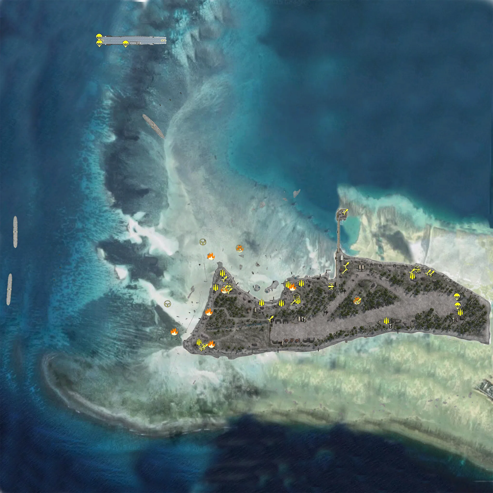
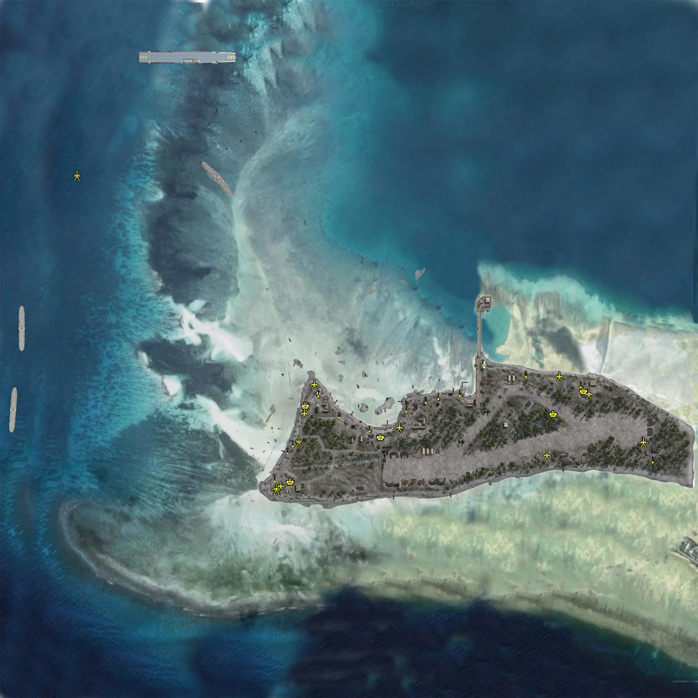

Static Ammo Crate

Pickup Kit

Static Emplacement

Vehicle

| gpo_subcat   | gpo_cat    | gpo_name                        |    pos_x |   pos_y |    pos_z |   flag | is_locked   |   team | instance                                            | gpo_cat_disp       | gpo_subcat_disp   |
|:-------------|:-----------|:--------------------------------|---------:|--------:|---------:|-------:|:------------|-------:|:----------------------------------------------------|:-------------------|:------------------|
| ammo_crate   | ammo_crate | ammo_crate                      | -174.084 |  66.562 | -421.865 |      0 | False       |      0 | ammo_crate_0                                        | Static Ammo Crate  | Static Ammo Crate |
| ammo_crate   | ammo_crate | ammo_crate                      |  722.989 |  66.723 |  -94.622 |      0 | False       |      0 | ammo_crate_1                                        | Static Ammo Crate  | Static Ammo Crate |
| ammo_crate   | ammo_crate | ammo_crate                      |  525.293 |  66.89  | -155.655 |      0 | False       |      0 | ammo_crate_2                                        | Static Ammo Crate  | Static Ammo Crate |
| ammo_crate   | ammo_crate | ammo_crate                      |  395.036 |  67.562 |  -55.198 |      0 | False       |      0 | ammo_crate_3                                        | Static Ammo Crate  | Static Ammo Crate |
| ammo_crate   | ammo_crate | ammo_crate                      |  196.554 |  65.202 | -167.771 |      0 | False       |      0 | ammo_crate_4                                        | Static Ammo Crate  | Static Ammo Crate |
| ammo_crate   | ammo_crate | ammo_crate                      |   67.075 |  67.65  | -257.44  |      0 | False       |      0 | ammo_crate_5                                        | Static Ammo Crate  | Static Ammo Crate |
| ammo_crate   | ammo_crate | ammo_crate                      |  -91.177 |  68.601 | -134.849 |      0 | False       |      0 | ammo_crate_6                                        | Static Ammo Crate  | Static Ammo Crate |
| ammo_crate   | ammo_crate | ammo_crate                      | -143.088 |  67.28  | -399.206 |      0 | False       |      0 | ammo_crate_7                                        | Static Ammo Crate  | Static Ammo Crate |
| ammo_crate   | ammo_crate | ammo_crate                      |  622.803 |  68.431 | -326.866 |      0 | False       |      0 | ammo_crate_8                                        | Static Ammo Crate  | Static Ammo Crate |
| ammo_crate   | ammo_crate | ammo_crate                      |  772.694 |  66.119 | -111.898 |      0 | False       |      0 | ammo_crate_9                                        | Static Ammo Crate  | Static Ammo Crate |
| ammo         | kit        | JP_PickUpAmmokit                | -196.981 |  72.458 | -396.795 |    202 | False       |      0 | CP_64_pmc_tarawa_1943_CoastalGuns_kit               | Pickup Kit         | Ammo Kit          |
| ammo         | kit        | JP_PickUpAmmokit                | -100.312 |  69.678 | -109.967 |    201 | False       |      0 | CP_64_pmc_tarawa_1943_GreenBeach_RepairKit          | Pickup Kit         | Ammo Kit          |
| ammo         | kit        | JP_PickUpAmmokit                |  172.707 |  66.184 | -158.085 |    203 | False       |      0 | CP_64_pmc_tarawa_1943_ThePocket_RepairKit           | Pickup Kit         | Ammo Kit          |
| ammo         | kit        | JP_PickUpAmmokit                |  145.138 |  66.263 | -235.317 |    203 | False       |      0 | CP_64_pmc_tarawa_1943_ThePocket_7_0                 | Pickup Kit         | Ammo Kit          |
| ammo         | kit        | JP_PickUpAmmokit                |  227.562 |  65.581 | -152.335 |    204 | False       |      0 | CP_64_pmc_tarawa_1943_RedBeach_Repairkit            | Pickup Kit         | Ammo Kit          |
| ammo         | kit        | JP_PickUpAmmokit                |  689.303 |  66.077 | -121.645 |    205 | False       |      0 | CP_64_pmc_tarawa_1943_GarrisonHQ_RepairKit          | Pickup Kit         | Ammo Kit          |
| ammo         | kit        | JP_PickUpAmmokit                |  887.656 |  66.891 | -273.116 |    205 | False       |      0 | CP_64_pmc_tarawa_1943_GarrisonHQ_repairkit_0        | Pickup Kit         | Ammo Kit          |
| ammo         | kit        | JP_PickUpAmmokit                |  581.318 |  66.319 | -307.977 |    205 | False       |      0 | CP_64_pmc_tarawa_1943_GarrisonHQ_repairkit_1        | Pickup Kit         | Ammo Kit          |
| ammo         | kit        | JP_PickUpAmmokit                |   62.761 |  65.688 | -232.599 |    203 | False       |      0 | CP_64_pmc_tarawa_1943_ThePocket_5_0                 | Pickup Kit         | Ammo Kit          |
| ammo         | kit        | JP_PickUpAmmokit                | -127.722 |  66.215 | -169.89  |    201 | False       |      0 | CP_64_pmc_tarawa_1943_GreenBeach_3_1                | Pickup Kit         | Ammo Kit          |
| ammo         | kit        | JP_PickUpAmmokit                |  214.365 |  68.232 | -225.484 |    203 | False       |      0 | CP_64_pmc_tarawa_1943_ThePocket_2_3                 | Pickup Kit         | Ammo Kit          |
| arty_dep     | kit        | JP_PickUpMortar                 |  240.578 |  68.493 | -299.944 |    203 | False       |      0 | CP_64_pmc_tarawa_1943_ThePocket_Japmortar           | Pickup Kit         | Deployable Arty   |
| arty_dep     | kit        | JP_PickUpMortar                 |  232.474 |  68.536 | -296.198 |    203 | False       |      0 | CP_64_pmc_tarawa_1943_ThePocket_6                   | Pickup Kit         | Deployable Arty   |
| arty_dep     | kit        | JP_PickUpMortar                 |  597.219 |  69.366 | -326.169 |    205 | False       |      0 | CP_64_pmc_tarawa_1943_GarrisonHQ_kurogane_1         | Pickup Kit         | Deployable Arty   |
| arty_dep     | kit        | JP_PickUpMortar                 |  857.72  |  66.826 | -299.968 |    205 | False       |      0 | CP_64_pmc_tarawa_1943_GarrisonHQ_japmortar          | Pickup Kit         | Deployable Arty   |
| assault      | kit        | UW_PickUpAssaultM1Thompson      |  -76.488 |  68.588 | -165.776 |    201 | False       |      0 | CP_64_pmc_tarawa_1943_GreenBeach_japsmg             | Pickup Kit         | Assault Kit       |
| assault      | kit        | UW_PickUpAssaultM1Thompson      | -186.177 |  67.152 | -417.776 |    202 | False       |      0 | CP_64_pmc_tarawa_1943_CoastalGuns_japsmg            | Pickup Kit         | Assault Kit       |
| assault      | kit        | UW_PickUpAssaultM1Thompson      |  350.345 |  68.389 | -165.919 |    204 | False       |      0 | CP_64_pmc_tarawa_1943_RedBeach_japmg                | Pickup Kit         | Assault Kit       |
| assault      | kit        | UW_PickUpAssaultM1Thompson      |  709.331 |  67.522 |  -95.224 |    205 | False       |      0 | CP_64_pmc_tarawa_1943_GarrisonHQ_smgturtle          | Pickup Kit         | Assault Kit       |
| engineer     | kit        | UW_PickUpEngineerWinchester     |  195.128 |  68.23  | -231.31  |    203 | False       |      0 | CP_64_pmc_tarawa_1943_ThePocket_4_0                 | Pickup Kit         | Engineer Kit      |
| engineer     | kit        | UW_PickUpEngineerWinchester     |  407.615 |  68.411 | -102.267 |    204 | False       |      0 | CP_64_pmc_tarawa_1943_RedBeach_7                    | Pickup Kit         | Engineer Kit      |
| flame        | kit        | UW_PickUpFlamethrower           |  459.008 |  75.186 | -224.432 |    204 | False       |      0 | CP_64_pmc_tarawa_1943_RedBeach_flamethrower         | Pickup Kit         | Flamethrower Kit  |
| flame        | kit        | UW_PickUpFlamethrower           | -156.067 |  66.081 | -271.01  |    201 | False       |      0 | CP_64_pmc_tarawa_1943_GreenBeach_24                 | Pickup Kit         | Flamethrower Kit  |
| flame        | kit        | UW_PickUpFlamethrower           |  190.966 |  66.503 | -167.901 |    203 | False       |      0 | CP_64_pmc_tarawa_1943_ThePocket_25                  | Pickup Kit         | Flamethrower Kit  |
| flame        | kit        | UW_PickUpFlamethrower           |  -90.548 |  68.707 | -179.308 |    201 | False       |      0 | CP_64_pmc_tarawa_1943_GreenBeach_25                 | Pickup Kit         | Flamethrower Kit  |
| flame        | kit        | UW_PickUpFlamethrower           | -146.286 |  71.235 | -404.586 |    202 | False       |      0 | CP_64_pmc_tarawa_1943_CoastalGuns_21                | Pickup Kit         | Flamethrower Kit  |
| flame        | kit        | UW_PickUpFlamethrower           | -300.455 |  64.846 | -352.599 |    207 | False       |      0 | CP_64_pmc_tarawa_1943_CoastalGunsBeachSpawn_Flameon | Pickup Kit         | Flamethrower Kit  |
| flame        | kit        | UW_PickUpFlamethrower           | -147.446 |  64.832 |  -40.316 |    208 | False       |      0 | CP_64_pmc_tarawa_1943_GreenBeachBeachSpawn_flameon  | Pickup Kit         | Flamethrower Kit  |
| flame        | kit        | UW_PickUpFlamethrower           |  -28.02  |  64.808 |   -8.182 |    209 | False       |      0 | CP_64_pmc_tarawa_1943_ThePocketBeachSpawn_flameon   | Pickup Kit         | Flamethrower Kit  |
| parachute    | kit        | UW_PickUpPilotcolt1911          |  873.692 |  66.057 | -208.607 |    205 | False       |      0 | CP_64_pmc_tarawa_1943_ThePocket_5                   | Pickup Kit         | Parachute Kit     |
| parachute    | kit        | UW_PickUpPilotcolt1911          |  877.237 |  66.057 | -247.31  |    205 | False       |      0 | CP_64_pmc_tarawa_1943_GarrisonHQ_pilot              | Pickup Kit         | Parachute Kit     |
| parachute    | kit        | UW_PickUpPilotcolt1911          | -502.48  |  81.916 |  841.109 |    206 | False       |      0 | CP_64_pmc_tarawa_1943_2ndMarineDivision_pilot       | Pickup Kit         | Parachute Kit     |
| parachute    | kit        | UW_PickUpPilotcolt1911          | -611.351 |  81.844 |  843.48  |    206 | False       |      0 | CP_64_pmc_tarawa_1943_2ndMarineDivision_3_3         | Pickup Kit         | Parachute Kit     |
| parachute    | kit        | UW_PickUpPilotcolt1911          | -611.919 |  81.844 |  868.586 |    206 | False       |      0 | CP_64_pmc_tarawa_1943_2ndMarineDivision_8           | Pickup Kit         | Parachute Kit     |
| sniper       | kit        | UW_PickUpSniperSpringfield      |  -68.007 |  67.766 | -168.286 |    201 | False       |      0 | CP_64_pmc_tarawa_1943_GreenBeach_sniper             | Pickup Kit         | Sniper Kit        |
| sniper       | kit        | UW_PickUpSniperSpringfield      | -180.727 |  67.342 | -415.581 |    202 | False       |      0 | CP_64_pmc_tarawa_1943_CoastalGuns_sniper            | Pickup Kit         | Sniper Kit        |
| sniper       | kit        | UW_PickUpSniperSpringfield      |  207.172 |  68.446 | -208.836 |    203 | False       |      0 | CP_64_pmc_tarawa_1943_ThePocket_sniper              | Pickup Kit         | Sniper Kit        |
| sniper       | kit        | UW_PickUpSniperSpringfield      |  459.039 |  81.627 | -220.698 |    204 | False       |      0 | CP_64_pmc_tarawa_1943_RedBeach_sniper               | Pickup Kit         | Sniper Kit        |
| sniper       | kit        | UW_PickUpSniperSpringfield      |  709.399 |  67.539 |  -93.345 |    205 | False       |      0 | CP_64_pmc_tarawa_1943_GarrisonHQ_sniper             | Pickup Kit         | Sniper Kit        |
| sniper       | kit        | UW_PickUpSniperSpringfield      |  -30.427 |  65.579 |   -6.409 |    209 | False       |      0 | CP_64_pmc_tarawa_1943_ThePocketBeachSpawn_sniper    | Pickup Kit         | Sniper Kit        |
| sniper       | kit        | UW_PickUpSniperSpringfield      | -181.414 |  65.304 |   19.49  |    208 | False       |      0 | CP_64_pmc_tarawa_1943_GreenBeachBeachSpawn_Sniper   | Pickup Kit         | Sniper Kit        |
| sniper       | kit        | UW_PickUpSniperSpringfield      | -327.859 |  64.927 | -238.436 |    207 | False       |      0 | CP_64_pmc_tarawa_1943_CoastalGunsBeachSpawn_Sniper  | Pickup Kit         | Sniper Kit        |
| zooka        | kit        | UA_PickUpBazooka                |  -72.431 |  68.269 | -184.661 |    201 | False       |      0 | CP_64_pmc_tarawa_1943_GreenBeach_mortarkit          | Pickup Kit         | HEAT Thrower      |
| zooka        | kit        | UA_PickUpBazooka                |  -90.027 |  68.768 | -173.209 |    201 | False       |      0 | CP_64_pmc_tarawa_1943_GreenBeach_bazooka            | Pickup Kit         | HEAT Thrower      |
| zooka        | kit        | UA_PickUpBazooka                | -185.23  |  67.157 | -421.92  |    202 | False       |      0 | CP_64_pmc_tarawa_1943_CoastalGuns_suicidebazooka    | Pickup Kit         | HEAT Thrower      |
| zooka        | kit        | UA_PickUpBazooka                |   99.707 |  67.155 | -299.95  |    203 | False       |      0 | CP_64_pmc_tarawa_1943_ThePocket_suicide             | Pickup Kit         | HEAT Thrower      |
| zooka        | kit        | UA_PickUpBazooka                |  463.941 |  78.787 | -226.966 |    204 | False       |      0 | CP_64_pmc_tarawa_1943_RedBeach_suicide              | Pickup Kit         | HEAT Thrower      |
| zooka        | kit        | UA_PickUpBazooka                |  754.052 |  67.909 | -107.876 |    205 | False       |      0 | CP_64_pmc_tarawa_1943_GarrisonHQ_suicide            | Pickup Kit         | HEAT Thrower      |
| zooka        | kit        | UA_PickUpBazooka                |  686.621 |  67.297 | -104.489 |    205 | False       |      0 | CP_64_pmc_tarawa_1943_GarrisonHQ_30                 | Pickup Kit         | HEAT Thrower      |
| zooka        | kit        | UA_PickUpBazooka                | -173.182 |  67.756 | -417.039 |    202 | False       |      0 | CP_64_pmc_tarawa_1943_CoastalGuns_2_0               | Pickup Kit         | HEAT Thrower      |
| zooka        | kit        | UA_PickUpBazooka                |  414.458 |  68.623 |  -76.649 |    204 | False       |      0 | CP_64_pmc_tarawa_1943_RedBeach_22                   | Pickup Kit         | HEAT Thrower      |
| zooka        | kit        | UA_PickUpBazooka                |  769.408 |  66.918 | -111.617 |    205 | False       |      0 | CP_64_pmc_tarawa_1943_GarrisonHQ_31                 | Pickup Kit         | HEAT Thrower      |
| zooka        | kit        | UA_PickUpBazooka                |  409.793 |  73.873 |  144.376 |    210 | False       |      0 | CP_64_pmc_tarawa_1943_ThePier_Pierbazooka           | Pickup Kit         | HEAT Thrower      |
| zooka        | kit        | UA_PickUpBazooka                |  -91.59  |  68.988 | -135.08  |    201 | False       |      0 | CP_64_pmc_tarawa_1943_GreenBeach_4_0                | Pickup Kit         | HEAT Thrower      |
| arty         | static     | dd_gleaversclass_Measure21_Arty | -799.143 |  65.59  |  510.3   |    206 | True        |      2 | CP_64_pmc_tarawa_1943_2ndMarineDivision_14          | Static Emplacement | Artillery         |
| arty         | static     | 81mm_mortar_m1                  | -147.68  |  66.67  | -270.351 |    201 | False       |      0 | CP_64_pmc_tarawa_1943_GreenBeach_usaMortar          | Static Emplacement | Artillery         |
| flak         | static     | fh1_25mmaa                      | -126.787 |  66.261 | -166.656 |    201 | False       |      0 | CP_64_pmc_tarawa_1943_GreenBeach_3_0                | Static Emplacement | Anti-aircraft Gun |
| flak         | static     | fh1_25mmaa                      | -171.749 |  67.932 | -389.543 |    202 | False       |      0 | CP_64_pmc_tarawa_1943_CoastalGuns_12                | Static Emplacement | Anti-aircraft Gun |
| flak         | static     | fh1_25mmaa                      |   93.039 |  65.976 | -259.002 |    203 | False       |      0 | CP_64_pmc_tarawa_1943_ThePocket_4                   | Static Emplacement | Anti-aircraft Gun |
| flak         | static     | fh1_25mmaa                      |  689.348 |  66.067 | -123.814 |    205 | False       |      0 | CP_64_pmc_tarawa_1943_GarrisonHQ_19                 | Static Emplacement | Anti-aircraft Gun |
| flak         | static     | fh1_25mmaa                      |  600.274 |  65.97  | -190.583 |    205 | False       |      0 | CP_64_pmc_tarawa_1943_GarrisonHQ_aa                 | Static Emplacement | Anti-aircraft Gun |
| mg_nest      | static     | type92_nambu_bipod              |  -28.655 |  67.007 | -192.266 |    201 | False       |      0 | CP_64_pmc_tarawa_1943_GreenBeach_3                  | Static Emplacement | Static MG         |
| mg_nest      | static     | type92_nambu_bipod              |  167.416 |  67.484 | -158.369 |    203 | False       |      0 | CP_64_pmc_tarawa_1943_ThePocket_mg                  | Static Emplacement | Static MG         |
| mg_nest      | static     | type92_nambu_bipod              | -217.632 |  68.272 | -379     |    202 | False       |      0 | CP_64_pmc_tarawa_1943_CoastalGuns_1_3               | Static Emplacement | Static MG         |
| mg_nest      | static     | type92_nambu_bipod              | -165.207 |  67.109 | -275.834 |    201 | False       |      0 | CP_64_pmc_tarawa_1943_GreenBeach_14                 | Static Emplacement | Static MG         |
| mg_nest      | static     | type92_nambu_bipod              | -179.57  |  67.108 | -296.577 |    202 | False       |      0 | CP_64_pmc_tarawa_1943_CoastalGuns_14                | Static Emplacement | Static MG         |
| mg_nest      | static     | type92_nambu_bipod              |  -90.122 |  72.474 | -129.424 |    201 | False       |      0 | CP_64_pmc_tarawa_1943_GreenBeach_16                 | Static Emplacement | Static MG         |
| mg_nest      | static     | type92_nambu_bipod              |   60.339 |  66.712 | -231.548 |    203 | False       |      0 | CP_64_pmc_tarawa_1943_ThePocket_17                  | Static Emplacement | Static MG         |
| mg_nest      | static     | type92_nambu_bipod              |  167.55  |  68.404 | -173.521 |    203 | False       |      0 | CP_64_pmc_tarawa_1943_ThePocket_7                   | Static Emplacement | Static MG         |
| mg_nest      | static     | type92_nambu_bipod              |  261.967 |  66.923 | -136.981 |    203 | False       |      0 | CP_64_pmc_tarawa_1943_ThePocket_8                   | Static Emplacement | Static MG         |
| mg_nest      | static     | type92_nambu_bipod              |  325.03  |  67.781 | -127.583 |    204 | False       |      0 | CP_64_pmc_tarawa_1943_RedBeach_13                   | Static Emplacement | Static MG         |
| mg_nest      | static     | type92_nambu_bipod              |  518.712 |  69.089 |  -72.175 |    204 | False       |      0 | CP_64_pmc_tarawa_1943_RedBeach_MG99                 | Static Emplacement | Static MG         |
| mg_nest      | static     | type99_emp_bipod                |  680.298 |  68.256 | -102.59  |    205 | False       |      0 | CP_64_pmc_tarawa_1943_GarrisonHQ_MGtype99           | Static Emplacement | Static MG         |
| mg_nest      | static     | type99_emp_bipod                |  861.175 |  66.264 | -265.052 |    205 | False       |      0 | CP_64_pmc_tarawa_1943_GarrisonHQ_mg                 | Static Emplacement | Static MG         |
| mg_nest      | static     | type92_nambu_bipod              |  891.006 |  71.634 | -323.068 |    205 | False       |      0 | CP_64_pmc_tarawa_1943_GarrisonHQ_0_9                | Static Emplacement | Static MG         |
| mg_nest      | static     | type92_nambu_bipod              |  224.756 |  66.833 | -147.89  |    203 | False       |      0 | CP_64_pmc_tarawa_1943_ThePocket_mg_0                | Static Emplacement | Static MG         |
| mg_nest      | static     | type92_nambu_bipod              |  392.853 |  72.202 |  -38.105 |    204 | False       |      0 | CP_64_pmc_tarawa_1943_RedBeach_mg                   | Static Emplacement | Static MG         |
| pak          | static     | 8inch_defgun                    | -103.308 |  68.474 | -104.381 |    201 | False       |      0 | CP_64_pmc_tarawa_1943_GreenBeach_12                 | Static Emplacement | Anti-tank Gun     |
| pak          | static     | 8inch_defgun                    | -213.975 |  68.222 | -410.369 |    202 | False       |      0 | CP_64_pmc_tarawa_1943_CoastalGuns_9                 | Static Emplacement | Anti-tank Gun     |
| pak          | static     | 8inch_defgun                    | -200.685 |  71.276 | -402.09  |    202 | False       |      0 | CP_64_pmc_tarawa_1943_CoastalGuns_10                | Static Emplacement | Anti-tank Gun     |
| pak          | static     | 75mmdp                          | -132.339 |  66.875 | -189.449 |    201 | False       |      0 | CP_64_pmc_tarawa_1943_GreenBeach_4                  | Static Emplacement | Anti-tank Gun     |
| pak          | static     | 75mmdp                          |  146.834 |  66.152 | -230.344 |    203 | False       |      0 | CP_64_pmc_tarawa_1943_ThePocket_13                  | Static Emplacement | Anti-tank Gun     |
| pak          | static     | 75mmdp                          |  615.615 |  66.286 |  -80.444 |    205 | False       |      0 | CP_64_pmc_tarawa_1943_GarrisonHQ_0_4                | Static Emplacement | Anti-tank Gun     |
| pak          | static     | 75mmdp                          |  580.2   |  65.976 | -310.783 |    205 | False       |      0 | CP_64_pmc_tarawa_1943_GarrisonHQ_75dp               | Static Emplacement | Anti-tank Gun     |
| pak          | static     | type1_atgun_static              |  862.882 |  66.355 | -273.247 |    205 | False       |      0 | CP_64_pmc_tarawa_1943_GarrisonHQ_type1at            | Static Emplacement | Anti-tank Gun     |
| pak          | static     | type1_atgun                     |  703.181 |  67.502 | -131.902 |    205 | False       |      0 | CP_64_pmc_tarawa_1943_GarrisonHQ_nonstatictype1     | Static Emplacement | Anti-tank Gun     |
| apc          | vehicle    | lvt-2                           | -799.102 |  65     | -138.661 |    206 | True        |      2 | CP_64_pmc_tarawa_1943_2ndMarineDivision_0_6         | Vehicle            | APC               |
| apc          | vehicle    | lvt-2                           | -778.665 |  64.8   |  -33.309 |    206 | True        |      2 | CP_64_pmc_tarawa_1943_2ndMarineDivision_1_2         | Vehicle            | APC               |
| apc          | vehicle    | lvt-2                           | -774.232 |  65     |  -87.412 |    206 | True        |      2 | CP_64_pmc_tarawa_1943_2ndMarineDivision_7           | Vehicle            | APC               |
| apc          | vehicle    | lvt-2                           |  -74.351 |  65     |  709.477 |    206 | True        |      2 | CP_64_pmc_tarawa_1943_2ndMarineDivision_4_2         | Vehicle            | APC               |
| apc          | vehicle    | lvt-2                           | -181.757 |  65     |  697.882 |    206 | True        |      2 | CP_64_pmc_tarawa_1943_2ndMarineDivision_17          | Vehicle            | APC               |
| apc          | vehicle    | lvt-2                           | -134.652 |  65     |  700.97  |    206 | True        |      0 | CP_64_pmc_tarawa_1943_2ndMarineDivision_18          | Vehicle            | APC               |
| car          | vehicle    | willysmb_us                     | -132.843 |  67.733 | -406.057 |    202 | False       |      0 | CP_64_pmc_tarawa_1943_CoastalGuns_16                | Vehicle            | Car               |
| car          | vehicle    | gmc                             | -132.75  |  67.714 | -412.562 |    202 | False       |      0 | CP_64_pmc_tarawa_1943_CoastalGuns_17                | Vehicle            | Car               |
| car          | vehicle    | gmc                             |  -81.955 |  67.72  | -182.075 |    201 | False       |      0 | CP_64_pmc_tarawa_1943_GreenBeach_17                 | Vehicle            | Car               |
| car          | vehicle    | gmc                             |  891.593 |  66.058 | -277.436 |    205 | False       |      0 | CP_64_pmc_tarawa_1943_GarrisonHQ_type94truck_0      | Vehicle            | Car               |
| car          | vehicle    | willysmb_us                     |  863.357 |  66.057 | -297.32  |    205 | False       |      0 | CP_64_pmc_tarawa_1943_GarrisonHQ_kurogane           | Vehicle            | Car               |
| car          | vehicle    | willysmb_us                     |  391.055 |  67.482 |  -44.233 |    204 | False       |      0 | CP_64_pmc_tarawa_1943_RedBeach_kurogane             | Vehicle            | Car               |
| car          | vehicle    | gmc                             |  706.594 |  67.562 | -110.29  |    205 | False       |      0 | CP_64_pmc_tarawa_1943_GarrisonHQ_5                  | Vehicle            | Car               |
| car          | vehicle    | type94                          |  727.062 |  67.536 | -131.441 |    205 | False       |      0 | CP_64_pmc_tarawa_1943_GarrisonHQ_type94truck        | Vehicle            | Car               |
| car          | vehicle    | kurogane                        |  606.729 |  65.99  | -237.09  |    205 | False       |      0 | CP_64_pmc_tarawa_1943_GarrisonHQ_kurogane_0         | Vehicle            | Car               |
| car          | vehicle    | type94                          |  687.409 |  66.44  | -308.259 |    205 | False       |      0 | CP_64_pmc_tarawa_1943_GarrisonHQ_truck              | Vehicle            | Car               |
| plane        | vehicle    | a6m_zero                        |  876.522 |  66.057 | -214.137 |    205 | True        |      0 | CP_64_pmc_tarawa_1943_ThePocket_20                  | Vehicle            | Airplane          |
| plane        | vehicle    | aichi_d3a                       |  876.233 |  66.057 | -243.41  |    205 | True        |      0 | CP_64_pmc_tarawa_1943_GarrisonHQ_aichival           | Vehicle            | Airplane          |
| plane        | vehicle    | sbd-3                           | -506.157 |  82.965 |  846.55  |    206 | True        |      0 | CP_64_pmc_tarawa_1943_2ndMarineDivision_20          | Vehicle            | Airplane          |
| plane        | vehicle    | hellcat                         | -606.174 |  81.844 |  850.536 |    206 | True        |      0 | CP_64_pmc_tarawa_1943_2ndMarineDivision_21          | Vehicle            | Airplane          |
| plane        | vehicle    | f4u1a_corsair                   | -593.132 |  81.844 |  862.721 |    206 | True        |      0 | CP_64_pmc_tarawa_1943_2ndMarineDivision_5_0         | Vehicle            | Airplane          |
| ship         | vehicle    | lcvp                            | -165.834 |  64.872 |  749.339 |    206 | True        |      2 | CP_64_pmc_tarawa_1943_2ndMarineDivision_15          | Vehicle            | Ship              |
| ship         | vehicle    | lcvp                            | -115.631 |  65.318 |  745.346 |    206 | True        |      2 | CP_64_pmc_tarawa_1943_2ndMarineDivision_6           | Vehicle            | Ship              |
| ship         | vehicle    | lcvp                            | -214.818 |  64.872 |  732.032 |    206 | True        |      2 | CP_64_pmc_tarawa_1943_2ndMarineDivision_3_2         | Vehicle            | Ship              |
| ship         | vehicle    | lcvp                            |  -57.878 |  64.872 |  745.422 |    206 | True        |      2 | CP_64_pmc_tarawa_1943_2ndMarineDivision_5           | Vehicle            | Ship              |
| ship         | vehicle    | lcvp                            | -807.008 |  64.872 |    6.057 |    206 | True        |      2 | CP_64_pmc_tarawa_1943_2ndMarineDivision_16          | Vehicle            | Ship              |
| ship         | vehicle    | lcvp                            | -811.111 |  65.134 |  -55.497 |    206 | True        |      2 | CP_64_pmc_tarawa_1943_2ndMarineDivision_6_0         | Vehicle            | Ship              |
| ship         | vehicle    | lcvp                            | -824.544 |  64.872 | -103.004 |    206 | True        |      2 | CP_64_pmc_tarawa_1943_2ndMarineDivision_4_1         | Vehicle            | Ship              |
| ship         | vehicle    | lcvp                            | -832.922 |  64.872 | -156.905 |    206 | True        |      2 | CP_64_pmc_tarawa_1943_2ndMarineDivision_0_5         | Vehicle            | Ship              |
| ship         | vehicle    | fh1_enterprise_guns             | -470.775 |  12.664 |  856.112 |    206 | True        |      0 | CP_64_pmc_tarawa_1943_2ndMarineDivision_19          | Vehicle            | Ship              |
| ship         | vehicle    | lcvp                            | -260.218 |  64.8   |  685.011 |    206 | True        |      0 | CP_64_pmc_tarawa_1943_2ndMarineDivision_lcvp        | Vehicle            | Ship              |
| ship         | vehicle    | lcvp                            | -252.191 |  64.872 |  717.72  |    206 | True        |      0 | CP_64_pmc_tarawa_1943_2ndMarineDivision_0_8         | Vehicle            | Ship              |
| tank         | vehicle    | m3a1_stuart_pacific             |  239.064 |  67.747 | -239.824 |    203 | True        |      0 | CP_64_pmc_tarawa_1943_ThePocket_19                  | Vehicle            | Tank              |
| tank         | vehicle    | type95_hago                     |  327.563 |  68.406 | -191.092 |    204 | True        |      0 | CP_64_pmc_tarawa_1943_RedBeach_14                   | Vehicle            | Tank              |
| tank         | vehicle    | m4a3                            | -158.667 |  66.508 | -264.797 |    201 | True        |      0 | CP_64_pmc_tarawa_1943_GreenBeach_m4a3               | Vehicle            | Tank              |
| tank         | vehicle    | m3a1_stuart_pacific             |  -93.475 |  67.773 | -163.547 |    201 | True        |      0 | CP_64_pmc_tarawa_1943_GreenBeach_19                 | Vehicle            | Tank              |
| tank         | vehicle    | m3a1_stuart                     |  458.026 |  68.494 |  -90.33  |    204 | True        |      0 | CP_64_pmc_tarawa_1943_RedBeach_stuart               | Vehicle            | Tank              |
| tank         | vehicle    | type97_chiha                    |  883.444 |  66.057 | -299.873 |    205 | True        |      0 | CP_64_pmc_tarawa_1943_GarrisonHQ_type97chiha        | Vehicle            | Tank              |
| tank         | vehicle    | m3a1                            | -131.902 |  67.888 | -395.94  |    202 | False       |      0 | CP_64_pmc_tarawa_1943_CoastalGuns_haltrack          | Vehicle            | Tank              |

