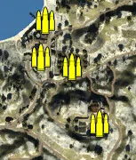
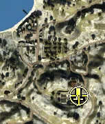
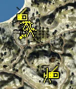
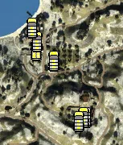

Static Ammo Crate

Pickup Kit

Static Emplacement

Vehicle

| Icon                     | SubCat            | Cat                | Name                    | Instance                                               |   Flag |    X Pos |   Y Pos |    Z Pos |
|:-------------------------|:------------------|:-------------------|:------------------------|:-------------------------------------------------------|-------:|---------:|--------:|---------:|
|    | Static Ammo Crate | Static Ammo Crate  | ammo_crate              | ammo_crate_0                                           |      0 |  104.456 |  22.424 | -226.509 |
|    | Static Ammo Crate | Static Ammo Crate  | ammo_crate              | ammo_crate_1                                           |      0 | -333.511 |  52.465 | -705.185 |
|    | Static Ammo Crate | Static Ammo Crate  | ammo_crate              | ammo_crate_2                                           |      0 | -588.328 |  18.350 | -402.004 |
|    | Static Ammo Crate | Static Ammo Crate  | ammo_crate              | ammo_crate_3                                           |      0 | -565.473 |  18.111 | -385.384 |
|    | Static Ammo Crate | Static Ammo Crate  | ammo_crate              | ammo_crate_4                                           |      0 |  123.283 |  16.502 | -174.006 |
|    | Static Ammo Crate | Static Ammo Crate  | ammo_crate              | ammo_crate_5                                           |      0 |  140.495 |  19.492 | -222.459 |
|    | Static Ammo Crate | Static Ammo Crate  | ammo_crate              | ammo_crate_6                                           |      0 | -152.729 |  20.930 | -241.182 |
|    | Static Ammo Crate | Static Ammo Crate  | ammo_crate              | ammo_crate_7                                           |      0 | -211.809 |  17.229 | -138.603 |
|    | Static Ammo Crate | Static Ammo Crate  | ammo_crate              | ammo_crate_8                                           |      0 | -221.006 |  20.586 | -220.584 |
|    | Static Ammo Crate | Static Ammo Crate  | ammo_crate              | ammo_crate_9                                           |      0 |  -90.310 |  32.174 | -369.138 |
|   | Commando Kit      | Pickup Kit         | GA_PickUpCommandoMp40   | CP_16_Crete1941_Monastery_Odigitrias_Commando          |    303 |  -86.128 |  31.283 | -372.685 |
|  | Sniper Kit        | Pickup Kit         | GA_PickUpSniperK98_para | CP_16_Crete1941_Monastery_Odigitrias_DE_GB_Sniper      |    303 |  -84.258 |  32.000 | -369.259 |
|    | Artillery         | Static Emplacement | sgwr34                  | CP_16_Crete1941_Monastery_Odigitrias_DE_GB_LightMortar |    303 | -125.448 |  27.703 | -393.878 |
|     | Static MG         | Static Emplacement | lewis_bipod             | CP_16_Crete1941_Chania_LightMG                         |    302 | -223.842 |  20.641 | -217.606 |
|     | Static MG         | Static Emplacement | vickers303_tripod       | CP_16_Crete1941_Chania_MedMG                           |    302 | -210.088 |  22.541 | -215.737 |
|     | Static MG         | Static Emplacement | lewis_bipod             | CP_16_Crete1941_Chania_11                              |    302 | -230.719 |  20.689 | -223.255 |
|     | Static MG         | Static Emplacement | vickers303_tripod       | CP_16_Crete1941_Chania_0_1                             |    302 | -214.341 |  17.169 | -142.187 |
|     | Anti-tank Gun     | Static Emplacement | 2pdr                    | CP_16_Crete1941_Chania_LightArtillery2                 |    302 | -194.696 |  16.838 | -208.302 |
|     | Anti-tank Gun     | Static Emplacement | 2pdr                    | CP_16_Crete1941_Chania_1_0                             |    302 | -209.887 |  16.554 | -179.811 |
|   | Radio             | Static Emplacement | oldradioallied          | CP_16_Crete1941_Chania_OldRadio                        |    302 | -223.959 |  18.554 | -153.232 |
|   | Radio             | Static Emplacement | gercommradio            | CP_16_Crete1941_Monastery_Odigitrias_CommRadio         |    303 |  -97.544 |  31.188 | -388.409 |
|     | APC               | Vehicle            | universalcarrier_bren   | CP_16_Crete1941_Chania_DE_GB_PersonelCarrier2          |    302 | -224.648 |  16.462 | -216.691 |
|     | Car               | Vehicle            | civtruck                | CP_16_Crete1941_Monastery_Odigitrias_CivTruck          |    303 | -100.713 |  27.645 | -381.258 |
|     | Car               | Vehicle            | kettenkrad              | CP_16_Crete1941_Monastery_Odigitrias_Car               |    303 | -106.638 |  27.645 | -381.624 |
|     | Car               | Vehicle            | civtruck                | CP_16_Crete1941_Chania_truck                           |    302 | -221.344 |  16.460 | -193.903 |
|     | Civilian Vehicle  | Vehicle            | rideable_bicycle        | CP_16_Crete1941_Chania_Bicycle                         |    302 | -233.113 |  16.404 | -160.069 |
|     | Civilian Vehicle  | Vehicle            | rideable_bicycle        | CP_16_Crete1941_Monastery_Odigitrias_Bicycle           |    303 | -118.585 |  27.645 | -392.904 |
|     | Civilian Vehicle  | Vehicle            | redtractor              | CP_16_Crete1941_Chania_DE_GB_Tracktor                  |    302 | -179.213 |  20.112 | -242.111 |

