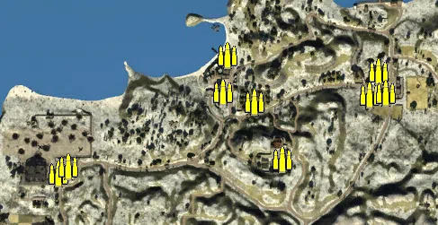
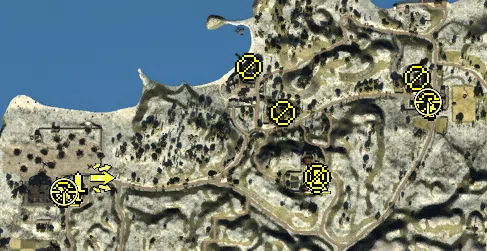
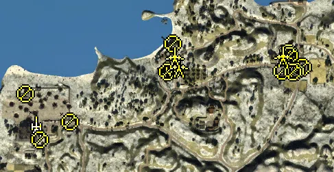
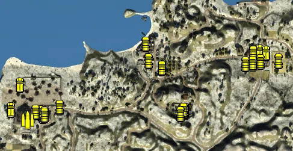

Static Ammo Crate

Pickup Kit

Static Emplacement

Vehicle

| gpo_subcat   | gpo_cat    | gpo_name                    |    pos_x |   pos_y |    pos_z |   flag | is_locked   |   team | instance                                               | gpo_cat_disp       | gpo_subcat_disp   |
|:-------------|:-----------|:----------------------------|---------:|--------:|---------:|-------:|:------------|-------:|:-------------------------------------------------------|:-------------------|:------------------|
| ammo_crate   | ammo_crate | ammo_crate                  |  104.456 |  22.424 | -226.509 |      0 | False       |      0 | ammo_crate_0                                           | Static Ammo Crate  | Static Ammo Crate |
| ammo_crate   | ammo_crate | ammo_crate                  | -333.511 |  52.465 | -705.185 |      0 | False       |      0 | ammo_crate_1                                           | Static Ammo Crate  | Static Ammo Crate |
| ammo_crate   | ammo_crate | ammo_crate                  | -588.328 |  18.35  | -402.004 |      0 | False       |      0 | ammo_crate_2                                           | Static Ammo Crate  | Static Ammo Crate |
| ammo_crate   | ammo_crate | ammo_crate                  | -565.473 |  18.111 | -385.384 |      0 | False       |      0 | ammo_crate_3                                           | Static Ammo Crate  | Static Ammo Crate |
| ammo_crate   | ammo_crate | ammo_crate                  |  123.283 |  16.502 | -174.006 |      0 | False       |      0 | ammo_crate_4                                           | Static Ammo Crate  | Static Ammo Crate |
| ammo_crate   | ammo_crate | ammo_crate                  |  140.495 |  19.492 | -222.459 |      0 | False       |      0 | ammo_crate_5                                           | Static Ammo Crate  | Static Ammo Crate |
| ammo_crate   | ammo_crate | ammo_crate                  | -152.729 |  20.93  | -241.182 |      0 | False       |      0 | ammo_crate_6                                           | Static Ammo Crate  | Static Ammo Crate |
| ammo_crate   | ammo_crate | ammo_crate                  | -211.809 |  17.229 | -138.603 |      0 | False       |      0 | ammo_crate_7                                           | Static Ammo Crate  | Static Ammo Crate |
| ammo_crate   | ammo_crate | ammo_crate                  | -221.006 |  20.586 | -220.584 |      0 | False       |      0 | ammo_crate_8                                           | Static Ammo Crate  | Static Ammo Crate |
| ammo_crate   | ammo_crate | ammo_crate                  |  -90.31  |  32.174 | -369.138 |      0 | False       |      0 | ammo_crate_9                                           | Static Ammo Crate  | Static Ammo Crate |
| antitank     | kit        | BA_PickUpSapperNo4Short     | -585.885 |  19.266 | -398.501 |    201 | False       |      0 | CP_32_Crete1941_maleme_aerodrome_Sapper                | Pickup Kit         | Tankhunter Kit    |
| antitank     | kit        | GA_PickUpSapperK98Short     |  -83.989 |  32.031 | -371.45  |    204 | False       |      0 | CP_32_Crete1941_Monastery_Odigitrias_Sapper            | Pickup Kit         | Tankhunter Kit    |
| antitank     | kit        | GA_PickUpTankHunterK98Short |  -84.313 |  32.041 | -371.419 |    204 | False       |      0 | CP_32_Crete1941_Monastery_Odigitrias_TankHunter        | Pickup Kit         | Tankhunter Kit    |
| assault      | kit        | BA_PickUPGrenadierNo4       | -516.789 |  14.639 | -369.118 |    201 | False       |      0 | CP_32_Crete1941_maleme_aerodrome_Grenadier             | Pickup Kit         | Assault Kit       |
| assault      | kit        | GA_PickUPGrenadierK98       |  -84.258 |  32     | -369.259 |    204 | False       |      0 | CP_32_Crete1941_Monastery_Odigitrias_Grenadier         | Pickup Kit         | Assault Kit       |
| at_rifle     | kit        | BA_PickUpAntitankBoys       | -591.187 |  18.335 | -401.217 |    201 | False       |      0 | CP_32_Crete1941_maleme_aerodrome_ATrifle               | Pickup Kit         | AT Rifle          |
| at_rifle     | kit        | BA_PickUpAntitankBoys       |  116.442 |  20.35  | -169.821 |    202 | False       |      0 | CP_32_Crete1941_Suda_Bay_ATrifle                       | Pickup Kit         | AT Rifle          |
| at_rifle     | kit        | BA_PickUpAntitankBoys       |  -83.93  |  31.986 | -367.055 |    204 | False       |      0 | CP_32_Crete1941_Monastery_Odigitrias_ATrifle           | Pickup Kit         | AT Rifle          |
| commando     | kit        | BA_PickUpCommandoTommyD     | -562.283 |  18.586 | -390.029 |    201 | False       |      0 | CP_32_Crete1941_maleme_aerodrome_Commando              | Pickup Kit         | Commando Kit      |
| commando     | kit        | BA_PickUpCommandoTommyD     | -562.214 |  18.587 | -388.33  |    201 | False       |      0 | CP_32_Crete1941_maleme_aerodrome_13                    | Pickup Kit         | Commando Kit      |
| commando     | kit        | BA_PickUpCommandoTommyD     |  143.446 |  20.213 | -223.089 |    202 | False       |      0 | CP_32_Crete1941_Suda_Bay_Commando                      | Pickup Kit         | Commando Kit      |
| commando     | kit        | GA_PickUpCommandoMp40       |  -86.128 |  31.283 | -372.685 |    204 | False       |      0 | CP_32_Crete1941_Monastery_Odigitrias_Commando          | Pickup Kit         | Commando Kit      |
| commando     | kit        | GA_PickUpCommandoMp40       |  -84.4   |  31.289 | -372.754 |    204 | False       |      0 | CP_32_Crete1941_Monastery_Odigitrias_7                 | Pickup Kit         | Commando Kit      |
| mg           | kit        | BA_PickUpSupportBrenMK1     |  140.339 |  19.633 | -223.519 |    202 | False       |      0 | CP_32_Crete1941_Suda_Bay_1_0                           | Pickup Kit         | MG Kit            |
| mg           | kit        | BA_PickUpSupportBrenMK1     | -152.35  |  20.259 | -239.344 |    203 | False       |      0 | CP_32_Crete1941_Chania_Support                         | Pickup Kit         | MG Kit            |
| mg           | kit        | BA_PickUpSupportBrenMK1     | -220.536 |  19.726 | -147.102 |    203 | False       |      0 | CP_32_Crete1941_Chania_1_2                             | Pickup Kit         | MG Kit            |
| mg           | kit        | GA_PickUpSupportMG34        |  -84.263 |  31.964 | -367.039 |    204 | False       |      0 | CP_32_Crete1941_Monastery_Odigitrias_Support           | Pickup Kit         | MG Kit            |
| sniper       | kit        | BA_PickUpSniperNo4          | -589.965 |  19.133 | -398.002 |    201 | False       |      0 | CP_32_Crete1941_maleme_aerodrome_Sniper                | Pickup Kit         | Sniper Kit        |
| sniper       | kit        | BA_PickUpSniperNo4          |  137.258 |  22.862 | -218.203 |    202 | False       |      0 | CP_32_Crete1941_Suda_Bay_Sniper                        | Pickup Kit         | Sniper Kit        |
| misc         | noidea     | britcommradio               |  -97.544 |  31.179 | -388.409 |    204 | False       |      0 | CP_32_Crete1941_Monastery_Odigitrias_CommRadio         | FIXME UNASSIGNED   | MISCELLANEOUS     |
| misc         | noidea     | gercommradio                | -589.963 |  18.335 | -395.358 |    201 | False       |      0 | CP_32_Crete1941_maleme_aerodrome_DE_GB_CommRadio       | FIXME UNASSIGNED   | MISCELLANEOUS     |
| misc         | noidea     | britcommradio               |  120.807 |  19.327 | -169.082 |    202 | False       |      0 | CP_32_Crete1941_Suda_Bay_DE_GB_CommRadio               | FIXME UNASSIGNED   | MISCELLANEOUS     |
| noidea       | noidea     | oldradioallied              | -567.359 |  19.64  | -397.67  |    201 | False       |      0 | CP_32_Crete1941_maleme_aerodrome_OldRadio              | FIXME UNASSIGNED   | FIXME UNASSIGNED  |
| noidea       | noidea     | oldradioallied              | -223.959 |  18.554 | -153.232 |    203 | False       |      0 | CP_32_Crete1941_Chania_OldRadio                        | FIXME UNASSIGNED   | FIXME UNASSIGNED  |
| noidea       | noidea     | commander_mortar_allied     | -729.482 |  32.792 | -646.771 |    201 | True        |      0 | CP_32_Crete1941_maleme_aerodrome_DE_GB_CommMortar      | FIXME UNASSIGNED   | FIXME UNASSIGNED  |
| noidea       | noidea     | commander_mortar_allied     | -727.961 |  32.678 | -652.676 |    201 | True        |      0 | CP_32_Crete1941_maleme_aerodrome_DE_GB_CommMortar_0    | FIXME UNASSIGNED   | FIXME UNASSIGNED  |
| noidea       | noidea     | commander_mortar_allied     |  401.262 |  33.224 | -142.564 |    202 | True        |      0 | CP_32_Crete1941_Suda_Bay_DE_GB_CommMortar              | FIXME UNASSIGNED   | FIXME UNASSIGNED  |
| noidea       | noidea     | commander_mortar_allied     |  403.124 |  33.25  | -130.201 |    202 | True        |      0 | CP_32_Crete1941_Suda_Bay_DE_GB_CommMortar_0            | FIXME UNASSIGNED   | FIXME UNASSIGNED  |
| arty         | static     | sgwr34                      | -614.342 |  17.271 | -381.121 |    201 | False       |      0 | CP_32_Crete1941_maleme_aerodrome_DE_GB_LightMortar     | Static Emplacement | Artillery         |
| arty         | static     | 3inchmortar                 |  138.135 |  21.339 | -195.775 |    202 | False       |      0 | CP_32_Crete1941_Suda_Bay_DE_GB_LightMortar             | Static Emplacement | Artillery         |
| mg_nest      | static     | lewis_bipod                 | -602.445 |  26.331 | -422.231 |    201 | False       |      0 | CP_32_Crete1941_maleme_aerodrome_LightMG2              | Static Emplacement | Static MG         |
| mg_nest      | static     | vickers303_tripod           | -643.039 |  20.94  | -288.026 |    201 | False       |      0 | CP_32_Crete1941_maleme_aerodrome_MedMG                 | Static Emplacement | Static MG         |
| mg_nest      | static     | vickers303_tripod           | -514.273 |  14.534 | -370.022 |    201 | False       |      0 | CP_32_Crete1941_maleme_aerodrome_15                    | Static Emplacement | Static MG         |
| mg_nest      | static     | lewis_bipod                 |  104.418 |  23.54  | -222.793 |    202 | False       |      0 | CP_32_Crete1941_Suda_Bay_LightMG                       | Static Emplacement | Static MG         |
| mg_nest      | static     | vickers303_tripod           |  163.6   |  17.118 | -209.555 |    202 | False       |      0 | CP_32_Crete1941_Suda_Bay_MedMG                         | Static Emplacement | Static MG         |
| mg_nest      | static     | lewis_bipod                 |  124.471 |  20.719 | -168.182 |    202 | False       |      0 | CP_32_Crete1941_Suda_Bay_1                             | Static Emplacement | Static MG         |
| mg_nest      | static     | vickers303_tripod           |  126.694 |  22.779 | -175.077 |    202 | False       |      0 | CP_32_Crete1941_Suda_Bay_8                             | Static Emplacement | Static MG         |
| mg_nest      | static     | lewis_bipod                 |  143.138 |  17.282 | -222.526 |    202 | False       |      0 | CP_32_Crete1941_Suda_Bay_9                             | Static Emplacement | Static MG         |
| mg_nest      | static     | lewis_bipod                 |  135.042 |  17.399 | -224.765 |    202 | False       |      0 | CP_32_Crete1941_Suda_Bay_2                             | Static Emplacement | Static MG         |
| mg_nest      | static     | lewis_bipod                 | -223.842 |  20.641 | -217.606 |    203 | False       |      0 | CP_32_Crete1941_Chania_LightMG                         | Static Emplacement | Static MG         |
| mg_nest      | static     | vickers303_tripod           | -210.088 |  22.541 | -215.737 |    203 | False       |      0 | CP_32_Crete1941_Chania_MedMG                           | Static Emplacement | Static MG         |
| mg_nest      | static     | lewis_bipod                 | -230.719 |  20.689 | -223.255 |    203 | False       |      0 | CP_32_Crete1941_Chania_11                              | Static Emplacement | Static MG         |
| mg_nest      | static     | vickers303_tripod           | -214.341 |  17.169 | -142.187 |    203 | False       |      0 | CP_32_Crete1941_Chania_1_0                             | Static Emplacement | Static MG         |
| pak          | static     | 2pdr                        |  105.504 |  16.565 | -177.252 |    202 | False       |      0 | CP_32_Crete1941_Suda_Bay_LightArtillery2               | Static Emplacement | Anti-tank Gun     |
| pak          | static     | 2pdr                        | -197.535 |  16.654 | -207.427 |    203 | False       |      0 | CP_32_Crete1941_Chania_LightArtillery2                 | Static Emplacement | Anti-tank Gun     |
| pak          | static     | 2pdr                        | -209.887 |  16.554 | -179.811 |    203 | False       |      0 | CP_32_Crete1941_Chania_1                               | Static Emplacement | Anti-tank Gun     |
| apc          | vehicle    | universalcarrier            | -681.034 |  16.464 | -378.68  |    201 | False       |      2 | CP_32_Crete1941_maleme_aerodrome_CarCommando           | Vehicle            | APC               |
| apc          | vehicle    | universalcarrier            | -582.848 |  18.077 | -388.718 |    201 | False       |      2 | CP_32_Crete1941_maleme_aerodrome_CarCommando2          | Vehicle            | APC               |
| apc          | vehicle    | universalcarrier_bren       |  145.36  |  15.339 | -186.059 |    202 | False       |      2 | CP_32_Crete1941_Suda_Bay_CarCommando1                  | Vehicle            | APC               |
| apc          | vehicle    | universalcarrier            |  166.823 |  16.859 | -189.316 |    202 | False       |      0 | CP_32_Crete1941_Suda_Bay_CarCommando2                  | Vehicle            | APC               |
| apc          | vehicle    | universalcarrier            | -651.805 |  16.528 | -296.694 |    201 | False       |      0 | CP_32_Crete1941_maleme_aerodrome_DE_GB_PersonelCarrier | Vehicle            | APC               |
| car          | vehicle    | kettenkrad                  | -569.784 |  17.806 | -391.262 |    201 | False       |      2 | CP_32_Crete1941_maleme_aerodrome_Car                   | Vehicle            | Car               |
| car          | vehicle    | kettenkrad                  | -520.956 |  14.968 | -370.722 |    201 | False       |      0 | CP_32_Crete1941_maleme_aerodrome_1_0                   | Vehicle            | Car               |
| car          | vehicle    | bedfordoyd                  |   97.875 |  16.458 | -225.368 |    202 | False       |      2 | CP_32_Crete1941_Suda_Bay_Truck                         | Vehicle            | Car               |
| car          | vehicle    | civtruck                    |  124.319 |  16.458 | -189.095 |    202 | False       |      0 | CP_32_Crete1941_Suda_Bay_CivTruck                      | Vehicle            | Car               |
| car          | vehicle    | kettenkrad                  |  121.921 |  16.46  | -223.074 |    202 | False       |      0 | CP_32_Crete1941_Suda_Bay_Car                           | Vehicle            | Car               |
| car          | vehicle    | chevy30cwt                  | -224.525 |  17.208 | -216.378 |    203 | False       |      0 | CP_32_Crete1941_Chania_PersonelCarrier2                | Vehicle            | Car               |
| car          | vehicle    | civtruck                    | -101.727 |  27.899 | -384.252 |    204 | False       |      0 | CP_32_Crete1941_Monastery_Odigitrias_CivTruck          | Vehicle            | Car               |
| car          | vehicle    | bedfordoyd_nocanvas         | -114.552 |  28.718 | -383.59  |    204 | False       |      0 | CP_32_Crete1941_Monastery_Odigitrias_Truck             | Vehicle            | Car               |
| car          | vehicle    | kettenkrad                  | -104.975 |  28.208 | -380.352 |    204 | False       |      0 | CP_32_Crete1941_Monastery_Odigitrias_Car               | Vehicle            | Car               |
| car          | vehicle    | kettenkrad                  | -107.842 |  28.304 | -380.482 |    204 | False       |      0 | CP_32_Crete1941_Monastery_Odigitrias_1_0               | Vehicle            | Car               |
| car          | vehicle    | bedfordoyd_nocanvas         | -599.893 |  16.859 | -385.707 |    201 | False       |      0 | CP_32_Crete1941_maleme_aerodrome_DE_GB_Truck2          | Vehicle            | Car               |
| car          | vehicle    | bedfordoyd_nocanvas         | -575.098 |  17.567 | -397.476 |    201 | False       |      0 | CP_32_Crete1941_maleme_aerodrome_DE_GB_Truck2_0        | Vehicle            | Car               |
| civilian     | vehicle    | rideable_bicycle            | -569.749 |  17.567 | -396.311 |    201 | False       |      0 | CP_32_Crete1941_maleme_aerodrome_Bicicle               | Vehicle            | Civilian Vehicle  |
| civilian     | vehicle    | rideable_bicycle            |  147.666 |  15.819 | -218.544 |    202 | False       |      0 | CP_32_Crete1941_Suda_Bay_Bicycle                       | Vehicle            | Civilian Vehicle  |
| civilian     | vehicle    | rideable_bicycle            | -233.113 |  16.404 | -160.069 |    203 | False       |      0 | CP_32_Crete1941_Chania_Bicycle                         | Vehicle            | Civilian Vehicle  |
| civilian     | vehicle    | rideable_bicycle            | -118.585 |  27.645 | -392.904 |    204 | False       |      0 | CP_32_Crete1941_Monastery_Odigitrias_Bicycle           | Vehicle            | Civilian Vehicle  |
| civilian     | vehicle    | redtractor                  | -179.295 |  20.112 | -240.475 |    203 | False       |      0 | CP_32_Crete1941_Chania_DE_GB_Tracktor                  | Vehicle            | Civilian Vehicle  |
| civilian     | vehicle    | redtractor                  |  208.181 |  16.288 | -216.956 |    202 | False       |      0 | CP_32_Crete1941_Suda_Bay_DE_GB_Tracktor                | Vehicle            | Civilian Vehicle  |
| supply       | vehicle    | bedfordoyd_ammo             | -626.18  |  18.092 | -412.225 |    201 | False       |      0 | CP_32_Crete1941_maleme_aerodrome_TruckAmmo             | Vehicle            | Supply Vehicle    |

