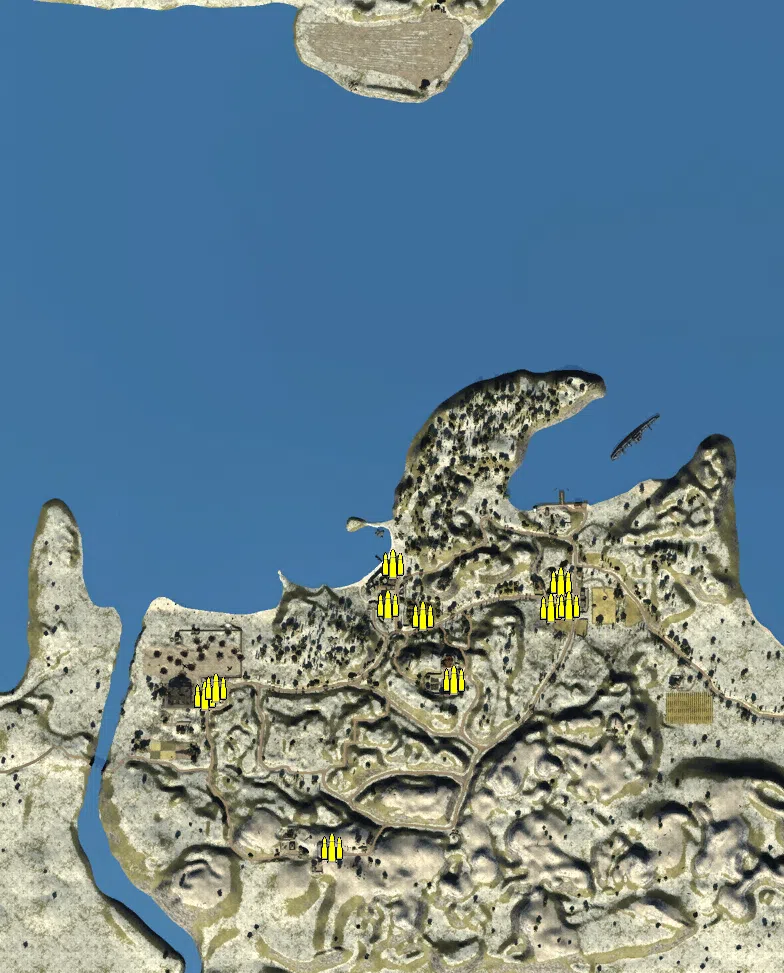
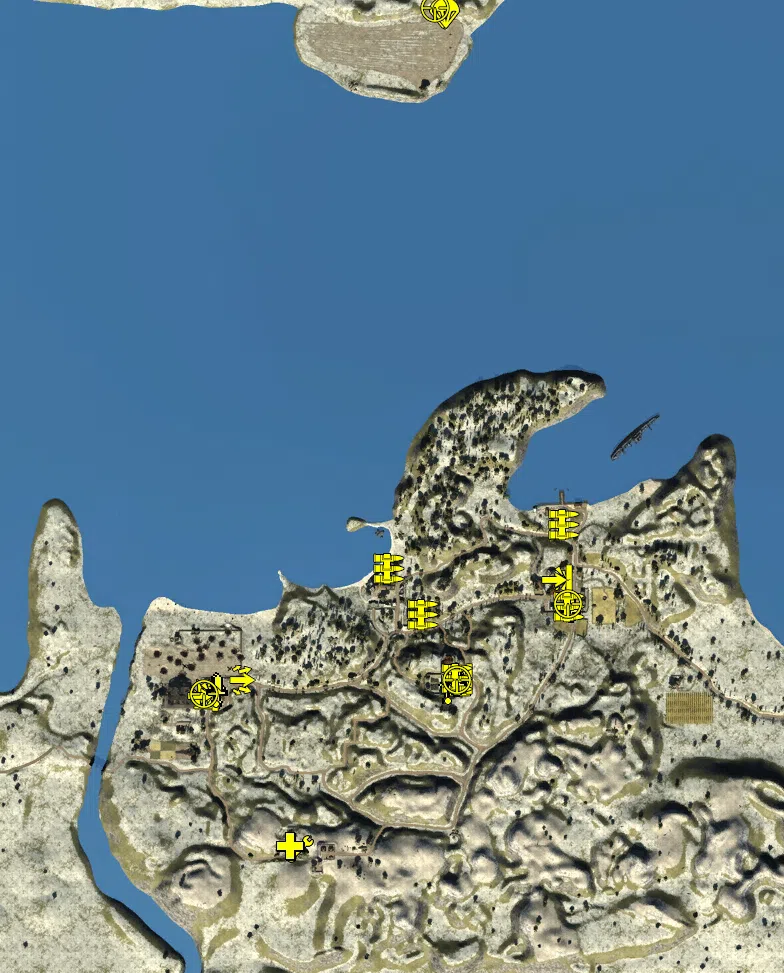
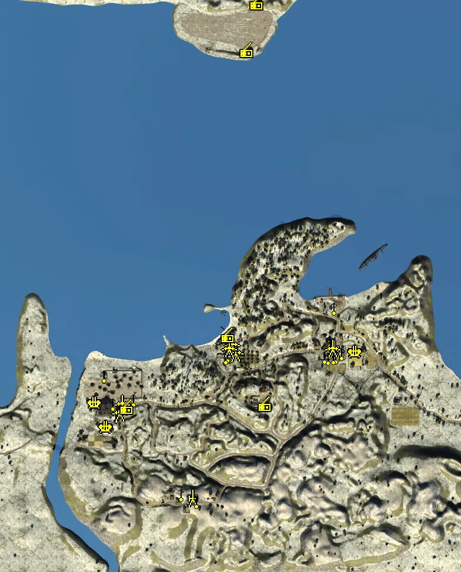
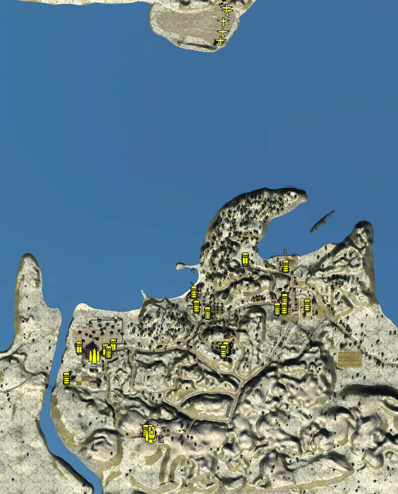

Static Ammo Crate

Pickup Kit

Static Emplacement

Vehicle

| gpo_subcat   | gpo_cat    | gpo_name                    |    pos_x |   pos_y |    pos_z |   flag | is_locked   |   team | instance                                             | gpo_cat_disp       | gpo_subcat_disp   |
|:-------------|:-----------|:----------------------------|---------:|--------:|---------:|-------:|:------------|-------:|:-----------------------------------------------------|:-------------------|:------------------|
| ammo_crate   | ammo_crate | ammo_crate                  |  104.456 |  22.424 | -226.509 |      0 | False       |      0 | ammo_crate_0                                         | Static Ammo Crate  | Static Ammo Crate |
| ammo_crate   | ammo_crate | ammo_crate                  | -333.511 |  52.465 | -705.185 |      0 | False       |      0 | ammo_crate_1                                         | Static Ammo Crate  | Static Ammo Crate |
| ammo_crate   | ammo_crate | ammo_crate                  | -588.328 |  18.35  | -402.004 |      0 | False       |      0 | ammo_crate_2                                         | Static Ammo Crate  | Static Ammo Crate |
| ammo_crate   | ammo_crate | ammo_crate                  | -565.473 |  18.111 | -385.384 |      0 | False       |      0 | ammo_crate_3                                         | Static Ammo Crate  | Static Ammo Crate |
| ammo_crate   | ammo_crate | ammo_crate                  |  123.283 |  16.502 | -174.006 |      0 | False       |      0 | ammo_crate_4                                         | Static Ammo Crate  | Static Ammo Crate |
| ammo_crate   | ammo_crate | ammo_crate                  |  140.495 |  19.492 | -222.459 |      0 | False       |      0 | ammo_crate_5                                         | Static Ammo Crate  | Static Ammo Crate |
| ammo_crate   | ammo_crate | ammo_crate                  | -152.729 |  20.93  | -241.182 |      0 | False       |      0 | ammo_crate_6                                         | Static Ammo Crate  | Static Ammo Crate |
| ammo_crate   | ammo_crate | ammo_crate                  | -211.809 |  17.229 | -138.603 |      0 | False       |      0 | ammo_crate_7                                         | Static Ammo Crate  | Static Ammo Crate |
| ammo_crate   | ammo_crate | ammo_crate                  | -221.006 |  20.586 | -220.584 |      0 | False       |      0 | ammo_crate_8                                         | Static Ammo Crate  | Static Ammo Crate |
| ammo_crate   | ammo_crate | ammo_crate                  |  -90.31  |  32.174 | -369.138 |      0 | False       |      0 | ammo_crate_9                                         | Static Ammo Crate  | Static Ammo Crate |
| antitank     | kit        | BA_PickUpSapperNo4Short     | -585.885 |  19.266 | -398.501 |    102 | False       |      0 | CP_64_Crete1941_maleme_aerodrome_Sapper              | Pickup Kit         | Tankhunter Kit    |
| antitank     | kit        | BA_PickUpSapperNo4Short     | -585.984 |  19.261 | -398.508 |    102 | False       |      0 | CP_64_Crete1941_maleme_aerodrome_Sapper2             | Pickup Kit         | Tankhunter Kit    |
| antitank     | kit        | GA_PickUpSapperK98Short     |  -83.989 |  32.031 | -371.45  |    107 | False       |      0 | CP_64_Crete1941_Monastery_Odigitrias_Sapper          | Pickup Kit         | Tankhunter Kit    |
| antitank     | kit        | GA_PickUpTankHunterK98Short |  -84.158 |  32.041 | -371.419 |    107 | False       |      0 | CP_64_Crete1941_Monastery_Odigitrias_TankHunter      | Pickup Kit         | Tankhunter Kit    |
| arty_dep     | kit        | GA_PickUpMortar             | -566.046 |  18.007 | -395.018 |    102 | False       |      0 | CP_64_Crete1941_maleme_aerodrome_MORTAR              | Pickup Kit         | Deployable Arty   |
| arty_dep     | kit        | GA_PickUpMortar             | -106.136 |  27.894 | -390.769 |    107 | False       |      0 | CP_64_Crete1941_Monastery_Odigitrias_MORTAR          | Pickup Kit         | Deployable Arty   |
| assault      | kit        | BA_PickUPGrenadierNo4       | -516.789 |  14.639 | -369.118 |    102 | False       |      0 | CP_64_Crete1941_maleme_aerodrome_Grenadier           | Pickup Kit         | Assault Kit       |
| assault      | kit        | GA_PickUPGrenadierK98       |  -84.258 |  32     | -369.259 |    107 | False       |      0 | CP_64_Crete1941_Monastery_Odigitrias_Grenadier       | Pickup Kit         | Assault Kit       |
| at_rifle     | kit        | BA_PickUpAntitankBoys       | -591.315 |  18.361 | -401.217 |    102 | False       |      0 | CP_64_Crete1941_maleme_aerodrome_ATrifle             | Pickup Kit         | AT Rifle          |
| at_rifle     | kit        | BA_PickUpAntitankBoys       |  116.442 |  20.35  | -169.821 |    103 | False       |      0 | CP_64_Crete1941_Suda_Bay_ATrifle                     | Pickup Kit         | AT Rifle          |
| at_rifle     | kit        | BA_PickUpAntitankBoys       |  -83.93  |  31.986 | -367.055 |    107 | False       |      0 | CP_64_Crete1941_Monastery_Odigitrias_ATrifle         | Pickup Kit         | AT Rifle          |
| commando     | kit        | BA_PickUpCommandoTommyD     | -566.466 |  18.14  | -385.203 |    102 | False       |      0 | CP_64_Crete1941_maleme_aerodrome_Commando            | Pickup Kit         | Commando Kit      |
| commando     | kit        | BA_PickUpCommandoTommyD     | -561.755 |  18.574 | -388.125 |    102 | False       |      0 | CP_64_Crete1941_maleme_aerodrome_0_13                | Pickup Kit         | Commando Kit      |
| commando     | kit        | BA_PickUpCommandoTommyD     |  143.446 |  20.213 | -223.089 |    103 | False       |      0 | CP_64_Crete1941_Suda_Bay_Commando                    | Pickup Kit         | Commando Kit      |
| commando     | kit        | GA_PickUpCommandoMp40       |  -86.128 |  31.283 | -372.685 |    107 | False       |      0 | CP_64_Crete1941_Monastery_Odigitrias_Commando        | Pickup Kit         | Commando Kit      |
| commando     | kit        | GA_PickUpCommandoMp40       |  -84.4   |  31.289 | -372.754 |    107 | False       |      0 | CP_64_Crete1941_Monastery_Odigitrias_0_7             | Pickup Kit         | Commando Kit      |
| engineer     | kit        | BA_PickUPTankerWebley       | -398.659 |  41.252 | -708.424 |    106 | False       |      0 | CP_64_Crete1941_Hill107_Tanker                       | Pickup Kit         | Engineer Kit      |
| engineer     | kit        | BA_PickUPTankerWebley       | -398.201 |  41.281 | -708.302 |    106 | False       |      0 | CP_64_Crete1941_Hill107_0_5                          | Pickup Kit         | Engineer Kit      |
| engineer     | kit        | BA_PickUPTankerWebley       | -397.773 |  41.24  | -708.503 |    106 | False       |      0 | CP_64_Crete1941_Hill107_0_6                          | Pickup Kit         | Engineer Kit      |
| medic        | kit        | BA_PickUpMedicWebley        | -416.976 |  41.886 | -704.266 |    106 | False       |      0 | CP_64_Crete1941_Hill107_Medic                        | Pickup Kit         | Medic Kit         |
| medic        | kit        | BA_PickUpMedicWebley        | -417.089 |  41.898 | -702.393 |    106 | False       |      0 | CP_64_Crete1941_Hill107_Medic2                       | Pickup Kit         | Medic Kit         |
| mg           | kit        | BA_PickUpSupportBrenMK1     |  129.331 |  16.855 |  -60.916 |    103 | False       |      2 | CP_64_Crete1941_Suda_Bay_Support                     | Pickup Kit         | MG Kit            |
| mg           | kit        | BA_PickUpSupportBrenMK1     |  140.339 |  19.633 | -223.519 |    103 | False       |      0 | CP_64_Crete1941_Suda_Bay_2_1                         | Pickup Kit         | MG Kit            |
| mg           | kit        | BA_PickUpSupportBrenMK1     | -152.843 |  20.183 | -239.13  |    104 | False       |      0 | CP_64_Crete1941_Chania_Support                       | Pickup Kit         | MG Kit            |
| mg           | kit        | BA_PickUpSupportBrenMK1     | -220.536 |  19.726 | -147.102 |    104 | False       |      0 | CP_64_Crete1941_Chania_4_1                           | Pickup Kit         | MG Kit            |
| mg           | kit        | GA_PickUpSupportMG34        |  -84.263 |  31.964 | -367.039 |    107 | False       |      0 | CP_64_Crete1941_Monastery_Odigitrias_Support         | Pickup Kit         | MG Kit            |
| mg_dep       | kit        | GA_PickUpMG34Lafette        | -566.138 |  17.97  | -398.239 |    102 | False       |      0 | CP_64_Crete1941_maleme_aerodrome_LAFETTE             | Pickup Kit         | Deployable MG     |
| mg_dep       | kit        | GA_PickUpMG34Lafette        | -102.386 |  27.818 | -391.063 |    107 | False       |      0 | CP_64_Crete1941_Monastery_Odigitrias_LAFETTE         | Pickup Kit         | Deployable MG     |
| parachute    | kit        | BA_PickUpPilotWebley        | -107.51  |  16.257 |  962.943 |    101 | False       |      0 | CP_64_Crete1941_GermanAirBase_Pilot                  | Pickup Kit         | Parachute Kit     |
| parachute    | kit        | BA_PickUpPilotWebley        | -109.307 |  16.24  |  963.037 |    101 | False       |      0 | CP_64_Crete1941_GermanAirBase_0_12                   | Pickup Kit         | Parachute Kit     |
| parachute    | kit        | BA_PickUpPilotWebley        | -111.39  |  16.24  |  963.469 |    101 | False       |      0 | CP_64_Crete1941_GermanAirBase_1_1                    | Pickup Kit         | Parachute Kit     |
| parachute    | kit        | BA_PickUpPilotWebley        | -105.806 |  16.267 |  963.09  |    101 | False       |      0 | CP_64_Crete1941_GermanAirBase_0_13                   | Pickup Kit         | Parachute Kit     |
| sniper       | kit        | BA_PickUpSniperNo4          | -127.431 |  16.418 |  974.397 |    101 | False       |      0 | CP_64_Crete1941_GermanAirBase_Sniper                 | Pickup Kit         | Sniper Kit        |
| sniper       | kit        | BA_PickUpSniperNo4          | -589.965 |  19.141 | -398.002 |    102 | False       |      0 | CP_64_Crete1941_maleme_aerodrome_Sniper              | Pickup Kit         | Sniper Kit        |
| sniper       | kit        | BA_PickUpSniperNo4          |  137.258 |  22.862 | -218.203 |    103 | False       |      0 | CP_64_Crete1941_Suda_Bay_Sniper                      | Pickup Kit         | Sniper Kit        |
| sniper       | kit        | GA_PickUpSniperK98_para     |  -83.926 |  31.958 | -369.397 |    107 | False       |      0 | CP_64_Crete1941_Monastery_Odigitrias_Sniper          | Pickup Kit         | Sniper Kit        |
| arty         | static     | sgwr34                      |  137.908 |  21.282 | -195.872 |    103 | False       |      0 | CP_64_Crete1941_Suda_Bay_LightMortar                 | Static Emplacement | Artillery         |
| arty         | static     | 3inchmortar                 | -344.165 |  52.57  | -704.839 |    106 | False       |      0 | CP_64_Crete1941_Hill107_mortar                       | Static Emplacement | Artillery         |
| flak         | static     | bofors40mm                  | -675.897 |  16.866 | -379.147 |    102 | True        |      2 | CP_64_Crete1941_maleme_aerodrome_AntiAirSmall        | Static Emplacement | Anti-aircraft Gun |
| flak         | static     | bofors40mm                  |  210.79  |  15.985 | -206.39  |    103 | True        |      0 | CP_64_Crete1941_Suda_Bay_3_1                         | Static Emplacement | Anti-aircraft Gun |
| flak         | static     | bofors40mm                  | -637.181 |  16.675 | -462.507 |    102 | True        |      2 | CP_64_Crete1941_maleme_aerodrome_bofors              | Static Emplacement | Anti-aircraft Gun |
| mg_nest      | static     | lewis_bipod                 | -603.774 |  26.348 | -424.291 |    102 | False       |      0 | CP_64_Crete1941_maleme_aerodrome_LightMG1            | Static Emplacement | Static MG         |
| mg_nest      | static     | lewis_bipod                 | -602.445 |  26.331 | -422.231 |    102 | False       |      0 | CP_64_Crete1941_maleme_aerodrome_LightMG2            | Static Emplacement | Static MG         |
| mg_nest      | static     | brenaa                      | -614.447 |  17.237 | -381.584 |    102 | False       |      0 | CP_64_Crete1941_maleme_aerodrome_AntiAirMG           | Static Emplacement | Static MG         |
| mg_nest      | static     | vickers303_tripod           | -643.039 |  20.94  | -288.026 |    102 | False       |      0 | CP_64_Crete1941_maleme_aerodrome_MedMG               | Static Emplacement | Static MG         |
| mg_nest      | static     | vickers303_tripod           | -644.868 |  20.579 | -285.021 |    102 | False       |      0 | CP_64_Crete1941_maleme_aerodrome_0_14                | Static Emplacement | Static MG         |
| mg_nest      | static     | vickers303_tripod           | -543.37  |  17.403 | -368.791 |    102 | False       |      0 | CP_64_Crete1941_maleme_aerodrome_0_15                | Static Emplacement | Static MG         |
| mg_nest      | static     | brenaa                      |  137.118 |  16.438 |  -56.195 |    103 | False       |      2 | CP_64_Crete1941_Suda_Bay_MG                          | Static Emplacement | Static MG         |
| mg_nest      | static     | brenaa                      |  117.695 |  22.894 | -226.261 |    103 | False       |      2 | CP_64_Crete1941_Suda_Bay_AntiAirMG                   | Static Emplacement | Static MG         |
| mg_nest      | static     | lewis_bipod                 |  105.291 |  23.4   | -222.992 |    103 | False       |      0 | CP_64_Crete1941_Suda_Bay_LightMG                     | Static Emplacement | Static MG         |
| mg_nest      | static     | vickers303_tripod           |  163.6   |  17.118 | -209.555 |    103 | False       |      0 | CP_64_Crete1941_Suda_Bay_MedMG                       | Static Emplacement | Static MG         |
| mg_nest      | static     | lewis_bipod                 |  124.471 |  20.719 | -168.182 |    103 | False       |      0 | CP_64_Crete1941_Suda_Bay_0_1                         | Static Emplacement | Static MG         |
| mg_nest      | static     | vickers303_tripod           |  126.694 |  22.779 | -175.077 |    103 | False       |      0 | CP_64_Crete1941_Suda_Bay_1_8                         | Static Emplacement | Static MG         |
| mg_nest      | static     | lewis_bipod                 |  143.138 |  17.282 | -222.526 |    103 | False       |      0 | CP_64_Crete1941_Suda_Bay_1_9                         | Static Emplacement | Static MG         |
| mg_nest      | static     | lewis_bipod                 |  135.042 |  17.399 | -224.765 |    103 | False       |      0 | CP_64_Crete1941_Suda_Bay_0_2                         | Static Emplacement | Static MG         |
| mg_nest      | static     | lewis_bipod                 | -223.842 |  20.641 | -217.606 |    104 | False       |      0 | CP_64_Crete1941_Chania_LightMG                       | Static Emplacement | Static MG         |
| mg_nest      | static     | vickers303_tripod           | -210.088 |  22.522 | -215.737 |    104 | False       |      0 | CP_64_Crete1941_Chania_MedMG                         | Static Emplacement | Static MG         |
| mg_nest      | static     | lewis_bipod                 | -230.719 |  20.689 | -223.255 |    104 | False       |      0 | CP_64_Crete1941_Chania_0_11                          | Static Emplacement | Static MG         |
| mg_nest      | static     | vickers303_tripod           | -214.341 |  17.169 | -142.187 |    104 | False       |      0 | CP_64_Crete1941_Chania_2_1                           | Static Emplacement | Static MG         |
| mg_nest      | static     | brenaa                      | -215.736 |  22.637 | -173.047 |    104 | False       |      0 | CP_64_Crete1941_Chania_AntiAirMG                     | Static Emplacement | Static MG         |
| mg_nest      | static     | brenaa                      | -212.412 |  22.648 | -173.178 |    104 | False       |      0 | CP_64_Crete1941_Chania_3_1                           | Static Emplacement | Static MG         |
| mg_nest      | static     | brenaa                      | -382.659 |  49.327 | -690.401 |    106 | False       |      0 | CP_64_Crete1941_Hill107_AntiAirMG                    | Static Emplacement | Static MG         |
| mg_nest      | static     | lewis_bipod                 | -329.124 |  53.148 | -713.035 |    106 | False       |      0 | CP_64_Crete1941_Hill107_mg                           | Static Emplacement | Static MG         |
| pak          | static     | 2pdr                        | -592.679 |  17.93  | -411.467 |    102 | False       |      0 | CP_64_Crete1941_maleme_aerodrome_1_1                 | Static Emplacement | Anti-tank Gun     |
| pak          | static     | 2pdr                        | -197.535 |  16.654 | -207.427 |    104 | False       |      0 | CP_64_Crete1941_Chania_LightArtillery2               | Static Emplacement | Anti-tank Gun     |
| pak          | static     | 2pdr                        | -209.887 |  16.554 | -179.811 |    104 | False       |      0 | CP_64_Crete1941_Chania_1_1                           | Static Emplacement | Anti-tank Gun     |
| pak          | static     | pak35_greece                | -584.731 |  17.595 | -382.149 |    102 | False       |      0 | CP_64_Crete1941_maleme_aerodrome_PAK                 | Static Emplacement | Anti-tank Gun     |
| pak          | static     | pak35_greece                |  131.549 |  16.325 | -194.854 |    103 | False       |      0 | CP_64_Crete1941_Suda_Bay_PAK                         | Static Emplacement | Anti-tank Gun     |
| pak          | static     | pak35_greece                | -219.453 |  16.46  | -193.748 |    104 | False       |      0 | CP_64_Crete1941_Chania_PAK                           | Static Emplacement | Anti-tank Gun     |
| radio        | static     | gercommradio                | -126.663 |  16.458 |  977.747 |    101 | False       |      1 | CP_64_Crete1941_GermanAirBase_CommRadio              | Static Emplacement | Radio             |
| radio        | static     | oldradioaxis                | -159.59  |  16.956 |  815.801 |    101 | False       |      0 | CP_64_Crete1941_GermanAirBase_OldRadio               | Static Emplacement | Radio             |
| radio        | static     | oldradioallied              | -567.359 |  19.64  | -397.67  |    102 | False       |      0 | CP_64_Crete1941_maleme_aerodrome_OldRadio            | Static Emplacement | Radio             |
| radio        | static     | oldradioallied              | -223.959 |  18.554 | -153.232 |    104 | False       |      0 | CP_64_Crete1941_Chania_OldRadio                      | Static Emplacement | Radio             |
| radio        | static     | britcommradio               |  -97.544 |  31.181 | -388.409 |    107 | False       |      0 | CP_64_Crete1941_Monastery_Odigitrias_CommRadio       | Static Emplacement | Radio             |
| apc          | vehicle    | universalcarrier            | -686.55  |  17.423 | -378.645 |    102 | False       |      2 | CP_64_Crete1941_maleme_aerodrome_CarCommando         | Vehicle            | APC               |
| apc          | vehicle    | universalcarrier            | -569.784 |  17.806 | -391.262 |    102 | False       |      2 | CP_64_Crete1941_maleme_aerodrome_Car                 | Vehicle            | APC               |
| apc          | vehicle    | universalcarrier            | -582.848 |  18.077 | -388.718 |    102 | False       |      2 | CP_64_Crete1941_maleme_aerodrome_CarCommando2        | Vehicle            | APC               |
| apc          | vehicle    | universalcarrier_bren       | -551.99  |  17.237 | -367.817 |    102 | False       |      0 | CP_64_Crete1941_maleme_aerodrome_2_1                 | Vehicle            | APC               |
| apc          | vehicle    | universalcarrier            |  -32.119 |  15.606 |  -34.406 |    103 | False       |      2 | CP_64_Crete1941_Suda_Bay_CarCommando1                | Vehicle            | APC               |
| apc          | vehicle    | universalcarrier            |  -32.571 |  15.825 |  -28.712 |    103 | False       |      0 | CP_64_Crete1941_Suda_Bay_CarCommando2                | Vehicle            | APC               |
| car          | vehicle    | bedfordoyd                  |   94.962 |  17.446 | -225.143 |    103 | False       |      2 | CP_64_Crete1941_Suda_Bay_Truck                       | Vehicle            | Car               |
| car          | vehicle    | civtruck                    |  123.613 |  16.451 | -190.442 |    103 | False       |      0 | CP_64_Crete1941_Suda_Bay_CivTruck                    | Vehicle            | Car               |
| car          | vehicle    | kettenkrad                  |  121.921 |  16.46  | -223.074 |    103 | False       |      0 | CP_64_Crete1941_Suda_Bay_Car                         | Vehicle            | Car               |
| car          | vehicle    | civtruck                    | -224.51  |  16.461 | -216.562 |    104 | False       |      0 | CP_64_Crete1941_Chania_PersonelCarrier2              | Vehicle            | Car               |
| car          | vehicle    | kettenkrad                  | -406.675 |  41.676 | -706.855 |    106 | False       |      0 | CP_64_Crete1941_Hill107_KettenKrads                  | Vehicle            | Car               |
| car          | vehicle    | kettenkrad                  | -423.039 |  41.237 | -705.565 |    106 | False       |      0 | CP_64_Crete1941_Hill107_Kettenkrad2                  | Vehicle            | Car               |
| car          | vehicle    | civtruck                    | -101.727 |  27.899 | -384.252 |    107 | False       |      0 | CP_64_Crete1941_Monastery_Odigitrias_CivTruck        | Vehicle            | Car               |
| car          | vehicle    | bedfordoyd                  | -114.67  |  28.718 | -383.59  |    107 | False       |      0 | CP_64_Crete1941_Monastery_Odigitrias_Truck           | Vehicle            | Car               |
| car          | vehicle    | kettenkrad                  | -104.975 |  28.208 | -380.352 |    107 | False       |      0 | CP_64_Crete1941_Monastery_Odigitrias_Car             | Vehicle            | Car               |
| car          | vehicle    | kettenkrad                  | -107.842 |  28.304 | -380.482 |    107 | False       |      0 | CP_64_Crete1941_Monastery_Odigitrias_2_1             | Vehicle            | Car               |
| civilian     | vehicle    | rideable_bicycle            | -569.749 |  17.567 | -396.311 |    102 | False       |      0 | CP_64_Crete1941_maleme_aerodrome_Bicicle             | Vehicle            | Civilian Vehicle  |
| civilian     | vehicle    | rideable_bicycle            |  128.544 |  16.315 |  -58.974 |    103 | False       |      0 | CP_64_Crete1941_Suda_Bay_Bicycle                     | Vehicle            | Civilian Vehicle  |
| civilian     | vehicle    | rideable_bicycle            | -233.113 |  16.404 | -160.069 |    104 | False       |      0 | CP_64_Crete1941_Chania_Bicycle                       | Vehicle            | Civilian Vehicle  |
| civilian     | vehicle    | rideable_bicycle            | -118.558 |  27.645 | -393.483 |    107 | False       |      0 | CP_64_Crete1941_Monastery_Odigitrias_Bicycle         | Vehicle            | Civilian Vehicle  |
| civilian     | vehicle    | redtractor                  | -180.915 |  20.112 | -242.127 |    104 | False       |      0 | CP_64_Crete1941_Chania_DE_GB_Tracktor                | Vehicle            | Civilian Vehicle  |
| civilian     | vehicle    | redtractor                  | -735.484 |  16.595 | -499.325 |    102 | False       |      0 | CP_64_Crete1941_maleme_aerodrome_DE_GB_Tracktor      | Vehicle            | Civilian Vehicle  |
| civilian     | vehicle    | redtractor                  |  212.32  |  15.922 | -212.804 |    103 | False       |      0 | CP_64_Crete1941_Suda_Bay_DE_GB_Tracktor              | Vehicle            | Civilian Vehicle  |
| plane        | vehicle    | ju52                        | -119.164 |  19.88  |  863.75  |    101 | True        |      0 | CP_64_Crete1941_GermanAirBase_TransportPlaneJU52     | Vehicle            | Airplane          |
| plane        | vehicle    | ju87b2_greece               | -130.245 |  16.195 |  830.1   |    101 | True        |      1 | CP_64_Crete1941_GermanAirBase_LightbomberPlaneStuka1 | Vehicle            | Airplane          |
| plane        | vehicle    | ju87b2_greece               | -101.217 |  16.355 |  945.094 |    101 | True        |      1 | CP_64_Crete1941_GermanAirBase_LightbomberPlaneStuka2 | Vehicle            | Airplane          |
| plane        | vehicle    | bf109e7_greece              | -106.134 |  16.24  |  958.158 |    101 | True        |      1 | CP_64_Crete1941_GermanAirBase_0_11                   | Vehicle            | Airplane          |
| plane        | vehicle    | ju52                        | -118.077 |  19.859 |  906.222 |    101 | True        |      0 | CP_64_Crete1941_GermanAirBase_JU52                   | Vehicle            | Airplane          |
| supply       | vehicle    | bedfordoyd_ammo             | -626.18  |  18.092 | -412.225 |    102 | False       |      0 | CP_64_Crete1941_maleme_aerodrome_TruckAmmo           | Vehicle            | Supply Vehicle    |
| supply       | vehicle    | bedfordoyd_ammo             | -404.064 |  40.263 | -725.188 |    106 | False       |      0 | CP_64_Crete1941_Hill107_truckammo                    | Vehicle            | Supply Vehicle    |
| tank         | vehicle    | markvi                      | -399.446 |  41.173 | -718.818 |    106 | True        |      0 | CP_64_Crete1941_Hill107_LightArmour2                 | Vehicle            | Tank              |
| tank         | vehicle    | markvi                      | -400.576 |  41.296 | -713.362 |    106 | True        |      0 | CP_64_Crete1941_Hill107_LightArmour23                | Vehicle            | Tank              |

