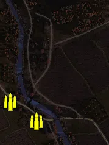
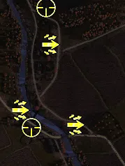
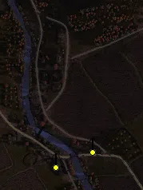
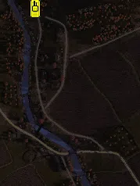

Static Ammo Crate

Pickup Kit

Static Emplacement

Vehicle

| gpo_subcat   | gpo_cat    | gpo_name              |    pos_x |   pos_y |    pos_z |   flag | is_locked   |   team | instance                            | gpo_cat_disp       | gpo_subcat_disp   |
|:-------------|:-----------|:----------------------|---------:|--------:|---------:|-------:|:------------|-------:|:------------------------------------|:-------------------|:------------------|
| ammo_crate   | ammo_crate | ammo_crate            | -152.034 |  30.926 | -151.619 |      0 | False       |      0 | ammo_crate_0                        | Static Ammo Crate  | Static Ammo Crate |
| ammo_crate   | ammo_crate | ammo_crate            |   72.676 |  12.77  | -417.72  |      0 | False       |      0 | ammo_crate_1                        | Static Ammo Crate  | Static Ammo Crate |
| ammo_crate   | ammo_crate | ammo_crate            |   17.285 |   4.933 | -761.881 |      0 | False       |      0 | ammo_crate_2                        | Static Ammo Crate  | Static Ammo Crate |
| ammo_crate   | ammo_crate | ammo_crate            | -451.345 |  20.51  |   32.701 |      0 | False       |      0 | ammo_crate_3                        | Static Ammo Crate  | Static Ammo Crate |
| ammo_crate   | ammo_crate | ammo_crate            | -538.342 |  26.56  |   95.912 |      0 | False       |      0 | ammo_crate_4                        | Static Ammo Crate  | Static Ammo Crate |
| ammo_crate   | ammo_crate | ammo_crate            |   88.833 |  33.126 |  485.697 |      0 | False       |      0 | ammo_crate_5                        | Static Ammo Crate  | Static Ammo Crate |
| ammo_crate   | ammo_crate | ammo_crate            | -360.141 |  19.207 | -165.581 |      0 | False       |      0 | ammo_crate_6                        | Static Ammo Crate  | Static Ammo Crate |
| assault      | kit        | RE_PickUpAssaultPps43 | -430.174 |  34.539 |  302.034 |    202 | False       |      0 | CP_16_dukla_pass_school_assault     | Pickup Kit         | Assault Kit       |
| assault      | kit        | RE_PickUpAssaultPps43 | -515.129 |  23.036 |  114.65  |    203 | False       |      0 | CP_16_dukla_pass_bridge_assault     | Pickup Kit         | Assault Kit       |
| assault      | kit        | RE_PickUpAssaultPps43 | -358.37  |  25.893 |   72.064 |    205 | False       |      0 | CP_16_dukla_pass_last_stand_assault | Pickup Kit         | Assault Kit       |
| sniper       | kit        | RE_PickUpSniper       | -440.154 |  41.87  |  407.094 |    201 | False       |      0 | CP_16_dukla_pass_russianmain_sniper | Pickup Kit         | Sniper Kit        |
| sniper       | kit        | RE_PickUpSniper       | -481.095 |  22.35  |   64.319 |    204 | False       |      0 | CP_16_dukla_pass_kruzlova_sniper    | Pickup Kit         | Sniper Kit        |
| mg_nest      | static     | mg42_bipod            | -432.3   |  23.972 |   30.849 |    204 | False       |      0 | CP_16_dukla_pass_kruzlova_mg        | Static Emplacement | Static MG         |
| mg_nest      | static     | mg42_lafette          | -340.828 |  27.277 |   68.663 |    205 | False       |      0 | CP_16_dukla_pass_last_stand_mg      | Static Emplacement | Static MG         |
| tank         | vehicle    | su_76m                | -482.803 |  32.089 |  407.585 |    201 | True        |      0 | CP_16_dukla_pass_russianmain_su76   | Vehicle            | Tank              |

