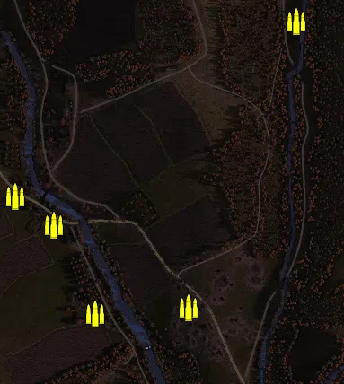
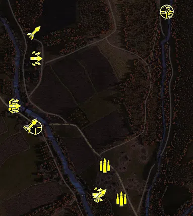
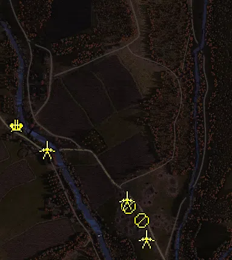
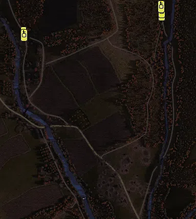

Static Ammo Crate

Pickup Kit

Static Emplacement

Vehicle

| gpo_subcat   | gpo_cat    | gpo_name                  |    pos_x |   pos_y |    pos_z |   flag | is_locked   |   team | instance                                    | gpo_cat_disp       | gpo_subcat_disp   |
|:-------------|:-----------|:--------------------------|---------:|--------:|---------:|-------:|:------------|-------:|:--------------------------------------------|:-------------------|:------------------|
| ammo_crate   | ammo_crate | ammo_crate                | -152.034 |  30.926 | -151.619 |      0 | False       |      0 | ammo_crate_0                                | Static Ammo Crate  | Static Ammo Crate |
| ammo_crate   | ammo_crate | ammo_crate                |   72.676 |  12.77  | -417.72  |      0 | False       |      0 | ammo_crate_1                                | Static Ammo Crate  | Static Ammo Crate |
| ammo_crate   | ammo_crate | ammo_crate                |   17.285 |   4.933 | -761.881 |      0 | False       |      0 | ammo_crate_2                                | Static Ammo Crate  | Static Ammo Crate |
| ammo_crate   | ammo_crate | ammo_crate                | -451.345 |  20.51  |   32.701 |      0 | False       |      0 | ammo_crate_3                                | Static Ammo Crate  | Static Ammo Crate |
| ammo_crate   | ammo_crate | ammo_crate                | -538.342 |  26.56  |   95.912 |      0 | False       |      0 | ammo_crate_4                                | Static Ammo Crate  | Static Ammo Crate |
| ammo_crate   | ammo_crate | ammo_crate                |   88.833 |  33.126 |  485.697 |      0 | False       |      0 | ammo_crate_5                                | Static Ammo Crate  | Static Ammo Crate |
| ammo_crate   | ammo_crate | ammo_crate                | -360.141 |  19.207 | -165.581 |      0 | False       |      0 | ammo_crate_6                                | Static Ammo Crate  | Static Ammo Crate |
| ammo         | kit        | RE_PickUpAmmokit_early    |  -89.036 |  28.481 | -254.42  |    302 | False       |      0 | CP_32_dukla_pass_valley_of_death_ammo1      | Pickup Kit         | Ammo Kit          |
| ammo         | kit        | RE_PickUpAmmokit_early    | -156.858 |  32.94  | -121.782 |    302 | False       |      0 | CP_32_dukla_pass_valley_of_death_ammo2      | Pickup Kit         | Ammo Kit          |
| ammo         | kit        | RE_PickUpAmmokit_early    | -518.4   |  22.677 |  116.713 |    305 | False       |      0 | CP_32_dukla_pass_flak_ammo                  | Pickup Kit         | Ammo Kit          |
| assault      | kit        | RE_PickUpAssaultPps43     |   89.106 |  33.941 |  486.167 |    301 | False       |      0 | CP_32_dukla_pass_russian_main_assault       | Pickup Kit         | Assault Kit       |
| assault      | kit        | RE_PickUpAssaultPps43     | -184.205 |  23.565 | -238.139 |    302 | False       |      0 | CP_32_dukla_pass_valley_of_death_DE_assault | Pickup Kit         | Assault Kit       |
| assault      | kit        | RE_PickUpAssaultPps43     | -515.061 |  23.036 |  114.642 |    305 | False       |      0 | CP_32_dukla_pass_flak_assault               | Pickup Kit         | Assault Kit       |
| assault      | kit        | RE_PickUpAssaultPps43     | -430.123 |  34.536 |  302.112 |    306 | False       |      0 | CP_32_dukla_pass_kruzlova_north_assault     | Pickup Kit         | Assault Kit       |
| sniper       | kit        | RE_PickUpSniper           |   89.425 |  33.93  |  488.361 |    301 | False       |      0 | CP_32_dukla_pass_russian_main_sniper        | Pickup Kit         | Sniper Kit        |
| sniper       | kit        | RE_PickUpSniper           | -431.872 |  23.206 |   28.757 |    304 | False       |      0 | CP_32_dukla_pass_kruzlova_south_sniper      | Pickup Kit         | Sniper Kit        |
| zooka        | kit        | RE_PickUpTankhunter_faust | -175.021 |  23.345 | -241.094 |    302 | False       |      0 | CP_32_dukla_pass_valley_of_death_faust      | Pickup Kit         | HEAT Thrower      |
| zooka        | kit        | RE_PickUpTankhunter_faust | -451.873 |  21.358 |   38.921 |    304 | False       |      0 | CP_32_dukla_pass_kruzlova_south_schreck     | Pickup Kit         | HEAT Thrower      |
| zooka        | kit        | RE_PickUpTankhunter_faust | -449.668 |  21.356 |   33.433 |    304 | False       |      0 | CP_32_dukla_pass_kruzlova_south_faust       | Pickup Kit         | HEAT Thrower      |
| zooka        | kit        | RE_PickUpTankhunter_faust | -438.699 |  41.145 |  404.077 |    306 | False       |      0 | CP_32_dukla_pass_kruzlova_north_faust       | Pickup Kit         | HEAT Thrower      |
| flak         | static     | flak18_fr                 | -516.903 |  22.677 |  120.383 |    305 | False       |      0 | CP_32_dukla_pass_flak_88                    | Static Emplacement | Anti-aircraft Gun |
| mg_nest      | static     | mg42_lafette              | -147.933 |  32.316 | -145.227 |    302 | False       |      0 | CP_32_dukla_pass_valley_of_death_lafette    | Static Emplacement | Static MG         |
| mg_nest      | static     | mg42_bipod                | -103.051 |  31.88  | -192.156 |    302 | False       |      0 | CP_32_dukla_pass_valley_of_death_mg         | Static Emplacement | Static MG         |
| pak          | static     | pak40_static_ard          |  -89.182 |  29.064 | -251.674 |    302 | False       |      0 | CP_32_dukla_pass_valley_of_death_at1        | Static Emplacement | Anti-tank Gun     |
| pak          | static     | pak40_static_ard          | -153.653 |  33.608 | -123.076 |    302 | False       |      0 | CP_32_dukla_pass_valley_of_death_at2        | Static Emplacement | Anti-tank Gun     |
| pak          | static     | pak40_static_ard          | -417.868 |  20.74  |   42.951 |    304 | False       |      0 | CP_32_dukla_pass_kruzlova_south_at          | Static Emplacement | Anti-tank Gun     |
| car          | vehicle    | studebaker_us6            |   59.791 |  38.761 |  498.156 |    301 | False       |      0 | CP_32_dukla_pass_russian_main_trans         | Vehicle            | Car               |
| car          | vehicle    | opelblitz_ard             | -480.144 |  31.988 |  405.812 |    306 | False       |      0 | CP_32_dukla_pass_kruzlova_north_trans       | Vehicle            | Car               |
| tank         | vehicle    | t34_85_early              |   60.96  |  37.951 |  475.902 |    301 | True        |      0 | CP_32_dukla_pass_russian_main_t34a          | Vehicle            | Tank              |
| tank         | vehicle    | t34_85_early              |   60.12  |  38.414 |  487.474 |    301 | True        |      0 | CP_32_dukla_pass_russian_main_t34b          | Vehicle            | Tank              |
| tank         | vehicle    | su_76m                    |   58.842 |  38.995 |  508.387 |    301 | True        |      0 | CP_32_dukla_pass_russian_main_su76          | Vehicle            | Tank              |
| tank         | vehicle    | t34_76_m43_de             | -477.565 |  31.896 |  396.592 |    306 | True        |      0 | CP_32_dukla_pass_kruzlova_north_stugiv      | Vehicle            | Tank              |

