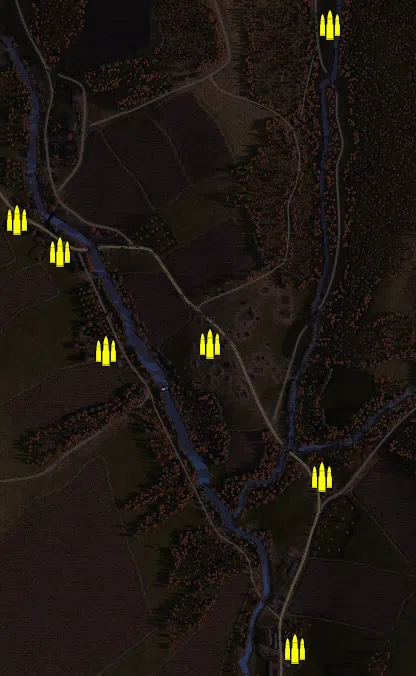
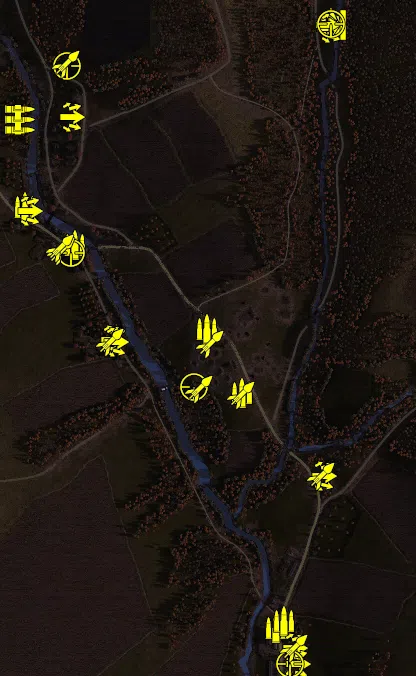
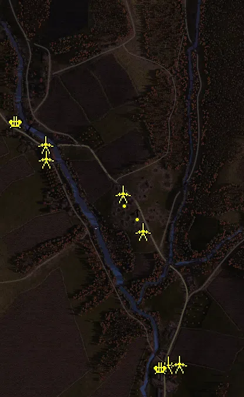
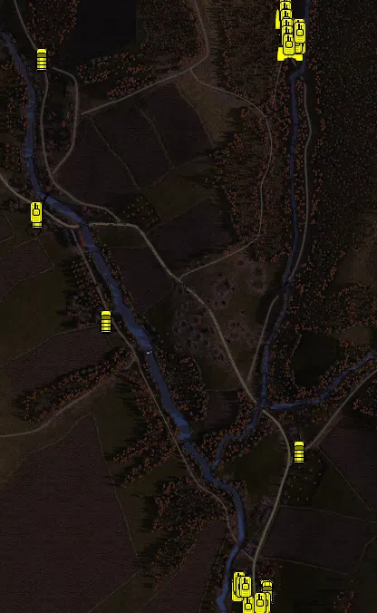

Static Ammo Crate

Pickup Kit

Static Emplacement

Vehicle

| gpo_subcat   | gpo_cat    | gpo_name                   |    pos_x |   pos_y |    pos_z |   flag | is_locked   |   team | instance                                   | gpo_cat_disp       | gpo_subcat_disp   |
|:-------------|:-----------|:---------------------------|---------:|--------:|---------:|-------:|:------------|-------:|:-------------------------------------------|:-------------------|:------------------|
| ammo_crate   | ammo_crate | ammo_crate                 | -152.034 |  30.926 | -151.619 |      0 | False       |      0 | ammo_crate_0                               | Static Ammo Crate  | Static Ammo Crate |
| ammo_crate   | ammo_crate | ammo_crate                 |   72.676 |  12.77  | -417.72  |      0 | False       |      0 | ammo_crate_1                               | Static Ammo Crate  | Static Ammo Crate |
| ammo_crate   | ammo_crate | ammo_crate                 |   17.285 |   4.933 | -761.881 |      0 | False       |      0 | ammo_crate_2                               | Static Ammo Crate  | Static Ammo Crate |
| ammo_crate   | ammo_crate | ammo_crate                 | -451.345 |  20.51  |   32.701 |      0 | False       |      0 | ammo_crate_3                               | Static Ammo Crate  | Static Ammo Crate |
| ammo_crate   | ammo_crate | ammo_crate                 | -538.342 |  26.56  |   95.912 |      0 | False       |      0 | ammo_crate_4                               | Static Ammo Crate  | Static Ammo Crate |
| ammo_crate   | ammo_crate | ammo_crate                 |   88.833 |  33.126 |  485.697 |      0 | False       |      0 | ammo_crate_5                               | Static Ammo Crate  | Static Ammo Crate |
| ammo_crate   | ammo_crate | ammo_crate                 | -360.141 |  19.207 | -165.581 |      0 | False       |      0 | ammo_crate_6                               | Static Ammo Crate  | Static Ammo Crate |
| ammo         | kit        | RE_PickUpAmmokit_early     | -157.225 |  32.939 | -121.747 |    102 | False       |      0 | CP_64_dukla_pass_valley_of_death_ammo1     | Pickup Kit         | Ammo Kit          |
| ammo         | kit        | RE_PickUpAmmokit_early     |  -88.126 |  28.576 | -249.384 |    102 | False       |      0 | CP_64_dukla_pass_valley_of_death_ammo2     | Pickup Kit         | Ammo Kit          |
| ammo         | kit        | RE_PickUpAmmokit_early     |  -19.88  |   4.928 | -719.121 |      1 | False       |      0 | CP_64_dukla_pass_germanmain_ammo1          | Pickup Kit         | Ammo Kit          |
| ammo         | kit        | RE_PickUpAmmokit_early     |   -3.891 |   4.938 | -706.397 |      1 | False       |      0 | CP_64_dukla_pass_germanmain_ammo2          | Pickup Kit         | Ammo Kit          |
| ammo         | kit        | RE_PickUpAmmokit_early     | -421.525 |  20.267 |   45.231 |    103 | False       |      0 | CP_64_dukla_pass_kruzlova_south_ammo1      | Pickup Kit         | Ammo Kit          |
| ammo         | kit        | RE_PickUpAmmokit_early     | -521.404 |  22.677 |  122.167 |    103 | False       |      0 | CP_64_dukla_pass_kruzlova_south_ammo2      | Pickup Kit         | Ammo Kit          |
| ammo         | kit        | RE_PickUpAmmokit_early     |   89.357 |  33.876 |  490.473 |    105 | False       |      0 | CP_64_dukla_pass_russian_main_ammo_0       | Pickup Kit         | Ammo Kit          |
| assault      | kit        | RE_PickUpAssaultPps43      |   87.397 |  33.913 |  480.422 |    105 | False       |      0 | CP_64_dukla_pass_russian_main_assault      | Pickup Kit         | Assault Kit       |
| assault      | kit        | GW_PickUpAssaultBeretta    |   16.704 |   5.722 | -759.025 |      1 | False       |      0 | CP_64_dukla_pass_germanmain_assault        | Pickup Kit         | Assault Kit       |
| assault      | kit        | GW_PickUpAssaultG43        |   21.234 |   5.677 | -791.878 |      1 | False       |      0 | CP_64_dukla_pass_germanmain_assault2       | Pickup Kit         | Assault Kit       |
| assault      | kit        | RE_PickUpAssaultPps43      |   73.362 |  13.326 | -416.773 |    101 | False       |      0 | CP_64_dukla_pass_farm_assault              | Pickup Kit         | Assault Kit       |
| assault      | kit        | RE_PickUpAssaultPps43      | -514.928 |  23.026 |  114.664 |    103 | False       |      0 | CP_64_dukla_pass_kruzlova_south_assault    | Pickup Kit         | Assault Kit       |
| assault      | kit        | RE_PickUpAssaultPps43      | -430.169 |  34.516 |  302.057 |    104 | False       |      0 | CP_64_dukla_pass_kruzlova_north_assault    | Pickup Kit         | Assault Kit       |
| assault      | kit        | RE_PickUpAssaultPps43      | -347.775 |  19.345 | -144.951 |    106 | False       |      0 | CP_64_dukla_pass_kruzlova_orchard_assault  | Pickup Kit         | Assault Kit       |
| assault      | kit        | RE_PickUpAssaultPps43      | -342.65  |  19.341 | -148.175 |    106 | False       |      0 | CP_64_dukla_pass_kruzlova_orchard_assault2 | Pickup Kit         | Assault Kit       |
| at_rifle     | kit        | RE_PickUpAntitankPTRS      |   89.002 |  33.911 |  485.688 |    105 | False       |      0 | CP_64_dukla_pass_russian_main_depmortar    | Pickup Kit         | AT Rifle          |
| mg           | kit        | RE_PickUpMG_DT             | -532.261 |  23.75  |  296.543 |    104 | False       |      0 | CP_64_dukla_pass_kruzlova_north_mg26       | Pickup Kit         | MG Kit            |
| mg_dep       | kit        | GW_PickUpMG42Lafette       |    5.864 |   5.733 | -791.581 |      1 | False       |      0 | CP_64_dukla_pass_germanmain_lafette        | Pickup Kit         | Deployable MG     |
| sniper       | kit        | RE_PickUpSniperAlt         |   89.42  |  33.909 |  488.431 |    105 | False       |      0 | CP_64_dukla_pass_russian_main_Sniper       | Pickup Kit         | Sniper Kit        |
| sniper       | kit        | GW_PickUpSniperg43_ZF      |    7.58  |   5.714 | -791.653 |      1 | False       |      0 | CP_64_dukla_pass_germanmain_sniper         | Pickup Kit         | Sniper Kit        |
| sniper       | kit        | RE_PickUpSniper            | -429.626 |  23.976 |   29.088 |    103 | False       |      0 | CP_64_dukla_pass_kruzlova_south_sniper     | Pickup Kit         | Sniper Kit        |
| sniper       | kit        | RE_PickUpSniper            | -438.355 |  41.147 |  404.418 |    104 | False       |      0 | CP_64_dukla_pass_kruzlova_north_sniper     | Pickup Kit         | Sniper Kit        |
| sniper       | kit        | RE_PickUpSniper            | -183.887 |  23.565 | -238.051 |    102 | False       |      0 | CP_64_dukla_pass_valley_of_death_sniper    | Pickup Kit         | Sniper Kit        |
| zooka        | kit        | GW_PickUpPanzerfaust60m    |   15.504 |   5.721 | -759.107 |      1 | False       |      0 | CP_64_dukla_pass_germanmain_faust          | Pickup Kit         | HEAT Thrower      |
| zooka        | kit        | RE_PickUpTankhunter_faust  |   70.866 |  13.54  | -416.175 |    101 | False       |      0 | CP_64_dukla_pass_farm_at                   | Pickup Kit         | HEAT Thrower      |
| zooka        | kit        | RE_PickUpTankhunter_faust  | -152.997 |  31.536 | -151.56  |    102 | False       |      0 | CP_64_dukla_pass_valley_of_death_faust1    | Pickup Kit         | HEAT Thrower      |
| zooka        | kit        | RE_PickUpTankhunter_faust  |  -90.543 |  29.192 | -254.359 |    102 | False       |      0 | CP_64_dukla_pass_valley_of_death_faust2    | Pickup Kit         | HEAT Thrower      |
| zooka        | kit        | RE_PickUpTankhunter_faust  | -174.987 |  23.348 | -241.015 |    102 | False       |      0 | CP_64_dukla_pass_valley_of_death_faust3    | Pickup Kit         | HEAT Thrower      |
| zooka        | kit        | RE_PickUpTankhunter_faust  | -449.566 |  21.326 |   33.318 |    103 | False       |      0 | CP_64_dukla_pass_kruzlova_south_faust      | Pickup Kit         | HEAT Thrower      |
| zooka        | kit        | RE_PickUpTankhunter_faust  | -451.725 |  21.365 |   39.032 |    103 | False       |      0 | CP_64_dukla_pass_kruzlova_south_schreck    | Pickup Kit         | HEAT Thrower      |
| zooka        | kit        | RE_PickUpTankhunter_faust  | -440.131 |  41.882 |  407.17  |    104 | False       |      0 | CP_64_dukla_pass_kruzlova_north_faust      | Pickup Kit         | HEAT Thrower      |
| zooka        | kit        | RE_PickUpTankhunter_faust  | -351.619 |  19.363 | -147.666 |    106 | False       |      0 | CP_64_dukla_pass_kruzlova_orchard_at       | Pickup Kit         | HEAT Thrower      |
| arty         | static     | nebelwerfer_ard            |   -0.933 |   5.375 | -705.708 |      1 | False       |      0 | CP_64_dukla_pass_germanmain_arti           | Static Emplacement | Artillery         |
| flak         | static     | flak18_fr                  |  -23.871 |   4.938 | -718.099 |      1 | False       |      0 | CP_64_dukla_pass_germanmain_flak88         | Static Emplacement | Anti-aircraft Gun |
| flak         | static     | flak18_fr                  | -518.181 |  22.731 |  120.11  |    103 | False       |      0 | CP_64_dukla_pass_kruzlova_south_flak18     | Static Emplacement | Anti-aircraft Gun |
| mg_nest      | static     | mg42_bipod                 | -103.025 |  31.866 | -192.141 |    102 | False       |      0 | CP_64_dukla_pass_valley_of_death_mg        | Static Emplacement | Static MG         |
| mg_nest      | static     | mg42_lafette               | -147.723 |  32.308 | -145.157 |    102 | False       |      0 | CP_64_dukla_pass_valley_of_death_lafette   | Static Emplacement | Static MG         |
| pak          | static     | pak40_static_ard           |  -86.846 |  28.998 | -251.36  |    102 | False       |      0 | CP_64_dukla_pass_valley_of_death_at1       | Static Emplacement | Anti-tank Gun     |
| pak          | static     | pak40_static_ard           | -154.665 |  33.514 | -124.249 |    102 | False       |      0 | CP_64_dukla_pass_valley_of_death_at2       | Static Emplacement | Anti-tank Gun     |
| pak          | static     | pak40_static_ard           | -417.995 |  20.716 |   43.041 |    103 | False       |      0 | CP_64_dukla_pass_kruzlova_south_at         | Static Emplacement | Anti-tank Gun     |
| pak          | static     | zis2                       | -416.066 |  19.337 |   -5.472 |    103 | False       |      0 | CP_64_dukla_pass_kruzlova_south_zis        | Static Emplacement | Anti-tank Gun     |
| pak          | static     | pak40_static_ard           |   38.276 |   5.482 | -704.87  |      1 | False       |      0 | CP_64_dukla_pass_germanmain_pak40          | Static Emplacement | Anti-tank Gun     |
| apc          | vehicle    | sdkfz251_d_ard             |   14.288 |   4.865 | -765.25  |      1 | False       |      0 | CP_64_dukla_pass_germanmain_Hanomag1       | Vehicle            | APC               |
| apc          | vehicle    | sdkfz251_d_ard             |   17.806 |   4.78  | -769.588 |      1 | False       |      0 | CP_64_dukla_pass_germanmain_hanomag2       | Vehicle            | APC               |
| apc          | vehicle    | universalcarrier_russia_dt |   86.105 |  33.924 |  442.48  |    105 | False       |      0 | CP_64_dukla_pass_russian_main_uc1          | Vehicle            | APC               |
| arty_sp      | vehicle    | katjusha_bm13              |   56.619 |  39.509 |  484.604 |    105 | True        |      0 | CP_64_dukla_pass_russian_main_katjusha     | Vehicle            | Mobile Arty       |
| car          | vehicle    | studebaker_us6             |   57.106 |  38.822 |  474.823 |    105 | False       |      0 | CP_64_dukla_pass_russian_main_truck1       | Vehicle            | Car               |
| car          | vehicle    | studebaker_us6             |   58.57  |  38.357 |  463.711 |    105 | False       |      0 | CP_64_dukla_pass_russian_main_truck2       | Vehicle            | Car               |
| car          | vehicle    | opelblitz_ard_nocanvas     |   87.585 |  12.136 | -459.462 |    101 | False       |      0 | CP_64_dukla_pass_farm_truck                | Vehicle            | Car               |
| car          | vehicle    | studebaker_us6             | -489.401 |  21.654 |   58.515 |    103 | False       |      0 | CP_64_dukla_pass_kruzlova_south_truck      | Vehicle            | Car               |
| car          | vehicle    | studebaker_us6             | -480.417 |  32.049 |  405.615 |    104 | False       |      0 | CP_64_dukla_pass_kruzlova_north_truck      | Vehicle            | Car               |
| car          | vehicle    | studebaker_us6             | -337.482 |  17.766 | -171.705 |    106 | False       |      0 | CP_64_dukla_pass_kruzlova_orchard_truck    | Vehicle            | Car               |
| recon        | vehicle    | ba_64m                     |   68.629 |  35.454 |  424.856 |    105 | True        |      0 | CP_64_dukla_pass_russian_main_scout        | Vehicle            | Scout Vehicle     |
| supply       | vehicle    | studebaker_us6_ammo        |   55.605 |  38.679 |  494.235 |    105 | False       |      0 | CP_64_dukla_pass_russian_main_ammo         | Vehicle            | Supply Vehicle    |
| tank         | vehicle    | Panther_G_Ard_alt          |  -24.075 |   4.93  | -802.312 |      1 | True        |      1 | CP_64_dukla_pass_germanmain_pantherI       | Vehicle            | Tank              |
| tank         | vehicle    | Panther_G_Ard_alt          |  -47.897 |   4.938 | -762.425 |      1 | True        |      0 | CP_64_dukla_pass_germanmain_pantherII      | Vehicle            | Tank              |
| tank         | vehicle    | stug_iv_alt                |  -47.344 |   4.938 | -768.402 |      1 | True        |      0 | CP_64_dukla_pass_germanmain_pIV1           | Vehicle            | Tank              |
| tank         | vehicle    | pzivh                      |   11.664 |   4.651 | -793.739 |      1 | True        |      0 | CP_64_dukla_pass_germanmain_pzIV2          | Vehicle            | Tank              |
| tank         | vehicle    | stug_iv                    |    1.31  |   4.938 | -793.483 |      1 | True        |      0 | CP_64_dukla_pass_germanmain_Stug           | Vehicle            | Tank              |
| tank         | vehicle    | t34_85_early               |   58.41  |  38.739 |  525.521 |    105 | True        |      0 | CP_64_dukla_pass_russian_main_t341         | Vehicle            | Tank              |
| tank         | vehicle    | t34_85_late                |   58.711 |  38.337 |  509.431 |    105 | True        |      0 | CP_64_dukla_pass_russian_main_t342         | Vehicle            | Tank              |
| tank         | vehicle    | t34_85_early               |   59.937 |  39.99  |  492.798 |    105 | True        |      0 | CP_64_dukla_pass_russian_main_t343         | Vehicle            | Tank              |
| tank         | vehicle    | t34_85_late                |   61.854 |  39.216 |  471.503 |    105 | True        |      0 | CP_64_dukla_pass_russian_main_t344         | Vehicle            | Tank              |
| tank         | vehicle    | t34_85_early               |   62.405 |  38.061 |  455.552 |    105 | True        |      0 | CP_64_dukla_pass_russian_main_t345         | Vehicle            | Tank              |
| tank         | vehicle    | su_76m                     | -492.412 |  20.055 |   68.413 |    103 | True        |      0 | CP_64_dukla_pass_kruzlova_south_tank       | Vehicle            | Tank              |
| tank         | vehicle    | t34_76_m43_de              |  -44.795 |   4.938 | -748.124 |      1 | True        |      0 | CP_64_dukla_pass_germanmain_t34            | Vehicle            | Tank              |
| tank         | vehicle    | su_76m                     |   90.052 |  33.777 |  440.32  |    105 | True        |      0 | CP_64_dukla_pass_russian_main_su76a        | Vehicle            | Tank              |
| tank         | vehicle    | su_76m                     |   81.977 |  34.584 |  442.123 |    105 | True        |      0 | CP_64_dukla_pass_russian_main_su76b        | Vehicle            | Tank              |
| tank         | vehicle    | t34_85_late                |   65.427 |  36.998 |  437.467 |    105 | True        |      0 | CP_64_dukla_pass_russian_main_t346         | Vehicle            | Tank              |
| tank         | vehicle    | t34_85_early               |   87.823 |  34.566 |  472.013 |    105 | True        |      0 | CP_64_dukla_pass_russian_main_t347         | Vehicle            | Tank              |
| tank         | vehicle    | t34_85_late                |   89.536 |  34.823 |  464.938 |    105 | True        |      0 | CP_64_dukla_pass_russian_main_t348         | Vehicle            | Tank              |
| tank         | vehicle    | Panther_G_Ard_alt          |  -37.639 |   4.938 | -758.993 |      1 | True        |      0 | CP_64_dukla_pass_germanmain_pantherIII     | Vehicle            | Tank              |
| tank         | vehicle    | stug_iv_alt                |  -29.604 |   4.938 | -757.242 |      1 | True        |      0 | CP_64_dukla_pass_germanmain_StugII         | Vehicle            | Tank              |

