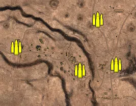
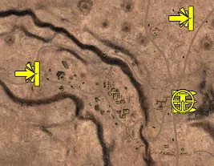
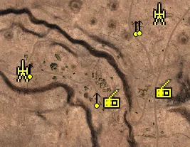
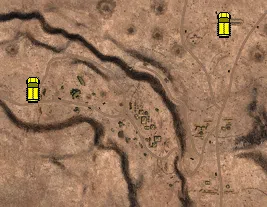

Static Ammo Crate

Pickup Kit

Static Emplacement

Vehicle

| Icon                     | SubCat            | Cat                | Name                    | Instance                                       |   Flag |    X Pos |   Y Pos |    Z Pos |
|:-------------------------|:------------------|:-------------------|:------------------------|:-----------------------------------------------|-------:|---------:|--------:|---------:|
|    | Static Ammo Crate | Static Ammo Crate  | ammo_crate              | ammo_crate_0                                   |      0 |  403.598 |  28.206 | -128.619 |
|    | Static Ammo Crate | Static Ammo Crate  | ammo_crate              | ammo_crate_1                                   |      0 |  261.554 |  57.533 | -149.819 |
|    | Static Ammo Crate | Static Ammo Crate  | ammo_crate              | ammo_crate_2                                   |      0 | -236.435 |  36.658 | -339.383 |
|    | Static Ammo Crate | Static Ammo Crate  | ammo_crate              | ammo_crate_3                                   |      0 | -658.118 |  48.440 | -794.629 |
|    | Static Ammo Crate | Static Ammo Crate  | ammo_crate              | ammo_crate_4                                   |      0 | -734.596 |  52.217 | -817.277 |
|    | Static Ammo Crate | Static Ammo Crate  | ammo_crate              | ammo_crate_5                                   |      0 | -576.772 |  52.201 |  260.008 |
|    | Static Ammo Crate | Static Ammo Crate  | ammo_crate              | ammo_crate_6                                   |      0 |   -2.888 |  19.804 |  491.123 |
|    | Static Ammo Crate | Static Ammo Crate  | ammo_crate              | ammo_crate_7                                   |      0 |  637.537 |  18.337 |  730.425 |
|    | Static Ammo Crate | Static Ammo Crate  | ammo_crate              | ammo_crate_8                                   |      0 |  332.666 |  24.048 |   48.531 |
|    | Static Ammo Crate | Static Ammo Crate  | ammo_crate              | ammo_crate_9                                   |      0 |   12.521 |  57.100 |  -60.133 |
|  | AT Rifle          | Pickup Kit         | BA_PickUpAntitankBoys   | CP_16_Alamein_AxisHQ_DE_GB_ATrifle             |    204 |   15.494 |  57.185 |  -59.522 |
|  | AT Rifle          | Pickup Kit         | BA_PickUpAntitankBoys   | CP_16_Alamein_AlliedHQ_DE_GB_ATrifle           |    203 |  399.763 |  23.378 |   78.657 |
|      | MG Kit            | Pickup Kit         | BA_PickUpSupportBrenMK1 | CP_16_Alamein_Pass_DE_GB_Support               |    202 |  407.712 |  27.459 | -129.440 |
|  | Sniper Kit        | Pickup Kit         | BA_PickUpSniperNo4      | CP_16_Alamein_Pass_DE_GB_Sniper                |    202 |  403.839 |  28.235 | -128.399 |
|    | FIXME UNASSIGNED  | FIXME UNASSIGNED   | commander_mortar_allied | CP_16_Alamein_AlliedHQ_DE_GB_CommMortar        |    203 |  898.110 |  18.522 |  454.029 |
|    | FIXME UNASSIGNED  | FIXME UNASSIGNED   | commander_mortar_allied | CP_16_Alamein_AlliedHQ_DE_GB_CommMortar_0      |    203 |  901.673 |  18.591 |  446.165 |
|    | FIXME UNASSIGNED  | FIXME UNASSIGNED   | commander_smoke_allied  | CP_16_Alamein_AlliedHQ_DE_GB_CommSmoke         |    203 |  905.515 |  18.494 |  452.841 |
|    | FIXME UNASSIGNED  | FIXME UNASSIGNED   | commander_mortar_allied | CP_16_Alamein_AxisHQ_DE_GB_CommMortar          |    204 | -376.880 |  46.079 | -816.507 |
|    | FIXME UNASSIGNED  | FIXME UNASSIGNED   | commander_mortar_allied | CP_16_Alamein_AxisHQ_DE_GB_CommMortar_0        |    204 | -371.314 |  46.295 | -820.245 |
|    | FIXME UNASSIGNED  | FIXME UNASSIGNED   | commander_smoke_allied  | CP_16_Alamein_AxisHQ_DE_GB_CommSmoke           |    204 | -377.843 |  46.376 | -823.757 |
|    | Artillery         | Static Emplacement | sgwr34                  | CP_16_Alamein_AxisHQ_DE_GB_LightMortar         |    204 |    9.970 |  58.044 |  -74.728 |
|    | Artillery         | Static Emplacement | 3inchmortar             | CP_16_Alamein_AlliedHQ_DE_GB_LightMortar       |    203 |  394.975 |  24.417 |   86.467 |
|     | Static MG         | Static Emplacement | mg34_bipod              | CP_16_Alamein_AxisHQ_DE_GB_LightMG             |    204 |   31.235 |  58.369 |  -71.662 |
|     | Static MG         | Static Emplacement | lewis_bipod             | CP_16_Alamein_AlliedHQ_DE_GB_LightMG           |    203 |  330.837 |  25.106 |   47.869 |
|     | Static MG         | Static Emplacement | mg15_bipod              | CP_16_Alamein_AxisHQ_DE_GB_MedMG               |    204 |  220.628 |  58.432 | -154.285 |
|     | Static MG         | Static Emplacement | vickers303_tripod       | CP_16_Alamein_AlliedHQ_DE_GB_MedMG             |    203 |  339.798 |  24.177 |   49.477 |
|   | Radio             | Static Emplacement | britcommradio           | CP_16_Alamein_AlliedHQ_DE_GB_CommRadio         |    203 |  407.438 |  27.431 | -130.945 |
|   | Radio             | Static Emplacement | gercommradio            | CP_16_Alamein_AxisHQ_DE_GB_CommRadio           |    204 |  261.070 |  56.759 | -157.034 |
|     | APC               | Vehicle            | universalcarrier_bren   | CP_16_Alamein_Pass_DE_GB_PersonelCarrier2      |    202 |  396.037 |  24.022 |   75.657 |
|     | APC               | Vehicle            | sdkfz251_1              | CP_16_Alamein_Miteiriya_DE_GB_PersonelCarrier2 |    201 |   13.632 |  57.142 |  -54.538 |

