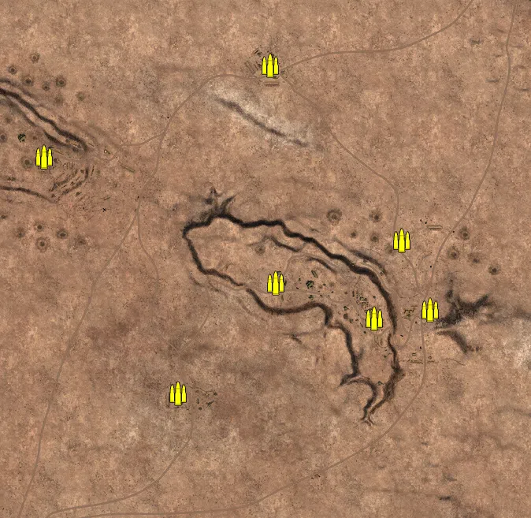
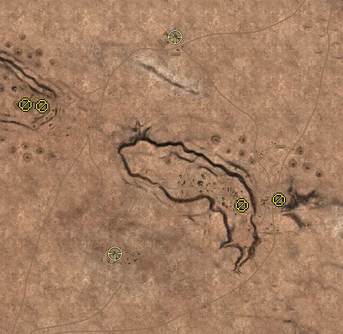
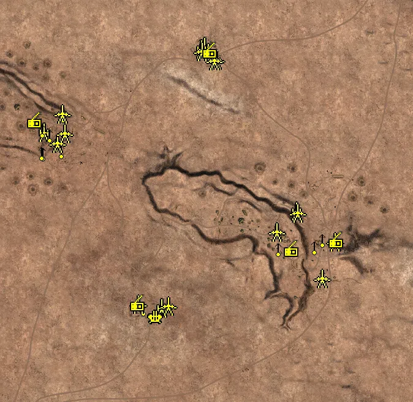
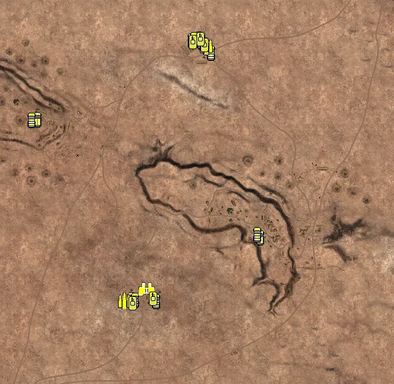

Static Ammo Crate

Pickup Kit

Static Emplacement

Vehicle

| gpo_subcat   | gpo_cat    | gpo_name                |    pos_x |   pos_y |    pos_z |   flag | is_locked   |   team | instance                                        | gpo_cat_disp       | gpo_subcat_disp   |
|:-------------|:-----------|:------------------------|---------:|--------:|---------:|-------:|:------------|-------:|:------------------------------------------------|:-------------------|:------------------|
| ammo_crate   | ammo_crate | ammo_crate              |  403.598 |  28.206 | -128.619 |      0 | False       |      0 | ammo_crate_0                                    | Static Ammo Crate  | Static Ammo Crate |
| ammo_crate   | ammo_crate | ammo_crate              |  261.554 |  57.533 | -149.819 |      0 | False       |      0 | ammo_crate_1                                    | Static Ammo Crate  | Static Ammo Crate |
| ammo_crate   | ammo_crate | ammo_crate              | -236.435 |  36.658 | -339.383 |      0 | False       |      0 | ammo_crate_2                                    | Static Ammo Crate  | Static Ammo Crate |
| ammo_crate   | ammo_crate | ammo_crate              | -658.118 |  48.44  | -794.629 |      0 | False       |      0 | ammo_crate_3                                    | Static Ammo Crate  | Static Ammo Crate |
| ammo_crate   | ammo_crate | ammo_crate              | -734.596 |  52.217 | -817.277 |      0 | False       |      0 | ammo_crate_4                                    | Static Ammo Crate  | Static Ammo Crate |
| ammo_crate   | ammo_crate | ammo_crate              | -576.772 |  52.201 |  260.008 |      0 | False       |      0 | ammo_crate_5                                    | Static Ammo Crate  | Static Ammo Crate |
| ammo_crate   | ammo_crate | ammo_crate              |   -2.888 |  19.804 |  491.123 |      0 | False       |      0 | ammo_crate_6                                    | Static Ammo Crate  | Static Ammo Crate |
| ammo_crate   | ammo_crate | ammo_crate              |  637.537 |  18.337 |  730.425 |      0 | False       |      0 | ammo_crate_7                                    | Static Ammo Crate  | Static Ammo Crate |
| ammo_crate   | ammo_crate | ammo_crate              |  332.666 |  24.048 |   48.531 |      0 | False       |      0 | ammo_crate_8                                    | Static Ammo Crate  | Static Ammo Crate |
| ammo_crate   | ammo_crate | ammo_crate              |   12.521 |  57.1   |  -60.133 |      0 | False       |      0 | ammo_crate_9                                    | Static Ammo Crate  | Static Ammo Crate |
| at_rifle     | kit        | BA_PickUpAntitankBoys   | -521.833 |  51.55  |  239.52  |    302 | False       |      0 | CP_32_Alamein_Kidney_DE_GB_ATrifle              | Pickup Kit         | AT Rifle          |
| at_rifle     | kit        | BA_PickUpAntitankBoys   |  261.03  |  56.795 | -150.762 |    304 | False       |      0 | CP_32_Alamein_Miteiriya_DE_GB_ATrifle           | Pickup Kit         | AT Rifle          |
| mg           | kit        | BA_PickUpSupportBrenMK1 | -587.916 |  54.364 |  245.308 |    302 | False       |      0 | CP_32_Alamein_Kidney_DE_GB_Support              | Pickup Kit         | MG Kit            |
| mg           | kit        | BA_PickUpSupportBrenMK1 |  407.199 |  27.433 | -128.587 |    304 | False       |      0 | CP_32_Alamein_Miteiriya_DE_GB_Support           | Pickup Kit         | MG Kit            |
| sniper       | kit        | GA_PickUpSniperK98      | -236.343 |  36.778 | -339.745 |    303 | False       |      0 | CP_32_Alamein_AxisHQ_DE_GB_Sniper               | Pickup Kit         | Sniper Kit        |
| sniper       | kit        | BA_PickUpSniperNo4      |   -0.099 |  23.093 |  511.825 |    301 | False       |      0 | CP_32_Alamein_AlliedHQ_DE_GB_Sniper             | Pickup Kit         | Sniper Kit        |
| misc         | noidea     | britcommradio           |   -4.077 |  19.84  |  489.788 |    301 | False       |      0 | CP_32_Alamein_AlliedHQ_DE_GB_CommRadio          | FIXME UNASSIGNED   | MISCELLANEOUS     |
| misc         | noidea     | britcommradio           | -575.196 |  51.361 |  262.672 |    302 | False       |      0 | CP_32_Alamein_Kidney_DE_GB_CommRadio            | FIXME UNASSIGNED   | MISCELLANEOUS     |
| misc         | noidea     | gercommradio            | -239.885 |  36.651 | -336.9   |    303 | False       |      0 | CP_32_Alamein_AxisHQ_DE_GB_CommRadio            | FIXME UNASSIGNED   | MISCELLANEOUS     |
| misc         | noidea     | gercommradio            |  407.438 |  27.431 | -130.945 |    304 | False       |      0 | CP_32_Alamein_Miteiriya_DE_GB_CommRadio         | FIXME UNASSIGNED   | MISCELLANEOUS     |
| misc         | noidea     | gercommradio            |  261.07  |  56.759 | -157.034 |    304 | False       |      0 | CP_32_Alamein_Miteiriya_DE_GB_CommRadio_0       | FIXME UNASSIGNED   | MISCELLANEOUS     |
| noidea       | noidea     | opelblitz_dak_zw36      | -210.925 |  38.031 | -381.122 |    303 | False       |      0 | CP_32_Alamein_AxisHQ_DE_GB_TruckAA              | FIXME UNASSIGNED   | FIXME UNASSIGNED  |
| noidea       | noidea     | commander_mortar_allied | -376.566 |  45.435 | -787.8   |    303 | True        |      0 | CP_32_Alamein_AxisHQ_DE_GB_CommMortar           | FIXME UNASSIGNED   | FIXME UNASSIGNED  |
| noidea       | noidea     | commander_mortar_allied | -372.63  |  45.355 | -788.173 |    303 | True        |      0 | CP_32_Alamein_AxisHQ_DE_GB_CommMortar_0         | FIXME UNASSIGNED   | FIXME UNASSIGNED  |
| noidea       | noidea     | commander_mortar_allied | -367.76  |  45.139 | -787.831 |    303 | True        |      0 | CP_32_Alamein_AxisHQ_DE_GB_CommMortar_1         | FIXME UNASSIGNED   | FIXME UNASSIGNED  |
| noidea       | noidea     | commander_smoke_allied  | -373.15  |  45.372 | -793.906 |    303 | True        |      0 | CP_32_Alamein_AxisHQ_DE_GB_CommSmoke            | FIXME UNASSIGNED   | FIXME UNASSIGNED  |
| noidea       | noidea     | commander_mortar_allied |  303.305 |  17.249 |  976.918 |    301 | True        |      0 | CP_32_Alamein_AlliedHQ_DE_GB_CommMortar         | FIXME UNASSIGNED   | FIXME UNASSIGNED  |
| noidea       | noidea     | commander_mortar_allied |  296.473 |  17.518 |  978.169 |    301 | True        |      0 | CP_32_Alamein_AlliedHQ_DE_GB_CommMortar_0       | FIXME UNASSIGNED   | FIXME UNASSIGNED  |
| noidea       | noidea     | commander_mortar_allied |  291.165 |  17.76  |  979.694 |    301 | True        |      0 | CP_32_Alamein_AlliedHQ_DE_GB_CommMortar_1       | FIXME UNASSIGNED   | FIXME UNASSIGNED  |
| noidea       | noidea     | commander_smoke_allied  |  297.514 |  17.621 |  982.199 |    301 | True        |      0 | CP_32_Alamein_AlliedHQ_DE_GB_CommSmoke          | FIXME UNASSIGNED   | FIXME UNASSIGNED  |
| arty         | static     | 25pdr                   |  -22.922 |  22.142 |  505.442 |    301 | False       |      0 | CP_32_Alamein_AlliedHQ_DE_GB_Howitzer           | Static Emplacement | Artillery         |
| arty         | static     | 3inchmortar             | -546.995 |  56.758 |  226.003 |    302 | False       |      0 | CP_32_Alamein_Kidney_DE_GB_LightMortar          | Static Emplacement | Artillery         |
| arty         | static     | lefh18                  | -161.645 |  37.073 | -348.868 |    303 | False       |      0 | CP_32_Alamein_AxisHQ_DE_GB_Howitzer             | Static Emplacement | Artillery         |
| arty         | static     | 3inchmortar             |  277.455 |  35.022 |  -32.641 |    304 | False       |      0 | CP_32_Alamein_Miteiriya_DE_GB_LightMortar       | Static Emplacement | Artillery         |
| arty         | static     | 3inchmortar             |  -31.313 |  23.571 |  498.326 |    301 | False       |      0 | CP_32_Alamein_AlliedHQ_DE_GB_LightMortar        | Static Emplacement | Artillery         |
| flak         | static     | flak18                  | -179.6   |  37.349 | -378.759 |    303 | False       |      0 | CP_32_Alamein_AxisHQ_DE_GB_HeavyArtillery       | Static Emplacement | Anti-aircraft Gun |
| mg_nest      | static     | lewis_bipod             | -550.053 |  58.391 |  233.281 |    302 | False       |      0 | CP_32_Alamein_Kidney_DE_GB_LightMG              | Static Emplacement | Static MG         |
| mg_nest      | static     | lewis_bipod             | -487.366 |  39.268 |  166.265 |    302 | False       |      0 | CP_32_Alamein_Kidney_DE_GB_LightMG_0            | Static Emplacement | Static MG         |
| mg_nest      | static     | lewis_bipod             | -505.121 |  47.092 |  187.396 |    302 | False       |      0 | CP_32_Alamein_Kidney_DE_GB_LightMG_1            | Static Emplacement | Static MG         |
| mg_nest      | static     | mg34_bipod              | -482.751 |  39.431 |  284.405 |    302 | False       |      0 | CP_32_Alamein_Kidney_DE_GB_LightMG_2            | Static Emplacement | Static MG         |
| mg_nest      | static     | lewis_bipod             | -526.068 |  54.824 |  218.506 |    302 | False       |      0 | CP_32_Alamein_Kidney_DE_GB_LightMG_3            | Static Emplacement | Static MG         |
| mg_nest      | static     | lewis_bipod             | -548.107 |  43.97  |  158.995 |    302 | False       |      0 | CP_32_Alamein_Kidney_DE_GB_LightMG_4            | Static Emplacement | Static MG         |
| mg_nest      | static     | mg34_bipod              | -219.208 |  39.133 | -347.409 |    303 | False       |      0 | CP_32_Alamein_AxisHQ_DE_GB_LightMG_0            | Static Emplacement | Static MG         |
| mg_nest      | static     | mg34_bipod              |  364.337 |  29.339 | -123.267 |    304 | False       |      0 | CP_32_Alamein_Miteiriya_DE_GB_LightMG           | Static Emplacement | Static MG         |
| mg_nest      | static     | mg34_bipod              |  338.431 |  30.184 | -148.703 |    304 | False       |      0 | CP_32_Alamein_Miteiriya_DE_GB_LightMG_0         | Static Emplacement | Static MG         |
| mg_nest      | static     | lewis_bipod             |  364.202 |  31.668 | -244.221 |    304 | False       |      0 | CP_32_Alamein_Miteiriya_DE_GB_LightMG_1         | Static Emplacement | Static MG         |
| mg_nest      | static     | mg15_bipod              |  220.628 |  58.432 | -154.285 |    304 | False       |      0 | CP_32_Alamein_Miteiriya_DE_GB_MedMG             | Static Emplacement | Static MG         |
| mg_nest      | static     | vickers303_tripod       | -552.504 |  42.867 |  159.68  |    302 | False       |      0 | CP_32_Alamein_Kidney_DE_GB_MedMG                | Static Emplacement | Static MG         |
| pak          | static     | 6pdr_static             |   16.367 |  23.767 |  461.016 |    301 | False       |      0 | CP_32_Alamein_AlliedHQ_DE_GB_StaticArtillery    | Static Emplacement | Anti-tank Gun     |
| pak          | static     | 6pdr_static             |  -30.084 |  23.797 |  490.884 |    301 | False       |      0 | CP_32_Alamein_AlliedHQ_DE_GB_StaticArtillery_0  | Static Emplacement | Anti-tank Gun     |
| pak          | static     | 6pdr_static             |   10.299 |  23.808 |  459.79  |    301 | False       |      0 | CP_32_Alamein_AlliedHQ_DE_GB_StaticArtillery_1  | Static Emplacement | Anti-tank Gun     |
| pak          | static     | 6pdr_static             | -502.716 |  46.265 |  190.922 |    302 | False       |      0 | CP_32_Alamein_Kidney_DE_GB_StaticArtillery      | Static Emplacement | Anti-tank Gun     |
| pak          | static     | 6pdr_static             | -485.647 |  38.897 |  286.469 |    302 | False       |      0 | CP_32_Alamein_Kidney_DE_GB_StaticArtillery_3    | Static Emplacement | Anti-tank Gun     |
| pak          | static     | pak38_static            | -237.843 |  39.165 | -335.386 |    303 | False       |      0 | CP_32_Alamein_AxisHQ_DE_GB_StaticArtillery      | Static Emplacement | Anti-tank Gun     |
| pak          | static     | pak38_static            | -140.501 |  37.92  | -341.577 |    303 | False       |      0 | CP_32_Alamein_AxisHQ_DE_GB_StaticArtillery_0    | Static Emplacement | Anti-tank Gun     |
| pak          | static     | pak38_static            |  404.773 |  29.94  | -132.568 |    304 | False       |      0 | CP_32_Alamein_Miteiriya_DE_GB_StaticArtillery   | Static Emplacement | Anti-tank Gun     |
| pak          | static     | pak38_static            |  361.097 |  30.89  | -252.29  |    304 | False       |      0 | CP_32_Alamein_Miteiriya_DE_GB_LightArtillery    | Static Emplacement | Anti-tank Gun     |
| pak          | static     | pak38_static            |  281.426 |  35.434 |  -37.855 |    304 | False       |      0 | CP_32_Alamein_Miteiriya_DE_GB_StaticArtillery_0 | Static Emplacement | Anti-tank Gun     |
| pak          | static     | 6pdr                    |  213.373 |  59.765 | -100.473 |    304 | False       |      0 | CP_32_Alamein_Miteiriya_DE_GB_LightArtillery_0  | Static Emplacement | Anti-tank Gun     |
| pak          | static     | 6pdr_static             | -477.194 |  43.87  |  221.997 |    302 | False       |      0 | CP_32_Alamein_Kidney_DE_GB_StaticArtillery_0    | Static Emplacement | Anti-tank Gun     |
| apc          | vehicle    | universalcarrier_bren   |  -31.073 |  21.976 |  519.909 |    301 | False       |      0 | CP_32_Alamein_AlliedHQ_DE_GB_PersonelCarrier2   | Vehicle            | APC               |
| apc          | vehicle    | sdkfz251_1              | -238.334 |  38.107 | -366.734 |    303 | False       |      0 | CP_32_Alamein_AxisHQ_DE_GB_PersonelCarrier2     | Vehicle            | APC               |
| apc          | vehicle    | universalcarrier_bren   | -559.061 |  54.163 |  250.831 |    302 | False       |      0 | CP_32_Alamein_Kidney_DE_GB_PersonelCarrier2     | Vehicle            | APC               |
| apc          | vehicle    | universalcarrier_bren   |   -8.95  |  22.522 |  526.69  |    301 | False       |      0 | CP_32_Alamein_AlliedHQ_DE_GB_PersonelCarrier2_0 | Vehicle            | APC               |
| apc          | vehicle    | universalcarrier_bren   |  202.226 |  56.415 | -154.145 |    304 | False       |      0 | CP_32_Alamein_Miteiriya_DE_GB_PersonelCarrier2  | Vehicle            | APC               |
| car          | vehicle    | chevy30cwt              |  -24.652 |  22.27  |  524.697 |    301 | False       |      0 | CP_32_Alamein_AlliedHQ_DE_GB_Truck              | Vehicle            | Car               |
| car          | vehicle    | chevy30cwt              |   20.918 |  21.617 |  496.668 |    301 | False       |      0 | CP_32_Alamein_AlliedHQ_DE_GB_TruckAA            | Vehicle            | Car               |
| car          | vehicle    | opelblitz_dak           | -225.783 |  37.59  | -367.273 |    303 | False       |      0 | CP_32_Alamein_AxisHQ_DE_GB_Truck                | Vehicle            | Car               |
| car          | vehicle    | chevy30cwt              | -580.388 |  54.035 |  248.876 |    302 | False       |      0 | CP_32_Alamein_Kidney_DE_GB_Truck2               | Vehicle            | Car               |
| car          | vehicle    | chevy30cwt              |   -0.006 |  22.318 |  518.368 |    301 | False       |      0 | CP_32_Alamein_AlliedHQ_DE_GB_TruckAA_0          | Vehicle            | Car               |
| car          | vehicle    | willysmbsas             |   34.67  |  22.495 |  478.493 |    301 | False       |      0 | CP_32_Alamein_AlliedHQ_DE_GB_CarCommando        | Vehicle            | Car               |
| car          | vehicle    | opelblitz_dak_nocanvas  | -154.891 |  36.392 | -371.502 |    303 | False       |      0 | CP_32_Alamein_AxisHQ_DE_GB_Truck2               | Vehicle            | Car               |
| car          | vehicle    | chevy30cwt              |  192.578 |  55.592 | -144.11  |    304 | False       |      0 | CP_32_Alamein_Miteiriya_DE_GB_Truck2            | Vehicle            | Car               |
| recon        | vehicle    | sdkfz222                | -186.811 |  36.088 | -332.207 |    303 | True        |      0 | CP_32_Alamein_AxisHQ_DE_GB_LightArmour2         | Vehicle            | Scout Vehicle     |
| supply       | vehicle    | opelblitz_dak_ammo      | -261.854 |  36.849 | -372.207 |    303 | False       |      0 | CP_32_Alamein_AxisHQ_DE_GB_TruckAmmo            | Vehicle            | Supply Vehicle    |
| supply       | vehicle    | chevy30cwt_ammo         |   17.656 |  21.378 |  499.362 |    301 | False       |      0 | CP_32_Alamein_AlliedHQ_DE_GB_TruckAmmo          | Vehicle            | Supply Vehicle    |
| tank         | vehicle    | m4a1                    |   12.101 |  21.303 |  503.553 |    301 | True        |      0 | CP_32_Alamein_AlliedHQ_DE_GB_HeavyTank2_0       | Vehicle            | Tank              |
| tank         | vehicle    | pziii_l_dak             | -163.675 |  36.475 | -363.948 |    303 | True        |      0 | CP_32_Alamein_AxisHQ_DE_GB_MediumTank           | Vehicle            | Tank              |
| tank         | vehicle    | pziif                   | -233.925 |  38.162 | -379.477 |    303 | True        |      0 | CP_32_Alamein_AxisHQ_DE_GB_LightArmour3         | Vehicle            | Tank              |
| tank         | vehicle    | marmonherringtonmk3a    |   -1.356 |  22.341 |  523.749 |    301 | True        |      0 | CP_32_Alamein_AlliedHQ_DE_GB_AntiAirMobile      | Vehicle            | Tank              |
| tank         | vehicle    | m3stuarthoney           |  -28.534 |  21.796 |  514.68  |    301 | True        |      0 | CP_32_Alamein_AlliedHQ_DE_GB_LightTank          | Vehicle            | Tank              |

