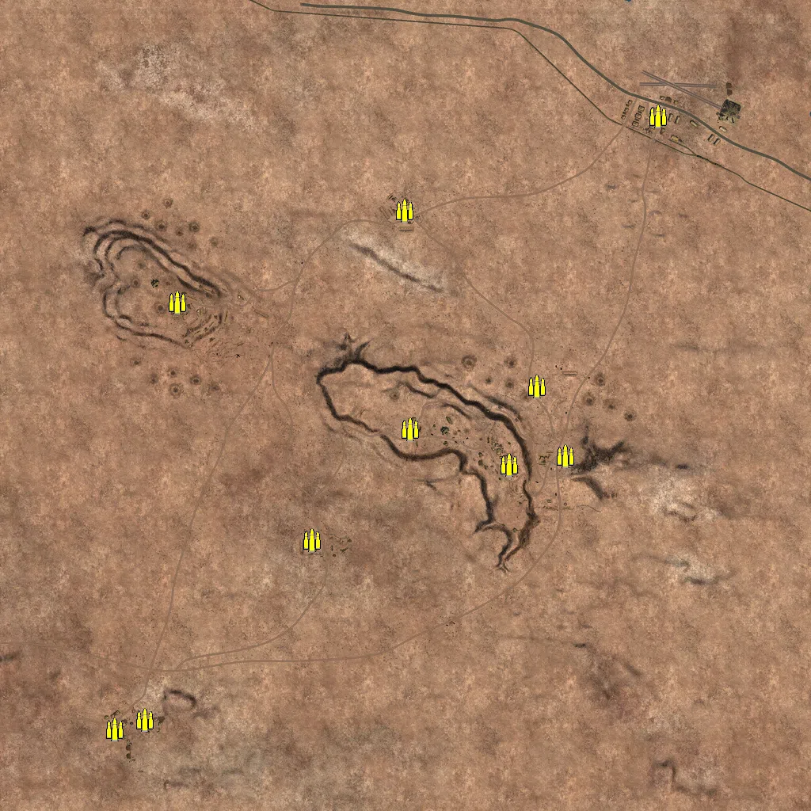
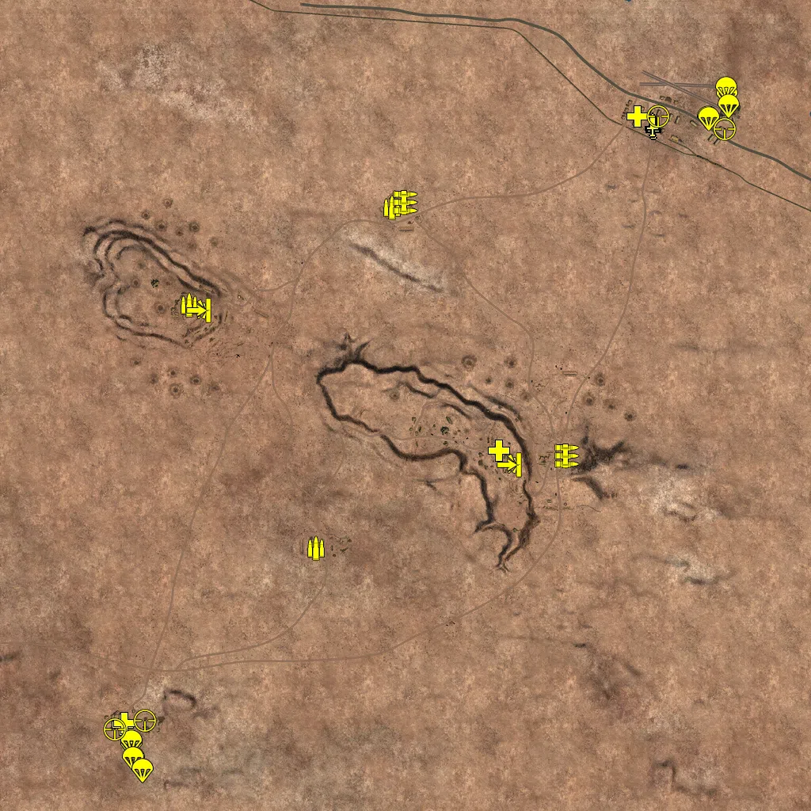
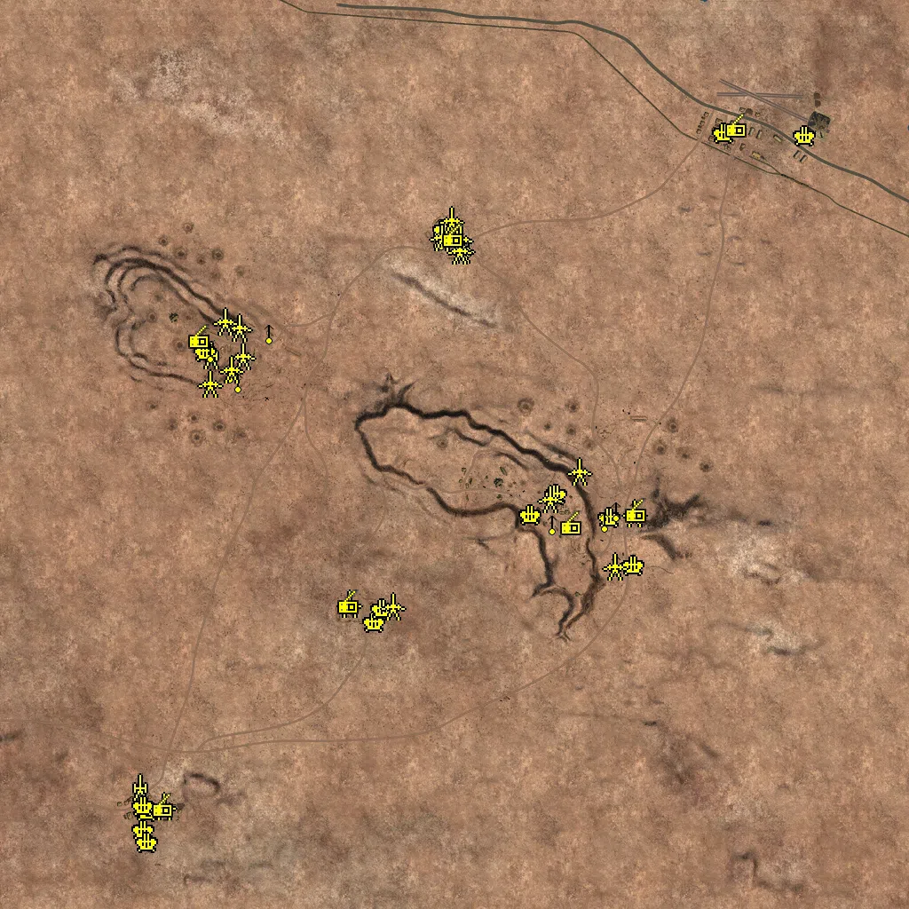
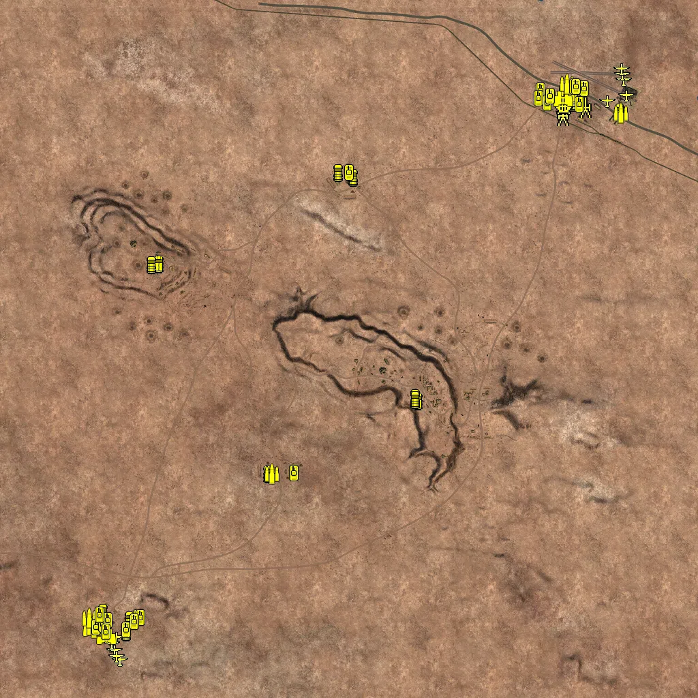

Static Ammo Crate

Pickup Kit

Static Emplacement

Vehicle

| gpo_subcat   | gpo_cat    | gpo_name                   |    pos_x |   pos_y |    pos_z |   flag | is_locked   |   team | instance                                        | gpo_cat_disp       | gpo_subcat_disp   |
|:-------------|:-----------|:---------------------------|---------:|--------:|---------:|-------:|:------------|-------:|:------------------------------------------------|:-------------------|:------------------|
| ammo_crate   | ammo_crate | ammo_crate                 |  403.598 |  28.206 | -128.619 |      0 | False       |      0 | ammo_crate_0                                    | Static Ammo Crate  | Static Ammo Crate |
| ammo_crate   | ammo_crate | ammo_crate                 |  261.554 |  57.533 | -149.819 |      0 | False       |      0 | ammo_crate_1                                    | Static Ammo Crate  | Static Ammo Crate |
| ammo_crate   | ammo_crate | ammo_crate                 | -236.435 |  36.658 | -339.383 |      0 | False       |      0 | ammo_crate_2                                    | Static Ammo Crate  | Static Ammo Crate |
| ammo_crate   | ammo_crate | ammo_crate                 | -658.118 |  48.44  | -794.629 |      0 | False       |      0 | ammo_crate_3                                    | Static Ammo Crate  | Static Ammo Crate |
| ammo_crate   | ammo_crate | ammo_crate                 | -734.596 |  52.217 | -817.277 |      0 | False       |      0 | ammo_crate_4                                    | Static Ammo Crate  | Static Ammo Crate |
| ammo_crate   | ammo_crate | ammo_crate                 | -576.772 |  52.201 |  260.008 |      0 | False       |      0 | ammo_crate_5                                    | Static Ammo Crate  | Static Ammo Crate |
| ammo_crate   | ammo_crate | ammo_crate                 |   -2.888 |  19.804 |  491.123 |      0 | False       |      0 | ammo_crate_6                                    | Static Ammo Crate  | Static Ammo Crate |
| ammo_crate   | ammo_crate | ammo_crate                 |  637.537 |  18.337 |  730.425 |      0 | False       |      0 | ammo_crate_7                                    | Static Ammo Crate  | Static Ammo Crate |
| ammo_crate   | ammo_crate | ammo_crate                 |  332.666 |  24.048 |   48.531 |      0 | False       |      0 | ammo_crate_8                                    | Static Ammo Crate  | Static Ammo Crate |
| ammo_crate   | ammo_crate | ammo_crate                 |   12.521 |  57.1   |  -60.133 |      0 | False       |      0 | ammo_crate_9                                    | Static Ammo Crate  | Static Ammo Crate |
| ammo         | kit        | BA_PickUpAmmokit           |  -34.387 |  23.357 |  499.608 |      1 | False       |      0 | CP_64_Alamein_BA_DE_GB_AmmoCrates               | Pickup Kit         | Ammo Kit          |
| ammo         | kit        | BA_PickUpAmmokit           | -545.177 |  53.686 |  253.533 |    103 | False       |      0 | CP_64_Alamein_Kidney_DE_GB_AmmoCrates           | Pickup Kit         | Ammo Kit          |
| ammo         | kit        | BA_PickUpAmmokit           | -226.785 |  36.678 | -359.423 |    101 | False       |      0 | CP_64_Alamein_GA_DE_GB_AmmoCrates               | Pickup Kit         | Ammo Kit          |
| at_rifle     | kit        | BA_PickUpAntitankBoys      | -521.833 |  51.55  |  239.52  |    103 | False       |      0 | CP_64_Alamein_Kidney_DE_GB_ATrifle              | Pickup Kit         | AT Rifle          |
| at_rifle     | kit        | BA_PickUpAntitankBoys      |  261.03  |  56.795 | -150.762 |    102 | False       |      0 | CP_64_Alamein_Miteiriya_DE_GB_ATrifle           | Pickup Kit         | AT Rifle          |
| commando     | kit        | BA_PickUpCommandoTommyD    |  625.862 |  18.375 |  701.034 |    104 | False       |      0 | CP_64_Alamein_Alamein_DE_GB_Commando            | Pickup Kit         | Commando Kit      |
| commando     | kit        | BA_PickUpCommandoTommyD    |  624.065 |  18.375 |  707.377 |    104 | False       |      0 | CP_64_Alamein_Alamein_DE_GB_Commando_0          | Pickup Kit         | Commando Kit      |
| medic        | kit        | GA_PickUpMedicP08          | -713.686 |  51.325 | -806.253 |    105 | False       |      0 | CP_64_Alamein_AxisHQ_DE_GB_Medic                | Pickup Kit         | Medic Kit         |
| medic        | kit        | GA_PickUpMedicP08          | -709.818 |  51.327 | -802.796 |    105 | False       |      0 | CP_64_Alamein_AxisHQ_DE_GB_Medic_0              | Pickup Kit         | Medic Kit         |
| medic        | kit        | BA_PickUpMedicWebley       |  235.181 |  60.642 | -114.601 |    102 | False       |      0 | CP_64_Alamein_Miteiriya_DE_GB_Medic             | Pickup Kit         | Medic Kit         |
| medic        | kit        | BA_PickUpMedicWebley       |  586.901 |  18.546 |  729.088 |    104 | False       |      0 | CP_64_Alamein_Alamein_DE_GB_Medic               | Pickup Kit         | Medic Kit         |
| medic        | kit        | BA_PickUpMedicWebley       |  585.095 |  18.32  |  729.335 |    104 | False       |      0 | CP_64_Alamein_Alamein_DE_GB_Medic_0             | Pickup Kit         | Medic Kit         |
| mg           | kit        | BA_PickUpSupportBrenMK1    |  407.199 |  27.433 | -128.587 |    102 | False       |      0 | CP_64_Alamein_Miteiriya_DE_GB_Support           | Pickup Kit         | MG Kit            |
| mg           | kit        | BA_PickUpSupportBrenMK1    |    0.028 |  23.082 |  511.695 |      1 | False       |      0 | CP_64_Alamein_BA_DE_GB_Support                  | Pickup Kit         | MG Kit            |
| parachute    | kit        | GA_PickUpPilotP08          | -691.288 |  51.019 | -857.317 |    105 | False       |      0 | CP_64_Alamein_AxisHQ_DE_GB_Pilot                | Pickup Kit         | Parachute Kit     |
| parachute    | kit        | GA_PickUpPilotP08          | -691.2   |  50.938 | -851.935 |    105 | False       |      0 | CP_64_Alamein_AxisHQ_DE_GB_Pilot_0              | Pickup Kit         | Parachute Kit     |
| parachute    | kit        | GA_PickUpPilotP08          | -692.311 |  50.928 | -850.884 |    105 | False       |      0 | CP_64_Alamein_AxisHQ_DE_GB_Pilot_1              | Pickup Kit         | Parachute Kit     |
| parachute    | kit        | GA_PickUpPilotP08          | -686.853 |  51.672 | -892.254 |    105 | False       |      0 | CP_64_Alamein_AxisHQ_DE_GB_Pilot_2              | Pickup Kit         | Parachute Kit     |
| parachute    | kit        | GA_PickUpPilotP08          | -688.016 |  51.738 | -892.289 |    105 | False       |      0 | CP_64_Alamein_AxisHQ_DE_GB_Pilot_3              | Pickup Kit         | Parachute Kit     |
| parachute    | kit        | GA_PickUpPilotP08          | -663.683 |  51.254 | -921.148 |    105 | False       |      0 | CP_64_Alamein_AxisHQ_DE_GB_Pilot_4              | Pickup Kit         | Parachute Kit     |
| parachute    | kit        | GA_PickUpPilotP08          | -664.793 |  51.251 | -921.062 |    105 | False       |      0 | CP_64_Alamein_AxisHQ_DE_GB_Pilot_5              | Pickup Kit         | Parachute Kit     |
| parachute    | kit        | BA_PickUpPilotWebley       |  811.423 |  16.623 |  783.602 |    104 | False       |      0 | CP_64_Alamein_Alamein_DE_GB_Pilot               | Pickup Kit         | Parachute Kit     |
| parachute    | kit        | BA_PickUpPilotWebley       |  809.909 |  16.946 |  799.603 |    104 | False       |      0 | CP_64_Alamein_Alamein_DE_GB_Pilot_0             | Pickup Kit         | Parachute Kit     |
| parachute    | kit        | BA_PickUpPilotWebley       |  816.817 |  16.605 |  755.106 |    104 | False       |      0 | CP_64_Alamein_Alamein_DE_GB_Pilot_1             | Pickup Kit         | Parachute Kit     |
| parachute    | kit        | BA_PickUpPilotWebley       |  764.742 |  16.471 |  726.956 |    104 | False       |      0 | CP_64_Alamein_Alamein_DE_GB_Pilot_2             | Pickup Kit         | Parachute Kit     |
| parachute    | kit        | BA_PickUpPilotWebley       |  766.951 |  16.464 |  724.072 |    104 | False       |      0 | CP_64_Alamein_Alamein_DE_GB_Pilot_3             | Pickup Kit         | Parachute Kit     |
| sniper       | kit        | BA_PickUpSniperNo4         |  638.521 |  18.461 |  730.01  |    104 | False       |      0 | CP_64_Alamein_Alamein_DE_GB_Sniper              | Pickup Kit         | Sniper Kit        |
| sniper       | kit        | BA_PickUpSniperNo4         |  806.875 |  17.428 |  698.854 |    104 | False       |      0 | CP_64_Alamein_Alamein_DE_GB_Sniper_0            | Pickup Kit         | Sniper Kit        |
| sniper       | kit        | GA_PickUpSniperK98         | -657.838 |  47.839 | -795.986 |    105 | False       |      0 | CP_64_Alamein_AxisHQ_DE_GB_Sniper               | Pickup Kit         | Sniper Kit        |
| sniper       | kit        | GA_PickUpSniperK98         | -734.876 |  52.224 | -817.563 |    105 | False       |      0 | CP_64_Alamein_AxisHQ_DE_GB_Sniper_0             | Pickup Kit         | Sniper Kit        |
| noidea       | noidea     | commander_artillery_allied |  -40.98  |  47.706 | -977.453 |    105 | True        |      0 | CP_64_Alamein_AxisHQ_DE_GB_CommArtillery        | FIXME UNASSIGNED   | FIXME UNASSIGNED  |
| noidea       | noidea     | commander_artillery_allied |  -46.747 |  47.822 | -981.595 |    105 | True        |      0 | CP_64_Alamein_AxisHQ_DE_GB_CommArtillery_0      | FIXME UNASSIGNED   | FIXME UNASSIGNED  |
| noidea       | noidea     | commander_artillery_allied |  -33.795 |  47.289 | -974.318 |    105 | True        |      0 | CP_64_Alamein_AxisHQ_DE_GB_CommArtillery_1      | FIXME UNASSIGNED   | FIXME UNASSIGNED  |
| noidea       | noidea     | commander_smoke_allied     |  -37.708 |  47.658 | -984.161 |    105 | True        |      0 | CP_64_Alamein_AxisHQ_DE_GB_CommSmoke            | FIXME UNASSIGNED   | FIXME UNASSIGNED  |
| noidea       | noidea     | commander_artillery_allied |   34.289 |  18.403 |  956.855 |    104 | True        |      0 | CP_64_Alamein_Alamein_DE_GB_CommArtillery       | FIXME UNASSIGNED   | FIXME UNASSIGNED  |
| noidea       | noidea     | commander_artillery_allied |   38.827 |  18.223 |  959.631 |    104 | True        |      0 | CP_64_Alamein_Alamein_DE_GB_CommArtillery_0     | FIXME UNASSIGNED   | FIXME UNASSIGNED  |
| noidea       | noidea     | commander_artillery_allied |   44.131 |  18.125 |  962.824 |    104 | True        |      0 | CP_64_Alamein_Alamein_DE_GB_CommArtillery_1     | FIXME UNASSIGNED   | FIXME UNASSIGNED  |
| noidea       | noidea     | commander_smoke_allied     |   36.076 |  18.222 |  964.382 |    104 | True        |      0 | CP_64_Alamein_Alamein_DE_GB_CommSmoke           | FIXME UNASSIGNED   | FIXME UNASSIGNED  |
| arty         | static     | lefh18                     | -709.376 |  50.116 | -750.705 |    105 | False       |      0 | CP_64_Alamein_AxisHQ_DE_GB_Howitzer             | Static Emplacement | Artillery         |
| arty         | static     | sgwr34                     | -550.363 |  56.694 |  224.916 |    103 | False       |      0 | CP_64_Alamein_Kidney_DE_GB_LightMortar          | Static Emplacement | Artillery         |
| arty         | static     | 3inchmortar                |  -31.313 |  23.571 |  498.326 |      1 | False       |      0 | CP_64_Alamein_BA_DE_GB_LightMortar              | Static Emplacement | Artillery         |
| flak         | static     | breda_35_20mm              | -559.292 |  56.985 |  231.141 |    103 | False       |      0 | CP_64_Alamein_Kidney_DE_GB_AntiAirSmall         | Static Emplacement | Anti-aircraft Gun |
| flak         | static     | bofors40mm                 |  -22.91  |  22.05  |  505.768 |      1 | False       |      0 | CP_64_Alamein_BA_DE_GB_AntiAirSmall             | Static Emplacement | Anti-aircraft Gun |
| flak         | static     | flak18                     | -179.6   |  37.345 | -378.736 |    101 | False       |      0 | CP_64_Alamein_GA_DE_GB_HeavyArtillery           | Static Emplacement | Anti-aircraft Gun |
| flak         | static     | flak18                     | -691.501 |  49.95  | -803.105 |    105 | False       |      0 | CP_64_Alamein_AxisHQ_DE_GB_HeavyArtillery       | Static Emplacement | Anti-aircraft Gun |
| flak         | static     | flak18ns                   |  403.756 |  30.516 | -249.124 |    102 | False       |      0 | CP_64_Alamein_Miteiriya_DE_GB_HeavyArtillery    | Static Emplacement | Anti-aircraft Gun |
| flak         | static     | bofors40mm                 |  789.682 |  16.978 |  717.561 |    104 | False       |      0 | CP_64_Alamein_Alamein_DE_GB_AntiAirSmall        | Static Emplacement | Anti-aircraft Gun |
| flak         | static     | bofors40mm                 |  607.317 |  17.542 |  724.093 |    104 | False       |      0 | CP_64_Alamein_Alamein_DE_GB_AntiAirSmall_0      | Static Emplacement | Anti-aircraft Gun |
| flak         | static     | flak18                     |  350.264 |  28.044 | -142.48  |    102 | False       |      0 | CP_64_Alamein_Miteiriya_DE_GB_HeavyArtillery_0  | Static Emplacement | Anti-aircraft Gun |
| flak         | static     | breda_35_20mm              |  172.275 |  57.178 | -136.701 |    102 | False       |      0 | CP_64_Alamein_Miteiriya_DE_GB_AntiAirSmall      | Static Emplacement | Anti-aircraft Gun |
| flak         | static     | breda_35_20mm              |  230.431 |  59.938 |  -89.399 |    102 | False       |      0 | CP_64_Alamein_Miteiriya_DE_GB_AntiAirSmall_0    | Static Emplacement | Anti-aircraft Gun |
| flak         | static     | breda_35_20mm              | -161.667 |  36.896 | -348.996 |    101 | False       |      0 | CP_64_Alamein_GA_DE_GB_AntiAirSmall             | Static Emplacement | Anti-aircraft Gun |
| flak         | static     | breda_35_20mm              | -700.253 |  50.581 | -791.632 |    105 | False       |      0 | CP_64_Alamein_AxisHQ_DE_GB_AntiAirSmall_0       | Static Emplacement | Anti-aircraft Gun |
| flak         | static     | breda_35_20mm              | -699.247 |  51.027 | -846.138 |    105 | False       |      0 | CP_64_Alamein_AxisHQ_DE_GB_AntiAirHeavy         | Static Emplacement | Anti-aircraft Gun |
| flak         | static     | flakvierling38             | -691.095 |  51.404 | -874.93  |    105 | False       |      0 | CP_64_Alamein_AxisHQ_vierling                   | Static Emplacement | Anti-aircraft Gun |
| mg_nest      | static     | lewis_bipod                |  -29.033 |  24.69  |  487.689 |      1 | False       |      0 | CP_64_Alamein_BA_DE_GB_LightMG                  | Static Emplacement | Static MG         |
| mg_nest      | static     | lewis_bipod                |   31.023 |  23.86  |  471.277 |      1 | False       |      0 | CP_64_Alamein_BA_DE_GB_LightMG_0                | Static Emplacement | Static MG         |
| mg_nest      | static     | mg34_bipod                 |  364.337 |  29.339 | -123.267 |    102 | False       |      0 | CP_64_Alamein_Miteiriya_DE_GB_LightMG           | Static Emplacement | Static MG         |
| mg_nest      | static     | mg34_bipod                 |  406.056 |  30.012 | -121.849 |    102 | False       |      0 | CP_64_Alamein_Miteiriya_DE_GB_LightMG_0         | Static Emplacement | Static MG         |
| mg_nest      | static     | mg34_bipod                 |  338.431 |  30.184 | -148.703 |    102 | False       |      0 | CP_64_Alamein_Miteiriya_DE_GB_LightMG_1         | Static Emplacement | Static MG         |
| mg_nest      | static     | mg15_bipod                 |  220.628 |  58.432 | -154.285 |    102 | False       |      0 | CP_64_Alamein_Miteiriya_DE_GB_MedMG             | Static Emplacement | Static MG         |
| mg_nest      | static     | mg15_bipod                 | -550.284 |  58.46  |  233.272 |    103 | False       |      0 | CP_64_Alamein_Kidney_DE_GB_MedMG                | Static Emplacement | Static MG         |
| mg_nest      | static     | mg34_bipod                 | -505.167 |  46.91  |  187.432 |    103 | False       |      0 | CP_64_Alamein_Kidney_DE_GB_LightMG              | Static Emplacement | Static MG         |
| mg_nest      | static     | mg34_bipod                 | -418.281 |  28.294 |  275.535 |    103 | False       |      0 | CP_64_Alamein_Kidney_DE_GB_LightMG_0            | Static Emplacement | Static MG         |
| mg_nest      | static     | lewis_bipod                | -487.366 |  39.268 |  166.265 |    103 | False       |      0 | CP_64_Alamein_Kidney_DE_GB_LightMG_1            | Static Emplacement | Static MG         |
| mg_nest      | static     | lewis_bipod                |  364.202 |  31.668 | -244.221 |    102 | False       |      0 | CP_64_Alamein_Miteiriya_DE_GB_LightMG_2         | Static Emplacement | Static MG         |
| pak          | static     | 6pdr_static                |  -30.084 |  23.797 |  490.884 |      1 | False       |      0 | CP_64_Alamein_BA_DE_GB_StaticArtillery          | Static Emplacement | Anti-tank Gun     |
| pak          | static     | 6pdr_static                |   16.367 |  23.767 |  461.016 |      1 | False       |      0 | CP_64_Alamein_BA_DE_GB_StaticArtillery_0        | Static Emplacement | Anti-tank Gun     |
| pak          | static     | 6pdr_static                |   -7.854 |  22.874 |  527.182 |      1 | False       |      0 | CP_64_Alamein_BA_DE_GB_StaticArtillery_1        | Static Emplacement | Anti-tank Gun     |
| pak          | static     | 6pdr_static                |   12.436 |  22.337 |  486.352 |      1 | False       |      0 | CP_64_Alamein_BA_DE_GB_StaticArtillery_2        | Static Emplacement | Anti-tank Gun     |
| pak          | static     | 6pdr_static                |   10.299 |  23.808 |  459.79  |      1 | False       |      0 | CP_64_Alamein_BA_DE_GB_StaticArtillery_3        | Static Emplacement | Anti-tank Gun     |
| pak          | static     | pak38_static               | -140.501 |  37.92  | -341.577 |    101 | False       |      0 | CP_64_Alamein_GA_DE_GB_StaticArtillery          | Static Emplacement | Anti-tank Gun     |
| pak          | static     | pak38_static               | -656.077 |  50.197 | -791.563 |    105 | False       |      0 | CP_64_Alamein_AxisHQ_DE_GB_StaticArtillery      | Static Emplacement | Anti-tank Gun     |
| pak          | static     | pak38_static               |  280.666 |  35.448 |  -37.032 |    102 | False       |      0 | CP_64_Alamein_Miteiriya_DE_GB_StaticArtillery   | Static Emplacement | Anti-tank Gun     |
| pak          | static     | pak38_static               |  404.773 |  29.94  | -132.568 |    102 | False       |      0 | CP_64_Alamein_Miteiriya_DE_GB_StaticArtillery_0 | Static Emplacement | Anti-tank Gun     |
| pak          | static     | 6pdr                       |  360.532 |  30.405 | -252.299 |    102 | False       |      0 | CP_64_Alamein_Miteiriya_DE_GB_LightArtillery    | Static Emplacement | Anti-tank Gun     |
| pak          | static     | 6pdr                       |  213.536 |  59.765 | -100.388 |    102 | False       |      0 | CP_64_Alamein_Miteiriya_DE_GB_LightArtillery_0  | Static Emplacement | Anti-tank Gun     |
| pak          | static     | pak38_static               | -486.647 |  39.077 |  285.326 |    103 | False       |      0 | CP_64_Alamein_Kidney_DE_GB_StaticArtillery      | Static Emplacement | Anti-tank Gun     |
| pak          | static     | pak38_static               | -517.571 |  40.803 |  300.29  |    103 | False       |      0 | CP_64_Alamein_Kidney_DE_GB_StaticArtillery_0    | Static Emplacement | Anti-tank Gun     |
| pak          | static     | pak38_static               | -478.809 |  44.037 |  221.799 |    103 | False       |      0 | CP_64_Alamein_Kidney_DE_GB_StaticArtillery_1    | Static Emplacement | Anti-tank Gun     |
| pak          | static     | pak38_static               | -503.425 |  46.389 |  191.991 |    103 | False       |      0 | CP_64_Alamein_Kidney_DE_GB_StaticArtillery_2    | Static Emplacement | Anti-tank Gun     |
| pak          | static     | pak38_static               | -552.417 |  43.224 |  160.938 |    103 | False       |      0 | CP_64_Alamein_Kidney_DE_GB_StaticArtillery_3    | Static Emplacement | Anti-tank Gun     |
| pak          | static     | pak38_static               | -237.843 |  39.165 | -335.386 |    101 | False       |      0 | CP_64_Alamein_GA_DE_GB_StaticArtillery_0        | Static Emplacement | Anti-tank Gun     |
| radio        | static     | gercommradio               |  407.438 |  27.431 | -130.945 |    102 | False       |      0 | CP_64_Alamein_Miteiriya_DE_GB_CommRadio         | Static Emplacement | Radio             |
| radio        | static     | gercommradio               |  261.07  |  56.759 | -157.034 |    102 | False       |      0 | CP_64_Alamein_Miteiriya_DE_GB_CommRadio_0       | Static Emplacement | Radio             |
| radio        | static     | gercommradio               | -239.885 |  36.651 | -336.9   |    101 | False       |      0 | CP_64_Alamein_GA_DE_GB_CommRadio                | Static Emplacement | Radio             |
| radio        | static     | gercommradio               | -658.079 |  47.702 | -793.19  |    105 | False       |      0 | CP_64_Alamein_AxisHQ_DE_GB_CommRadio            | Static Emplacement | Radio             |
| radio        | static     | gercommradio               | -575.196 |  51.361 |  262.672 |    103 | False       |      0 | CP_64_Alamein_Kidney_DE_GB_CommRadio            | Static Emplacement | Radio             |
| radio        | static     | britcommradio              |   -4.077 |  19.84  |  489.788 |      1 | False       |      0 | CP_64_Alamein_BA_DE_GB_CommRadio                | Static Emplacement | Radio             |
| radio        | static     | britcommradio              |  634.802 |  18.335 |  737.359 |    104 | False       |      0 | CP_64_Alamein_Alamein_DE_GB_CommRadio           | Static Emplacement | Radio             |
| apc          | vehicle    | sdkfz251_10                |  202.001 |  56.518 | -152.533 |    102 | False       |      0 | CP_64_Alamein_Miteiriya_DE_GB_PersonelCarrier2  | Vehicle            | APC               |
| apc          | vehicle    | sdkfz251_1                 | -238.458 |  38.113 | -366.714 |    101 | False       |      0 | CP_64_Alamein_GA_DE_GB_PersonelCarrier2         | Vehicle            | APC               |
| apc          | vehicle    | universalcarrier_bren      | -558.385 |  54.24  |  250.637 |    103 | False       |      0 | CP_64_Alamein_Kidney_DE_GB_PersonelCarrier      | Vehicle            | APC               |
| arty_sp      | vehicle    | bishop                     |  692.221 |  16.93  |  710.492 |    104 | True        |      0 | CP_64_Alamein_Alamein_DE_GB_Howitzer            | Vehicle            | Mobile Arty       |
| arty_sp      | vehicle    | bishop                     |  625.323 |  17.877 |  686.697 |    104 | True        |      2 | CP_64_Alamein_Alamein_DE_GB_Howitzer_0          | Vehicle            | Mobile Arty       |
| car          | vehicle    | vwtyp82                    | -721.015 |  51.434 | -772.484 |    105 | False       |      0 | CP_64_Alamein_AxisHQ_DE_GB_Scout                | Vehicle            | Car               |
| car          | vehicle    | chevy30cwt                 |  -32.893 |  21.92  |  518.007 |      1 | False       |      0 | CP_64_Alamein_BA_DE_GB_PersonelCarrier          | Vehicle            | Car               |
| car          | vehicle    | willysmbsas                |  793.022 |  16.792 |  696.036 |    104 | False       |      0 | CP_64_Alamein_Alamein_DE_GB_Car                 | Vehicle            | Car               |
| car          | vehicle    | chevy30cwt_breda           |  660.171 |  17.23  |  723.925 |    104 | True        |      0 | CP_64_Alamein_Alamein_DE_GB_AntiAirMobile       | Vehicle            | Car               |
| car          | vehicle    | chevy30cwt                 |  643.165 |  17.494 |  730.131 |    104 | False       |      0 | CP_64_Alamein_Alamein_DE_GB_Truck_0             | Vehicle            | Car               |
| car          | vehicle    | chevy30cwt                 |   11.37  |  22.285 |  503.459 |      1 | False       |      0 | CP_64_Alamein_BA_DE_GB_TruckAA                  | Vehicle            | Car               |
| car          | vehicle    | chevy30cwt_breda           |  193.233 |  55.685 | -141.65  |    102 | False       |      0 | CP_64_Alamein_Miteiriya_DE_GB_TruckAA           | Vehicle            | Car               |
| car          | vehicle    | chevy30cwt                 |  194.25  |  55.784 | -147.482 |    102 | False       |      0 | CP_64_Alamein_Miteiriya_DE_GB_Truck             | Vehicle            | Car               |
| car          | vehicle    | fiat626_breda              | -653.298 |  49.2   | -830.023 |    105 | False       |      0 | CP_64_Alamein_AxisHQ_DE_GB_TruckAA              | Vehicle            | Car               |
| car          | vehicle    | fiat626                    | -639.311 |  48.696 | -793.752 |    105 | False       |      0 | CP_64_Alamein_AxisHQ_DE_GB_Truck_0              | Vehicle            | Car               |
| car          | vehicle    | fiat626_breda              | -643.408 |  49.178 | -794.25  |    105 | True        |      0 | CP_64_Alamein_AxisHQ_DE_GB_LightArmour3_0       | Vehicle            | Car               |
| car          | vehicle    | chevy30cwt                 | -579.204 |  54.106 |  248.255 |    103 | False       |      0 | CP_64_Alamein_Kidney_DE_GB_Truck                | Vehicle            | Car               |
| flak_sp      | vehicle    | deacon_bofors              |  632.627 |  17.667 |  710.186 |    104 | False       |      0 | CP_64_Alamein_Alamein_DE_GB_TruckAA_0           | Vehicle            | Mobile FlaK       |
| plane        | vehicle    | ju87d1_trop                | -688.313 |  51.294 | -883.368 |    105 | True        |      0 | CP_64_Alamein_AxisHQ_DE_GB_LightbomberPlane     | Vehicle            | Airplane          |
| plane        | vehicle    | beaufightermk1_b           |  813.297 |  18.814 |  743.926 |    104 | True        |      0 | CP_64_Alamein_Alamein_DE_GB_LightbomberPlane    | Vehicle            | Airplane          |
| plane        | vehicle    | spitfiremkvb               |  805.69  |  17.788 |  790.23  |    104 | True        |      0 | CP_64_Alamein_Alamein_DE_GB_FighterPlane2       | Vehicle            | Airplane          |
| plane        | vehicle    | p-40e_kittyhawk            |  801.898 |  17.677 |  806.976 |    104 | True        |      0 | CP_64_Alamein_Alamein_DE_GB_FighterPlane        | Vehicle            | Airplane          |
| plane        | vehicle    | ju87d1_trop                | -672.284 |  51.289 | -912.684 |    105 | True        |      0 | CP_64_Alamein_AxisHQ_DE_GB_LightbomberPlane_0   | Vehicle            | Airplane          |
| plane        | vehicle    | mc202                      | -695.181 |  50.825 | -864.207 |    105 | True        |      0 | CP_64_Alamein_AxisHQ_DE_GB_FighterPlane         | Vehicle            | Airplane          |
| plane        | vehicle    | pipercub_gb                |  758.185 |  16.543 |  727.292 |    104 | True        |      0 | CP_64_Alamein_Alamein_DE_GB_ScoutPlane          | Vehicle            | Airplane          |
| plane        | vehicle    | storch_trop                | -682.719 |  50.501 | -846.047 |    105 | True        |      0 | CP_64_Alamein_AxisHQ_DE_GB_ScoutPlane           | Vehicle            | Airplane          |
| plane        | vehicle    | mc200_alt                  | -681.493 |  51.794 | -901.072 |    105 | True        |      0 | CP_64_Alamein_AxisHQ_fighter2                   | Vehicle            | Airplane          |
| plane        | vehicle    | spitfiremkvb               |  800.988 |  16.918 |  822.019 |    104 | True        |      0 | CP_64_Alamein_Alamein_h2d_fight                 | Vehicle            | Airplane          |
| recon        | vehicle    | aecdorchester              |  633.738 |  17.555 |  747.182 |    104 | True        |      0 | CP_64_Alamein_Alamein_DE_GB_CommTruck           | Vehicle            | Scout Vehicle     |
| recon        | vehicle    | aecdorchester_de           | -711.141 |  51.076 | -844.797 |    105 | True        |      0 | CP_64_Alamein_AxisHQ_DE_GB_CommTruck            | Vehicle            | Scout Vehicle     |
| recon        | vehicle    | sdkfz231_1                 | -751.252 |  52.635 | -820.207 |    105 | True        |      0 | CP_64_Alamein_AxisHQ_DE_GB_LightArmour2         | Vehicle            | Scout Vehicle     |
| recon        | vehicle    | daimlermk1                 |  628.627 |  17.581 |  733.982 |    104 | True        |      0 | CP_64_Alamein_Alamein_DE_GB_LightTank           | Vehicle            | Scout Vehicle     |
| supply       | vehicle    | chevy30cwt_ammo            |  798.945 |  16.787 |  692.25  |    104 | False       |      0 | CP_64_Alamein_Alamein_DE_GB_TruckAA             | Vehicle            | Supply Vehicle    |
| supply       | vehicle    | chevy30cwt_ammo            |  639.099 |  17.401 |  777.006 |    104 | False       |      0 | CP_64_Alamein_Alamein_DE_GB_Truck               | Vehicle            | Supply Vehicle    |
| supply       | vehicle    | fiat626_ammo               | -225.502 |  37.529 | -366.927 |    101 | False       |      0 | CP_64_Alamein_GA_DE_GB_Truck                    | Vehicle            | Supply Vehicle    |
| supply       | vehicle    | fiat626_ammo               | -747.096 |  51.335 | -818.034 |    105 | False       |      0 | CP_64_Alamein_AxisHQ_DE_GB_Truck                | Vehicle            | Supply Vehicle    |
| supply       | vehicle    | fiat626_ammo               | -762.17  |  52.636 | -789.612 |    105 | False       |      0 | CP_64_Alamein_AxisHQ_DE_GB_Truck_1              | Vehicle            | Supply Vehicle    |
| tank         | vehicle    | churchillmkiii             |  562.768 |  17.878 |  757.076 |    104 | True        |      0 | CP_64_Alamein_Alamein_DE_GB_MediumTank          | Vehicle            | Tank              |
| tank         | vehicle    | m4a1                       |  555.787 |  18.144 |  736.697 |    104 | True        |      0 | CP_64_Alamein_Alamein_DE_GB_HeavyTank2          | Vehicle            | Tank              |
| tank         | vehicle    | m4a1                       |  582.024 |  17.47  |  721.947 |    104 | True        |      0 | CP_64_Alamein_Alamein_DE_GB_HeavyTank2_0        | Vehicle            | Tank              |
| tank         | vehicle    | churchillmkiii             |  589.913 |  17.328 |  741.186 |    104 | True        |      0 | CP_64_Alamein_Alamein_DE_GB_MediumTank_0        | Vehicle            | Tank              |
| tank         | vehicle    | m4a1                       |  689.787 |  17.019 |  764.303 |    104 | True        |      0 | CP_64_Alamein_Alamein_DE_GB_HeavyTank2_1        | Vehicle            | Tank              |
| tank         | vehicle    | crusadermk3                |  659.575 |  16.746 |  770.384 |    104 | True        |      0 | CP_64_Alamein_Alamein_DE_GB_MediumTank_1        | Vehicle            | Tank              |
| tank         | vehicle    | crusadermk3                |  675.955 |  16.849 |  717.93  |    104 | True        |      0 | CP_64_Alamein_Alamein_DE_GB_HeavyTank2_2        | Vehicle            | Tank              |
| tank         | vehicle    | crusadermk3                |  665.343 |  16.657 |  769.986 |    104 | True        |      0 | CP_64_Alamein_Alamein_DE_GB_LightArmour3        | Vehicle            | Tank              |
| tank         | vehicle    | crusadermk3                |    0.747 |  22.325 |  518.316 |      1 | True        |      0 | CP_64_Alamein_BA_DE_GB_MediumTank               | Vehicle            | Tank              |
| tank         | vehicle    | pziii_l_dak                | -616.473 |  47.898 | -788.785 |    105 | True        |      0 | CP_64_Alamein_AxisHQ_DE_GB_HeavyTank3           | Vehicle            | Tank              |
| tank         | vehicle    | pziii_jl_dak               | -620.724 |  48.089 | -788.365 |    105 | True        |      0 | CP_64_Alamein_AxisHQ_DE_GB_MediumTank           | Vehicle            | Tank              |
| tank         | vehicle    | pziii_l_dak                | -612.411 |  47.88  | -788.798 |    105 | True        |      0 | CP_64_Alamein_AxisHQ_DE_GB_MediumTank_0         | Vehicle            | Tank              |
| tank         | vehicle    | pzivf2                     | -742.407 |  51.18  | -815.383 |    105 | True        |      0 | CP_64_Alamein_AxisHQ_DE_GB_HeavyTank            | Vehicle            | Tank              |
| tank         | vehicle    | pzivf2                     | -722.8   |  50.812 | -808.434 |    105 | True        |      0 | CP_64_Alamein_AxisHQ_DE_GB_HeavyTank3_0         | Vehicle            | Tank              |
| tank         | vehicle    | pzivf2                     | -707.338 |  50.658 | -796.51  |    105 | True        |      0 | CP_64_Alamein_AxisHQ_DE_GB_MediumTank_1         | Vehicle            | Tank              |
| tank         | vehicle    | pziii_l_dak                | -732.914 |  51.718 | -780.851 |    105 | True        |      0 | CP_64_Alamein_AxisHQ_DE_GB_MediumTank_2         | Vehicle            | Tank              |
| tank         | vehicle    | marder_iii                 | -162.902 |  36.527 | -363.678 |    101 | True        |      0 | CP_64_Alamein_GA_DE_GB_Marder                   | Vehicle            | Tank              |
| tank         | vehicle    | pziii_l_dak                | -653.938 |  48.983 | -824.34  |    105 | True        |      0 | CP_64_Alamein_AxisHQ_DE_GB_MediumTank_5         | Vehicle            | Tank              |
| tank         | vehicle    | semovente75_18             | -630.968 |  48.463 | -800.828 |    105 | True        |      0 | CP_64_Alamein_AxisHQ_DE_GB_MediumTank3          | Vehicle            | Tank              |
| tank         | vehicle    | marder_iii                 | -713.407 |  51.029 | -830.035 |    105 | True        |      0 | CP_64_Alamein_AxisHQ_marder                     | Vehicle            | Tank              |

