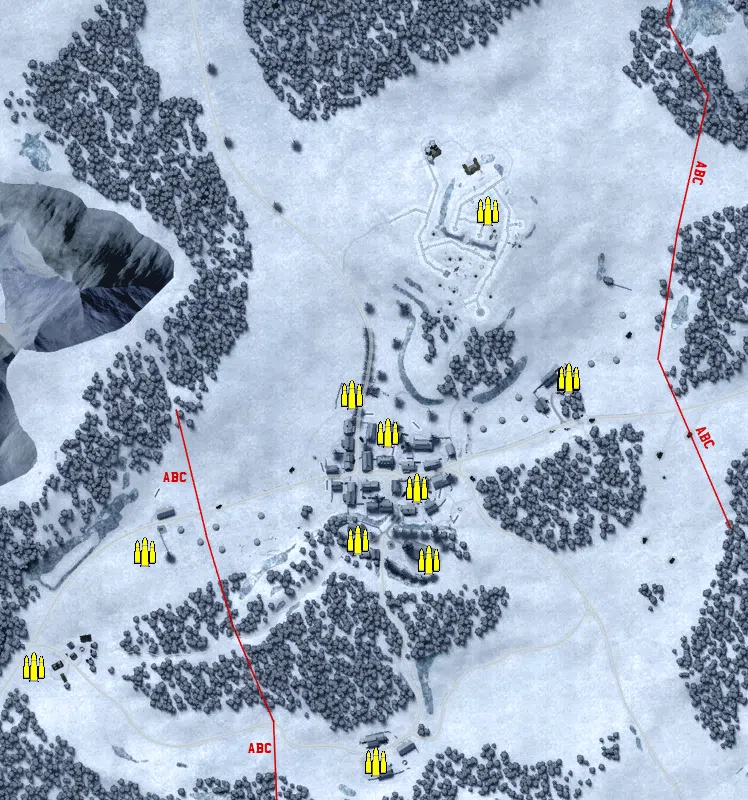
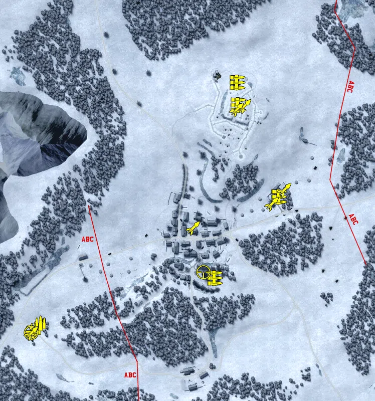
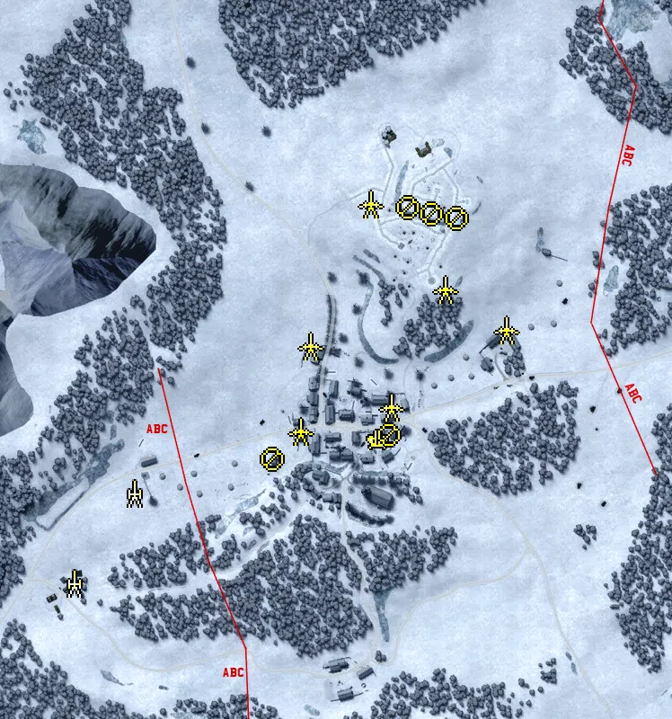
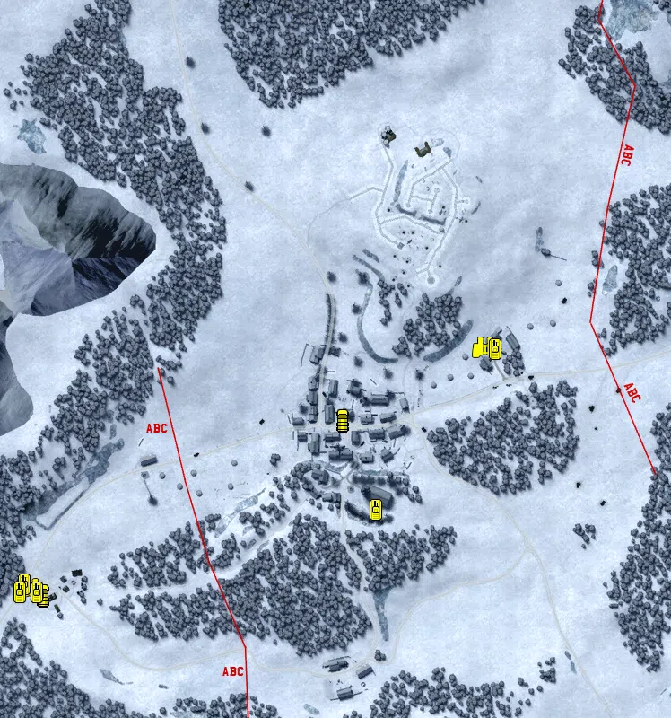

Static Ammo Crate

Pickup Kit

Static Emplacement

Vehicle

| gpo_subcat   | gpo_cat    | gpo_name                    |    pos_x |   pos_y |    pos_z |   flag | is_locked   |   team | instance                                        | gpo_cat_disp       | gpo_subcat_disp   |
|:-------------|:-----------|:----------------------------|---------:|--------:|---------:|-------:|:------------|-------:|:------------------------------------------------|:-------------------|:------------------|
| ammo_crate   | ammo_crate | ammo_crate                  |   -5.763 |  68.072 | -111.943 |      0 | False       |      0 | ammo_crate_0                                    | Static Ammo Crate  | Static Ammo Crate |
| ammo_crate   | ammo_crate | ammo_crate                  |    6.387 |  73.35  | -183.876 |      0 | False       |      0 | ammo_crate_1                                    | Static Ammo Crate  | Static Ammo Crate |
| ammo_crate   | ammo_crate | ammo_crate                  |  -65.157 |  75.462 | -164.018 |      0 | False       |      0 | ammo_crate_2                                    | Static Ammo Crate  | Static Ammo Crate |
| ammo_crate   | ammo_crate | ammo_crate                  |  -34.855 |  68.078 |  -56.629 |      0 | False       |      0 | ammo_crate_3                                    | Static Ammo Crate  | Static Ammo Crate |
| ammo_crate   | ammo_crate | ammo_crate                  |  -71.23  |  71.126 |  -18.896 |      0 | False       |      0 | ammo_crate_4                                    | Static Ammo Crate  | Static Ammo Crate |
| ammo_crate   | ammo_crate | ammo_crate                  |  146.372 |  65.009 |   -3.062 |      0 | False       |      0 | ammo_crate_5                                    | Static Ammo Crate  | Static Ammo Crate |
| ammo_crate   | ammo_crate | ammo_crate                  |  145.366 |  65.005 |   -3.017 |      0 | False       |      0 | ammo_crate_6                                    | Static Ammo Crate  | Static Ammo Crate |
| ammo_crate   | ammo_crate | ammo_crate                  |  145.633 |  65.001 |   -2.004 |      0 | False       |      0 | ammo_crate_7                                    | Static Ammo Crate  | Static Ammo Crate |
| ammo_crate   | ammo_crate | ammo_crate                  | -389.059 |  70.015 | -291.311 |      0 | False       |      0 | ammo_crate_8                                    | Static Ammo Crate  | Static Ammo Crate |
| ammo_crate   | ammo_crate | ammo_crate                  |   64.552 |  92.574 |  165.491 |      0 | False       |      0 | ammo_crate_9                                    | Static Ammo Crate  | Static Ammo Crate |
| ammo_crate   | ammo_crate | ammo_crate                  |  -47.226 |  75.053 | -386.152 |      0 | False       |      0 | ammo_crate_10                                   | Static Ammo Crate  | Static Ammo Crate |
| ammo_crate   | ammo_crate | ammo_crate                  | -277.533 |  75.848 | -175.762 |      0 | False       |      0 | ammo_crate_11                                   | Static Ammo Crate  | Static Ammo Crate |
| ammo         | kit        | UW_PickUpAmmokit            | -352.389 |  70.14  | -279.889 |      2 | False       |      0 | CQ_32_EPPEL_Allied_main_DE_US_Ammo              | Pickup Kit         | Ammo Kit          |
| ammo         | kit        | UW_PickUpAmmokit            | -342.026 |  70.14  | -269.418 |      2 | False       |      0 | CQ_32_EPPEL_Allied_main_DE_US_Ammo_0            | Pickup Kit         | Ammo Kit          |
| assault      | kit        | UW_PickUpAssaultM3Greasegun | -362.019 |  70.99  | -286.806 |      2 | False       |      0 | CQ_32_EPPEL_Allied_main_DE_US_AssaultGrease     | Pickup Kit         | Assault Kit       |
| mg           | kit        | UW_PickUpSupportM1918BAR    |   50.579 |  86.066 |  210.876 |      5 | False       |      0 | CQ_32_EPPEL_Hill_support                        | Pickup Kit         | MG Kit            |
| mg           | kit        | UW_PickUpSupportM1918BAR    |  134.35  |  66.621 |  -16.911 |      8 | False       |      0 | CQ_32_EPPEL_East_Farm_support                   | Pickup Kit         | MG Kit            |
| mg           | kit        | UW_PickUpSupportM1919a6     |    6.086 |  74.562 | -178.811 |      3 | False       |      0 | CQ_32_EPPEL_Eppeldorf_South_m1919A6             | Pickup Kit         | MG Kit            |
| mg           | kit        | UW_PickUpSupportM1919a6     |   52.934 |  94.355 |  166.052 |      5 | False       |      0 | CQ_32_EPPEL_Hill_M1919A6                        | Pickup Kit         | MG Kit            |
| sniper       | kit        | UW_PickUpSniperSpringfield  |  -17.155 |  87.03  | -167.126 |      3 | False       |      0 | CQ_32_EPPEL_Eppeldorf_South_sniper              | Pickup Kit         | Sniper Kit        |
| sniper       | kit        | UW_PickUpSniperSpringfield  | -361.393 |  70.983 | -287.698 |      2 | False       |      0 | CQ_32_EPPEL_Allied_main_DE_US_Sniper            | Pickup Kit         | Sniper Kit        |
| zooka        | kit        | UW_PickUpBazookam9          |  -38.337 |  68.79  |  -78.726 |      4 | False       |      0 | CQ_32_EPPEL_Eppeldorf_North_DE_US_AntitankFaust | Pickup Kit         | HEAT Thrower      |
| zooka        | kit        | UW_PickUpBazookam9          | -360.749 |  70.96  | -288.998 |      2 | False       |      0 | CQ_32_EPPEL_Allied_main_DE_US_Antitank          | Pickup Kit         | HEAT Thrower      |
| zooka        | kit        | UW_PickUpBazookam9          |   63.657 |  92.401 |  164.108 |      5 | False       |      0 | CQ_32_EPPEL_Hill_zook_kit                       | Pickup Kit         | HEAT Thrower      |
| zooka        | kit        | UW_PickUpBazookam9          |  119.227 |  70.124 |  -31.007 |      8 | False       |      0 | CQ_32_EPPEL_East_Farm_allies_ATKIT              | Pickup Kit         | HEAT Thrower      |
| zooka        | kit        | GW_PickUpPanzerfaust30m     |  144.427 |  65.009 |   -3.349 |      8 | False       |      0 | CQ_32_EPPEL_East_Farm_AXIS_ATKIT                | Pickup Kit         | HEAT Thrower      |
| zooka        | kit        | GW_PickUpPanzerschreck      |   49.027 |  94.358 |  156.888 |      5 | False       |      0 | CQ_32_EPPEL_Hill_AXIS_SCHRECK                   | Pickup Kit         | HEAT Thrower      |
| arty         | static     | 81mm_mortar_m1              | -341.348 |  70.14  | -272.903 |      2 | False       |      0 | CQ_32_EPPEL_Allied_main_mortar                  | Static Emplacement | Artillery         |
| arty         | static     | m2a1_howitzer_105mm_win     | -273.788 |  75.913 | -173.382 |      2 | False       |      0 | CQ_32_EPPEL_Allied_main_arty                    | Static Emplacement | Artillery         |
| flak         | static     | sd_ah_51_flak38             |   -2.444 |  68.073 | -112.588 |      4 | False       |      0 | CQ_32_EPPEL_Eppeldorf_North_flak                | Static Emplacement | Anti-aircraft Gun |
| mg_nest      | static     | mg42_bipod                  | -119.572 |  71.55  | -135.255 |      3 | False       |      0 | CQ_32_EPPEL_Eppeldorf_South_mg42                | Static Emplacement | Static MG         |
| mg_nest      | static     | mg42_bipod                  |   85.481 |  92.801 |  132.703 |      5 | False       |      0 | CQ_32_EPPEL_Hill_mg                             | Static Emplacement | Static MG         |
| mg_nest      | static     | mg42_bipod                  |   56.52  |  94.378 |  138.398 |      5 | False       |      0 | CQ_32_EPPEL_Hill_mg_0                           | Static Emplacement | Static MG         |
| mg_nest      | static     | m1919a6_emplaced            |   10.254 |  72.029 | -107.938 |      4 | False       |      0 | CQ_32_EPPEL_Eppeldorf_North_mg                  | Static Emplacement | Static MG         |
| mg_nest      | static     | m1919a6_emplaced            |   31.309 |  94.525 |  145.452 |      5 | False       |      0 | CQ_32_EPPEL_Hill_mg_1                           | Static Emplacement | Static MG         |
| pak          | static     | 76mm_m5_atgun_win           |   12.41  |  67.937 |  -77.462 |      4 | False       |      0 | CQ_32_EPPEL_Eppeldorf_North_AT                  | Static Emplacement | Anti-tank Gun     |
| pak          | static     | pak40_static_win            |  -89.276 |  68.558 | -103.825 |      4 | False       |      0 | CQ_32_EPPEL_Eppeldorf_North_AT2                 | Static Emplacement | Anti-tank Gun     |
| pak          | static     | 76mm_m5_atgun_win           |  139.739 |  64.575 |    9.071 |      8 | False       |      0 | CQ_32_EPPEL_East_Farm_AT                        | Static Emplacement | Anti-tank Gun     |
| pak          | static     | 76mm_M5_ATgun_Static_win    |  -77.961 |  68.654 |   -9.211 |      4 | False       |      0 | CQ_32_EPPEL_Eppeldorf_North_AT_0                | Static Emplacement | Anti-tank Gun     |
| pak          | static     | 76mm_M5_ATgun_Static_win    |   71.989 |  86.595 |   53.854 |      5 | False       |      0 | CQ_32_EPPEL_Hill_ATGUN                          | Static Emplacement | Anti-tank Gun     |
| pak          | static     | pak40_win                   |  -11.295 |  87.647 |  148.742 |      5 | False       |      0 | CQ_32_EPPEL_Hill_pak                            | Static Emplacement | Anti-tank Gun     |
| car          | vehicle    | willysmb_us_snow_alt        |  -40.767 |  68     |  -92.313 |      4 | False       |      0 | CQ_32_EPPEL_Eppeldorf_North_willymb             | Vehicle            | Car               |
| car          | vehicle    | willysmb_us_snow_alt        | -375.16  |  70.14  | -287.469 |      2 | False       |      0 | CQ_32_EPPEL_Allied_main_willy                   | Vehicle            | Car               |
| recon        | vehicle    | sdkfz222_win                |  118.057 |  65.767 |  -11.254 |      8 | True        |      0 | CQ_32_EPPEL_East_Farm_222                       | Vehicle            | Scout Vehicle     |
| recon        | vehicle    | m8_greyhound_win            | -389.183 |  70.587 | -279.681 |      2 | True        |      0 | CQ_32_EPPEL_Allied_main_Msomething              | Vehicle            | Scout Vehicle     |
| tank         | vehicle    | panther_g_win               |  128.638 |  65.211 |  -12.913 |      8 | True        |      0 | CQ_32_EPPEL_East_Farm_panther                   | Vehicle            | Tank              |
| tank         | vehicle    | jagdpanzeriv_win            |   -3.522 |  73.18  | -192.341 |      3 | True        |      0 | CQ_32_EPPEL_Eppeldorf_South_jagdpz              | Vehicle            | Tank              |
| tank         | vehicle    | m4a3_win                    | -395.876 |  70.663 | -275.217 |      2 | True        |      0 | CQ_32_EPPEL_Allied_main_fa                      | Vehicle            | Tank              |
| tank         | vehicle    | m3a1_win                    | -401.116 |  71.213 | -284.423 |      2 | False       |      0 | CQ_32_EPPEL_Allied_main_apc                     | Vehicle            | Tank              |
| tank         | vehicle    | m3a1_win                    | -382.378 |  70.155 | -284.45  |      2 | False       |      0 | CQ_32_EPPEL_Allied_main_apc2                    | Vehicle            | Tank              |

