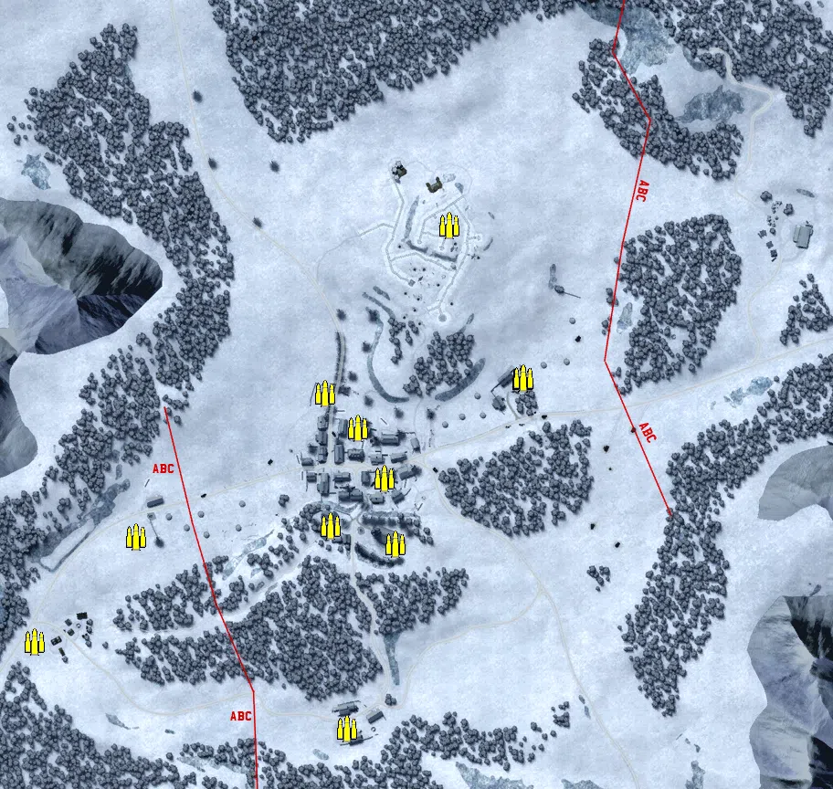
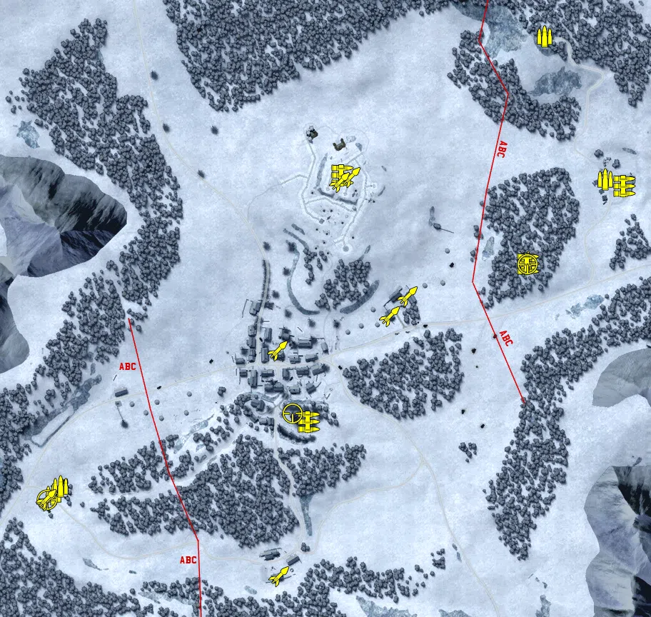
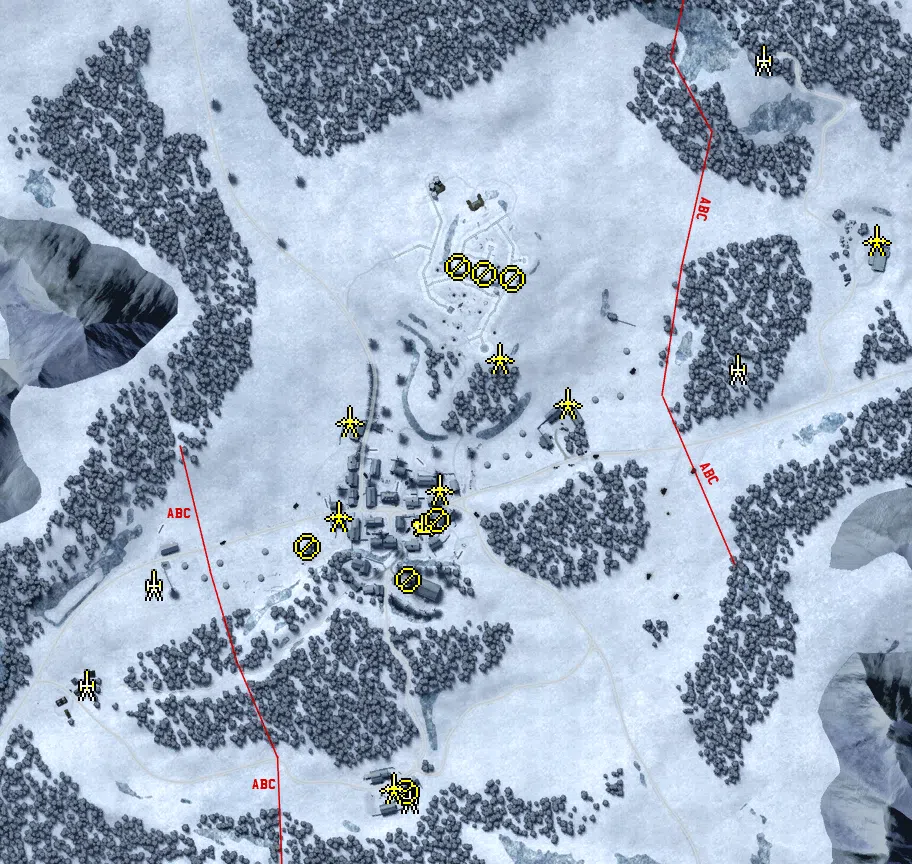
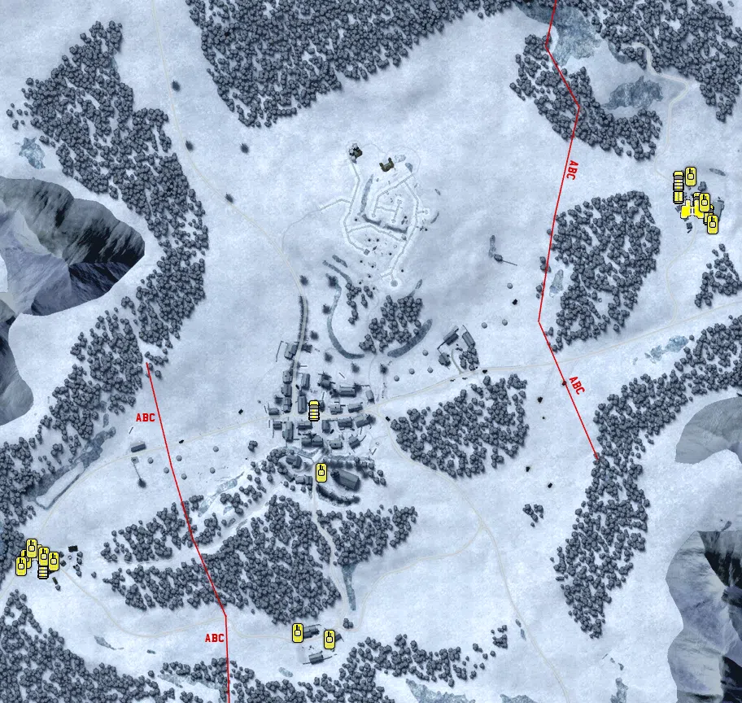

Static Ammo Crate

Pickup Kit

Static Emplacement

Vehicle

| gpo_subcat   | gpo_cat    | gpo_name                   |    pos_x |   pos_y |    pos_z |   flag | is_locked   |   team | instance                                        | gpo_cat_disp       | gpo_subcat_disp   |
|:-------------|:-----------|:---------------------------|---------:|--------:|---------:|-------:|:------------|-------:|:------------------------------------------------|:-------------------|:------------------|
| ammo_crate   | ammo_crate | ammo_crate                 |   -5.763 |  68.072 | -111.943 |      0 | False       |      0 | ammo_crate_0                                    | Static Ammo Crate  | Static Ammo Crate |
| ammo_crate   | ammo_crate | ammo_crate                 |    6.387 |  73.35  | -183.876 |      0 | False       |      0 | ammo_crate_1                                    | Static Ammo Crate  | Static Ammo Crate |
| ammo_crate   | ammo_crate | ammo_crate                 |  -65.157 |  75.462 | -164.018 |      0 | False       |      0 | ammo_crate_2                                    | Static Ammo Crate  | Static Ammo Crate |
| ammo_crate   | ammo_crate | ammo_crate                 |  -34.855 |  68.078 |  -56.629 |      0 | False       |      0 | ammo_crate_3                                    | Static Ammo Crate  | Static Ammo Crate |
| ammo_crate   | ammo_crate | ammo_crate                 |  -71.23  |  71.126 |  -18.896 |      0 | False       |      0 | ammo_crate_4                                    | Static Ammo Crate  | Static Ammo Crate |
| ammo_crate   | ammo_crate | ammo_crate                 |  146.372 |  65.009 |   -3.062 |      0 | False       |      0 | ammo_crate_5                                    | Static Ammo Crate  | Static Ammo Crate |
| ammo_crate   | ammo_crate | ammo_crate                 |  145.366 |  65.005 |   -3.017 |      0 | False       |      0 | ammo_crate_6                                    | Static Ammo Crate  | Static Ammo Crate |
| ammo_crate   | ammo_crate | ammo_crate                 |  145.633 |  65.001 |   -2.004 |      0 | False       |      0 | ammo_crate_7                                    | Static Ammo Crate  | Static Ammo Crate |
| ammo_crate   | ammo_crate | ammo_crate                 | -389.059 |  70.015 | -291.311 |      0 | False       |      0 | ammo_crate_8                                    | Static Ammo Crate  | Static Ammo Crate |
| ammo_crate   | ammo_crate | ammo_crate                 |   64.552 |  92.574 |  165.491 |      0 | False       |      0 | ammo_crate_9                                    | Static Ammo Crate  | Static Ammo Crate |
| ammo_crate   | ammo_crate | ammo_crate                 |  -47.226 |  75.053 | -386.152 |      0 | False       |      0 | ammo_crate_10                                   | Static Ammo Crate  | Static Ammo Crate |
| ammo_crate   | ammo_crate | ammo_crate                 | -277.533 |  75.848 | -175.762 |      0 | False       |      0 | ammo_crate_11                                   | Static Ammo Crate  | Static Ammo Crate |
| ammo         | kit        | UW_PickUpAmmokit           | -352.389 |  70.14  | -279.889 |      2 | False       |      0 | CQ_64_EPPEL_Allied_main_DE_US_Ammo              | Pickup Kit         | Ammo Kit          |
| ammo         | kit        | GW_PickUpAmmokit           |  336.077 | 104.755 |  360.904 |      1 | False       |      0 | CQ_64_EPPEL_Axis_main_DE_US_Ammo                | Pickup Kit         | Ammo Kit          |
| ammo         | kit        | GW_PickUpAmmokit           |  420.503 |  69.935 |  160.747 |      1 | False       |      0 | CQ_64_EPPEL_Axis_main_DE_US_Ammo_0              | Pickup Kit         | Ammo Kit          |
| ammo         | kit        | UW_PickUpAmmokit           | -342.026 |  70.14  | -269.418 |      2 | False       |      0 | CQ_64_EPPEL_Allied_main_DE_US_Ammo_0            | Pickup Kit         | Ammo Kit          |
| ammo         | kit        | GW_PickUpAmmokit           |  312.814 |  83.902 |   44.636 |      1 | False       |      0 | CQ_64_EPPEL_Axis_main_ammo                      | Pickup Kit         | Ammo Kit          |
| mg           | kit        | GW_PickUpSupportMG42       |  312.681 |  83.809 |   42.022 |      1 | False       |      0 | CQ_64_EPPEL_Axis_main_DE_US_SupportMG42         | Pickup Kit         | MG Kit            |
| mg           | kit        | GW_PickUpSupportMG42       |  448.056 |  71.028 |  151.255 |      1 | False       |      0 | CQ_64_EPPEL_Axis_main_DE_US_SupportMG42_0       | Pickup Kit         | MG Kit            |
| mg           | kit        | UW_PickUpSupportM1919a6    |    6.086 |  74.562 | -178.811 |      3 | False       |      0 | CQ_64_EPPEL_Eppeldorf_South_m1919A6             | Pickup Kit         | MG Kit            |
| mg           | kit        | UW_PickUpSupportM1919a6    |   52.934 |  94.355 |  166.052 |      5 | False       |      0 | CQ_64_EPPEL_Hill_M1919A6                        | Pickup Kit         | MG Kit            |
| sniper       | kit        | UW_PickUpSniperSpringfield |  -17.155 |  87.03  | -167.126 |      3 | False       |      0 | CQ_64_EPPEL_Eppeldorf_South_sniper              | Pickup Kit         | Sniper Kit        |
| sniper       | kit        | GW_PickUpSniperg43_ZF      |  311.97  |  84.622 |   41.968 |      1 | False       |      0 | CQ_64_EPPEL_Axis_main_DE_US_Sniper              | Pickup Kit         | Sniper Kit        |
| sniper       | kit        | UW_PickUpSniperSpringfield | -361.393 |  70.983 | -287.698 |      2 | False       |      0 | CQ_64_EPPEL_Allied_main_DE_US_Sniper            | Pickup Kit         | Sniper Kit        |
| zooka        | kit        | UW_PickUpBazookam9         |  -38.337 |  68.79  |  -78.726 |      4 | False       |      0 | CQ_64_EPPEL_Eppeldorf_North_DE_US_AntitankFaust | Pickup Kit         | HEAT Thrower      |
| zooka        | kit        | UW_PickUpBazookam9         | -360.749 |  70.96  | -288.998 |      2 | False       |      0 | CQ_64_EPPEL_Allied_main_DE_US_Antitank          | Pickup Kit         | HEAT Thrower      |
| zooka        | kit        | UW_PickUpBazookaM9         | -362.019 |  70.965 | -286.806 |      2 | False       |      0 | CQ_64_EPPEL_Allied_main_DE_US_AssaultGrease     | Pickup Kit         | HEAT Thrower      |
| zooka        | kit        | UW_PickUpBazookam9         |   63.657 |  92.401 |  164.108 |      5 | False       |      0 | CQ_64_EPPEL_Hill_zook_kit                       | Pickup Kit         | HEAT Thrower      |
| zooka        | kit        | UW_PickUpBazookam9         |  -35.713 |  75.155 | -394.95  |      6 | False       |      0 | CQ_64_EPPEL_South_Farm_ATKIT                    | Pickup Kit         | HEAT Thrower      |
| zooka        | kit        | UW_PickUpBazookam9         |  119.227 |  70.124 |  -31.007 |      8 | False       |      0 | CQ_64_EPPEL_East_Farm_allies_ATKIT              | Pickup Kit         | HEAT Thrower      |
| zooka        | kit        | GW_PickUpPanzerfaust30m    |  144.427 |  65.009 |   -3.349 |      8 | False       |      0 | CQ_64_EPPEL_East_Farm_AXIS_ATKIT                | Pickup Kit         | HEAT Thrower      |
| zooka        | kit        | GW_PickUpPanzerschreck     |   49.027 |  94.358 |  156.888 |      5 | False       |      0 | CQ_64_EPPEL_Hill_AXIS_SCHRECK                   | Pickup Kit         | HEAT Thrower      |
| misc         | noidea     | gercommradio               |  335.213 | 104.067 |  359.618 |      1 | False       |      0 | CQ_64_EPPEL_Axis_main_comm                      | FIXME UNASSIGNED   | MISCELLANEOUS     |
| arty         | static     | 81mm_mortar_m1             | -341.348 |  70.14  | -272.903 |      2 | False       |      0 | CQ_64_EPPEL_Allied_main_mortar                  | Static Emplacement | Artillery         |
| arty         | static     | m2a1_howitzer_105mm_win    | -273.788 |  75.913 | -173.382 |      2 | False       |      0 | CQ_64_EPPEL_Allied_main_arty                    | Static Emplacement | Artillery         |
| arty         | static     | nebelwerfer_win            |  336.076 | 104.515 |  351.937 |      5 | False       |      0 | CQ_64_EPPEL_Axis_main_nebel                     | Static Emplacement | Artillery         |
| arty         | static     | 81mm_mortar_m1             |  -18.346 |  75.107 | -386.476 |      6 | False       |      0 | CQ_64_EPPEL_South_Farm_mortar                   | Static Emplacement | Artillery         |
| arty         | static     | sgwr34_france              |  310.498 |  83.932 |   43.375 |      1 | False       |      0 | CQ_64_EPPEL_Axis_main_mortar                    | Static Emplacement | Artillery         |
| flak         | static     | sd_ah_51_flak38            |   -2.444 |  68.073 | -112.588 |      4 | False       |      0 | CQ_64_EPPEL_Eppeldorf_North_flak                | Static Emplacement | Anti-aircraft Gun |
| mg_nest      | static     | m1919a6_emplaced           |  -19.254 |  87.967 | -168.064 |      3 | False       |      0 | CQ_64_EPPEL_Eppeldorf_South_30cal_0             | Static Emplacement | Static MG         |
| mg_nest      | static     | mg42_bipod                 | -119.572 |  71.55  | -135.255 |      3 | False       |      0 | CQ_64_EPPEL_Eppeldorf_South_mg42                | Static Emplacement | Static MG         |
| mg_nest      | static     | mg42_bipod                 |   85.481 |  92.801 |  132.703 |      5 | False       |      0 | CQ_64_EPPEL_Hill_mg                             | Static Emplacement | Static MG         |
| mg_nest      | static     | mg42_bipod                 |   56.52  |  94.378 |  138.398 |      5 | False       |      0 | CQ_64_EPPEL_Hill_mg_0                           | Static Emplacement | Static MG         |
| mg_nest      | static     | mg42_bipod                 |  -20.939 |  75.848 | -379.752 |      6 | False       |      0 | CQ_64_EPPEL_South_Farm_mg                       | Static Emplacement | Static MG         |
| mg_nest      | static     | m1919a6_emplaced           |   10.254 |  72.029 | -107.938 |      4 | False       |      0 | CQ_64_EPPEL_Eppeldorf_North_mg                  | Static Emplacement | Static MG         |
| mg_nest      | static     | m1919a6_emplaced           |   31.309 |  94.525 |  145.452 |      5 | False       |      0 | CQ_64_EPPEL_Hill_mg_1                           | Static Emplacement | Static MG         |
| pak          | static     | 76mm_m5_atgun_win          |   12.41  |  67.937 |  -77.462 |      4 | False       |      0 | CQ_64_EPPEL_Eppeldorf_North_AT                  | Static Emplacement | Anti-tank Gun     |
| pak          | static     | pak40_static_win           |  -89.276 |  68.558 | -103.825 |      4 | False       |      0 | CQ_64_EPPEL_Eppeldorf_North_AT2                 | Static Emplacement | Anti-tank Gun     |
| pak          | static     | 76mm_m5_atgun_win          |  139.739 |  64.575 |    9.071 |      8 | False       |      0 | CQ_64_EPPEL_East_Farm_AT                        | Static Emplacement | Anti-tank Gun     |
| pak          | static     | 76mm_M5_ATgun_Static_win   |  -77.961 |  68.654 |   -9.211 |      4 | False       |      0 | CQ_64_EPPEL_Eppeldorf_North_AT_0                | Static Emplacement | Anti-tank Gun     |
| pak          | static     | 76mm_m5_atgun_win          |  -34.171 |  75.789 | -376.452 |      6 | False       |      0 | CQ_64_EPPEL_South_Farm_pak                      | Static Emplacement | Anti-tank Gun     |
| pak          | static     | 76mm_M5_ATgun_Static_win   |   71.989 |  86.595 |   53.854 |      5 | False       |      0 | CQ_64_EPPEL_Hill_ATGUN                          | Static Emplacement | Anti-tank Gun     |
| pak          | static     | pak40_win                  |  449.087 |  70.62  |  171.513 |      1 | False       |      0 | CQ_64_EPPEL_Axis_main_at                        | Static Emplacement | Anti-tank Gun     |
| apc          | vehicle    | sdkfz251_d_win             |  431.134 |  71.259 |  164.493 |      1 | False       |      0 | CQ_64_EPPEL_Axis_main_apc                       | Vehicle            | APC               |
| apc          | vehicle    | sdkfz251_d_win             |  443.955 |  71.148 |  148.681 |      1 | False       |      0 | CQ_64_EPPEL_Axis_main_apc2                      | Vehicle            | APC               |
| apc          | vehicle    | sdkfz251_d_win             |  406.596 |  70.508 |  175.306 |      1 | False       |      0 | CQ_64_EPPEL_Axis_main_251                       | Vehicle            | APC               |
| car          | vehicle    | willysmb_us_snow_alt       |  -40.767 |  68     |  -92.313 |      4 | False       |      0 | CQ_64_EPPEL_Eppeldorf_North_willymb             | Vehicle            | Car               |
| car          | vehicle    | kubelwagen_win_alt         |  407.258 |  69.659 |  189.834 |      1 | False       |      0 | CQ_64_EPPEL_Axis_main_jeep_0                    | Vehicle            | Car               |
| car          | vehicle    | willysmb_us_snow_alt       | -373.925 |  70.681 | -285.593 |      2 | False       |      0 | CQ_64_EPPEL_Allied_main_willy                   | Vehicle            | Car               |
| recon        | vehicle    | sdkfz222_win               |  423.826 |  69.935 |  155.341 |      1 | True        |      0 | CQ_64_EPPEL_Axis_main_222                       | Vehicle            | Scout Vehicle     |
| recon        | vehicle    | m8_greyhound_win           | -384.139 |  71.598 | -269.276 |      2 | True        |      0 | CQ_64_EPPEL_Allied_main_Msomething              | Vehicle            | Scout Vehicle     |
| tank         | vehicle    | panther_g_win              |  421.564 |  70.912 |  195.093 |      1 | True        |      0 | CQ_64_EPPEL_Axis_main_Panther                   | Vehicle            | Tank              |
| tank         | vehicle    | jagdpanzeriv_win           |  438.578 |  70.402 |  163.039 |      1 | True        |      0 | CQ_64_EPPEL_Axis_main_jagd                      | Vehicle            | Tank              |
| tank         | vehicle    | m4a3_76_win                | -373.302 |  70.268 | -271.599 |      2 | True        |      0 | CQ_64_EPPEL_Allied_main_m4a3_2                  | Vehicle            | Tank              |
| tank         | vehicle    | m4a3_win                   | -395.467 |  71.638 | -274.58  |      2 | True        |      0 | CQ_64_EPPEL_Allied_main_fa                      | Vehicle            | Tank              |
| tank         | vehicle    | kingtiger_1944winter       |  448.676 |  71.301 |  135.913 |      1 | True        |      0 | CQ_64_EPPEL_Axis_main_kt                        | Vehicle            | Tank              |
| tank         | vehicle    | m51_win                    |  -31.674 |  72.751 | -168.815 |      3 | False       |      0 | CQ_64_EPPEL_Eppeldorf_South_m51                 | Vehicle            | Tank              |
| tank         | vehicle    | m4a3_76_win                | -388.438 |  72.447 | -261.882 |      2 | True        |      0 | CQ_64_EPPEL_Allied_main_76w                     | Vehicle            | Tank              |
| tank         | vehicle    | m3a1_win                   | -401.116 |  71.213 | -284.423 |      2 | False       |      0 | CQ_64_EPPEL_Allied_main_apc                     | Vehicle            | Tank              |
| tank         | vehicle    | m3a1_win                   | -361.484 |  71.242 | -278.316 |      2 | False       |      0 | CQ_64_EPPEL_Allied_main_apc2                    | Vehicle            | Tank              |
| tank         | vehicle    | m3a1_win                   |  -60.773 |  75.055 | -365.646 |      6 | False       |      0 | CQ_64_EPPEL_South_Farm_halftrack                | Vehicle            | Tank              |
| tank         | vehicle    | m36_win                    |  -22.128 |  76.023 | -373.846 |      6 | True        |      0 | CQ_64_EPPEL_South_Farm_sherman                  | Vehicle            | Tank              |

