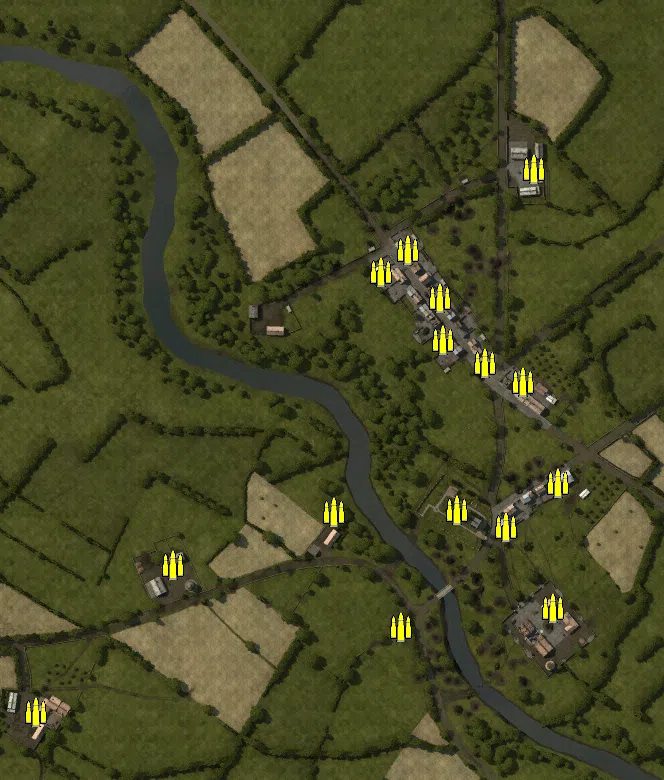
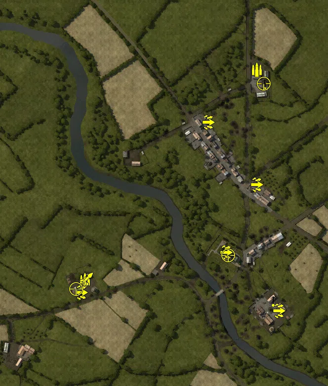
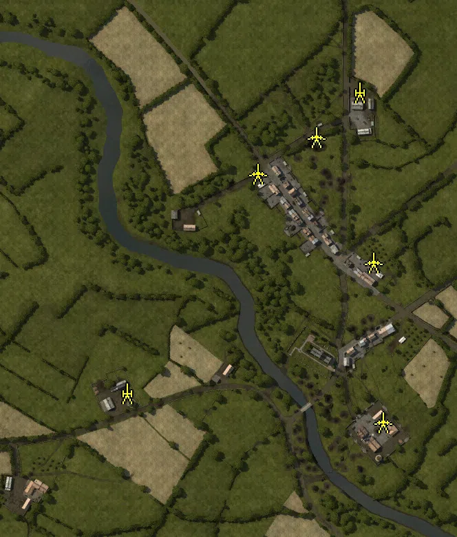
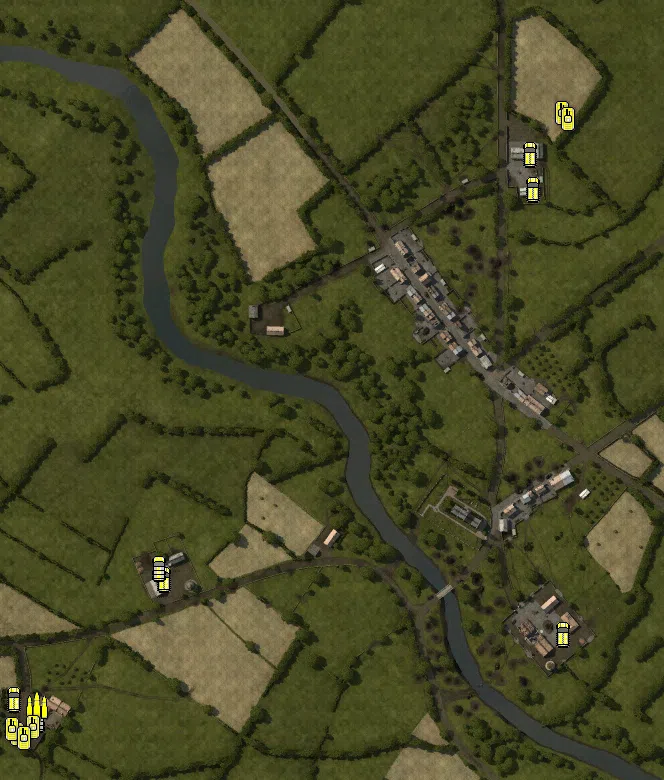

Static Ammo Crate

Pickup Kit

Static Emplacement

Vehicle

| gpo_subcat   | gpo_cat    | gpo_name                     |    pos_x |   pos_y |    pos_z |   flag | is_locked   |   team | instance                                      | gpo_cat_disp       | gpo_subcat_disp   |
|:-------------|:-----------|:-----------------------------|---------:|--------:|---------:|-------:|:------------|-------:|:----------------------------------------------|:-------------------|:------------------|
| ammo_crate   | ammo_crate | ammo_crate                   |   25.491 |   6.838 |  100.232 |      0 | False       |      0 | ammo_crate_0                                  | Static Ammo Crate  | Static Ammo Crate |
| ammo_crate   | ammo_crate | ammo_crate                   |  143.272 |  10.278 |  -84.602 |      0 | False       |      0 | ammo_crate_1                                  | Static Ammo Crate  | Static Ammo Crate |
| ammo_crate   | ammo_crate | ammo_crate                   |   28.476 |   6.814 |   57.89  |      0 | False       |      0 | ammo_crate_2                                  | Static Ammo Crate  | Static Ammo Crate |
| ammo_crate   | ammo_crate | ammo_crate                   |  -33.535 |   6.69  |  126.494 |      0 | False       |      0 | ammo_crate_3                                  | Static Ammo Crate  | Static Ammo Crate |
| ammo_crate   | ammo_crate | ammo_crate                   |  108.063 |   7.855 |   15.763 |      0 | False       |      0 | ammo_crate_4                                  | Static Ammo Crate  | Static Ammo Crate |
| ammo_crate   | ammo_crate | ammo_crate                   |   -7.494 |   7.469 |  148.057 |      0 | False       |      0 | ammo_crate_5                                  | Static Ammo Crate  | Static Ammo Crate |
| ammo_crate   | ammo_crate | ammo_crate                   |   70.235 |   7.809 |   35.25  |      0 | False       |      0 | ammo_crate_6                                  | Static Ammo Crate  | Static Ammo Crate |
| ammo_crate   | ammo_crate | ammo_crate                   |   90.629 |  13.633 | -129.434 |      0 | False       |      0 | ammo_crate_7                                  | Static Ammo Crate  | Static Ammo Crate |
| ammo_crate   | ammo_crate | ammo_crate                   |   41.806 |   9.938 | -112.455 |      0 | False       |      0 | ammo_crate_8                                  | Static Ammo Crate  | Static Ammo Crate |
| ammo_crate   | ammo_crate | ammo_crate                   |  137.525 |  10.615 | -209.969 |      0 | False       |      0 | ammo_crate_9                                  | Static Ammo Crate  | Static Ammo Crate |
| ammo_crate   | ammo_crate | ammo_crate                   |  118.735 |   5.286 |  229.055 |      0 | False       |      0 | ammo_crate_10                                 | Static Ammo Crate  | Static Ammo Crate |
| ammo_crate   | ammo_crate | ammo_crate                   |  -14.098 |   7.518 | -229.204 |      0 | False       |      0 | ammo_crate_11                                 | Static Ammo Crate  | Static Ammo Crate |
| ammo_crate   | ammo_crate | ammo_crate                   |  -81.128 |   6.37  | -114.17  |      0 | False       |      0 | ammo_crate_12                                 | Static Ammo Crate  | Static Ammo Crate |
| ammo_crate   | ammo_crate | ammo_crate                   | -242.37  |   7.359 | -167.129 |      0 | False       |      0 | ammo_crate_13                                 | Static Ammo Crate  | Static Ammo Crate |
| ammo_crate   | ammo_crate | ammo_crate                   | -378.894 |   5.914 | -313.722 |      0 | False       |      0 | ammo_crate_14                                 | Static Ammo Crate  | Static Ammo Crate |
| ammo         | kit        | BW_PickUpAmmokit             |  104.99  |   4.726 |  256.707 |      7 | False       |      0 | CP_64_st_lambert_mortar_battery_DE_GB_Ammo    | Pickup Kit         | Ammo Kit          |
| ammo         | kit        | GW_PickUpAmmokit             | -243.352 |   7.357 | -167.568 |      1 | False       |      0 | CP_64_st_lambert_kampfgruppe_fuchs_0_Ammo     | Pickup Kit         | Ammo Kit          |
| assault      | kit        | GW_PickUpAssaultStG44        | -252.401 |   8.786 | -193.848 |      1 | False       |      0 | CP_64_st_lambert_kampfgruppe_fuchs_0_stg      | Pickup Kit         | Assault Kit       |
| assault      | kit        | GW_PickUpAssaultStG44        | -251.385 |   8.786 | -193.304 |      1 | False       |      0 | CP_64_st_lambert_kampfgruppe_fuchs_0_stg1     | Pickup Kit         | Assault Kit       |
| assault      | kit        | GW_PickUpAssaultStG44        |    5.745 |   7.168 |  151.199 |      5 | False       |      0 | CP_64_st_lambert_st_lambert_north_stg         | Pickup Kit         | Assault Kit       |
| assault      | kit        | GW_PickUpAssaultG41          |  149.305 |  10.601 | -229.756 |      2 | False       |      0 | CP_64_st_lambert_destroyed_battery_g41        | Pickup Kit         | Assault Kit       |
| assault      | kit        | GW_PickUpAssaultG41          |   41.5   |  11.008 | -111.846 |      3 | False       |      0 | CP_64_st_lambert_st_lambert_church_g41        | Pickup Kit         | Assault Kit       |
| assault      | kit        | GW_PickUpAssaultG41          |  104.401 |   7.526 |   24.907 |      4 | False       |      0 | CP_64_st_lambert_st_lambert_south_g41         | Pickup Kit         | Assault Kit       |
| mg_dep       | kit        | BA_PickUpVickers303          |  120.716 |   5.472 |  228.624 |      7 | False       |      0 | CP_64_st_lambert_mortar_battery_MG            | Pickup Kit         | Deployable MG     |
| mg_dep       | kit        | GW_PickUpMG42Lafette         | -239.174 |   7.357 | -166.093 |      1 | False       |      0 | CP_64_st_lambert_kampfgruppe_fuchs_0_mg       | Pickup Kit         | Deployable MG     |
| mg_dep       | kit        | BA_PickUpVickers303          |  138.447 |   9.811 | -209.138 |      2 | False       |      0 | CP_64_st_lambert_destroyed_battery_mg         | Pickup Kit         | Deployable MG     |
| sniper       | kit        | BW_PickUpSniperNo4           |   46.863 |  26.743 | -118.265 |      3 | False       |      0 | CP_64_st_lambert_st_lambert_church_sniper     | Pickup Kit         | Sniper Kit        |
| sniper       | kit        | BW_PickUpSniperNo4           |  119.39  |   5.281 |  229.393 |      7 | False       |      0 | CP_64_st_lambert_mortar_battery_sniper1       | Pickup Kit         | Sniper Kit        |
| sniper       | kit        | GW_PickUpSniperg43_ZF        | -260.54  |   8.726 | -186.453 |      1 | False       |      0 | CP_64_st_lambert_kampfgruppe_fuchs_0_sniper   | Pickup Kit         | Sniper Kit        |
| zooka        | kit        | GW_PickUpPanzerschreck       | -240.022 |   8.105 | -166.462 |      1 | False       |      0 | CP_64_st_lambert_kampfgruppe_fuchs_0_pa       | Pickup Kit         | HEAT Thrower      |
| arty         | static     | 3inchmortar                  |  106.948 |   4.661 |  263.702 |      7 | False       |      0 | CP_64_st_lambert_mortar_battery_mortar        | Static Emplacement | Artillery         |
| arty         | static     | sgwr34_france                | -230.957 |   7.426 | -172.732 |      1 | False       |      0 | CP_64_st_lambert_kampfgruppe_fuchs_0_mortar   | Static Emplacement | Artillery         |
| pak          | static     | 6pdr_mkiv                    |  141.337 |   9.869 | -214.645 |      2 | False       |      0 | CP_64_st_lambert_destroyed_battery_6p_0       | Static Emplacement | Anti-tank Gun     |
| pak          | static     | 6pdr_mkiv                    |  126.88  |   7.055 |   16.761 |      4 | False       |      0 | CP_64_st_lambert_st_lambert_south_p6          | Static Emplacement | Anti-tank Gun     |
| pak          | static     | 6pdr_mkiv                    |  -40.92  |   6.607 |  145.909 |      5 | False       |      0 | CP_64_st_lambert_st_lambert_north_6pdr        | Static Emplacement | Anti-tank Gun     |
| pak          | static     | 6pdr_mkiv_static             |   44.416 |   5.703 |  199.234 |      7 | False       |      0 | CP_64_st_lambert_mortar_battery_pak           | Static Emplacement | Anti-tank Gun     |
| apc          | vehicle    | universalcarrier_wasp        |  115.447 |   4.67  |  243.802 |      7 | False       |      0 | CP_64_st_lambert_mortar_battery_c             | Vehicle            | APC               |
| apc          | vehicle    | UniversalCarrier_France      |  118.463 |   5.356 |  209.006 |      7 | False       |      0 | CP_64_st_lambert_mortar_battery_br            | Vehicle            | APC               |
| apc          | vehicle    | universalcarrier_france_bren |  148.24  |   9.867 | -236.274 |      2 | False       |      0 | CP_64_st_lambert_destroyed_battery_br         | Vehicle            | APC               |
| apc          | vehicle    | sdkfz251_d                   | -401.135 |   5.832 | -300.749 |      1 | False       |      0 | CP_64_st_lambert_kampfgruppe_fuchs_0_sd_0     | Vehicle            | APC               |
| apc          | vehicle    | sdkfz251_d                   | -250.52  |   7.409 | -180.642 |      1 | False       |      0 | CP_64_st_lambert_kampfgruppe_fuchs_0_sdkfz22  | Vehicle            | APC               |
| car          | vehicle    | opelblitz_fr_slats           | -376.747 |   5.859 | -321.246 |      1 | False       |      0 | CP_64_st_lambert_kampfgruppe_fuchs_0_bli      | Vehicle            | Car               |
| car          | vehicle    | opelblitz_fr_slats           | -256.269 |   7.357 | -169.808 |      1 | False       |      0 | CP_64_st_lambert_kampfgruppe_fuchs_0_opel     | Vehicle            | Car               |
| supply       | vehicle    | opelblitz_fr_ammo            | -378.052 |   5.857 | -308.584 |      1 | False       |      0 | CP_64_st_lambert_kampfgruppe_fuchs_0_opelmun  | Vehicle            | Supply Vehicle    |
| tank         | vehicle    | stuh42                       | -397.668 |   6.053 | -335.755 |      1 | True        |      0 | CP_64_st_lambert_kampfgruppe_fuchs_0_st       | Vehicle            | Tank              |
| tank         | vehicle    | pantherg                     | -382.419 |   5.859 | -329.192 |      1 | True        |      0 | CP_64_st_lambert_kampfgruppe_fuchs_0_p4_0     | Vehicle            | Tank              |
| tank         | vehicle    | pantherg                     | -403.356 |   7.526 | -331.244 |      1 | True        |      0 | CP_64_fp_gertanks_dummy_panther               | Vehicle            | Tank              |
| tank         | vehicle    | sherman_vc_early_olive       |  147.225 |   4.863 |  284.639 |      7 | True        |      0 | CP_64_fp_cantanks_dummy_firlfly               | Vehicle            | Tank              |
| tank         | vehicle    | m4a1mid_eu_brit              |  153.337 |   5.117 |  278.884 |      7 | True        |      0 | CP_64_st_lambert_mortar_battery_m4a1          | Vehicle            | Tank              |
| tank         | vehicle    | stug40_g                     | -391.213 |   5.859 | -339.726 |      1 | True        |      0 | CP_64_st_lambert_kampfgruppe_fuchs_0_panthera | Vehicle            | Tank              |

