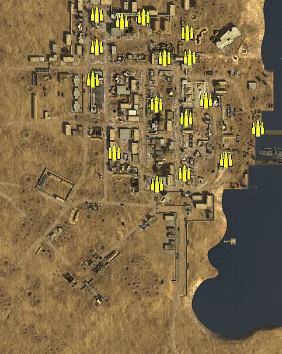
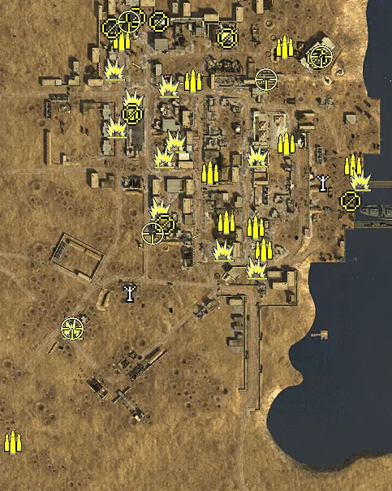
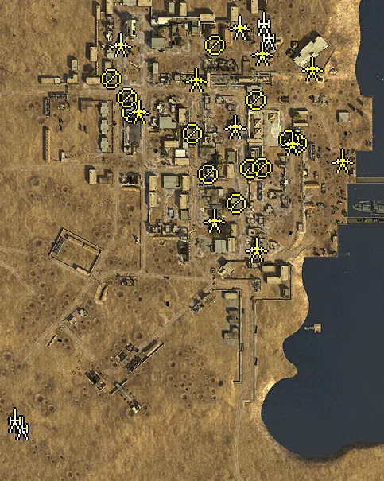
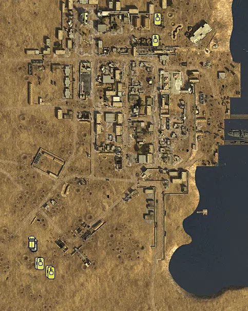

Static Ammo Crate

Pickup Kit

Static Emplacement

Vehicle

| gpo_subcat   | gpo_cat    | gpo_name                    |    pos_x |   pos_y |    pos_z |   flag | is_locked   |   team | instance                         | gpo_cat_disp       | gpo_subcat_disp   |
|:-------------|:-----------|:----------------------------|---------:|--------:|---------:|-------:|:------------|-------:|:---------------------------------|:-------------------|:------------------|
| ammo_crate   | ammo_crate | ammo_crate                  |  -16     |  20.091 |   27.081 |      0 | False       |      0 | ammo_crate_0                     | Static Ammo Crate  | Static Ammo Crate |
| ammo_crate   | ammo_crate | ammo_crate                  | -165.796 |  25.397 |  242.99  |      0 | False       |      0 | ammo_crate_1                     | Static Ammo Crate  | Static Ammo Crate |
| ammo_crate   | ammo_crate | ammo_crate                  | -173.075 |  27.105 |  187.472 |      0 | False       |      0 | ammo_crate_2                     | Static Ammo Crate  | Static Ammo Crate |
| ammo_crate   | ammo_crate | ammo_crate                  |  -85.843 |  24.084 |  294.318 |      0 | False       |      0 | ammo_crate_3                     | Static Ammo Crate  | Static Ammo Crate |
| ammo_crate   | ammo_crate | ammo_crate                  |  -10.884 |  25.111 |  266.882 |      0 | False       |      0 | ammo_crate_4                     | Static Ammo Crate  | Static Ammo Crate |
| ammo_crate   | ammo_crate | ammo_crate                  |  -49.597 |  19.121 |  224.18  |      0 | False       |      0 | ammo_crate_5                     | Static Ammo Crate  | Static Ammo Crate |
| ammo_crate   | ammo_crate | ammo_crate                  |   -6.843 |  24.776 |  224.981 |      0 | False       |      0 | ammo_crate_6                     | Static Ammo Crate  | Static Ammo Crate |
| ammo_crate   | ammo_crate | ammo_crate                  |   21.05  |  12.784 |  151.869 |      0 | False       |      0 | ammo_crate_7                     | Static Ammo Crate  | Static Ammo Crate |
| ammo_crate   | ammo_crate | ammo_crate                  |  109.983 |   8.155 |  104.494 |      0 | False       |      0 | ammo_crate_8                     | Static Ammo Crate  | Static Ammo Crate |
| ammo_crate   | ammo_crate | ammo_crate                  |   54.945 |   8.155 |   50.187 |      0 | False       |      0 | ammo_crate_9                     | Static Ammo Crate  | Static Ammo Crate |
| ammo_crate   | ammo_crate | ammo_crate                  |  -12.935 |  18.241 |  121.155 |      0 | False       |      0 | ammo_crate_10                    | Static Ammo Crate  | Static Ammo Crate |
| ammo_crate   | ammo_crate | ammo_crate                  |  -64.203 |  23.455 |  144.986 |      0 | False       |      0 | ammo_crate_11                    | Static Ammo Crate  | Static Ammo Crate |
| ammo_crate   | ammo_crate | ammo_crate                  | -135.785 |  25.05  |   62.285 |      0 | False       |      0 | ammo_crate_12                    | Static Ammo Crate  | Static Ammo Crate |
| ammo_crate   | ammo_crate | ammo_crate                  |  -62.704 |  22.642 |    8.036 |      0 | False       |      0 | ammo_crate_13                    | Static Ammo Crate  | Static Ammo Crate |
| ammo_crate   | ammo_crate | ammo_crate                  | -123.472 |  24.872 |  287.074 |      0 | False       |      0 | ammo_crate_14                    | Static Ammo Crate  | Static Ammo Crate |
| ammo_crate   | ammo_crate | ammo_crate                  | -166.326 |  26.908 |  297.852 |      0 | False       |      0 | ammo_crate_15                    | Static Ammo Crate  | Static Ammo Crate |
| ammo         | kit        | BA_PickUpAmmokit            |  102.854 |   8.155 |  119.114 |      6 | False       |      0 | 64_OS_FT_4_ammokit               | Pickup Kit         | Ammo Kit          |
| ammo         | kit        | BA_PickUpAmmokit            |   21.431 |  12.784 |  146.08  |      6 | False       |      0 | 64_OS_FT_4_ammokit_0             | Pickup Kit         | Ammo Kit          |
| ammo         | kit        | BA_PickUpAmmokit            |   -7.142 |  19.58  |   15.073 |      5 | False       |      0 | 64_OS_FT_3_ammokit               | Pickup Kit         | Ammo Kit          |
| ammo         | kit        | BA_PickUpAmmokit            |  -16.52  |  17.913 |   43.064 |      5 | False       |      0 | 64_OS_FT_3_ammokit_0             | Pickup Kit         | Ammo Kit          |
| ammo         | kit        | BA_PickUpAmmokit            |  -72.857 |  22.531 |  110.292 |      7 | False       |      0 | 64_OS_FT_5_ammokit               | Pickup Kit         | Ammo Kit          |
| ammo         | kit        | BA_PickUpAmmokit            |  -93.944 |  22.64  |  222.807 |      2 | False       |      0 | 64_OS_FT_Base2_ammokit           | Pickup Kit         | Ammo Kit          |
| ammo         | kit        | BA_PickUpAmmokit            | -170.419 |  26.516 |  187.376 |      3 | False       |      0 | 64_OS_FT_1_ammokit               | Pickup Kit         | Ammo Kit          |
| ammo         | kit        | BA_PickUpAmmokit            | -181.702 |  24.876 |  273.768 |      2 | False       |      0 | 64_OS_FT_Base2_ammokit_0         | Pickup Kit         | Ammo Kit          |
| ammo         | kit        | BA_PickUpAmmokit            |  -52.778 |  21.815 |   49.143 |      5 | False       |      0 | 64_OS_FT_3_ammokit_1             | Pickup Kit         | Ammo Kit          |
| ammo         | kit        | GA_PickUpAmmokit            | -315.587 |  23.403 | -221.789 |      1 | False       |      0 | 64_OS_FT_Base1_ammo10            | Pickup Kit         | Ammo Kit          |
| ammo         | kit        | BA_PickUpAmmokit            |   18.631 |  24.887 |  265.103 |      8 | False       |      0 | 64_OS_FT_6_britammo              | Pickup Kit         | Ammo Kit          |
| antitank     | kit        | BA_PickUpTankHunterNo4Short |  -16.01  |  21.906 |   -6.833 |      5 | False       |      0 | 64_OS_FT_3_sapperkit             | Pickup Kit         | Tankhunter Kit    |
| antitank     | kit        | BA_PickUpTankHunterNo4Short | -167.983 |  29.821 |  200.112 |      3 | False       |      0 | 64_OS_FT_1_sapper                | Pickup Kit         | Tankhunter Kit    |
| antitank     | kit        | BA_PickUpTankHunterNo4Short |  -57.483 |  23.437 |   15.058 |      5 | False       |      0 | 64_OS_FT_3_sapper5               | Pickup Kit         | Tankhunter Kit    |
| antitank     | kit        | BA_PickUpSapperNo4Short     | -116.122 |  25.564 |  149.049 |      3 | False       |      0 | 64_OS_FT_1_sapper6               | Pickup Kit         | Tankhunter Kit    |
| antitank     | kit        | BA_PickUpTankHunterNo4Short |  111.516 |   9.34  |  101.588 |      6 | False       |      0 | 64_OS_FT_4_sapper7               | Pickup Kit         | Tankhunter Kit    |
| antitank     | kit        | BA_PickUpSapperNo4Short     | -134.565 |  25.279 |   66.047 |      4 | False       |      0 | 64_OS_FT_2_satchel1              | Pickup Kit         | Tankhunter Kit    |
| antitank     | kit        | BA_PickUpSapperNo4Short     |  -52.023 |  24.154 |  281.058 |      8 | False       |      0 | 64_OS_FT_6_satchel2              | Pickup Kit         | Tankhunter Kit    |
| antitank     | kit        | BA_PickUpSapperNo4Short     | -129.877 |  23.441 |  129.512 |      3 | False       |      0 | 64_OS_FT_1_satchel3              | Pickup Kit         | Tankhunter Kit    |
| antitank     | kit        | BA_PickUpSapperNo4Short     | -190.519 |  23.431 |  238.137 |      2 | False       |      0 | 64_OS_FT_Base2_satchel4          | Pickup Kit         | Tankhunter Kit    |
| antitank     | kit        | GA_PickUpSapperMp40         | -243.355 |  22.832 |  -81.177 |      1 | False       |      0 | 64_OS_FT_Base1_gercommander1     | Pickup Kit         | Tankhunter Kit    |
| antitank     | kit        | BA_PickUpSapperTommyS       |  -15.381 |  19.261 |  131.309 |      7 | False       |      0 | 64_OS_FT_5_commando2_0           | Pickup Kit         | Tankhunter Kit    |
| antitank     | kit        | BA_PickUpSapperTommyS       | -187.582 |  25.856 |  167.045 |      3 | False       |      0 | 64_OS_FT_1_commando3             | Pickup Kit         | Tankhunter Kit    |
| antitank     | kit        | BA_PickUpSapperTommyS       | -123.582 |  31.082 |  216.756 |      2 | False       |      0 | 64_OS_FT_Base2_commando4         | Pickup Kit         | Tankhunter Kit    |
| arty_dep     | kit        | BA_PickUpMortar             |   64.74  |   8.155 |  100.175 |      6 | False       |      0 | 64_OS_FT_4_mortar                | Pickup Kit         | Deployable Arty   |
| arty_dep     | kit        | GA_PickUpMortar             | -173.229 |  27.748 |  -35.585 |      1 | False       |      0 | 64_OS_FT_Base1_germortar         | Pickup Kit         | Deployable Arty   |
| at_rifle     | kit        | BA_PickUpAntitankBoys       |  -51.597 |  26.106 |  276.23  |      8 | False       |      0 | 64_OS_FT_6_atrifle               | Pickup Kit         | AT Rifle          |
| at_rifle     | kit        | BA_PickUpAntitankBoys       | -165.406 |  26.721 |  300.974 |      2 | False       |      0 | 64_OS_FT_Base2_atgun             | Pickup Kit         | AT Rifle          |
| mg           | kit        | BA_PickUpSupportLewis       | -169.116 |  27.154 |  182.499 |      3 | False       |      0 | 64_OS_FT_1_DE_GB_Support2        | Pickup Kit         | MG Kit            |
| mg           | kit        | BA_PickUpSupportLewis       | -128.624 |  24.974 |   45.665 |      4 | False       |      0 | 64_OS_FT_2_DE_GB_Support2        | Pickup Kit         | MG Kit            |
| mg_dep       | kit        | BA_PickUpVickers303         | -135.576 |  30.717 |  295.519 |      2 | False       |      0 | 64_OS_FT_Base2_vickers           | Pickup Kit         | Deployable MG     |
| mg_dep       | kit        | BA_PickUpVickers303         | -194.28  |  28.55  |  287.965 |      2 | False       |      0 | 64_OS_FT_Base2_vickers_0         | Pickup Kit         | Deployable MG     |
| mg_dep       | kit        | BA_PickUpVickers303         |   99.77  |   9.136 |   74.665 |      6 | False       |      0 | 64_OS_FT_4_tripod                | Pickup Kit         | Deployable MG     |
| mg_dep       | kit        | BA_PickUpVickers303         |   58.533 |  27.235 |  250.559 |      8 | False       |      0 | 64_OS_FT_6_vickers3              | Pickup Kit         | Deployable MG     |
| sniper       | kit        | BA_PickUpSniperNo4          | -143.558 |  28.359 |   34.536 |      4 | False       |      0 | 64_OS_FT_2_sniperkit             | Pickup Kit         | Sniper Kit        |
| sniper       | kit        | BA_PickUpSniperNo4          | -173.394 |  40.946 |  296.021 |      2 | False       |      0 | 64_OS_FT_Base2_sniperkit         | Pickup Kit         | Sniper Kit        |
| sniper       | kit        | BA_PickUpSniperNo4          |   -3.958 |  25.499 |  225.382 |      8 | False       |      0 | 64_OS_FT_6_sniperkit             | Pickup Kit         | Sniper Kit        |
| sniper       | kit        | BA_PickUpSniperNo4          | -242.628 |  22.835 |  -81.594 |      1 | False       |      0 | 64_OS_FT_Base1_sniperkit         | Pickup Kit         | Sniper Kit        |
| sniper       | kit        | BA_PickUpSniperNo4          |   63.547 |  28.252 |  252.602 |      8 | False       |      0 | 64_OS_FT_6_sniper9               | Pickup Kit         | Sniper Kit        |
| noidea       | noidea     | commander_mortar_allied     |  157.264 |  24.872 |  485.099 |      8 | True        |      0 | 64_OS_FT_6_britcommortar         | FIXME UNASSIGNED   | FIXME UNASSIGNED  |
| noidea       | noidea     | commander_smoke_allied      |  160.18  |  24.872 |  482.71  |      8 | True        |      0 | 64_OS_FT_6_britcomsmoke          | FIXME UNASSIGNED   | FIXME UNASSIGNED  |
| noidea       | noidea     | commander_artillery_axis    | -204.736 |  24.872 | -478.005 |      1 | True        |      0 | 64_OS_FT_Base1_gercommortar      | FIXME UNASSIGNED   | FIXME UNASSIGNED  |
| arty         | static     | sgwr34                      | -304.684 |  23.476 | -215.289 |      1 | False       |      0 | 64_OS_FT_Base1_lefh18            | Static Emplacement | Artillery         |
| arty         | static     | sgwr34                      | -313.532 |  23.479 | -205.105 |      1 | False       |      0 | 64_OS_FT_Base1_lefh18_0          | Static Emplacement | Artillery         |
| arty         | static     | 3inchmortar                 |    5.086 |  23.699 |  276.416 |      8 | False       |      2 | 64_OS_FT_6_mortar1               | Static Emplacement | Artillery         |
| arty         | static     | 3inchmortar                 |   -0.587 |  23.784 |  294.073 |      8 | False       |      2 | 64_OS_FT_6_mortar2               | Static Emplacement | Artillery         |
| mg_nest      | static     | lewis_bipod                 | -166.207 |  28.395 |  181.465 |      2 | False       |      2 | 64_OS_FT_Base2_mg_0              | Static Emplacement | Static MG         |
| mg_nest      | static     | lewis_bipod                 | -192.129 |  25.415 |  223.822 |      2 | False       |      0 | 64_OS_FT_Base2_mg                | Static Emplacement | Static MG         |
| mg_nest      | static     | lewis_bipod                 |  -70.057 |  29.597 |  104.389 |      7 | False       |      0 | 64_OS_FT_5_mg                    | Static Emplacement | Static MG         |
| mg_nest      | static     | lewis_bipod                 |  -90.277 |  22.877 |  155.195 |      7 | False       |      0 | 64_OS_FT_5_mg1                   | Static Emplacement | Static MG         |
| mg_nest      | static     | lewis_bipod                 |   42.124 |  19.743 |  142.541 |      6 | False       |      0 | 64_OS_FT_4_mg3                   | Static Emplacement | Static MG         |
| mg_nest      | static     | lewis_bipod                 |  -35.258 |  20.924 |   67.35  |      5 | False       |      0 | 64_OS_FT_3_mg5                   | Static Emplacement | Static MG         |
| mg_nest      | static     | lewis_bipod                 |  -18.37  |  23.615 |  110.794 |      7 | False       |      0 | 64_OS_FT_5_mg0                   | Static Emplacement | Static MG         |
| mg_nest      | static     | lewis_bipod                 |  -62.25  |  26.09  |  266.025 |      8 | False       |      0 | 64_OS_FT_6_mg6                   | Static Emplacement | Static MG         |
| mg_nest      | static     | lewis_bipod                 |  -10.436 |  22.368 |  197.239 |      8 | False       |      0 | 64_OS_FT_6_mg4                   | Static Emplacement | Static MG         |
| mg_nest      | static     | mg34_bipod                  |   -3.412 |  23.42  |  111.613 |      5 | False       |      0 | 64_OS_FT_3_axis_mg               | Static Emplacement | Static MG         |
| mg_nest      | static     | mg34_bipod                  |   32.216 |  19.312 |  146.668 |      6 | False       |      0 | 64_OS_FT_4_axis_mg               | Static Emplacement | Static MG         |
| mg_nest      | static     | mg34_bipod                  | -171.687 |  27.613 |  200.212 |      3 | False       |      0 | 64_OS_FT_1_axis_mg               | Static Emplacement | Static MG         |
| pak          | static     | 6pdr_static                 | -158.187 |  26.873 |  182.566 |      2 | False       |      2 | CP_64_FT_Base2_6pdr              | Static Emplacement | Anti-tank Gun     |
| pak          | static     | 2pdr                        | -181.242 |  24.978 |  266.713 |      2 | False       |      0 | 64_OS_FT_Base2_at2               | Static Emplacement | Anti-tank Gun     |
| pak          | static     | 6pdr                        |   97.77  |   8.207 |  120.528 |      6 | False       |      0 | 64_OS_FT_4_at                    | Static Emplacement | Anti-tank Gun     |
| pak          | static     | 2pdr                        |   34.829 |  12.948 |  143.476 |      6 | False       |      0 | 64_OS_FT_4_at2                   | Static Emplacement | Anti-tank Gun     |
| pak          | static     | 2pdr                        |  -37.498 |  20.61  |  163.796 |      7 | False       |      0 | 64_OS_FT_5_at                    | Static Emplacement | Anti-tank Gun     |
| pak          | static     | 2pdr                        |  -62.608 |  21.93  |   45.919 |      4 | False       |      0 | 64_OS_FT_2_at                    | Static Emplacement | Anti-tank Gun     |
| pak          | static     | 2pdr                        |   -2.564 |  24.94  |  256.382 |      8 | False       |      0 | 64_OS_FT_6_at                    | Static Emplacement | Anti-tank Gun     |
| pak          | static     | 2pdr                        |  -85.908 |  23.638 |  222.966 |      2 | False       |      0 | 64_OS_FT_Base2_at                | Static Emplacement | Anti-tank Gun     |
| pak          | static     | 2pdr                        |   -9.687 |  20.161 |    9.881 |      5 | False       |      0 | 64_OS_FT_3_at                    | Static Emplacement | Anti-tank Gun     |
| pak          | static     | 6pdr                        |   60.5   |  23.146 |  237.465 |      8 | False       |      0 | 64_OS_FT_6_DE_GB_LightArtillery  | Static Emplacement | Anti-tank Gun     |
| pak          | static     | 6pdr_static                 |  -31.456 |  25.214 |  289.473 |      8 | False       |      0 | 64_OS_FT_6_DE_GB_StaticArtillery | Static Emplacement | Anti-tank Gun     |
| radio        | static     | britcommradio               |   37.297 |  23.397 |  269.677 |      8 | False       |      0 | 64_OS_FT_6_alliedcommander       | Static Emplacement | Radio             |
| radio        | static     | gercommradio                | -217.459 |  20.463 | -153.239 |      1 | False       |      0 | 64_OS_FT_Base1_axiscommander     | Static Emplacement | Radio             |
| apc          | vehicle    | sdkfz251_1                  | -265.937 |  22.208 | -152.965 |      1 | False       |      0 | 64_OS_FT_Base1_hanomag           | Vehicle            | APC               |
| apc          | vehicle    | sdkfz251_10                 | -269.64  |  22.075 | -148.294 |      1 | False       |      0 | 64_OS_FT_Base1_hanomag_0         | Vehicle            | APC               |
| tank         | vehicle    | pziii_je_dak                | -257.415 |  23.283 | -188.751 |    102 | True        |      0 | 64_OS_FT_2_pzIV                  | Vehicle            | Tank              |
| tank         | vehicle    | pziif                       | -236.029 |  22.15  | -205.473 |    102 | True        |      0 | 64_OS_FT_2_pzIII                 | Vehicle            | Tank              |
| tank         | vehicle    | pziif                       | -252.602 |  23.256 | -189.52  |      1 | True        |      0 | CP_64_FT_second_dummy_pzIII      | Vehicle            | Tank              |
| tank         | vehicle    | pzivf1                      | -232.316 |  21.949 | -208.283 |      1 | True        |      0 | CP_64_FT_second_dummy_pzIV       | Vehicle            | Tank              |
| tank         | vehicle    | m3stuarthoney               |  -28.528 |  24.839 |  243.704 |    103 | True        |      0 | 64_OS_FT_6_stuart1               | Vehicle            | Tank              |
| tank         | vehicle    | m3stuarthoney               |  -24.504 |  24.872 |  285.741 |    103 | True        |      0 | 64_OS_FT_6_stuart2               | Vehicle            | Tank              |

