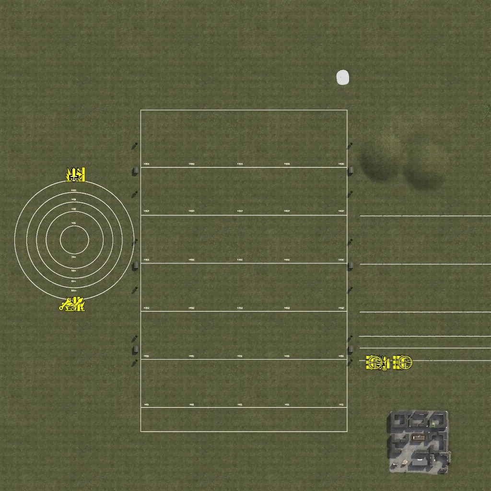
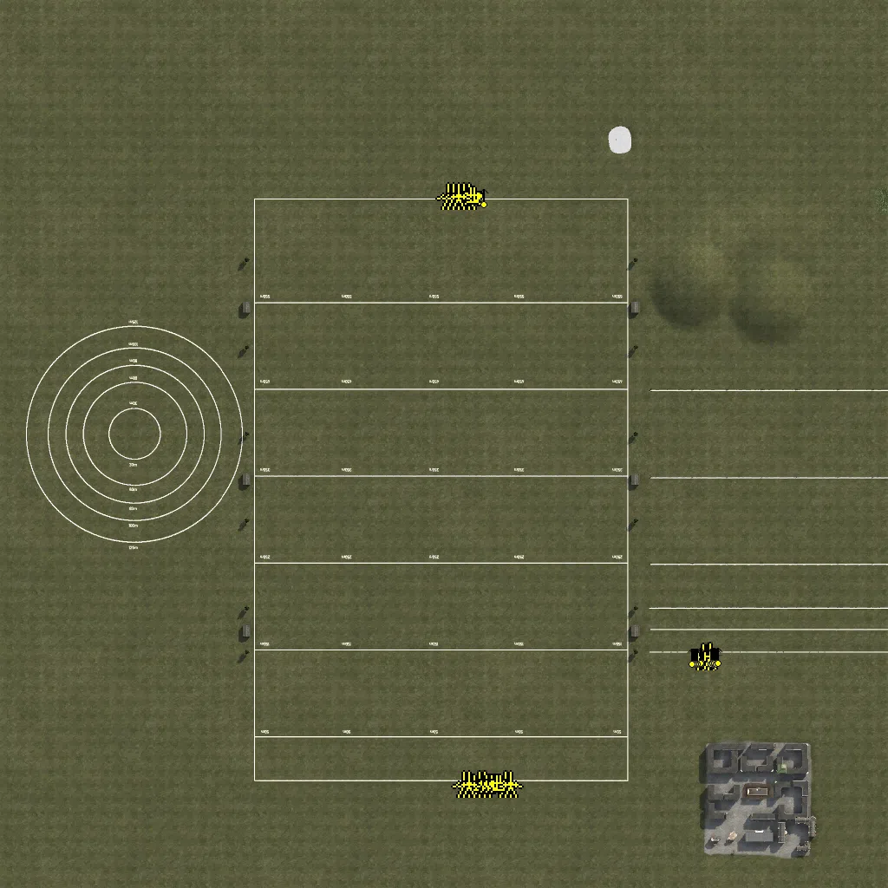
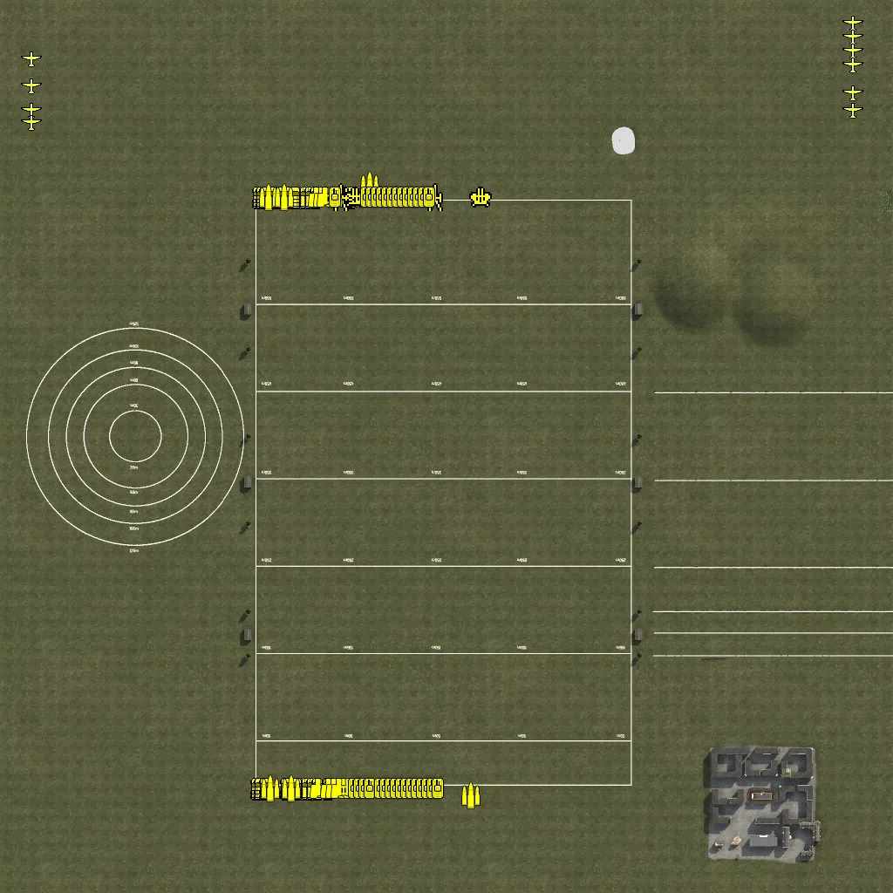

Static Ammo Crate

Pickup Kit

Static Emplacement

Vehicle

| gpo_subcat   | gpo_cat    | gpo_name                       |    pos_x |   pos_y |    pos_z |   flag | is_locked   |   team | instance                                         | gpo_cat_disp       | gpo_subcat_disp   |
|:-------------|:-----------|:-------------------------------|---------:|--------:|---------:|-------:|:------------|-------:|:-------------------------------------------------|:-------------------|:------------------|
| ammo_crate   | ammo_crate | ammo_crate                     |  -93.093 |  24.989 |  292.42  |      0 | False       |      0 | ammo_crate_0                                     | Static Ammo Crate  | Static Ammo Crate |
| ammo_crate   | ammo_crate | ammo_crate                     |  -60.949 |  24.989 |  292.263 |      0 | False       |      0 | ammo_crate_1                                     | Static Ammo Crate  | Static Ammo Crate |
| ammo_crate   | ammo_crate | ammo_crate                     |  -83.335 |  24.989 |  292.894 |      0 | False       |      0 | ammo_crate_2                                     | Static Ammo Crate  | Static Ammo Crate |
| ammo_crate   | ammo_crate | ammo_crate                     | -358.087 |  24.989 | -112.507 |      0 | False       |      0 | ammo_crate_3                                     | Static Ammo Crate  | Static Ammo Crate |
| ammo_crate   | ammo_crate | ammo_crate                     |  438.661 |  24.989 | -239.555 |      0 | False       |      0 | ammo_crate_4                                     | Static Ammo Crate  | Static Ammo Crate |
| ammo_crate   | ammo_crate | ammo_crate                     |   55.724 |  24.989 |  301.575 |      0 | False       |      0 | ammo_crate_5                                     | Static Ammo Crate  | Static Ammo Crate |
| ammo_crate   | ammo_crate | ammo_crate                     |   31.954 |  24.989 |  302.035 |      0 | False       |      0 | ammo_crate_6                                     | Static Ammo Crate  | Static Ammo Crate |
| ammo_crate   | ammo_crate | ammo_crate                     |   67.947 |  24.989 |  298.947 |      0 | False       |      0 | ammo_crate_7                                     | Static Ammo Crate  | Static Ammo Crate |
| ammo_crate   | ammo_crate | ammo_crate                     | -134.279 |  24.989 | -400.703 |      0 | False       |      0 | ammo_crate_8                                     | Static Ammo Crate  | Static Ammo Crate |
| ammo_crate   | ammo_crate | ammo_crate                     |  -93.26  |  24.989 | -400.703 |      0 | False       |      0 | ammo_crate_9                                     | Static Ammo Crate  | Static Ammo Crate |
| ammo_crate   | ammo_crate | ammo_crate                     |  -58.509 |  24.989 | -400.703 |      0 | False       |      0 | ammo_crate_10                                    | Static Ammo Crate  | Static Ammo Crate |
| ammo_crate   | ammo_crate | ammo_crate                     |  -17.489 |  24.989 | -400.703 |      0 | False       |      0 | ammo_crate_11                                    | Static Ammo Crate  | Static Ammo Crate |
| ammo_crate   | ammo_crate | ammo_crate                     |   14.124 |  24.989 | -400.703 |      0 | False       |      0 | ammo_crate_12                                    | Static Ammo Crate  | Static Ammo Crate |
| ammo_crate   | ammo_crate | ammo_crate                     |   55.144 |  24.989 | -400.703 |      0 | False       |      0 | ammo_crate_13                                    | Static Ammo Crate  | Static Ammo Crate |
| ammo_crate   | ammo_crate | ammo_crate                     |   89.895 |  24.989 | -400.703 |      0 | False       |      0 | ammo_crate_14                                    | Static Ammo Crate  | Static Ammo Crate |
| ammo_crate   | ammo_crate | ammo_crate                     |  130.914 |  24.989 | -400.703 |      0 | False       |      0 | ammo_crate_15                                    | Static Ammo Crate  | Static Ammo Crate |
| ammo_crate   | ammo_crate | ammo_crate                     |  -17.489 |  24.989 |  298.947 |      0 | False       |      0 | ammo_crate_16                                    | Static Ammo Crate  | Static Ammo Crate |
| ammo_crate   | ammo_crate | ammo_crate                     | -357.553 |  24.989 |  136.497 |      0 | False       |      0 | ammo_crate_17                                    | Static Ammo Crate  | Static Ammo Crate |
| ammo_crate   | ammo_crate | ammo_crate                     | -357.553 |  24.989 |  111.839 |      0 | False       |      0 | ammo_crate_18                                    | Static Ammo Crate  | Static Ammo Crate |
| ammo_crate   | ammo_crate | ammo_crate                     | -357.553 |  24.989 |   91.443 |      0 | False       |      0 | ammo_crate_19                                    | Static Ammo Crate  | Static Ammo Crate |
| ammo_crate   | ammo_crate | ammo_crate                     | -357.553 |  24.989 |   72.095 |      0 | False       |      0 | ammo_crate_20                                    | Static Ammo Crate  | Static Ammo Crate |
| ammo_crate   | ammo_crate | ammo_crate                     | -357.553 |  24.989 |   41.723 |      0 | False       |      0 | ammo_crate_21                                    | Static Ammo Crate  | Static Ammo Crate |
| ammo_crate   | ammo_crate | ammo_crate                     | -358.087 |  24.989 |  -16.82  |      0 | False       |      0 | ammo_crate_22                                    | Static Ammo Crate  | Static Ammo Crate |
| ammo_crate   | ammo_crate | ammo_crate                     | -358.087 |  24.989 |  -46.853 |      0 | False       |      0 | ammo_crate_23                                    | Static Ammo Crate  | Static Ammo Crate |
| ammo_crate   | ammo_crate | ammo_crate                     | -358.087 |  24.989 |  -67.436 |      0 | False       |      0 | ammo_crate_24                                    | Static Ammo Crate  | Static Ammo Crate |
| ammo_crate   | ammo_crate | ammo_crate                     | -358.087 |  24.989 |  -87.658 |      0 | False       |      0 | ammo_crate_25                                    | Static Ammo Crate  | Static Ammo Crate |
| ammo_crate   | ammo_crate | ammo_crate                     |   13.337 |  24.989 |  307.602 |      0 | False       |      0 | ammo_crate_26                                    | Static Ammo Crate  | Static Ammo Crate |
| ammo_crate   | ammo_crate | ammo_crate                     |  421.531 |  24.989 | -239.555 |      0 | False       |      0 | ammo_crate_27                                    | Static Ammo Crate  | Static Ammo Crate |
| ammo_crate   | ammo_crate | ammo_crate                     |  431.167 |  24.989 | -239.555 |      0 | False       |      0 | ammo_crate_28                                    | Static Ammo Crate  | Static Ammo Crate |
| ammo_crate   | ammo_crate | ammo_crate                     |  269.155 |  24.989 | -239.555 |      0 | False       |      0 | ammo_crate_29                                    | Static Ammo Crate  | Static Ammo Crate |
| ammo_crate   | ammo_crate | ammo_crate                     |  252.025 |  24.989 | -239.555 |      0 | False       |      0 | ammo_crate_30                                    | Static Ammo Crate  | Static Ammo Crate |
| ammo_crate   | ammo_crate | ammo_crate                     |  261.661 |  24.989 | -239.555 |      0 | False       |      0 | ammo_crate_31                                    | Static Ammo Crate  | Static Ammo Crate |
| ammo_crate   | ammo_crate | ammo_crate                     |  316.594 |  24.989 | -246.132 |      0 | False       |      0 | ammo_crate_32                                    | Static Ammo Crate  | Static Ammo Crate |
| ammo_crate   | ammo_crate | ammo_crate                     |  294.386 |  25     | -243.619 |      0 | False       |      0 | ammo_crate_33                                    | Static Ammo Crate  | Static Ammo Crate |
| ammo_crate   | ammo_crate | ammo_crate                     |  306.125 |  24.989 | -246.132 |      0 | False       |      0 | ammo_crate_34                                    | Static Ammo Crate  | Static Ammo Crate |
| ammo_crate   | ammo_crate | ammo_crate                     |  348.939 |  24.989 | -239.555 |      0 | False       |      0 | ammo_crate_35                                    | Static Ammo Crate  | Static Ammo Crate |
| ammo_crate   | ammo_crate | ammo_crate                     |  328.18  |  24.989 | -247.288 |      0 | False       |      0 | ammo_crate_36                                    | Static Ammo Crate  | Static Ammo Crate |
| ammo_crate   | ammo_crate | ammo_crate                     |  341.445 |  24.989 | -239.555 |      0 | False       |      0 | ammo_crate_37                                    | Static Ammo Crate  | Static Ammo Crate |
| ammo_crate   | ammo_crate | ammo_crate                     |  390.976 |  24.989 | -239.555 |      0 | False       |      0 | ammo_crate_38                                    | Static Ammo Crate  | Static Ammo Crate |
| ammo_crate   | ammo_crate | ammo_crate                     |  373.846 |  24.989 | -239.555 |      0 | False       |      0 | ammo_crate_39                                    | Static Ammo Crate  | Static Ammo Crate |
| ammo_crate   | ammo_crate | ammo_crate                     |  383.482 |  24.989 | -239.555 |      0 | False       |      0 | ammo_crate_40                                    | Static Ammo Crate  | Static Ammo Crate |
| ammo_crate   | ammo_crate | ammo_crate                     |  -40.26  |  25     |  294.469 |      0 | False       |      0 | ammo_crate_41                                    | Static Ammo Crate  | Static Ammo Crate |
| ammo_crate   | ammo_crate | ammo_crate                     |  -53.94  |  25     |  298.875 |      0 | False       |      0 | ammo_crate_42                                    | Static Ammo Crate  | Static Ammo Crate |
| ammo_crate   | ammo_crate | ammo_crate                     |  -49.392 |  24.989 |  292.066 |      0 | False       |      0 | ammo_crate_43                                    | Static Ammo Crate  | Static Ammo Crate |
| ammo_crate   | ammo_crate | ammo_crate                     |  -73.167 |  24.989 |  291.948 |      0 | False       |      0 | ammo_crate_44                                    | Static Ammo Crate  | Static Ammo Crate |
| ammo_crate   | ammo_crate | ammo_crate                     |  331.809 |  24.989 | -239.555 |      0 | False       |      0 | ammo_crate_45                                    | Static Ammo Crate  | Static Ammo Crate |
| ammo_crate   | ammo_crate | ammo_crate                     |  301.013 |  25     | -243.619 |      0 | False       |      0 | ammo_crate_46                                    | Static Ammo Crate  | Static Ammo Crate |
| ammo         | kit        | UW_PickUpAmmokit               |  292.007 |  25     | -246.025 |      3 | False       |      0 | CP_16_range_smallarmsallies_ammoamerican         | Pickup Kit         | Ammo Kit          |
| ammo         | kit        | BA_PickUpAmmokit               |  290     |  25     | -246.003 |      3 | False       |      0 | CP_16_range_smallarmsallies_ammobritish          | Pickup Kit         | Ammo Kit          |
| ammo         | kit        | IA_PickUpAmmokit               |  318.052 |  25     | -243.961 |    301 | False       |      0 | CP_16_range_smallarmsAxis_ammoitalian            | Pickup Kit         | Ammo Kit          |
| ammo         | kit        | GA_PickUpAmmokit               |  320.012 |  25     | -244.032 |    301 | False       |      0 | CP_16_range_smallarmsAxis_ammogerman             | Pickup Kit         | Ammo Kit          |
| antitank     | kit        | UA_PickUpHawkinsThompson1928a1 |  282     |  25     | -243.997 |      3 | False       |      0 | CP_16_range_smallarmsallies_thompsonm1928a130rds | Pickup Kit         | Tankhunter Kit    |
| antitank     | kit        | GA_PickUpSapperK98Short        | -354.04  |  25     |  148.035 |    305 | False       |      0 | CP_16_range_ataxis_3kg                           | Pickup Kit         | Tankhunter Kit    |
| antitank     | kit        | GW_PickUphafthohlladung        | -362.148 |  25     |  148.047 |    305 | False       |      0 | CP_16_range_ataxis_haftmine                      | Pickup Kit         | Tankhunter Kit    |
| antitank     | kit        | UA_PickUpHawkinsThompson1928a1 | -347.929 |  25     | -122.024 |    304 | False       |      0 | CP_16_range_atallies_hawkins                     | Pickup Kit         | Tankhunter Kit    |
| antitank     | kit        | BA_PickUpSapperNo4Short        | -355.876 |  25     | -121.999 |    304 | False       |      0 | CP_16_range_atallies_satchel                     | Pickup Kit         | Tankhunter Kit    |
| antitank     | kit        | BA_PickUpTankHunterNo4Short    | -363.997 |  25     | -122.015 |    304 | False       |      0 | CP_16_range_atallies_compb                       | Pickup Kit         | Tankhunter Kit    |
| assault      | kit        | IA_PickUpAssaultCarcano91      |  328.012 |  25     | -243.979 |    301 | False       |      0 | CP_16_range_smallarmsAxis_carcanolong            | Pickup Kit         | Assault Kit       |
| at_rifle     | kit        | GA_PickUpAntitankPZB39         | -350.062 |  25     |  148.002 |    305 | False       |      0 | CP_16_range_ataxis_pzb39                         | Pickup Kit         | AT Rifle          |
| at_rifle     | kit        | BA_PickUpAntitankBoys          | -359.929 |  25     | -121.989 |    304 | False       |      0 | CP_16_range_atallies_thermos                     | Pickup Kit         | AT Rifle          |
| at_rifle     | kit        | BA_PickUpAntitankBoys          | -367.982 |  25     | -121.964 |    304 | False       |      0 | CP_16_range_atallies_boys                        | Pickup Kit         | AT Rifle          |
| commando     | kit        | BA_PickUpCommandoTommyD        |  280     |  25     | -243.992 |      3 | False       |      0 | CP_16_range_smallarmsallies_thompsonm192820rds   | Pickup Kit         | Commando Kit      |
| commando     | kit        | IA_PickUpCommandoBeretta38a    |  324.031 |  25     | -244.039 |    301 | False       |      0 | CP_16_range_smallarmsAxis_beretta                | Pickup Kit         | Commando Kit      |
| commando     | kit        | GA_PickUpCommandoMp40          | -358.032 |  25     |  148.009 |    305 | False       |      0 | CP_16_range_ataxis_geballteladung                | Pickup Kit         | Commando Kit      |
| engineer     | kit        | UW_PickUpEngineer              |  264     |  25     | -243.959 |      3 | False       |      0 | CP_16_range_smallarmsallies_m1carbine            | Pickup Kit         | Engineer Kit      |
| engineer     | kit        | UW_PickUpEngineer              | -376.001 |  25     | -121.971 |    304 | False       |      0 | CP_16_range_atallies_americanmine                | Pickup Kit         | Engineer Kit      |
| mg           | kit        | UW_PickUpSupportM1918BAR       |  268     |  25     | -243.967 |      3 | False       |      0 | CP_16_range_smallarmsallies_bar                  | Pickup Kit         | MG Kit            |
| mg           | kit        | BA_PickUpSupportLewis          |  266     |  25     | -243.978 |      3 | False       |      0 | CP_16_range_smallarmsallies_lewiskit             | Pickup Kit         | MG Kit            |
| mg           | kit        | GA_PickUpSupportMG34           |  322.048 |  25     | -244.013 |    301 | False       |      0 | CP_16_range_smallarmsAxis_mg34_0                 | Pickup Kit         | MG Kit            |
| mg           | kit        | IA_PickUpSupportBreda          |  330.082 |  25     | -244.019 |    301 | False       |      0 | CP_16_range_smallarmsAxis_bredam30               | Pickup Kit         | MG Kit            |
| sniper       | kit        | UW_PickUpSniperSpringfield     |  272     |  25     | -243.982 |      3 | False       |      0 | CP_16_range_smallarmsallies_springfieldsniper    | Pickup Kit         | Sniper Kit        |
| sniper       | kit        | BA_PickUpSniperNo4             |  270     |  25     | -243.972 |      3 | False       |      0 | CP_16_range_smallarmsallies_p14scoped            | Pickup Kit         | Sniper Kit        |
| sniper       | kit        | IA_PickUpSniperPattern         |  332.052 |  25     | -244.002 |    301 | False       |      0 | CP_16_range_smallarmsAxis_p14captured            | Pickup Kit         | Sniper Kit        |
| sniper       | kit        | GA_PickUpSniperK98             |  334.044 |  25     | -243.997 |    301 | False       |      0 | CP_16_range_smallarmsAxis_k98kzf                 | Pickup Kit         | Sniper Kit        |
| zooka        | kit        | UA_PickUpBazooka               | -351.875 |  25     | -121.974 |    304 | False       |      0 | CP_16_range_atallies_m1bazooka                   | Pickup Kit         | HEAT Thrower      |
| noidea       | noidea     | dummy_soldier                  |  249.253 |  26.014 |   67.802 |      3 | False       |      0 | CP_16_range_smallarmsallies_dummy                | FIXME UNASSIGNED   | FIXME UNASSIGNED  |
| noidea       | noidea     | dummy_soldier                  |  263.079 |  26.014 |   63.142 |      3 | False       |      0 | CP_16_range_smallarmsallies_dummy2               | FIXME UNASSIGNED   | FIXME UNASSIGNED  |
| noidea       | noidea     | dummy_soldier                  |  299.82  |  26.014 |   68.115 |      3 | False       |      0 | CP_16_range_smallarmsallies_dummy3               | FIXME UNASSIGNED   | FIXME UNASSIGNED  |
| noidea       | noidea     | dummy_soldier                  |  313.647 |  26.014 |   63.455 |      3 | False       |      0 | CP_16_range_smallarmsallies_dummy4               | FIXME UNASSIGNED   | FIXME UNASSIGNED  |
| noidea       | noidea     | dummy_soldier                  |  346.638 |  26.014 |   63.095 |      3 | False       |      0 | CP_16_range_smallarmsallies_dummy5               | FIXME UNASSIGNED   | FIXME UNASSIGNED  |
| noidea       | noidea     | dummy_soldier                  |  360.465 |  26.014 |   58.435 |      3 | False       |      0 | CP_16_range_smallarmsallies_dummy6               | FIXME UNASSIGNED   | FIXME UNASSIGNED  |
| noidea       | noidea     | dummy_soldier                  |  388.699 |  26.014 |   66.425 |      3 | False       |      0 | CP_16_range_smallarmsallies_dummy7               | FIXME UNASSIGNED   | FIXME UNASSIGNED  |
| noidea       | noidea     | dummy_soldier                  |  402.525 |  26.014 |   61.765 |      3 | False       |      0 | CP_16_range_smallarmsallies_dummy8               | FIXME UNASSIGNED   | FIXME UNASSIGNED  |
| noidea       | noidea     | dummy_soldier                  |  266.575 |  26.014 |  -38.703 |      3 | False       |      0 | CP_16_range_smallarmsallies_dummy9               | FIXME UNASSIGNED   | FIXME UNASSIGNED  |
| noidea       | noidea     | dummy_soldier                  |  280.402 |  26.014 |  -43.363 |      3 | False       |      0 | CP_16_range_smallarmsallies_dummy10              | FIXME UNASSIGNED   | FIXME UNASSIGNED  |
| noidea       | noidea     | dummy_soldier                  |  340.66  |  26.014 |  -33.217 |      3 | False       |      0 | CP_16_range_smallarmsallies_dummy11              | FIXME UNASSIGNED   | FIXME UNASSIGNED  |
| noidea       | noidea     | dummy_soldier                  |  354.486 |  26.014 |  -37.877 |      3 | False       |      0 | CP_16_range_smallarmsallies_dummy12              | FIXME UNASSIGNED   | FIXME UNASSIGNED  |
| noidea       | noidea     | dummy_soldier                  |  379.75  |  26.014 |  -40.267 |      3 | False       |      0 | CP_16_range_smallarmsallies_dummy13              | FIXME UNASSIGNED   | FIXME UNASSIGNED  |
| noidea       | noidea     | dummy_soldier                  |  393.577 |  26.014 |  -44.927 |      3 | False       |      0 | CP_16_range_smallarmsallies_dummy14              | FIXME UNASSIGNED   | FIXME UNASSIGNED  |
| noidea       | noidea     | dummy_soldier                  |  258.696 |  26.014 | -134.444 |      3 | False       |      0 | CP_16_range_smallarmsallies_dummy15              | FIXME UNASSIGNED   | FIXME UNASSIGNED  |
| noidea       | noidea     | dummy_soldier                  |  272.522 |  26.014 | -139.105 |      3 | False       |      0 | CP_16_range_smallarmsallies_dummy16              | FIXME UNASSIGNED   | FIXME UNASSIGNED  |
| noidea       | noidea     | dummy_soldier                  |  309.597 |  26.014 | -136.769 |      3 | False       |      0 | CP_16_range_smallarmsallies_dummy17              | FIXME UNASSIGNED   | FIXME UNASSIGNED  |
| noidea       | noidea     | dummy_soldier                  |  323.423 |  26.014 | -141.429 |      3 | False       |      0 | CP_16_range_smallarmsallies_dummy18              | FIXME UNASSIGNED   | FIXME UNASSIGNED  |
| noidea       | noidea     | dummy_soldier                  |  387.44  |  26.014 | -136.814 |      3 | False       |      0 | CP_16_range_smallarmsallies_dummy19              | FIXME UNASSIGNED   | FIXME UNASSIGNED  |
| noidea       | noidea     | dummy_soldier                  |  401.267 |  26.014 | -141.474 |      3 | False       |      0 | CP_16_range_smallarmsallies_dummy20              | FIXME UNASSIGNED   | FIXME UNASSIGNED  |
| noidea       | noidea     | dummy_soldier                  |  264.661 |  26.014 | -188.452 |      3 | False       |      0 | CP_16_range_smallarmsallies_dummy21              | FIXME UNASSIGNED   | FIXME UNASSIGNED  |
| noidea       | noidea     | dummy_soldier                  |  278.488 |  26.014 | -193.112 |      3 | False       |      0 | CP_16_range_smallarmsallies_dummy22              | FIXME UNASSIGNED   | FIXME UNASSIGNED  |
| noidea       | noidea     | dummy_soldier                  |  301.58  |  26.014 | -184.465 |      3 | False       |      0 | CP_16_range_smallarmsallies_dummy23              | FIXME UNASSIGNED   | FIXME UNASSIGNED  |
| noidea       | noidea     | dummy_soldier                  |  315.407 |  26.014 | -189.126 |      3 | False       |      0 | CP_16_range_smallarmsallies_dummy24              | FIXME UNASSIGNED   | FIXME UNASSIGNED  |
| noidea       | noidea     | dummy_soldier                  |  345.988 |  26.014 | -184.136 |      3 | False       |      0 | CP_16_range_smallarmsallies_dummy25              | FIXME UNASSIGNED   | FIXME UNASSIGNED  |
| noidea       | noidea     | dummy_soldier                  |  359.814 |  26.014 | -188.796 |      3 | False       |      0 | CP_16_range_smallarmsallies_dummy26              | FIXME UNASSIGNED   | FIXME UNASSIGNED  |
| noidea       | noidea     | dummy_soldier                  |  267.473 |  26.014 | -212.369 |      3 | False       |      0 | CP_16_range_smallarmsallies_dummy27              | FIXME UNASSIGNED   | FIXME UNASSIGNED  |
| noidea       | noidea     | dummy_soldier                  |  281.299 |  26.014 | -217.029 |      3 | False       |      0 | CP_16_range_smallarmsallies_dummy28              | FIXME UNASSIGNED   | FIXME UNASSIGNED  |
| noidea       | noidea     | dummy_soldier                  |  332.284 |  26.014 | -209.174 |      3 | False       |      0 | CP_16_range_smallarmsallies_dummy29              | FIXME UNASSIGNED   | FIXME UNASSIGNED  |
| noidea       | noidea     | dummy_soldier                  |  346.111 |  26.014 | -213.834 |      3 | False       |      0 | CP_16_range_smallarmsallies_dummy30              | FIXME UNASSIGNED   | FIXME UNASSIGNED  |
| noidea       | noidea     | opelblitz_dak_zw36             | -195.967 |  25     | -392.055 |    302 | False       |      0 | CP_16_range_vehiclesaxis_opelblitzmg34           | FIXME UNASSIGNED   | FIXME UNASSIGNED  |
| noidea       | noidea     | fiat508                        | -189.894 |  25     | -391.99  |    302 | False       |      0 | CP_16_range_vehiclesaxis_FIAT508                 | FIXME UNASSIGNED   | FIXME UNASSIGNED  |
| noidea       | noidea     | pziii_f_france                 |  -81.899 |  25     | -392.095 |    302 | True        |      0 | CP_16_range_vehiclesaxis_pzIIIE                  | FIXME UNASSIGNED   | FIXME UNASSIGNED  |
| noidea       | noidea     | pak35                          |   16.029 |  25     | -392.075 |    302 | False       |      0 | CP_16_range_vehiclesaxis_pak35                   | FIXME UNASSIGNED   | FIXME UNASSIGNED  |
| noidea       | noidea     | bf109e7_tropalt                | -476.172 |  25     |  490.07  |    306 | True        |      0 | CP_16_range_planesaxis_bf109e                    | FIXME UNASSIGNED   | FIXME UNASSIGNED  |
| noidea       | noidea     | bf109f4_Trop_alt250kg          | -476.11  |  25     |  477.907 |    306 | True        |      0 | CP_16_range_planesaxis_bf109f4                   | FIXME UNASSIGNED   | FIXME UNASSIGNED  |
| noidea       | noidea     | ju87b2_libya                   | -475.988 |  25     |  461.779 |    306 | True        |      0 | CP_16_range_planesaxis_ju87b                     | FIXME UNASSIGNED   | FIXME UNASSIGNED  |
| noidea       | noidea     | p-40e_500lb                    |  466.093 |  25     |  422.105 |    307 | True        |      0 | CP_16_range_planesallies_p40e                    | FIXME UNASSIGNED   | FIXME UNASSIGNED  |
| noidea       | noidea     | UA_PickUpAssaultThompson1928a1 |  284     |  25     | -243.986 |      3 | False       |      0 | CP_16_range_smallarmsallies_thompsonm1928a1      | FIXME UNASSIGNED   | FIXME UNASSIGNED  |
| noidea       | noidea     | UA_PickUpAssaultM1Garand       |  278     |  25     | -244.025 |      3 | False       |      0 | CP_16_range_smallarmsallies_m1garand             | FIXME UNASSIGNED   | FIXME UNASSIGNED  |
| noidea       | noidea     | UW_PickUpAssaultSpringfieldA1  |  276     |  25     | -243.987 |      3 | False       |      0 | CP_16_range_smallarmsallies_Springfieldm1903a1   | FIXME UNASSIGNED   | FIXME UNASSIGNED  |
| noidea       | noidea     | UA_PickUpAssaultSpringfieldA3  |  274     |  25     | -243.987 |      3 | False       |      0 | CP_16_range_smallarmsallies_Springfieldm1903a3   | FIXME UNASSIGNED   | FIXME UNASSIGNED  |
| noidea       | noidea     | IA_PickUpSapperCarcano38       |  326.031 |  25     | -244.009 |    301 | False       |      0 | CP_16_range_smallarmsAxis_carcanoshort           | FIXME UNASSIGNED   | FIXME UNASSIGNED  |
| noidea       | noidea     | IA_PickUpTankHunterCarcano38   | -366.099 |  25     |  148.138 |    305 | False       |      0 | CP_16_range_ataxis_bombaL                        | FIXME UNASSIGNED   | FIXME UNASSIGNED  |
| noidea       | noidea     |                                | -372.041 |  25     | -122.025 |    304 | False       |      0 | CP_16_range_atallies_britishmine                 | FIXME UNASSIGNED   | FIXME UNASSIGNED  |
| arty         | static     | m2a1_howitzer_105mm            |   22     |  25.457 |  286.058 |    303 | False       |      0 | CP_16_range_vehiclesallies_105mm                 | Static Emplacement | Artillery         |
| arty         | static     | 25pdr                          |   28     |  25.444 |  286.027 |    303 | False       |      0 | CP_16_range_vehiclesallies_25pd                  | Static Emplacement | Artillery         |
| arty         | static     | lefh18                         |   40.104 |  25.331 | -392.071 |    302 | False       |      0 | CP_16_range_vehiclesaxis_105mmhowitzer           | Static Emplacement | Artillery         |
| arty         | static     | nebelwerfer                    |   46.037 |  25.449 | -391.973 |    302 | False       |      0 | CP_16_range_vehiclesaxis_nebelwerfer             | Static Emplacement | Artillery         |
| arty         | static     | schneider_1913                 |   70.021 |  25     | -392.007 |    302 | False       |      0 | CP_16_range_vehiclesaxis_m1897                   | Static Emplacement | Artillery         |
| arty         | static     | 81mm_mortar_m1                 |  298.045 |  25     | -244.592 |      3 | False       |      0 | CP_16_range_smallarmsallies_M1mortar             | Static Emplacement | Artillery         |
| arty         | static     | 3inchmortar                    |  304.034 |  25     | -244.581 |      3 | False       |      0 | CP_16_range_smallarmsallies_3inch                | Static Emplacement | Artillery         |
| arty         | static     | sgwr34                         |  306.008 |  25     | -244.016 |    301 | False       |      0 | CP_16_range_smallarmsAxis_80mmgrw                | Static Emplacement | Artillery         |
| flak         | static     | bofors40mm                     |   34     |  25.388 |  286.07  |    303 | False       |      0 | CP_16_range_vehiclesallies_bofors                | Static Emplacement | Anti-aircraft Gun |
| flak         | static     | flak18                         |   34.097 |  25     | -392.084 |    302 | False       |      0 | CP_16_range_vehiclesaxis_88mm                    | Static Emplacement | Anti-aircraft Gun |
| flak         | static     | flak38                         |   52.074 |  25.167 | -391.988 |    302 | False       |      0 | CP_16_range_vehiclesaxis_flak38                  | Static Emplacement | Anti-aircraft Gun |
| flak         | static     | flakvierling38                 |   58.088 |  25.018 | -392.072 |    302 | False       |      0 | CP_16_range_vehiclesaxis_vierling                | Static Emplacement | Anti-aircraft Gun |
| flak         | static     | breda_35_20mm                  |   64.07  |  25.17  | -391.979 |    302 | False       |      0 | CP_16_range_vehiclesaxis_bredaAA                 | Static Emplacement | Anti-aircraft Gun |
| mg_nest      | static     | 50cal_tripod                   |   46     |  25.107 |  286     |    303 | False       |      0 | CP_16_range_vehiclesallies_50cal                 | Static Emplacement | Static MG         |
| mg_nest      | static     | lewis_bipod                    |  295.983 |  26.113 | -243.05  |      3 | False       |      0 | CP_16_range_smallarmsallies_lewis                | Static Emplacement | Static MG         |
| mg_nest      | static     | vickers303_tripod              |  292.016 |  25.162 | -244.008 |      3 | False       |      0 | CP_16_range_smallarmsallies_vickershmg           | Static Emplacement | Static MG         |
| mg_nest      | static     | brenaa                         |  289.993 |  25.082 | -243.976 |      3 | False       |      0 | CP_16_range_smallarmsallies_brenaa               | Static Emplacement | Static MG         |
| mg_nest      | static     | m1919a4_emplaced               |  287.995 |  25     | -243.998 |      3 | False       |      0 | CP_16_range_smallarmsallies_m1919tripod          | Static Emplacement | Static MG         |
| mg_nest      | static     | m1917_tripod                   |  286.008 |  25.067 | -243.981 |      3 | False       |      0 | CP_16_range_smallarmsallies_m1917tripod          | Static Emplacement | Static MG         |
| mg_nest      | static     | mg34_lafette                   |  308.025 |  25.165 | -244.006 |    301 | False       |      0 | CP_16_range_smallarmsAxis_mg34lafette            | Static Emplacement | Static MG         |
| mg_nest      | static     | mg34_bipod                     |  310.009 |  25.888 | -243     |    301 | False       |      0 | CP_16_range_smallarmsAxis_mg34                   | Static Emplacement | Static MG         |
| mg_nest      | static     | mg15_bipod                     |  311.983 |  26.088 | -242.986 |    301 | False       |      0 | CP_16_range_smallarmsAxis_mg15bipod              | Static Emplacement | Static MG         |
| mg_nest      | static     | mg81z_tripod                   |  314.016 |  25.037 | -243.982 |    301 | False       |      0 | CP_16_range_smallarmsAxis_mg81z                  | Static Emplacement | Static MG         |
| mg_nest      | static     | bredam37_bipod                 |  316.02  |  25.855 | -242.876 |    301 | False       |      0 | CP_16_range_smallarmsAxis_bredabipod             | Static Emplacement | Static MG         |
| pak          | static     | 37mm_m3                        |    4     |  25     |  285.945 |    303 | False       |      0 | CP_16_range_vehiclesallies_37mmatmobile          | Static Emplacement | Anti-tank Gun     |
| pak          | static     | 2pdr                           |   10     |  25     |  286.107 |    303 | False       |      0 | CP_16_range_vehiclesallies_2pd                   | Static Emplacement | Anti-tank Gun     |
| pak          | static     | 6pdr                           |   16     |  25     |  286.084 |    303 | False       |      0 | CP_16_range_vehiclesallies_6pdrmobile            | Static Emplacement | Anti-tank Gun     |
| pak          | static     | pak38                          |   22.085 |  25     | -391.929 |    302 | False       |      0 | CP_16_range_vehiclesaxis_pak38mobile             | Static Emplacement | Anti-tank Gun     |
| pak          | static     | pak40_ws                       |   28.07  |  25     | -392.009 |    302 | False       |      0 | CP_16_range_vehiclesaxis_pak40mobile             | Static Emplacement | Anti-tank Gun     |
| pak          | static     | cannone_da_47_32               |   76.091 |  25     | -392.018 |    302 | False       |      0 | CP_16_range_vehiclesaxis_47mmat                  | Static Emplacement | Anti-tank Gun     |
| apc          | vehicle    | m3_halftrack                   | -168.048 |  25     |  286.08  |    303 | False       |      0 | CP_16_range_vehiclesallies_m3                    | Vehicle            | APC               |
| apc          | vehicle    | m3_scoutcar                    | -162.048 |  25     |  286.048 |    303 | False       |      0 | CP_16_range_vehiclesallies_m3scout               | Vehicle            | APC               |
| apc          | vehicle    | universalcarrier_bren          | -156.103 |  25     |  286.033 |    303 | False       |      0 | CP_16_range_vehiclesallies_UniversalCarrier      | Vehicle            | APC               |
| apc          | vehicle    | universalcarrier_vickers       | -150.027 |  25     |  286.105 |    303 | False       |      0 | CP_16_range_vehiclesallies_ucvickers             | Vehicle            | APC               |
| apc          | vehicle    | gmc_m3_75mm                    | -110.045 |  25     |  286.002 |    303 | True        |      0 | CP_16_range_vehiclesallies_m3gmc                 | Vehicle            | APC               |
| apc          | vehicle    | sdkfz251_1                     | -165.935 |  25     | -392.065 |    302 | False       |      0 | CP_16_range_vehiclesaxis_sdkfz251c               | Vehicle            | APC               |
| apc          | vehicle    | sdkfz251_10                    | -159.96  |  25     | -392.061 |    302 | False       |      0 | CP_16_range_vehiclesaxis_sdkfz25137mm            | Vehicle            | APC               |
| apc          | vehicle    | sdkfz250_3_alt                 | -153.9   |  25     | -392.054 |    302 | False       |      0 | CP_16_range_vehiclesaxis_sdkfz250                | Vehicle            | APC               |
| apc          | vehicle    | sdkfz250_3                     | -147.841 |  25     | -392.061 |    302 | True        |      0 | CP_16_range_vehiclesaxis_sdkfz250greif           | Vehicle            | APC               |
| arty_sp      | vehicle    | bishop                         |  -14.02  |  25     |  286.011 |    303 | True        |      0 | CP_16_range_vehiclesallies_bishop                | Vehicle            | Mobile Arty       |
| car          | vehicle    | willysmb                       | -216.029 |  25     |  286.042 |    303 | False       |      0 | CP_16_range_vehiclesallies_jeep                  | Vehicle            | Car               |
| car          | vehicle    | willysmbsas                    | -212.074 |  25     |  285.899 |    303 | False       |      0 | CP_16_range_vehiclesallies_jeepsas               | Vehicle            | Car               |
| car          | vehicle    | gmc                            | -208.011 |  25     |  286.002 |    303 | False       |      0 | CP_16_range_vehiclesallies_gmc                   | Vehicle            | Car               |
| car          | vehicle    | bedfordox                      | -198.047 |  25     |  286.034 |    303 | False       |      0 | CP_16_range_vehiclesallies_bedfordox             | Vehicle            | Car               |
| car          | vehicle    | bedfordoyd                     | -192.029 |  25     |  286.042 |    303 | False       |      0 | CP_16_range_vehiclesallies_bedfordoy             | Vehicle            | Car               |
| car          | vehicle    | chevy30cwt                     | -180.081 |  25     |  286.052 |    303 | False       |      0 | CP_16_range_vehiclesallies_lrdg                  | Vehicle            | Car               |
| car          | vehicle    | chevy30cwt_breda               | -174.039 |  25     |  286.051 |    303 | False       |      0 | CP_16_range_vehiclesallies_chevyaa               | Vehicle            | Car               |
| car          | vehicle    | kubeldak                       | -217.985 |  25     | -392.053 |    302 | False       |      0 | CP_16_range_vehiclesaxis_kuebelwagen             | Vehicle            | Car               |
| car          | vehicle    | vwtyp82                        | -213.949 |  25     | -392.022 |    302 | False       |      0 | CP_16_range_vehiclesaxis_kaefer                  | Vehicle            | Car               |
| car          | vehicle    | opelblitz_dak                  | -207.962 |  25     | -392.136 |    302 | False       |      0 | CP_16_range_vehiclesaxis_opelblitz               | Vehicle            | Car               |
| car          | vehicle    | fiat626                        | -183.903 |  25     | -392.087 |    302 | False       |      0 | CP_16_range_vehiclesaxis_FIAT626                 | Vehicle            | Car               |
| car          | vehicle    | fiat626_breda                  | -171.931 |  25     | -392.118 |    302 | False       |      0 | CP_16_range_vehiclesaxis_fiat626aa               | Vehicle            | Car               |
| car          | vehicle    | bmw_r75                        | -135.877 |  25     | -392.065 |    302 | False       |      0 | CP_16_range_vehiclesaxis_bmwr75                  | Vehicle            | Car               |
| flak_sp      | vehicle    | deacon_bofors                  | -116.098 |  25     |  286.063 |    303 | False       |      0 | CP_16_range_vehiclesallies_deaconbofors          | Vehicle            | Mobile FlaK       |
| flak_sp      | vehicle    | m13_mgmc                       | -104.044 |  25     |  286.036 |    303 | False       |      0 | CP_16_range_vehiclesallies_m13gmc                | Vehicle            | Mobile FlaK       |
| flak_sp      | vehicle    | m33                            |   40     |  25     |  286     |    303 | False       |      0 | CP_16_range_vehiclesallies_m33                   | Vehicle            | Mobile FlaK       |
| pak_sp       | vehicle    | deacon                         | -122.065 |  25     |  286.011 |    303 | False       |      0 | CP_16_range_vehiclesallies_deacon6pd             | Vehicle            | Mobile PaK        |
| plane        | vehicle    | storch_trop                    | -476.344 |  25     |  503.605 |    306 | True        |      0 | CP_16_range_planesaxis_storch                    | Vehicle            | Airplane          |
| plane        | vehicle    | ju87d1_trop                    | -476.068 |  25     |  445.422 |    306 | True        |      0 | CP_16_range_planesaxis_ju87d                     | Vehicle            | Airplane          |
| plane        | vehicle    | ju52                           | -476.11  |  25     |  414.08  |    306 | True        |      0 | CP_16_range_planesaxis_ju52                      | Vehicle            | Airplane          |
| plane        | vehicle    | mc200_alt                      | -475.96  |  25     |  385.76  |    306 | True        |      0 | CP_16_range_planesaxis_mc200                     | Vehicle            | Airplane          |
| plane        | vehicle    | mc202                          | -476.049 |  25     |  371.808 |    306 | True        |      0 | CP_16_range_planesaxis_mc202_0                   | Vehicle            | Airplane          |
| plane        | vehicle    | pipercub_gb                    |  466.096 |  25     |  502.219 |    307 | True        |      0 | CP_16_range_planesallies_piper                   | Vehicle            | Airplane          |
| plane        | vehicle    | hurricanemki                   |  466.056 |  25     |  486.117 |    307 | True        |      0 | CP_16_range_planesallies_hurricanemkI            | Vehicle            | Airplane          |
| plane        | vehicle    | hurricanemkiic_b               |  466     |  25     |  470.04  |    307 | True        |      0 | CP_16_range_planesallies_hurricanemkii           | Vehicle            | Airplane          |
| plane        | vehicle    | hurricanemkiid                 |  466.093 |  25     |  454.119 |    307 | True        |      0 | CP_16_range_planesallies_hurricanemkiid          | Vehicle            | Airplane          |
| plane        | vehicle    | spitfiremkvb                   |  466.065 |  25     |  438.131 |    307 | True        |      0 | CP_16_range_planesallies_spitfire                | Vehicle            | Airplane          |
| plane        | vehicle    | beaufightermk1_b               |  466.01  |  25     |  406.09  |    307 | True        |      0 | CP_16_range_planesallies_beaufighter             | Vehicle            | Airplane          |
| plane        | vehicle    | hardy                          |  466.081 |  25     |  386.086 |    307 | True        |      0 | CP_16_range_planesallies_hardy                   | Vehicle            | Airplane          |
| recon        | vehicle    | aecdorchester                  | -144.057 |  25     |  286.003 |    303 | True        |      0 | CP_16_range_vehiclesallies_dorchester            | Vehicle            | Scout Vehicle     |
| recon        | vehicle    | dingo_na                       | -138.045 |  25     |  286.047 |    303 | False       |      0 | CP_16_range_vehiclesallies_daimlerdingo          | Vehicle            | Scout Vehicle     |
| recon        | vehicle    | daimlermk1                     | -133.946 |  25     |  285.974 |    303 | True        |      0 | CP_16_range_vehiclesallies_daimlerac             | Vehicle            | Scout Vehicle     |
| recon        | vehicle    | aecdorchester_de               | -141.885 |  25     | -391.981 |    302 | True        |      0 | CP_16_range_vehiclesaxis_dorchester              | Vehicle            | Scout Vehicle     |
| recon        | vehicle    | sdkfz222                       | -129.865 |  25     | -391.984 |    302 | True        |      0 | CP_16_range_vehiclesaxis_sdkfz222                | Vehicle            | Scout Vehicle     |
| recon        | vehicle    | sdkfz231_1                     | -123.901 |  25     | -392.041 |    302 | True        |      0 | CP_16_range_vehiclesaxis_sdkfz231                | Vehicle            | Scout Vehicle     |
| recon        | vehicle    | sahariana                      | -117.945 |  25     | -392.012 |    302 | False       |      0 | CP_16_range_vehiclesaxis_sahariana               | Vehicle            | Scout Vehicle     |
| supply       | vehicle    | gmc_ammo                       | -204.063 |  25     |  286.032 |    303 | False       |      0 | CP_16_range_vehiclesallies_gmcammo               | Vehicle            | Supply Vehicle    |
| supply       | vehicle    | bedfordoyd_ammo                | -186.007 |  25     |  286.011 |    303 | False       |      0 | CP_16_range_vehiclesallies_bedfordoyammo         | Vehicle            | Supply Vehicle    |
| supply       | vehicle    | opelblitz_dak_ammo             | -201.904 |  25     | -392.025 |    302 | False       |      0 | CP_16_range_vehiclesaxis_opelblitzammo           | Vehicle            | Supply Vehicle    |
| supply       | vehicle    | fiat626_ammo                   | -177.914 |  25     | -392.022 |    302 | False       |      0 | CP_16_range_vehiclesaxis_fiat626ammo             | Vehicle            | Supply Vehicle    |
| supply       | vehicle    | bedfordoyd_ammo                |  -88.034 |  25     |  300     |    303 | False       |      0 | CP_16_range_vehiclesallies_ammoguns              | Vehicle            | Supply Vehicle    |
| supply       | vehicle    | fiat626_ammo                   |   28.07  |  25     | -400     |    303 | False       |      0 | CP_16_range_vehiclesaxis_ammoguns                | Vehicle            | Supply Vehicle    |
| tank         | vehicle    | marmonherringtonmk3a           | -128.03  |  25     |  286.057 |    303 | True        |      0 | CP_16_range_vehiclesallies_marmonherrington      | Vehicle            | Tank              |
| tank         | vehicle    | m3a1_stuart                    |  -92.037 |  25     |  286.079 |    303 | True        |      0 | CP_16_range_vehiclesallies_stuartamerican        | Vehicle            | Tank              |
| tank         | vehicle    | m3stuarthoney                  |  -85.981 |  25     |  286.036 |    303 | True        |      0 | CP_16_range_vehiclesallies_stuartbritish         | Vehicle            | Tank              |
| tank         | vehicle    | markvi                         |  -80.056 |  25     |  286.002 |    303 | True        |      0 | CP_16_range_vehiclesallies_vickerslight          | Vehicle            | Tank              |
| tank         | vehicle    | cruiseriv                      |  -74.075 |  25     |  286.057 |    303 | True        |      0 | CP_16_range_vehiclesallies_cruiser               | Vehicle            | Tank              |
| tank         | vehicle    | crusadermk1early               |  -68.074 |  25     |  286.112 |    303 | True        |      0 | CP_16_range_vehiclesallies_crusaderI             | Vehicle            | Tank              |
| tank         | vehicle    | crusadermk1late                |  -62.014 |  25     |  286.061 |    303 | True        |      0 | CP_16_range_vehiclesallies_crusaderII            | Vehicle            | Tank              |
| tank         | vehicle    | crusadermk3                    |  -56.009 |  25     |  286.045 |    303 | True        |      0 | CP_16_range_vehiclesallies_crusaderIII           | Vehicle            | Tank              |
| tank         | vehicle    | m3_lee                         |  -50.04  |  25     |  286.026 |    303 | True        |      0 | CP_16_range_vehiclesallies_m3lee                 | Vehicle            | Tank              |
| tank         | vehicle    | m3grant                        |  -44.037 |  25     |  286.076 |    303 | True        |      0 | CP_16_range_vehiclesallies_m3grant               | Vehicle            | Tank              |
| tank         | vehicle    | m4a1                           |  -38.116 |  25     |  285.995 |    303 | True        |      0 | CP_16_range_vehiclesallies_ShermanII             | Vehicle            | Tank              |
| tank         | vehicle    | matildaii                      |  -32.077 |  25     |  286.01  |    303 | True        |      0 | CP_16_range_vehiclesallies_matilda               | Vehicle            | Tank              |
| tank         | vehicle    | valentineii                    |  -26.059 |  25     |  286.075 |    303 | True        |      0 | CP_16_range_vehiclesallies_valentine             | Vehicle            | Tank              |
| tank         | vehicle    | churchillmkiii                 |  -20.038 |  25     |  286.016 |    303 | True        |      0 | CP_16_range_vehiclesallies_churchill             | Vehicle            | Tank              |
| tank         | vehicle    | pziic                          | -105.822 |  25     | -392.027 |    302 | True        |      0 | CP_16_range_vehiclesaxis_pzIIC                   | Vehicle            | Tank              |
| tank         | vehicle    | pziif                          |  -99.932 |  25     | -392.022 |    302 | True        |      0 | CP_16_range_vehiclesaxis_pzIIF                   | Vehicle            | Tank              |
| tank         | vehicle    | fiatl6_40                      |  -93.94  |  25     | -392.075 |    302 | True        |      0 | CP_16_range_vehiclesaxis_l640                    | Vehicle            | Tank              |
| tank         | vehicle    | carrom11_39                    |  -87.9   |  25     | -392.084 |    302 | True        |      0 | CP_16_range_vehiclesaxis_m1139                   | Vehicle            | Tank              |
| tank         | vehicle    | pziii_je_dak                   |  -75.996 |  25     | -392.023 |    302 | True        |      0 | CP_16_range_vehiclesaxis_panzerIIIJe             | Vehicle            | Tank              |
| tank         | vehicle    | pziii_jl_dak                   |  -69.912 |  25     | -392.073 |    302 | True        |      0 | CP_16_range_vehiclesaxis_panzerIIIJl             | Vehicle            | Tank              |
| tank         | vehicle    | pziii_l_dak                    |  -63.877 |  25     | -392.039 |    302 | True        |      0 | CP_16_range_vehiclesaxis_panzerIIIL              | Vehicle            | Tank              |
| tank         | vehicle    | pziii_n_dak                    |  -57.838 |  25     | -392.047 |    302 | True        |      0 | CP_16_range_vehiclesaxis_pzIIIn                  | Vehicle            | Tank              |
| tank         | vehicle    | carrom13_40                    |  -51.847 |  25     | -392.057 |    302 | True        |      0 | CP_16_range_vehiclesaxis_m1340                   | Vehicle            | Tank              |
| tank         | vehicle    | pzivd_na                       |  -45.887 |  25     | -392.068 |    302 | True        |      0 | CP_16_range_vehiclesaxis_panzerIVD               | Vehicle            | Tank              |
| tank         | vehicle    | pzivf1                         |  -39.857 |  25     | -392.034 |    302 | True        |      0 | CP_16_range_vehiclesaxis_panzerIVD_0             | Vehicle            | Tank              |
| tank         | vehicle    | pzivf2                         |  -33.901 |  25     | -392.002 |    302 | True        |      0 | CP_16_range_vehiclesaxis_panzerIVF2              | Vehicle            | Tank              |
| tank         | vehicle    | tiger_dak                      |  -27.906 |  25     | -392.054 |    302 | True        |      0 | CP_16_range_vehiclesaxis_tigerIafrica            | Vehicle            | Tank              |
| tank         | vehicle    | marder_iii                     |  -21.882 |  25     | -392.062 |    302 | True        |      0 | CP_16_range_vehiclesaxis_marderIII               | Vehicle            | Tank              |
| tank         | vehicle    | semoventel40                   |  -15.964 |  25     | -392.073 |    302 | True        |      0 | CP_16_range_vehiclesaxis_semovente47             | Vehicle            | Tank              |
| tank         | vehicle    | semovente75_18                 |   -9.918 |  25     | -392.038 |    302 | True        |      0 | CP_16_range_vehiclesaxis_semovente75             | Vehicle            | Tank              |

