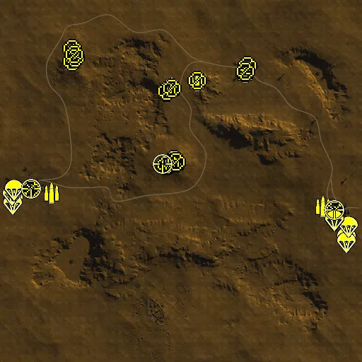
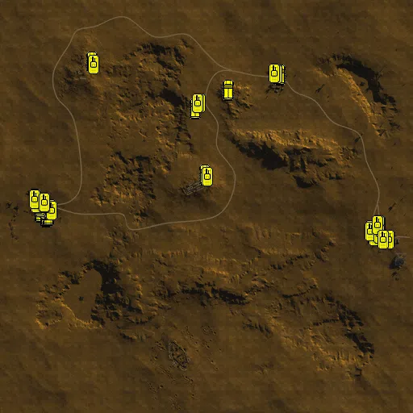

Static Ammo Crate

Pickup Kit

Static Emplacement

Vehicle

| Icon                       | SubCat            | Cat                | Name                       | Instance                                            |   Flag |     X Pos |   Y Pos |    Z Pos |
|:---------------------------|:------------------|:-------------------|:---------------------------|:----------------------------------------------------|-------:|----------:|--------:|---------:|
|      | Static Ammo Crate | Static Ammo Crate  | ammo_crate                 | ammo_crate_0                                        |      0 |   -49.528 |  25.209 |  525.173 |
|      | Static Ammo Crate | Static Ammo Crate  | ammo_crate                 | ammo_crate_1                                        |      0 |    92.385 |  34.398 |  569.080 |
|      | Static Ammo Crate | Static Ammo Crate  | ammo_crate                 | ammo_crate_2                                        |      0 |   362.960 |  21.033 |  619.169 |
|      | Static Ammo Crate | Static Ammo Crate  | ammo_crate                 | ammo_crate_3                                        |      0 |   -27.552 |  48.914 |  106.816 |
|      | Static Ammo Crate | Static Ammo Crate  | ammo_crate                 | ammo_crate_4                                        |      0 |  -606.685 |  44.556 |  717.933 |
|      | Ammo Kit          | Pickup Kit         | BA_PickUpAmmokit           | CP_64_Gazala_SidiMuftan_DE_GB_Ammo                  |    305 |  -606.312 |  44.556 |  718.956 |
|      | Ammo Kit          | Pickup Kit         | BA_PickUpAmmokit           | CP_64_Gazala_150thBox_DE_GB_Ammo                    |    304 |   -28.521 |  48.917 |  106.491 |
|      | Ammo Kit          | Pickup Kit         | BA_PickUpAmmokit           | CP_64_Gazala_Acroma_DE_GB_Ammo                      |    306 |   362.737 |  21.033 |  617.909 |
|      | Ammo Kit          | Pickup Kit         | GA_PickUpAmmokit           | CP_64_Gazala_TrighCapuzzo_DE_GB_Ammo                |    303 |  -730.788 |  21.866 |  -69.073 |
|      | Ammo Kit          | Pickup Kit         | BA_PickUpAmmokit           | CP_64_Gazala_ElAdem_DE_GB_Ammo_0                    |    302 |   802.935 |  29.882 | -145.589 |
|      | Ammo Kit          | Pickup Kit         | BA_PickUpAmmokit           | CP_64_Gazala_Knightsbridge_DE_GB_Ammo               |    308 |    91.539 |  34.398 |  568.895 |
|      | Ammo Kit          | Pickup Kit         | BA_PickUpAmmokit           | CP_64_Gazala_Knightsbridge_DE_GB_Ammo_0             |    308 |   -50.682 |  25.254 |  526.384 |
|      | Ammo Kit          | Pickup Kit         | BA_PickUpAmmokit           | CP_64_Gazala_ElAdem_DE_GB_Ammo                      |    302 |   940.085 |  32.151 | -291.094 |
|  | Deployable Arty   | Pickup Kit         | BA_PickUpMortar            | CP_64_Gazala_Knightsbridge_DE_GB_MortarDep          |    308 |   -82.817 |  26.673 |  502.979 |
|  | Deployable Arty   | Pickup Kit         | BA_PickUpMortar            | CP_64_Gazala_150thBox_DE_GB_MortarDep               |    304 |   -74.829 |  48.081 |   93.114 |
|  | Deployable Arty   | Pickup Kit         | BA_PickUpMortar            | CP_64_Gazala_SidiMuftan_DE_GB_MortarDep             |    305 |  -617.803 |  46.629 |  688.135 |
|  | Deployable Arty   | Pickup Kit         | GA_PickUpMortar            | CP_64_Gazala_TrighCapuzzo_DE_GB_MortarDep           |    303 |  -847.828 |  18.394 |  -42.630 |
|  | Deployable Arty   | Pickup Kit         | BA_PickUpMortar            | CP_64_Gazala_ElAdem_DE_GB_MortarDep                 |    302 |   869.053 |  31.324 | -166.481 |
|    | AT Rifle          | Pickup Kit         | BA_PickUpAntitankBoys      | CP_64_Gazala_Acroma_DE_GB_ATrifle                   |    306 |   375.146 |  20.760 |  651.615 |
|    | AT Rifle          | Pickup Kit         | BA_PickUpAntitankBoys      | CP_64_Gazala_SidiMuftan_DE_GB_ATrifle               |    305 |  -615.372 |  45.088 |  746.009 |
|    | AT Rifle          | Pickup Kit         | BA_PickUpAntitankBoys      | CP_64_Gazala_150thBox_DE_GB_ATrifle_0               |    304 |   -85.867 |  46.561 |   87.267 |
|    | AT Rifle          | Pickup Kit         | BA_PickUpAntitankBoys      | CP_64_Gazala_150thBox_DE_GB_ATrifle                 |    304 |   -27.452 |  48.923 |  105.379 |
|    | AT Rifle          | Pickup Kit         | BA_PickUpAntitankBoys      | CP_64_Gazala_150thBox_DE_GB_ATrifle_2               |    304 |   -41.902 |  48.758 |  121.464 |
|    | AT Rifle          | Pickup Kit         | BA_PickUpAntitankBoys      | CP_64_Gazala_150thBox_DE_GB_ATrifle_1               |    304 |   -61.119 |  49.143 |  101.385 |
|    | AT Rifle          | Pickup Kit         | BA_PickUpAntitankBoys      | CP_64_Gazala_150thBox_DE_GB_ATrifle_3               |    304 |   -82.636 |  47.475 |   92.618 |
|    | AT Rifle          | Pickup Kit         | BA_PickUpAntitankBoys      | CP_64_Gazala_Knightsbridge_DE_GB_ATrifle_0          |    308 |   -79.297 |  26.419 |  509.491 |
|    | AT Rifle          | Pickup Kit         | BA_PickUpAntitankBoys      | CP_64_Gazala_Knightsbridge_DE_GB_ATrifle_1          |    308 |    91.831 |  34.398 |  566.772 |
|    | AT Rifle          | Pickup Kit         | BA_PickUpAntitankBoys      | CP_64_Gazala_Acroma_DE_GB_ATrifle_0                 |    306 |   364.072 |  21.031 |  617.915 |
|    | AT Rifle          | Pickup Kit         | BA_PickUpAntitankBoys      | CP_64_Gazala_SidiMuftan_DE_GB_ATrifle_1             |    305 |  -615.266 |  48.099 |  677.331 |
|    | AT Rifle          | Pickup Kit         | BA_PickUpAntitankBoys      | CP_64_Gazala_SidiMuftan_DE_GB_ATrifle_0             |    305 |  -601.239 |  44.216 |  697.961 |
|    | AT Rifle          | Pickup Kit         | GA_PickUpAntitankPZB39     | CP_64_Gazala_TrighCapuzzo_DE_GB_ATrifle             |    303 |  -850.268 |  18.288 |  -44.886 |
|    | AT Rifle          | Pickup Kit         | BA_PickUpAntitankBoys      | CP_64_Gazala_ElAdem_DE_GB_ATrifle                   |    302 |   870.087 |  31.337 | -165.392 |
|    | AT Rifle          | Pickup Kit         | BA_PickUpAntitankBoys      | CP_64_Gazala_Knightsbridge_DE_GB_ATrifle            |    308 |   -50.248 |  25.236 |  524.529 |
|       | Deployable MG     | Pickup Kit         | BA_PickUpVickers303        | CP_64_Gazala_SidiMuftan_DE_GB_LMGDeploy             |    305 |  -605.789 |  44.556 |  717.162 |
|       | Deployable MG     | Pickup Kit         | BA_PickUpVickers303        | CP_64_Gazala_Knightsbridge_DE_GB_LMGDeploy          |    308 |    93.260 |  34.398 |  568.861 |
|       | Deployable MG     | Pickup Kit         | BA_PickUpVickers303        | CP_64_Gazala_Acroma_DE_GB_LMGDeploy                 |    306 |   362.637 |  21.033 |  621.158 |
|       | Deployable MG     | Pickup Kit         | BA_PickUpVickers303        | CP_64_Gazala_150thBox_DE_GB_LMGDeploy               |    304 |   -26.798 |  48.914 |  106.899 |
|      | Parachute Kit     | Pickup Kit         | GA_PickUpPilotP08          | CP_64_Gazala_TrighCapuzzo_DE_GB_Pilot_1             |    303 |  -957.263 |  15.356 |  -80.411 |
|      | Parachute Kit     | Pickup Kit         | GA_PickUpPilotP08          | CP_64_Gazala_TrighCapuzzo_DE_GB_Pilot_2             |    303 |  -949.342 |  16.153 | -105.234 |
|      | Parachute Kit     | Pickup Kit         | GA_PickUpPilotP08          | CP_64_Gazala_TrighCapuzzo_DE_GB_Pilot_3             |    303 |  -950.055 |  17.434 | -130.017 |
|      | Parachute Kit     | Pickup Kit         | BA_PickUpPilotWebley       | CP_64_Gazala_ElAdem_DE_GB_Pilot_1                   |    302 |   935.403 |  30.140 | -318.494 |
|      | Parachute Kit     | Pickup Kit         | BA_PickUpPilotWebley       | CP_64_Gazala_ElAdem_DE_GB_Pilot_2                   |    302 |   937.280 |  30.509 | -346.737 |
|      | Parachute Kit     | Pickup Kit         | GA_PickUpPilotP08          | CP_64_Gazala_TrighCapuzzo_DE_GB_Pilot_4             |    303 |  -955.441 |  15.319 |  -81.682 |
|      | Parachute Kit     | Pickup Kit         | BA_PickUpPilotWebley       | CP_64_Gazala_ElAdem_DE_GB_Pilot                     |    302 |   946.516 |  32.153 | -258.742 |
|      | Parachute Kit     | Pickup Kit         | GA_PickUpPilotP08          | CP_64_Gazala_TrighCapuzzo_DE_GB_Pilot               |    303 |  -944.788 |  16.069 |  -54.064 |
|      | Parachute Kit     | Pickup Kit         | GA_PickUpPilotP08          | CP_64_Gazala_TrighCapuzzo_DE_GB_Pilot_0             |    303 |  -945.009 |  16.144 |  -51.993 |
|      | Parachute Kit     | Pickup Kit         | BA_PickUpPilotWebley       | CP_64_Gazala_ElAdem_DE_GB_Pilot_0                   |    302 |   867.062 |  26.550 | -226.754 |
|      | Parachute Kit     | Pickup Kit         | BA_PickUpPilotWebley       | CP_64_Gazala_ElAdem_DE_GB_Pilot_3                   |    302 |   869.705 |  26.559 | -224.722 |
|    | Sniper Kit        | Pickup Kit         | BA_PickUpSniperNo4         | CP_64_Gazala_150thBox_DE_GB_Sniper_0                |    304 |  -105.660 |  46.952 |   94.469 |
|    | Sniper Kit        | Pickup Kit         | GA_PickUpSniperK98         | CP_64_Gazala_TrighCapuzzo_DE_GB_Sniper              |    303 |  -849.098 |  18.343 |  -43.525 |
|    | Sniper Kit        | Pickup Kit         | BA_PickUpSniperNo4         | CP_64_Gazala_ElAdem_DE_GB_Sniper                    |    302 |   869.173 |  31.324 | -163.641 |
|      | FIXME UNASSIGNED  | FIXME UNASSIGNED   | commander_artillery_allied | CP_64_Gazala_ElAdem_DE_GB_CommArtillery             |    302 |  1043.094 |  29.401 |  450.735 |
|      | FIXME UNASSIGNED  | FIXME UNASSIGNED   | commander_artillery_allied | CP_64_Gazala_ElAdem_DE_GB_CommArtillery_0           |    302 |  1046.429 |  29.393 |  450.505 |
|      | FIXME UNASSIGNED  | FIXME UNASSIGNED   | commander_artillery_allied | CP_64_Gazala_ElAdem_DE_GB_CommArtillery_1           |    302 |  1039.329 |  29.377 |  450.043 |
|      | FIXME UNASSIGNED  | FIXME UNASSIGNED   | commander_artillery_axis   | CP_64_Gazala_TrighCapuzzo_DE_GB_CommArtillery       |    303 | -1146.977 |  26.593 |  329.561 |
|      | FIXME UNASSIGNED  | FIXME UNASSIGNED   | commander_artillery_axis   | CP_64_Gazala_TrighCapuzzo_DE_GB_CommArtillery_0     |    303 | -1139.947 |  26.077 |  310.881 |
|      | FIXME UNASSIGNED  | FIXME UNASSIGNED   | commander_artillery_axis   | CP_64_Gazala_TrighCapuzzo_DE_GB_CommArtillery_1     |    303 | -1148.451 |  26.160 |  321.816 |
|      | FIXME UNASSIGNED  | FIXME UNASSIGNED   | commander_smoke_allied     | CP_64_Gazala_ElAdem_DE_GB_CommSmoke                 |    302 |  1049.163 |  29.031 |  449.359 |
|      | FIXME UNASSIGNED  | FIXME UNASSIGNED   | commander_smoke_axis       | CP_64_Gazala_TrighCapuzzo_DE_GB_CommSmoke           |    303 | -1144.149 |  25.456 |  304.537 |
|      | Artillery         | Static Emplacement | lefh18                     | CP_64_Gazala_TrighCapuzzo_DE_GB_Howitzer            |    303 |  -726.499 |  22.322 |  -74.402 |
|      | Artillery         | Static Emplacement | 25pdr                      | CP_64_Gazala_ElAdem_DE_GB_Howitzer                  |    302 |   799.906 |  30.353 | -142.068 |
|      | Anti-aircraft Gun | Static Emplacement | flak38                     | CP_64_Gazala_TrighCapuzzo_DE_GB_AntiAirSmall        |    303 |  -959.014 |  18.191 | -147.664 |
|      | Anti-aircraft Gun | Static Emplacement | flak18ns                   | CP_64_Gazala_TrighCapuzzo_DE_GB_AntiAirSmall_0      |    303 |  -722.574 |  22.560 |  -57.209 |
|      | Anti-aircraft Gun | Static Emplacement | bofors40mm                 | CP_64_Gazala_SidiMuftan_DE_GB_AntiAirSmall          |    305 |  -614.486 |  43.524 |  722.063 |
|      | Anti-aircraft Gun | Static Emplacement | bofors40mm                 | CP_64_Gazala_150thBox_DE_GB_AntiAirSmall            |    304 |   -57.322 |  49.517 |  103.638 |
|      | Anti-aircraft Gun | Static Emplacement | bofors40mm                 | CP_64_Gazala_ElAdem_DE_GB_AntiAirSmall              |    302 |   943.366 |  30.935 | -303.516 |
|      | Anti-aircraft Gun | Static Emplacement | bofors40mm                 | CP_64_Gazala_Acroma_DE_GB_LightMortar               |    306 |   344.431 |  20.727 |  607.889 |
|      | Anti-aircraft Gun | Static Emplacement | flak18ns                   | CP_64_Gazala_TrighCapuzzo_DE_GB_AntiAirSmall_1      |    303 |  -976.284 |  16.137 |  -96.442 |
|      | Anti-aircraft Gun | Static Emplacement | flak38                     | CP_64_Gazala_TrighCapuzzo_DE_GB_AntiAirSmall_2      |    303 |  -966.698 |  15.759 |  -67.367 |
|       | Anti-tank Gun     | Static Emplacement | 2pdr                       | CP_64_Gazala_150thBox_DE_GB_LightArtillery2         |    304 |   -46.190 |  50.818 |  109.091 |
|       | Anti-tank Gun     | Static Emplacement | 2pdr                       | CP_64_Gazala_150thBox_DE_GB_LightArtillery2_0       |    304 |   -61.120 |  49.087 |  119.249 |
|       | Anti-tank Gun     | Static Emplacement | 2pdr                       | CP_64_Gazala_150thBox_DE_GB_LightArtillery2_1       |    304 |   -90.084 |  49.199 |   86.496 |
|       | Anti-tank Gun     | Static Emplacement | 2pdr                       | CP_64_Gazala_SidiMuftan_DE_GB_LightArtillery2       |    305 |  -638.182 |  47.535 |  670.148 |
|       | Anti-tank Gun     | Static Emplacement | 2pdr                       | CP_64_Gazala_SidiMuftan_DE_GB_LightArtillery2_0     |    305 |  -612.636 |  45.791 |  699.799 |
|       | Anti-tank Gun     | Static Emplacement | 2pdr                       | CP_64_Gazala_Acroma_DE_GB_LightArtillery2           |    306 |   320.460 |  21.149 |  603.784 |
|       | Anti-tank Gun     | Static Emplacement | 2pdr                       | CP_64_Gazala_Acroma_DE_GB_LightArtillery2_0         |    306 |   312.508 |  18.005 |  659.105 |
|       | Anti-tank Gun     | Static Emplacement | 6pdr_static                | CP_64_Gazala_Knightsbridge_DE_GB_LightArtillery     |    308 |    82.943 |  33.705 |  589.758 |
|       | Anti-tank Gun     | Static Emplacement | 2pdr                       | CP_64_Gazala_Knightsbridge_DE_GB_LightArtillery2    |    308 |    80.373 |  34.119 |  558.827 |
|       | Anti-tank Gun     | Static Emplacement | 6pdr_static                | CP_64_Gazala_ElAdem_DE_GB_StaticArtillery           |    302 |   939.393 |  32.521 | -288.582 |
|       | Anti-tank Gun     | Static Emplacement | 6pdr_static                | CP_64_Gazala_ElAdem_DE_GB_StaticArtillery_0         |    302 |   802.059 |  30.968 | -129.807 |
|       | Anti-tank Gun     | Static Emplacement | 2pdr                       | CP_64_Gazala_SidiMuftan_DE_GB_StaticArtillery       |    305 |  -605.987 |  47.471 |  659.469 |
|     | Radio             | Static Emplacement | gercommradio               | CP_64_Gazala_TrighCapuzzo_DE_GB_CommRadio           |    303 |  -819.452 |  18.175 |  -52.507 |
|     | Radio             | Static Emplacement | britcommradio              | CP_64_Gazala_ElAdem_DE_GB_CommRadio                 |    302 |   905.650 |  30.238 | -121.446 |
|     | Radio             | Static Emplacement | britcommradio              | CP_64_Gazala_150thBox_DE_GB_CommRadio               |    304 |   -87.099 |  46.605 |   85.705 |
|     | Radio             | Static Emplacement | britcommradio              | CP_64_Gazala_Knightsbridge_DE_GB_CommRadio          |    308 |    90.918 |  34.009 |  581.376 |
|     | Radio             | Static Emplacement | britcommradio              | CP_64_Gazala_SidiMuftan_DE_GB_CommRadio             |    305 |  -609.986 |  43.290 |  697.615 |
|     | Radio             | Static Emplacement | britcommradio              | CP_64_Gazala_Acroma_DE_GB_CommRadio                 |    306 |   355.051 |  21.539 |  593.287 |
|       | APC               | Vehicle            | universalcarrier_bren      | CP_64_Gazala_Knightsbridge_DE_GB_PersonelCarrier2   |    308 |   -57.006 |  25.281 |  489.268 |
|       | APC               | Vehicle            | universalcarrier_bren      | CP_64_Gazala_Acroma_DE_GB_PersonelCarrier2          |    306 |   362.612 |  20.046 |  654.646 |
|       | APC               | Vehicle            | universalcarrier_bren      | CP_64_Gazala_150thBox_DE_GB_PersonelCarrier2        |    304 |    -7.982 |  40.765 |  161.622 |
|       | APC               | Vehicle            | universalcarrier_bren      | CP_64_Gazala_SidiMuftan_DE_GB_PersonelCarrier2      |    305 |  -567.302 |  38.280 |  719.352 |
|       | APC               | Vehicle            | universalcarrier_bren      | CP_64_Gazala_Knightsbridge_DE_GB_PersonelCarrier2_1 |    308 |   109.564 |  34.401 |  579.286 |
|       | APC               | Vehicle            | universalcarrier_bren      | CP_64_Gazala_ElAdem_DE_GB_Truck_4                   |    302 |   852.103 |  31.176 | -120.212 |
|       | APC               | Vehicle            | universalcarrier_bren      | CP_64_Gazala_ElAdem_DE_GB_PersonelCarrier2          |    302 |   858.355 |  31.037 | -115.005 |
|       | APC               | Vehicle            | universalcarrier_bren      | CP_64_Gazala_ElAdem_DE_GB_PersonelCarrier2_0        |    302 |   856.101 |  30.720 | -109.863 |
|       | Car               | Vehicle            | opelblitz_dak              | CP_64_Gazala_TrighCapuzzo_DE_GB_Truck2              |    303 |  -816.214 |  19.209 |  -23.814 |
|       | Car               | Vehicle            | opelblitz_dak              | CP_64_Gazala_TrighCapuzzo_DE_GB_Truck_0             |    303 |  -824.142 |  19.066 |  -25.051 |
|       | Car               | Vehicle            | opelblitz_dak              | CP_64_Gazala_TrighCapuzzo_DE_GB_Truck               |    303 |  -794.224 |  18.762 |  -46.671 |
|       | Car               | Vehicle            | opelblitz_dak              | CP_64_Gazala_TrighCapuzzo_DE_GB_Truck_1             |    303 |  -796.704 |  18.656 |  -41.968 |
|       | Car               | Vehicle            | vwtyp82                    | CP_64_Gazala_TrighCapuzzo_DE_GB_Car                 |    303 |  -783.629 |  18.866 |  -41.432 |
|       | Car               | Vehicle            | willysmb                   | CP_64_Gazala_ElAdem_DE_GB_Car                       |    302 |   850.318 |  30.377 | -105.343 |
|      | Tank              | Vehicle            | pzivf1                     | CP_64_Gazala_TrighCapuzzo_DE_GB_MediumTank          |    303 |  -804.277 |  20.222 |  -12.699 |
|      | Tank              | Vehicle            | pzivf1                     | CP_64_Gazala_TrighCapuzzo_DE_GB_MediumTank_0        |    303 |  -795.399 |  20.234 |  -15.385 |
|      | Tank              | Vehicle            | pziii_jl_dak               | CP_64_Gazala_TrighCapuzzo_DE_GB_LightTank           |    303 |  -784.189 |  20.350 |  -13.191 |
|      | Tank              | Vehicle            | pziic                      | CP_64_Gazala_TrighCapuzzo_DE_GB_LightTank_0         |    303 |  -775.777 |  20.325 |  -13.315 |
|      | Tank              | Vehicle            | pziii_je_dak               | CP_64_Gazala_TrighCapuzzo_DE_GB_HeavyTank           |    303 |  -822.094 |  20.710 |   -2.224 |
|      | Tank              | Vehicle            | pziii_jl_dak               | CP_64_Gazala_TrighCapuzzo_DE_GB_HeavyTank_0         |    303 |  -827.825 |  22.287 |    3.841 |
|      | Tank              | Vehicle            | semoventel40               | CP_64_Gazala_TrighCapuzzo_DE_GB_MediumTank_1        |    303 |  -834.155 |  21.726 |   10.252 |
|      | Tank              | Vehicle            | semoventel40               | CP_64_Gazala_TrighCapuzzo_DE_GB_LightTank_1         |    303 |  -842.210 |  22.509 |   17.665 |
|      | Tank              | Vehicle            | m3grant                    | CP_64_Gazala_ElAdem_DE_GB_HeavyTank                 |    302 |   814.330 |  30.524 | -116.075 |
|      | Tank              | Vehicle            | crusadermk1early           | CP_64_Gazala_ElAdem_DE_GB_MediumTank2               |    302 |   903.872 |  32.203 | -163.066 |
|      | Tank              | Vehicle            | M3Grant                    | CP_64_Gazala_ElAdem_DE_GB_HeavyTank4                |    302 |   861.306 |  29.396 |  -92.685 |
|      | Tank              | Vehicle            | m3stuarthoney              | CP_64_Gazala_ElAdem_DE_GB_HeavyTank_0               |    302 |   850.179 |  31.725 | -135.701 |
|      | Tank              | Vehicle            | crusadermk1early           | CP_64_Gazala_ElAdem_DE_GB_LightTank_2               |    302 |   833.923 |  31.549 | -149.388 |
|      | Tank              | Vehicle            | m3stuarthoney              | CP_64_Gazala_Acroma_DE_GB_LightTank_0               |    306 |   347.177 |  19.110 |  656.474 |
|      | Tank              | Vehicle            | m3stuarthoney              | CP_64_Gazala_Acroma_DE_GB_MediumTank2               |    306 |   335.157 |  18.318 |  658.333 |
|      | Tank              | Vehicle            | m3stuarthoney              | CP_64_Gazala_Knightsbridge_DE_GB_LightTank          |    308 |   -32.460 |  25.090 |  510.716 |
|      | Tank              | Vehicle            | m3stuarthoney              | CP_64_Gazala_Knightsbridge_DE_GB_MediumTank2        |    308 |   -44.652 |  25.229 |  511.332 |
|      | Tank              | Vehicle            | m3grant                    | CP_64_Gazala_ElAdem_DE_GB_HeavyTank4_0              |    302 |   811.981 |  30.506 | -124.604 |
|      | Tank              | Vehicle            | M3Grant                    | CP_64_Gazala_ElAdem_DE_GB_HeavyTank4_1              |    302 |   854.552 |  29.612 |  -93.733 |
|      | Tank              | Vehicle            | m3stuarthoney              | CP_64_Gazala_ElAdem_DE_GB_HeavyTank4_2              |    302 |   856.687 |  31.761 | -135.387 |
|      | Tank              | Vehicle            | M3Grant                    | CP_64_Gazala_ElAdem_DE_GB_HeavyTank4_4              |    302 |   846.340 |  29.823 |  -93.295 |
|      | Tank              | Vehicle            | crusadermk1early           | CP_64_Gazala_ElAdem_DE_GB_MediumTank2_0             |    302 |   874.818 |  31.701 | -165.647 |
|      | Tank              | Vehicle            | m3stuarthoney              | CP_64_Gazala_SidiMuftan_DE_GB_MediumTank2           |    305 |  -561.631 |  38.058 |  703.949 |
|      | Tank              | Vehicle            | crusadermk1early           | CP_64_Gazala_150thBox_DE_GB_MediumTank2             |    304 |     4.674 |  41.889 |  149.398 |
|      | Tank              | Vehicle            | pziii_jl_dak               | CP_64_Gazala_TrighCapuzzo_DE_GB_MediumTank2         |    303 |  -767.624 |  19.853 |  -19.505 |
|      | Tank              | Vehicle            | carrom13_40                | CP_64_Gazala_TrighCapuzzo_DE_GB_ItalianMedTank      |    303 |  -851.937 |  22.419 |   41.262 |
|      | Tank              | Vehicle            | carrom13_40                | CP_64_Gazala_TrighCapuzzo_DE_GB_ItalianMedTank_0    |    303 |  -851.241 |  22.708 |   36.433 |
|      | Tank              | Vehicle            | pzivf1                     | CP_64_Gazala_TrighCapuzzo_DE_GB_ItalianMedTank_1    |    303 |  -805.239 |  21.391 |   15.652 |
|      | Tank              | Vehicle            | carrom13_40                | CP_64_Gazala_TrighCapuzzo_DE_GB_ItalianMedTank_2    |    303 |  -805.202 |  21.430 |   19.345 |

