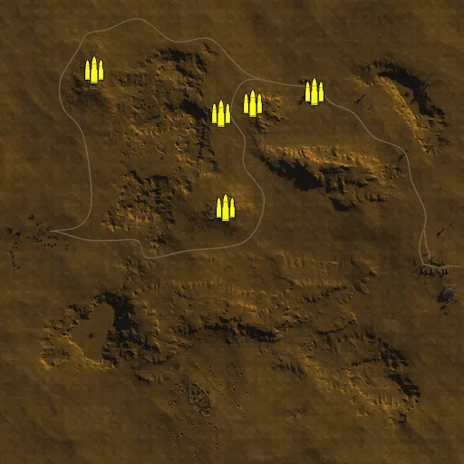
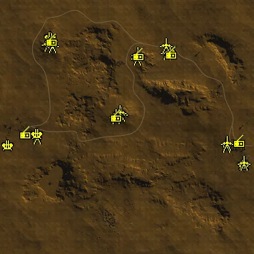
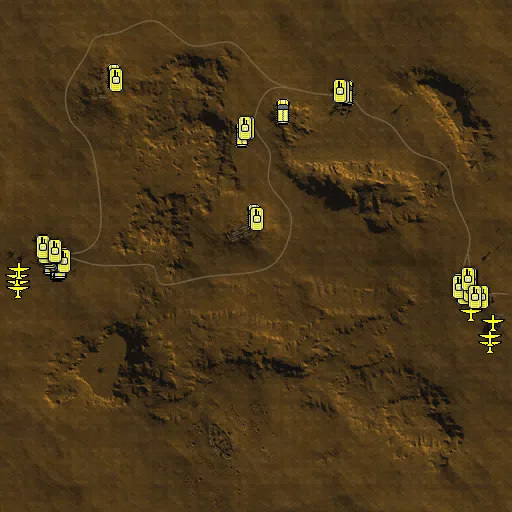

Static Ammo Crate

Pickup Kit

Static Emplacement

Vehicle

| gpo_subcat   | gpo_cat    | gpo_name                   |     pos_x |   pos_y |    pos_z |   flag | is_locked   |   team | instance                                            | gpo_cat_disp       | gpo_subcat_disp   |
|:-------------|:-----------|:---------------------------|----------:|--------:|---------:|-------:|:------------|-------:|:----------------------------------------------------|:-------------------|:------------------|
| ammo_crate   | ammo_crate | ammo_crate                 |   -49.528 |  25.209 |  525.173 |      0 | False       |      0 | ammo_crate_0                                        | Static Ammo Crate  | Static Ammo Crate |
| ammo_crate   | ammo_crate | ammo_crate                 |    92.385 |  34.398 |  569.08  |      0 | False       |      0 | ammo_crate_1                                        | Static Ammo Crate  | Static Ammo Crate |
| ammo_crate   | ammo_crate | ammo_crate                 |   362.96  |  21.033 |  619.169 |      0 | False       |      0 | ammo_crate_2                                        | Static Ammo Crate  | Static Ammo Crate |
| ammo_crate   | ammo_crate | ammo_crate                 |   -27.552 |  48.914 |  106.816 |      0 | False       |      0 | ammo_crate_3                                        | Static Ammo Crate  | Static Ammo Crate |
| ammo_crate   | ammo_crate | ammo_crate                 |  -606.685 |  44.556 |  717.933 |      0 | False       |      0 | ammo_crate_4                                        | Static Ammo Crate  | Static Ammo Crate |
| ammo         | kit        | BA_PickUpAmmokit           |  -606.312 |  44.556 |  718.956 |    305 | False       |      0 | CP_64_Gazala_SidiMuftan_DE_GB_Ammo                  | Pickup Kit         | Ammo Kit          |
| ammo         | kit        | BA_PickUpAmmokit           |   -28.521 |  48.917 |  106.491 |    304 | False       |      0 | CP_64_Gazala_150thBox_DE_GB_Ammo                    | Pickup Kit         | Ammo Kit          |
| ammo         | kit        | BA_PickUpAmmokit           |   362.737 |  21.033 |  617.909 |    306 | False       |      0 | CP_64_Gazala_Acroma_DE_GB_Ammo                      | Pickup Kit         | Ammo Kit          |
| ammo         | kit        | GA_PickUpAmmokit           |  -730.788 |  21.866 |  -69.073 |    303 | False       |      0 | CP_64_Gazala_TrighCapuzzo_DE_GB_Ammo                | Pickup Kit         | Ammo Kit          |
| ammo         | kit        | BA_PickUpAmmokit           |   802.935 |  29.882 | -145.589 |    302 | False       |      0 | CP_64_Gazala_ElAdem_DE_GB_Ammo_0                    | Pickup Kit         | Ammo Kit          |
| ammo         | kit        | BA_PickUpAmmokit           |    91.539 |  34.398 |  568.895 |    308 | False       |      0 | CP_64_Gazala_Knightsbridge_DE_GB_Ammo               | Pickup Kit         | Ammo Kit          |
| ammo         | kit        | BA_PickUpAmmokit           |   -50.682 |  25.254 |  526.384 |    308 | False       |      0 | CP_64_Gazala_Knightsbridge_DE_GB_Ammo_0             | Pickup Kit         | Ammo Kit          |
| ammo         | kit        | BA_PickUpAmmokit           |   940.085 |  32.151 | -291.094 |    302 | False       |      0 | CP_64_Gazala_ElAdem_DE_GB_Ammo                      | Pickup Kit         | Ammo Kit          |
| arty_dep     | kit        | BA_PickUpMortar            |   -82.817 |  26.673 |  502.979 |    308 | False       |      0 | CP_64_Gazala_Knightsbridge_DE_GB_MortarDep          | Pickup Kit         | Deployable Arty   |
| arty_dep     | kit        | BA_PickUpMortar            |   -74.829 |  48.081 |   93.114 |    304 | False       |      0 | CP_64_Gazala_150thBox_DE_GB_MortarDep               | Pickup Kit         | Deployable Arty   |
| arty_dep     | kit        | BA_PickUpMortar            |  -617.803 |  46.629 |  688.135 |    305 | False       |      0 | CP_64_Gazala_SidiMuftan_DE_GB_MortarDep             | Pickup Kit         | Deployable Arty   |
| arty_dep     | kit        | GA_PickUpMortar            |  -847.828 |  18.394 |  -42.63  |    303 | False       |      0 | CP_64_Gazala_TrighCapuzzo_DE_GB_MortarDep           | Pickup Kit         | Deployable Arty   |
| arty_dep     | kit        | BA_PickUpMortar            |   869.053 |  31.324 | -166.481 |    302 | False       |      0 | CP_64_Gazala_ElAdem_DE_GB_MortarDep                 | Pickup Kit         | Deployable Arty   |
| at_rifle     | kit        | BA_PickUpAntitankBoys      |   375.146 |  20.76  |  651.615 |    306 | False       |      0 | CP_64_Gazala_Acroma_DE_GB_ATrifle                   | Pickup Kit         | AT Rifle          |
| at_rifle     | kit        | BA_PickUpAntitankBoys      |  -615.372 |  45.088 |  746.009 |    305 | False       |      0 | CP_64_Gazala_SidiMuftan_DE_GB_ATrifle               | Pickup Kit         | AT Rifle          |
| at_rifle     | kit        | BA_PickUpAntitankBoys      |   -85.867 |  46.561 |   87.267 |    304 | False       |      0 | CP_64_Gazala_150thBox_DE_GB_ATrifle_0               | Pickup Kit         | AT Rifle          |
| at_rifle     | kit        | BA_PickUpAntitankBoys      |   -27.452 |  48.923 |  105.379 |    304 | False       |      0 | CP_64_Gazala_150thBox_DE_GB_ATrifle                 | Pickup Kit         | AT Rifle          |
| at_rifle     | kit        | BA_PickUpAntitankBoys      |   -41.902 |  48.758 |  121.464 |    304 | False       |      0 | CP_64_Gazala_150thBox_DE_GB_ATrifle_2               | Pickup Kit         | AT Rifle          |
| at_rifle     | kit        | BA_PickUpAntitankBoys      |   -61.119 |  49.143 |  101.385 |    304 | False       |      0 | CP_64_Gazala_150thBox_DE_GB_ATrifle_1               | Pickup Kit         | AT Rifle          |
| at_rifle     | kit        | BA_PickUpAntitankBoys      |   -82.636 |  47.475 |   92.618 |    304 | False       |      0 | CP_64_Gazala_150thBox_DE_GB_ATrifle_3               | Pickup Kit         | AT Rifle          |
| at_rifle     | kit        | BA_PickUpAntitankBoys      |   -79.297 |  26.419 |  509.491 |    308 | False       |      0 | CP_64_Gazala_Knightsbridge_DE_GB_ATrifle_0          | Pickup Kit         | AT Rifle          |
| at_rifle     | kit        | BA_PickUpAntitankBoys      |    91.831 |  34.398 |  566.772 |    308 | False       |      0 | CP_64_Gazala_Knightsbridge_DE_GB_ATrifle_1          | Pickup Kit         | AT Rifle          |
| at_rifle     | kit        | BA_PickUpAntitankBoys      |   364.072 |  21.031 |  617.915 |    306 | False       |      0 | CP_64_Gazala_Acroma_DE_GB_ATrifle_0                 | Pickup Kit         | AT Rifle          |
| at_rifle     | kit        | BA_PickUpAntitankBoys      |  -615.266 |  48.099 |  677.331 |    305 | False       |      0 | CP_64_Gazala_SidiMuftan_DE_GB_ATrifle_1             | Pickup Kit         | AT Rifle          |
| at_rifle     | kit        | BA_PickUpAntitankBoys      |  -601.239 |  44.216 |  697.961 |    305 | False       |      0 | CP_64_Gazala_SidiMuftan_DE_GB_ATrifle_0             | Pickup Kit         | AT Rifle          |
| at_rifle     | kit        | GA_PickUpAntitankPZB39     |  -850.268 |  18.288 |  -44.886 |    303 | False       |      0 | CP_64_Gazala_TrighCapuzzo_DE_GB_ATrifle             | Pickup Kit         | AT Rifle          |
| at_rifle     | kit        | BA_PickUpAntitankBoys      |   870.087 |  31.337 | -165.392 |    302 | False       |      0 | CP_64_Gazala_ElAdem_DE_GB_ATrifle                   | Pickup Kit         | AT Rifle          |
| at_rifle     | kit        | BA_PickUpAntitankBoys      |   -50.248 |  25.236 |  524.529 |    308 | False       |      0 | CP_64_Gazala_Knightsbridge_DE_GB_ATrifle            | Pickup Kit         | AT Rifle          |
| mg_dep       | kit        | BA_PickUpVickers303        |  -605.789 |  44.556 |  717.162 |    305 | False       |      0 | CP_64_Gazala_SidiMuftan_DE_GB_LMGDeploy             | Pickup Kit         | Deployable MG     |
| mg_dep       | kit        | BA_PickUpVickers303        |    93.26  |  34.398 |  568.861 |    308 | False       |      0 | CP_64_Gazala_Knightsbridge_DE_GB_LMGDeploy          | Pickup Kit         | Deployable MG     |
| mg_dep       | kit        | BA_PickUpVickers303        |   362.637 |  21.033 |  621.158 |    306 | False       |      0 | CP_64_Gazala_Acroma_DE_GB_LMGDeploy                 | Pickup Kit         | Deployable MG     |
| mg_dep       | kit        | BA_PickUpVickers303        |   -26.798 |  48.914 |  106.899 |    304 | False       |      0 | CP_64_Gazala_150thBox_DE_GB_LMGDeploy               | Pickup Kit         | Deployable MG     |
| parachute    | kit        | GA_PickUpPilotP08          |  -957.263 |  15.356 |  -80.411 |    303 | False       |      0 | CP_64_Gazala_TrighCapuzzo_DE_GB_Pilot_1             | Pickup Kit         | Parachute Kit     |
| parachute    | kit        | GA_PickUpPilotP08          |  -949.342 |  16.153 | -105.234 |    303 | False       |      0 | CP_64_Gazala_TrighCapuzzo_DE_GB_Pilot_2             | Pickup Kit         | Parachute Kit     |
| parachute    | kit        | GA_PickUpPilotP08          |  -950.055 |  17.434 | -130.017 |    303 | False       |      0 | CP_64_Gazala_TrighCapuzzo_DE_GB_Pilot_3             | Pickup Kit         | Parachute Kit     |
| parachute    | kit        | BA_PickUpPilotWebley       |   935.403 |  30.14  | -318.494 |    302 | False       |      0 | CP_64_Gazala_ElAdem_DE_GB_Pilot_1                   | Pickup Kit         | Parachute Kit     |
| parachute    | kit        | BA_PickUpPilotWebley       |   937.28  |  30.509 | -346.737 |    302 | False       |      0 | CP_64_Gazala_ElAdem_DE_GB_Pilot_2                   | Pickup Kit         | Parachute Kit     |
| parachute    | kit        | GA_PickUpPilotP08          |  -955.441 |  15.319 |  -81.682 |    303 | False       |      0 | CP_64_Gazala_TrighCapuzzo_DE_GB_Pilot_4             | Pickup Kit         | Parachute Kit     |
| parachute    | kit        | BA_PickUpPilotWebley       |   946.516 |  32.153 | -258.742 |    302 | False       |      0 | CP_64_Gazala_ElAdem_DE_GB_Pilot                     | Pickup Kit         | Parachute Kit     |
| parachute    | kit        | GA_PickUpPilotP08          |  -944.788 |  16.069 |  -54.064 |    303 | False       |      0 | CP_64_Gazala_TrighCapuzzo_DE_GB_Pilot               | Pickup Kit         | Parachute Kit     |
| parachute    | kit        | GA_PickUpPilotP08          |  -945.009 |  16.144 |  -51.993 |    303 | False       |      0 | CP_64_Gazala_TrighCapuzzo_DE_GB_Pilot_0             | Pickup Kit         | Parachute Kit     |
| parachute    | kit        | BA_PickUpPilotWebley       |   867.062 |  26.55  | -226.754 |    302 | False       |      0 | CP_64_Gazala_ElAdem_DE_GB_Pilot_0                   | Pickup Kit         | Parachute Kit     |
| parachute    | kit        | BA_PickUpPilotWebley       |   869.705 |  26.559 | -224.722 |    302 | False       |      0 | CP_64_Gazala_ElAdem_DE_GB_Pilot_3                   | Pickup Kit         | Parachute Kit     |
| sniper       | kit        | BA_PickUpSniperNo4         |  -105.66  |  46.952 |   94.469 |    304 | False       |      0 | CP_64_Gazala_150thBox_DE_GB_Sniper_0                | Pickup Kit         | Sniper Kit        |
| sniper       | kit        | GA_PickUpSniperK98         |  -849.098 |  18.343 |  -43.525 |    303 | False       |      0 | CP_64_Gazala_TrighCapuzzo_DE_GB_Sniper              | Pickup Kit         | Sniper Kit        |
| sniper       | kit        | BA_PickUpSniperNo4         |   869.173 |  31.324 | -163.641 |    302 | False       |      0 | CP_64_Gazala_ElAdem_DE_GB_Sniper                    | Pickup Kit         | Sniper Kit        |
| misc         | noidea     | gercommradio               |  -819.452 |  18.175 |  -52.507 |    303 | False       |      0 | CP_64_Gazala_TrighCapuzzo_DE_GB_CommRadio           | FIXME UNASSIGNED   | MISCELLANEOUS     |
| misc         | noidea     | britcommradio              |   905.65  |  30.238 | -121.446 |    302 | False       |      0 | CP_64_Gazala_ElAdem_DE_GB_CommRadio                 | FIXME UNASSIGNED   | MISCELLANEOUS     |
| misc         | noidea     | britcommradio              |   -87.099 |  46.605 |   85.705 |    304 | False       |      0 | CP_64_Gazala_150thBox_DE_GB_CommRadio               | FIXME UNASSIGNED   | MISCELLANEOUS     |
| misc         | noidea     | britcommradio              |    90.918 |  34.009 |  581.376 |    308 | False       |      0 | CP_64_Gazala_Knightsbridge_DE_GB_CommRadio          | FIXME UNASSIGNED   | MISCELLANEOUS     |
| misc         | noidea     | britcommradio              |  -609.986 |  43.29  |  697.615 |    305 | False       |      0 | CP_64_Gazala_SidiMuftan_DE_GB_CommRadio             | FIXME UNASSIGNED   | MISCELLANEOUS     |
| misc         | noidea     | britcommradio              |   355.051 |  21.539 |  593.287 |    306 | False       |      0 | CP_64_Gazala_Acroma_DE_GB_CommRadio                 | FIXME UNASSIGNED   | MISCELLANEOUS     |
| noidea       | noidea     | commander_artillery_allied |  1043.09  |  29.401 |  450.735 |    302 | True        |      0 | CP_64_Gazala_ElAdem_DE_GB_CommArtillery             | FIXME UNASSIGNED   | FIXME UNASSIGNED  |
| noidea       | noidea     | commander_artillery_allied |  1046.43  |  29.393 |  450.505 |    302 | True        |      0 | CP_64_Gazala_ElAdem_DE_GB_CommArtillery_0           | FIXME UNASSIGNED   | FIXME UNASSIGNED  |
| noidea       | noidea     | commander_artillery_allied |  1039.33  |  29.377 |  450.043 |    302 | True        |      0 | CP_64_Gazala_ElAdem_DE_GB_CommArtillery_1           | FIXME UNASSIGNED   | FIXME UNASSIGNED  |
| noidea       | noidea     | commander_artillery_axis   | -1146.98  |  26.593 |  329.561 |    303 | True        |      0 | CP_64_Gazala_TrighCapuzzo_DE_GB_CommArtillery       | FIXME UNASSIGNED   | FIXME UNASSIGNED  |
| noidea       | noidea     | commander_artillery_axis   | -1139.95  |  26.077 |  310.881 |    303 | True        |      0 | CP_64_Gazala_TrighCapuzzo_DE_GB_CommArtillery_0     | FIXME UNASSIGNED   | FIXME UNASSIGNED  |
| noidea       | noidea     | commander_artillery_axis   | -1148.45  |  26.16  |  321.816 |    303 | True        |      0 | CP_64_Gazala_TrighCapuzzo_DE_GB_CommArtillery_1     | FIXME UNASSIGNED   | FIXME UNASSIGNED  |
| noidea       | noidea     | commander_smoke_allied     |  1049.16  |  29.031 |  449.359 |    302 | True        |      0 | CP_64_Gazala_ElAdem_DE_GB_CommSmoke                 | FIXME UNASSIGNED   | FIXME UNASSIGNED  |
| noidea       | noidea     | commander_smoke_axis       | -1144.15  |  25.456 |  304.537 |    303 | True        |      0 | CP_64_Gazala_TrighCapuzzo_DE_GB_CommSmoke           | FIXME UNASSIGNED   | FIXME UNASSIGNED  |
| arty         | static     | lefh18                     |  -726.499 |  22.322 |  -74.402 |    303 | False       |      0 | CP_64_Gazala_TrighCapuzzo_DE_GB_Howitzer            | Static Emplacement | Artillery         |
| arty         | static     | 25pdr                      |   799.906 |  30.353 | -142.068 |    302 | False       |      0 | CP_64_Gazala_ElAdem_DE_GB_Howitzer                  | Static Emplacement | Artillery         |
| flak         | static     | flak38                     |  -959.014 |  18.191 | -147.664 |    303 | False       |      0 | CP_64_Gazala_TrighCapuzzo_DE_GB_AntiAirSmall        | Static Emplacement | Anti-aircraft Gun |
| flak         | static     | flak18ns                   |  -722.574 |  22.56  |  -57.209 |    303 | False       |      0 | CP_64_Gazala_TrighCapuzzo_DE_GB_AntiAirSmall_0      | Static Emplacement | Anti-aircraft Gun |
| flak         | static     | bofors40mm                 |  -614.486 |  43.524 |  722.063 |    305 | False       |      0 | CP_64_Gazala_SidiMuftan_DE_GB_AntiAirSmall          | Static Emplacement | Anti-aircraft Gun |
| flak         | static     | bofors40mm                 |   -57.322 |  49.517 |  103.638 |    304 | False       |      0 | CP_64_Gazala_150thBox_DE_GB_AntiAirSmall            | Static Emplacement | Anti-aircraft Gun |
| flak         | static     | bofors40mm                 |   943.366 |  30.935 | -303.516 |    302 | False       |      0 | CP_64_Gazala_ElAdem_DE_GB_AntiAirSmall              | Static Emplacement | Anti-aircraft Gun |
| flak         | static     | bofors40mm                 |   344.431 |  20.727 |  607.889 |    306 | False       |      0 | CP_64_Gazala_Acroma_DE_GB_LightMortar               | Static Emplacement | Anti-aircraft Gun |
| flak         | static     | flak18ns                   |  -976.284 |  16.137 |  -96.442 |    303 | False       |      0 | CP_64_Gazala_TrighCapuzzo_DE_GB_AntiAirSmall_1      | Static Emplacement | Anti-aircraft Gun |
| flak         | static     | flak38                     |  -966.698 |  15.759 |  -67.367 |    303 | False       |      0 | CP_64_Gazala_TrighCapuzzo_DE_GB_AntiAirSmall_2      | Static Emplacement | Anti-aircraft Gun |
| pak          | static     | 2pdr                       |   -46.19  |  50.818 |  109.091 |    304 | False       |      0 | CP_64_Gazala_150thBox_DE_GB_LightArtillery2         | Static Emplacement | Anti-tank Gun     |
| pak          | static     | 2pdr                       |   -61.12  |  49.087 |  119.249 |    304 | False       |      0 | CP_64_Gazala_150thBox_DE_GB_LightArtillery2_0       | Static Emplacement | Anti-tank Gun     |
| pak          | static     | 2pdr                       |   -90.084 |  49.199 |   86.496 |    304 | False       |      0 | CP_64_Gazala_150thBox_DE_GB_LightArtillery2_1       | Static Emplacement | Anti-tank Gun     |
| pak          | static     | 2pdr                       |  -638.182 |  47.535 |  670.148 |    305 | False       |      0 | CP_64_Gazala_SidiMuftan_DE_GB_LightArtillery2       | Static Emplacement | Anti-tank Gun     |
| pak          | static     | 2pdr                       |  -612.636 |  45.791 |  699.799 |    305 | False       |      0 | CP_64_Gazala_SidiMuftan_DE_GB_LightArtillery2_0     | Static Emplacement | Anti-tank Gun     |
| pak          | static     | 2pdr                       |   320.46  |  21.149 |  603.784 |    306 | False       |      0 | CP_64_Gazala_Acroma_DE_GB_LightArtillery2           | Static Emplacement | Anti-tank Gun     |
| pak          | static     | 2pdr                       |   312.508 |  18.005 |  659.105 |    306 | False       |      0 | CP_64_Gazala_Acroma_DE_GB_LightArtillery2_0         | Static Emplacement | Anti-tank Gun     |
| pak          | static     | 6pdr_static                |    82.943 |  33.705 |  589.758 |    308 | False       |      0 | CP_64_Gazala_Knightsbridge_DE_GB_LightArtillery     | Static Emplacement | Anti-tank Gun     |
| pak          | static     | 2pdr                       |    80.373 |  34.119 |  558.827 |    308 | False       |      0 | CP_64_Gazala_Knightsbridge_DE_GB_LightArtillery2    | Static Emplacement | Anti-tank Gun     |
| pak          | static     | 6pdr_static                |   939.393 |  32.521 | -288.582 |    302 | False       |      0 | CP_64_Gazala_ElAdem_DE_GB_StaticArtillery           | Static Emplacement | Anti-tank Gun     |
| pak          | static     | 6pdr_static                |   802.059 |  30.968 | -129.807 |    302 | False       |      0 | CP_64_Gazala_ElAdem_DE_GB_StaticArtillery_0         | Static Emplacement | Anti-tank Gun     |
| pak          | static     | 2pdr                       |  -605.987 |  47.471 |  659.469 |    305 | False       |      0 | CP_64_Gazala_SidiMuftan_DE_GB_StaticArtillery       | Static Emplacement | Anti-tank Gun     |
| apc          | vehicle    | universalcarrier_bren      |   -57.006 |  25.281 |  489.268 |    308 | False       |      0 | CP_64_Gazala_Knightsbridge_DE_GB_PersonelCarrier2   | Vehicle            | APC               |
| apc          | vehicle    | universalcarrier_bren      |   362.612 |  20.046 |  654.646 |    306 | False       |      0 | CP_64_Gazala_Acroma_DE_GB_PersonelCarrier2          | Vehicle            | APC               |
| apc          | vehicle    | universalcarrier_bren      |    -7.982 |  40.765 |  161.622 |    304 | False       |      0 | CP_64_Gazala_150thBox_DE_GB_PersonelCarrier2        | Vehicle            | APC               |
| apc          | vehicle    | universalcarrier_bren      |  -567.302 |  38.28  |  719.352 |    305 | False       |      0 | CP_64_Gazala_SidiMuftan_DE_GB_PersonelCarrier2      | Vehicle            | APC               |
| apc          | vehicle    | universalcarrier_bren      |   109.564 |  34.401 |  579.286 |    308 | False       |      0 | CP_64_Gazala_Knightsbridge_DE_GB_PersonelCarrier2_1 | Vehicle            | APC               |
| apc          | vehicle    | universalcarrier_bren      |   852.103 |  31.176 | -120.212 |    302 | False       |      0 | CP_64_Gazala_ElAdem_DE_GB_Truck_4                   | Vehicle            | APC               |
| apc          | vehicle    | universalcarrier_bren      |   858.355 |  31.037 | -115.005 |    302 | False       |      0 | CP_64_Gazala_ElAdem_DE_GB_PersonelCarrier2          | Vehicle            | APC               |
| apc          | vehicle    | universalcarrier_bren      |   856.101 |  30.72  | -109.863 |    302 | False       |      0 | CP_64_Gazala_ElAdem_DE_GB_PersonelCarrier2_0        | Vehicle            | APC               |
| car          | vehicle    | opelblitz_dak              |  -816.214 |  19.209 |  -23.814 |    303 | False       |      0 | CP_64_Gazala_TrighCapuzzo_DE_GB_Truck2              | Vehicle            | Car               |
| car          | vehicle    | opelblitz_dak              |  -824.142 |  19.066 |  -25.051 |    303 | False       |      0 | CP_64_Gazala_TrighCapuzzo_DE_GB_Truck_0             | Vehicle            | Car               |
| car          | vehicle    | opelblitz_dak              |  -794.224 |  18.762 |  -46.671 |    303 | False       |      0 | CP_64_Gazala_TrighCapuzzo_DE_GB_Truck               | Vehicle            | Car               |
| car          | vehicle    | opelblitz_dak              |  -796.704 |  18.656 |  -41.968 |    303 | False       |      0 | CP_64_Gazala_TrighCapuzzo_DE_GB_Truck_1             | Vehicle            | Car               |
| car          | vehicle    | vwtyp82                    |  -783.629 |  18.866 |  -41.432 |    303 | False       |      0 | CP_64_Gazala_TrighCapuzzo_DE_GB_Car                 | Vehicle            | Car               |
| car          | vehicle    | willysmb                   |   850.318 |  30.377 | -105.343 |    302 | False       |      0 | CP_64_Gazala_ElAdem_DE_GB_Car                       | Vehicle            | Car               |
| plane        | vehicle    | bf109e7_trop               |  -951.957 |  16.533 | -109.097 |    303 | True        |      0 | CP_64_Gazala_TrighCapuzzo_DE_GB_LightbomberPlane_0  | Vehicle            | Airplane          |
| plane        | vehicle    | ju87d1_trop                |  -952.61  |  17.591 | -133.131 |    303 | True        |      0 | CP_64_Gazala_TrighCapuzzo_DE_GB_FighterPlane        | Vehicle            | Airplane          |
| plane        | vehicle    | hurricanemkiic             |   936.534 |  30.575 | -353.139 |    302 | True        |      0 | CP_64_Gazala_ElAdem_DE_GB_FighterPlane              | Vehicle            | Airplane          |
| plane        | vehicle    | hurricanemkiid             |   934.84  |  30.334 | -325.1   |    302 | True        |      0 | CP_64_Gazala_ElAdem_DE_GB_FighterPlane_0            | Vehicle            | Airplane          |
| plane        | vehicle    | ju87d1_trop                |  -957.24  |  15.307 |  -85.799 |    303 | True        |      0 | CP_64_Gazala_TrighCapuzzo_DE_GB_LightbomberPlane    | Vehicle            | Airplane          |
| plane        | vehicle    | hurricanemkiid             |   949.963 |  31.963 | -263.224 |    302 | True        |      0 | CP_64_Gazala_ElAdem_DE_GB_FighterPlane_1            | Vehicle            | Airplane          |
| plane        | vehicle    | storch_trop                |  -949.088 |  15.942 |  -57.121 |    303 | True        |      0 | CP_64_Gazala_TrighCapuzzo_DE_GB_ScoutPlane          | Vehicle            | Airplane          |
| plane        | vehicle    | pipercub_gb                |   860.36  |  26.744 | -225.306 |    302 | True        |      0 | CP_64_Gazala_ElAdem_DE_GB_ScoutPlane                | Vehicle            | Airplane          |
| tank         | vehicle    | pzivf1                     |  -804.277 |  20.222 |  -12.699 |    303 | True        |      0 | CP_64_Gazala_TrighCapuzzo_DE_GB_MediumTank          | Vehicle            | Tank              |
| tank         | vehicle    | pzivf1                     |  -795.399 |  20.234 |  -15.385 |    303 | True        |      0 | CP_64_Gazala_TrighCapuzzo_DE_GB_MediumTank_0        | Vehicle            | Tank              |
| tank         | vehicle    | pziii_jl_dak               |  -784.189 |  20.35  |  -13.191 |    303 | True        |      0 | CP_64_Gazala_TrighCapuzzo_DE_GB_LightTank           | Vehicle            | Tank              |
| tank         | vehicle    | pziic                      |  -775.777 |  20.325 |  -13.315 |    303 | True        |      0 | CP_64_Gazala_TrighCapuzzo_DE_GB_LightTank_0         | Vehicle            | Tank              |
| tank         | vehicle    | pziii_je_dak               |  -822.094 |  20.71  |   -2.224 |    303 | True        |      0 | CP_64_Gazala_TrighCapuzzo_DE_GB_HeavyTank           | Vehicle            | Tank              |
| tank         | vehicle    | pziii_jl_dak               |  -827.825 |  22.287 |    3.841 |    303 | True        |      0 | CP_64_Gazala_TrighCapuzzo_DE_GB_HeavyTank_0         | Vehicle            | Tank              |
| tank         | vehicle    | semoventel40               |  -834.155 |  21.726 |   10.252 |    303 | True        |      0 | CP_64_Gazala_TrighCapuzzo_DE_GB_MediumTank_1        | Vehicle            | Tank              |
| tank         | vehicle    | semoventel40               |  -842.21  |  22.509 |   17.665 |    303 | True        |      0 | CP_64_Gazala_TrighCapuzzo_DE_GB_LightTank_1         | Vehicle            | Tank              |
| tank         | vehicle    | m3grant                    |   814.33  |  30.524 | -116.075 |    302 | True        |      0 | CP_64_Gazala_ElAdem_DE_GB_HeavyTank                 | Vehicle            | Tank              |
| tank         | vehicle    | crusadermk1early           |   903.872 |  32.203 | -163.066 |    302 | True        |      0 | CP_64_Gazala_ElAdem_DE_GB_MediumTank2               | Vehicle            | Tank              |
| tank         | vehicle    | M3Grant                    |   861.306 |  29.396 |  -92.685 |    302 | True        |      0 | CP_64_Gazala_ElAdem_DE_GB_HeavyTank4                | Vehicle            | Tank              |
| tank         | vehicle    | m3stuarthoney              |   850.179 |  31.725 | -135.701 |    302 | True        |      0 | CP_64_Gazala_ElAdem_DE_GB_HeavyTank_0               | Vehicle            | Tank              |
| tank         | vehicle    | crusadermk1early           |   833.923 |  31.549 | -149.388 |    302 | True        |      0 | CP_64_Gazala_ElAdem_DE_GB_LightTank_2               | Vehicle            | Tank              |
| tank         | vehicle    | m3stuarthoney              |   347.177 |  19.11  |  656.474 |    306 | True        |      0 | CP_64_Gazala_Acroma_DE_GB_LightTank_0               | Vehicle            | Tank              |
| tank         | vehicle    | m3stuarthoney              |   335.157 |  18.318 |  658.333 |    306 | True        |      0 | CP_64_Gazala_Acroma_DE_GB_MediumTank2               | Vehicle            | Tank              |
| tank         | vehicle    | m3stuarthoney              |   -32.46  |  25.09  |  510.716 |    308 | True        |      0 | CP_64_Gazala_Knightsbridge_DE_GB_LightTank          | Vehicle            | Tank              |
| tank         | vehicle    | m3stuarthoney              |   -44.652 |  25.229 |  511.332 |    308 | True        |      0 | CP_64_Gazala_Knightsbridge_DE_GB_MediumTank2        | Vehicle            | Tank              |
| tank         | vehicle    | m3grant                    |   811.981 |  30.506 | -124.604 |    302 | True        |      0 | CP_64_Gazala_ElAdem_DE_GB_HeavyTank4_0              | Vehicle            | Tank              |
| tank         | vehicle    | M3Grant                    |   854.552 |  29.612 |  -93.733 |    302 | True        |      0 | CP_64_Gazala_ElAdem_DE_GB_HeavyTank4_1              | Vehicle            | Tank              |
| tank         | vehicle    | m3stuarthoney              |   856.687 |  31.761 | -135.387 |    302 | True        |      0 | CP_64_Gazala_ElAdem_DE_GB_HeavyTank4_2              | Vehicle            | Tank              |
| tank         | vehicle    | M3Grant                    |   846.34  |  29.823 |  -93.295 |    302 | True        |      0 | CP_64_Gazala_ElAdem_DE_GB_HeavyTank4_4              | Vehicle            | Tank              |
| tank         | vehicle    | crusadermk1early           |   874.818 |  31.701 | -165.647 |    302 | True        |      0 | CP_64_Gazala_ElAdem_DE_GB_MediumTank2_0             | Vehicle            | Tank              |
| tank         | vehicle    | m3stuarthoney              |  -561.631 |  38.058 |  703.949 |    305 | True        |      0 | CP_64_Gazala_SidiMuftan_DE_GB_MediumTank2           | Vehicle            | Tank              |
| tank         | vehicle    | crusadermk1early           |     4.674 |  41.889 |  149.398 |    304 | True        |      0 | CP_64_Gazala_150thBox_DE_GB_MediumTank2             | Vehicle            | Tank              |
| tank         | vehicle    | pziii_jl_dak               |  -767.624 |  19.853 |  -19.505 |    303 | True        |      0 | CP_64_Gazala_TrighCapuzzo_DE_GB_MediumTank2         | Vehicle            | Tank              |
| tank         | vehicle    | carrom13_40                |  -851.937 |  22.419 |   41.262 |    303 | True        |      0 | CP_64_Gazala_TrighCapuzzo_DE_GB_ItalianMedTank      | Vehicle            | Tank              |
| tank         | vehicle    | carrom13_40                |  -851.241 |  22.708 |   36.433 |    303 | True        |      0 | CP_64_Gazala_TrighCapuzzo_DE_GB_ItalianMedTank_0    | Vehicle            | Tank              |
| tank         | vehicle    | pzivf1                     |  -805.239 |  21.391 |   15.652 |    303 | True        |      0 | CP_64_Gazala_TrighCapuzzo_DE_GB_ItalianMedTank_1    | Vehicle            | Tank              |
| tank         | vehicle    | carrom13_40                |  -805.202 |  21.43  |   19.345 |    303 | True        |      0 | CP_64_Gazala_TrighCapuzzo_DE_GB_ItalianMedTank_2    | Vehicle            | Tank              |

