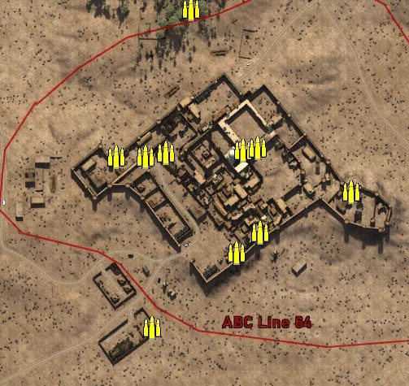
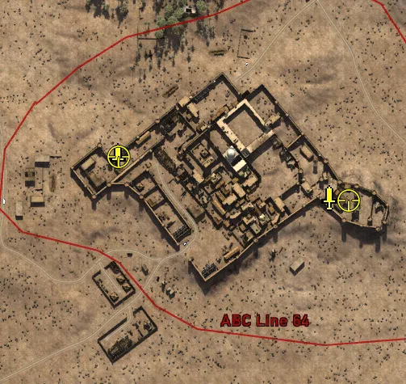
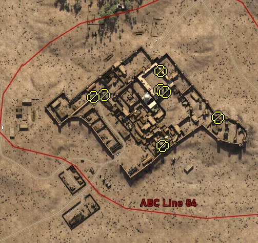

Static Ammo Crate

Pickup Kit

Static Emplacement

| gpo_subcat   | gpo_cat    | gpo_name                    |    pos_x |   pos_y |    pos_z |   flag | is_locked   |   team | instance                                   | gpo_cat_disp       | gpo_subcat_disp   |
|:-------------|:-----------|:----------------------------|---------:|--------:|---------:|-------:|:------------|-------:|:-------------------------------------------|:-------------------|:------------------|
| ammo_crate   | ammo_crate | ammo_crate                  |  -85.61  |  27.811 |  269.707 |      0 | False       |      0 | ammo_crate_0                               | Static Ammo Crate  | Static Ammo Crate |
| ammo_crate   | ammo_crate | ammo_crate                  |  -56.728 |  39.056 |  -45.146 |      0 | False       |      0 | ammo_crate_1                               | Static Ammo Crate  | Static Ammo Crate |
| ammo_crate   | ammo_crate | ammo_crate                  |   38.189 |  41.681 |  -42.096 |      0 | False       |      0 | ammo_crate_2                               | Static Ammo Crate  | Static Ammo Crate |
| ammo_crate   | ammo_crate | ammo_crate                  |  171.452 |  37.472 |  -92.814 |      0 | False       |      0 | ammo_crate_3                               | Static Ammo Crate  | Static Ammo Crate |
| ammo_crate   | ammo_crate | ammo_crate                  |   59.371 |  39.134 | -143.34  |      0 | False       |      0 | ammo_crate_4                               | Static Ammo Crate  | Static Ammo Crate |
| ammo_crate   | ammo_crate | ammo_crate                  |   29.557 |  39.2   | -168.106 |      0 | False       |      0 | ammo_crate_5                               | Static Ammo Crate  | Static Ammo Crate |
| ammo_crate   | ammo_crate | ammo_crate                  | -118.026 |  39.378 |  -50.136 |      0 | False       |      0 | ammo_crate_6                               | Static Ammo Crate  | Static Ammo Crate |
| ammo_crate   | ammo_crate | ammo_crate                  |  -26.479 |  39.305 |  132.231 |      0 | False       |      0 | ammo_crate_7                               | Static Ammo Crate  | Static Ammo Crate |
| ammo_crate   | ammo_crate | ammo_crate                  |   55.81  |  41.682 |  -38.715 |      0 | False       |      0 | ammo_crate_8                               | Static Ammo Crate  | Static Ammo Crate |
| ammo_crate   | ammo_crate | ammo_crate                  |  -82.409 |  40.404 |  -49.834 |      0 | False       |      0 | ammo_crate_9                               | Static Ammo Crate  | Static Ammo Crate |
| ammo_crate   | ammo_crate | ammo_crate                  |  -74.438 |  33.091 | -260.35  |      0 | False       |      0 | ammo_crate_10                              | Static Ammo Crate  | Static Ammo Crate |
| ammo_crate   | ammo_crate | ammo_crate                  | -329.342 |  44.897 | -100.395 |      0 | False       |      0 | ammo_crate_11                              | Static Ammo Crate  | Static Ammo Crate |
| commando     | kit        | IA_PickUpCommandoBeretta38a |  147.313 |  38.035 | -101.501 |    303 | False       |      0 | CP_16_giarabub_mosque_Commando             | Pickup Kit         | Commando Kit      |
| commando     | kit        | BA_PickUpCommandoTommyD     | -114.97  |  40.174 |  -49.835 |    302 | False       |      0 | CP_16_giarabub_AlliedHQ_DE_GB_Commando     | Pickup Kit         | Commando Kit      |
| sniper       | kit        | IA_PickUpSniperPattern      |  170.567 |  37.018 | -105.345 |    303 | False       |      0 | CP_16_giarabub_mosque_Sniper               | Pickup Kit         | Sniper Kit        |
| sniper       | kit        | BA_PickUpSniperNo4          | -113.971 |  39.511 |  -51.461 |    302 | False       |      0 | CP_16_giarabub_AlliedHQ_DE_GB_Sniper       | Pickup Kit         | Sniper Kit        |
| noidea       | noidea     | commander_mortar_allied     |  340.714 |  27.766 | -250.074 |    303 | True        |      0 | CP_16_giarabub_mosque_CommMortar           | FIXME UNASSIGNED   | FIXME UNASSIGNED  |
| noidea       | noidea     | commander_mortar_allied     |  342.82  |  27.727 | -251.557 |    303 | True        |      0 | CP_16_giarabub_mosque_0                    | FIXME UNASSIGNED   | FIXME UNASSIGNED  |
| noidea       | noidea     | commander_mortar_allied     | -297.236 |  37.972 |  -43.053 |    302 | True        |      0 | CP_16_giarabub_AlliedHQ_DE_GB_CommMortar   | FIXME UNASSIGNED   | FIXME UNASSIGNED  |
| noidea       | noidea     | commander_mortar_allied     | -296.83  |  38.493 |  -47.58  |    302 | True        |      0 | CP_16_giarabub_AlliedHQ_DE_GB_CommMortar_0 | FIXME UNASSIGNED   | FIXME UNASSIGNED  |
| mg_nest      | static     | bredam37_bipod              |   52.008 |  42.756 |  -32.628 |    303 | False       |      0 | CP_16_giarabub_mosque_MedMG                | Static Emplacement | Static MG         |
| mg_nest      | static     | bredam37_bipod              |   52.135 |  42.519 |    4.179 |    303 | False       |      0 | CP_16_giarabub_mosque_0_0                  | Static Emplacement | Static MG         |
| mg_nest      | static     | bredam37_bipod              |   61.315 |  37.679 |  -37.078 |    303 | False       |      0 | CP_16_giarabub_mosque_0_1                  | Static Emplacement | Static MG         |
| mg_nest      | static     | bredam37_bipod              |  -58.11  |  40.053 |  -42.855 |    302 | False       |      0 | CP_16_giarabub_AlliedHQ_0_0                | Static Emplacement | Static MG         |
| mg_nest      | static     | bredam37_bipod              |  -79.366 |  44.007 |  -46.969 |    302 | False       |      0 | CP_16_giarabub_AlliedHQ_1                  | Static Emplacement | Static MG         |
| mg_nest      | static     | bredam37_bipod              |  163.79  |  39.246 |  -87.113 |    303 | False       |      0 | CP_16_giarabub_east_MedMG                  | Static Emplacement | Static MG         |
| mg_nest      | static     | bredam37_bipod              |   55.635 |  39.205 | -141.732 |    303 | False       |      0 | CP_16_giarabub_village_MedMG               | Static Emplacement | Static MG         |
| radio        | static     | britcommradio               | -115.317 |  39.371 |  -49.487 |    302 | False       |      0 | CP_16_giarabub_AlliedHQ_CommRadio          | Static Emplacement | Radio             |
| radio        | static     | gercommradio                |  160.518 |  36.886 | -105.964 |    303 | False       |      0 | CP_16_giarabub_east_0                      | Static Emplacement | Radio             |

