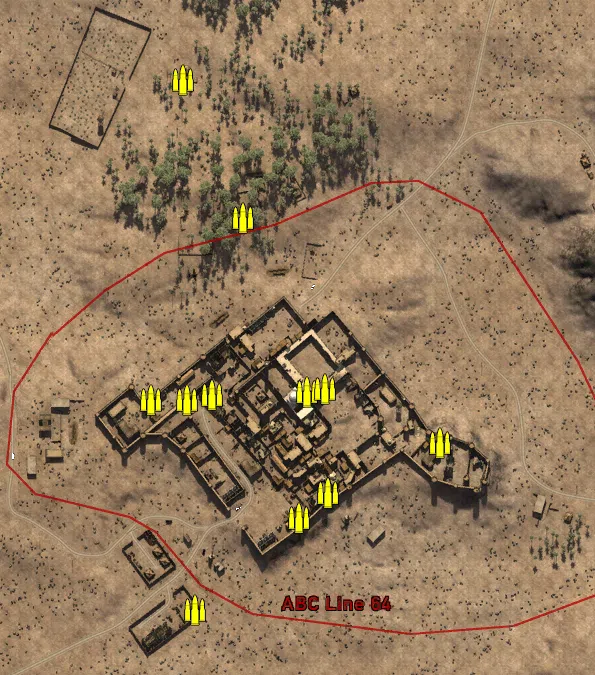
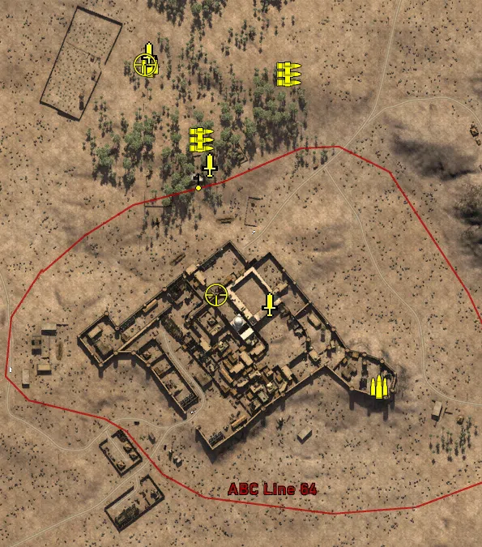
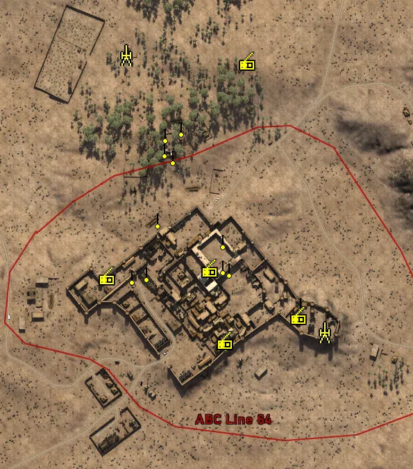

Static Ammo Crate

Pickup Kit

Static Emplacement

| gpo_subcat   | gpo_cat    | gpo_name                    |    pos_x |   pos_y |    pos_z |   flag | is_locked   |   team | instance                                   | gpo_cat_disp       | gpo_subcat_disp   |
|:-------------|:-----------|:----------------------------|---------:|--------:|---------:|-------:|:------------|-------:|:-------------------------------------------|:-------------------|:------------------|
| ammo_crate   | ammo_crate | ammo_crate                  |  -85.61  |  27.811 |  269.707 |      0 | False       |      0 | ammo_crate_0                               | Static Ammo Crate  | Static Ammo Crate |
| ammo_crate   | ammo_crate | ammo_crate                  |  -56.728 |  39.056 |  -45.146 |      0 | False       |      0 | ammo_crate_1                               | Static Ammo Crate  | Static Ammo Crate |
| ammo_crate   | ammo_crate | ammo_crate                  |   38.189 |  41.681 |  -42.096 |      0 | False       |      0 | ammo_crate_2                               | Static Ammo Crate  | Static Ammo Crate |
| ammo_crate   | ammo_crate | ammo_crate                  |  171.452 |  37.472 |  -92.814 |      0 | False       |      0 | ammo_crate_3                               | Static Ammo Crate  | Static Ammo Crate |
| ammo_crate   | ammo_crate | ammo_crate                  |   59.371 |  39.134 | -143.34  |      0 | False       |      0 | ammo_crate_4                               | Static Ammo Crate  | Static Ammo Crate |
| ammo_crate   | ammo_crate | ammo_crate                  |   29.557 |  39.2   | -168.106 |      0 | False       |      0 | ammo_crate_5                               | Static Ammo Crate  | Static Ammo Crate |
| ammo_crate   | ammo_crate | ammo_crate                  | -118.026 |  39.378 |  -50.136 |      0 | False       |      0 | ammo_crate_6                               | Static Ammo Crate  | Static Ammo Crate |
| ammo_crate   | ammo_crate | ammo_crate                  |  -26.479 |  39.305 |  132.231 |      0 | False       |      0 | ammo_crate_7                               | Static Ammo Crate  | Static Ammo Crate |
| ammo_crate   | ammo_crate | ammo_crate                  |   55.81  |  41.682 |  -38.715 |      0 | False       |      0 | ammo_crate_8                               | Static Ammo Crate  | Static Ammo Crate |
| ammo_crate   | ammo_crate | ammo_crate                  |  -82.409 |  40.404 |  -49.834 |      0 | False       |      0 | ammo_crate_9                               | Static Ammo Crate  | Static Ammo Crate |
| ammo_crate   | ammo_crate | ammo_crate                  |  -74.438 |  33.091 | -260.35  |      0 | False       |      0 | ammo_crate_10                              | Static Ammo Crate  | Static Ammo Crate |
| ammo_crate   | ammo_crate | ammo_crate                  | -329.342 |  44.897 | -100.395 |      0 | False       |      0 | ammo_crate_11                              | Static Ammo Crate  | Static Ammo Crate |
| ammo         | kit        | IA_PickUpAmmokit            |  198.693 |  45.91  | -127.038 |    203 | False       |      0 | CP_32_giarabub_east_DE_GB_AmmoCrates       | Pickup Kit         | Ammo Kit          |
| ammo         | kit        | BA_PickUpAmmokit            |  -84.429 |  27.285 |  269.768 |    206 | False       |      0 | CP_32_giarabub_AlliedHQ_DE_GB_AmmoCrates   | Pickup Kit         | Ammo Kit          |
| commando     | kit        | IA_PickUpCommandoBeretta38a |   63.694 |  42.723 |  -25.951 |    201 | False       |      0 | CP_32_giarabub_mosque_Commando             | Pickup Kit         | Commando Kit      |
| commando     | kit        | BA_PickUpCommandoTommyD     |  -85.452 |  27.581 |  282.634 |    206 | False       |      0 | CP_32_giarabub_AlliedHQ_DE_GB_Commando     | Pickup Kit         | Commando Kit      |
| commando     | kit        | BA_PickUpCommandoTommyD     |   -9.765 |  38.697 |  146.013 |    205 | False       |      0 | CP_32_giarabub_oasis_DE_GB_Commando        | Pickup Kit         | Commando Kit      |
| mg           | kit        | BA_PickUpSupportBrenMK1     |   88.132 |  42.763 |  257.638 |    206 | False       |      0 | CP_32_giarabub_AlliedHQ_DE_GB_Support      | Pickup Kit         | MG Kit            |
| mg           | kit        | BA_PickUpSupportLewis       |  -20.295 |  39.252 |  176.815 |    205 | False       |      0 | CP_32_giarabub_oasis_DE_GB_Support2        | Pickup Kit         | MG Kit            |
| mg_dep       | kit        | BA_PickUpVickers303         |  -24.471 |  39.681 |  128.204 |    205 | False       |      0 | CP_32_giarabub_oasis_DE_GB_HSupport        | Pickup Kit         | Deployable MG     |
| sniper       | kit        | IA_PickUpSniperPattern      |   -1.631 |  53.218 |  -14.184 |    201 | False       |      0 | CP_32_giarabub_mosque_Sniper               | Pickup Kit         | Sniper Kit        |
| sniper       | kit        | BA_PickUpSniperNo4          |  -90.412 |  27.708 |  270.147 |    206 | False       |      0 | CP_32_giarabub_AlliedHQ_DE_GB_Sniper       | Pickup Kit         | Sniper Kit        |
| noidea       | noidea     | commander_mortar_allied     |  101.852 |  32.989 | -477.433 |    201 | True        |      0 | CP_32_giarabub_mosque_CommMortar           | FIXME UNASSIGNED   | FIXME UNASSIGNED  |
| noidea       | noidea     | commander_mortar_allied     |  103.958 |  32.983 | -478.916 |    201 | True        |      0 | CP_32_giarabub_mosque_0                    | FIXME UNASSIGNED   | FIXME UNASSIGNED  |
| noidea       | noidea     | commander_mortar_allied     |  -64.272 |  26.912 |  431.916 |    206 | True        |      0 | CP_32_giarabub_AlliedHQ_DE_GB_CommMortar   | FIXME UNASSIGNED   | FIXME UNASSIGNED  |
| noidea       | noidea     | commander_mortar_allied     |  -68.57  |  26.845 |  430.103 |    206 | True        |      0 | CP_32_giarabub_AlliedHQ_DE_GB_CommMortar_0 | FIXME UNASSIGNED   | FIXME UNASSIGNED  |
| noidea       | noidea     | commander_smoke_allied      |  -72.935 |  26.902 |  430.332 |    206 | True        |      0 | CP_32_giarabub_AlliedHQ_DE_GB_CommSmoke    | FIXME UNASSIGNED   | FIXME UNASSIGNED  |
| arty         | static     | sgwr34                      |  197.911 |  45.996 | -128.205 |    205 | False       |      0 | CP_32_giarabub_east_DE_GB_LightMortar      | Static Emplacement | Artillery         |
| arty         | static     | 3inchmortar                 |  -87.788 |  27.293 |  270.787 |    206 | False       |      0 | CP_32_giarabub_AlliedHQ_DE_GB_LightMortar  | Static Emplacement | Artillery         |
| mg_nest      | static     | bredam37_bipod              |   52.008 |  42.756 |  -32.628 |    201 | False       |      0 | CP_32_giarabub_mosque_MedMG                | Static Emplacement | Static MG         |
| mg_nest      | static     | bredam37_bipod              |   52.135 |  42.519 |    4.179 |    201 | False       |      0 | CP_32_giarabub_mosque_0_0                  | Static Emplacement | Static MG         |
| mg_nest      | static     | bredam37_bipod              |   61.315 |  37.679 |  -37.078 |    201 | False       |      0 | CP_32_giarabub_mosque_1_0                  | Static Emplacement | Static MG         |
| mg_nest      | static     | bredam37_bipod              |  -42.064 |  37.78  |   34.204 |    202 | False       |      0 | CP_32_giarabub_barracks_MedMG              | Static Emplacement | Static MG         |
| mg_nest      | static     | bredam37_bipod              |  -58.11  |  40.053 |  -42.855 |    202 | False       |      0 | CP_32_giarabub_barracks_0                  | Static Emplacement | Static MG         |
| mg_nest      | static     | bredam37_bipod              |  -79.366 |  44.007 |  -46.969 |    202 | False       |      0 | CP_32_giarabub_barracks_1                  | Static Emplacement | Static MG         |
| mg_nest      | static     | bredam37_bipod              |  163.79  |  39.246 |  -87.113 |    203 | False       |      0 | CP_32_giarabub_east_MedMG                  | Static Emplacement | Static MG         |
| mg_nest      | static     | bredam37_bipod              |   55.635 |  39.205 | -141.732 |    204 | False       |      0 | CP_32_giarabub_village_MedMG               | Static Emplacement | Static MG         |
| mg_nest      | static     | bredam37_bipod              |  -30.883 |  41.045 |  157.395 |    205 | False       |      0 | CP_32_giarabub_oasis_DE_GB_MedMG           | Static Emplacement | Static MG         |
| mg_nest      | static     | bredam37_bipod              |   -7.746 |  40.039 |  166.341 |    205 | False       |      0 | CP_32_giarabub_oasis_DE_GB_MedMG_0         | Static Emplacement | Static MG         |
| mg_nest      | static     | bredam37_bipod              |  -31.954 |  39.941 |  135.404 |    205 | False       |      0 | CP_32_giarabub_oasis_DE_GB_MedMG_1         | Static Emplacement | Static MG         |
| mg_nest      | static     | lewis_bipod                 |  -20.011 |  39.873 |  124.738 |    205 | False       |      0 | CP_32_giarabub_oasis_DE_GB_LightMG         | Static Emplacement | Static MG         |
| radio        | static     | gercommradio                |   32.817 |  41.677 |  -38.109 |    201 | False       |      0 | CP_32_giarabub_mosque_CommRadio            | Static Emplacement | Radio             |
| radio        | static     | gercommradio                | -115.317 |  39.371 |  -49.487 |    202 | False       |      0 | CP_32_giarabub_barracks_CommRadio          | Static Emplacement | Radio             |
| radio        | static     | gercommradio                |  160.518 |  36.886 | -105.964 |    203 | False       |      0 | CP_32_giarabub_east_0                      | Static Emplacement | Radio             |
| radio        | static     | gercommradio                |   54.99  |  41.301 | -141.978 |    204 | False       |      0 | CP_32_giarabub_village_CommRadio           | Static Emplacement | Radio             |
| radio        | static     | britcommradio               |   86.701 |  42.68  |  260.359 |    206 | False       |      0 | CP_32_giarabub_AlliedHQ_DE_GB_CommRadio    | Static Emplacement | Radio             |

