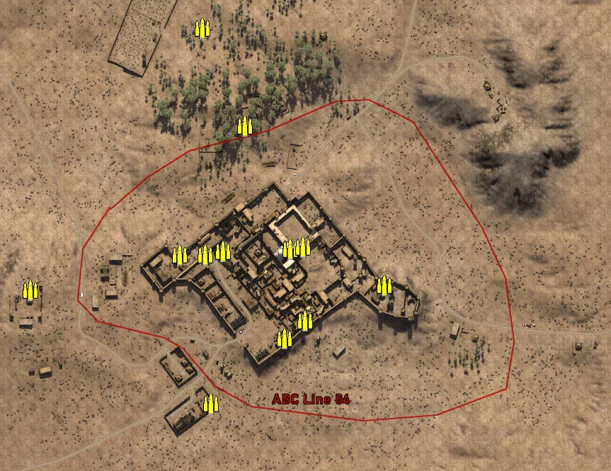
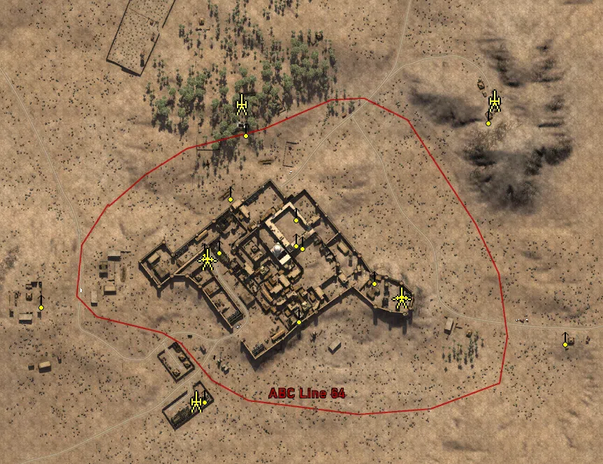
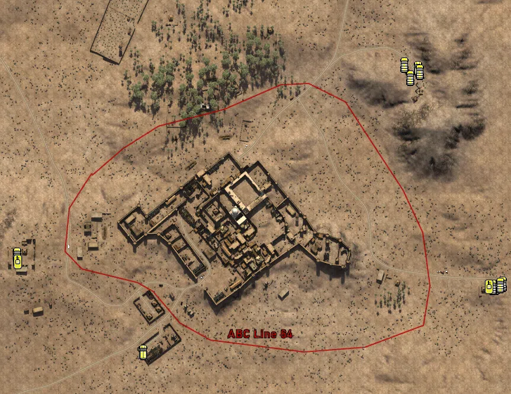

Static Ammo Crate

Pickup Kit

Static Emplacement

Vehicle

| gpo_subcat   | gpo_cat    | gpo_name                    |    pos_x |   pos_y |    pos_z |   flag | is_locked   |   team | instance                                        | gpo_cat_disp       | gpo_subcat_disp   |
|:-------------|:-----------|:----------------------------|---------:|--------:|---------:|-------:|:------------|-------:|:------------------------------------------------|:-------------------|:------------------|
| ammo_crate   | ammo_crate | ammo_crate                  |  -85.61  |  27.811 |  269.707 |      0 | False       |      0 | ammo_crate_0                                    | Static Ammo Crate  | Static Ammo Crate |
| ammo_crate   | ammo_crate | ammo_crate                  |  -56.728 |  39.056 |  -45.146 |      0 | False       |      0 | ammo_crate_1                                    | Static Ammo Crate  | Static Ammo Crate |
| ammo_crate   | ammo_crate | ammo_crate                  |   38.189 |  41.681 |  -42.096 |      0 | False       |      0 | ammo_crate_2                                    | Static Ammo Crate  | Static Ammo Crate |
| ammo_crate   | ammo_crate | ammo_crate                  |  171.452 |  37.472 |  -92.814 |      0 | False       |      0 | ammo_crate_3                                    | Static Ammo Crate  | Static Ammo Crate |
| ammo_crate   | ammo_crate | ammo_crate                  |   59.371 |  39.134 | -143.34  |      0 | False       |      0 | ammo_crate_4                                    | Static Ammo Crate  | Static Ammo Crate |
| ammo_crate   | ammo_crate | ammo_crate                  |   29.557 |  39.2   | -168.106 |      0 | False       |      0 | ammo_crate_5                                    | Static Ammo Crate  | Static Ammo Crate |
| ammo_crate   | ammo_crate | ammo_crate                  | -118.026 |  39.378 |  -50.136 |      0 | False       |      0 | ammo_crate_6                                    | Static Ammo Crate  | Static Ammo Crate |
| ammo_crate   | ammo_crate | ammo_crate                  |  -26.479 |  39.305 |  132.231 |      0 | False       |      0 | ammo_crate_7                                    | Static Ammo Crate  | Static Ammo Crate |
| ammo_crate   | ammo_crate | ammo_crate                  |   55.81  |  41.682 |  -38.715 |      0 | False       |      0 | ammo_crate_8                                    | Static Ammo Crate  | Static Ammo Crate |
| ammo_crate   | ammo_crate | ammo_crate                  |  -82.409 |  40.404 |  -49.834 |      0 | False       |      0 | ammo_crate_9                                    | Static Ammo Crate  | Static Ammo Crate |
| ammo_crate   | ammo_crate | ammo_crate                  |  -74.438 |  33.091 | -260.35  |      0 | False       |      0 | ammo_crate_10                                   | Static Ammo Crate  | Static Ammo Crate |
| ammo_crate   | ammo_crate | ammo_crate                  | -329.342 |  44.897 | -100.395 |      0 | False       |      0 | ammo_crate_11                                   | Static Ammo Crate  | Static Ammo Crate |
| ammo         | kit        | BA_PickUpAmmokit            |  336.956 |  41.241 |  163.044 |    101 | False       |      0 | CP_64_giarabub_east_DE_GB_AmmoCrates            | Pickup Kit         | Ammo Kit          |
| ammo         | kit        | BA_PickUpAmmokit            |  -90.666 |  33.106 | -266.37  |    101 | False       |      0 | CP_64_giarabub_AlliedHQ_DE_GB_AmmoCrates        | Pickup Kit         | Ammo Kit          |
| ammo         | kit        | BA_PickUpAmmokit            |  -27.651 |  39.765 |  158.85  |    101 | False       |      0 | CP_64_giarabub_AlliedHQ_DE_GB_AmmoCrates_0      | Pickup Kit         | Ammo Kit          |
| ammo         | kit        | IA_PickUpAmmokit            |  -79.875 |  39.369 |  -59.087 |    102 | False       |      0 | CP_64_giarabub_barracks_DE_GB_AmmoCrates        | Pickup Kit         | Ammo Kit          |
| at_rifle     | kit        | GA_PickUpAntitankPZB39      |  -54.279 |  39.051 |  -48.589 |    102 | False       |      0 | CP_64_giarabub_barracks_DE_GB_ATrifle           | Pickup Kit         | AT Rifle          |
| at_rifle     | kit        | GA_PickUpAntitankPZB39      |   29.644 |  39.194 | -167.633 |    104 | False       |      0 | CP_64_giarabub_village_DE_GB_ATrifle            | Pickup Kit         | AT Rifle          |
| commando     | kit        | BA_PickUpCommandoTommyD     |   -9.765 |  38.697 |  146.013 |    101 | False       |      0 | CP_64_giarabub_barracks_DE_GB_Commando          | Pickup Kit         | Commando Kit      |
| commando     | kit        | BA_PickUpCommandoTommyD     | -332.541 |  45.648 | -101.01  |    101 | False       |      0 | CP_64_giarabub_AlliedHQ_DE_GB_Commando          | Pickup Kit         | Commando Kit      |
| commando     | kit        | IA_PickUpCommandoBeretta38a |   63.694 |  42.723 |  -25.951 |      1 | False       |      0 | CP_64_giarabub_mosque_DE_GB_Commando            | Pickup Kit         | Commando Kit      |
| commando     | kit        | BA_PickUpCommandoTommyD     |  468.861 |  33.913 | -171.274 |    101 | False       |      0 | CP_64_giarabub_AlliedHQ_DE_GB_Commando_0        | Pickup Kit         | Commando Kit      |
| easteregg    | kit        | AA_PickUpEasterEgg          |   46.642 |  38.244 | -124.218 |    104 | False       |      0 | CP_64_giarabub_village_DE_GB_Indiana            | Pickup Kit         | Easteregg         |
| mg           | kit        | BA_PickUpSupportBrenMK1     |  -74.235 |  33.229 | -261.626 |    101 | False       |      0 | CP_64_giarabub_AlliedHQ_DE_GB_Support           | Pickup Kit         | MG Kit            |
| mg           | kit        | BA_PickUpSupportBrenMK1     | -327.821 |  45.074 | -116.736 |    101 | False       |      0 | CP_64_giarabub_AlliedHQ_DE_GB_Support_0         | Pickup Kit         | MG Kit            |
| mg           | kit        | BA_PickUpSupportLewis       | -315.069 |  45.018 | -107.439 |    101 | False       |      0 | CP_64_giarabub_AlliedHQ_DE_GB_Support2          | Pickup Kit         | MG Kit            |
| mg           | kit        | BA_PickUpSupportLewis       |  -20.295 |  39.252 |  176.815 |    101 | False       |      0 | CP_64_giarabub_AlliedHQ_DE_GB_Support2_0        | Pickup Kit         | MG Kit            |
| mg_dep       | kit        | IA_PickUpBredaM37           |  -64.293 |  39.831 |  -42.401 |    102 | False       |      0 | CP_64_giarabub_barracks_IT_GB_HSupport          | Pickup Kit         | Deployable MG     |
| sniper       | kit        | BA_PickUpSniperNo4          |  -24.381 |  39.695 |  128.289 |    101 | False       |      0 | CP_64_giarabub_barracks_DE_GB_Sniper            | Pickup Kit         | Sniper Kit        |
| sniper       | kit        | BA_PickUpSniperNo4          | -331.814 |  45.638 | -116.99  |    101 | False       |      0 | CP_64_giarabub_AlliedHQ_DE_GB_Sniper            | Pickup Kit         | Sniper Kit        |
| sniper       | kit        | BA_PickUpSniperNo4          |  448.062 |  32.356 | -176.748 |    101 | False       |      0 | CP_64_giarabub_AlliedHQ_DE_GB_Sniper_0          | Pickup Kit         | Sniper Kit        |
| sniper       | kit        | IA_PickUpSniperPattern      |   -1.631 |  53.218 |  -14.184 |      1 | False       |      0 | CP_64_giarabub_mosque_DE_GB_Sniper              | Pickup Kit         | Sniper Kit        |
| sniper       | kit        | IA_PickUpSniperPattern      |   56.171 |  39.215 | -142.857 |    104 | False       |      0 | CP_64_giarabub_village_DE_GB_Sniper             | Pickup Kit         | Sniper Kit        |
| noidea       | noidea     | commander_artillery_allied  | -398.376 |  33.677 | -473.833 |    101 | True        |      0 | CP_64_giarabub_AlliedHQ_DE_GB_CommArtillery     | FIXME UNASSIGNED   | FIXME UNASSIGNED  |
| noidea       | noidea     | commander_artillery_allied  | -396.945 |  33.958 | -476.403 |    101 | True        |      0 | CP_64_giarabub_AlliedHQ_DE_GB_CommArtillery_0   | FIXME UNASSIGNED   | FIXME UNASSIGNED  |
| noidea       | noidea     | commander_smoke_allied      | -395.576 |  34.206 | -478.626 |    101 | True        |      0 | CP_64_giarabub_AlliedHQ_DE_GB_CommSmoke         | FIXME UNASSIGNED   | FIXME UNASSIGNED  |
| noidea       | noidea     | commander_mortar_allied     |  101.852 |  32.989 | -477.433 |      1 | True        |      0 | CP_64_giarabub_mosque_DE_GB_CommMortar          | FIXME UNASSIGNED   | FIXME UNASSIGNED  |
| noidea       | noidea     | commander_mortar_allied     |  103.958 |  32.983 | -478.916 |      1 | True        |      0 | CP_64_giarabub_mosque_DE_GB_CommMortar_0        | FIXME UNASSIGNED   | FIXME UNASSIGNED  |
| arty         | static     | 25pdr                       |  334.844 |  41.444 |  165.667 |    101 | False       |      0 | CP_64_giarabub_AlliedHQ_DE_GB_Howitzer          | Static Emplacement | Artillery         |
| arty         | static     | 3inchmortar                 |  -92.084 |  33.265 | -265.036 |    101 | False       |      0 | CP_64_giarabub_AlliedHQ_DE_GB_LightMortar       | Static Emplacement | Artillery         |
| arty         | static     | 3inchmortar                 |  -26.824 |  39.81  |  161.345 |    101 | False       |      0 | CP_64_giarabub_mosque_DE_GB_LightMortar         | Static Emplacement | Artillery         |
| mg_nest      | static     | lewis_bipod                 |  -78.628 |  37.619 | -256.806 |    101 | False       |      0 | CP_64_giarabub_AlliedHQ_DE_GB_LightMG           | Static Emplacement | Static MG         |
| mg_nest      | static     | lewis_bipod                 | -313.447 |  49.413 | -121.098 |    101 | False       |      0 | CP_64_giarabub_AlliedHQ_DE_GB_LightMG_0         | Static Emplacement | Static MG         |
| mg_nest      | static     | lewis_bipod                 |  436.729 |  32.306 | -174.072 |    101 | False       |      0 | CP_64_giarabub_east_DE_GB_LightMG               | Static Emplacement | Static MG         |
| mg_nest      | static     | lewis_bipod                 |  -20.011 |  39.873 |  124.738 |    101 | False       |      0 | CP_64_giarabub_mosque_DE_GB_LightMG             | Static Emplacement | Static MG         |
| mg_nest      | static     | bredam37_bipod              |  -42.064 |  37.78  |   34.204 |    102 | False       |      0 | CP_64_giarabub_barracks_DE_GB_MedMG             | Static Emplacement | Static MG         |
| mg_nest      | static     | bredam37_bipod              |  -58.11  |  40.053 |  -42.855 |    102 | False       |      0 | CP_64_giarabub_barracks_DE_GB_MedMG_0           | Static Emplacement | Static MG         |
| mg_nest      | static     | bredam37_bipod              |  -79.366 |  44.007 |  -46.969 |    102 | False       |      0 | CP_64_giarabub_barracks_DE_GB_MedMG_1           | Static Emplacement | Static MG         |
| mg_nest      | static     | bredam37_bipod              |  163.79  |  39.246 |  -87.113 |    103 | False       |      0 | CP_64_giarabub_east_DE_GB_MedMG                 | Static Emplacement | Static MG         |
| mg_nest      | static     | bredam37_bipod              |   52.008 |  42.756 |  -32.628 |      1 | False       |      0 | CP_64_giarabub_mosque_DE_GB_MedMG               | Static Emplacement | Static MG         |
| mg_nest      | static     | bredam37_bipod              |   52.135 |  42.519 |    4.179 |      1 | False       |      0 | CP_64_giarabub_mosque_DE_GB_MedMG_0             | Static Emplacement | Static MG         |
| mg_nest      | static     | bredam37_bipod              |   61.315 |  37.679 |  -37.078 |      1 | False       |      0 | CP_64_giarabub_mosque_DE_GB_MedMG_1             | Static Emplacement | Static MG         |
| mg_nest      | static     | lewis_bipod                 |  327.459 |  42.354 |  143.055 |    101 | False       |      0 | CP_64_giarabub_east_DE_GB_LightMG_0             | Static Emplacement | Static MG         |
| mg_nest      | static     | bredam37_bipod              |   55.635 |  39.205 | -141.732 |    104 | False       |      0 | CP_64_giarabub_village_DE_GB_MedMG              | Static Emplacement | Static MG         |
| pak          | static     | cannone_da_47_32_static     |  -76.222 |  39.431 |  -61.36  |    102 | False       |      0 | CP_64_giarabub_barracks_DE_GB_LightArtillery2   | Static Emplacement | Anti-tank Gun     |
| pak          | static     | cannone_da_47_32            |  202.132 |  36.926 | -116.473 |    103 | False       |      0 | CP_64_giarabub_east_DE_GB_LightArtillery2       | Static Emplacement | Anti-tank Gun     |
| radio        | static     | britcommradio               |  313.863 |  39.479 |  187.23  |    101 | False       |      0 | CP_64_giarabub_east_DE_GB_CommRadio             | Static Emplacement | Radio             |
| radio        | static     | britcommradio               | -108.746 |  33.827 | -200.955 |    101 | False       |      0 | CP_64_giarabub_AlliedHQ_DE_GB_CommRadio         | Static Emplacement | Radio             |
| radio        | static     | gercommradio                |   32.817 |  41.677 |  -38.109 |      1 | False       |      0 | CP_64_giarabub_mosque_DE_GB_CommRadio           | Static Emplacement | Radio             |
| radio        | static     | gercommradio                | -115.317 |  39.371 |  -49.487 |    102 | False       |      0 | CP_64_giarabub_barracks_DE_GB_CommRadio         | Static Emplacement | Radio             |
| radio        | static     | gercommradio                |  160.518 |  36.886 | -105.964 |    103 | False       |      0 | CP_64_giarabub_east_DE_GB_CommRadio_0           | Static Emplacement | Radio             |
| radio        | static     | gercommradio                |   54.99  |  41.301 | -141.978 |    104 | False       |      0 | CP_64_giarabub_village_DE_GB_CommRadio          | Static Emplacement | Radio             |
| apc          | vehicle    | universalcarrier            | -130.344 |  33.292 | -284.063 |    101 | False       |      0 | CP_64_giarabub_AlliedHQ_DE_GB_PersonelCarrier   | Vehicle            | APC               |
| apc          | vehicle    | universalcarrier            |  333.746 |  40.518 |  195.209 |    101 | False       |      0 | CP_64_giarabub_east_DE_GB_PersonelCarrier       | Vehicle            | APC               |
| apc          | vehicle    | universalcarrier            |  464.772 |  32.716 | -174.435 |    101 | False       |      0 | CP_64_giarabub_east_DE_GB_PersonelCarrier_0     | Vehicle            | APC               |
| apc          | vehicle    | universalcarrier            | -342.96  |  45.719 | -126.471 |    101 | False       |      0 | CP_64_giarabub_AlliedHQ_DE_GB_PersonelCarrier_0 | Vehicle            | APC               |
| car          | vehicle    | willysmbsas                 |  476.93  |  33.347 | -168.594 |    101 | True        |      0 | CP_64_giarabub_AlliedHQ_DE_GB_CarCommando       | Vehicle            | Car               |
| car          | vehicle    | chevy30cwt                  | -342.511 |  45.637 | -120.07  |    101 | True        |      0 | CP_64_giarabub_AlliedHQ_DE_GB_HeavyTruck        | Vehicle            | Car               |
| car          | vehicle    | willysmbsas                 |  321.47  |  40.022 |  178.715 |    101 | True        |      0 | CP_64_giarabub_east_DE_GB_CarCommando           | Vehicle            | Car               |
| car          | vehicle    | chevy30cwt                  |  336.59  |  41.053 |  188.792 |    101 | True        |      0 | CP_64_giarabub_east_DE_GB_HeavyTruck            | Vehicle            | Car               |
| car          | vehicle    | chevy30cwt                  |  460.416 |  32.489 | -174.39  |    101 | True        |      0 | CP_64_giarabub_east_DE_GB_HeavyTruck_0          | Vehicle            | Car               |
| car          | vehicle    | bedfordoyd_nocanvas         |  311.222 |  38.658 |  201.361 |    101 | False       |      0 | CP_64_giarabub_mosque_DE_GB_Truck               | Vehicle            | Car               |
| car          | vehicle    | bedfordoyd_nocanvas         |  473.488 |  33.186 | -170.899 |    101 | False       |      0 | CP_64_giarabub_east_DE_GB_Truck                 | Vehicle            | Car               |
| tank         | vehicle    | markvi                      |  454.264 |  31.728 | -173.507 |    101 | True        |      0 | CP_64_giarabub_east_DE_GB_LightArmour2          | Vehicle            | Tank              |
| tank         | vehicle    | markvi                      | -341.906 |  45.667 | -132.177 |    101 | True        |      0 | CP_64_giarabub_AlliedHQ_DE_GB_LightArmour2      | Vehicle            | Tank              |

