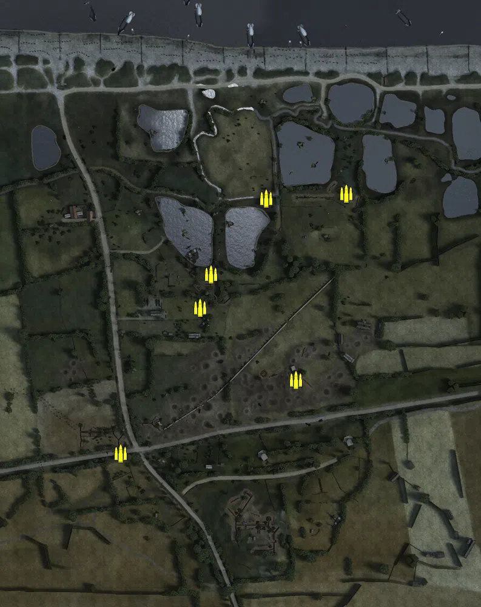
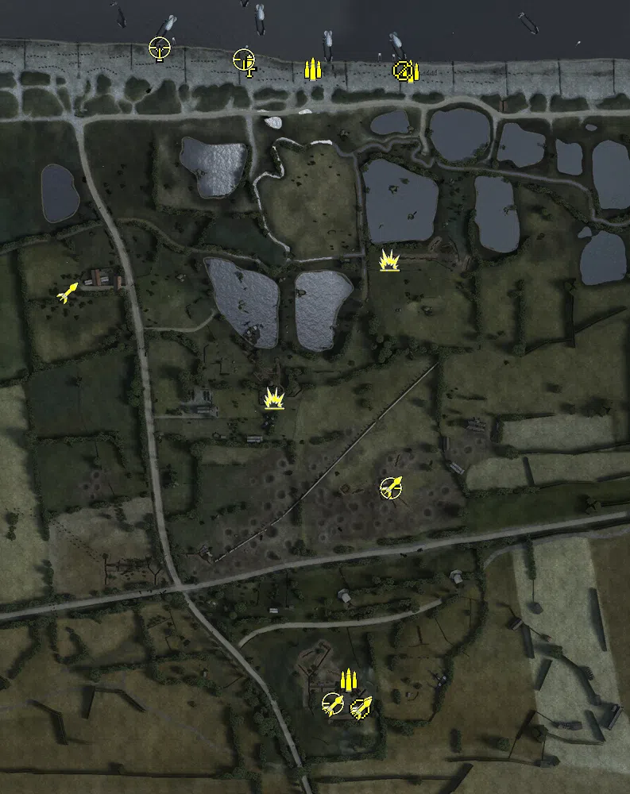
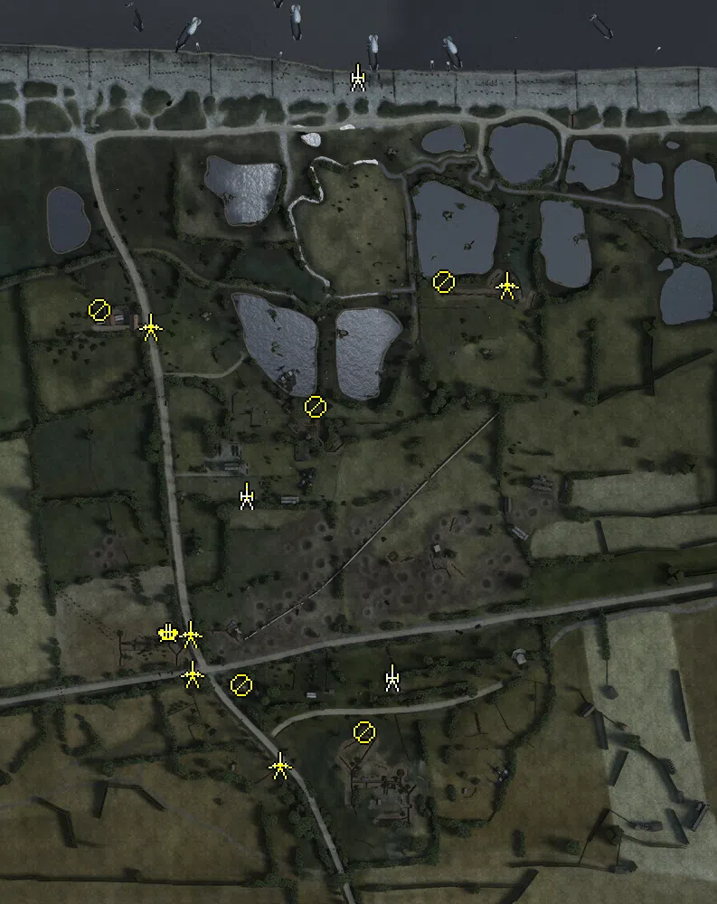
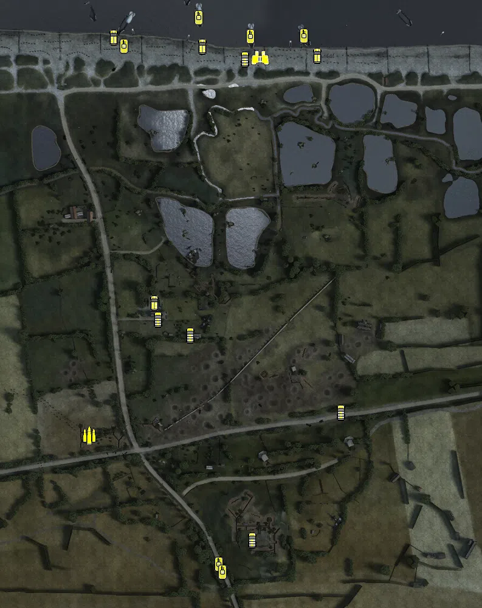

Static Ammo Crate

Pickup Kit

Static Emplacement

Vehicle

| gpo_subcat   | gpo_cat    | gpo_name                        |    pos_x |   pos_y |    pos_z |   flag | is_locked   |   team | instance                                        | gpo_cat_disp       | gpo_subcat_disp   |
|:-------------|:-----------|:--------------------------------|---------:|--------:|---------:|-------:|:------------|-------:|:------------------------------------------------|:-------------------|:------------------|
| ammo_crate   | ammo_crate | ammo_crate                      |   20.731 |  16.749 |  182.707 |      0 | False       |      0 | ammo_crate_0                                    | Static Ammo Crate  | Static Ammo Crate |
| ammo_crate   | ammo_crate | ammo_crate                      |  152.946 |  19.124 |  191.028 |      0 | False       |      0 | ammo_crate_1                                    | Static Ammo Crate  | Static Ammo Crate |
| ammo_crate   | ammo_crate | ammo_crate                      |  -69.656 |  19.578 |   57.945 |      0 | False       |      0 | ammo_crate_2                                    | Static Ammo Crate  | Static Ammo Crate |
| ammo_crate   | ammo_crate | ammo_crate                      |  -87.719 |  23.698 |    2.972 |      0 | False       |      0 | ammo_crate_3                                    | Static Ammo Crate  | Static Ammo Crate |
| ammo_crate   | ammo_crate | ammo_crate                      | -219.424 |  28.389 | -237.26  |      0 | False       |      0 | ammo_crate_4                                    | Static Ammo Crate  | Static Ammo Crate |
| ammo_crate   | ammo_crate | ammo_crate                      |   69.739 |  31.607 | -115.877 |      0 | False       |      0 | ammo_crate_5                                    | Static Ammo Crate  | Static Ammo Crate |
| ammo         | kit        | GW_PickUpAmmokit                |   21.492 |  47.902 | -346.197 |    101 | False       |      0 | conq_64_mont_fleury_DE_GB_Ammo                  | Pickup Kit         | Ammo Kit          |
| ammo         | kit        | BW_PickUpAmmokit                |  -24.498 |  11.245 |  423.321 |      1 | False       |      0 | conq_64_british_base_DE_GB_Ammo                 | Pickup Kit         | Ammo Kit          |
| ammo         | kit        | BW_PickUpAmmokit                |   98.935 |  11.786 |  419.78  |      1 | False       |      0 | conq_64_british_base_DE_GB_Ammo_0               | Pickup Kit         | Ammo Kit          |
| antitank     | kit        | GW_PickUpGeballteLadung         |  -72.642 |  21.597 |    9.353 |    102 | False       |      0 | conq_64_beach_head_DE_GB_Gebalte                | Pickup Kit         | Tankhunter Kit    |
| antitank     | kit        | GW_PickUpGeballteLadung         |   71.831 |  15.493 |  182.607 |    103 | False       |      0 | conq_64_swamps_DE_GB_Gebalt                     | Pickup Kit         | Tankhunter Kit    |
| arty_dep     | kit        | BA_PickUpMortar                 | -217.728 |  11.239 |  445.213 |      1 | False       |      0 | conq_64_british_base_DE_GB_Mortar               | Pickup Kit         | Deployable Arty   |
| commando     | kit        | BW_PickUpCommandoStenMK2S       | -104.422 |  12.216 |  427.302 |      1 | False       |      0 | conq_64_british_base_DE_GB_Commando             | Pickup Kit         | Commando Kit      |
| mg           | kit        | BW_PickUpSupportBrenMK1         |   88.555 |  11.575 |  421.075 |      1 | False       |      0 | conq_64_british_base_DE_GB_DepMG                | Pickup Kit         | MG Kit            |
| mg_dep       | kit        | GW_PickUpMG42Lafette            |   34.778 |  47.731 | -383.235 |    101 | False       |      0 | conq_64_mont_fleury_DE_GB_DepMG                 | Pickup Kit         | Deployable MG     |
| sniper       | kit        | GW_PickUpSniperK98              |    1.293 |  48.029 | -376.024 |    101 | False       |      0 | conq_64_mont_fleury_DE_GB_Sniper                | Pickup Kit         | Sniper Kit        |
| sniper       | kit        | BW_PickUpSniperNo4              | -110.946 |  11.809 |  434.504 |      1 | False       |      0 | conq_64_british_base_DE_GB_Sniper               | Pickup Kit         | Sniper Kit        |
| sniper       | kit        | BW_PickUpSniperNo4              | -216.751 |  11.377 |  450.259 |      1 | False       |      0 | conq_64_british_base_DE_GB_Sniper_0             | Pickup Kit         | Sniper Kit        |
| sniper       | kit        | GW_PickUpSniperK98              |   73.53  |  32.373 | -105.437 |    106 | False       |      0 | conq_64_artillery_observation_post_DE_GB_Sniper | Pickup Kit         | Sniper Kit        |
| zooka        | kit        | GW_PickUpPanzerfaust30m         |   36.651 |  47.699 | -380.439 |    101 | False       |      0 | conq_64_mont_fleury_DE_GB_AntitankFaust         | Pickup Kit         | HEAT Thrower      |
| zooka        | kit        | GW_PickUpPanzerschreck          |    0.796 |  47.886 | -378.692 |    101 | False       |      0 | conq_64_mont_fleury_schreck1                    | Pickup Kit         | HEAT Thrower      |
| zooka        | kit        | GW_PickUpPanzerschreck          |   36.843 |  47.846 | -382.695 |    101 | False       |      0 | conq_64_mont_fleury_schreck2                    | Pickup Kit         | HEAT Thrower      |
| zooka        | kit        | GW_PickUpPanzerschreck          |   75.286 |  31.988 | -102.91  |    106 | False       |      0 | conq_64_artillery_observation_post_schreck      | Pickup Kit         | HEAT Thrower      |
| zooka        | kit        | GW_PickUpPanzerschreck          | -333.014 |  20.144 |  140.766 |    104 | False       |      0 | conq_64_hable_de_heurlot_schreck                | Pickup Kit         | HEAT Thrower      |
| misc         | noidea     | sf14_periscope                  |  -23.856 |  46.381 | -328.835 |    101 | False       |      0 | conq_64_mont_fleury_spot                        | FIXME UNASSIGNED   | MISCELLANEOUS     |
| misc         | noidea     | sf14_periscope                  |  145.978 |  18.38  |  197.195 |    103 | False       |      0 | conq_64_swamps_spot                             | FIXME UNASSIGNED   | MISCELLANEOUS     |
| misc         | noidea     | sf14_periscope                  | -324.832 |  19.301 |  140.65  |    104 | False       |      0 | conq_64_hable_de_heurlot_spot                   | FIXME UNASSIGNED   | MISCELLANEOUS     |
| misc         | noidea     | sf14_periscope                  |   64.009 |  32.46  |  -93.698 |    106 | False       |      0 | conq_64_artillery_observation_post_spot         | FIXME UNASSIGNED   | MISCELLANEOUS     |
| noidea       | noidea     | commander_artillery_allied      |  464.367 |  16.785 |  351.557 |      1 | True        |      0 | conq_64_british_base_arti                       | FIXME UNASSIGNED   | FIXME UNASSIGNED  |
| noidea       | noidea     | commander_artillery_allied      |  459.775 |  17.247 |  355.961 |      1 | True        |      0 | conq_64_british_base_arti2                      | FIXME UNASSIGNED   | FIXME UNASSIGNED  |
| noidea       | noidea     | commander_artillery_allied      |  456.692 |  17.411 |  359.249 |      1 | True        |      0 | conq_64_british_base_arti3                      | FIXME UNASSIGNED   | FIXME UNASSIGNED  |
| noidea       | noidea     | commander_artillery_allied      |  454.185 |  17.564 |  362.344 |      1 | True        |      0 | conq_64_british_base_arti4                      | FIXME UNASSIGNED   | FIXME UNASSIGNED  |
| arty         | static     | 3inchmortar                     |  -23.199 |  11.229 |  425.299 |      1 | False       |      0 | conq_64_british_base_3inch                      | Static Emplacement | Artillery         |
| arty         | static     | lefh18_france                   |   15.037 |  38.726 | -239.384 |    101 | True        |      0 | conq_64_mont_fleury_test_0                      | Static Emplacement | Artillery         |
| arty         | static     | sgwr34_france                   | -145.827 |  26.082 |  -38.237 |    102 | False       |      0 | conq_64_beach_head_werfer                       | Static Emplacement | Artillery         |
| flak         | static     | breda_35_20mm                   | -231.331 |  29.597 | -189.51  |    105 | False       |      0 | conq_64_cross_road_flak                         | Static Emplacement | Anti-aircraft Gun |
| mg_nest      | static     | mg34_lafette                    |   73.306 |  16.865 |  198.179 |    103 | False       |      0 | conq_64_swamps_lafette                          | Static Emplacement | Static MG         |
| mg_nest      | static     | mg34_bipod                      |  -68.732 |  20.579 |   59.805 |    102 | False       |      0 | conq_64_beach_head_mg34                         | Static Emplacement | Static MG         |
| mg_nest      | static     | mg34_lafette                    | -307.707 |  16.882 |  166.65  |    104 | False       |      0 | conq_64_hable_de_heurlot_lafette                | Static Emplacement | Static MG         |
| mg_nest      | static     | mg34_bipod                      | -151.15  |  33.959 | -248.458 |    101 | False       |      0 | conq_64_mont_fleury_mg34                        | Static Emplacement | Static MG         |
| mg_nest      | static     | mg34_bipod                      |  -15.131 |  44.369 | -300.411 |    101 | False       |      0 | conq_64_mont_fleury_mg34_0                      | Static Emplacement | Static MG         |
| pak          | static     | pak40_static                    |  141.92  |  19.413 |  195.072 |    103 | False       |      0 | conq_64_swamps_pak40                            | Static Emplacement | Anti-tank Gun     |
| pak          | static     | pak40                           | -251.546 |  18.136 |  148.734 |    104 | False       |      0 | conq_64_hable_de_heurlot_pak40                  | Static Emplacement | Anti-tank Gun     |
| pak          | static     | pak40_static                    | -208.231 |  30.124 | -190.916 |    105 | False       |      0 | conq_64_cross_road_pak                          | Static Emplacement | Anti-tank Gun     |
| pak          | static     | pak40                           | -108.536 |  38.361 | -335.717 |    101 | False       |      0 | conq_64_mont_fleury_pak40                       | Static Emplacement | Anti-tank Gun     |
| pak          | static     | pak35_stgr41                    | -206.349 |  28.604 | -235.337 |    105 | False       |      0 | conq_64_cross_road_stielgranate                 | Static Emplacement | Anti-tank Gun     |
| apc          | vehicle    | universalcarrier_france_vickers |  104.159 |  11.801 |  418.797 |      1 | False       |      0 | conq_64_british_base_carrier                    | Vehicle            | APC               |
| apc          | vehicle    | universalcarrier_france_bren    |  -84.647 |  10.994 |  434.28  |      1 | False       |      0 | conq_64_british_base_carrier_0                  | Vehicle            | APC               |
| apc          | vehicle    | universalcarrier_wasp           | -231.474 |  11.062 |  448.629 |    104 | False       |      0 | conq_64_beach_head_wasp                         | Vehicle            | APC               |
| apc          | vehicle    | universalcarrier_france_vickers | -164.103 |  23.05  |   11.653 |    102 | False       |      0 | conq_64_beach_head_carrier                      | Vehicle            | APC               |
| car          | vehicle    | bedford_qlt                     |  -15.04  |  11.508 |  413.496 |      1 | False       |      0 | conq_64_british_base_bedford                    | Vehicle            | Car               |
| car          | vehicle    | kettenkrad_fr                   |   -3.127 |  47.873 | -377.955 |    101 | False       |      0 | conq_64_mont_fleury_kettenrad                   | Vehicle            | Car               |
| car          | vehicle    | civcoupe_red                    |  142.968 |  28.255 | -168.285 |    106 | False       |      0 | conq_64_artillery_observation_post_coupe        | Vehicle            | Car               |
| car          | vehicle    | civtruck                        | -158.229 |  24.001 |  -15.076 |    102 | False       |      0 | conq_64_beach_head_civtruck                     | Vehicle            | Car               |
| car          | vehicle    | kettenkrad_fr                   | -104.617 |  25.407 |  -40.534 |    102 | False       |      0 | conq_64_beach_head_kettenrad                    | Vehicle            | Car               |
| recon        | vehicle    | aecdorchester_france            |   10.217 |  11.565 |  414.67  |      1 | True        |      2 | conq_64_british_base_commander                  | Vehicle            | Scout Vehicle     |
| supply       | vehicle    | opelblitz_fr_ammo               | -270.578 |  29.205 | -205.951 |    105 | False       |      0 | conq_64_cross_road_opel                         | Vehicle            | Supply Vehicle    |
| tank         | vehicle    | churchillmkiv_avre              |   81.861 |  10.5   |  451.117 |      1 | True        |      0 | conq_64_british_base_avre                       | Vehicle            | Tank              |
| tank         | vehicle    | churchillmkiv_crocodile         |  -91.081 |  10.5   |  481.263 |      1 | True        |      0 | conq_64_british_base_avre_0                     | Vehicle            | Tank              |
| tank         | vehicle    | marder_iii_m                    |  -58.288 |  42.545 | -417.782 |    101 | True        |      0 | conq_64_mont_fleury_stug                        | Vehicle            | Tank              |
| tank         | vehicle    | marder_iii_m                    |  -52.34  |  43.146 | -430.736 |    101 | True        |      0 | conq_64_mont_fleury_stug_0                      | Vehicle            | Tank              |
| tank         | vehicle    | centaur_iv                      |   -5.507 |  10.5   |  449.987 |    102 | True        |      0 | conq_64_hable_de_heurlot_firefly                | Vehicle            | Tank              |
| tank         | vehicle    | m5a1_stuart_recon               | -213.958 |  11.53  |  434.207 |      1 | True        |      0 | conq_64_british_base_recce                      | Vehicle            | Tank              |

