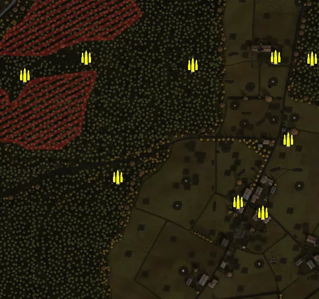
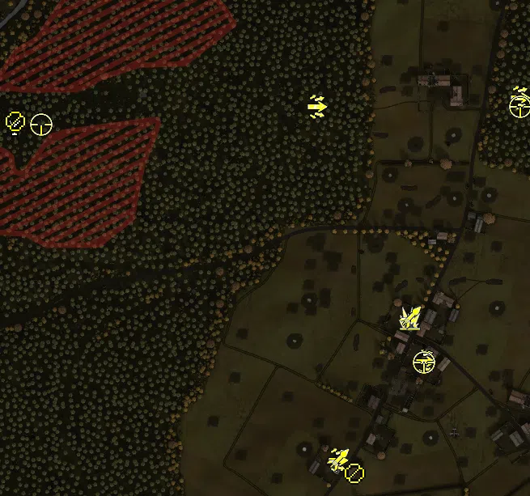
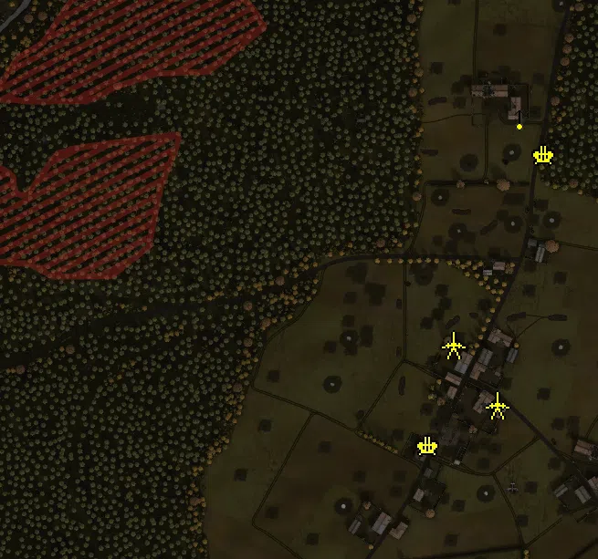
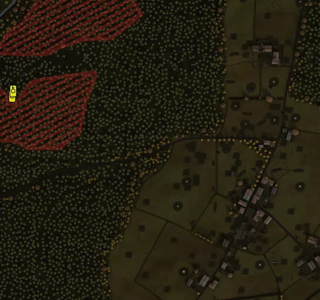

Static Ammo Crate

Pickup Kit

Static Emplacement

Vehicle

| gpo_subcat   | gpo_cat    | gpo_name                           |    pos_x |   pos_y |    pos_z |   flag | is_locked   |   team | instance                             | gpo_cat_disp       | gpo_subcat_disp   |
|:-------------|:-----------|:-----------------------------------|---------:|--------:|---------:|-------:|:------------|-------:|:-------------------------------------|:-------------------|:------------------|
| ammo_crate   | ammo_crate | ammo_crate                         | -144.633 |  46.668 |  362.539 |      0 | False       |      0 | ammo_crate_0                         | Static Ammo Crate  | Static Ammo Crate |
| ammo_crate   | ammo_crate | ammo_crate                         |   26.581 |  80.676 | -157.183 |      0 | False       |      0 | ammo_crate_1                         | Static Ammo Crate  | Static Ammo Crate |
| ammo_crate   | ammo_crate | ammo_crate                         |  181.115 |  93.916 |   72.566 |      0 | False       |      0 | ammo_crate_2                         | Static Ammo Crate  | Static Ammo Crate |
| ammo_crate   | ammo_crate | ammo_crate                         |  425.816 |  94.989 |   85.837 |      0 | False       |      0 | ammo_crate_3                         | Static Ammo Crate  | Static Ammo Crate |
| ammo_crate   | ammo_crate | ammo_crate                         |  351.293 |  97.488 |   88.891 |      0 | False       |      0 | ammo_crate_4                         | Static Ammo Crate  | Static Ammo Crate |
| ammo_crate   | ammo_crate | ammo_crate                         |  377.002 |  97.099 |  -80.06  |      0 | False       |      0 | ammo_crate_5                         | Static Ammo Crate  | Static Ammo Crate |
| ammo_crate   | ammo_crate | ammo_crate                         |  273.773 | 100.541 | -208.36  |      0 | False       |      0 | ammo_crate_6                         | Static Ammo Crate  | Static Ammo Crate |
| ammo_crate   | ammo_crate | ammo_crate                         |  325.154 | 101.068 | -229.749 |      0 | False       |      0 | ammo_crate_7                         | Static Ammo Crate  | Static Ammo Crate |
| ammo_crate   | ammo_crate | ammo_crate                         | -241.238 |  60.87  | -219.615 |      0 | False       |      0 | ammo_crate_8                         | Static Ammo Crate  | Static Ammo Crate |
| ammo_crate   | ammo_crate | ammo_crate                         | -282.592 |  51.225 | -170.724 |      0 | False       |      0 | ammo_crate_9                         | Static Ammo Crate  | Static Ammo Crate |
| ammo_crate   | ammo_crate | ammo_crate                         | -460.255 |  70.859 |   41.492 |      0 | False       |      0 | ammo_crate_10                        | Static Ammo Crate  | Static Ammo Crate |
| ammo_crate   | ammo_crate | ammo_crate                         | -164.126 |  79.554 |   51.795 |      0 | False       |      0 | ammo_crate_11                        | Static Ammo Crate  | Static Ammo Crate |
| ammo_crate   | ammo_crate | ammo_crate                         |   37.695 |  71.801 |  315.155 |      0 | False       |      0 | ammo_crate_12                        | Static Ammo Crate  | Static Ammo Crate |
| ammo_crate   | ammo_crate | ammo_crate                         |   57.589 |  71.226 |  289.055 |      0 | False       |      0 | ammo_crate_13                        | Static Ammo Crate  | Static Ammo Crate |
| ammo_crate   | ammo_crate | ammo_crate                         |  -38.2   |  86.939 |   87.514 |      0 | False       |      0 | ammo_crate_14                        | Static Ammo Crate  | Static Ammo Crate |
| antitank     | kit        | GW_PickUpGeballteLadung            |  290.961 | 101.501 | -187.277 |    204 | False       |      0 | CP_32_hurtgen_germeternorth_assault2 | Pickup Kit         | Tankhunter Kit    |
| arty_dep     | kit        | UW_PickUpMortar                    | -198.003 |  76     |   51.078 |    201 | False       |      0 | CP_32_hurtgen_alliedmain_mortar      | Pickup Kit         | Deployable Arty   |
| assault      | kit        | GW_PickUpAssaultK98hZf41           |  176.401 |  94.24  |   73.931 |    202 | False       |      0 | CP_32_hurtgen_katzenhardt_assault    | Pickup Kit         | Assault Kit       |
| assault      | kit        | GW_PickUpAssaultK98hZf41           |  427.071 |  95.082 |   85.308 |    203 | False       |      0 | CP_32_hurtgen_hof_assault            | Pickup Kit         | Assault Kit       |
| assault      | kit        | GW_PickUpAssaultK98hZf41           |  309.515 | 101.772 | -240.668 |    204 | False       |      0 | CP_32_hurtgen_germeternorth_assault1 | Pickup Kit         | Assault Kit       |
| assault      | kit        | GW_PickUpAssaultK98hZf41           |  202.46  | 107.789 | -362.813 |    205 | False       |      0 | CP_32_hurtgen_germetersouth_assault  | Pickup Kit         | Assault Kit       |
| mg           | kit        | GW_PickUpSupportMG26               |  223.371 | 106.809 | -378.643 |    205 | False       |      0 | CP_32_hurtgen_germetersouth_lmg      | Pickup Kit         | MG Kit            |
| mg_dep       | kit        | UW_PickUp30Cal                     | -196.109 |  76.096 |   55.8   |    201 | False       |      0 | CP_32_hurtgen_alliedmain_mmgpickup   | Pickup Kit         | Deployable MG     |
| sniper       | kit        | UW_PickUpSniperSpringfield_hurtgen | -164.221 |  79.812 |   51.694 |    201 | False       |      0 | CP_32_hurtgen_alliedmain_sniper      | Pickup Kit         | Sniper Kit        |
| sniper       | kit        | GW_PickUpSniperg43_zf              |  428.414 |  95.131 |   73.72  |    203 | False       |      0 | CP_32_hurtgen_hof_sniper             | Pickup Kit         | Sniper Kit        |
| sniper       | kit        | GW_PickUpSniperg43_zf              |  308.733 | 101.779 | -241.914 |    204 | False       |      0 | CP_32_hurtgen_germeternorth_sniper   | Pickup Kit         | Sniper Kit        |
| zooka        | kit        | GW_PickUpPanzerschreck             |  291.784 | 101.648 | -185.519 |    204 | False       |      0 | CP_32_hurtgen_germeternorth_schreck  | Pickup Kit         | HEAT Thrower      |
| zooka        | kit        | GW_PickUpPanzerschreck             |  203.338 | 107.928 | -361.549 |    205 | False       |      0 | CP_32_hurtgen_germetersouth_schreck  | Pickup Kit         | HEAT Thrower      |
| flak         | static     | flak18_fr                          |  380.896 |  97.441 |   35.996 |    203 | False       |      0 | CP_32_hurtgen_hof_88                 | Static Emplacement | Anti-aircraft Gun |
| flak         | static     | flak18_fr                          |  254.439 | 102.629 | -282.534 |    205 | False       |      0 | CP_32_hurtgen_germetersouth_88       | Static Emplacement | Anti-aircraft Gun |
| mg_nest      | static     | m1917_tripod                       |  354.117 |  99.651 |   76.508 |    203 | False       |      0 | CP_32_hurtgen_hof_hmg                | Static Emplacement | Static MG         |
| pak          | static     | pak40_static                       |  281.136 | 101.079 | -171.543 |    204 | False       |      0 | CP_32_hurtgen_germeternorth_atgun1   | Static Emplacement | Anti-tank Gun     |
| pak          | static     | pak40_static                       |  328.902 | 100.875 | -238.16  |    204 | False       |      0 | CP_32_hurtgen_germeternorth_atgun2   | Static Emplacement | Anti-tank Gun     |
| tank         | vehicle    | m4a1mid_eu                         | -190.42  |  81.625 |    9.335 |    201 | True        |      0 | CP_32_hurtgen_alliedmain_sherman     | Vehicle            | Tank              |
| tank         | vehicle    | m10                                | -188.137 |  81.466 |   20.457 |    202 | True        |      0 | CP_32_hurtgen_katzenhardt_m10        | Vehicle            | Tank              |

