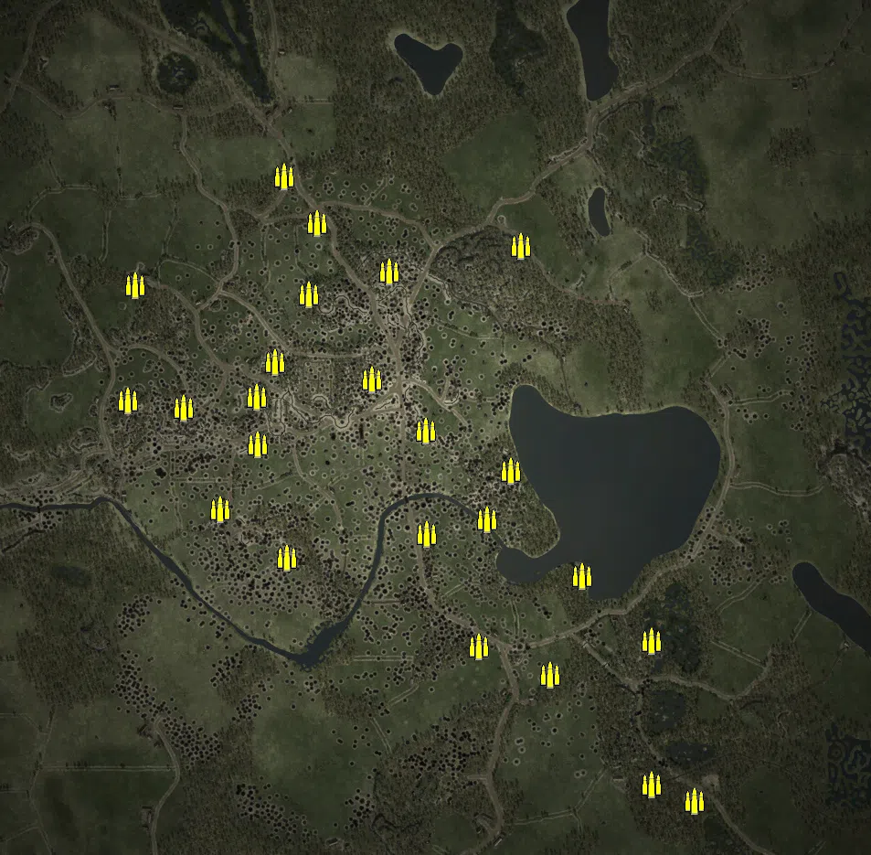
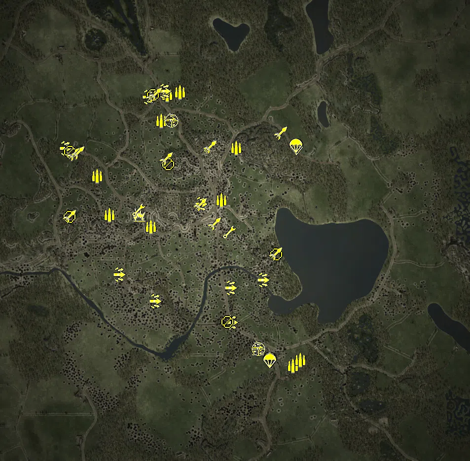
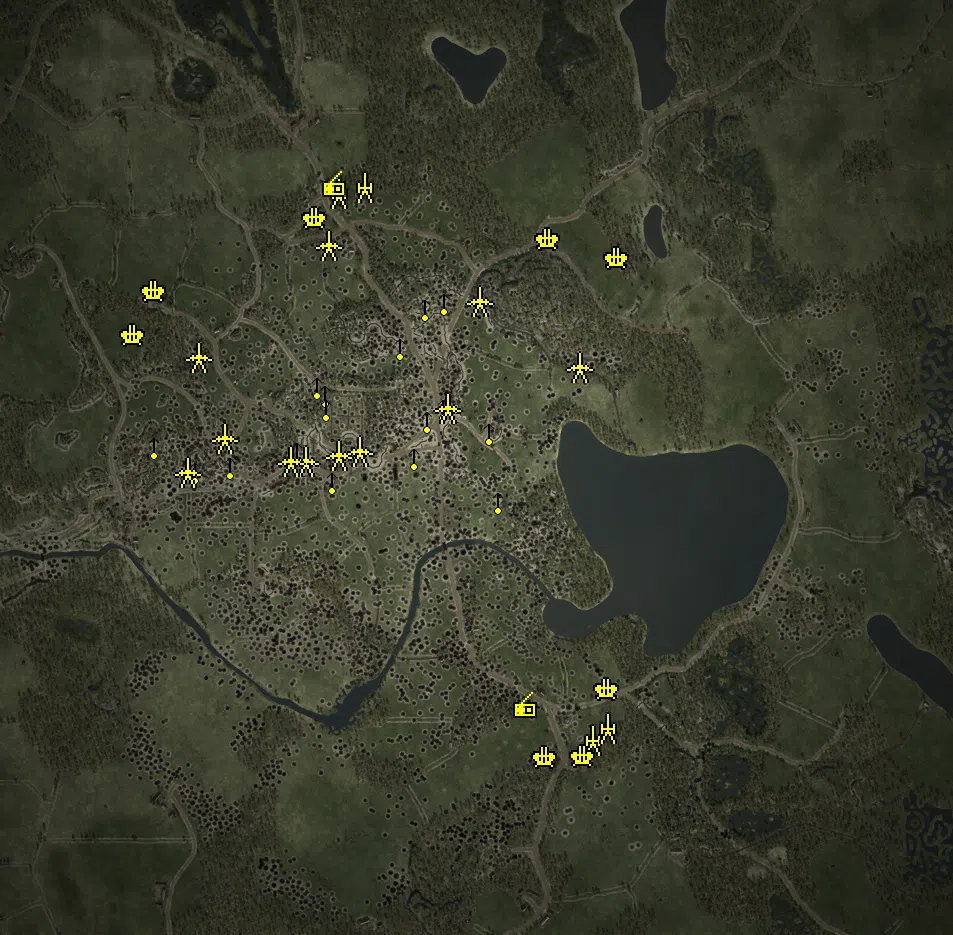
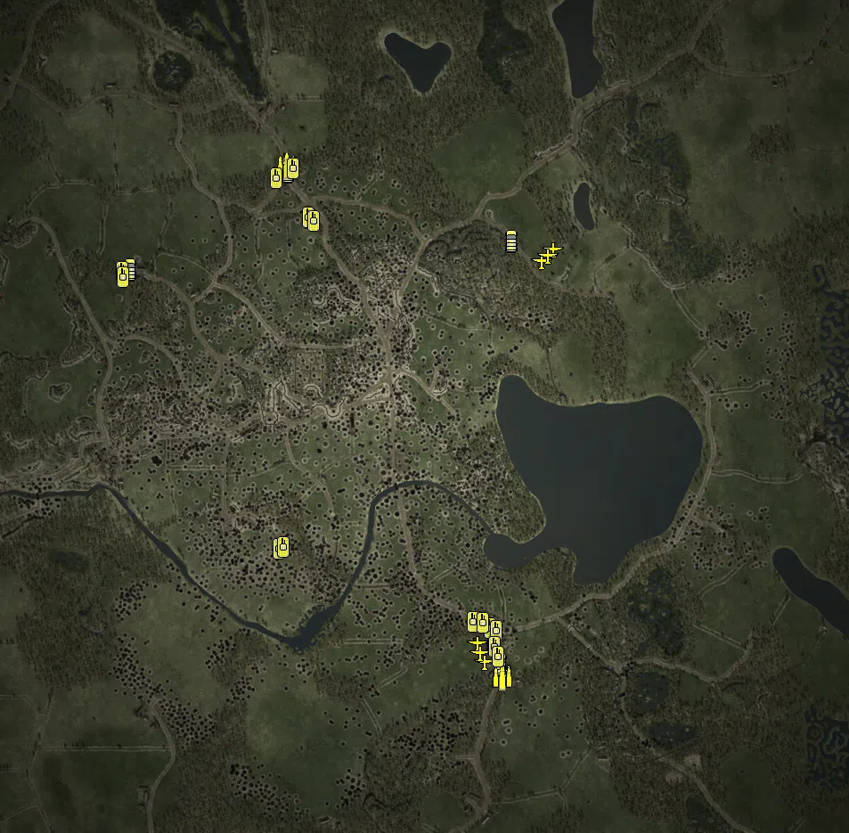

Static Ammo Crate

Pickup Kit

Static Emplacement

Vehicle

| gpo_subcat   | gpo_cat    | gpo_name                    |    pos_x |   pos_y |     pos_z |   flag | is_locked   |   team | instance                                                   | gpo_cat_disp       | gpo_subcat_disp   |
|:-------------|:-----------|:----------------------------|---------:|--------:|----------:|-------:|:------------|-------:|:-----------------------------------------------------------|:-------------------|:------------------|
| ammo_crate   | ammo_crate | ammo_crate                  |  170.564 |  24.466 |   -86.339 |      0 | False       |      0 | ammo_crate_0                                               | Static Ammo Crate  | Static Ammo Crate |
| ammo_crate   | ammo_crate | ammo_crate                  |  117.264 |  24.295 |  -191.679 |      0 | False       |      0 | ammo_crate_1                                               | Static Ammo Crate  | Static Ammo Crate |
| ammo_crate   | ammo_crate | ammo_crate                  |  191.456 |  35.515 |   406.292 |      0 | False       |      0 | ammo_crate_2                                               | Static Ammo Crate  | Static Ammo Crate |
| ammo_crate   | ammo_crate | ammo_crate                  |   99.283 |  30.623 |  -469.919 |      0 | False       |      0 | ammo_crate_3                                               | Static Ammo Crate  | Static Ammo Crate |
| ammo_crate   | ammo_crate | ammo_crate                  | -272.197 |  43.107 |   299.103 |      0 | False       |      0 | ammo_crate_4                                               | Static Ammo Crate  | Static Ammo Crate |
| ammo_crate   | ammo_crate | ammo_crate                  |  -95.387 |  35.162 |   349.481 |      0 | False       |      0 | ammo_crate_5                                               | Static Ammo Crate  | Static Ammo Crate |
| ammo_crate   | ammo_crate | ammo_crate                  | -326.234 |  36.257 |   557.127 |      0 | False       |      0 | ammo_crate_6                                               | Static Ammo Crate  | Static Ammo Crate |
| ammo_crate   | ammo_crate | ammo_crate                  | -652.639 |  54.043 |   319.833 |      0 | False       |      0 | ammo_crate_7                                               | Static Ammo Crate  | Static Ammo Crate |
| ammo_crate   | ammo_crate | ammo_crate                  | -345.637 |  39.946 |   151.816 |      0 | False       |      0 | ammo_crate_8                                               | Static Ammo Crate  | Static Ammo Crate |
| ammo_crate   | ammo_crate | ammo_crate                  | -133.678 |  34.271 |   113.993 |      0 | False       |      0 | ammo_crate_9                                               | Static Ammo Crate  | Static Ammo Crate |
| ammo_crate   | ammo_crate | ammo_crate                  |  256.575 |  28.319 |  -532.343 |      0 | False       |      0 | ammo_crate_10                                              | Static Ammo Crate  | Static Ammo Crate |
| ammo_crate   | ammo_crate | ammo_crate                  | -385.72  |  39.503 |    75.873 |      0 | False       |      0 | ammo_crate_11                                              | Static Ammo Crate  | Static Ammo Crate |
| ammo_crate   | ammo_crate | ammo_crate                  | -668.154 |  49.977 |    67.142 |      0 | False       |      0 | ammo_crate_12                                              | Static Ammo Crate  | Static Ammo Crate |
| ammo_crate   | ammo_crate | ammo_crate                  |  -15.556 |  30.456 |     1.434 |      0 | False       |      0 | ammo_crate_13                                              | Static Ammo Crate  | Static Ammo Crate |
| ammo_crate   | ammo_crate | ammo_crate                  | -253.51  |  37.357 |   455.479 |      0 | False       |      0 | ammo_crate_14                                              | Static Ammo Crate  | Static Ammo Crate |
| ammo_crate   | ammo_crate | ammo_crate                  | -466.259 |  34.159 |  -169.05  |      0 | False       |      0 | ammo_crate_15                                              | Static Ammo Crate  | Static Ammo Crate |
| ammo_crate   | ammo_crate | ammo_crate                  | -384.95  |  40.432 |   -27.761 |      0 | False       |      0 | ammo_crate_16                                              | Static Ammo Crate  | Static Ammo Crate |
| ammo_crate   | ammo_crate | ammo_crate                  | -546.159 |  50.841 |    52.635 |      0 | False       |      0 | ammo_crate_17                                              | Static Ammo Crate  | Static Ammo Crate |
| ammo_crate   | ammo_crate | ammo_crate                  |  571.382 |  27.024 |  -808.941 |      0 | False       |      0 | ammo_crate_18                                              | Static Ammo Crate  | Static Ammo Crate |
| ammo_crate   | ammo_crate | ammo_crate                  |  478.114 |  31.217 |  -772.124 |      0 | False       |      0 | ammo_crate_19                                              | Static Ammo Crate  | Static Ammo Crate |
| ammo_crate   | ammo_crate | ammo_crate                  |  326.019 |  25.489 |  -315.552 |      0 | False       |      0 | ammo_crate_20                                              | Static Ammo Crate  | Static Ammo Crate |
| ammo_crate   | ammo_crate | ammo_crate                  |  478.669 |  28.85  |  -457.951 |      0 | False       |      0 | ammo_crate_21                                              | Static Ammo Crate  | Static Ammo Crate |
| ammo_crate   | ammo_crate | ammo_crate                  | -320.356 |  26.504 |  -276.68  |      0 | False       |      0 | ammo_crate_22                                              | Static Ammo Crate  | Static Ammo Crate |
| ammo_crate   | ammo_crate | ammo_crate                  |  -14.467 |  32.752 |  -224.561 |      0 | False       |      0 | ammo_crate_23                                              | Static Ammo Crate  | Static Ammo Crate |
| ammo         | kit        | SE_PickUpAmmokit            | -270.432 |  35.974 |   559.488 |    106 | False       |      1 | CP_64_Ihantala_6thDivVihma_SE_PickUpAmmokit_1              | Pickup Kit         | Ammo Kit          |
| ammo         | kit        | RE_PickUpAmmokit            |  239.034 |  28.882 |  -540.098 |      1 | False       |      2 | CP_64_Ihantala_63rdGuardRifleDiv_RE_PickUpAmmokit_1        | Pickup Kit         | Ammo Kit          |
| ammo         | kit        | RE_PickUpAmmokit            |  269.805 |  29.414 |  -515.234 |      1 | False       |      2 | CP_64_Ihantala_63rdGuardRifleDiv_RE_PickUpAmmokit_2        | Pickup Kit         | Ammo Kit          |
| ammo         | kit        | SE_PickUpAmmokit            | -336.106 |  36.831 |    23.837 |    108 | False       |      1 | CP_64_Ihantala_Old_Cemetery_SE_PickUpAmmokit_1             | Pickup Kit         | Ammo Kit          |
| ammo         | kit        | SE_PickUpAmmokit            |    9.085 |  36.601 |   343.215 |    105 | False       |      1 | CP_64_Ihantala_Ammavuori_SE_PickUpAmmokit_1                | Pickup Kit         | Ammo Kit          |
| ammo         | kit        | SE_PickUpAmmokit            |  -50.734 |  35.218 |   131.448 |    102 | False       |      1 | CP_64_Ihantala_highway_SE_PickUpAmmokit_1                  | Pickup Kit         | Ammo Kit          |
| ammo         | kit        | SE_PickUpAmmokit            | -503.76  |  51.009 |    71.767 |    110 | False       |      1 | CP_64_Ihantala_Pyorakangas_SE_PickUpAmmokit                | Pickup Kit         | Ammo Kit          |
| ammo         | kit        | SE_PickUpAmmokit            | -554.53  |  56.655 |   229.096 |    107 | False       |      1 | CP_64_Ihantala_JR12_Hanste_SE_PickUpAmmokit                | Pickup Kit         | Ammo Kit          |
| ammo         | kit        | SE_PickUpAmmokit            | -218.448 |  36.168 |   570.854 |    106 | False       |      1 | CP_64_Ihantala_6thDivVihma_SE_PickUpAmmokit_2              | Pickup Kit         | Ammo Kit          |
| ammo         | kit        | SE_PickUpAmmokit            | -293.653 |  40.771 |   453.952 |    106 | False       |      1 | CP_64_Ihantala_6thDivVihma_SE_PickUpAmmokit_3              | Pickup Kit         | Ammo Kit          |
| antitank     | kit        | RE_PickupTankhunter         |   98.11  |  31.078 |  -468.712 |      1 | False       |      2 | CP_64_Ihantala_63rdGuardRifleDiv_RE_PickupTankhunter       | Pickup Kit         | Tankhunter Kit    |
| antitank     | kit        | RE_PickupTankhunter         | -384.659 |  39.791 |    74.572 |    108 | False       |      0 | CP_64_Ihantala_Old_Cemetery_SE_RE_PickupTankhunter         | Pickup Kit         | Tankhunter Kit    |
| assault      | kit        | SE_PickUpAssault_SuomiStick | -465.565 |  34.452 |  -169.206 |    111 | False       |      1 | CP_64_Ihantala_Pekarila_SE_PickUpAssault_SuomiStick        | Pickup Kit         | Assault Kit       |
| assault      | kit        | SE_PickUpAssault_SuomiStick | -282.288 |  37.015 |   573.474 |    106 | False       |      1 | CP_64_Ihantala_6thDivVihma_SE_PickUpAssault_SuomiStick_1   | Pickup Kit         | Assault Kit       |
| assault      | kit        | SE_PickUpAssault_SuomiStick | -347.335 |  36.884 |   549.593 |    106 | False       |      1 | CP_64_Ihantala_6thDivVihma_SE_PickUpAssault_SuomiStick_2   | Pickup Kit         | Assault Kit       |
| assault      | kit        | SE_PickUpAssault_SuomiStick | -684.785 |  54.363 |   341.199 |    107 | False       |      1 | CP_64_Ihantala_JR12_Hanste_SE_PickUpAssault_SuomiStick     | Pickup Kit         | Assault Kit       |
| assault      | kit        | RE_PickUpAssaultPps42       |  117.2   |  25.383 |  -191.634 |    101 | False       |      2 | CP_64_Ihantala_Lakeside_RE_PickUpAssaultPps42              | Pickup Kit         | Assault Kit       |
| assault      | kit        | RE_PickUpAssaultPps42       | -319.84  |  26.558 |  -277.301 |    111 | False       |      2 | CP_64_Ihantala_Pekarila_RE_PickUpAssaultPps42              | Pickup Kit         | Assault Kit       |
| assault      | kit        | RE_PickUpAssaultPps42       |  -14.531 |  33.099 |  -224.562 |      1 | False       |      2 | CP_64_Ihantala_63rdGuardRifleDiv_RE_PickUpAssaultPps42_1   | Pickup Kit         | Assault Kit       |
| assault      | kit        | RE_PickUpAssaultPps42       |  -10.947 |  30.182 |  -363.118 |      1 | False       |      2 | CP_64_Ihantala_63rdGuardRifleDiv_RE_PickUpAssaultPps42_2   | Pickup Kit         | Assault Kit       |
| assault      | kit        | RE_PickUpAssaultPps42       |   98.78  |  31.066 |  -469.118 |      1 | False       |      2 | CP_64_Ihantala_63rdGuardRifleDiv_RE_PickUpAssaultPps42_3   | Pickup Kit         | Assault Kit       |
| assault      | kit        | SE_PickUpAssault_SuomiStick | -133.971 |  34.814 |   115.041 |    102 | False       |      1 | CP_64_Ihantala_highway_SE_PickUpAssault_SuomiStick         | Pickup Kit         | Assault Kit       |
| assault      | kit        | SE_PickUpAssault_SuomiStick | -253.54  |  37.692 |   455.479 |    103 | False       |      1 | CP_64_Ihantala_StuGReinforcemence01_SE_PickUpAssault_Suomi | Pickup Kit         | Assault Kit       |
| engineer     | kit        | SE_PickUpEngineer           |  -93.993 |  35.428 |   349.085 |    104 | False       |      1 | CP_64_Ihantala_Crossroad_SE_Engineer_1                     | Pickup Kit         | Engineer Kit      |
| engineer     | kit        | SE_PickUpEngineer           |  -17.346 |  31.076 |     1.783 |    102 | False       |      1 | CP_64_Ihantala_highway_SE_Engineer_1                       | Pickup Kit         | Engineer Kit      |
| engineer     | kit        | SE_PickUpEngineer           | -386.022 |  41.686 |    91.441 |    108 | False       |      1 | CP_64_Ihantala_Old_Cemetery_SE_Engineer_1                  | Pickup Kit         | Engineer Kit      |
| mg           | kit        | RE_PickupMG_DT              |  171.56  |  25.048 |   -87.317 |    101 | False       |      0 | CP_64_Ihantala_Lakeside_SE_RE_PickUpMG                     | Pickup Kit         | MG Kit            |
| mg           | kit        | SE_PickupMG_DT              | -666.124 |  51.047 |    64.143 |    110 | False       |      1 | CP_64_Ihantala_Pyorakangas_SE_RE_PickupMG01                | Pickup Kit         | MG Kit            |
| mg           | kit        | SE_PickupMG_DT              | -327.383 |  36.835 |   557.451 |    106 | False       |      1 | CP_64_Ihantala_6thDivVihma_SE_PickupMG_DT                  | Pickup Kit         | MG Kit            |
| mg           | kit        | RE_PickupMG_DT              |  -25.231 |  30.37  |  -362.676 |      1 | False       |      2 | CP_64_Ihantala_63rdGuardRifleDiv_RE_PickupMG_DT            | Pickup Kit         | MG Kit            |
| mg           | kit        | SE_PickupMG_LS26            | -664.512 |  54.455 |   328.424 |    107 | False       |      1 | CP_64_Ihantala_JR12_Hanste_SE_PickupMG_LS26                | Pickup Kit         | MG Kit            |
| mg           | kit        | SE_PickupMG_LS26            | -265.022 |  43.509 |   277.861 |    104 | False       |      1 | CP_64_Ihantala_Crossroad_SE_PickupMG_LS26_1                | Pickup Kit         | MG Kit            |
| parachute    | kit        | RE_PickUpPilot              |  145.739 |  31.432 |  -513.85  |      1 | False       |      2 | CP_64_Ihantala_63rdGuardRifleDiv_RE_PickUpPilot_1          | Pickup Kit         | Parachute Kit     |
| parachute    | kit        | RE_PickUpPilot              |  147.923 |  31.398 |  -520.295 |      1 | False       |      2 | CP_64_Ihantala_63rdGuardRifleDiv_RE_PickUpPilot_2          | Pickup Kit         | Parachute Kit     |
| parachute    | kit        | SE_PickUpPilot              |  251.617 |  36.356 |   349.982 |    105 | False       |      1 | CP_64_Ihantala_Ammavuori_SE_PickUpPilot_1                  | Pickup Kit         | Parachute Kit     |
| parachute    | kit        | SE_PickUpPilot              |  253.112 |  36.187 |   344.906 |    105 | False       |      1 | CP_64_Ihantala_Ammavuori_SE_PickUpPilot_2                  | Pickup Kit         | Parachute Kit     |
| parachute    | kit        | RE_PickUpPilot              |  146.303 |  31.671 |  -515.655 |      1 | False       |      2 | CP_64_Ihantala_63rdGuardRifleDiv_RE_PickUpPilot_3          | Pickup Kit         | Parachute Kit     |
| parachute    | kit        | RE_PickUpPilot              |  146.28  |  31.375 |  -520.626 |      1 | False       |      2 | CP_64_Ihantala_63rdGuardRifleDiv_RE_PickUpPilot_4          | Pickup Kit         | Parachute Kit     |
| parachute    | kit        | SE_PickUpPilot              |  253.405 |  36.937 |   352.604 |    105 | False       |      1 | CP_64_Ihantala_Ammavuori_SE_PickUpPilot_3                  | Pickup Kit         | Parachute Kit     |
| parachute    | kit        | SE_PickUpPilot              |  251.363 |  36.928 |   352.368 |    105 | False       |      1 | CP_64_Ihantala_Ammavuori_SE_PickUpPilot_4                  | Pickup Kit         | Parachute Kit     |
| sniper       | kit        | RE_PickUpSniperAlt          |  100.857 |  31.449 |  -471.067 |      1 | False       |      2 | CP_64_Ihantala_63rdGuardRifleDiv_RE_PickUpSniper           | Pickup Kit         | Sniper Kit        |
| sniper       | kit        | SE_PickUpSniper             | -252.989 |  38.18  |   454.389 |    103 | False       |      1 | CP_64_Ihantala_StuGReinforcemence01_SE_PickUpSniper        | Pickup Kit         | Sniper Kit        |
| zooka        | kit        | SE_PickUpPanzerschreck      | -648.389 |  54.543 |   316.428 |    107 | False       |      1 | CP_64_Ihantala_JR12_Hanste_SE_PickUpPanzerschreck          | Pickup Kit         | HEAT Thrower      |
| zooka        | kit        | SE_PickupTankhunter_faust   |  -96.164 |  35.303 |   348.628 |    104 | False       |      1 | CP_64_Ihantala_Crossroad_SE_Tankhunter_1                   | Pickup Kit         | HEAT Thrower      |
| zooka        | kit        | SE_PickupTankhunter_faust   | -650.488 |  54.267 |   318.891 |    107 | False       |      1 | CP_64_Ihantala_JR12_Hanste_SE_PickupTankhunter_faust_1     | Pickup Kit         | HEAT Thrower      |
| zooka        | kit        | SE_PickupTankhunter_faust   | -632.735 |  55.222 |   323.999 |    107 | False       |      1 | CP_64_Ihantala_JR12_Hanste_SE_PickupTankhunter_faust_2     | Pickup Kit         | HEAT Thrower      |
| zooka        | kit        | SE_PickupTankhunter_faust   | -135.29  |  34.445 |   114.951 |    102 | False       |      1 | CP_64_Ihantala_highway_SE_PickupTankhunter_faust_1         | Pickup Kit         | HEAT Thrower      |
| zooka        | kit        | SE_PickupTankhunter_faust   |  -78.762 |  28.354 |    35.001 |    102 | False       |      1 | CP_64_Ihantala_highway_SE_PickupTankhunter_faust_2         | Pickup Kit         | HEAT Thrower      |
| zooka        | kit        | SE_PickupTankhunter_faust   |  170.383 |  24.485 |   -85.081 |    101 | False       |      1 | CP_64_Ihantala_Lakeside_SE_PickupTankhunter_faust          | Pickup Kit         | HEAT Thrower      |
| zooka        | kit        | SE_PickupTankhunter_faust   |  192.298 |  35.678 |   405.324 |    105 | False       |      1 | CP_64_Ihantala_Ammavuori_SE_PickupTankhunter_faust         | Pickup Kit         | HEAT Thrower      |
| zooka        | kit        | SE_PickUpPanzerschreck      |  190.867 |  36.354 |   404.456 |    105 | False       |      1 | CP_64_Ihantala_Ammavuori_SE_PickUpPanzerschreck            | Pickup Kit         | HEAT Thrower      |
| zooka        | kit        | SE_PickupTankhunter_faust   | -666.78  |  50.179 |    66.482 |    110 | False       |      1 | CP_64_Ihantala_Pyorakangas_SE_RE_Tankhunter                | Pickup Kit         | HEAT Thrower      |
| zooka        | kit        | SE_PickupTankhunter_faust   | -330.105 |  36.881 |   554.983 |    106 | False       |      1 | CP_64_Ihantala_6thDivVihma_SE_PickupTankhunter_faust_1     | Pickup Kit         | HEAT Thrower      |
| zooka        | kit        | SE_PickUpPanzerschreck      | -329.372 |  36.807 |   554.868 |    106 | False       |      1 | CP_64_Ihantala_6thDivVihma_SE_PickUpPanzerschreck          | Pickup Kit         | HEAT Thrower      |
| zooka        | kit        | SE_PickupTankhunter_faust   | -317.071 |  37.295 |   561.708 |    106 | False       |      1 | CP_64_Ihantala_6thDivVihma_SE_PickupTankhunter_faust_2     | Pickup Kit         | HEAT Thrower      |
| zooka        | kit        | SE_PickupTankhunter_faust   | -273.339 |  43.273 |   300.211 |    104 | False       |      1 | CP_64_Ihantala_Crossroad_SE_Tankhunter_2                   | Pickup Kit         | HEAT Thrower      |
| misc         | noidea     | britcommradio               |  102.817 |  30.509 |  -467.719 |      1 | False       |      0 | CP_64_Ihantala_63rdGuardRifleDiv_rusradio                  | FIXME UNASSIGNED   | MISCELLANEOUS     |
| misc         | noidea     | gercommradio                | -279.337 |  36.605 |   573.979 |    106 | False       |      0 | CP_64_Ihantala_6thDivVihma_finnradio2                      | FIXME UNASSIGNED   | MISCELLANEOUS     |
| noidea       | noidea     | commander_artillery_axis    | -733.1   |  27.584 |  1347     |    106 | True        |      0 | CP_64_Ihantala_6thDivVihma_finnarty                        | FIXME UNASSIGNED   | FIXME UNASSIGNED  |
| noidea       | noidea     | commander_artillery_allied  |  -40.1   |  30     | -1440.6   |      1 | True        |      0 | CP_64_Ihantala_63rdGuardRifleDiv_rusarty                   | FIXME UNASSIGNED   | FIXME UNASSIGNED  |
| noidea       | noidea     | commander_artillery_axis    | -733.1   |  27.584 |  1347     |    106 | True        |      0 | CP_64_Ihantala_6thDivVihma_finnarty2                       | FIXME UNASSIGNED   | FIXME UNASSIGNED  |
| noidea       | noidea     | commander_artillery_allied  |  -40.1   |  30     | -1440.6   |      1 | True        |      0 | CP_64_Ihantala_63rdGuardRifleDiv_rusarty2                  | FIXME UNASSIGNED   | FIXME UNASSIGNED  |
| noidea       | noidea     | commander_artillery_allied  |  -40.1   |  30     | -1440.6   |      1 | True        |      0 | CP_64_Ihantala_63rdGuardRifleDiv_rusarty3                  | FIXME UNASSIGNED   | FIXME UNASSIGNED  |
| noidea       | noidea     | commander_artillery_axis    | -733.1   |  27.584 |  1347     |    106 | True        |      0 | CP_64_Ihantala_6thDivVihma_finnarty3                       | FIXME UNASSIGNED   | FIXME UNASSIGNED  |
| arty         | static     | m30_122mm                   | -219.949 |  36.141 |   570.529 |    106 | False       |      0 | CP_64_Ihantala_6thDivVihma_lefh_1                          | Static Emplacement | Artillery         |
| arty         | static     | m30_122mm                   |  235.04  |  28.823 |  -536.886 |      1 | False       |      0 | CP_64_Ihantala_63rdGuardRifleDiv_artillery01               | Static Emplacement | Artillery         |
| arty         | static     | m30_122mm                   |  265.115 |  28.803 |  -512.773 |      1 | False       |      0 | CP_64_Ihantala_63rdGuardRifleDiv_artillery02               | Static Emplacement | Artillery         |
| arty         | static     | m30_122mm                   | -271.722 |  35.966 |   558.647 |    106 | False       |      0 | CP_64_Ihantala_6thDivVihma_lefh_2                          | Static Emplacement | Artillery         |
| flak         | static     | bofors40mm_eu_alt           |  147.9   |  35.481 |   465.698 |    105 | True        |      0 | CP_64_Ihantala_Ammavuori_AA_1                              | Static Emplacement | Anti-aircraft Gun |
| flak         | static     | bofors40mm_eu               |  266.029 |  24.757 |  -434.006 |      1 | True        |      0 | CP_64_Ihantala_63rdGuardRifleDiv_AA_2                      | Static Emplacement | Anti-aircraft Gun |
| flak         | static     | bofors40mm_eu               |  142.379 |  31.004 |  -570.666 |      1 | True        |      0 | CP_64_Ihantala_63rdGuardRifleDiv_AA_3                      | Static Emplacement | Anti-aircraft Gun |
| flak         | static     | bofors40mm_eu_alt           |  285.487 |  36.069 |   428.062 |    105 | True        |      0 | CP_64_Ihantala_Ammavuori_AA_2                              | Static Emplacement | Anti-aircraft Gun |
| flak         | static     | bofors40mm_eu_alt           | -317.081 |  37.762 |   508.574 |    106 | True        |      0 | CP_64_Ihantala_6thDivVihma_AA                              | Static Emplacement | Anti-aircraft Gun |
| flak         | static     | bofors40mm_eu_alt           | -640     |  53.522 |   361.834 |    107 | True        |      0 | CP_64_Ihantala_JR12_Hanste_AA                              | Static Emplacement | Anti-aircraft Gun |
| flak         | static     | bofors40mm_eu               |  217.982 |  30.89  |  -567.913 |      1 | True        |      0 | CP_64_Ihantala_63rdGuardRifleDiv_AA_1                      | Static Emplacement | Anti-aircraft Gun |
| flak         | static     | bofors40mm_eu_alt           | -681.165 |  53.462 |   274.552 |    107 | True        |      0 | CP_64_Ihantala_JR12_Hanste_AA2                             | Static Emplacement | Anti-aircraft Gun |
| mg_nest      | static     | dt_bipod                    |  -61.821 |  35.131 |   127.856 |    102 | False       |      0 | CP_64_Ihantala_highway_DT                                  | Static Emplacement | Static MG         |
| mg_nest      | static     | dp28_bipod                  |   47.452 |  30.586 |   -58.229 |    101 | False       |      0 | CP_64_Ihantala_Lakeside_dp28                               | Static Emplacement | Static MG         |
| mg_nest      | static     | dp28_bipod                  | -119.206 |  31.437 |    29.39  |    102 | False       |      0 | CP_64_Ihantala_highway_dp28                                | Static Emplacement | Static MG         |
| mg_nest      | static     | dt_bipod                    |  -93.898 |  32.313 |   103.733 |    102 | False       |      0 | CP_64_Ihantala_highway_1_0                                 | Static Emplacement | Static MG         |
| mg_nest      | static     | dp28_bipod                  | -148.084 |  38.503 |   249.83  |    104 | False       |      0 | CP_64_Ihantala_Crossroad_DP                                | Static Emplacement | Static MG         |
| mg_nest      | static     | dt_bipod                    |  -97.349 |  36.363 |   327.982 |    104 | False       |      0 | CP_64_Ihantala_Crossroad_DT                                | Static Emplacement | Static MG         |
| mg_nest      | static     | dt_bipod                    | -558.139 |  48.546 |     2.047 |    110 | False       |      0 | CP_64_Ihantala_Pyorakangas_maxim                           | Static Emplacement | Static MG         |
| mg_nest      | static     | dp28_bipod                  | -640.802 |  52.108 |    52.467 |    110 | False       |      0 | CP_64_Ihantala_Pyorakangas_dp                              | Static Emplacement | Static MG         |
| mg_nest      | static     | dt_bipod                    | -488.618 |  46.401 |    12.012 |    110 | False       |      0 | CP_64_Ihantala_Pyorakangas_DT                              | Static Emplacement | Static MG         |
| mg_nest      | static     | dp28_bipod                  | -313.353 |  40.431 |   171.055 |    108 | False       |      0 | CP_64_Ihantala_Old_Cemetery_DT_1                           | Static Emplacement | Static MG         |
| mg_nest      | static     | dt_bipod                    | -298.567 |  40.375 |   156.056 |    108 | False       |      0 | CP_64_Ihantala_Old_Cemetery_Maxim1                         | Static Emplacement | Static MG         |
| mg_nest      | static     | dp28_bipod                  | -283.557 |  35.667 |   -17.987 |    108 | False       |      0 | CP_64_Ihantala_Old_Cemetery_DP                             | Static Emplacement | Static MG         |
| mg_nest      | static     | dp28_bipod                  | -296.198 |  37.699 |   128.8   |    108 | False       |      0 | CP_64_Ihantala_Old_Cemetery_DT_1_0                         | Static Emplacement | Static MG         |
| mg_nest      | static     | dt_bipod                    | -354.911 |  39.017 |    42.879 |    108 | False       |      0 | CP_64_Ihantala_Old_Cemetery_maxim2                         | Static Emplacement | Static MG         |
| mg_nest      | static     | dp28_bipod                  |   29.194 |  36.282 |    79.118 |    102 | False       |      0 | CP_64_Ihantala_highway_dp28_2                              | Static Emplacement | Static MG         |
| mg_nest      | static     | dp28_bipod                  |  -59.342 |  36.407 |   340.473 |    104 | False       |      0 | CP_64_Ihantala_Crossroad_dp_0                              | Static Emplacement | Static MG         |
| pak          | static     | pak40_static_fi             |  -53.155 |  35.549 |   127.271 |    102 | True        |      1 | CP_64_Ihantala_highway_Pak40                               | Static Emplacement | Anti-tank Gun     |
| pak          | static     | m1937_45mm_alt              | -230.152 |  32.159 |    41.883 |    108 | False       |      0 | CP_64_Ihantala_Old_Cemetery_cannon_1                       | Static Emplacement | Anti-tank Gun     |
| pak          | static     | m1937_45mm_alt              | -272.562 |  33.965 |    33.156 |    108 | False       |      0 | CP_64_Ihantala_Old_Cemetery_cannon_2                       | Static Emplacement | Anti-tank Gun     |
| pak          | static     | pak40_static_fi             | -337.888 |  37.379 |    22.502 |    108 | True        |      1 | CP_64_Ihantala_Old_Cemetery_Pak40                          | Static Emplacement | Anti-tank Gun     |
| pak          | static     | m1937_45mm_alt              | -367.289 |  40.153 |    22.492 |    108 | False       |      0 | CP_64_Ihantala_Old_Cemetery_cannon_4                       | Static Emplacement | Anti-tank Gun     |
| pak          | static     | pak40_static_fi             |   10.982 |  37.189 |   341.804 |    105 | True        |      1 | CP_64_Ihantala_Ammavuori_Pak40                             | Static Emplacement | Anti-tank Gun     |
| pak          | static     | pak40_static_fi             | -552.816 |  57.12  |   230.839 |    107 | True        |      1 | CP_64_Ihantala_JR12_Hanste_Pak40                           | Static Emplacement | Anti-tank Gun     |
| pak          | static     | m1937_45mm_alt              |  210.261 |  27.803 |   210.544 |    105 | False       |      0 | CP_64_Ihantala_Ammavuori_m1937_static                      | Static Emplacement | Anti-tank Gun     |
| pak          | static     | pak40_static_fi             | -292.451 |  41.304 |   454.711 |    106 | True        |      1 | CP_64_Ihantala_6thDivVihma_Pak40                           | Static Emplacement | Anti-tank Gun     |
| pak          | static     | m1937_45mm_alt              | -574.77  |  45.658 |    -0.496 |    110 | False       |      0 | CP_64_Ihantala_Pyorakangas_gun                             | Static Emplacement | Anti-tank Gun     |
| pak          | static     | pak40_static_fi             | -500.193 |  50.714 |    68.489 |    110 | True        |      1 | CP_64_Ihantala_Pyorakangas_Pak40                           | Static Emplacement | Anti-tank Gun     |
| arty_sp      | vehicle    | katjusha_bm13               |  180.7   |  30.869 |  -560.532 |      1 | True        |      2 | CP_64_Ihantala_63rdGuardRifleDiv_Katjusha                  | Vehicle            | Mobile Arty       |
| car          | vehicle    | opelblitz_pan_nocanvas      |  200.093 |  36.178 |   404.978 |    105 | False       |      0 | CP_64_Ihantala_Ammavuori_truck                             | Vehicle            | Car               |
| car          | vehicle    | opelblitz_pan_nocanvas      | -301.417 |  36.597 |   559.586 |    106 | False       |      0 | CP_64_Ihantala_6thDivVihma_truck                           | Vehicle            | Car               |
| car          | vehicle    | opelblitz_pan_nocanvas      | -656.752 |  54.342 |   340.771 |    107 | False       |      0 | CP_64_Ihantala_JR12_Hanste_truck                           | Vehicle            | Car               |
| car          | vehicle    | studebaker_us6              |  176.194 |  30.4   |  -545.051 |      1 | False       |      0 | CP_64_Ihantala_63rdGuardRifleDiv_truck1                    | Vehicle            | Car               |
| car          | vehicle    | studebaker_us6              |  157.206 |  30.355 |  -493.741 |      1 | False       |      0 | CP_64_Ihantala_63rdGuardRifleDiv_truck2                    | Vehicle            | Car               |
| plane        | vehicle    | il-2_bomber                 |  123.705 |  30.39  |  -499.968 |      1 | True        |      2 | CP_64_Ihantala_63rdGuardRifleDiv_IL2                       | Vehicle            | Airplane          |
| plane        | vehicle    | la-5_fn                     |  140.297 |  30.39  |  -541.315 |      1 | True        |      2 | CP_64_Ihantala_63rdGuardRifleDiv_LA5                       | Vehicle            | Airplane          |
| plane        | vehicle    | ju87dalt2                   |  294.159 |  35.557 |   383.191 |    105 | True        |      1 | CP_64_Ihantala_Ammavuori_stuka                             | Vehicle            | Airplane          |
| plane        | vehicle    | fw190_alt                   |  268.07  |  35.77  |   358.943 |    105 | True        |      1 | CP_64_Ihantala_Ammavuori_FW                                | Vehicle            | Airplane          |
| plane        | vehicle    | fw190_alt                   |  281.29  |  35.95  |   370.943 |    105 | True        |      0 | CP_64_Ihantala_Ammavuori_bf109                             | Vehicle            | Airplane          |
| plane        | vehicle    | la-5_fn                     |  130.91  |  30.39  |  -522.683 |      1 | True        |      2 | CP_64_Ihantala_63rdGuardRifleDiv_LA52                      | Vehicle            | Airplane          |
| supply       | vehicle    | studebaker_us6_ammo         |  180.381 |  31.656 |  -575.04  |      1 | False       |      0 | CP_64_Ihantala_63rdGuardRifleDiv_studebaker_us6_ammo       | Vehicle            | Supply Vehicle    |
| supply       | vehicle    | opelblitz_pan_ammo_finnish  | -303.404 |  36.235 |   571.604 |    106 | False       |      0 | CP_64_Ihantala_6thDivVihma_truck_ammo                      | Vehicle            | Supply Vehicle    |
| tank         | vehicle    | t34_76_m43                  |  113.119 |  30.413 |  -451.347 |      1 | True        |      0 | CP_64_Ihantala_63rdGuardRifleDiv_t34_76_1                  | Vehicle            | Tank              |
| tank         | vehicle    | t34_85_late                 |  151.301 |  30.352 |  -465.309 |      1 | True        |      0 | CP_64_Ihantala_63rdGuardRifleDiv_1_1                       | Vehicle            | Tank              |
| tank         | vehicle    | t34_85_late                 |  166.618 |  30.15  |  -471.953 |      1 | True        |      0 | CP_64_Ihantala_63rdGuardRifleDiv_2_0                       | Vehicle            | Tank              |
| tank         | vehicle    | t34_76_m43                  |  136.035 |  30.349 |  -454.076 |      1 | True        |      0 | CP_64_Ihantala_63rdGuardRifleDiv_t34_76_2                  | Vehicle            | Tank              |
| tank         | vehicle    | is_2                        |  161.725 |  31.082 |  -507.448 |      1 | True        |      2 | CP_64_Ihantala_63rdGuardRifleDiv_IS2                       | Vehicle            | Tank              |
| tank         | vehicle    | isu_152                     |  170.717 |  30.36  |  -529.5   |      1 | True        |      2 | CP_64_Ihantala_63rdGuardRifleDiv_ISU152                    | Vehicle            | Tank              |
| tank         | vehicle    | t34_76_m43                  | -321.446 |  26.057 |  -287.029 |    111 | True        |      2 | CP_64_Ihantala_Pekarila_t34_76_m43_1                       | Vehicle            | Tank              |
| tank         | vehicle    | stug40_g_alt                | -673.701 |  53.808 |   333.619 |    113 | True        |      1 | CP_64_Ihantala_StuGReinforcemence02_StuG01                 | Vehicle            | Tank              |
| tank         | vehicle    | stug40_g_alt                | -671.881 |  53.915 |   322.148 |    113 | True        |      1 | CP_64_Ihantala_StuGReinforcemence02_StuG02                 | Vehicle            | Tank              |
| tank         | vehicle    | stuh42                      | -289.14  |  36.703 |   565.13  |    114 | True        |      1 | CP_64_Ihantala_StuGReinforcemence03_StuH                   | Vehicle            | Tank              |
| tank         | vehicle    | stug40_g_alt                | -327.716 |  36.82  |   544.434 |    114 | True        |      1 | CP_64_Ihantala_StuGReinforcemence03_StuG01                 | Vehicle            | Tank              |
| tank         | vehicle    | t34_76_m43                  | -312.503 |  25.976 |  -284.709 |    111 | True        |      2 | CP_64_Ihantala_Pekarila_t34_76_m43_2                       | Vehicle            | Tank              |
| tank         | vehicle    | stug40_g_alt                | -256.783 |  37.59  |   455.755 |    103 | True        |      1 | CP_64_Ihantala_StuGReinforcemence01_StuG01                 | Vehicle            | Tank              |
| tank         | vehicle    | stug40_g_alt                | -244.709 |  37     |   448.07  |    103 | True        |      1 | CP_64_Ihantala_StuGReinforcemence01_StuG02                 | Vehicle            | Tank              |

