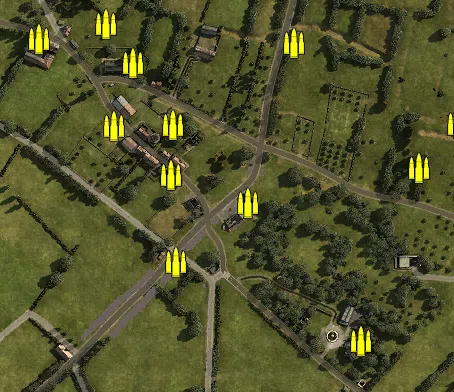
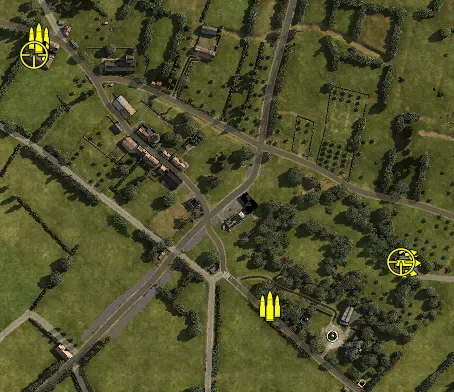
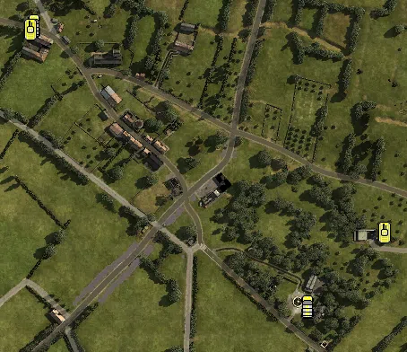

Static Ammo Crate

Pickup Kit

Static Emplacement

Vehicle

| gpo_subcat   | gpo_cat    | gpo_name              |    pos_x |   pos_y |    pos_z |   flag | is_locked   |   team | instance                             | gpo_cat_disp       | gpo_subcat_disp   |
|:-------------|:-----------|:----------------------|---------:|--------:|---------:|-------:|:------------|-------:|:-------------------------------------|:-------------------|:------------------|
| ammo_crate   | ammo_crate | ammo_crate            | -154.551 | 106.204 |   56.267 |      0 | False       |      0 | ammo_crate_0                         | Static Ammo Crate  | Static Ammo Crate |
| ammo_crate   | ammo_crate | ammo_crate            | -128.461 | 105.787 |   16.749 |      0 | False       |      0 | ammo_crate_1                         | Static Ammo Crate  | Static Ammo Crate |
| ammo_crate   | ammo_crate | ammo_crate            | -221.773 | 105.703 |   40.642 |      0 | False       |      0 | ammo_crate_2                         | Static Ammo Crate  | Static Ammo Crate |
| ammo_crate   | ammo_crate | ammo_crate            | -146.528 | 106.767 |  -46.338 |      0 | False       |      0 | ammo_crate_3                         | Static Ammo Crate  | Static Ammo Crate |
| ammo_crate   | ammo_crate | ammo_crate            |  -90.3   | 104.105 |  -94.967 |      0 | False       |      0 | ammo_crate_4                         | Static Ammo Crate  | Static Ammo Crate |
| ammo_crate   | ammo_crate | ammo_crate            |  -88.337 | 104     |  -45.455 |      0 | False       |      0 | ammo_crate_5                         | Static Ammo Crate  | Static Ammo Crate |
| ammo_crate   | ammo_crate | ammo_crate            |  -13.217 | 101.9   | -122.844 |      0 | False       |      0 | ammo_crate_6                         | Static Ammo Crate  | Static Ammo Crate |
| ammo_crate   | ammo_crate | ammo_crate            |  -84.897 | 101.691 | -181.828 |      0 | False       |      0 | ammo_crate_7                         | Static Ammo Crate  | Static Ammo Crate |
| ammo_crate   | ammo_crate | ammo_crate            |   99.777 | 106.747 | -261.197 |      0 | False       |      0 | ammo_crate_8                         | Static Ammo Crate  | Static Ammo Crate |
| ammo_crate   | ammo_crate | ammo_crate            |  226.706 | 106.211 |  -76.177 |      0 | False       |      0 | ammo_crate_9                         | Static Ammo Crate  | Static Ammo Crate |
| ammo_crate   | ammo_crate | ammo_crate            |  197.41  | 105.13  |  -44.423 |      0 | False       |      0 | ammo_crate_10                        | Static Ammo Crate  | Static Ammo Crate |
| ammo_crate   | ammo_crate | ammo_crate            |   33.188 | 106.207 |   37.031 |      0 | False       |      0 | ammo_crate_11                        | Static Ammo Crate  | Static Ammo Crate |
| ammo_crate   | ammo_crate | ammo_crate            |  196.125 | 115.701 |  317.434 |      0 | False       |      0 | ammo_crate_12                        | Static Ammo Crate  | Static Ammo Crate |
| ammo_crate   | ammo_crate | ammo_crate            |  200.374 | 116.181 |  315.006 |      0 | False       |      0 | ammo_crate_13                        | Static Ammo Crate  | Static Ammo Crate |
| ammo_crate   | ammo_crate | ammo_crate            |  158.324 | 105.509 |  -88.401 |      0 | False       |      0 | ammo_crate_14                        | Static Ammo Crate  | Static Ammo Crate |
| ammo         | kit        | GW_PickUpAmmokit      |    8.889 | 105.712 | -225.741 |    202 | False       |      0 | CP_16_lebisey_hq_ammo                | Pickup Kit         | Ammo Kit          |
| ammo         | kit        | BW_PickUpAmmokit      | -221.805 | 105.712 |   41.863 |    201 | False       |      0 | CP_16_lebisey_west_lebisey_ammo      | Pickup Kit         | Ammo Kit          |
| assault      | kit        | GW_PickUpAssaultStG44 |  146.063 | 105.101 | -183.326 |    202 | False       |      0 | CP_16_lebisey_hq_assaultrifle        | Pickup Kit         | Assault Kit       |
| mg_dep       | kit        | BA_PickUpVickers303   | -216.408 | 105.717 |   31.261 |    201 | False       |      0 | CP_16_lebisey_west_lebisey_hmg       | Pickup Kit         | Deployable MG     |
| sniper       | kit        | BW_PickUpSniperNo4    | -226.585 | 106.165 |   24.632 |    201 | False       |      0 | CP_16_lebisey_west_lebisey_sniper    | Pickup Kit         | Sniper Kit        |
| sniper       | kit        | GW_PickUpSniperg43_ZF |  140.457 | 104.281 | -182.179 |    202 | False       |      0 | CP_16_lebisey_hq_sniper              | Pickup Kit         | Sniper Kit        |
| arty         | static     | 3inchmortar           | -213.514 | 105.818 |   56.82  |    201 | False       |      0 | CP_16_lebisey_west_lebisey_mortar    | Static Emplacement | Artillery         |
| arty         | static     | sgwr34_france         |  159.884 | 105.737 | -190.338 |    206 | False       |      0 | CP_16_lebisey_bunker_mortar          | Static Emplacement | Artillery         |
| mg_nest      | static     | mg42_bipod            |   85.929 | 111.546 | -264.479 |    202 | False       |      0 | CP_16_lebisey_hq_mg                  | Static Emplacement | Static MG         |
| pak          | static     | pak40                 |   10.828 | 105.709 | -222.961 |    202 | False       |      0 | CP_16_lebisey_hq_at_gun              | Static Emplacement | Anti-tank Gun     |
| radio        | static     | gercommradio          |  152.057 | 104     | -177.273 |    202 | False       |      0 | CP_16_lebisey_hq_commradio           | Static Emplacement | Radio             |
| radio        | static     | britcommradio         | -214.968 | 105.712 |   31.06  |    201 | False       |      0 | CP_16_lebisey_west_lebisey_commradio | Static Emplacement | Radio             |
| car          | vehicle    | willysmb_france       | -222.893 | 105.522 |   51.937 |    201 | False       |      0 | CP_16_lebisey_west_lebisey_jeep      | Vehicle            | Car               |
| car          | vehicle    | kubelwagen_fr         |   82.095 | 105.712 | -261.401 |    202 | False       |      0 | CP_16_lebisey_hq_kubel               | Vehicle            | Car               |
| tank         | vehicle    | sherman_v_mid_olive   | -226.64  | 105.633 |   47.198 |    207 | True        |      0 | CP_16_lebisey_west_lebisey_sherman   | Vehicle            | Tank              |
| tank         | vehicle    | Stug40_g              |  168.262 | 105.712 | -178.864 |    206 | True        |      0 | CP_16_lebisey_hq_stug                | Vehicle            | Tank              |

