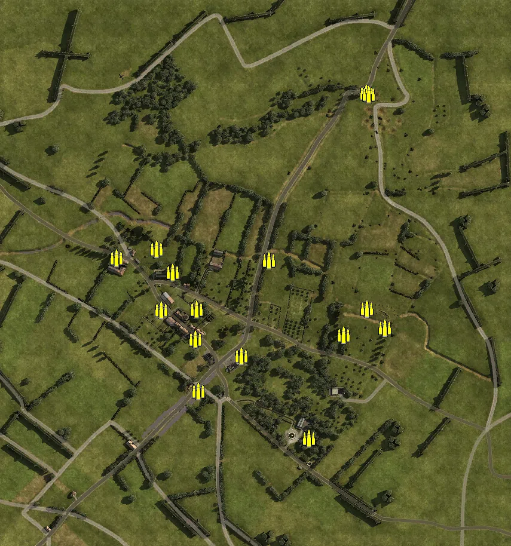
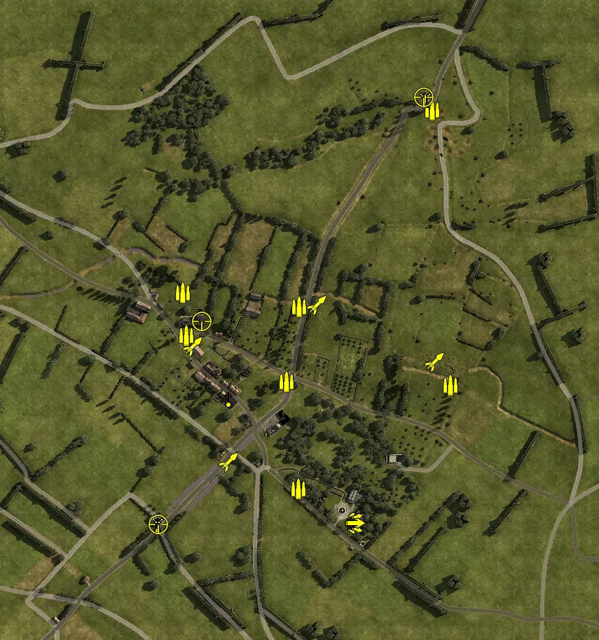
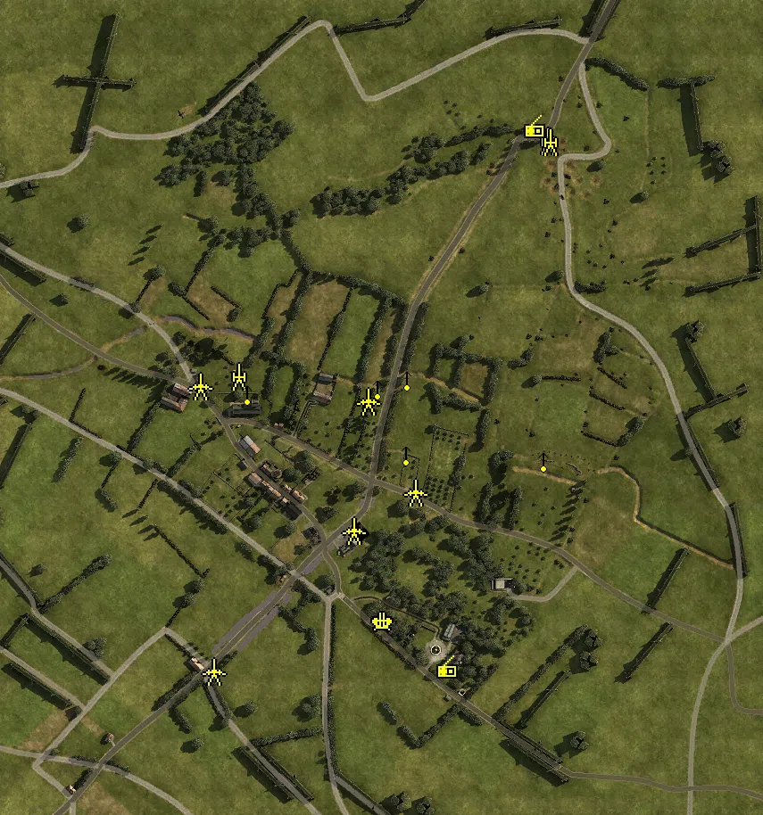
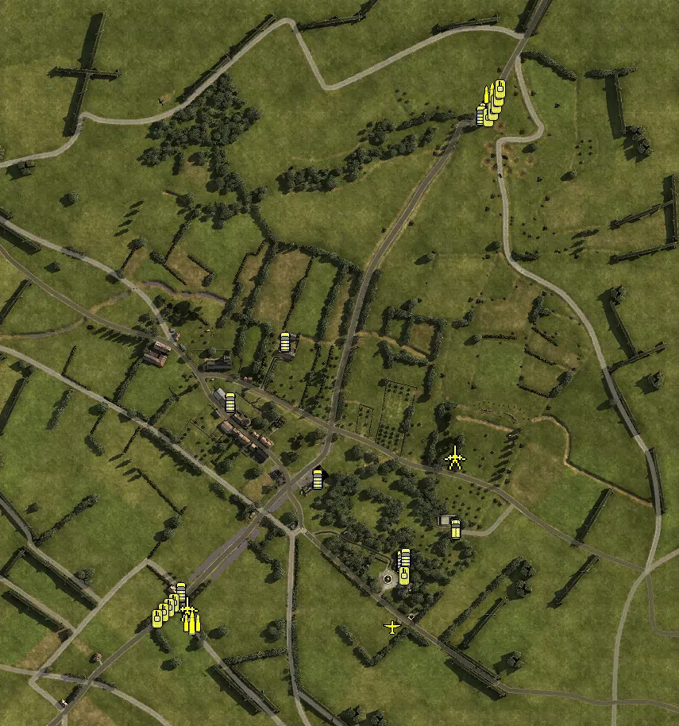

Static Ammo Crate

Pickup Kit

Static Emplacement

Vehicle

| Icon                       | SubCat            | Cat                | Name                         | Instance                               |   Flag |    X Pos |   Y Pos |    Z Pos |
|:---------------------------|:------------------|:-------------------|:-----------------------------|:---------------------------------------|-------:|---------:|--------:|---------:|
|      | Static Ammo Crate | Static Ammo Crate  | ammo_crate                   | ammo_crate_0                           |      0 | -154.551 | 106.204 |   56.267 |
|      | Static Ammo Crate | Static Ammo Crate  | ammo_crate                   | ammo_crate_1                           |      0 | -128.461 | 105.787 |   16.749 |
|      | Static Ammo Crate | Static Ammo Crate  | ammo_crate                   | ammo_crate_2                           |      0 | -221.773 | 105.703 |   40.642 |
|      | Static Ammo Crate | Static Ammo Crate  | ammo_crate                   | ammo_crate_3                           |      0 | -146.528 | 106.767 |  -46.338 |
|      | Static Ammo Crate | Static Ammo Crate  | ammo_crate                   | ammo_crate_4                           |      0 |  -90.300 | 104.105 |  -94.967 |
|      | Static Ammo Crate | Static Ammo Crate  | ammo_crate                   | ammo_crate_5                           |      0 |  -88.337 | 104.000 |  -45.455 |
|      | Static Ammo Crate | Static Ammo Crate  | ammo_crate                   | ammo_crate_6                           |      0 |  -13.217 | 101.900 | -122.844 |
|      | Static Ammo Crate | Static Ammo Crate  | ammo_crate                   | ammo_crate_7                           |      0 |  -84.897 | 101.691 | -181.828 |
|      | Static Ammo Crate | Static Ammo Crate  | ammo_crate                   | ammo_crate_8                           |      0 |   99.777 | 106.747 | -261.197 |
|      | Static Ammo Crate | Static Ammo Crate  | ammo_crate                   | ammo_crate_9                           |      0 |  226.706 | 106.211 |  -76.177 |
|      | Static Ammo Crate | Static Ammo Crate  | ammo_crate                   | ammo_crate_10                          |      0 |  197.410 | 105.130 |  -44.423 |
|      | Static Ammo Crate | Static Ammo Crate  | ammo_crate                   | ammo_crate_11                          |      0 |   33.188 | 106.207 |   37.031 |
|      | Static Ammo Crate | Static Ammo Crate  | ammo_crate                   | ammo_crate_12                          |      0 |  196.125 | 115.701 |  317.434 |
|      | Static Ammo Crate | Static Ammo Crate  | ammo_crate                   | ammo_crate_13                          |      0 |  200.374 | 116.181 |  315.006 |
|      | Static Ammo Crate | Static Ammo Crate  | ammo_crate                   | ammo_crate_14                          |      0 |  158.324 | 105.509 |  -88.401 |
|      | Ammo Kit          | Pickup Kit         | GW_PickUpAmmokit             | CP_64_lebisey_east_at_ammo             |    101 |  225.929 | 105.712 |  -76.850 |
|      | Ammo Kit          | Pickup Kit         | GW_PickUpAmmokit             | CP_64_lebisey_crossroads_ammo          |    104 |   -8.359 | 101.593 |  -72.181 |
|      | Ammo Kit          | Pickup Kit         | GW_PickUpAmmokit             | CP_64_lebisey_3coy_cp_ammo             |    103 | -155.533 | 105.712 |   55.294 |
|      | Ammo Kit          | Pickup Kit         | GW_PickUpAmmokit             | CP_64_lebisey_3coy_cp_ammo_0           |    104 | -151.224 | 105.712 |   -6.314 |
|      | Ammo Kit          | Pickup Kit         | GW_PickUpAmmokit             | CP_64_lebisey_centre_at_ammo           |      1 |   10.155 | 105.712 |   35.119 |
|      | Ammo Kit          | Pickup Kit         | BW_PickUpAmmokit             | CP_64_lebisey_staff_yeomanry_ammo      |    102 |  200.077 | 115.712 |  315.831 |
|      | Ammo Kit          | Pickup Kit         | GW_PickUpAmmokit             | CP_64_lebisey_hq_ammo                  |    105 |    9.212 | 105.711 | -224.855 |
|  | Deployable Arty   | Pickup Kit         | GW_PickUpMortar              | CP_64_lebisey_caen_mortar              |    106 | -192.576 | 101.713 | -273.564 |
|  | Deployable Arty   | Pickup Kit         | BA_PickUpMortar              | CP_64_lebisey_staff_yeomanry_mortar    |    102 |  189.059 | 115.712 |  332.859 |
|   | Assault Kit       | Pickup Kit         | GW_PickUpAssaultStG44        | CP_64_lebisey_hq_assaultrifle1         |    105 |   88.205 | 107.456 | -273.588 |
|   | Assault Kit       | Pickup Kit         | GW_PickUpAssaultStG44        | CP_64_lebisey_hq_assaultrife2          |    105 |   90.309 | 107.456 | -274.343 |
|       | Deployable MG     | Pickup Kit         | GW_PickUpMG42Lafette         | CP_64_lebisey_caen_hmg                 |    106 | -191.621 | 101.691 | -274.683 |
|       | Deployable MG     | Pickup Kit         | GW_PickUpMG42Lafette         | CP_64_lebisey_3coy_cp_hmg              |    104 |  -91.078 | 104.108 |  -94.570 |
|       | Deployable MG     | Pickup Kit         | BA_PickUpVickers303          | CP_64_lebisey_staff_yeomanry_hmg       |    102 |  187.810 | 115.712 |  332.354 |
|    | Sniper Kit        | Pickup Kit         | GW_PickUpSniperg43_ZF        | CP_64_lebisey_3coy_cp_sniperkit        |    103 | -129.370 | 106.999 |   14.297 |
|    | Sniper Kit        | Pickup Kit         | GW_PickUpSniperg43_ZF        | CP_64_lebisey_caen_assaultsniper       |    106 | -190.547 | 101.643 | -275.598 |
|    | Sniper Kit        | Pickup Kit         | BW_PickUpSniperNo4           | CP_64_lebisey_staff_yeomanry_sniper    |    102 |  188.252 | 116.711 |  334.410 |
|    | HEAT Thrower      | Pickup Kit         | GW_PickUpPanzerschreck       | CP_64_lebisey_east_at_atkit            |    101 |  203.293 | 105.834 |  -44.203 |
|    | HEAT Thrower      | Pickup Kit         | GW_PickUpPanzerschreck       | CP_64_lebisey_3coy_cp_panzershrek      |    104 | -141.826 | 106.305 |  -22.169 |
|    | HEAT Thrower      | Pickup Kit         | GW_PickUpPanzerschreck       | CP_64_lebisey_centre_at_panzershrek    |      1 |   34.617 | 105.860 |   37.469 |
|    | HEAT Thrower      | Pickup Kit         | GW_PickUpPanzerschreck       | CP_64_lebisey_caen_panzershreck        |    106 |  -90.867 | 101.813 | -187.153 |
|      | Artillery         | Static Emplacement | sgwr34_france                | CP_64_lebisey_3coy_cp_Mortar           |    103 | -149.617 | 105.781 |   50.787 |
|      | Artillery         | Static Emplacement | 3inchmortar                  | CP_64_lebisey_staff_yeomanry_mortar1   |    102 |  196.339 | 115.808 |  315.344 |
|      | Artillery         | Static Emplacement | 3inchmortar                  | CP_64_lebisey_staff_yeomanry_mortar2   |    102 |  199.457 | 115.810 |  314.118 |
|      | Anti-aircraft Gun | Static Emplacement | flak18_fr                    | CP_64_lebisey_hq_88                    |    105 |   11.571 | 105.827 | -224.329 |
|       | Static MG         | Static Emplacement | mg42_lafette                 | CP_64_lebisey_centre_at_LightMG        |      1 |   38.613 | 105.882 |   47.930 |
|       | Static MG         | Static Emplacement | mg42_bipod                   | CP_64_lebisey_centre_at_lmg2           |      1 |    6.351 | 106.490 |   37.945 |
|       | Static MG         | Static Emplacement | mg42_bipod                   | CP_64_lebisey_east_at_lmg1             |    101 |  192.096 | 105.811 |  -42.886 |
|       | Static MG         | Static Emplacement | mg42_bipod                   | CP_64_lebisey_crossroads_lmg2          |    104 |   38.103 | 106.726 |  -35.883 |
|       | Static MG         | Static Emplacement | mg42_bipod                   | CP_64_lebisey_3coy_cp_mg2              |    103 | -140.416 | 106.747 |   32.257 |
|       | Anti-tank Gun     | Static Emplacement | pak38_fr                     | CP_64_lebisey_crossroads_pak1          |    104 |  -21.055 | 101.713 | -121.853 |
|       | Anti-tank Gun     | Static Emplacement | pak40_static                 | CP_64_lebisey_crossroads_pak2          |    104 |   48.280 | 102.342 |  -78.701 |
|       | Anti-tank Gun     | Static Emplacement | pak40                        | CP_64_lebisey_3coy_cp_pak1             |      1 |   -4.531 | 105.712 |   23.047 |
|       | Anti-tank Gun     | Static Emplacement | pak38_fr                     | CP_64_lebisey_3coy_cp_MG               |    103 | -192.752 | 105.678 |   40.069 |
|       | Anti-tank Gun     | Static Emplacement | pak40_static                 | CP_64_lebisey_caen_atgun               |    106 | -177.938 | 102.236 | -279.990 |
|     | Radio             | Static Emplacement | britcommradio                | CP_64_lebisey_staff_yeomanry_commradio |    102 |  182.105 | 115.712 |  329.945 |
|     | Radio             | Static Emplacement | gercommradio                 | CP_64_lebisey_hq_commradio             |    105 |   83.912 | 106.746 | -276.239 |
|       | APC               | Vehicle            | UniversalCarrier_France      | CP_64_lebisey_staff_yeomanry_uni1      |    102 |  197.206 | 115.653 |  336.982 |
|       | APC               | Vehicle            | sdkfz251_d                   | CP_64_lebisey_east_at_sdkfz251         |    101 |  157.195 | 105.711 | -192.804 |
|       | APC               | Vehicle            | universalcarrier_france_bren | CP_64_lebisey_staff_yeomanry_bren1     |    102 |  193.480 | 115.709 |  331.873 |
|       | APC               | Vehicle            | sdkfz251_d                   | CP_64_lebisey_caen_tank4               |    106 | -178.514 | 101.709 | -302.684 |
|       | Car               | Vehicle            | kubelwagen_fr                | CP_64_lebisey_hq_kubel                 |    105 |   87.649 | 105.712 | -235.396 |
|       | Car               | Vehicle            | citroen_11cv_cream           | CP_64_lebisey_hq_car                   |    105 |   88.546 | 105.712 | -231.879 |
|       | Car               | Vehicle            | kubelwagen_fr                | CP_64_lebisey_caen_kubel               |    106 | -189.043 | 101.663 | -272.229 |
|       | Car               | Vehicle            | willysmb_france              | CP_64_lebisey_staff_yeomanry_jeep      |    102 |  189.110 | 115.700 |  327.611 |
|       | Car               | Vehicle            | bedford_qlt                  | CP_64_lebisey_staff_yeomanry_truck1    |    102 |  200.630 | 115.669 |  344.839 |
|       | Civilian Vehicle  | Vehicle            | redtractor                   | CP_64_lebisey_3coy_cp_tractor          |    104 |  -57.677 | 105.712 |   43.297 |
|       | Civilian Vehicle  | Vehicle            | rideable_bicycle             | CP_64_lebisey_3coy_cp_bike1            |    104 | -126.528 | 105.712 |  -32.973 |
|       | Civilian Vehicle  | Vehicle            | rideable_bicycle             | CP_64_lebisey_crossroads_bike          |    104 |  -16.809 | 101.713 | -129.763 |
|       | Civilian Vehicle  | Vehicle            | rideable_bicycle             | CP_64_lebisey_hq_bike                  |    105 |   93.810 | 105.712 | -229.403 |
|       | Mobile PaK        | Vehicle            | sdkfz7_pak_camo              | CP_64_lebisey_caen_amphib              |    106 | -182.147 | 101.618 | -293.018 |
|       | Mobile PaK        | Vehicle            | sdkfz7_pak_camo_2            | CP_64_lebisey_east_at_atgun            |    101 |  154.854 | 105.156 | -102.403 |
|     | Airplane          | Vehicle            | storch_france                | CP_64_lebisey_hq_scout                 |    105 |   77.075 | 105.712 | -315.539 |
|      | Supply Vehicle    | Vehicle            | opelblitz_fr_ammo            | CP_64_lebisey_caen_tanker              |    106 | -174.576 | 101.984 | -311.111 |
|      | Supply Vehicle    | Vehicle            | bedford_qlt_ammo             | CP_64_lebisey_staff_yeomanry_truckammo |    102 |  202.989 | 115.654 |  353.589 |
|      | Tank              | Vehicle            | sherman_v_mid_olive          | CP_64_lebisey_staff_yeomanry_tank1     |    107 |  197.572 | 115.650 |  324.803 |
|      | Tank              | Vehicle            | pziii_n                      | CP_64_lebisey_caen_tank1               |    108 | -197.698 | 101.600 | -285.792 |
|      | Tank              | Vehicle            | pzivh                        | CP_64_lebisey_caen_tank2               |    108 | -204.292 | 101.600 | -291.768 |
|      | Tank              | Vehicle            | pzivh                        | CP_64_lebisey_caen_tank3               |    107 | -211.237 | 101.600 | -298.344 |
|      | Tank              | Vehicle            | tiger_late                   | CP_64_lebisey_caen_tank5               |    107 | -219.144 | 101.600 | -305.645 |
|      | Tank              | Vehicle            | sherman_v_late_alt_olive     | CP_64_lebisey_staff_yeomanry_tankdest  |    107 |  204.228 | 115.593 |  333.227 |
|      | Tank              | Vehicle            | sherman_v_late_olive         | CP_64_lebisey_staff_yeomanry_crom2     |    108 |  208.246 | 115.592 |  341.998 |
|      | Tank              | Vehicle            | sherman_v_mid_olive          | CP_64_lebisey_staff_yeomanry_crom3     |    108 |  210.776 | 115.593 |  351.181 |
|      | Tank              | Vehicle            | sherman_vc_early_olive       | CP_64_lebisey_centre_at_tank5          |      1 |  213.380 | 115.592 |  361.248 |
|      | Tank              | Vehicle            | Stug40_g                     | CP_64_lebisey_hq_stug                  |    105 |   91.849 | 105.712 | -251.636 |

