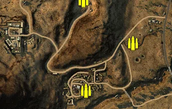
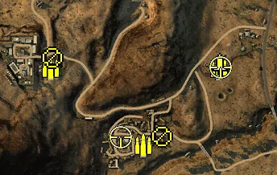
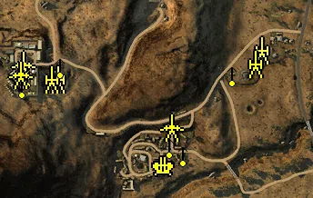
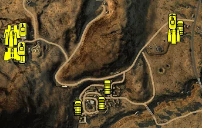

Static Ammo Crate

Pickup Kit

Static Emplacement

Vehicle

| gpo_subcat   | gpo_cat    | gpo_name                |    pos_x |   pos_y |   pos_z |   flag | is_locked   |   team | instance                                     | gpo_cat_disp       | gpo_subcat_disp   |
|:-------------|:-----------|:------------------------|---------:|--------:|--------:|-------:|:------------|-------:|:---------------------------------------------|:-------------------|:------------------|
| ammo_crate   | ammo_crate | ammo_crate              | -483.537 |  21.317 | 669.351 |      0 | False       |      0 | ammo_crate_0                                 | Static Ammo Crate  | Static Ammo Crate |
| ammo_crate   | ammo_crate | ammo_crate              | -488.288 |  39.077 | 347.332 |      0 | False       |      0 | ammo_crate_1                                 | Static Ammo Crate  | Static Ammo Crate |
| ammo_crate   | ammo_crate | ammo_crate              | -290.931 |  24.716 | 175.975 |      0 | False       |      0 | ammo_crate_2                                 | Static Ammo Crate  | Static Ammo Crate |
| ammo_crate   | ammo_crate | ammo_crate              | -477.693 |  31.017 | -14.273 |      0 | False       |      0 | ammo_crate_3                                 | Static Ammo Crate  | Static Ammo Crate |
| ammo         | kit        | BA_PickUpAmmokit        | -278.741 |  24.098 | 178.239 |    301 | False       |      0 | CP_32_mareth_Mareth_DE_GB_AmmoCrates         | Pickup Kit         | Ammo Kit          |
| ammo         | kit        | BA_PickUpAmmokit        | -466.897 |  30.433 | -13.645 |    303 | False       |      0 | CP_32_mareth_Mosque_DE_GB_AmmoCrates         | Pickup Kit         | Ammo Kit          |
| ammo         | kit        | BA_PickUpAmmokit        | -696.035 |  65.265 | 178.177 |    302 | False       |      0 | CP_32_mareth_Matmata_DE_GB_AmmoCrates        | Pickup Kit         | Ammo Kit          |
| at_rifle     | kit        | BA_PickUpAntitankBoys   | -419.819 |  26.848 |   8.161 |    304 | False       |      0 | CP_32_mareth_ToujaneCR_DE_GB_ATrifle         | Pickup Kit         | AT Rifle          |
| at_rifle     | kit        | BA_PickUpAntitankBoys   | -692.824 |  66.568 | 204.169 |    302 | False       |      0 | CP_32_mareth_Matmata_DE_GB_ATrifle           | Pickup Kit         | AT Rifle          |
| commando     | kit        | BA_PickUpCommandoTommyD | -276.387 |  24.821 | 184.179 |    301 | False       |      0 | CP_32_mareth_Mareth_Commando                 | Pickup Kit         | Commando Kit      |
| sniper       | kit        | BA_PickUpSniperNo4      | -274.192 |  24.469 | 179.914 |    301 | False       |      0 | CP_32_mareth_Mareth_Sniper                   | Pickup Kit         | Sniper Kit        |
| sniper       | kit        | GA_PickUpSniperK98      | -521.849 |  45.452 |   5.118 |    303 | False       |      0 | CP_32_mareth_Mosque_Sniper                   | Pickup Kit         | Sniper Kit        |
| misc         | noidea     | britcommradio           | -218.571 |  25     | 225.927 |    301 | False       |      0 | CP_32_mareth_Mareth_DE_GB_CommRadio          | FIXME UNASSIGNED   | MISCELLANEOUS     |
| misc         | noidea     | gercommradio            | -776.104 |  76.356 | 157.227 |    302 | False       |      0 | CP_32_mareth_Matmata_DE_GB_CommRadio         | FIXME UNASSIGNED   | MISCELLANEOUS     |
| noidea       | noidea     | commander_mortar_allied |  133.099 |   9.256 | 313.974 |    301 | True        |      0 | CP_32_mareth_Mareth_DE_GB_CommMortar         | FIXME UNASSIGNED   | FIXME UNASSIGNED  |
| noidea       | noidea     | commander_mortar_allied |  132.667 |   9.015 | 319.49  |    301 | True        |      0 | CP_32_mareth_Mareth_DE_GB_CommMortar_0       | FIXME UNASSIGNED   | FIXME UNASSIGNED  |
| noidea       | noidea     | commander_mortar_allied | -990.354 | 104.365 | 360.679 |    302 | True        |      0 | CP_32_mareth_Matmata_DE_GB_CommMortar        | FIXME UNASSIGNED   | FIXME UNASSIGNED  |
| noidea       | noidea     | commander_mortar_allied | -990.349 | 103.835 | 355.789 |    302 | True        |      0 | CP_32_mareth_Matmata_DE_GB_CommMortar_0      | FIXME UNASSIGNED   | FIXME UNASSIGNED  |
| noidea       | noidea     | commander_smoke_allied  |  132.316 |   9.22  | 329.048 |    301 | False       |      0 | CP_32_mareth_Mareth_commanderarty            | FIXME UNASSIGNED   | FIXME UNASSIGNED  |
| arty         | static     | 3inchmortar             | -248.634 |  27.143 | 237.965 |    301 | False       |      0 | CP_32_mareth_Mareth_Mortar                   | Static Emplacement | Artillery         |
| arty         | static     | lefh18                  | -695.083 |  66.952 | 173.826 |    302 | False       |      1 | CP_32_mareth_Matmata_Artillery               | Static Emplacement | Artillery         |
| arty         | static     | sgwr34                  | -710.016 |  65.635 | 174.815 |    302 | False       |      0 | CP_32_mareth_Matmata_Mortar                  | Static Emplacement | Artillery         |
| arty         | static     | 3inchmortar             | -261.972 |  24.368 | 208.659 |    301 | False       |      0 | CP_32_mareth_Mareth_DE_GB_Howitzer           | Static Emplacement | Artillery         |
| flak         | static     | flak18                  | -462.613 |  30.311 | -17.987 |    303 | False       |      0 | CP_32_mareth_Mosque_ATAA                     | Static Emplacement | Anti-aircraft Gun |
| mg_nest      | static     | mg34_bipod              | -312.983 |  25.289 | 184.58  |    301 | False       |      0 | CP_32_mareth_Mareth_MGbunker                 | Static Emplacement | Static MG         |
| mg_nest      | static     | mg34_bipod              | -689.107 |  68.181 | 201.528 |    302 | False       |      1 | CP_32_mareth_Matmata_MG                      | Static Emplacement | Static MG         |
| mg_nest      | static     | mg34_bipod              | -762.058 |  82.92  | 180.216 |    302 | False       |      0 | CP_32_mareth_Matmata_12                      | Static Emplacement | Static MG         |
| mg_nest      | static     | mg34_bipod              | -774.176 |  80.804 | 157.409 |    302 | False       |      0 | CP_32_mareth_Matmata_LightMG                 | Static Emplacement | Static MG         |
| mg_nest      | static     | mg34_bipod              | -419.166 |  27.829 |   7.177 |    303 | False       |      0 | CP_32_mareth_Mosque_MG                       | Static Emplacement | Static MG         |
| mg_nest      | static     | mg34_bipod              | -450.515 |  32.547 |  25.419 |    303 | False       |      0 | CP_32_mareth_Mosque_MG2                      | Static Emplacement | Static MG         |
| pak          | static     | pak40_static_ws         | -771.042 |  76.409 | 205.672 |    302 | False       |      0 | CP_32_mareth_Matmata_11                      | Static Emplacement | Anti-tank Gun     |
| pak          | static     | pak40_static_ws         | -446.224 |  34.823 |  67.941 |    303 | False       |      0 | CP_32_mareth_Mosque_1_1                      | Static Emplacement | Anti-tank Gun     |
| pak          | static     | pak40_ws                | -777.403 |  76.285 | 183.394 |    302 | False       |      0 | CP_32_mareth_Matmata_DE_GB_LightArtillery    | Static Emplacement | Anti-tank Gun     |
| apc          | vehicle    | universalcarrier_bren   | -745.913 |  75.527 | 158.724 |    302 | False       |      0 | CP_32_mareth_Matmata_DE_GB_PersonelCarrier2  | Vehicle            | APC               |
| apc          | vehicle    | universalcarrier_bren   | -232.428 |  25.06  | 255.23  |    301 | False       |      0 | CP_32_mareth_Mareth_DE_GB_PersonelCarrier2   | Vehicle            | APC               |
| apc          | vehicle    | universalcarrier_bren   | -232.149 |  25.061 | 250.647 |    301 | False       |      0 | CP_32_mareth_Mareth_DE_GB_PersonelCarrier2_0 | Vehicle            | APC               |
| apc          | vehicle    | universalcarrier_bren   | -560.581 |  30.131 | -17.718 |    303 | False       |      0 | CP_32_mareth_Mosque_DE_GB_PersonelCarrier2   | Vehicle            | APC               |
| car          | vehicle    | bedfordoyd              | -208.125 |  25.06  | 254.486 |    301 | False       |      0 | CP_32_mareth_Mareth_Truck                    | Vehicle            | Car               |
| car          | vehicle    | kubeldak                | -455.362 |  31.518 |  52.131 |    303 | False       |      0 | CP_32_mareth_Mosque_Scout                    | Vehicle            | Car               |
| car          | vehicle    | chevy30cwt              | -555.408 |  30.043 | -17.151 |    303 | False       |      0 | CP_32_mareth_Mosque_PersonelCarrier          | Vehicle            | Car               |
| car          | vehicle    | chevy30cwt              | -476.572 |  30.488 |  -3.304 |    303 | False       |      1 | CP_32_mareth_Mosque_Truck                    | Vehicle            | Car               |
| car          | vehicle    | chevy30cwt              | -233.437 |  25.06  | 265.192 |    301 | False       |      0 | CP_32_mareth_Mareth_DE_GB_TruckAA            | Vehicle            | Car               |
| car          | vehicle    | willysmbsas             | -232.685 |  25.06  | 259.951 |    301 | False       |      0 | CP_32_mareth_Mareth_DE_GB_CarCommando        | Vehicle            | Car               |
| car          | vehicle    | kettenkrad_dak          | -790.989 |  76.243 | 217.467 |    302 | False       |      0 | CP_32_mareth_Matmata_DE_GB_CarCommando       | Vehicle            | Car               |
| recon        | vehicle    | sdkfz222                | -780.291 |  76.285 | 163.839 |    302 | True        |      0 | CP_32_mareth_Matmata_MobileAA                | Vehicle            | Scout Vehicle     |
| recon        | vehicle    | sahariana               | -780.093 |  75.463 | 240.443 |    302 | False       |      0 | CP_32_mareth_Matmata_DE_GB_Truck_0           | Vehicle            | Scout Vehicle     |
| supply       | vehicle    | bedfordoyd_ammo         | -783.022 |  76.241 | 216.117 |    302 | False       |      0 | CP_32_mareth_Matmata_DE_GB_TruckAmmo         | Vehicle            | Supply Vehicle    |
| supply       | vehicle    | bedfordoyd_ammo         | -229.314 |  25.06  | 227.479 |    301 | False       |      0 | CP_32_mareth_Mareth_DE_GB_TruckAmmo          | Vehicle            | Supply Vehicle    |
| tank         | vehicle    | churchillmkiii          | -233.299 |  25.06  | 280.193 |    301 | True        |      0 | CP_32_mareth_Mareth_DE_GB_MediumTank         | Vehicle            | Tank              |
| tank         | vehicle    | m4a1                    | -233.306 |  25.06  | 272.104 |    301 | True        |      0 | CP_32_mareth_Mareth_DE_GB_HeavyTank2         | Vehicle            | Tank              |
| tank         | vehicle    | pziii_l_dak             | -747.892 |  75.611 | 182.818 |    302 | True        |      0 | CP_32_mareth_Matmata_DE_GB_MediumTank3       | Vehicle            | Tank              |
| tank         | vehicle    | fiatl6_40               | -744.367 |  75.586 | 247.087 |    302 | True        |      0 | CP_32_mareth_Matmata_DE_GB_ItalianMedTank    | Vehicle            | Tank              |

