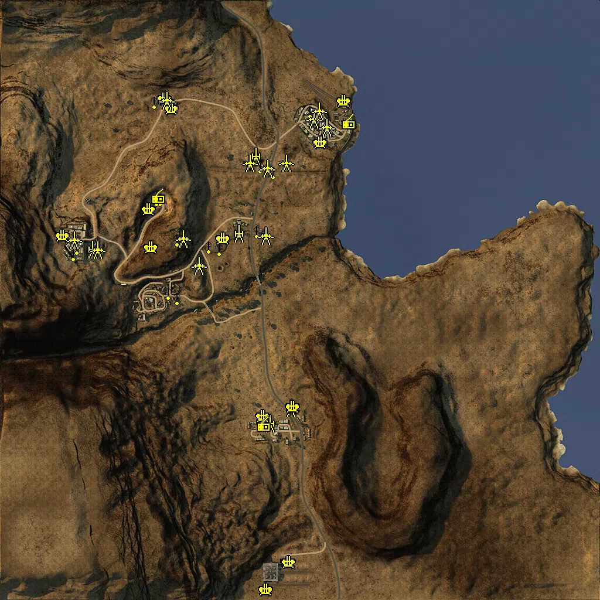
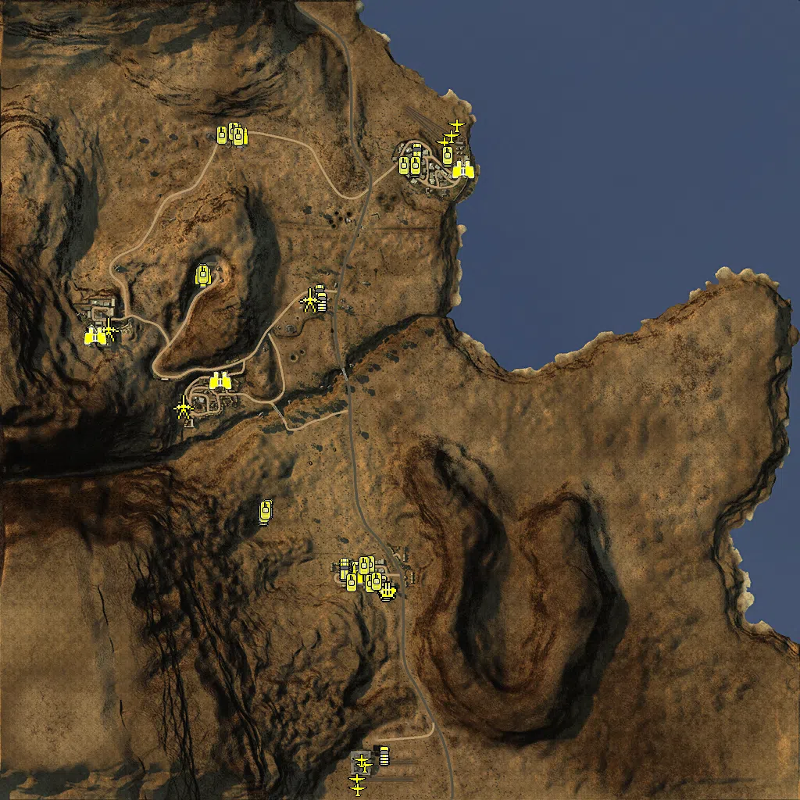

Static Ammo Crate

Pickup Kit

Static Emplacement

Vehicle

| gpo_subcat   | gpo_cat    | gpo_name                   |    pos_x |   pos_y |    pos_z |   flag | is_locked   |   team | instance                                     | gpo_cat_disp       | gpo_subcat_disp   |
|:-------------|:-----------|:---------------------------|---------:|--------:|---------:|-------:|:------------|-------:|:---------------------------------------------|:-------------------|:------------------|
| ammo_crate   | ammo_crate | ammo_crate                 | -483.537 |  21.317 |  669.351 |      0 | False       |      0 | ammo_crate_0                                 | Static Ammo Crate  | Static Ammo Crate |
| ammo_crate   | ammo_crate | ammo_crate                 | -488.288 |  39.077 |  347.332 |      0 | False       |      0 | ammo_crate_1                                 | Static Ammo Crate  | Static Ammo Crate |
| ammo_crate   | ammo_crate | ammo_crate                 | -290.931 |  24.716 |  175.975 |      0 | False       |      0 | ammo_crate_2                                 | Static Ammo Crate  | Static Ammo Crate |
| ammo_crate   | ammo_crate | ammo_crate                 | -477.693 |  31.017 |  -14.273 |      0 | False       |      0 | ammo_crate_3                                 | Static Ammo Crate  | Static Ammo Crate |
| ammo         | kit        | BA_PickUpAmmokit           |   79.399 |  16.181 |  533.706 |      8 | False       |      0 | CP_64_mareth_Upper_Gabes_DE_GB_AmmoCrates    | Pickup Kit         | Ammo Kit          |
| ammo         | kit        | BA_PickUpAmmokit           | -129.098 |  26.305 |  461.695 |      4 | False       |      0 | CP_64_mareth_Upper_Gabes_DE_GB_AmmoCrates_0  | Pickup Kit         | Ammo Kit          |
| ammo         | kit        | BA_PickUpAmmokit           | -432.097 |  20.394 |  670.294 |    101 | False       |      0 | CP_64_mareth_Gap_Defense_DE_GB_AmmoCrates    | Pickup Kit         | Ammo Kit          |
| ammo         | kit        | BA_PickUpAmmokit           | -696.035 |  65.265 |  178.177 |      6 | False       |      0 | CP_64_mareth_Matmata_DE_GB_AmmoCrates        | Pickup Kit         | Ammo Kit          |
| ammo         | kit        | BA_PickUpAmmokit           | -476.983 |  34.622 |  352.118 |      5 | False       |      0 | CP_64_mareth_Command_Bunker_DE_GB_AmmoCrates | Pickup Kit         | Ammo Kit          |
| ammo         | kit        | BA_PickUpAmmokit           | -466.897 |  30.433 |  -13.645 |      7 | False       |      0 | CP_64_mareth_Toujane_DE_GB_AmmoCrates        | Pickup Kit         | Ammo Kit          |
| ammo         | kit        | BA_PickUpAmmokit           | -278.741 |  24.098 |  178.239 |      3 | False       |      0 | CP_64_mareth_Mareth_DE_GB_AmmoCrates         | Pickup Kit         | Ammo Kit          |
| ammo         | kit        | BA_PickUpAmmokit           | -114.004 |  25.69  | -419.991 |      2 | False       |      0 | CP_64_mareth_Medenine_DE_GB_AmmoCrates       | Pickup Kit         | Ammo Kit          |
| ammo         | kit        | BA_PickUpAmmokit           |  -28.4   |  24.902 | -369.334 |      2 | False       |      0 | CP_64_mareth_Medenine_DE_GB_AmmoCrates_0     | Pickup Kit         | Ammo Kit          |
| at_rifle     | kit        | BA_PickUpAntitankBoys      | -476.132 |  34.634 |  349.915 |      5 | False       |      0 | CP_64_mareth_Command_Bunker_ATrifle          | Pickup Kit         | AT Rifle          |
| commando     | kit        | BA_PickUpCommandoTommyD    | -276.387 |  24.817 |  184.179 |      3 | False       |      0 | CP_64_mareth_Mareth_Commando                 | Pickup Kit         | Commando Kit      |
| commando     | kit        | BA_PickUpCommandoTommyD    | -221.336 |  25.666 |  229.497 |      3 | False       |      0 | CP_64_mareth_Mareth_DE_GB_Commando           | Pickup Kit         | Commando Kit      |
| mg           | kit        | BA_PickUpSupportBrenMK1    | -291.207 |  23.98  |  176.839 |      3 | False       |      0 | CP_64_mareth_Mareth_Support                  | Pickup Kit         | MG Kit            |
| mg           | kit        | BA_PickUpSupportBrenMK1    | -481.917 |  20.564 |  666.006 |    101 | False       |      0 | CP_64_mareth_Gap_Defense_Support             | Pickup Kit         | MG Kit            |
| parachute    | kit        | BA_PickUpPilotWebley       |  141.818 |  11.74  |  660.735 |      1 | False       |      0 | CP_64_mareth_Lower_Gabes_Pilot               | Pickup Kit         | Parachute Kit     |
| parachute    | kit        | BA_PickUpPilotWebley       |  141.762 |  11.728 |  659.938 |      1 | False       |      0 | CP_64_mareth_Lower_Gabes_0_2                 | Pickup Kit         | Parachute Kit     |
| parachute    | kit        | BA_PickUpPilotWebley       |  141.86  |  11     |  661.621 |      1 | False       |      0 | CP_64_mareth_Lower_Gabes_1_2                 | Pickup Kit         | Parachute Kit     |
| parachute    | kit        | BA_PickUpPilotWebley       | -111.567 |  25.733 | -912.292 |      2 | False       |      0 | CP_64_mareth_Medenine_Pilot                  | Pickup Kit         | Parachute Kit     |
| parachute    | kit        | BA_PickUpPilotWebley       | -113.818 |  25.755 | -913.172 |      2 | False       |      0 | CP_64_mareth_Medenine_0_4                    | Pickup Kit         | Parachute Kit     |
| parachute    | kit        | BA_PickUpPilotWebley       | -116.056 |  25.481 | -960.867 |      2 | False       |      0 | CP_64_mareth_Medenine_1_3                    | Pickup Kit         | Parachute Kit     |
| parachute    | kit        | BA_PickUpPilotWebley       | -117.692 |  25.517 | -960.759 |      2 | False       |      0 | CP_64_mareth_Medenine_2_1                    | Pickup Kit         | Parachute Kit     |
| sniper       | kit        | BA_PickUpSniperNo4         | -521.849 |  45.452 |    5.118 |      7 | False       |      0 | CP_64_mareth_Toujane_Sniper                  | Pickup Kit         | Sniper Kit        |
| sniper       | kit        | BA_PickUpSniperNo4         | -274.192 |  24.469 |  179.914 |      3 | False       |      0 | CP_64_mareth_Mareth_Sniper                   | Pickup Kit         | Sniper Kit        |
| misc         | noidea     | gercommradio               |  165.564 |  11.03  |  605.88  |      1 | False       |      0 | CP_64_mareth_Lower_Gabes_Radio               | FIXME UNASSIGNED   | MISCELLANEOUS     |
| misc         | noidea     | gercommradio               | -123.181 |  24.97  | -425.939 |      2 | False       |      2 | CP_64_mareth_Medenine_Radio                  | FIXME UNASSIGNED   | MISCELLANEOUS     |
| misc         | noidea     | gercommradio               | -484.41  |  34.607 |  351.064 |      5 | False       |      1 | CP_64_mareth_Command_Bunker_CommanderRadio   | FIXME UNASSIGNED   | MISCELLANEOUS     |
| misc         | noidea     | sf14_periscope             | -418.712 |  65.816 |  209.302 |      5 | False       |      0 | CP_64_mareth_Command_Bunker_sf14_3           | FIXME UNASSIGNED   | MISCELLANEOUS     |
| noidea       | noidea     | commander_mortar_axis      | -815.91  | 129.996 | 1015.77  |      5 | True        |      1 | CP_64_mareth_Command_Bunker_CommMortar       | FIXME UNASSIGNED   | FIXME UNASSIGNED  |
| noidea       | noidea     | commander_artillery_allied |  466.9   |  26.082 | -973.782 |      2 | True        |      2 | CP_64_mareth_Medenine_CommMortar             | FIXME UNASSIGNED   | FIXME UNASSIGNED  |
| noidea       | noidea     | commander_artillery_allied |  470.174 |  26.541 | -971.265 |      2 | True        |      0 | CP_64_mareth_Medenine_DE_GB_CommArtillery    | FIXME UNASSIGNED   | FIXME UNASSIGNED  |
| noidea       | noidea     | commander_artillery_allied |  463.185 |  25.777 | -977.809 |      2 | True        |      0 | CP_64_mareth_Medenine_DE_GB_CommArtillery_0  | FIXME UNASSIGNED   | FIXME UNASSIGNED  |
| noidea       | noidea     | commander_smoke_allied     |  469.335 |  25.313 | -978.127 |      2 | True        |      0 | CP_64_mareth_Medenine_DE_GB_CommSmoke        | FIXME UNASSIGNED   | FIXME UNASSIGNED  |
| noidea       | noidea     | commander_mortar_axis      | -813.117 | 130.164 | 1015.92  |      5 | True        |      0 | CP_64_mareth_Gap_Defense_DE_GB_CommMortar    | FIXME UNASSIGNED   | FIXME UNASSIGNED  |
| noidea       | noidea     | commander_mortar_axis      | -819.395 | 129.822 | 1015.74  |      5 | True        |      0 | CP_64_mareth_Gap_Defense_DE_GB_CommMortar_0  | FIXME UNASSIGNED   | FIXME UNASSIGNED  |
| arty         | static     | sgwr34                     | -210.352 |  25.126 |  228.463 |      3 | False       |      0 | CP_64_mareth_Mareth_Mortar                   | Static Emplacement | Artillery         |
| arty         | static     | 25pdr                      | -103.225 |  24.389 | -420.615 |      2 | False       |      0 | CP_64_mareth_Medenine_Arti                   | Static Emplacement | Artillery         |
| arty         | static     | 25pdr                      |  -32.144 |  25.399 | -367.781 |      2 | False       |      2 | CP_64_mareth_Medenine_LightArtillery         | Static Emplacement | Artillery         |
| arty         | static     | sgwr34                     | -710.016 |  65.635 |  174.815 |      6 | False       |      0 | CP_64_mareth_Matmata_Mortar                  | Static Emplacement | Artillery         |
| arty         | static     | nebelwerfer                | -152.541 |  26.785 |  492.373 |      4 | False       |      0 | CP_64_mareth_Upper_Gabes_Artillery           | Static Emplacement | Artillery         |
| flak         | static     | flak18                     | -262.106 |  24.412 |  209.575 |      3 | False       |      0 | CP_64_mareth_Mareth_AntiAirSmall             | Static Emplacement | Anti-aircraft Gun |
| flak         | static     | flak18ns                   |   70.425 |  15.773 |  537.223 |      8 | False       |      0 | CP_64_mareth_Upper_Gabes_AT                  | Static Emplacement | Anti-aircraft Gun |
| flak         | static     | bofors40mm                 | -125.951 |  25.522 | -396.741 |      2 | False       |      2 | CP_64_mareth_Medenine_AntiAirSmall           | Static Emplacement | Anti-aircraft Gun |
| flak         | static     | bofors40mm                 |  -38.303 |  25.404 | -894.412 |      2 | False       |      0 | CP_64_mareth_Medenine_AA                     | Static Emplacement | Anti-aircraft Gun |
| flak         | static     | flak38                     | -461.966 |  18.776 |  688.995 |    101 | False       |      0 | CP_64_mareth_Gap_Defense_AA                  | Static Emplacement | Anti-aircraft Gun |
| flak         | static     | flak18                     | -438.998 |  20.085 |  653.698 |    101 | False       |      0 | CP_64_mareth_Gap_Defense_AT                  | Static Emplacement | Anti-aircraft Gun |
| flak         | static     | flak38                     | -810.352 |  76.515 |  220.688 |      6 | False       |      0 | CP_64_mareth_Matmata_AntiAirSmall            | Static Emplacement | Anti-aircraft Gun |
| flak         | static     | flak18                     | -515.43  |  36.414 |  309.895 |      5 | False       |      0 | CP_64_mareth_Command_Bunker_HeavyAT          | Static Emplacement | Anti-aircraft Gun |
| flak         | static     | flakvierling38             |  149.23  |  10.833 |  680.01  |      1 | False       |      0 | CP_64_mareth_Lower_Gabes_DE_GB_AntiAirHeavy  | Static Emplacement | Anti-aircraft Gun |
| flak         | static     | flak18ns                   | -507.494 |  54.152 |  179.86  |      5 | False       |      0 | CP_64_mareth_Command_Bunker_flak88_command   | Static Emplacement | Anti-aircraft Gun |
| flak         | static     | bofors40mm                 |  -24.487 |  25.292 | -363.762 |      2 | False       |      2 | CP_64_mareth_Medenine_bofors                 | Static Emplacement | Anti-aircraft Gun |
| flak         | static     | bofors40mm                 | -115.027 |  25.402 | -988.183 |      2 | False       |      0 | CP_64_mareth_Medenine_bofors2                | Static Emplacement | Anti-aircraft Gun |
| mg_nest      | static     | mg34_bipod                 | -478.901 |  39.451 |  346.279 |      5 | False       |      0 | CP_64_mareth_Command_Bunker_StationaryMG     | Static Emplacement | Static MG         |
| mg_nest      | static     | mg34_bipod                 | -490.191 |  39.462 |  346.197 |      5 | False       |      0 | CP_64_mareth_Command_Bunker_0_1              | Static Emplacement | Static MG         |
| mg_nest      | static     | mg34_bipod                 | -276.326 |  25.38  |  175.673 |      3 | False       |      0 | CP_64_mareth_Mareth_StationaryMG             | Static Emplacement | Static MG         |
| mg_nest      | static     | mg34_bipod                 | -148.571 |  26.587 |  235.167 |      3 | False       |      0 | CP_64_mareth_Mareth_0                        | Static Emplacement | Static MG         |
| mg_nest      | static     | mg34_bipod                 | -312.983 |  25.289 |  184.58  |      3 | False       |      0 | CP_64_mareth_Mareth_MGbunker                 | Static Emplacement | Static MG         |
| mg_nest      | static     | mg34_bipod                 | -419.166 |  27.829 |    7.177 |      7 | False       |      0 | CP_64_mareth_Toujane_MG                      | Static Emplacement | Static MG         |
| mg_nest      | static     | mg34_bipod                 | -450.515 |  32.547 |   25.419 |      7 | False       |      0 | CP_64_mareth_Toujane_MG2                     | Static Emplacement | Static MG         |
| mg_nest      | static     | mg34_bipod                 |   33.063 |  23.667 |  645.534 |      8 | False       |      0 | CP_64_mareth_Upper_Gabes_MG                  | Static Emplacement | Static MG         |
| mg_nest      | static     | mg34_bipod                 | -689.107 |  68.181 |  201.528 |      6 | False       |      1 | CP_64_mareth_Matmata_MG                      | Static Emplacement | Static MG         |
| mg_nest      | static     | mg34_bipod                 | -762.058 |  82.92  |  180.216 |      6 | False       |      0 | CP_64_mareth_Matmata_0_12                    | Static Emplacement | Static MG         |
| mg_nest      | static     | mg34_bipod                 | -497.072 |  21.793 |  677.707 |    101 | False       |      0 | CP_64_mareth_Gap_Defense_MG                  | Static Emplacement | Static MG         |
| mg_nest      | static     | mg34_bipod                 | -774.176 |  80.804 |  157.409 |      6 | False       |      0 | CP_64_mareth_Matmata_LightMG                 | Static Emplacement | Static MG         |
| mg_nest      | static     | mg34_bunker                |  -91.451 |  27.183 |  438.552 |      4 | False       |      0 | CP_64_mareth_second_line_bunkermg            | Static Emplacement | Static MG         |
| mg_nest      | static     | mg81z_tripod               | -136.291 |  29.139 |  458.226 |      4 | False       |      0 | CP_64_mareth_second_line_lafette2            | Static Emplacement | Static MG         |
| mg_nest      | static     | mg34_bipod                 | -409.115 |  65.959 |  230.748 |      5 | False       |      0 | CP_64_mareth_Command_Bunker_mg34bunker       | Static Emplacement | Static MG         |
| mg_nest      | static     | mg81z_tripod               | -419.328 |  65.874 |  207.687 |      5 | False       |      0 | CP_64_mareth_Command_Bunker_mg81z            | Static Emplacement | Static MG         |
| pak          | static     | pak40_static_ws            | -771.042 |  76.409 |  205.672 |      6 | False       |      0 | CP_64_mareth_Matmata_0_11                    | Static Emplacement | Anti-tank Gun     |
| pak          | static     | pak40_static_ws            |   89.514 |  13.333 |  589.926 |      1 | False       |      0 | CP_64_mareth_Lower_Gabes_AT                  | Static Emplacement | Anti-tank Gun     |
| pak          | static     | pak40_static_ws            | -691.781 |  67.681 |  171.08  |      6 | False       |      1 | CP_64_mareth_Matmata_Artillery               | Static Emplacement | Anti-tank Gun     |
| pak          | static     | pak40_static_ws            | -455.031 |  20.286 |  682.131 |    101 | False       |      0 | CP_64_mareth_Gap_Defense_StaticAT            | Static Emplacement | Anti-tank Gun     |
| pak          | static     | pak40_static_ws            |   45.095 |  17.492 |  617.65  |      8 | False       |      0 | CP_64_mareth_Upper_Gabes_AT_0                | Static Emplacement | Anti-tank Gun     |
| pak          | static     | pak40_ws                   |   63.16  |  16.942 |  646.148 |      8 | False       |      0 | CP_64_mareth_Upper_Gabes_MobileAT            | Static Emplacement | Anti-tank Gun     |
| pak          | static     | pak38                      | -172.394 |  26.052 |  468.494 |      4 | False       |      0 | CP_64_mareth_second_line_pak38               | Static Emplacement | Anti-tank Gun     |
| pak          | static     | 6pdr                       | -111.388 |  25.437 |  449.278 |      4 | False       |      0 | CP_64_mareth_second_line_pak38_0             | Static Emplacement | Anti-tank Gun     |
| pak          | static     | pak38_static               | -117.335 |  25.521 |  220.03  |      3 | False       |      0 | CP_64_mareth_Mareth_pak38                    | Static Emplacement | Anti-tank Gun     |
| pak          | static     | pak38_static               | -346.805 |  32.835 |  118.994 |      3 | False       |      0 | CP_64_mareth_Mareth_cannon                   | Static Emplacement | Anti-tank Gun     |
| pak          | static     | 6pdr                       |  -47.832 |  26.295 |  468.744 |      4 | False       |      0 | CP_64_mareth_second_line_pak38_2             | Static Emplacement | Anti-tank Gun     |
| pak          | static     | pak38_static               | -400.131 |  61.33  |  209.081 |      5 | False       |      0 | CP_64_mareth_Command_Bunker_kwk5cm           | Static Emplacement | Anti-tank Gun     |
| apc          | vehicle    | sdkfz251_10                | -503.817 |  34.866 |  326.286 |      5 | False       |      1 | CP_64_mareth_Command_Bunker_                 | Vehicle            | APC               |
| apc          | vehicle    | sdkfz251_1                 |   38.751 |  16.219 |  595.857 |      8 | False       |      0 | CP_64_mareth_Upper_Gabes_PersonelCarrier     | Vehicle            | APC               |
| apc          | vehicle    | universalcarrier_bren      |  -45.602 |  26.67  | -471.892 |      2 | False       |      2 | CP_64_mareth_Medenine_Scout                  | Vehicle            | APC               |
| apc          | vehicle    | universalcarrier_bren      | -141.319 |  24.875 | -427.41  |      2 | False       |      2 | CP_64_mareth_Medenine_PersonelCarrier        | Vehicle            | APC               |
| apc          | vehicle    | universalcarrier_bren      | -111.852 |  24.972 | -435.536 |      2 | False       |      2 | CP_64_mareth_Medenine_MobileRadio            | Vehicle            | APC               |
| apc          | vehicle    | sdkfz251_1                 |   43.842 |  16.981 |  633.043 |      8 | False       |      1 | CP_64_mareth_Upper_Gabes_0                   | Vehicle            | APC               |
| apc          | vehicle    | universalcarrier_bren      | -141.963 |  25.059 | -437.829 |      2 | False       |      0 | CP_64_mareth_Medenine_DE_GB_HeavyTruck       | Vehicle            | APC               |
| apc          | vehicle    | sdkfz251_10                | -205.693 |  23.841 |  271.589 |      3 | False       |      0 | CP_64_mareth_Mareth_sdkfz251_10              | Vehicle            | APC               |
| apc          | vehicle    | universalcarrier_bren      | -349.223 |  25.07  | -295.253 |      2 | False       |      2 | CP_64_mareth_Medenine_carrier                | Vehicle            | APC               |
| apc          | vehicle    | universalcarrier_bren      | -337.844 |  26.28  | -278.613 |      2 | False       |      2 | CP_64_mareth_Medenine_universalcarrier       | Vehicle            | APC               |
| apc          | vehicle    | sdkfz251_1                 | -419.15  |  20.013 |  688.067 |    101 | False       |      1 | CP_64_mareth_Gap_Defense_sdkfz251            | Vehicle            | APC               |
| car          | vehicle    | chevy30cwt                 | -200.341 |  25.06  |  252.571 |      3 | False       |      0 | CP_64_mareth_Mareth_Truck                    | Vehicle            | Car               |
| car          | vehicle    | chevy30cwt                 |  -36.959 |  26.657 | -489.083 |      2 | False       |      2 | CP_64_mareth_Medenine_1_2                    | Vehicle            | Car               |
| car          | vehicle    | chevy30cwt                 |  -39.628 |  24.823 | -910.443 |      2 | False       |      0 | CP_64_mareth_Medenine_Scout_0                | Vehicle            | Car               |
| flak_sp      | vehicle    | deacon_bofors              |  -30.799 |  26.647 | -488.822 |      2 | False       |      2 | CP_64_mareth_Medenine_lightArmour            | Vehicle            | Mobile FlaK       |
| pak_sp       | vehicle    | deacon                     | -747.466 |  75.716 |  182.66  |      6 | False       |      0 | CP_64_mareth_Matmata_HeavyTank               | Vehicle            | Mobile PaK        |
| pak_sp       | vehicle    | deacon                     | -556.263 |  30.035 |  -16.816 |      7 | False       |      0 | CP_64_mareth_Toujane_PersonelCarrier         | Vehicle            | Mobile PaK        |
| pak_sp       | vehicle    | deacon                     | -231.548 |  25.06  |  257.307 |      3 | False       |      0 | CP_64_mareth_Mareth_DE_GB_MediumTank         | Vehicle            | Mobile PaK        |
| plane        | vehicle    | spitfire_ix                | -110.988 |  23.618 | -972.518 |      2 | True        |      2 | CP_64_mareth_Medenine_Fighter1               | Vehicle            | Airplane          |
| plane        | vehicle    | p-40e_kittyhawk            |  -89.064 |  25.038 | -935.226 |      2 | True        |      2 | CP_64_mareth_Medenine_Bomber                 | Vehicle            | Airplane          |
| plane        | vehicle    | ju87d1_trop                |  113.003 |  10.929 |  657.443 |      1 | True        |      1 | CP_64_mareth_Lower_Gabes_Fighter             | Vehicle            | Airplane          |
| plane        | vehicle    | bf109f4_trop               |  132.995 |   9.007 |  675.493 |      1 | True        |      1 | CP_64_mareth_Lower_Gabes_0_1                 | Vehicle            | Airplane          |
| plane        | vehicle    | storch_trop                |  146.622 |  10.724 |  703.757 |      1 | True        |      0 | CP_64_mareth_Lower_Gabes_ScoutPlane          | Vehicle            | Airplane          |
| plane        | vehicle    | pipercub_gb                | -108.942 |  25.038 | -996.399 |      2 | True        |      0 | CP_64_mareth_Medenine_ScoutPlane             | Vehicle            | Airplane          |
| plane        | vehicle    | p-40e_kittyhawk            |  -98.052 |  25.038 | -921.098 |      2 | True        |      2 | CP_64_mareth_Medenine_beaufighter2           | Vehicle            | Airplane          |
| recon        | vehicle    | sahariana                  |  161.312 |  11.079 |  590.83  |      1 | False       |      0 | CP_64_mareth_Lower_Gabes_0_0                 | Vehicle            | Scout Vehicle     |
| recon        | vehicle    | sahariana                  | -459.431 |  31.891 |   49.893 |      7 | False       |      0 | CP_64_mareth_Toujane_Scout                   | Vehicle            | Scout Vehicle     |
| recon        | vehicle    | sdkfz222                   | -780.291 |  76.285 |  163.839 |      6 | True        |      0 | CP_64_mareth_Matmata_MobileAA                | Vehicle            | Scout Vehicle     |
| supply       | vehicle    | bedfordoyd_ammo            | -503.081 |  34.918 |  317.962 |      5 | False       |      0 | CP_64_mareth_Command_Bunker_Truck2           | Vehicle            | Supply Vehicle    |
| supply       | vehicle    | bedfordoyd_ammo            | -101.815 |  24.981 | -441.745 |      2 | False       |      2 | CP_64_mareth_Medenine_0_2                    | Vehicle            | Supply Vehicle    |
| supply       | vehicle    | bedfordoyd_ammo            | -409.21  |  20.017 |  675.554 |    101 | False       |      0 | CP_64_mareth_Gap_Defense_TruckAmmo           | Vehicle            | Supply Vehicle    |
| tank         | vehicle    | marder_iii                 | -425.16  |  20.012 |  687.802 |    101 | True        |      0 | CP_64_mareth_Mareth_LightTank2               | Vehicle            | Tank              |
| tank         | vehicle    | pziii_l_dak                |   40.054 |  15.845 |  600.465 |      8 | True        |      1 | CP_64_mareth_Upper_Gabes_1                   | Vehicle            | Tank              |
| tank         | vehicle    | pziii_n_dak                |  122.023 |   9.668 |  617.652 |    102 | True        |      1 | CP_64_mareth_Lower_Gabes_HeavyTank           | Vehicle            | Tank              |
| tank         | vehicle    | tiger_dak                  |  121.993 |   9.665 |  622.358 |      1 | True        |      1 | CP_64_mareth_Lower_Gabes_0                   | Vehicle            | Tank              |
| tank         | vehicle    | pziii_n_dak                |  121.841 |   9.66  |  626.839 |      1 | True        |      1 | CP_64_mareth_Lower_Gabes_1_1                 | Vehicle            | Tank              |
| tank         | vehicle    | m4a1                       |  -77.969 |  24.92  | -422.645 |      2 | True        |      2 | CP_64_mareth_Medenine_LightTank              | Vehicle            | Tank              |
| tank         | vehicle    | m4a1                       |  -75.343 |  24.877 | -464.789 |      2 | True        |      2 | CP_64_mareth_Medenine_0_0                    | Vehicle            | Tank              |
| tank         | vehicle    | churchillmkiii             | -347.825 |  25.237 | -289.262 |      2 | True        |      2 | CP_64_mareth_Medenine_HeavyTank              | Vehicle            | Tank              |
| tank         | vehicle    | crusadermk3                | -124.833 |  27.557 | -467.209 |      2 | True        |      2 | CP_64_mareth_Medenine_0_1                    | Vehicle            | Tank              |
| tank         | vehicle    | crusadermk3                |  -91.04  |  24.59  | -423.262 |      2 | True        |      2 | CP_64_mareth_Medenine_MediumTank             | Vehicle            | Tank              |
| tank         | vehicle    | pziii_l_dak                |    9.105 |  17.063 |  599.78  |      1 | True        |      1 | CP_64_mareth_Toujane_                        | Vehicle            | Tank              |
| tank         | vehicle    | m4a1                       |  -75.113 |  24.15  | -469.825 |      2 | True        |      0 | CP_64_mareth_Medenine_HeavyTank4             | Vehicle            | Tank              |
| tank         | vehicle    | m4a1                       | -503.726 |  35.08  |  321.759 |      5 | True        |      0 | CP_64_mareth_Command_Bunker_DE_GB_HeavyTank2 | Vehicle            | Tank              |
| tank         | vehicle    | crusadermk3                |  -60.51  |  24.862 | -463.779 |      2 | True        |      0 | CP_64_mareth_Medenine_DE_GB_MediumTank       | Vehicle            | Tank              |
| tank         | vehicle    | pziii_l_dak                | -414.214 |  20.012 |  674.243 |    101 | True        |      1 | CP_64_mareth_Gap_Defense_pziii_l             | Vehicle            | Tank              |
| tank         | vehicle    | pziii_l_dak                | -456.05  |  19.817 |  677.016 |    101 | True        |      1 | CP_64_mareth_Gap_Defense_pziii_l_0           | Vehicle            | Tank              |
| tank         | vehicle    | m4a1                       | -343.493 |  25.476 | -281.346 |      2 | True        |      2 | CP_64_mareth_Toujane_churchill2              | Vehicle            | Tank              |

