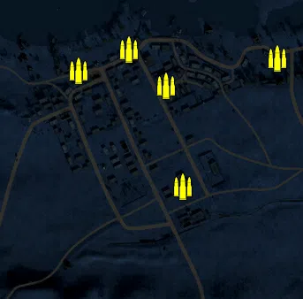
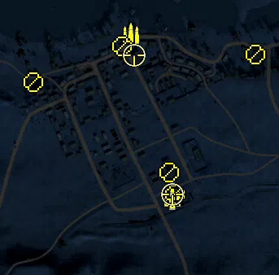
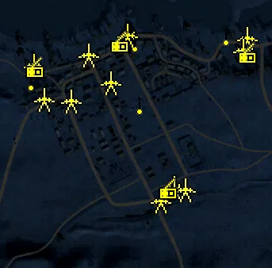
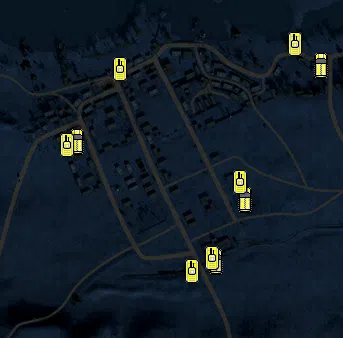

Static Ammo Crate

Pickup Kit

Static Emplacement

Vehicle

| gpo_subcat   | gpo_cat    | gpo_name                |    pos_x |   pos_y |   pos_z |   flag | is_locked   |   team | instance                                 | gpo_cat_disp       | gpo_subcat_disp   |
|:-------------|:-----------|:------------------------|---------:|--------:|--------:|-------:|:------------|-------:|:-----------------------------------------|:-------------------|:------------------|
| ammo_crate   | ammo_crate | ammo_crate              |  898.003 |  57.073 |  41.62  |      0 | False       |      0 | ammo_crate_0                             | Static Ammo Crate  | Static Ammo Crate |
| ammo_crate   | ammo_crate | ammo_crate              |   64.09  |  44.486 | 698.477 |      0 | False       |      0 | ammo_crate_1                             | Static Ammo Crate  | Static Ammo Crate |
| ammo_crate   | ammo_crate | ammo_crate              |  299.262 |  54.879 | 436.108 |      0 | False       |      0 | ammo_crate_2                             | Static Ammo Crate  | Static Ammo Crate |
| ammo_crate   | ammo_crate | ammo_crate              |  262.67  |  44.837 | 663.838 |      0 | False       |      0 | ammo_crate_3                             | Static Ammo Crate  | Static Ammo Crate |
| ammo_crate   | ammo_crate | ammo_crate              |  178.66  |  44.588 | 746.862 |      0 | False       |      0 | ammo_crate_4                             | Static Ammo Crate  | Static Ammo Crate |
| ammo_crate   | ammo_crate | ammo_crate              |  513.625 |  43.4   | 725.27  |      0 | False       |      0 | ammo_crate_5                             | Static Ammo Crate  | Static Ammo Crate |
| ammo_crate   | ammo_crate | ammo_crate              | -549.151 |  48.639 | 607.328 |      0 | False       |      0 | ammo_crate_6                             | Static Ammo Crate  | Static Ammo Crate |
| ammo_crate   | ammo_crate | ammo_crate              | -204.119 | 104.25  | -48.089 |      0 | False       |      0 | ammo_crate_7                             | Static Ammo Crate  | Static Ammo Crate |
| ammo_crate   | ammo_crate | ammo_crate              | -202.094 | 104.676 | -83.148 |      0 | False       |      0 | ammo_crate_8                             | Static Ammo Crate  | Static Ammo Crate |
| ammo         | kit        | BA_PickUpAmmokit        |  310.547 |  56.668 | 371.681 |    306 | False       |      0 | 32_MM_Station_DE_GB_AmmoCrates           | Pickup Kit         | Ammo Kit          |
| ammo         | kit        | BA_PickUpAmmokit        |  208.839 |  45.973 | 771.037 |    301 | False       |      0 | 32_MM_Matruh_DE_GB_AmmoCrates            | Pickup Kit         | Ammo Kit          |
| mg           | kit        | BA_PickUpSupportBrenMK1 |  185.742 |  44.727 | 743.764 |    301 | False       |      0 | 32_MM_Matruh_Support                     | Pickup Kit         | MG Kit            |
| mg           | kit        | BA_PickUpSupportBrenMK1 |  -32.358 |  44.522 | 656.5   |    305 | False       |      0 | 32_MM_West_Matruh_Support                | Pickup Kit         | MG Kit            |
| mg           | kit        | BA_PickUpSupportBrenMK1 |  513.615 |  43.535 | 724.263 |    307 | False       |      0 | 32_MM_East_Matruh_Support                | Pickup Kit         | MG Kit            |
| mg           | kit        | GA_PickUpSupportMG34    |  301.507 |  54.893 | 433.502 |    306 | False       |      0 | 32_MM_Station_DE_GB_Support              | Pickup Kit         | MG Kit            |
| mg           | kit        | GA_PickUpSupportMG34    |  316.85  |  56.922 | 380.72  |    306 | False       |      0 | 32_MM_Station_DE_GB_Support_0            | Pickup Kit         | MG Kit            |
| sniper       | kit        | BA_PickUpSniperNo4      |  215.339 |  60.943 | 722.922 |    301 | False       |      0 | 32_MM_Matruh_Sniper                      | Pickup Kit         | Sniper Kit        |
| sniper       | kit        | GA_PickUpSniperK98      |  310.399 |  56.922 | 379.672 |    306 | False       |      0 | 32_MM_Station_DE_GB_Sniper               | Pickup Kit         | Sniper Kit        |
| misc         | noidea     | britcommradio           |  187.129 |  44.585 | 747.247 |    301 | False       |      0 | 32_MM_Matruh_CommRadio                   | FIXME UNASSIGNED   | MISCELLANEOUS     |
| misc         | noidea     | britcommradio           |  -25.152 |  43.406 | 683.866 |    305 | False       |      0 | 32_MM_West_Matruh_CommRadio              | FIXME UNASSIGNED   | MISCELLANEOUS     |
| misc         | noidea     | gercommradio            |  310.141 |  56.927 | 377.197 |    306 | False       |      0 | 32_MM_Station_CommRadio                  | FIXME UNASSIGNED   | MISCELLANEOUS     |
| misc         | noidea     | britcommradio           |  510.192 |  43.396 | 720.214 |    307 | False       |      0 | 32_MM_East_Matruh_CommRadio              | FIXME UNASSIGNED   | MISCELLANEOUS     |
| noidea       | noidea     | commander_mortar_allied |  432.116 |  81.418 | 100.396 |    306 | True        |      0 | 32_MM_HQ_CommArtillery                   | FIXME UNASSIGNED   | FIXME UNASSIGNED  |
| noidea       | noidea     | commander_mortar_allied |  427.084 |  81.803 |  99.81  |    306 | True        |      0 | 32_MM_HQ_0_2                             | FIXME UNASSIGNED   | FIXME UNASSIGNED  |
| noidea       | noidea     | commander_mortar_allied |  421.857 |  82.044 | 100.129 |    306 | True        |      0 | 32_MM_HQ_1_1                             | FIXME UNASSIGNED   | FIXME UNASSIGNED  |
| noidea       | noidea     | commander_smoke_allied  |  416.139 |  82.154 | 100.265 |    306 | True        |      0 | 32_MM_HQ_CommSmoke                       | FIXME UNASSIGNED   | FIXME UNASSIGNED  |
| noidea       | noidea     | commander_mortar_allied |  863.508 |  41.587 | 797.621 |    307 | True        |      0 | 32_MM_East_Matruh_CommArtillery          | FIXME UNASSIGNED   | FIXME UNASSIGNED  |
| noidea       | noidea     | commander_mortar_allied |  862.717 |  41.761 | 793.371 |    307 | True        |      0 | 32_MM_East_Matruh_0_0                    | FIXME UNASSIGNED   | FIXME UNASSIGNED  |
| noidea       | noidea     | commander_mortar_allied |  862.755 |  41.894 | 789.477 |    307 | True        |      0 | 32_MM_East_Matruh_1_0                    | FIXME UNASSIGNED   | FIXME UNASSIGNED  |
| arty         | static     | 3inchmortar             |  209.9   |  46.127 | 769.148 |    301 | False       |      0 | 32_MM_Matruh_LightMortar                 | Static Emplacement | Artillery         |
| arty         | static     | sgwr34                  |  324.022 |  57.101 | 385.616 |    306 | False       |      0 | 32_MM_Station_DE_GB_LightMortar          | Static Emplacement | Artillery         |
| mg_nest      | static     | lewis_bipod             |  237.318 |  48.844 | 595.673 |    301 | False       |      0 | 32_MM_Matruh_LightMG                     | Static Emplacement | Static MG         |
| mg_nest      | static     | lewis_bipod             |  225.515 |  45.417 | 753.017 |    301 | False       |      0 | 32_MM_Matruh_0_2                         | Static Emplacement | Static MG         |
| mg_nest      | static     | lewis_bipod             |  -36.277 |  45.513 | 655.31  |    305 | False       |      0 | 32_MM_West_Matruh_LightMG                | Static Emplacement | Static MG         |
| mg_nest      | static     | lewis_bipod             |  456.313 |  46.306 | 770.375 |    307 | False       |      0 | 32_MM_East_Matruh_LightMG                | Static Emplacement | Static MG         |
| pak          | static     | 6pdr                    |  107.64  |  44.017 | 719.383 |    301 | False       |      0 | 32_MM_Matruh_LightArtillery              | Static Emplacement | Anti-tank Gun     |
| pak          | static     | 6pdr                    |  164.568 |  46.711 | 650.985 |    301 | False       |      0 | 32_MM_Matruh_0                           | Static Emplacement | Anti-tank Gun     |
| pak          | static     | 6pdr                    |  -30.208 |  42.849 | 694.283 |    305 | False       |      0 | 32_MM_West_Matruh_LightArtillery         | Static Emplacement | Anti-tank Gun     |
| pak          | static     | 6pdr                    |   63.37  |  50.455 | 604.179 |    305 | False       |      0 | 32_MM_West_Matruh_0                      | Static Emplacement | Anti-tank Gun     |
| pak          | static     | 6pdr                    |  508.496 |  42.777 | 762.364 |    307 | False       |      0 | 32_MM_East_Matruh_LightArtillery         | Static Emplacement | Anti-tank Gun     |
| pak          | static     | pak38_static            |  352.485 |  56.952 | 379.263 |    306 | False       |      0 | 32_MM_Station_DE_GB_StaticArtillery      | Static Emplacement | Anti-tank Gun     |
| pak          | static     | pak38_static            |  289.814 |  56.897 | 351.01  |    306 | False       |      0 | 32_MM_Station_DE_GB_StaticArtillery_0    | Static Emplacement | Anti-tank Gun     |
| pak          | static     | 6pdr                    |  205.404 |  46.217 | 770.302 |    301 | False       |      0 | 32_MM_Matruh_DE_GB_LightArtillery        | Static Emplacement | Anti-tank Gun     |
| pak          | static     | 6pdr                    |  497.564 |  43.166 | 731.934 |    307 | False       |      0 | 32_MM_East_Matruh_DE_GB_LightArtillery   | Static Emplacement | Anti-tank Gun     |
| pak          | static     | 6pdr                    |   -4.515 |  52.736 | 608.659 |    305 | False       |      0 | 32_MM_West_Matruh_DE_GB_LightArtillery   | Static Emplacement | Anti-tank Gun     |
| apc          | vehicle    | sdkfz251_1              |  375.744 |  52.809 | 459.513 |    306 | False       |      0 | 32_MM_Station_DE_GB_PersonelCarrier2     | Vehicle            | APC               |
| apc          | vehicle    | universalcarrier_bren   |  527.807 |  43.282 | 727.798 |    307 | False       |      0 | 32_MM_East_Matruh_DE_GB_PersonelCarrier2 | Vehicle            | APC               |
| apc          | vehicle    | universalcarrier_bren   |   40.701 |  52.495 | 576.099 |    305 | False       |      0 | 32_MM_West_Matruh_DE_GB_PersonelCarrier2 | Vehicle            | APC               |
| apc          | vehicle    | sdkfz251_1              |  318.846 |  56.322 | 336.624 |    306 | False       |      0 | 32_MM_Station_DE_GB_PersonelCarrier2_0   | Vehicle            | APC               |
| tank         | vehicle    | M3Grant                 |  125.432 |  44.314 | 720.335 |    301 | True        |      0 | 32_MM_Matruh_HeavyTank4                  | Vehicle            | Tank              |
| tank         | vehicle    | crusadermk1late         |   19.996 |  53.438 | 568.379 |    305 | True        |      0 | 32_MM_West_Matruh_MediumTank3            | Vehicle            | Tank              |
| tank         | vehicle    | pziif                   |  366.078 |  52.972 | 494.318 |    306 | True        |      0 | 32_MM_Station_MediumTank3                | Vehicle            | Tank              |
| tank         | vehicle    | M3Grant                 |  475.745 |  42.026 | 769.802 |    307 | True        |      0 | 32_MM_East_Matruh_HeavyTank4             | Vehicle            | Tank              |
| tank         | vehicle    | pzivf2                  |  269.263 |  57.284 | 316.002 |    306 | True        |      0 | 32_MM_Station_DE_GB_HeavyTank3           | Vehicle            | Tank              |
| tank         | vehicle    | pziii_je_dak            |  310.995 |  56.419 | 342.123 |    306 | True        |      0 | 32_MM_Station_DE_GB_LightArmour3         | Vehicle            | Tank              |

