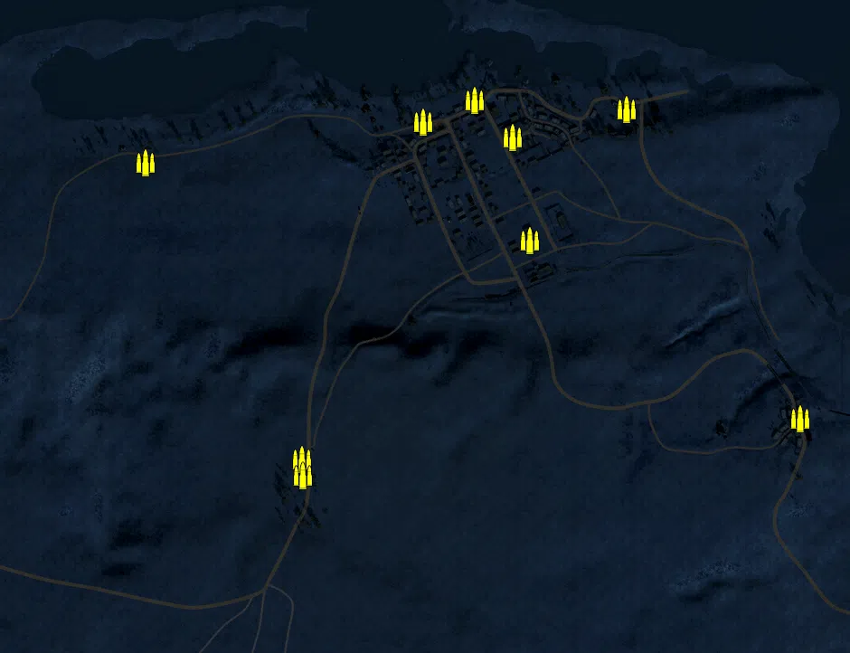
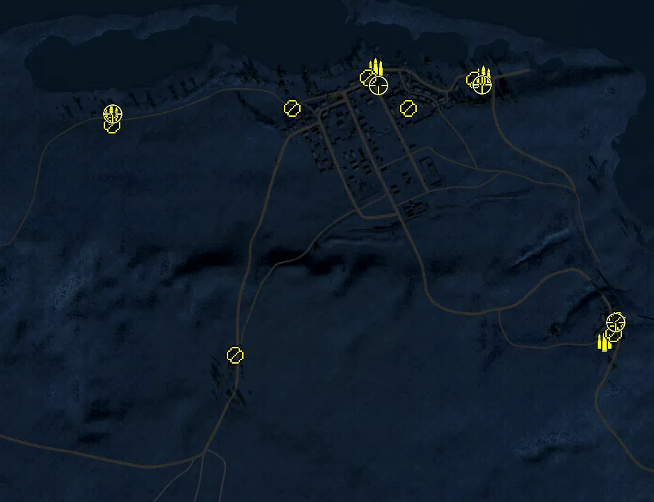
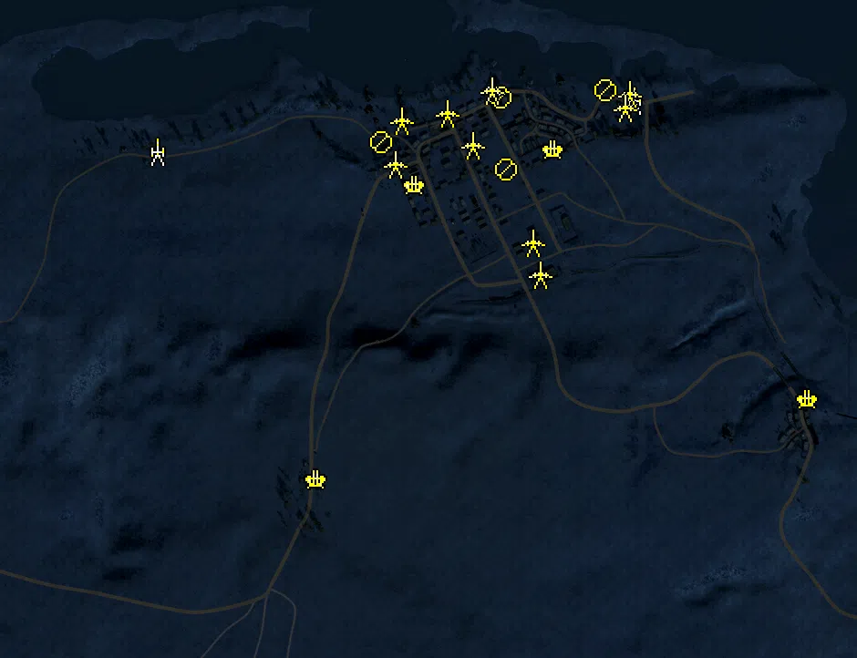
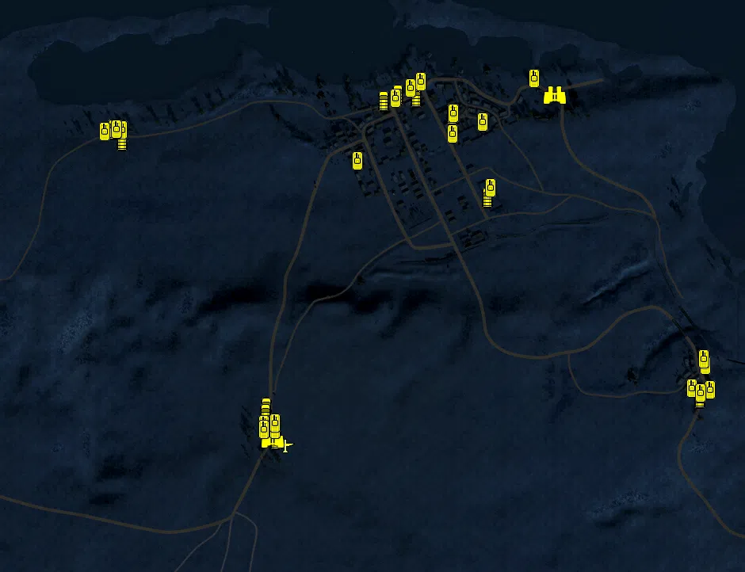

Static Ammo Crate

Pickup Kit

Static Emplacement

Vehicle

| gpo_subcat   | gpo_cat    | gpo_name                   |    pos_x |   pos_y |    pos_z |   flag | is_locked   |   team | instance                                    | gpo_cat_disp       | gpo_subcat_disp   |
|:-------------|:-----------|:---------------------------|---------:|--------:|---------:|-------:|:------------|-------:|:--------------------------------------------|:-------------------|:------------------|
| ammo_crate   | ammo_crate | ammo_crate                 |  898.003 |  57.073 |   41.62  |      0 | False       |      0 | ammo_crate_0                                | Static Ammo Crate  | Static Ammo Crate |
| ammo_crate   | ammo_crate | ammo_crate                 |   64.09  |  44.486 |  698.477 |      0 | False       |      0 | ammo_crate_1                                | Static Ammo Crate  | Static Ammo Crate |
| ammo_crate   | ammo_crate | ammo_crate                 |  299.262 |  54.879 |  436.108 |      0 | False       |      0 | ammo_crate_2                                | Static Ammo Crate  | Static Ammo Crate |
| ammo_crate   | ammo_crate | ammo_crate                 |  262.67  |  44.837 |  663.838 |      0 | False       |      0 | ammo_crate_3                                | Static Ammo Crate  | Static Ammo Crate |
| ammo_crate   | ammo_crate | ammo_crate                 |  178.66  |  44.588 |  746.862 |      0 | False       |      0 | ammo_crate_4                                | Static Ammo Crate  | Static Ammo Crate |
| ammo_crate   | ammo_crate | ammo_crate                 |  513.625 |  43.4   |  725.27  |      0 | False       |      0 | ammo_crate_5                                | Static Ammo Crate  | Static Ammo Crate |
| ammo_crate   | ammo_crate | ammo_crate                 | -549.151 |  48.639 |  607.328 |      0 | False       |      0 | ammo_crate_6                                | Static Ammo Crate  | Static Ammo Crate |
| ammo_crate   | ammo_crate | ammo_crate                 | -204.119 | 104.25  |  -48.089 |      0 | False       |      0 | ammo_crate_7                                | Static Ammo Crate  | Static Ammo Crate |
| ammo_crate   | ammo_crate | ammo_crate                 | -202.094 | 104.676 |  -83.148 |      0 | False       |      0 | ammo_crate_8                                | Static Ammo Crate  | Static Ammo Crate |
| ammo         | kit        | BA_PickUpAmmokit           |  518.383 |  42.319 |  749.77  |    106 | False       |      0 | CP_64_MM_East_Matruh_DE_GB_AmmoCrates       | Pickup Kit         | Ammo Kit          |
| ammo         | kit        | BA_PickUpAmmokit           |  208.755 |  45.987 |  771.036 |      1 | False       |      0 | CP_64_MM_Matruh_DE_GB_AmmoCrates            | Pickup Kit         | Ammo Kit          |
| ammo         | kit        | BA_PickUpAmmokit           | -552.355 |  46.18  |  637.002 |    104 | False       |      0 | CP_64_MM_HQ_DE_GB_AmmoCrates                | Pickup Kit         | Ammo Kit          |
| ammo         | kit        | BA_PickUpAmmokit           |  865.256 |  61.866 |  -14.631 |    103 | False       |      0 | CP_64_MM_Garawla_DE_GB_AmmoCrates           | Pickup Kit         | Ammo Kit          |
| at_rifle     | kit        | BA_PickUpAntitankBoys      |  492.503 |  43.407 |  738.201 |    106 | False       |      0 | CP_64_MM_East_Matruh_AT_kit                 | Pickup Kit         | AT Rifle          |
| at_rifle     | kit        | BA_PickUpAntitankBoys      |  902.314 |  55.001 |   46.157 |    103 | False       |      0 | CP_64_MM_Garawla_AT_kit                     | Pickup Kit         | AT Rifle          |
| at_rifle     | kit        | BA_PickUpAntitankBoys      |  892.184 |  64.473 |    7.047 |    103 | False       |      0 | CP_64_MM_Garawla_AT_kit_0                   | Pickup Kit         | AT Rifle          |
| mg           | kit        | BA_PickUpSupportBrenMK1    |  185.742 |  44.727 |  743.764 |      1 | False       |      0 | CP_64_MM_Matruh_DE_GB_Support               | Pickup Kit         | MG Kit            |
| mg           | kit        | BA_PickUpSupportBrenMK1    |  301.249 |  46.474 |  656.518 |    106 | False       |      0 | CP_64_MM_East_Matruh_DE_GB_Support          | Pickup Kit         | MG Kit            |
| mg           | kit        | BA_PickUpSupportBrenMK1    |  -32.358 |  44.522 |  656.5   |    101 | False       |      0 | CP_64_MM_West_Matruh_DE_GB_Support          | Pickup Kit         | MG Kit            |
| mg_dep       | kit        | GA_PickUpMG34Lafette       | -549.765 |  48.636 |  607.337 |    104 | False       |      0 | CP_64_MM_Qariet_DE_GB_HSupport              | Pickup Kit         | Deployable MG     |
| mg_dep       | kit        | GA_PickUpMG34Lafette       | -196.334 | 104.348 |  -54.069 |    102 | False       |      0 | CP_64_MM_HQ_DE_GB_HSupport                  | Pickup Kit         | Deployable MG     |
| sniper       | kit        | GA_PickUpSniperK98         | -548.634 |  46.242 |  639.107 |    104 | False       |      0 | CP_64_MM_Qariet_DE_GB_Sniper                | Pickup Kit         | Sniper Kit        |
| sniper       | kit        | BA_PickUpSniperNo4         |  898.208 |  57.201 |   40.619 |    103 | False       |      0 | CP_64_MM_Garawla_DE_GB_Sniper               | Pickup Kit         | Sniper Kit        |
| sniper       | kit        | BA_PickUpSniperNo4         |  215.339 |  60.943 |  722.922 |      1 | False       |      0 | CP_64_MM_Matruh_DE_GB_Sniper                | Pickup Kit         | Sniper Kit        |
| sniper       | kit        | BA_PickUpSniperNo4         |  513.568 |  43.531 |  724.284 |    106 | False       |      0 | CP_64_MM_East_Matruh_DE_GB_Sniper           | Pickup Kit         | Sniper Kit        |
| misc         | noidea     | gercommradio               | -210.217 | 104.665 |  -82.387 |    102 | False       |      0 | CP_64_MM_HQ_DE_GB_CommRadio                 | FIXME UNASSIGNED   | MISCELLANEOUS     |
| misc         | noidea     | gercommradio               | -203.15  | 104.262 |  -52     |    102 | False       |      0 | CP_64_MM_HQ_DE_GB_CommRadio_0               | FIXME UNASSIGNED   | MISCELLANEOUS     |
| misc         | noidea     | gercommradio               | -553.199 |  48.637 |  607.953 |    104 | False       |      0 | CP_64_MM_Qariet_DE_GB_CommRadio             | FIXME UNASSIGNED   | MISCELLANEOUS     |
| misc         | noidea     | britcommradio              |  187.129 |  44.585 |  747.247 |      1 | False       |      0 | CP_64_MM_Matruh_DE_GB_CommRadio             | FIXME UNASSIGNED   | MISCELLANEOUS     |
| misc         | noidea     | gercommradio               |  902.881 |  57.074 |   44.916 |    103 | False       |      0 | CP_64_MM_Garawla_DE_GB_CommRadio            | FIXME UNASSIGNED   | MISCELLANEOUS     |
| misc         | noidea     | britcommradio              |  310.141 |  56.927 |  377.197 |    105 | False       |      0 | CP_64_MM_Station_DE_GB_CommRadio            | FIXME UNASSIGNED   | MISCELLANEOUS     |
| misc         | noidea     | britcommradio              |  510.192 |  43.396 |  720.214 |    106 | False       |      0 | CP_64_MM_East_Matruh_DE_GB_CommRadio        | FIXME UNASSIGNED   | MISCELLANEOUS     |
| misc         | noidea     | britcommradio              |  294.167 |  46.326 |  657.482 |    106 | False       |      0 | CP_64_MM_East_Matruh_DE_GB_CommRadio_0      | FIXME UNASSIGNED   | MISCELLANEOUS     |
| noidea       | noidea     | commander_artillery_allied |  863.508 |  41.587 |  797.621 |    106 | True        |      0 | CP_64_MM_East_Matruh_DE_GB_CommArtillery    | FIXME UNASSIGNED   | FIXME UNASSIGNED  |
| noidea       | noidea     | commander_artillery_allied |  862.717 |  41.761 |  793.371 |    106 | True        |      0 | CP_64_MM_East_Matruh_DE_GB_CommArtillery_0  | FIXME UNASSIGNED   | FIXME UNASSIGNED  |
| noidea       | noidea     | commander_artillery_allied |  862.755 |  41.894 |  789.477 |    106 | True        |      0 | CP_64_MM_East_Matruh_DE_GB_CommArtillery_1  | FIXME UNASSIGNED   | FIXME UNASSIGNED  |
| noidea       | noidea     | commander_artillery_allied |  310.7   | 113.888 | -583.742 |    102 | True        |      0 | CP_64_MM_HQ_DE_GB_CommArtillery_0           | FIXME UNASSIGNED   | FIXME UNASSIGNED  |
| noidea       | noidea     | commander_artillery_allied |  295.925 | 112.314 | -583.133 |    102 | True        |      0 | CP_64_MM_HQ_DE_GB_CommArtillery_1           | FIXME UNASSIGNED   | FIXME UNASSIGNED  |
| noidea       | noidea     | commander_smoke_allied     |  281.324 | 112.233 | -583.586 |    102 | True        |      0 | CP_64_MM_HQ_DE_GB_CommSmoke                 | FIXME UNASSIGNED   | FIXME UNASSIGNED  |
| arty         | static     | 3inchmortar                |  209.9   |  46.127 |  769.148 |      1 | False       |      0 | CP_64_MM_Matruh_DE_GB_LightMortar           | Static Emplacement | Artillery         |
| arty         | static     | lefh18                     | -527.078 |  46.422 |  635.242 |    104 | False       |      0 | CP_64_MM_HQ_DE_GB_Howitzer                  | Static Emplacement | Artillery         |
| arty         | static     | 25pdr                      |  518.382 |  42.717 |  747.023 |    106 | False       |      0 | CP_64_MM_East_Matruh_DE_GB_Howitzer         | Static Emplacement | Artillery         |
| flak         | static     | flak18                     |  899.695 |  53.178 |   91.895 |    103 | False       |      0 | CP_64_MM_Garawla_DE_GB_HeavyArtillery       | Static Emplacement | Anti-aircraft Gun |
| flak         | static     | flak18                     | -177.497 | 104.476 |  -84.557 |    102 | False       |      0 | CP_64_MM_HQ_DE_GB_HeavyArtillery            | Static Emplacement | Anti-aircraft Gun |
| flak         | static     | bofors40mm                 |   38.152 |  53.224 |  561.821 |    101 | False       |      0 | CP_64_MM_West_Matruh_Bofors                 | Static Emplacement | Anti-aircraft Gun |
| flak         | static     | bofors40mm                 |  341.437 |  48.081 |  639.495 |    106 | False       |      0 | CP_64_MM_East_Matruh_AA                     | Static Emplacement | Anti-aircraft Gun |
| mg_nest      | static     | lewis_bipod                |  -36.277 |  45.513 |  655.31  |    101 | False       |      0 | CP_64_MM_West_Matruh_DE_GB_LightMG          | Static Emplacement | Static MG         |
| mg_nest      | static     | lewis_bipod                |  237.318 |  48.844 |  595.673 |      1 | False       |      0 | CP_64_MM_Matruh_DE_GB_LightMG               | Static Emplacement | Static MG         |
| mg_nest      | static     | lewis_bipod                |  225.515 |  45.417 |  753.017 |      1 | False       |      0 | CP_64_MM_Matruh_DE_GB_LightMG_0             | Static Emplacement | Static MG         |
| mg_nest      | static     | lewis_bipod                |  456.313 |  46.306 |  770.375 |    106 | False       |      0 | CP_64_MM_East_Matruh_DE_GB_LightMG          | Static Emplacement | Static MG         |
| pak          | static     | 6pdr                       |  508.496 |  42.777 |  762.364 |    106 | False       |      0 | CP_64_MM_East_Matruh_DE_GB_LightArtillery   | Static Emplacement | Anti-tank Gun     |
| pak          | static     | 6pdr                       |  295.651 |  54.858 |  436.128 |    105 | False       |      0 | CP_64_MM_Station_DE_GB_LightArtillery       | Static Emplacement | Anti-tank Gun     |
| pak          | static     | 6pdr                       |    8.638 |  44.653 |  703.013 |    101 | False       |      0 | CP_64_MM_West_Matruh_DE_GB_LightArtillery   | Static Emplacement | Anti-tank Gun     |
| pak          | static     | 6pdr                       |  107.64  |  44.017 |  719.383 |      1 | False       |      0 | CP_64_MM_Matruh_DE_GB_LightArtillery        | Static Emplacement | Anti-tank Gun     |
| pak          | static     | 6pdr                       |  164.568 |  46.711 |  650.985 |      1 | False       |      0 | CP_64_MM_Matruh_DE_GB_LightArtillery_0      | Static Emplacement | Anti-tank Gun     |
| pak          | static     | 6pdr                       |  312.73  |  56.641 |  365.068 |    105 | False       |      0 | CP_64_MM_Station_DE_GB_LightArtillery_0     | Static Emplacement | Anti-tank Gun     |
| pak          | static     | 6pdr                       |   -5.634 |  52.877 |  607.146 |    101 | False       |      0 | CP_64_MM_West_Matruh_DE_GB_LightArtillery_1 | Static Emplacement | Anti-tank Gun     |
| pak          | static     | 6pdr                       |  205.442 |  46.222 |  769.894 |      1 | False       |      0 | CP_64_MM_Matruh_DE_GB_LightArtillery_1      | Static Emplacement | Anti-tank Gun     |
| pak          | static     | 6pdr                       |  497.565 |  43.162 |  732.017 |    106 | False       |      0 | CP_64_MM_East_Matruh_DE_GB_LightArtillery_0 | Static Emplacement | Anti-tank Gun     |
| apc          | vehicle    | sdkfz251_1                 | -586.012 |  45.103 |  642.343 |    104 | False       |      0 | CP_64_MM_Qariet_DE_GB_PersonelCarrier       | Vehicle            | APC               |
| car          | vehicle    | kubeldak                   | -176.865 | 105.763 | -140.75  |    102 | False       |      0 | CP_64_MM_Airfield_DE_GB_Scout               | Vehicle            | Car               |
| car          | vehicle    | chevy30cwt                 |   95.027 |  43.946 |  713.533 |      1 | False       |      0 | CP_64_MM_Matruh_DE_GB_TruckAA               | Vehicle            | Car               |
| car          | vehicle    | bedfordoyd                 |  267.317 |  43.259 |  679.378 |    106 | False       |      0 | CP_64_MM_Matruh_DE_GB_Truck                 | Vehicle            | Car               |
| car          | vehicle    | bedfordoyd                 |  358.576 |  52.929 |  470.932 |    105 | False       |      0 | CP_64_MM_Station_DE_GB_Truck                | Vehicle            | Car               |
| car          | vehicle    | bedfordoyd                 |  131.934 |  44.38  |  730.989 |      1 | False       |      0 | CP_64_MM_Matruh_DE_GB_Truck_0               | Vehicle            | Car               |
| car          | vehicle    | opelblitz_dak              | -200.809 | 103.934 |  -60.102 |    102 | False       |      0 | CP_64_MM_HQ_DE_GB_Truck                     | Vehicle            | Car               |
| car          | vehicle    | opelblitz_dak              | -201.433 | 104.537 |  -76.272 |    102 | False       |      0 | CP_64_MM_HQ_DE_GB_Truck_0                   | Vehicle            | Car               |
| car          | vehicle    | opelblitz_dak              | -563.213 |  47.827 |  614.292 |    104 | False       |      0 | CP_64_MM_Qariet_DE_GB_Truck                 | Vehicle            | Car               |
| car          | vehicle    | bedfordoyd                 |  894.74  |  61.614 |  -29.207 |    103 | False       |      0 | CP_64_MM_Garawla_DE_GB_Truck                | Vehicle            | Car               |
| car          | vehicle    | willysmb                   |  178.754 |  43.645 |  724.792 |      1 | False       |      0 | CP_64_MM_Matruh_DE_GB_Car                   | Vehicle            | Car               |
| car          | vehicle    | willysmb                   |  893.852 |  61.919 |  -35.384 |    103 | False       |      0 | CP_64_MM_Garawla_DE_GB_Car                  | Vehicle            | Car               |
| plane        | vehicle    | ju87b2                     | -151.964 | 105.077 | -155.027 |    107 | True        |      0 | CP_64_MM_HQ_Stuka                           | Vehicle            | Airplane          |
| recon        | vehicle    | dingo_na                   |  527.206 |  43.235 |  728.611 |    106 | False       |      0 | CP_64_MM_East_Matruh_DE_GB_Scout            | Vehicle            | Scout Vehicle     |
| recon        | vehicle    | aecdorchester_de           | -184.464 | 106.018 | -140.442 |    102 | True        |      0 | CP_64_MM_HQ_DE_GB_CommTruck                 | Vehicle            | Scout Vehicle     |
| tank         | vehicle    | crusadermk1late            |  189.274 |  45.114 |  761.062 |      1 | True        |      0 | CP_64_MM_Matruh_DE_GB_MediumTank3           | Vehicle            | Tank              |
| tank         | vehicle    | M3Grant                    |  125.432 |  44.314 |  720.335 |      1 | True        |      0 | CP_64_MM_Matruh_DE_GB_HeavyTank4            | Vehicle            | Tank              |
| tank         | vehicle    | M3Grant                    |  475.745 |  42.026 |  769.802 |    106 | True        |      0 | CP_64_MM_East_Matruh_DE_GB_HeavyTank4       | Vehicle            | Tank              |
| tank         | vehicle    | valentineII                |  346.574 |  46.761 |  660.535 |    106 | True        |      0 | CP_64_MM_East_Matruh_DE_GB_HeavyTank        | Vehicle            | Tank              |
| tank         | vehicle    | crusadermk1late            |  270.209 |  47.737 |  629.507 |      1 | True        |      0 | CP_64_MM_Matruh_DE_GB_MediumTank3_0         | Vehicle            | Tank              |
| tank         | vehicle    | crusadermk1late            |   29.09  |  53.138 |  562.666 |    101 | True        |      0 | CP_64_MM_West_Matruh_DE_GB_MediumTank3      | Vehicle            | Tank              |
| tank         | vehicle    | crusadermk1late            |  366.078 |  52.972 |  494.318 |    105 | True        |      0 | CP_64_MM_Station_DE_GB_MediumTank3          | Vehicle            | Tank              |
| tank         | vehicle    | crusadermk1late            |  874.012 |  60.876 |  -12.436 |    103 | True        |      0 | CP_64_MM_Garawla_DE_GB_HeavyTank3           | Vehicle            | Tank              |
| tank         | vehicle    | crusadermk1late            |  907.254 |  53.646 |   45.771 |    103 | True        |      0 | CP_64_MM_Garawla_DE_GB_MediumTank3          | Vehicle            | Tank              |
| tank         | vehicle    | crusadermk1late            |  920.69  |  58.926 |  -15.301 |    103 | True        |      0 | CP_64_MM_Garawla_DE_GB_MediumTank3_0        | Vehicle            | Tank              |
| tank         | vehicle    | pziif                      |  896.054 |  61.191 |  -23.565 |    103 | True        |      0 | CP_64_MM_Garawla_DE_GB_LightTank            | Vehicle            | Tank              |
| tank         | vehicle    | pzivf1                     | -205.535 | 104.672 | -104.443 |    102 | True        |      0 | CP_64_MM_HQ_DE_GB_HeavyTank                 | Vehicle            | Tank              |
| tank         | vehicle    | pzivf2                     | -177.948 | 104.75  | -116.831 |    102 | True        |      0 | CP_64_MM_HQ_DE_GB_HeavyTank3                | Vehicle            | Tank              |
| tank         | vehicle    | pziii_je_dak               | -177.177 | 104.39  |  -99.765 |    102 | True        |      0 | CP_64_MM_HQ_DE_GB_MediumTank3_0             | Vehicle            | Tank              |
| tank         | vehicle    | pziif                      | -205.194 | 105.133 | -116.88  |    102 | True        |      0 | CP_64_MM_HQ_DE_GB_LightArmour               | Vehicle            | Tank              |
| tank         | vehicle    | pzivf1                     | -608.066 |  44.792 |  636.571 |    104 | True        |      0 | CP_64_MM_Qariet_DE_GB_HeavyTank             | Vehicle            | Tank              |
| tank         | vehicle    | pziii_je_dak               | -564.361 |  45.497 |  639.374 |    104 | True        |      0 | CP_64_MM_Qariet_DE_GB_MediumTank3_0         | Vehicle            | Tank              |
| tank         | vehicle    | pziif                      | -577.26  |  45.261 |  642.064 |    104 | True        |      0 | CP_64_MM_Qariet_DE_GB_LightArmour           | Vehicle            | Tank              |
| tank         | vehicle    | marmonherringtonmk3a       |  163.833 |  43.98  |  745.223 |      1 | True        |      0 | CP_64_MM_Matruh_DE_GB_AntiAirMobile         | Vehicle            | Tank              |
| tank         | vehicle    | marmonherringtonmk3a       |  904.219 |  53.224 |   62.247 |    103 | True        |      0 | CP_64_MM_Garawla_DE_GB_AntiAirMobile        | Vehicle            | Tank              |
| tank         | vehicle    | M3Grant                    |  271.869 |  43.21  |  682.935 |    106 | True        |      0 | CP_64_MM_Matruh_DE_GB_HeavyTank4_0          | Vehicle            | Tank              |

