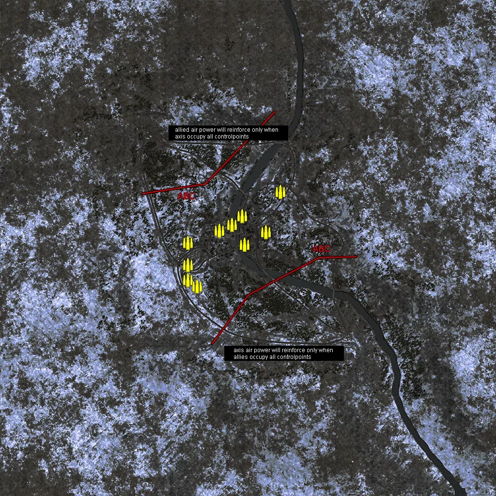
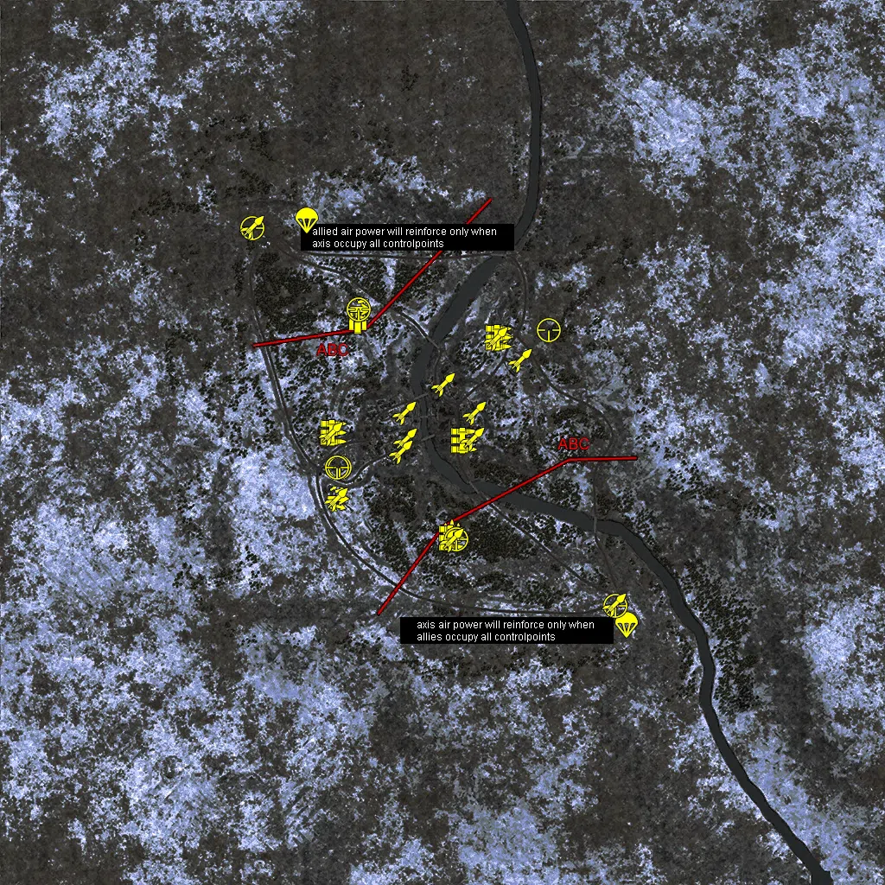
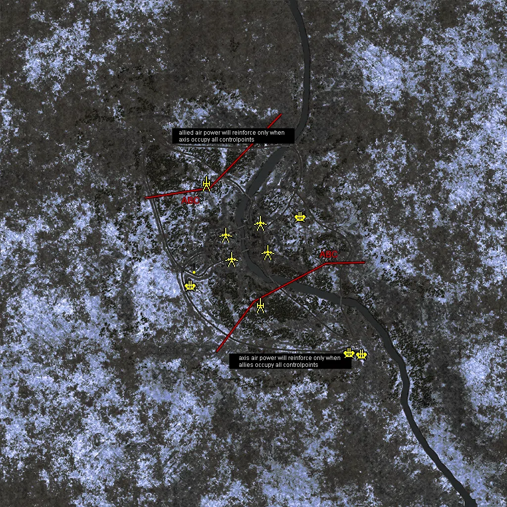
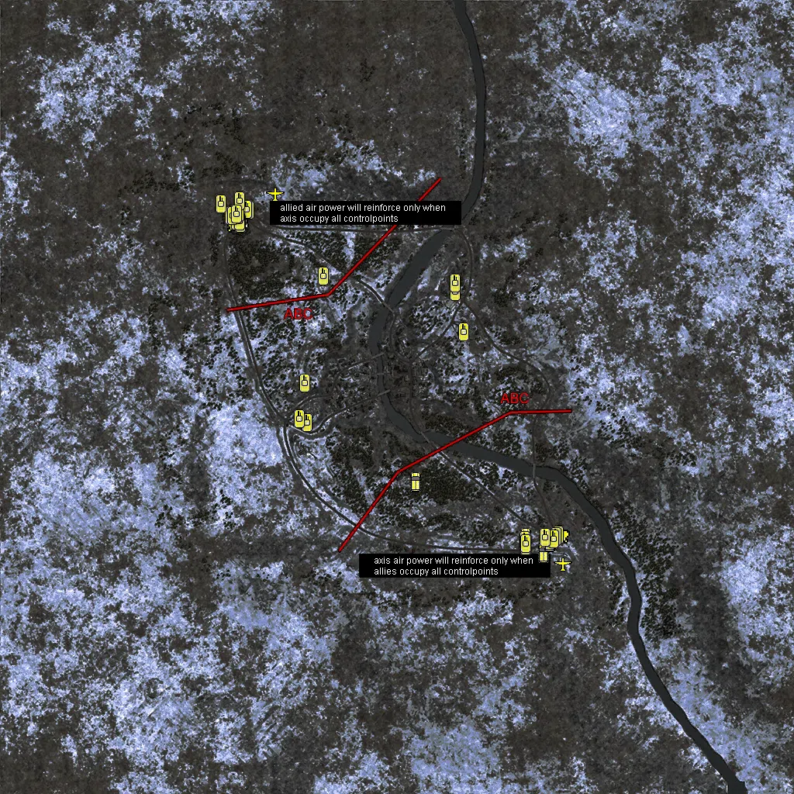

Static Ammo Crate

Pickup Kit

Static Emplacement

Vehicle

| Icon                      | SubCat            | Cat                | Name                       | Instance                                             |   Flag |    X Pos |   Y Pos |    Z Pos |
|:--------------------------|:------------------|:-------------------|:---------------------------|:-----------------------------------------------------|-------:|---------:|--------:|---------:|
|     | Static Ammo Crate | Static Ammo Crate  | ammo_crate                 | ammo_crate_0                                         |      0 |   73.634 |  36.811 |   65.560 |
|     | Static Ammo Crate | Static Ammo Crate  | ammo_crate                 | ammo_crate_1                                         |      0 |  133.789 |  46.562 |  232.026 |
|     | Static Ammo Crate | Static Ammo Crate  | ammo_crate                 | ammo_crate_2                                         |      0 | -247.739 |  42.093 |  -69.171 |
|     | Static Ammo Crate | Static Ammo Crate  | ammo_crate                 | ammo_crate_3                                         |      0 | -248.158 |  45.604 | -132.113 |
|     | Static Ammo Crate | Static Ammo Crate  | ammo_crate                 | ammo_crate_4                                         |      0 | -209.825 |  45.788 | -157.555 |
|     | Static Ammo Crate | Static Ammo Crate  | ammo_crate                 | ammo_crate_5                                         |      0 | -118.687 |  30.795 |   72.603 |
|     | Static Ammo Crate | Static Ammo Crate  | ammo_crate                 | ammo_crate_6                                         |      0 | -247.359 |  41.686 |   21.537 |
|     | Static Ammo Crate | Static Ammo Crate  | ammo_crate                 | ammo_crate_7                                         |      0 |  -66.643 |  27.584 |   96.211 |
|     | Static Ammo Crate | Static Ammo Crate  | ammo_crate                 | ammo_crate_8                                         |      0 |  -14.406 |  28.112 |   13.816 |
|     | Static Ammo Crate | Static Ammo Crate  | ammo_crate                 | ammo_crate_9                                         |      0 |  -23.523 |  28.037 |  131.415 |
|     | Ammo Kit          | Pickup Kit         | UW_PickUpAmmokit           | CP_64_meuseriver_townwest_DE_US_Ammo                 |      5 |   22.449 |  29.696 | -208.097 |
|     | Ammo Kit          | Pickup Kit         | UW_PickUpAmmokit           | CP_64_meuseriver_alliedmain_DE_US_Ammo               |      4 | -196.278 |  40.927 |  282.747 |
|  | Assault Kit       | Pickup Kit         | UW_PickUpWinchester        | CP_64_meuseriver_alliedmain_Winchester               |      4 | -191.908 |  41.793 |  307.964 |
|  | Assault Kit       | Pickup Kit         | UW_PickUpWinchester        | CP_64_meuseriver_outskirtwest_DE_US_Winchester       |      6 |  136.306 |  47.594 |  243.061 |
|  | Assault Kit       | Pickup Kit         | UW_PickUpAssaultM1Thompson | CP_64_meuseriver_farm_DE_US_Assault                  |      7 | -244.653 |  46.403 | -130.462 |
|       | MG Kit            | Pickup Kit         | UW_PickUpSupportM1918BAR   | CP_64_meuseriver_axismain_SupportMG42                |      5 |   21.591 |  28.074 | -222.435 |
|       | MG Kit            | Pickup Kit         | UW_PickUpSupportM1918BAR   | CP_64_meuseriver_outskirtwest_DE_US_SupportMG42      |      6 |  129.317 |  46.325 |  242.751 |
|       | MG Kit            | Pickup Kit         | UW_PickUpSupportM1918BAR   | CP_64_meuseriver_northeast_DE_US_SupportMG42         |      2 |   49.766 |  31.153 |    4.878 |
|       | MG Kit            | Pickup Kit         | UW_PickUpSupportM1918BAR   | CP_64_meuseriver_farm_DE_US_SupportMG42              |      7 | -251.503 |  41.726 |   21.126 |
|     | Parachute Kit     | Pickup Kit         | GW_PickUpPilotP08          | CP_64_meuseriver_axismain_DE_US_Pilot                |      5 |  425.140 |  60.295 | -421.061 |
|     | Parachute Kit     | Pickup Kit         | UW_PickUpPilotcolt1911     | CP_64_meuseriver_alliedmain_DE_US_Pilot              |      4 | -313.265 |  55.400 |  513.814 |
|   | Sniper Kit        | Pickup Kit         | UW_PickUpSniperSpringfield | CP_64_meuseriver_axismain_Sniper2                    |      5 |   32.460 |  28.157 | -223.689 |
|   | Sniper Kit        | Pickup Kit         | UW_PickUpSniperSpringfield | CP_64_meuseriver_alliedmain_Sniper                   |      4 | -194.208 |  41.772 |  308.830 |
|   | Sniper Kit        | Pickup Kit         | UW_PickUpSniperSpringfield | CP_64_meuseriver_farm_Sniper2                        |      7 | -238.730 |  45.091 |  -57.885 |
|   | Sniper Kit        | Pickup Kit         | UW_PickUpSniperSpringfield | CP_64_meuseriver_outskirtwest_DE_US_Sniper           |      6 |  245.248 |  59.017 |  259.772 |
|   | Sniper Kit        | Pickup Kit         | UW_PickUpSniperSpringfield | CP_64_meuseriver_farm_DE_US_Sniper                   |      7 | -244.236 |  45.600 |  -58.005 |
|   | Sniper Kit        | Pickup Kit         | UW_PickUpSniperSpringfield | CP_64_meuseriver_axismain_DE_US_Sniper               |      5 |  400.306 |  48.229 | -377.815 |
|   | Sniper Kit        | Pickup Kit         | UW_PickUpSniperSpringfield | CP_64_meuseriver_alliedmain_DE_US_Sniper             |      4 | -439.719 |  51.555 |  496.230 |
|   | HEAT Thrower      | Pickup Kit         | UW_PickUpBazookaM9         | CP_64_meuseriver_northeast_DE_US_AntitankFaust2      |      2 |   74.740 |  34.563 |   67.771 |
|   | HEAT Thrower      | Pickup Kit         | UW_PickUpBazookaM9         | CP_64_meuseriver_townwest_DE_US_AntitankFaust2       |      1 |  -85.879 |  27.794 |    6.138 |
|   | HEAT Thrower      | Pickup Kit         | UW_PickUpBazookaM9         | CP_64_meuseriver_townwest_DE_US_AntitankFaust2_0     |      1 |  -88.852 |  27.638 |   67.787 |
|   | HEAT Thrower      | Pickup Kit         | UW_PickUpBazookaM9         | CP_64_meuseriver_townwest_DE_US_AntitankFaust2_1     |      1 |  -95.499 |  27.832 |  -22.593 |
|   | HEAT Thrower      | Pickup Kit         | UW_PickUpBazookaM9         | CP_64_meuseriver_outskirtwest_DE_US_AntitankFaust2   |      6 |  124.762 |  46.916 |  240.618 |
|   | HEAT Thrower      | Pickup Kit         | UW_PickUpBazookaM9         | CP_64_meuseriver_outskirtwest_DE_US_AntitankFaust2_0 |      6 |  179.612 |  46.545 |  189.287 |
|   | HEAT Thrower      | Pickup Kit         | UW_PickUpBazookaM9         | CP_64_meuseriver_northeast_DE_US_AntitankFaust2_0    |      2 |    2.202 |  32.496 |  134.818 |
|   | HEAT Thrower      | Pickup Kit         | UW_PickUpBazookaM9         | CP_64_meuseriver_northeast_DE_US_AntitankFaust2_1    |      2 |   70.994 |  31.208 |    7.906 |
|   | HEAT Thrower      | Pickup Kit         | UW_PickUpBazookaM9         | CP_64_meuseriver_farm_DE_US_AntitankFaust2           |      7 | -258.273 |  43.330 |   20.396 |
|   | HEAT Thrower      | Pickup Kit         | UW_PickUpBazookaM9         | CP_64_meuseriver_farm_DE_US_AntitankFaust2_0         |      7 | -246.764 |  45.602 | -132.580 |
|   | HEAT Thrower      | Pickup Kit         | UW_PickUpBazookaM9         | CP_64_meuseriver_townwest_DE_US_AntitankFaust100     |      5 |   21.737 |  28.074 | -226.188 |
|   | HEAT Thrower      | Pickup Kit         | UW_PickUpBazookaM9         | CP_64_meuseriver_axismain_DE_US_AntitankFaust100     |      5 |  398.229 |  48.240 | -376.251 |
|   | HEAT Thrower      | Pickup Kit         | UW_PickUpBazookaM9         | CP_64_meuseriver_alliedmain_DE_US_AntitankFaust100   |      4 | -439.842 |  51.555 |  498.984 |
|     | Artillery         | Static Emplacement | 81mm_mortar_m1             | CP_64_meuseriver_alliedmain_mortar                   |      4 | -191.601 |  40.992 |  283.276 |
|     | Artillery         | Static Emplacement | sgwr34_france              | CP_64_meuseriver_axismain_mortar                     |      5 |   25.614 |  29.775 | -207.402 |
|     | Anti-aircraft Gun | Static Emplacement | flakvierling_win           | CP_64_meuseriver_axismain_vierling                   |      5 |  437.419 |  55.706 | -408.492 |
|     | Anti-aircraft Gun | Static Emplacement | flakvierling_win           | CP_64_meuseriver_farm_vierling                       |      7 | -253.160 |  45.613 | -130.576 |
|     | Anti-aircraft Gun | Static Emplacement | flakvierling_win           | CP_64_meuseriver_outskirtwest_vierling               |      6 |  190.603 |  44.372 |  147.354 |
|     | Anti-aircraft Gun | Static Emplacement | flakvierling_win           | CP_64_meuseriver_axismain_vierling2                  |      5 |  387.984 |  53.704 | -402.620 |
|      | Static MG         | Static Emplacement | mg42_bipod                 | CP_64_meuseriver_farm_mg42                           |      7 | -240.499 |  45.945 |  -55.582 |
|      | Anti-tank Gun     | Static Emplacement | 57mm_m1_atgun_win          | CP_64_meuseriver_farm_gun                            |      1 | -114.936 |  30.621 |   76.979 |
|      | Anti-tank Gun     | Static Emplacement | pak40_win                  | CP_64_meuseriver_farm_pak40                          |      1 |  -90.203 |  27.832 |  -22.852 |
|      | Anti-tank Gun     | Static Emplacement | 57mm_m1_atgun_win          | CP_64_meuseriver_outskirtwest_atgun                  |      2 |   25.862 |  32.205 |  123.824 |
|      | Anti-tank Gun     | Static Emplacement | pak40_win                  | CP_64_meuseriver_outskirtwest_atgun2                 |      2 |   55.486 |  31.185 |    5.777 |
|      | APC               | Vehicle            | sdkfz251_d_win             | CP_64_meuseriver_axismain_sdkfz251                   |      5 |  378.980 |  53.688 | -401.545 |
|      | APC               | Vehicle            | sdkfz251_d_win             | CP_64_meuseriver_axismain_apc                        |      5 |   47.811 |  29.696 | -217.807 |
|      | APC               | Vehicle            | sdkfz251_d_win             | CP_64_meuseriver_axismain_apc3                       |      5 |  331.766 |  53.708 | -361.495 |
|      | APC               | Vehicle            | sdkfz251_d_win             | CP_64_meuseriver_axismain_sdkz4                      |      5 |  397.873 |  48.213 | -369.679 |
|     | Mobile Arty       | Vehicle            | willysmb_rocket            | CP_64_meuseriver_alliedmain_willys                   |      4 | -402.642 |  48.567 |  469.989 |
|      | Car               | Vehicle            | kubelwagen_win             | CP_64_meuseriver_axismain_kubel                      |      5 |  393.810 |  48.327 | -372.186 |
|      | Car               | Vehicle            | willysmb_us_snow           | CP_64_meuseriver_alliedmain_willys2                  |      4 | -397.370 |  48.567 |  472.385 |
|     | Mobile FlaK       | Vehicle            | opelblitz_flak38           | CP_64_meuseriver_axismain_aatruck                    |      5 |  421.095 |  48.010 | -353.402 |
|     | Mobile FlaK       | Vehicle            | m16_mgmc                   | CP_64_meuseriver_alliedmain_aaapc                    |      4 | -413.802 |  48.559 |  448.109 |
|    | Airplane          | Vehicle            | fw190_alt                  | CP_64_meuseriver_axismain_fw190                      |      5 |  428.648 |  59.537 | -430.661 |
|    | Airplane          | Vehicle            | aix_p51d_bombs             | CP_64_meuseriver_alliedmain_p47                      |      4 | -313.343 |  55.968 |  524.234 |
|     | Tank              | Vehicle            | panther_g_win              | CP_64_meuseriver_axismain_pantherg1                  |      5 |  415.787 |  48.137 | -356.574 |
|     | Tank              | Vehicle            | panther_g_win              | CP_64_meuseriver_axismain_kingtiger2                 |      5 |  409.691 |  48.183 | -360.915 |
|     | Tank              | Vehicle            | jagdpanzeriv_win           | CP_64_meuseriver_axismain_pz4                        |      5 |  403.091 |  48.192 | -365.483 |
|     | Tank              | Vehicle            | pzivh_ard_win              | CP_64_meuseriver_axismain_hetzer                     |      5 |  331.515 |  53.389 | -383.120 |
|     | Tank              | Vehicle            | m4a3_76_win                | CP_64_meuseriver_alliedmain_sherman76                |      4 | -382.541 |  48.614 |  482.245 |
|     | Tank              | Vehicle            | m4a3e2_jumbo76_win         | CP_64_meuseriver_alliedmain_sherman1                 |      4 | -417.959 |  48.567 |  467.345 |
|     | Tank              | Vehicle            | m4a3_win                   | CP_64_meuseriver_alliedmain_sherman2                 |      4 | -396.558 |  48.567 |  483.504 |
|     | Tank              | Vehicle            | m4a3_win                   | CP_64_meuseriver_alliedmain_m10                      |      4 | -430.282 |  48.567 |  467.169 |
|     | Tank              | Vehicle            | m36b1                      | CP_64_meuseriver_alliedmain_m36                      |      4 | -387.922 |  48.567 |  483.792 |
|     | Tank              | Vehicle            | jagdpanther_win            | CP_64_meuseriver_axismain_jagdpanther                |      5 |  330.778 |  53.705 | -369.641 |
|     | Tank              | Vehicle            | m3a1_win                   | CP_64_meuseriver_alliedmain_apc1                     |      4 | -189.734 |  40.893 |  312.117 |
|     | Tank              | Vehicle            | m3a1_win                   | CP_64_meuseriver_alliedmain_apc2                     |      4 | -413.479 |  48.554 |  454.276 |
|     | Tank              | Vehicle            | m3a1_win                   | CP_64_meuseriver_alliedmain_apc3                     |      4 | -404.916 |  48.574 |  448.416 |
|     | Tank              | Vehicle            | m24_chaffee_win            | CP_64_meuseriver_alliedmain_hellcat                  |      4 | -405.659 |  48.555 |  454.229 |
|     | Tank              | Vehicle            | hetzer_win                 | CP_64_meuseriver_axismain_0_3                        |      5 |  331.766 |  53.676 | -377.036 |
|     | Tank              | Vehicle            | pzivh_ard_win              | CP_64_meuseriver_outskirtwest_sdkfz                  |      6 |  172.083 |  46.308 |  167.997 |
|     | Tank              | Vehicle            | m4a3_win                   | CP_64_meuseriver_outskirtwest_m4a31                  |      6 |  149.590 |  45.535 |  271.077 |
|     | Tank              | Vehicle            | jagdpanzeriv_win           | CP_64_meuseriver_farm_sdkz                           |      7 | -232.529 |  41.755 |  -65.461 |
|     | Tank              | Vehicle            | m3a1_win                   | CP_64_meuseriver_alliedmain_m3a14                    |      4 | -407.624 |  48.567 |  475.776 |
|     | Tank              | Vehicle            | m4a3_win                   | CP_64_meuseriver_farm_apc3                           |      7 | -251.164 |  41.774 |  -55.113 |
|     | Tank              | Vehicle            | m4a3_76_win                | CP_64_meuseriver_alliedmain_m4a3                     |      4 | -423.873 |  48.567 |  467.244 |
|     | Tank              | Vehicle            | m51_win                    | CP_64_meuseriver_alliedmain_m51_0                    |      4 | -406.134 |  53.654 |  506.006 |
|     | Tank              | Vehicle            | m51_win                    | CP_64_meuseriver_farm_m51                            |      7 | -238.227 |  42.225 |   36.208 |
|     | Tank              | Vehicle            | m51_win                    | CP_64_meuseriver_outskirtwest_m51                    |      6 |  150.580 |  42.007 |  294.832 |
|     | Tank              | Vehicle            | m51_win                    | CP_64_meuseriver_alliedmain_m51nr2                   |      4 | -454.026 |  51.771 |  497.900 |
|     | Tank              | Vehicle            | KingTiger_1944Winter       | CP_64_meuseriver_axismain_kingtiger2_0               |      5 |  382.194 |  48.439 | -362.650 |
|     | Tank              | Vehicle            | m36_win                    | CP_64_meuseriver_alliedmain_m362                     |      4 | -413.026 |  48.567 |  472.883 |

