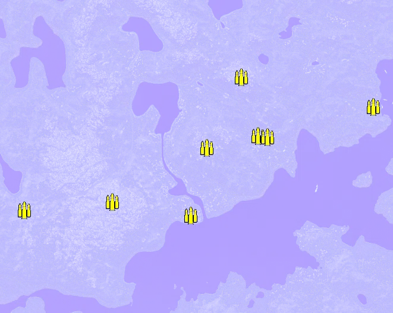
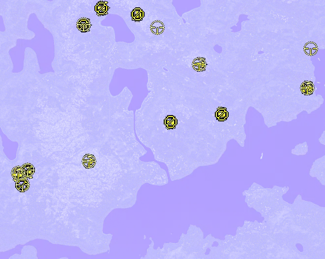
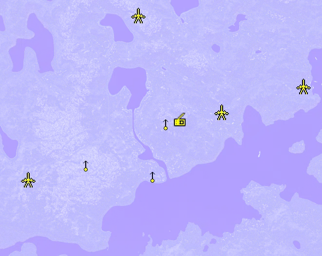

Static Ammo Crate

Pickup Kit

Static Emplacement

| Icon                       | SubCat            | Cat                | Name                     | Instance                                        |   Flag |    X Pos |   Y Pos |   Z Pos |
|:---------------------------|:------------------|:-------------------|:-------------------------|:------------------------------------------------|-------:|---------:|--------:|--------:|
|      | Static Ammo Crate | Static Ammo Crate  | ammo_crate               | ammo_crate_0                                    |      0 | -210.724 |  58.978 |  13.864 |
|      | Static Ammo Crate | Static Ammo Crate  | ammo_crate               | ammo_crate_1                                    |      0 | -506.834 |  35.877 | -14.714 |
|      | Static Ammo Crate | Static Ammo Crate  | ammo_crate               | ammo_crate_2                                    |      0 |  223.201 |  54.415 | 433.732 |
|      | Static Ammo Crate | Static Ammo Crate  | ammo_crate               | ammo_crate_3                                    |      0 |  280.273 |  25.880 | 235.068 |
|      | Static Ammo Crate | Static Ammo Crate  | ammo_crate               | ammo_crate_4                                    |      0 |   54.690 |  28.631 | -32.523 |
|      | Static Ammo Crate | Static Ammo Crate  | ammo_crate               | ammo_crate_5                                    |      0 |  108.722 |  47.512 | 196.659 |
|      | Static Ammo Crate | Static Ammo Crate  | ammo_crate               | ammo_crate_6                                    |      0 |  311.094 |  26.988 | 232.743 |
|      | Static Ammo Crate | Static Ammo Crate  | ammo_crate               | ammo_crate_7                                    |      0 |  667.380 |  25.867 | 334.659 |
|      | Ammo Kit          | Pickup Kit         | GA_PickUpAmmokit         | CP_64_motovskiybay_GermanMainA_ammo             |      1 | -511.713 |  35.727 | -10.109 |
|      | Ammo Kit          | Pickup Kit         | RE_PickUpAmmokit_Early   | CP_64_motovskiybay_landebucht_ammo              |    104 |  313.379 |  26.990 | 229.381 |
|      | Ammo Kit          | Pickup Kit         | GA_PickUpAmmokit         | CP_64_motovskiybay_germanmainb_ammo             |    107 |  -29.685 |  53.980 | 634.580 |
|      | Ammo Kit          | Pickup Kit         | RE_PickUpAmmokit_Early   | CP_64_motovskiybay_alliedmain_ammo              |    106 |  661.426 |  25.897 | 336.169 |
|  | Deployable Arty   | Pickup Kit         | GW_PickUpMortarearly     | CP_64_motovskiybay_GermanMainA_mortar           |      1 | -509.059 |  35.762 | -12.431 |
|  | Deployable Arty   | Pickup Kit         | RE_PickUpMortar          | CP_64_motovskiybay_alliedmain_mortar            |    106 |  664.749 |  26.365 | 336.245 |
|   | Assault Kit       | Pickup Kit         | GE_PickUpAssaultSVT40    | CP_64_motovskiybay_GermanMainA_assault          |      1 | -517.359 |  37.066 | -16.496 |
|   | Assault Kit       | Pickup Kit         | GE_PickUpAssaultSVT40    | CP_64_motovskiybay_GermanMainA_capturedassault  |      1 | -517.955 |  36.766 | -16.066 |
|   | Assault Kit       | Pickup Kit         | GE_PickUpAssaultSVT40    | CP_64_motovskiybay_GermanMainA_assault2         |      1 | -476.131 |  41.071 |  -5.656 |
|   | Assault Kit       | Pickup Kit         | RE_PickUpAssaultPPd34    | CP_64_motovskiybay_obersteiner_assault          |    101 | -228.699 |  57.627 |  37.724 |
|   | Assault Kit       | Pickup Kit         | GE_PickUpAssaultSVT40    | CP_64_motovskiybay_germanmainb_assault          |    107 | -243.909 |  27.097 | 592.854 |
|   | Assault Kit       | Pickup Kit         | GE_PickupAssaultSVT40    | CP_64_motovskiybay_germanmainb_capturedassault1 |    107 | -177.810 |  27.297 | 657.535 |
|   | Assault Kit       | Pickup Kit         | GE_PickupAssaultSVT40    | CP_64_motovskiybay_germanmainb_capturedassault2 |    107 | -170.343 |  27.526 | 661.482 |
|   | Assault Kit       | Pickup Kit         | RE_PickUpAssaultPPd34    | CP_64_motovskiybay_herzogstein_assault          |    105 |  225.096 |  54.922 | 431.659 |
|   | Assault Kit       | Pickup Kit         | RE_PickUpAssaultPPd34    | CP_64_motovskiybay_hill1723_assault             |    103 |  104.600 |  48.038 | 195.760 |
|   | Assault Kit       | Pickup Kit         | RE_PickUpAssaultPPd34    | CP_64_motovskiybay_alliedmain_assault           |    106 |  662.633 |  26.462 | 335.086 |
|   | Assault Kit       | Pickup Kit         | RE_PickUpAssaultThompson | CP_64_motovskiybay_landebucht_assault           |    104 |  311.419 |  27.606 | 229.996 |
|        | MG Kit            | Pickup Kit         | RE_PickupMG_DT           | CP_64_motovskiybay_hill1723_mg                  |    103 |  105.084 |  48.134 | 197.141 |
|        | MG Kit            | Pickup Kit         | RE_PickupMG_DT           | CP_64_motovskiybay_landebucht_mg                |    104 |  314.750 |  27.700 | 227.011 |
|       | Deployable MG     | Pickup Kit         | GA_PickUpMG34Lafette     | CP_64_motovskiybay_GermanMainA_lafette          |      1 | -497.396 |  41.069 | -60.853 |
|       | Deployable MG     | Pickup Kit         | GA_PickUpMG34Lafette     | CP_64_motovskiybay_GermanMainA_lafette2         |      1 | -474.078 |  41.351 |   1.197 |
|       | Deployable MG     | Pickup Kit         | GA_PickUpMG34Lafette     | CP_64_motovskiybay_germanmainb_lafette1         |    107 | -248.049 |  27.166 | 590.359 |
|       | Deployable MG     | Pickup Kit         | GA_PickUpMG34Lafette     | CP_64_motovskiybay_germanmainb_lafette          |    107 | -176.588 |  27.418 | 659.845 |
|       | Deployable MG     | Pickup Kit         | GA_PickUpMG34Lafette     | CP_64_motovskiybay_germanmainb_lafette_0        |    107 |  -28.272 |  54.485 | 635.527 |
|    | Sniper Kit        | Pickup Kit         | GE_PickUpSniperK98       | CP_64_motovskiybay_GermanMainA_sniper1          |      1 | -513.534 |  36.067 |  -9.938 |
|    | Sniper Kit        | Pickup Kit         | GA_PickUpSniperK98       | CP_64_motovskiybay_GermanMainA_sniper2          |      1 | -495.337 |  41.431 | -58.297 |
|    | Sniper Kit        | Pickup Kit         | GA_PickUpSniperK98       | CP_64_motovskiybay_GermanMainA_sniper3          |      1 | -475.133 |  41.335 |   1.586 |
|    | Sniper Kit        | Pickup Kit         | RE_PickUpSniperSVT40     | CP_64_motovskiybay_obersteiner_sniper           |    101 | -226.698 |  57.525 |  38.276 |
|    | Sniper Kit        | Pickup Kit         | GA_PickUpSniperK98       | CP_64_motovskiybay_germanmainb_sniper1          |    107 | -247.398 |  26.761 | 594.576 |
|    | Sniper Kit        | Pickup Kit         | GE_PickUpSniperK98       | CP_64_motovskiybay_germanmainb_sniper2          |    107 |   52.110 |  54.634 | 581.882 |
|    | Sniper Kit        | Pickup Kit         | RE_PickUpSniperSVT40     | CP_64_motovskiybay_herzogstein_sniper           |    105 |  222.232 |  54.941 | 431.484 |
|    | Sniper Kit        | Pickup Kit         | RE_PickUpSniperSVT40     | CP_64_motovskiybay_alliedmain_sniper            |    106 |  662.597 |  26.457 | 336.374 |
|    | Sniper Kit        | Pickup Kit         | RE_PickUpSniperBramit    | CP_64_motovskiybay_alliedmain_sniper2           |    106 |  675.262 |  26.478 | 495.915 |
|       | Static MG         | Static Emplacement | maxim_mg                 | CP_64_motovskiybay_obersteiner_maxim            |    101 | -236.824 |  59.094 |  16.215 |
|       | Static MG         | Static Emplacement | dp28_bipod               | CP_64_motovskiybay_hill70_dp                    |    102 |   38.888 |  28.760 | -30.471 |
|       | Static MG         | Static Emplacement | maxim_mg                 | CP_64_motovskiybay_hill1723_maxim               |    103 |   91.241 |  52.297 | 186.758 |
|       | Anti-tank Gun     | Static Emplacement | pak35_arctic             | CP_64_motovskiybay_GermanMainA_atgun            |      1 | -474.386 |  43.085 | -45.495 |
|       | Anti-tank Gun     | Static Emplacement | pak35_arctic             | CP_64_motovskiybay_germanmainb_atgun            |    107 |  -22.020 |  53.799 | 630.863 |
|       | Anti-tank Gun     | Static Emplacement | m1937_45mm_inf           | CP_64_motovskiybay_alliedmain_atgun             |    106 |  655.244 |  25.961 | 337.815 |
|       | Anti-tank Gun     | Static Emplacement | m1937_45mm_inf           | CP_64_motovskiybay_landebucht_atgun             |    104 |  320.545 |  26.984 | 232.094 |
|     | Radio             | Static Emplacement | oldradioallied           | CP_64_motovskiybay_hill1723_radio               |    103 |  149.192 |  44.413 | 198.874 |

