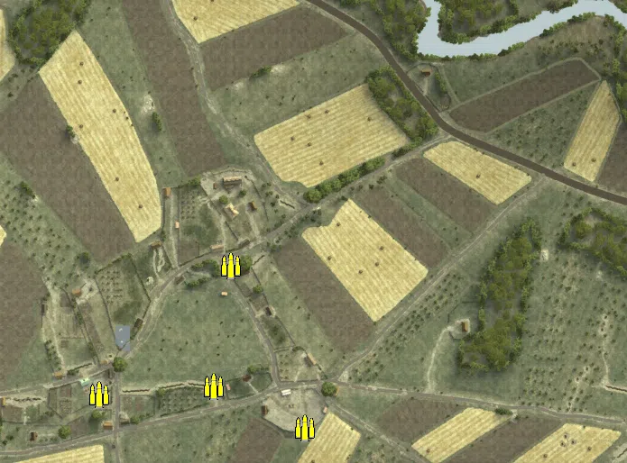
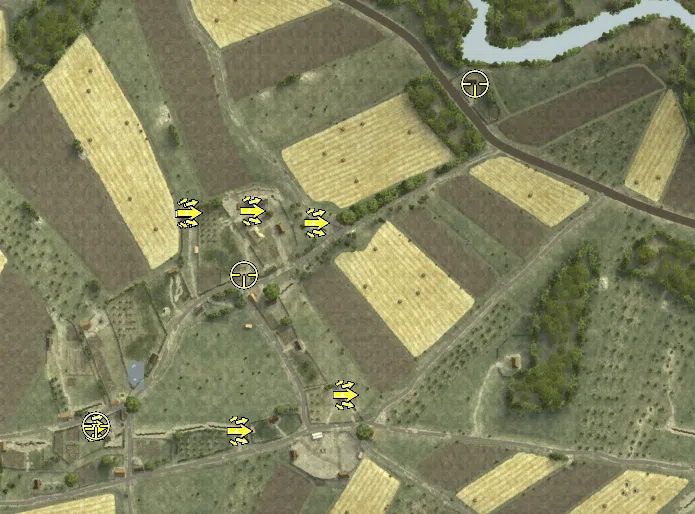

Static Ammo Crate

Pickup Kit

Static Emplacement

Vehicle

| Icon                      | SubCat            | Cat                | Name                  | Instance                                      |   Flag |    X Pos |   Y Pos |    Z Pos |
|:--------------------------|:------------------|:-------------------|:----------------------|:----------------------------------------------|-------:|---------:|--------:|---------:|
|     | Static Ammo Crate | Static Ammo Crate  | ammo_crate            | ammo_crate_0                                  |      0 | -567.986 |  34.921 |   -8.766 |
|     | Static Ammo Crate | Static Ammo Crate  | ammo_crate            | ammo_crate_1                                  |      0 | -421.722 |  29.029 |  133.958 |
|     | Static Ammo Crate | Static Ammo Crate  | ammo_crate            | ammo_crate_2                                  |      0 | -831.878 |  27.287 |  403.466 |
|     | Static Ammo Crate | Static Ammo Crate  | ammo_crate            | ammo_crate_3                                  |      0 | -340.171 |  31.484 |  -45.801 |
|     | Static Ammo Crate | Static Ammo Crate  | ammo_crate            | ammo_crate_4                                  |      0 |   69.768 |  24.235 |  -21.984 |
|     | Static Ammo Crate | Static Ammo Crate  | ammo_crate            | ammo_crate_5                                  |      0 |  317.750 |   5.910 |   97.612 |
|     | Static Ammo Crate | Static Ammo Crate  | ammo_crate            | ammo_crate_6                                  |      0 |  603.328 |   8.115 | -186.662 |
|     | Static Ammo Crate | Static Ammo Crate  | ammo_crate            | ammo_crate_7                                  |      0 |  679.667 |   7.109 | -142.221 |
|     | Static Ammo Crate | Static Ammo Crate  | ammo_crate            | ammo_crate_8                                  |      0 |  -57.037 |  25.884 | -133.253 |
|     | Static Ammo Crate | Static Ammo Crate  | ammo_crate            | ammo_crate_9                                  |      0 | -440.813 |  34.219 |    0.409 |
|     | Static Ammo Crate | Static Ammo Crate  | ammo_crate            | ammo_crate_10                                 |      0 |  112.119 |  22.873 |  -43.740 |
|     | Static Ammo Crate | Static Ammo Crate  | ammo_crate            | ammo_crate_11                                 |      0 |  203.035 |  14.453 |  103.537 |
|  | Assault Kit       | Pickup Kit         | GW_PickUpAssaultStG44 | CP_16_ogledow_farm_axisassault                |    202 | -363.347 |  26.312 |  205.795 |
|  | Assault Kit       | Pickup Kit         | RE_PickUpAssaultAVT40 | CP_16_ogledow_farm_alliedassault              |    202 | -491.548 |  29.420 |  214.638 |
|  | Assault Kit       | Pickup Kit         | RE_PickUpAssaultSVT40 | CP_16_ogledow_farm_alliedassault2             |    202 | -489.877 |  29.040 |  215.607 |
|  | Assault Kit       | Pickup Kit         | GW_PickUpAssaultStG44 | CP_16_ogledow_farm_axisassault2               |    202 | -426.620 |  24.001 |  217.612 |
|  | Assault Kit       | Pickup Kit         | GW_PickUpAssaultG41   | CP_16_ogledow_construction_yard_axisassault   |    203 | -333.879 |  34.194 |   33.823 |
|  | Assault Kit       | Pickup Kit         | RE_PickUpAssaultSVT40 | CP_16_ogledow_construction_yard_alliedassault |    203 | -440.009 |  34.648 |   -1.508 |
|  | Assault Kit       | Pickup Kit         | RE_PickUpAssaultAVT40 | CP_16_ogledow_observation_post_alliedassault  |    204 | -584.177 |  35.202 |    2.347 |
|   | Sniper Kit        | Pickup Kit         | GW_PickUpSniperg43_ZF | CP_16_ogledow_axismain_sniper                 |    201 | -203.295 |   9.504 |  345.067 |
|   | Sniper Kit        | Pickup Kit         | RE_PickUpSniper       | CP_16_ogledow_farm_alliedsniper               |    202 | -433.693 |  28.611 |  154.247 |
|   | Sniper Kit        | Pickup Kit         | RE_PickUpSniperSVT40  | CP_16_ogledow_observation_post_alliedsniper   |    204 | -582.402 |  35.200 |    2.881 |
|      | Static MG         | Static Emplacement | maxim_mg              | CP_16_ogledow_construction_yard_mg            |    203 | -338.430 |  33.757 |   36.078 |
|      | Anti-tank Gun     | Static Emplacement | zis3_static           | CP_16_ogledow_farm_at1                        |    202 | -400.491 |  23.691 |  227.712 |
|      | Anti-tank Gun     | Static Emplacement | zis3_static           | CP_16_ogledow_construction_yard_at1           |    203 | -313.017 |  33.142 |    1.191 |
|      | APC               | Vehicle            | sdkfz251_d            | CP_16_ogledow_axismain_apc                    |    201 | -226.662 |   9.863 |  339.152 |
|     | Tank              | Vehicle            | pzivh                 | CP_16_ogledow_axismain_pzivh                  |    201 | -204.902 |   9.408 |  337.197 |
|     | Tank              | Vehicle            | t34_85_early          | CP_16_ogledow_observation_post_t34            |    204 | -668.563 |  34.679 |   -7.372 |
|     | Tank              | Vehicle            | pzivh_noskirt         | CP_16_ogledow_axismain_pzivh_0                |    201 | -221.643 |  10.064 |  332.190 |

