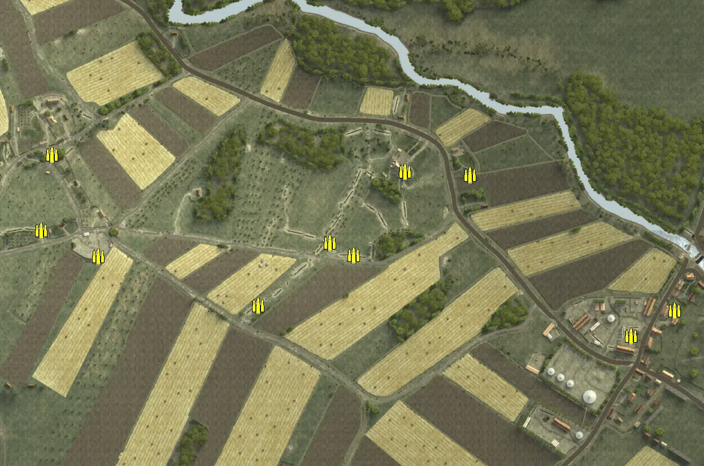
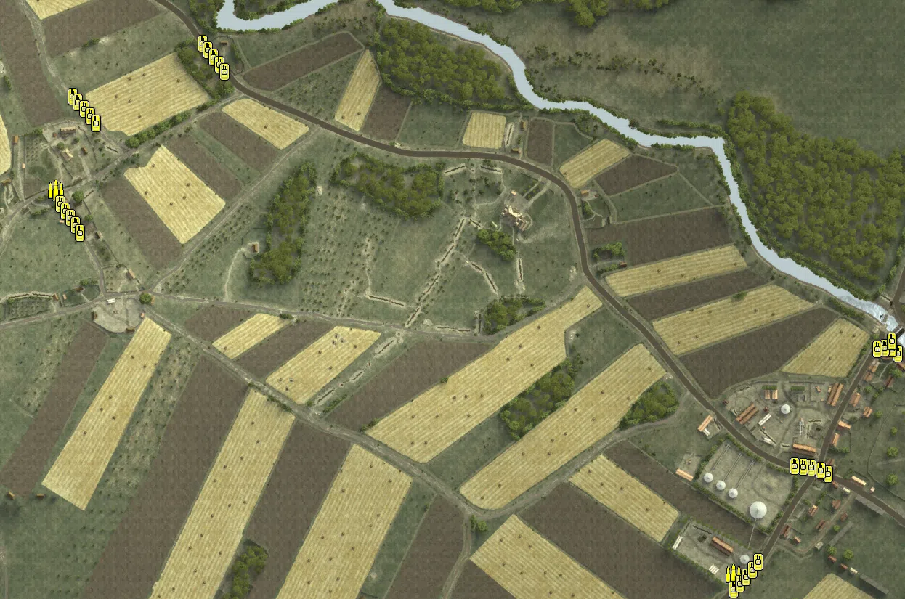

Static Ammo Crate

Vehicle

| gpo_subcat   | gpo_cat    | gpo_name            |    pos_x |   pos_y |    pos_z |   flag | is_locked   |   team | instance                            | gpo_cat_disp      | gpo_subcat_disp   |
|:-------------|:-----------|:--------------------|---------:|--------:|---------:|-------:|:------------|-------:|:------------------------------------|:------------------|:------------------|
| ammo_crate   | ammo_crate | ammo_crate          | -567.986 |  34.921 |   -8.766 |      0 | False       |      0 | ammo_crate_0                        | Static Ammo Crate | Static Ammo Crate |
| ammo_crate   | ammo_crate | ammo_crate          | -421.722 |  29.029 |  133.958 |      0 | False       |      0 | ammo_crate_1                        | Static Ammo Crate | Static Ammo Crate |
| ammo_crate   | ammo_crate | ammo_crate          | -831.878 |  27.287 |  403.466 |      0 | False       |      0 | ammo_crate_2                        | Static Ammo Crate | Static Ammo Crate |
| ammo_crate   | ammo_crate | ammo_crate          | -340.171 |  31.484 |  -45.801 |      0 | False       |      0 | ammo_crate_3                        | Static Ammo Crate | Static Ammo Crate |
| ammo_crate   | ammo_crate | ammo_crate          |   69.768 |  24.235 |  -21.984 |      0 | False       |      0 | ammo_crate_4                        | Static Ammo Crate | Static Ammo Crate |
| ammo_crate   | ammo_crate | ammo_crate          |  317.75  |   5.91  |   97.612 |      0 | False       |      0 | ammo_crate_5                        | Static Ammo Crate | Static Ammo Crate |
| ammo_crate   | ammo_crate | ammo_crate          |  603.328 |   8.115 | -186.662 |      0 | False       |      0 | ammo_crate_6                        | Static Ammo Crate | Static Ammo Crate |
| ammo_crate   | ammo_crate | ammo_crate          |  679.667 |   7.109 | -142.221 |      0 | False       |      0 | ammo_crate_7                        | Static Ammo Crate | Static Ammo Crate |
| ammo_crate   | ammo_crate | ammo_crate          |  -57.037 |  25.884 | -133.253 |      0 | False       |      0 | ammo_crate_8                        | Static Ammo Crate | Static Ammo Crate |
| ammo_crate   | ammo_crate | ammo_crate          | -440.813 |  34.219 |    0.409 |      0 | False       |      0 | ammo_crate_9                        | Static Ammo Crate | Static Ammo Crate |
| ammo_crate   | ammo_crate | ammo_crate          |  112.119 |  22.873 |  -43.74  |      0 | False       |      0 | ammo_crate_10                       | Static Ammo Crate | Static Ammo Crate |
| ammo_crate   | ammo_crate | ammo_crate          |  203.035 |  14.453 |  103.537 |      0 | False       |      0 | ammo_crate_11                       | Static Ammo Crate | Static Ammo Crate |
| supply       | vehicle    | opelblitz_fr_ammo   | -436.83  |  27.714 |  145.798 |    301 | False       |      0 | CP_32_ogledow_axismain_ammotruck    | Vehicle           | Supply Vehicle    |
| supply       | vehicle    | studebaker_us6_ammo |  495.935 |  11.618 | -382.981 |    302 | False       |      0 | CP_32_ogledow_russianmain_ammotruck | Vehicle           | Supply Vehicle    |
| tank         | vehicle    | pzivh               | -234.81  |   9.719 |  348.393 |    301 | True        |      0 | CP_32_ogledow_axismain_pivh1        | Vehicle           | Tank              |
| tank         | vehicle    | pzivh               | -227.556 |   9.851 |  339.04  |    301 | True        |      0 | CP_32_ogledow_axismain_pivh2        | Vehicle           | Tank              |
| tank         | vehicle    | pzivh_noskirt       | -220.345 |  10.043 |  329.063 |    301 | True        |      0 | CP_32_ogledow_axismain_pzivh3       | Vehicle           | Tank              |
| tank         | vehicle    | pzivh               | -212.368 |  10.275 |  319.269 |    301 | True        |      0 | CP_32_ogledow_axismain_pzivh4       | Vehicle           | Tank              |
| tank         | vehicle    | kingtiger_standard  | -204.95  |  10.462 |  309.07  |    301 | True        |      0 | CP_32_ogledow_axismain_kt1          | Vehicle           | Tank              |
| tank         | vehicle    | pzivh_noskirt       | -413.965 |  24.814 |  275.481 |    301 | True        |      0 | CP_32_ogledow_axismain_pzivh5       | Vehicle           | Tank              |
| tank         | vehicle    | pzivh               | -406.659 |  24.042 |  267.057 |    301 | True        |      0 | CP_32_ogledow_axismain_pzivh6       | Vehicle           | Tank              |
| tank         | vehicle    | pzivh               | -398.028 |  23.193 |  257.536 |    301 | True        |      0 | CP_32_ogledow_axismain_pzivh7       | Vehicle           | Tank              |
| tank         | vehicle    | pzivh               | -390.115 |  22.604 |  248.247 |    301 | True        |      0 | CP_32_ogledow_axismain_pzivh8       | Vehicle           | Tank              |
| tank         | vehicle    | kingtiger_standard  | -381.787 |  22.684 |  237.511 |    301 | True        |      0 | CP_32_ogledow_axismain_kt2          | Vehicle           | Tank              |
| tank         | vehicle    | pzivh               | -431.076 |  29.16  |  127.163 |    301 | True        |      0 | CP_32_ogledow_axismain_pzivh9       | Vehicle           | Tank              |
| tank         | vehicle    | pzivh_noskirt       | -423.674 |  29.93  |  117.46  |    301 | True        |      0 | CP_32_ogledow_axismain_pzivh10      | Vehicle           | Tank              |
| tank         | vehicle    | pzivh_noskirt       | -416.795 |  30.592 |  107.663 |    301 | True        |      0 | CP_32_ogledow_axismain_pzivh11      | Vehicle           | Tank              |
| tank         | vehicle    | pzivh               | -410.331 |  31.179 |   98.301 |    301 | True        |      0 | CP_32_ogledow_axismain_pzivh12      | Vehicle           | Tank              |
| tank         | vehicle    | kingtiger_standard  | -403.501 |  31.817 |   87.23  |    301 | True        |      0 | CP_32_ogledow_axismain_kt3          | Vehicle           | Tank              |
| tank         | vehicle    | t34_85_early        |  496.088 |  11.122 | -404.167 |    302 | True        |      0 | CP_32_ogledow_russianmain_t34a      | Vehicle           | Tank              |
| tank         | vehicle    | t34_85_late         |  504.603 |  11.122 | -395.623 |    302 | True        |      0 | CP_32_ogledow_russianmain_t34b      | Vehicle           | Tank              |
| tank         | vehicle    | t34_85_late         |  513.027 |  11.176 | -387.005 |    302 | True        |      0 | CP_32_ogledow_russianmain_t34c      | Vehicle           | Tank              |
| tank         | vehicle    | t34_85_early        |  521.934 |  11.228 | -376.719 |    302 | True        |      0 | CP_32_ogledow_russianmain_t34d      | Vehicle           | Tank              |
| tank         | vehicle    | t34_85_late         |  625.759 |   9.205 | -245.073 |    302 | True        |      0 | CP_32_ogledow_russianmain_t34e      | Vehicle           | Tank              |
| tank         | vehicle    | t34_85_early        |  615.851 |   8.601 | -240.318 |    302 | True        |      0 | CP_32_ogledow_russianmain_t34f      | Vehicle           | Tank              |
| tank         | vehicle    | t34_85_early        |  603.179 |   8.401 | -236.151 |    302 | True        |      0 | CP_32_ogledow_russianmain_t34g      | Vehicle           | Tank              |
| tank         | vehicle    | t34_85_late         |  591.888 |   7.936 | -234.828 |    302 | True        |      0 | CP_32_ogledow_russianmain_t34h      | Vehicle           | Tank              |
| tank         | vehicle    | t34_85_early        |  721.67  |   5.038 |  -79.078 |    302 | True        |      0 | CP_32_ogledow_russianmain_t34i      | Vehicle           | Tank              |
| tank         | vehicle    | t34_85_early        |  713.841 |   5.295 |  -72.39  |    302 | True        |      0 | CP_32_ogledow_russianmain_t34j      | Vehicle           | Tank              |
| tank         | vehicle    | t34_85_late         |  703.813 |   5.541 |  -70.549 |    302 | True        |      0 | CP_32_ogledow_russianmain_t34k      | Vehicle           | Tank              |
| tank         | vehicle    | t34_85_late         |  693.959 |   5.745 |  -72.876 |    302 | True        |      0 | CP_32_ogledow_russianmain_t34l      | Vehicle           | Tank              |
| tank         | vehicle    | isu_122             |  713.665 |   5.421 |  -62.375 |    302 | True        |      0 | CP_32_ogledow_russianmain_su152     | Vehicle           | Tank              |
| tank         | vehicle    | is_2                |  579.976 |   7.583 | -234.288 |    302 | True        |      0 | CP_32_ogledow_russianmain_is2a      | Vehicle           | Tank              |
| tank         | vehicle    | is_2                |  530.334 |  11.44  | -366.023 |    302 | True        |      0 | CP_32_ogledow_russianmain_is2b      | Vehicle           | Tank              |

