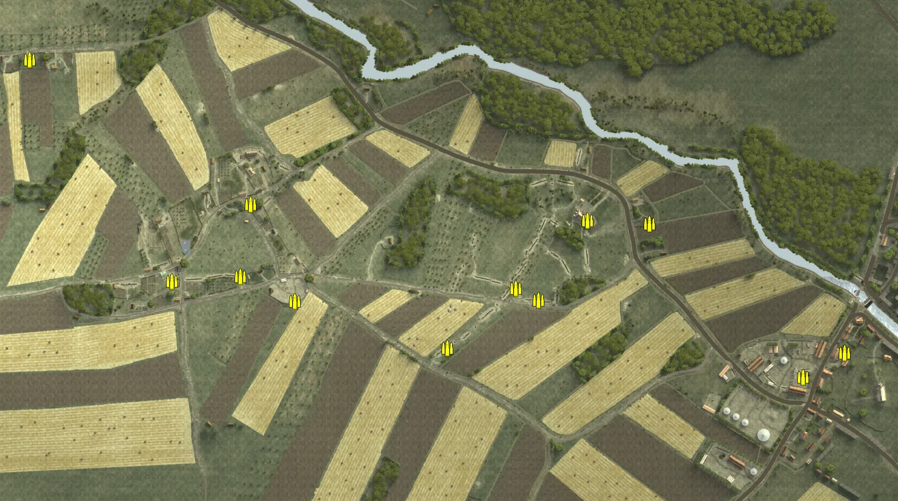
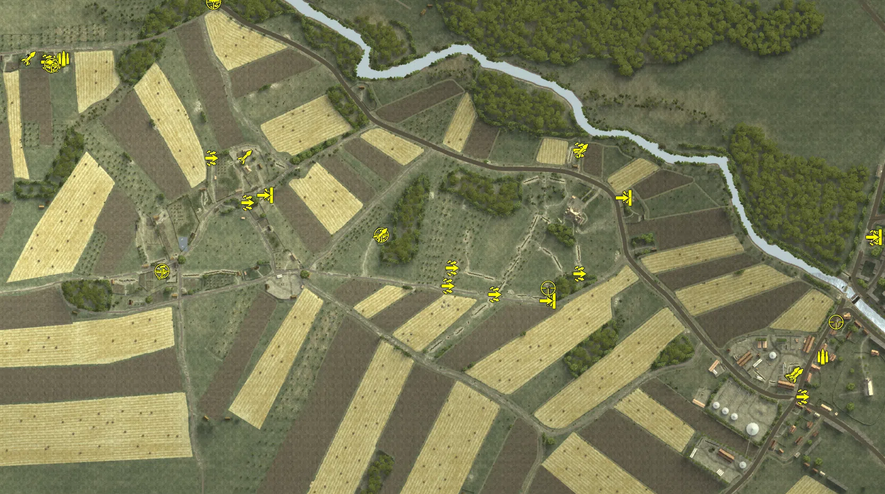
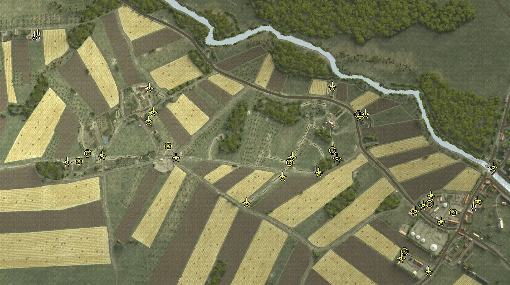
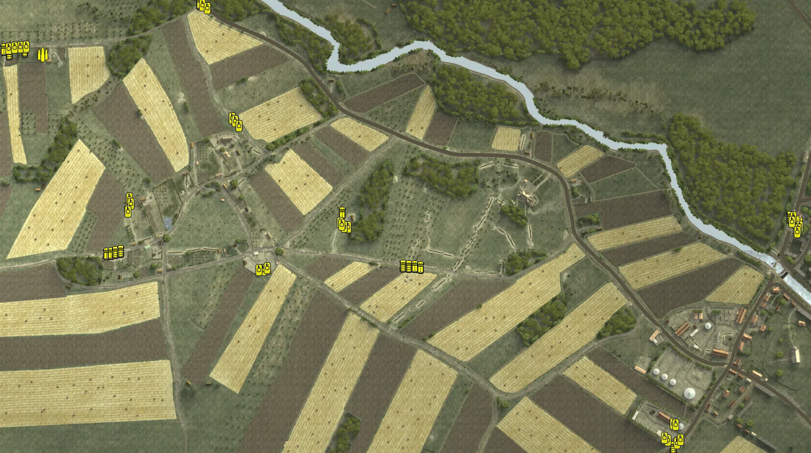

Static Ammo Crate

Pickup Kit

Static Emplacement

Vehicle

| Icon                      | SubCat            | Cat                | Name                      | Instance                                             |   Flag |    X Pos |   Y Pos |    Z Pos |
|:--------------------------|:------------------|:-------------------|:--------------------------|:-----------------------------------------------------|-------:|---------:|--------:|---------:|
|     | Static Ammo Crate | Static Ammo Crate  | ammo_crate                | ammo_crate_0                                         |      0 | -567.986 |  34.921 |   -8.766 |
|     | Static Ammo Crate | Static Ammo Crate  | ammo_crate                | ammo_crate_1                                         |      0 | -421.722 |  29.029 |  133.958 |
|     | Static Ammo Crate | Static Ammo Crate  | ammo_crate                | ammo_crate_2                                         |      0 | -831.878 |  27.287 |  403.466 |
|     | Static Ammo Crate | Static Ammo Crate  | ammo_crate                | ammo_crate_3                                         |      0 | -340.171 |  31.484 |  -45.801 |
|     | Static Ammo Crate | Static Ammo Crate  | ammo_crate                | ammo_crate_4                                         |      0 |   69.768 |  24.235 |  -21.984 |
|     | Static Ammo Crate | Static Ammo Crate  | ammo_crate                | ammo_crate_5                                         |      0 |  317.750 |   5.910 |   97.612 |
|     | Static Ammo Crate | Static Ammo Crate  | ammo_crate                | ammo_crate_6                                         |      0 |  603.328 |   8.115 | -186.662 |
|     | Static Ammo Crate | Static Ammo Crate  | ammo_crate                | ammo_crate_7                                         |      0 |  679.667 |   7.109 | -142.221 |
|     | Static Ammo Crate | Static Ammo Crate  | ammo_crate                | ammo_crate_8                                         |      0 |  -57.037 |  25.884 | -133.253 |
|     | Static Ammo Crate | Static Ammo Crate  | ammo_crate                | ammo_crate_9                                         |      0 | -440.813 |  34.219 |    0.409 |
|     | Static Ammo Crate | Static Ammo Crate  | ammo_crate                | ammo_crate_10                                        |      0 |  112.119 |  22.873 |  -43.740 |
|     | Static Ammo Crate | Static Ammo Crate  | ammo_crate                | ammo_crate_11                                        |      0 |  203.035 |  14.453 |  103.537 |
|     | Ammo Kit          | Pickup Kit         | GW_PickUpAmmokit          | CP_64_ogledow_axismain_ammo1                         |      1 | -777.234 |  23.824 |  399.422 |
|     | Ammo Kit          | Pickup Kit         | GW_PickUpAmmokit          | CP_64_ogledow_axismain_ammo2                         |      1 | -767.360 |  23.249 |  404.229 |
|     | Ammo Kit          | Pickup Kit         | RE_PickUpAmmokit_early    | CP_64_ogledow_staszowindustrialarea_ammo             |    107 |  662.259 |   8.072 | -157.545 |
|  | Assault Kit       | Pickup Kit         | GW_PickUpAssaultStG44     | CP_64_ogledow_axismain_assault1                      |      1 | -788.296 |  25.196 |  391.313 |
|  | Assault Kit       | Pickup Kit         | GW_PickUpAssaultStG44     | CP_64_ogledow_axismain_assault2                      |      1 | -798.605 |  25.887 |  397.062 |
|  | Assault Kit       | Pickup Kit         | RE_PickUpAssaultSVT40     | CP_64_ogledow_barn_assaultru                         |    102 | -422.045 |  29.703 |  132.161 |
|  | Assault Kit       | Pickup Kit         | GW_PickUpAssaultStG44     | CP_64_ogledow_barn_assaultger                        |    102 | -489.608 |  29.033 |  215.707 |
|  | Assault Kit       | Pickup Kit         | RE_PickUpAssaultAVT40     | CP_64_ogledow_observationpost_assaultru              |    101 | -584.276 |  35.196 |    2.389 |
|  | Assault Kit       | Pickup Kit         | RE_PickUpAssaultSVT40     | CP_64_ogledow_defenseline_assaultru                  |    104 |   43.139 |  27.116 |  -41.064 |
|  | Assault Kit       | Pickup Kit         | GW_PickUpAssaultG41       | CP_64_ogledow_defenseline_assaultger1                |    104 |  -45.033 |  30.331 |  -24.741 |
|  | Assault Kit       | Pickup Kit         | GE_PickUpAssaultPPsH41    | CP_64_ogledow_defenseline_assaultger2                |    104 |  -36.687 |  28.911 |    9.092 |
|  | Assault Kit       | Pickup Kit         | RE_PickUpAssaultAVT40     | CP_64_ogledow_manor_assaultru                        |    105 |  203.087 |  16.479 |   -1.893 |
|  | Assault Kit       | Pickup Kit         | GW_PickUpAssaultStG44     | CP_64_ogledow_manor_assaultger                       |    105 |  203.195 |   7.274 |  230.807 |
|  | Assault Kit       | Pickup Kit         | RE_PickUpAssaultAVT40     | CP_64_ogledow_staszowindustrialarea_assaultru1       |    107 |  623.441 |  10.088 | -233.585 |
|  | Assault Kit       | Pickup Kit         | RE_PickUpAssaultSVT40     | CP_64_ogledow_staszowindustrialarea_assaultru2       |    107 |  757.802 |  11.849 |   65.815 |
|  | Assault Kit       | Pickup Kit         | GW_PickUpAssaultStG44     | CP_64_ogledow_sectorlock2dummy_assault               |    106 | -169.741 |  29.309 |   70.962 |
|  | Assault Kit       | Pickup Kit         | GW_PickUpAssaultG41       | CP_64_ogledow_axismain_assault3                      |      1 | -483.289 |  14.699 |  511.546 |
|   | AT Rifle          | Pickup Kit         | RE_PickUpAntitankPTRD     | CP_64_ogledow_barn_antitankru                        |    102 | -388.396 |  29.658 |  146.195 |
|   | AT Rifle          | Pickup Kit         | RE_PickUpAntitankPTRD     | CP_64_ogledow_defenseline_antitankru                 |    104 |  143.668 |  23.502 |  -53.183 |
|   | AT Rifle          | Pickup Kit         | RE_PickUpAntitankPTRD     | CP_64_ogledow_manor_antitankru                       |    105 |  286.508 |   6.347 |  140.646 |
|   | AT Rifle          | Pickup Kit         | RE_PickUpAntitankPTRD     | CP_64_ogledow_staszowindustrialarea_antitankru       |    107 |  758.486 |  11.929 |   66.909 |
|      | Deployable MG     | Pickup Kit         | GW_PickUpMG42Lafette      | CP_64_ogledow_axismain_hmg                           |      1 | -834.303 |  27.308 |  404.006 |
|   | Sniper Kit        | Pickup Kit         | GW_PickUpSniperg43_ZF     | CP_64_ogledow_axismain_sniper                        |      1 | -789.746 |  25.190 |  391.144 |
|   | Sniper Kit        | Pickup Kit         | RE_PickUpSniperSVT40      | CP_64_ogledow_observationpost_sniperru               |    101 | -582.261 |  35.199 |    3.018 |
|   | Sniper Kit        | Pickup Kit         | RE_PickUpSniper           | CP_64_ogledow_defenseline_sniperru                   |    104 |  145.109 |  22.378 |  -29.492 |
|   | Sniper Kit        | Pickup Kit         | RE_PickUpSniper           | CP_64_ogledow_staszowindustrialarea_sniper           |    107 |  686.979 |  10.002 |  -92.657 |
|   | Sniper Kit        | Pickup Kit         | GW_PickUpSniperg43_ZF     | CP_64_ogledow_sectorlock2dummy_sniper                |    106 | -168.996 |  29.317 |   70.689 |
|   | Sniper Kit        | Pickup Kit         | GW_PickUpSniperg43_ZF     | CP_64_ogledow_axismain_sniper2                       |      1 | -485.188 |  14.466 |  509.616 |
|   | HEAT Thrower      | Pickup Kit         | GW_PickUpPanzerschreck    | CP_64_ogledow_axismain_antitank                      |      1 | -833.058 |  28.045 |  403.940 |
|   | HEAT Thrower      | Pickup Kit         | GW_PickUpPanzerschreck    | CP_64_ogledow_barn_antitankger                       |    102 | -426.427 |  24.143 |  217.735 |
|   | HEAT Thrower      | Pickup Kit         | GW_PickUpPanzerschreck    | CP_64_ogledow_manor_antitankger                      |    105 |  206.678 |   7.627 |  230.281 |
|   | HEAT Thrower      | Pickup Kit         | GW_PickUpPanzerschreck    | CP_64_ogledow_sectorlock2dummy_schreck               |    106 | -170.954 |  29.352 |   70.555 |
|   | HEAT Thrower      | Pickup Kit         | RE_PickUpTankhunter_faust | CP_64_ogledow_staszowindustrialarea_faust1           |    107 |  605.931 |   8.469 | -193.077 |
|   | HEAT Thrower      | Pickup Kit         | RE_PickUpTankhunter_faust | CP_64_ogledow_staszowindustrialarea_faust2           |    107 |  604.386 |   8.231 | -190.062 |
|   | HEAT Thrower      | Pickup Kit         | RE_PickUpTankhunter_faust | CP_64_ogledow_staszowindustrialarea_faust3           |    107 |  605.018 |   8.311 | -191.126 |
|   | HEAT Thrower      | Pickup Kit         | RE_PickUpTankhunter_faust | CP_64_ogledow_staszowindustrialarea_faust4           |    107 |  612.109 |   7.686 | -194.485 |
|     | Artillery         | Static Emplacement | wurfgerat41               | CP_64_ogledow_axismain_wurf1                         |      1 | -775.028 |  23.583 |  398.113 |
|     | Artillery         | Static Emplacement | wurfgerat41               | CP_64_ogledow_axismain_wurf2                         |      1 | -764.517 |  23.153 |  404.210 |
|     | Artillery         | Static Emplacement | ru_mortar120mm            | CP_64_ogledow_staszowindustrialarea_howitzer         |    107 |  659.031 |   7.007 | -157.958 |
|      | Static MG         | Static Emplacement | maxim_mg                  | CP_64_ogledow_observationpost_maxim1                 |    101 | -629.006 |  34.810 |  -12.436 |
|      | Static MG         | Static Emplacement | maxim_mg                  | CP_64_ogledow_observationpost_maxim2                 |    101 | -599.526 |  34.695 |   13.369 |
|      | Static MG         | Static Emplacement | maxim_mg_sandbag          | CP_64_ogledow_sectorlock1dummy_maxim1                |    103 | -337.867 |  33.872 |   36.772 |
|      | Static MG         | Static Emplacement | maxim_mg                  | CP_64_ogledow_defenseline_maxim1                     |    104 |   60.209 |  25.197 |  -15.821 |
|      | Static MG         | Static Emplacement | maxim_mg                  | CP_64_ogledow_manor_maxim1                           |    105 |  284.498 |   7.023 |  139.527 |
|      | Static MG         | Static Emplacement | maxim_mg_sandbag          | CP_64_ogledow_staszowindustrialarea_mg               |    107 |  516.496 |   8.651 | -151.827 |
|      | Static MG         | Static Emplacement | maxim_mg                  | CP_64_ogledow_manor_mg3                              |    105 |  200.138 |  15.146 |   22.208 |
|      | Static MG         | Static Emplacement | maxim_mg                  | CP_64_ogledow_staszowindustrialarea_hmg              |    107 |  435.411 |  12.188 | -307.583 |
|      | Static MG         | Static Emplacement | maxim_mg                  | CP_64_ogledow_staszowindustrialarea_hmg2             |    107 |  593.135 |   8.115 | -179.251 |
|      | Anti-tank Gun     | Static Emplacement | zis3_static               | CP_64_ogledow_barn_atgun1                            |    102 | -400.315 |  23.662 |  227.859 |
|      | Anti-tank Gun     | Static Emplacement | zis3_static               | CP_64_ogledow_barn_atgun2                            |    102 | -386.695 |  30.081 |  150.274 |
|      | Anti-tank Gun     | Static Emplacement | zis3_static               | CP_64_ogledow_observationpost_atgun1                 |    101 | -668.302 |  34.771 |  -14.095 |
|      | Anti-tank Gun     | Static Emplacement | zis3_static               | CP_64_ogledow_sectorlock1dummy_atgun1                |    103 | -312.919 |  33.106 |    1.143 |
|      | Anti-tank Gun     | Static Emplacement | zis3_static               | CP_64_ogledow_defenseline_atgun1                     |    104 |  -83.322 |  24.523 | -147.130 |
|      | Anti-tank Gun     | Static Emplacement | zis3_static               | CP_64_ogledow_defenseline_atgun2                     |    104 |   35.016 |  27.861 |  -62.400 |
|      | Anti-tank Gun     | Static Emplacement | zis3_static               | CP_64_ogledow_defenseline_atgun3                     |    104 |   67.038 |  24.218 |    2.502 |
|      | Anti-tank Gun     | Static Emplacement | zis2                      | CP_64_ogledow_defenseline_atgunmobile                |    104 |  152.825 |  23.064 |  -47.843 |
|      | Anti-tank Gun     | Static Emplacement | zis3_static               | CP_64_ogledow_manor_atgun1                           |    105 |  197.524 |   7.429 |  233.053 |
|      | Anti-tank Gun     | Static Emplacement | zis3_static               | CP_64_ogledow_manor_atgun2                           |    105 |  288.108 |   6.810 |  133.804 |
|      | Anti-tank Gun     | Static Emplacement | zis3_static               | CP_64_ogledow_staszowindustrialarea_atgun1           |    107 |  467.158 |   7.398 | -173.921 |
|      | Anti-tank Gun     | Static Emplacement | zis3_static               | CP_64_ogledow_staszowindustrialarea_atgun2           |    107 |  493.451 |   6.243 | -154.523 |
|      | Anti-tank Gun     | Static Emplacement | zis3_static               | CP_64_ogledow_staszowindustrialarea_atgun3           |    107 |  519.278 |   5.516 | -122.709 |
|      | Anti-tank Gun     | Static Emplacement | zis2                      | CP_64_ogledow_staszowindustrialarea_mobileat         |    107 |  674.047 |   6.804 | -140.470 |
|      | Anti-tank Gun     | Static Emplacement | zis3_static               | CP_64_ogledow_sectorlock2dummy_at                    |    106 |  423.413 |  12.186 | -328.004 |
|      | Anti-tank Gun     | Static Emplacement | zis2                      | CP_64_ogledow_sectorlock2dummy_mobileat              |    106 |  512.184 |  11.573 | -372.023 |
|      | Anti-tank Gun     | Static Emplacement | zis3_static               | CP_64_ogledow_manor_atgun3                           |    105 |  213.291 |  16.165 |   -1.137 |
|      | Anti-tank Gun     | Static Emplacement | m1942_45mm                | CP_64_ogledow_observationpost_45mm                   |    101 | -554.345 |  35.000 |    8.380 |
|      | Anti-tank Gun     | Static Emplacement | m1942_45mm                | CP_64_ogledow_barn_45mm                              |    102 | -403.152 |  30.450 |  121.322 |
|      | Anti-tank Gun     | Static Emplacement | m1942_45mm                | CP_64_ogledow_manor_45mm                             |    105 |  305.838 |   5.469 |  143.087 |
|      | Anti-tank Gun     | Static Emplacement | m1942_45mm                | CP_64_ogledow_staszowindustrialarea_45mm             |    107 |  552.489 |   6.566 | -208.472 |
|      | Anti-tank Gun     | Static Emplacement | zis3_static               | CP_64_ogledow_staszowindustrialarea_atgunbasedefence |    107 |  721.914 |   5.718 |  -30.238 |
|      | APC               | Vehicle            | sdkfz251_d                | CP_64_ogledow_axismain_ht2                           |      1 | -878.738 |  30.532 |  413.239 |
|      | APC               | Vehicle            | sdkfz251_d                | CP_64_ogledow_axismain_ht3                           |      1 | -477.338 |  14.528 |  507.548 |
|      | APC               | Vehicle            | sdkfz251_d                | CP_64_ogledow_sectorlock2dummy_ht2                   |    106 |  -34.895 |  30.079 |  -33.352 |
|      | APC               | Vehicle            | sdkfz251_d                | CP_64_ogledow_sectorlock2dummy_ht3                   |    106 |  -22.902 |  29.748 |  -34.663 |
|      | APC               | Vehicle            | sdkfz251_d                | CP_64_ogledow_sectorlock1dummy_ht1                   |    103 | -667.707 |  34.602 |   -7.065 |
|      | APC               | Vehicle            | sdkfz251_d                | CP_64_ogledow_sectorlock1dummy_ht2                   |    103 | -659.195 |  34.444 |   -5.754 |
|      | APC               | Vehicle            | sdkfz251_d                | CP_64_ogledow_sectorlock2dummy_apc                   |    106 | -183.506 |  27.505 |   76.507 |
|      | Car               | Vehicle            | opelblitz_fr_nocanvas     | CP_64_ogledow_axismain_ht1                           |      1 | -836.382 |  27.668 |  409.667 |
|      | Car               | Vehicle            | opelblitz_fr_nocanvas     | CP_64_ogledow_sectorlock2dummy_ht1                   |    106 |  -47.079 |  30.228 |  -33.259 |
|      | Car               | Vehicle            | opelblitz_fr_slats        | CP_64_ogledow_sectorlock1dummy_ht3                   |    103 | -650.310 |  34.285 |   -4.034 |
|      | Car               | Vehicle            | studebaker_us6            | CP_64_ogledow_sectorlock2dummy_truck                 |    106 |  496.258 |  11.122 | -404.863 |
|      | Car               | Vehicle            | opelblitz_fr              | CP_64_ogledow_axismain_truck1                        |      1 | -867.990 |  29.587 |  404.352 |
|      | Car               | Vehicle            | opelblitz_fr              | CP_64_ogledow_sectorlock1dummy_truck1                |    103 | -638.880 |  34.142 |   -2.021 |
|      | Car               | Vehicle            | opelblitz_fr              | CP_64_ogledow_sectorlock2dummy_truck1                |    106 |  -58.852 |  30.324 |  -31.854 |
|      | Car               | Vehicle            | studebaker_us6            | CP_64_ogledow_staszowindustrialarea_truck1           |    107 |  735.612 |  11.251 |   67.825 |
|     | Supply Vehicle    | Vehicle            | opelblitz_fr_ammo         | CP_64_ogledow_axismain_ammotruck                     |      1 | -798.999 |  25.734 |  402.091 |
|     | Supply Vehicle    | Vehicle            | studebaker_us6_ammo       | CP_64_ogledow_staszowindustrialarea_ammotruck        |    107 |  751.528 |  11.220 |   55.890 |
|     | Tank              | Vehicle            | pzivh                     | CP_64_ogledow_axismain_panzeriv1                     |      1 | -844.691 |  28.693 |  417.267 |
|     | Tank              | Vehicle            | pzivh_noskirt             | CP_64_ogledow_axismain_panzeriv2                     |      1 | -833.239 |  28.066 |  418.435 |
|     | Tank              | Vehicle            | pzivh                     | CP_64_ogledow_axismain_pziv3                         |      1 | -470.742 |  14.925 |  502.991 |
|     | Tank              | Vehicle            | pzivh                     | CP_64_ogledow_axismain_panzeriv4                     |      1 | -461.456 |  15.423 |  496.986 |
|     | Tank              | Vehicle            | t34_85_early              | CP_64_ogledow_sectorlock1dummy_t34_1                 |    103 | -345.920 |  31.827 |  -40.984 |
|     | Tank              | Vehicle            | t34_85_late               | CP_64_ogledow_sectorlock1dummy_t34_2                 |    103 | -338.232 |  31.989 |  -37.183 |
|     | Tank              | Vehicle            | t34_85_late               | CP_64_ogledow_sectorlock1dummy_t34_3                 |    103 | -354.633 |  31.817 |  -41.274 |
|     | Tank              | Vehicle            | t34_85_late               | CP_64_ogledow_sectorlock2dummy_t34_1                 |    106 |  485.304 |  11.609 | -391.014 |
|     | Tank              | Vehicle            | t34_85_early              | CP_64_ogledow_sectorlock2dummy_t34_2                 |    106 |  478.034 |  11.718 | -385.982 |
|     | Tank              | Vehicle            | isu_122                   | CP_64_ogledow_sectorlock2dummy_su152                 |    106 |  495.528 |  11.766 | -356.512 |
|     | Tank              | Vehicle            | t34_85_late               | CP_64_ogledow_sectorlock2dummy_t34_3                 |    106 |  501.178 |  11.772 | -358.653 |
|     | Tank              | Vehicle            | kingtiger_standard        | CP_64_ogledow_sectorlock2dummy_kt1                   |    106 | -172.456 |  29.630 |   47.071 |
|     | Tank              | Vehicle            | kingtiger_standard        | CP_64_ogledow_sectorlock2dummy_kt2                   |    106 | -180.243 |  29.584 |   47.764 |
|     | Tank              | Vehicle            | pzivh_noskirt             | CP_64_ogledow_sectorlock2dummy_pzIV_1                |    106 | -188.465 |  29.038 |   55.970 |
|     | Tank              | Vehicle            | pzivh                     | CP_64_ogledow_sectorlock2dummy_pzIV_2                |    106 | -184.815 |  29.329 |   51.915 |
|     | Tank              | Vehicle            | t34_85_early              | CP_64_ogledow_staszowindustrialarea_t3485_1          |    107 |  743.252 |  11.392 |   67.074 |
|     | Tank              | Vehicle            | t34_85_late               | CP_64_ogledow_staszowindustrialarea_t3485_2          |    107 |  740.446 |  10.779 |   57.717 |
|     | Tank              | Vehicle            | is_2                      | CP_64_ogledow_staszowindustrialarea_is2_1            |    107 |  755.523 |  11.144 |   48.294 |
|     | Tank              | Vehicle            | is_2                      | CP_64_ogledow_staszowindustrialarea_is2_2            |    107 |  753.449 |  10.689 |   41.798 |
|     | Tank              | Vehicle            | isu_122                   | CP_64_ogledow_staszowindustrialarea_su152            |    107 |  751.039 |  10.174 |   36.523 |
|     | Tank              | Vehicle            | kingtiger_standard        | CP_64_ogledow_axismain_kt1                           |      1 | -869.389 |  30.014 |  414.211 |
|     | Tank              | Vehicle            | kingtiger_standard        | CP_64_ogledow_axismain_kt2                           |      1 | -857.101 |  30.879 |  415.683 |
|     | Tank              | Vehicle            | t34_85_early              | CP_64_ogledow_sectorlock2dummy_t34_4                 |    106 |  503.732 |  11.122 | -397.049 |
|     | Tank              | Vehicle            | t34_85_late               | CP_64_ogledow_sectorlock2dummy_t34_5                 |    106 |  511.166 |  11.176 | -389.769 |
|     | Tank              | Vehicle            | pzivh_noskirt             | CP_64_ogledow_sectorlock1dummy_pzIV1                 |    103 | -620.947 |  33.204 |  106.303 |
|     | Tank              | Vehicle            | pzivh                     | CP_64_ogledow_sectorlock1dummy_panther1              |    103 | -617.780 |  33.156 |   95.156 |
|     | Tank              | Vehicle            | kingtiger_standard        | CP_64_ogledow_sectorlock1dummy_kt1                   |    103 | -623.741 |  33.496 |   79.308 |
|     | Tank              | Vehicle            | pzivh                     | CP_64_ogledow_sectorlock1dummy_pziv2                 |    103 | -410.208 |  24.418 |  271.161 |
|     | Tank              | Vehicle            | pzivh                     | CP_64_ogledow_sectorlock1dummy_panther2              |    103 | -404.014 |  23.828 |  265.054 |
|     | Tank              | Vehicle            | kingtiger_standard        | CP_64_ogledow_sectorlock1dummy_kt2                   |    103 | -395.597 |  23.028 |  255.156 |

